# Python 中计算机视觉的现代 GUI 应用程序

> 原文：[`towardsdatascience.com/modern-gui-applications-for-computer-vision-in-python/`](https://towardsdatascience.com/modern-gui-applications-for-computer-vision-in-python/)

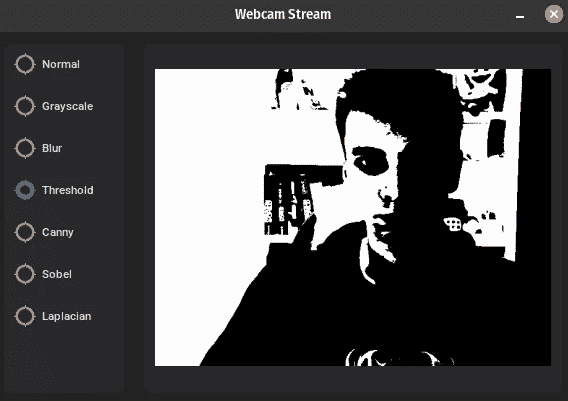

## <mdspan datatext="el1746063411947" class="mdspan-comment">简介</mdspan>

我是一个交互式可视化的超级粉丝。作为一名计算机视觉工程师，我几乎每天都要处理与图像处理相关的任务，而且往往是在需要**视觉反馈**来做出决策的问题上进行迭代。让我们考虑一个非常简单的图像处理流程，其中包含一个具有一些参数以转换图像的单个步骤：

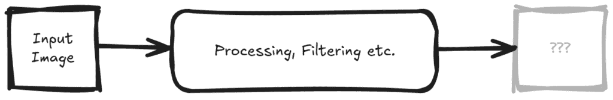

您如何知道要调整哪些参数？该流程是否按预期工作？如果没有可视化您的输出，您可能会错过一些关键见解并做出次优选择。

有时仅显示输出图像和/或一些计算出的指标就足以对参数进行迭代。但我发现自己处于许多需要快速、交互式迭代我的流程的工具将非常有帮助的情况。因此，在这篇文章中，我将向您展示如何使用`OpenCV`中的简单内置交互元素，以及如何使用`customtkinter`为计算机视觉项目构建更现代的用户界面。

## 前提条件

如果您想跟上，我建议您使用[uv](https://docs.astral.sh/uv/)设置您的本地环境，并安装以下包：

```py
uv add numpy opencv-python pillow customtkinter
```

## 目标

在我们深入到项目的代码之前，让我们快速概述一下我们想要构建的内容。该应用程序应使用网络摄像头流，并允许用户选择要应用于流的过滤器类型。处理后的图像应在窗口中实时显示。一个潜在 UI 的粗略草图如下所示：

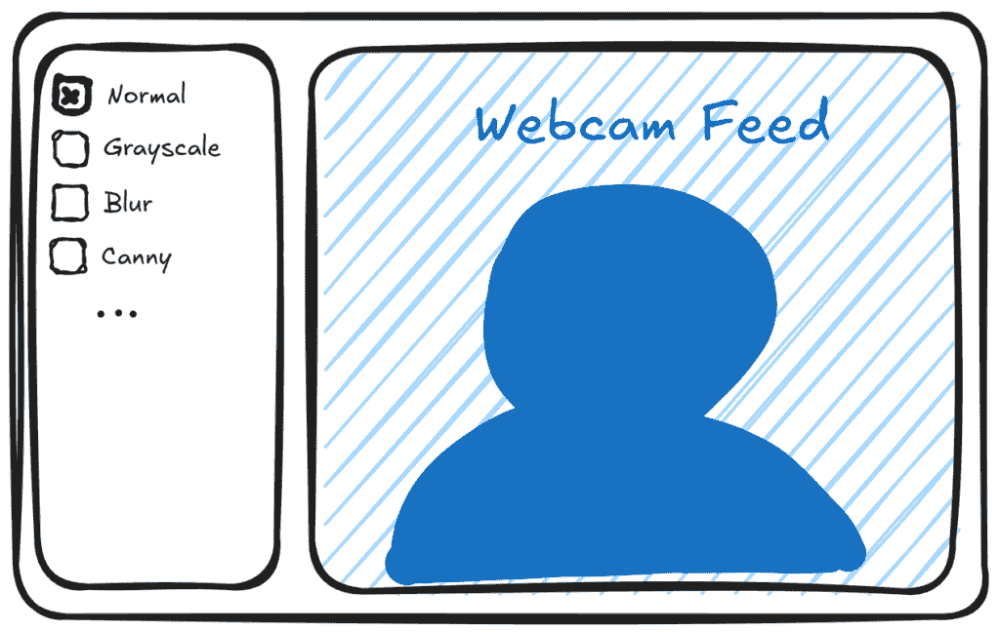

## OpenCV – GUI

让我们从一个非常简单的循环开始，这个循环从您的网络摄像头中获取帧并在 OpenCV 窗口中显示它们。

```py
import cv2

cap = cv2.VideoCapture(0)

while True:
    ret, frame = cap.read()
    if not ret:
        break

    cv2.imshow("Video Feed", frame)

    key = cv2.waitKey(1) & 0xFF
    if key == ord('q'):
        break

cap.release()
cv2.destroyAllWindows()
```

### 键盘输入

在这里添加交互性的最简单方法是通过添加键盘输入。例如，我们可以使用数字键循环切换不同的过滤器。

```py
...

filter_type = "normal"

while True:
    ...

    if filter_type == "grayscale":
        frame = cv2.cvtColor(frame, cv2.COLOR_BGR2GRAY)
    elif filter_type == "normal":
        pass

    ...

    if key == ord('1'):
        filter_type = "normal"
    if key == ord('2'):
        filter_type = "grayscale"

    ...
```

现在您可以通过按数字键 1 和 2 在正常图像和灰度版本之间切换。让我们也快速给图像添加一个标题，这样我们就可以真正看到我们正在应用的过滤器名称。

现在我们需要小心：如果您查看过滤器后的帧的形状，您会注意到帧数组的维度已经改变。请记住，OpenCV 图像数组是按**HWC**（高度、宽度、颜色）顺序排列的，颜色为**BGR**（绿色、蓝色、红色），因此我的网络摄像头的 640×480 图像的形状为`(480, 640, 3)`。

```py
print(filter_type, frame.shape)
# normal (480, 640, 3)
# grayscale (480, 640)
```

因为灰度操作输出的是单通道图像，所以颜色维度被丢弃了。如果我们现在想在上面绘制图像，我们要么需要为灰度图像指定一个单通道颜色，要么将图像转换回原始**BGR**格式。第二种方法更干净一些，因为我们可以在图像的注释上统一。

```py
if filter_type == "grayscale":
    frame = cv2.cvtColor(frame, cv2.COLOR_BGR2GRAY)
elif filter_type == "normal":
    pass

if len(frame.shape) == 2: # Convert grayscale to BGR
    frame = cv2.cvtColor(frame, cv2.COLOR_GRAY2BGR)
```

### 标题

我想在图像底部添加一个黑色边框，在其上方将显示过滤器的名称。我们可以使用`copyMakeBorder`函数在底部用边框颜色填充图像。然后我们可以在这个边框上添加文本。

```py
# Add a black border at the bottom of the frame
border_height = 50
border_color = (0, 0, 0)
frame = cv2.copyMakeBorder(frame, 0, border_height, 0, 0, cv2.BORDER_CONSTANT, value=border_color)

# Show the filter name
cv2.putText(
    frame,
    filter_type,
    (frame.shape[1] // 2 - 50, frame.shape[0] - border_height // 2 + 10),
    cv2.FONT_HERSHEY_SIMPLEX,
    1,
    (255, 255, 255),
    2,
    cv2.LINE_AA,
)
```

这就是输出应该看起来像的样子，你可以在这两种模式之间切换：正常模式和灰度模式，并且相应的帧将被标注。

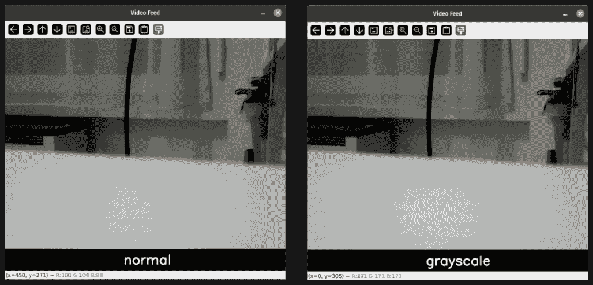

### 滑块

现在不再使用键盘作为输入方法，OpenCV 提供了一个基本的滑块 UI 元素。滑块需要在脚本开始时初始化。我们需要引用我们将要显示图像的相同窗口，所以我将创建一个变量来存储窗口名称。使用这个名称，我们可以创建滑块，并让它成为过滤器列表索引的选择器。

```py
filter_types = ["normal", "grayscale"]

win_name = "Webcam Stream"
cv2.namedWindow(win_name)

tb_filter = "Filter"
# def createTrackbar(trackbarName: str, windowName: str, value: int, count: int, onChange: _typing.Callable[[int], None]) -> None: ...
cv2.createTrackbar(
    tb_filter,
    win_name,
    0,
    len(filter_types) - 1,
    lambda _: None,
)
```

注意我们如何使用一个空的 lambda 函数作为`onChange`回调，我们将在循环中手动获取值。其他一切都将保持不变。

```py
while True:
    ...

    # Get the selected filter type
    filter_id = cv2.getTrackbarPos(tb_filter, win_name)
    filter_type = filter_types[filter_id]

    ...
```

哇，我们有一个滑块来选择我们的过滤器。

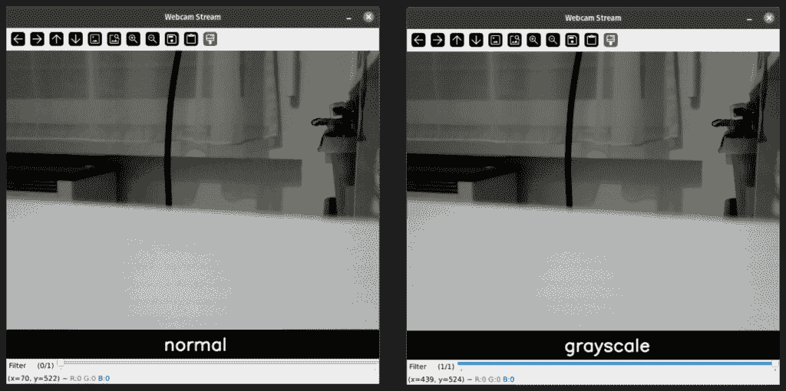

现在我们可以通过扩展我们的列表并实现每个处理步骤来轻松地添加更多过滤器。

```py
filter_types = [
    "normal",
    "grayscale",
    "blur",
    "threshold",
    "canny",
    "sobel",
    "laplacian",
]

...

    if filter_type == "grayscale":
        frame = cv2.cvtColor(frame, cv2.COLOR_BGR2GRAY)
    elif filter_type == "blur":
        frame = cv2.GaussianBlur(frame, ksize=(15, 15), sigmaX=0)
    elif filter_type == "threshold":
        gray = cv2.cvtColor(frame, cv2.COLOR_BGR2GRAY)
        _, thresholded_frame = cv2.threshold(gray, thresh=127, maxval=255, type=cv2.THRESH_BINARY)
    elif filter_type == "canny":
        frame = cv2.Canny(frame, threshold1=100, threshold2=200)
    elif filter_type == "sobel":
        frame = cv2.Sobel(frame, ddepth=cv2.CV_64F, dx=1, dy=0, ksize=5)
    elif filter_type == "laplacian":
        frame = cv2.Laplacian(frame, ddepth=cv2.CV_64F)
    elif filter_type == "normal":
        pass

    if frame.dtype != np.uint8:
        # Scale the frame to uint8 if necessary
        cv2.normalize(frame, frame, 0, 255, cv2.NORM_MINMAX)
        frame = frame.astype(np.uint8) 
```

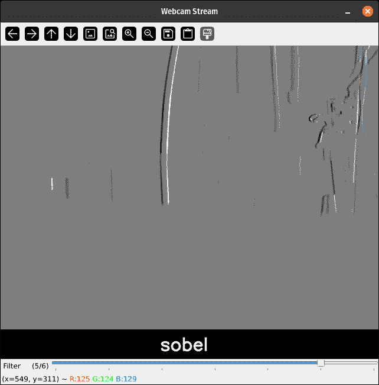

## 使用 CustomTkinter 的现代 GUI

现在我不知道你们的情况，但在我看来，当前的用户界面并不非常*现代*。请别误会，界面的风格中确实有一些美感，但我更喜欢更干净、更现代的设计。此外，我们已经在 UI 元素方面达到了**OpenCV**提供的即用功能的极限。是的，没有按钮、文本字段、下拉菜单、复选框或单选按钮，也没有自定义布局。所以让我们看看我们如何将这个基本应用程序的外观和用户体验转变为一个新鲜且干净的样子。

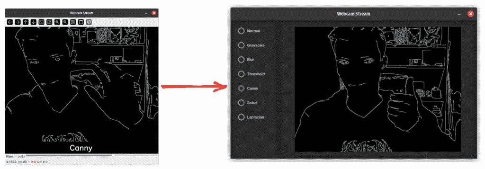

要开始，我们首先需要为我们的应用程序创建一个类。我们创建两个框架：第一个框架包含左侧的过滤器选择，第二个框架包裹图像显示。目前，让我们从一个简单的占位文本开始。不幸的是，从 customtkinter 中并没有现成的 opencv 组件，所以我们需要在接下来的几个步骤中快速构建自己的组件。但首先，让我们完成基本的 UI 布局。

```py
import customtkinter

class App(customtkinter.CTk):
    def __init__(self) -> None:
        super().__init__()

        self.title("Webcam Stream")
        self.geometry("800x600")

        self.filter_var = customtkinter.IntVar(value=0)

        # Frame for filters
        self.filters_frame = customtkinter.CTkFrame(self)
        self.filters_frame.pack(side="left", fill="both", expand=False, padx=10, pady=10)

        # Frame for image display
        self.image_frame = customtkinter.CTkFrame(self)
        self.image_frame.pack(side="right", fill="both", expand=True, padx=10, pady=10)

        self.image_display = customtkinter.CTkLabel(self.image_frame, text="Loading...")
        self.image_display.pack(fill="both", expand=True, padx=10, pady=10)

app = App()
app.mainloop()
```

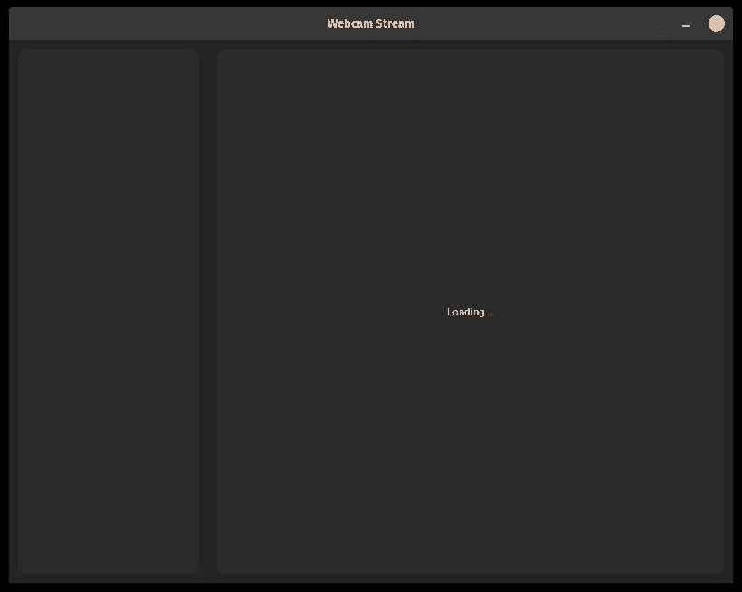

### 过滤器单选按钮

现在骨架已经搭建好了，我们可以开始填充我们的组件。对于左侧，我将使用相同的`filter_types`列表来填充一组单选按钮以选择过滤器。

```py
 # Create radio buttons for each filter type
        self.filter_var = customtkinter.IntVar(value=0)
        for filter_id, filter_type in enumerate(filter_types):
            rb_filter = customtkinter.CTkRadioButton(
                self.filters_frame,
                text=filter_type.capitalize(),
                variable=self.filter_var,
                value=filter_id,
            )
            rb_filter.pack(padx=10, pady=10)

            if filter_id == 0:
                rb_filter.select()
```

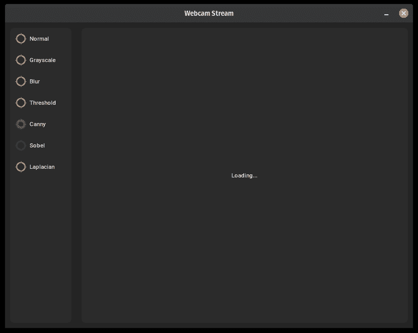

### 图像显示组件

现在我们可以开始有趣的部分了，那就是如何让我们的 OpenCV 帧在图像组件中显示出来。因为没有内置的组件，让我们基于`CTKLabel`创建自己的组件。这允许我们在摄像头流启动时显示加载文本。

```py
...

class CTkImageDisplay(customtkinter.CTkLabel):
    """
    A reusable ctk widget widget to display opencv images.
    """

    def __init__(
        self,
        master: Any,
    ) -> None:
        self._textvariable = customtkinter.StringVar(master, "Loading...")
        super().__init__(
            master,
            textvariable=self._textvariable,
            image=None,
        )

...

class App(customtkinter.CTk):
    def __init__(self) -> None:
        ...

        self.image_display = CTkImageDisplay(self.image_frame)
        self.image_display.pack(fill="both", expand=True, padx=10, pady=10) 
```

到目前为止，没有什么变化，我们只是用我们的自定义类实现替换了现有的标签。在我们的`CTKImageDisplay`类中，我们可以定义一个函数来在组件中显示图像，让我们称它为`set_frame`。

```py
import cv2
import numpy.typing as npt
from PIL import Image

class CTkImageDisplay(customtkinter.CTkLabel):
    ...

    def set_frame(self, frame: npt.NDArray) -> None:
        """
        Set the frame to be displayed in the widget.

        Args:
            frame: The new frame to display, in opencv format (BGR).
        """
        target_width, target_height = frame.shape[1], frame.shape[0]

        # Convert the frame to PIL Image format
        frame_rgb = cv2.cvtColor(frame, cv2.COLOR_BGR2RGB)
        frame_pil = Image.fromarray(frame_rgb, "RGB")

        ctk_image = customtkinter.CTkImage(
            light_image=frame_pil,
            dark_image=frame_pil,
            size=(target_width, target_height),
        )
        self.configure(image=ctk_image, text="")
        self._textvariable.set("")
```

让我们消化一下。首先，我们需要知道我们的图像组件有多大，我们可以从图像数组的形状属性中提取这个信息。要在`tkinter`中显示图像，我们需要一个 Pillow `Image`类型，我们不能直接使用 OpenCV 数组。要将 OpenCV 数组转换为 Pillow，我们首先需要将颜色空间从**BGR**转换为**RGB**，然后我们可以使用`Image.fromarray`函数来创建 Pillow Image 对象。接下来，我们可以创建一个 CTKImage，无论主题如何，我们都使用相同的图像，并根据我们的框架设置大小。最后，我们可以使用`configure`方法在我们的框架中设置图像。最后，我们还将文本变量重置，以移除*“正在加载…”*文本，即使它理论上会被图像隐藏在后面。

为了快速测试这个，我们可以在构造函数中设置摄像头的第一张图像。（我们将在下一秒看到为什么这不是一个好主意）

```py
class App(customtkinter.CTk):
    def __init__(self) -> None:
        ...

        cap = cv2.VideoCapture(0)
        _, frame0 = cap.read()
        self.image_display.set_frame(frame0)
```

如果您运行这个，您会注意到窗口弹出需要更长一点的时间，但经过短暂的延迟后，您应该能看到来自摄像头的静态图像。

> **注意：**如果您没有准备好摄像头，您也可以通过将文件路径传递给`cv2.VideoCapture`构造函数调用，使用本地视频文件。

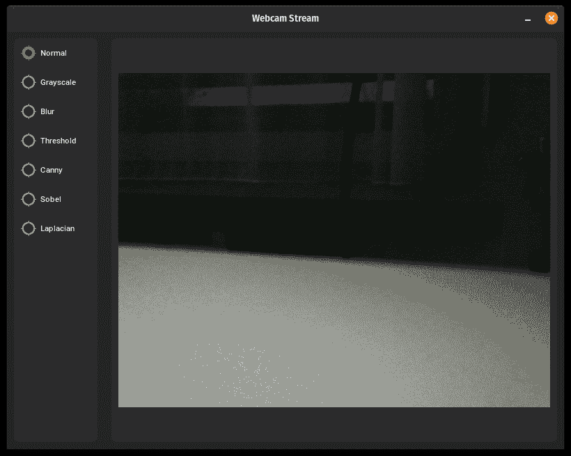

现在这并不非常令人兴奋，因为框架还没有更新。所以让我们看看如果我们尝试这样做会发生什么。

```py
class App(customtkinter.CTk):
    def __init__(self) -> None:
        ...

        cap = cv2.VideoCapture(0)
        while True:
            ret, frame = cap.read()
            if not ret:
                break

            self.image_display.set_frame(frame)
```

几乎和之前一样，但现在我们运行帧循环，就像我们在上一章的 OpenCV GUI 中做的那样。如果您运行这个，您将看到……完全什么也没有。窗口从未显示出来，因为我们正在应用程序的构造函数中创建一个无限循环！这也是为什么在先前的例子中程序在延迟后出现的原因，打开 Webcam 流是一个阻塞操作，窗口的事件循环无法运行，所以它还没有显示出来。

因此，让我们通过添加一个稍微好一点的实现来修复这个问题，这个实现允许在更新帧的同时运行 GUI 事件循环。我们可以使用`tkinter`的`after`方法在等待时安排函数调用。

```py
 ...

        self.cap = cv2.VideoCapture(0)
        self.after(10, self.update_frame)

    def update_frame(self) -> None:
        """
        Update the displayed frame.
        """

        ret, frame = self.cap.read()
        if not ret:
            return

        self.image_display.set_frame(frame)

        self.after(10, self.update_frame) 
```

现在我们仍然在构造函数中设置摄像头流，所以我们还没有解决这个问题。但至少我们可以在图像组件中看到连续的帧流。

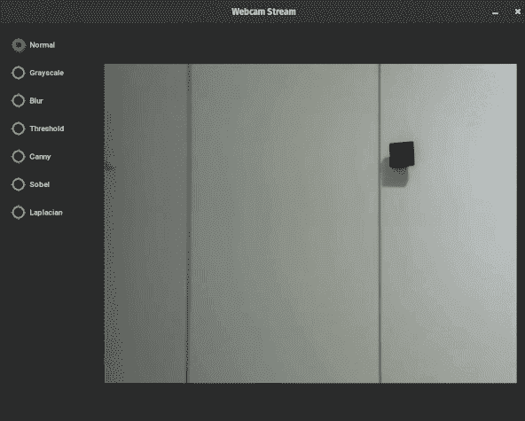

### 应用过滤器

现在帧循环正在运行，我们可以从开始重新实现我们的过滤器并将它们应用到我们的网络摄像头流中。在`update_frame`函数中，我们可以检查当前的过滤器变量并应用相应的过滤器函数。

```py
 def update_frame(self) -> None:
        ...

        # Get the selected filter type
        filter_id = self.filter_var.get()
        filter_type = filter_types[filter_id]

        if filter_type == "grayscale":
            frame = cv2.cvtColor(frame, cv2.COLOR_BGR2GRAY)
        elif filter_type == "blur":
            frame = cv2.GaussianBlur(frame, ksize=(15, 15), sigmaX=0)
        elif filter_type == "threshold":
            gray = cv2.cvtColor(frame, cv2.COLOR_BGR2GRAY)
            _, frame = cv2.threshold(gray, thresh=127, maxval=255, type=cv2.THRESH_BINARY)
        elif filter_type == "canny":
            frame = cv2.Canny(frame, threshold1=100, threshold2=200)
        elif filter_type == "sobel":
            frame = cv2.Sobel(frame, ddepth=cv2.CV_64F, dx=1, dy=0, ksize=5)
        elif filter_type == "laplacian":
            frame = cv2.Laplacian(frame, ddepth=cv2.CV_64F)
        elif filter_type == "normal":
            pass

        if frame.dtype != np.uint8:
            # Scale the frame to uint8 if necessary
            cv2.normalize(frame, frame, 0, 255, cv2.NORM_MINMAX)
            frame = frame.astype(np.uint8)
        if len(frame.shape) == 2:  # Convert grayscale to BGR
            frame = cv2.cvtColor(frame, cv2.COLOR_GRAY2BGR)

        self.image_display.set_frame(frame)

        self.after(10, self.update_frame)
```

现在我们回到了应用程序的完整功能，你可以在左侧选择任何过滤器，它将实时应用到网络摄像头流中！

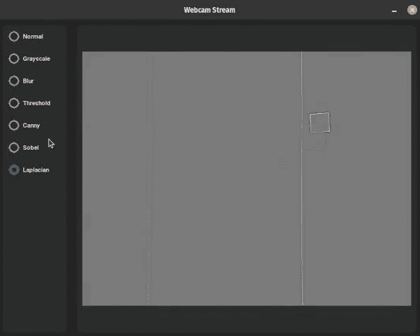

### 多线程与同步

虽然应用程序目前可以正常运行，但我们当前运行帧循环的方式存在一些问题。目前所有操作都在单个线程中运行，即主 GUI 线程。这就是为什么一开始我们没有立即看到窗口弹出，我们的网络摄像头初始化阻塞了主线程。现在想象一下，如果我们进行了一些更重的图像处理，比如通过神经网络处理图像，你不想在神经网络进行推理时总是阻塞用户界面。这会导致在点击 UI 元素时用户体验非常不流畅！

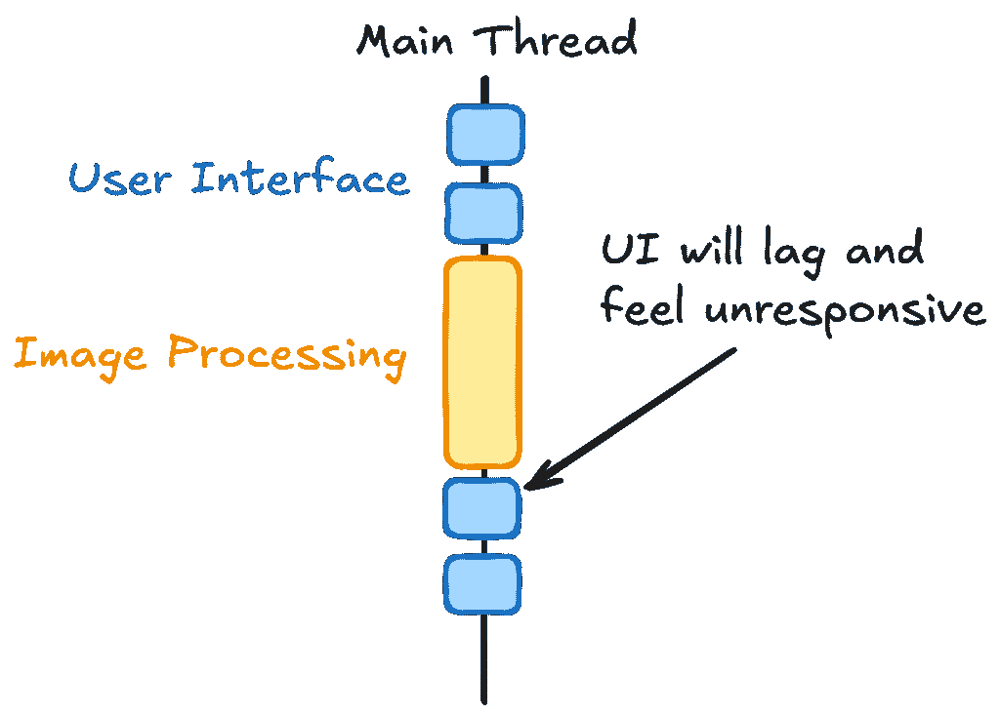

在我们的应用程序中处理这个问题的一个更好的方法是*将图像处理与用户界面分离*。通常，将你的 GUI 逻辑与任何类型的非平凡处理分离几乎总是一个好主意。因此，在我们的情况下，我们将运行一个单独的线程，该线程负责图像循环。它将从网络摄像头流中读取帧并应用过滤器。

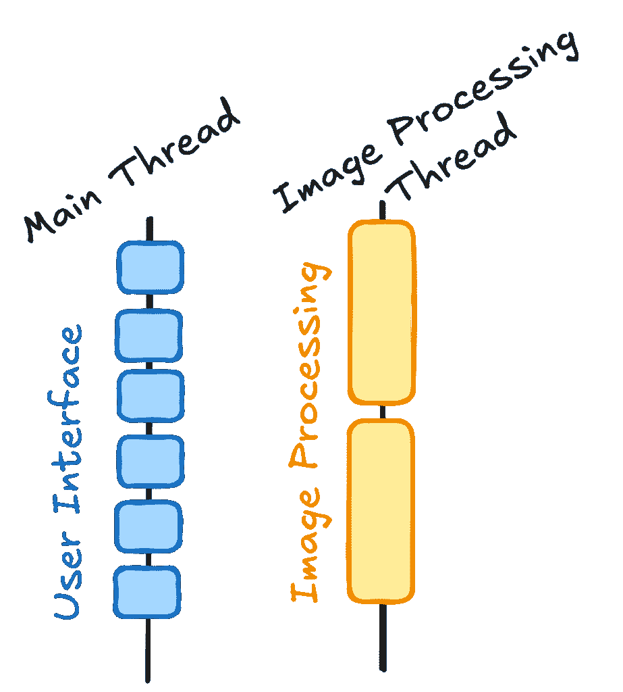

> **注意：**Python 线程在某种意义上并不是“真正的”线程，因为它们没有在不同的逻辑 CPU 核心上运行的 capability，因此它们不会“真正”并行运行。在 Python 多线程中，上下文将在线程之间切换，但由于 GIL（全局解释器锁），单个 Python 进程只能运行一个物理线程。如果你想实现“真正的”并行处理，你需要使用**多进程**。由于我们这里的进程不是 CPU 密集型，而是**I/O 密集型**，多线程就足够了。

```py
class App(customtkinter.CTk):
    def __init__(self) -> None:
        ...

        self.webcam_thread = threading.Thread(target=self.run_webcam_loop, daemon=True)
        self.webcam_thread.start()

    def run_webcam_loop(self) -> None:
        """
        Run the webcam loop in a separate thread.
        """
        self.cap = cv2.VideoCapture(0)
        if not self.cap.isOpened():
            return

        while True:
            ret, frame = self.cap.read()
            if not ret:
                break

            # Filters
            ...

            self.image_display.set_frame(frame)
```

如果你运行这个程序，你现在会看到我们的窗口立即打开，甚至在网络摄像头流打开时我们甚至能看到我们的加载文本。然而，一旦流开始，帧开始闪烁。根据许多因素，你可能会在这个阶段体验到不同的视觉伪影或错误。

<details class="wp-block-details is-layout-flow wp-block-details-is-layout-flow"><summary>警告：闪烁图像</summary>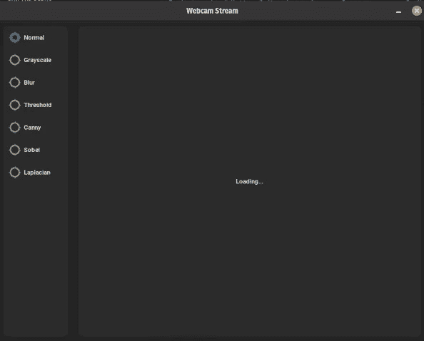</details>

现在为什么会发生这种情况？问题是我们在尝试同时更新新帧时，用户界面的内部刷新循环可能正在使用数组的信息将其绘制到屏幕上。它们都在争夺相同的帧数组。

通常来说，直接从不同的线程更新 UI 元素不是一个好主意，在某些框架中，这甚至可能被阻止并引发异常。在**Tkinter**中，我们可以这样做，但我们会得到奇怪的结果。我们需要在线程之间进行某种类型的**同步**。这就是`Queue`发挥作用的地方。

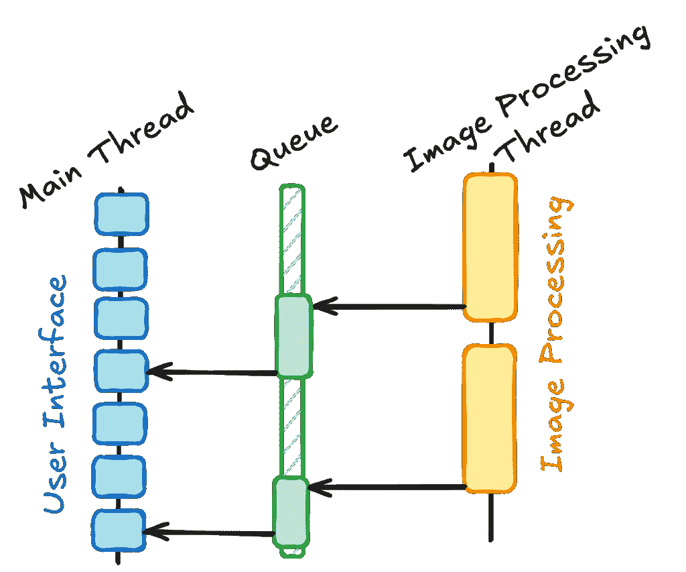

你可能熟悉来自杂货店或主题公园的队列。这里的队列概念非常相似：首先进入队列的元素也是第一个离开的（**F**irst **I**n **F**irst **O**ut）。

在这种情况下，我们实际上只需要一个包含单个元素的队列，一个单槽队列。Python 中的队列实现是**线程安全的**，这意味着我们可以从不同的线程中向队列中**put**和**get**对象。这对于我们的用例非常完美，处理线程将图像数组放入队列，而 GUI 线程将尝试获取一个元素，但如果队列为空，则不会阻塞。

```py
class App(customtkinter.CTk):
    def __init__(self) -> None:
        ...

        self.queue = queue.Queue(maxsize=1)

        self.webcam_thread = threading.Thread(target=self.run_webcam_loop, daemon=True)
        self.webcam_thread.start()

        self.frame_loop_dt_ms = 16  # ~60 FPS
        self.after(self.frame_loop_dt_ms, self._update_frame)

    def _update_frame(self) -> None:
        """
        Update the frame in the image display widget.
        """
        try:
            frame = self.queue.get_nowait()
            self.image_display.set_frame(frame)
        except queue.Empty:
            pass

        self.after(self.frame_loop_dt_ms, self._update_frame)

    def run_webcam_loop(self) -> None:
        ...

        while True:
            ...

            self.queue.put(frame)
```

注意我们是如何将直接调用`set_frame`函数从运行在其自身线程中的摄像头循环移动到在主线程上运行的`_update_frame`函数，该函数以**16ms**的间隔重复调度。

在这里，在主线程中使用`get_nowait`函数很重要，否则如果我们使用 get 函数，我们将会在那里阻塞。这个调用**不会阻塞**，如果没有要获取的元素，则会引发一个`queue.Empty`异常，因此我们必须捕获这个异常并忽略它。在摄像头循环中，我们可以使用阻塞的 put 函数，因为即使我们**阻塞**了`run_webcam_loop`，那里也没有其他需要运行的事情。


现在一切运行得都很正常，不再有闪烁的帧了！

## 结论

将 UI 框架如**Tkinter**与**OpenCV**结合使用，使我们能够构建具有交互式图形用户界面的现代外观应用程序。由于 UI 在主线程中运行，我们在单独的线程中运行图像处理，并使用单槽队列在线程之间同步数据。你可以在下面的仓库中找到一个结构更模块化的这个演示的清理版本。如果你用这种方法构建了有趣的东西，请告诉我。请多保重！

* * *

* * *

*查看 GitHub 仓库中的完整源代码：*

[`github.com/trflorian/ctk-opencv`](https://github.com/trflorian/ctk-opencv)

* * *
