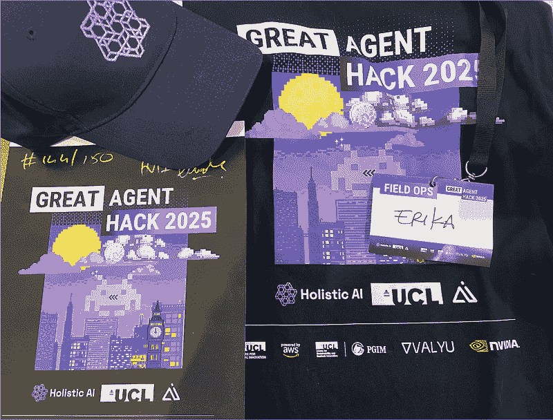
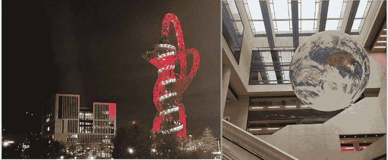
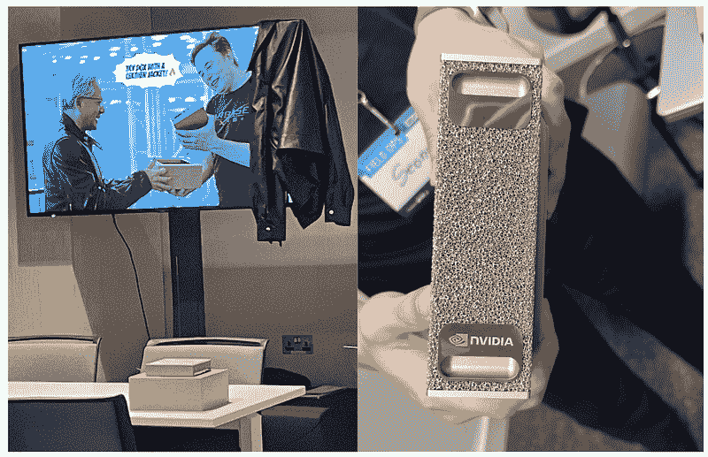
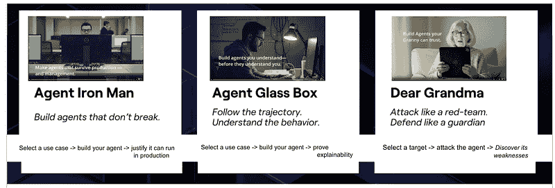

# 多智能体竞技场：来自伦敦《大代理商黑客 2025》的见解

> 原文：[`towardsdatascience.com/multi-agent-arena-london-great-agent-hack-2025/`](https://towardsdatascience.com/multi-agent-arena-london-great-agent-hack-2025/)
> 
> 人们将越来越多地使用人工智能。加速将是计算前进的道路。我对这些基本趋势深信不疑。
> 
> [**黄仁勋**](https://www.brainyquote.com/authors/jensen-huang-quotes)**. 英伟达首席执行官**

<mdspan datatext="el1764706136148" class="mdspan-comment">几天前</mdspan>我有幸参加了由[Holistic AI](https://www.holisticai.com/)在 UCL 举办的[大代理商黑客 2025](https://hackathon.holisticai.com/)，黑客松围绕三个主要挑战展开：[**代理商钢铁侠**](https://www.linkedin.com/posts/valyu-ai_65000-in-prizes-are-now-locked-in-for-activity-7393680097104257024-KvPu?utm_source=share&utm_medium=member_desktop&rcm=ACoAABLbCuIB6M41aRZLH3zXP1WegHh-pfkySI4)，[**代理商玻璃箱**](https://www.linkedin.com/posts/valyu-ai_the-50-spots-that-were-opened-up-yesterday-activity-7393965746374090752-bo0G?utm_source=share&utm_medium=member_desktop&rcm=ACoAABLbCuIB6M41aRZLH3zXP1WegHh-pfkySI4)，和[**亲爱的奶奶**](https://www.linkedin.com/posts/valyu-ai_today-is-the-last-day-to-sign-up-for-the-activity-7394362085985505280-jfSg?utm_source=share&utm_medium=member_desktop&rcm=ACoAABLbCuIB6M41aRZLH3zXP1WegHh-pfkySI4)**，**分别代表了不同哲学的智能体人工智能。这些名称不仅仅是方便分类的创意，它们反映了我们今天思考智能体的三个支柱：**稳健性、透明度和用户安全**（包括你的奶奶 😄）。在那个环境中沉浸一个周末对我来说就像是一个重置按钮：它充满活力，让我想起了为什么我喜欢在这个领域工作，并且它真正激发了我继续学习和建设的灵感，即使探索 AI 周围发生的一切永远没有足够的时间。

在这个黑客松活动中，三个赛道上开发了 50 多个项目。本文的重点将集中在活动中的关键时刻以及我个人特别关注的几个项目上，同时认识到每个团队都对**构建稳健和值得信赖的智能体**的更广泛讨论做出了有价值的贡献。对于想要探索所有想法的读者，完整的 51 个提交作品画廊在此处提供：[`hai-great-agent-hack-2025.devpost.com/project-gallery?page=1`](https://hai-great-agent-hack-2025.devpost.com/project-gallery?page=1.) [4]​。

图 1. 2025 年《大代理商黑客》官方传单和我的 T 恤。图片由作者提供。

由伦敦大学学院数字创新中心（CDI）主办，我们在东伦敦度过了一个周末，体验了一些真正独特的空间，那种你走过轨道塔（2012 年奥运会的红色雕塑）然后在大楼内旋转的漂浮地球下编码的地方（图 2）。伦敦到处都装饰着圣诞灯饰，所以从黑客马拉松到城市的转换感觉就像是从研究实验室踏进假日明信片一样。

**图 2.** 东伦敦景观：伦敦大学学院东校区和阿塞洛米塔尔轨道（也称为轨道塔）（左），以及位于伦敦大学学院数字创新中心（CDI）内的漂浮地球装置（右）。照片由作者拍摄。

总的来说，这次黑客马拉松汇集了**200 多名参与者以及大约 25 种不同类别的约 25 个奖项**。团队在周末之前并没有被突然放下：他们可以访问教程、示例笔记本和其他资源，这些资源帮助他们准备[5]、选择赛道，并在时钟开始后立即投入工作。作为交付成果，每个团队都预计提交一个公共 GitHub 仓库，录制一个简短的演示，并创建海报或幻灯片来向评审团展示他们的解决方案，这使得理解每个项目的完整工作流程和实际应用潜力变得更加容易。

评审团来自一个令人惊讶的多元化组织：Holistic AI（组织者）、伦敦大学学院数字创新中心（CDI）、AWS、Valyu、NVIDIA、Entrepreneurs First 以及其他一些公司，包括对展示的人才和想法感兴趣的公司。他们为三个主要赛道中的每个赛道选出了获胜者，而且还颁发了一系列神秘和特别奖项，这些奖项不仅仅是为了庆祝最先进的技术解决方案。

在这些特别奖项中，有一个**勇敢士兵**风格的奖项，授予了即使队友开始消失，仍然表现出真正韧性和坚持到底的团队，实际上只剩下一个士兵站立；一个**最佳提案**奖项，因为推销你的想法也是完成任务的一部分（尤其是技术专业人士在这方面可能有点困难）；以及一个**最高资源使用**奖项，授予那些真正利用 AWS 并从云中榨取最后一丝火花的公司。这些以及其他奖项类别在黑客马拉松网站上进行了总结[2]。

周末最令人好奇的事情之一是近距离看到 NVIDIA 的超紧凑型 AI 超级计算机，甚至还能与标志性的皮夹克设置合影，重现大屏幕上展示的著名[埃隆·马斯克 × 黄仁勋](https://www.youtube.com/shorts/l7x_Tfrbubs) “皮夹克时刻” [6]（图 3）。更令人兴奋的是，我们在 Dear Grandma 挑战中试图破解的一些代理实际上运行在类似的 NVIDIA GPU 硬件上，所以这台微型超级计算机实际上是竞争对手攻击的代理背后的大脑。

**图 3.** 完整的 NVIDIA 体验：皮夹克照片设置与 DGX Spark（左）以及超紧凑型 DGX Spark 的特写（右）。图片由作者提供。

## 代理竞技场

如本文开头所述，周末的核心内容围绕三个轨道（图 4）展开。每个轨道都探讨了关于现代 AI 代理的不同问题：如何构建它们以便它们*工作*，如何使它们*透明*，以及如何确保它们*不会失控*。

团队可以选择最适合他们用例的轨道，但在实践中**许多项目自然跨越了轨道边界**；这表明人们多么渴望学习、连接和将代理生命周期（是的，加入更多轨道意味着赢得比赛的机会更大这一想法也在流传，但我们现在先不谈这个😉）的不同方面结合起来。

**图 4.** 2025 年伟大代理黑客大赛的三个轨道：[*代理钢铁侠*](https://www.linkedin.com/posts/valyu-ai_65000-in-prizes-are-now-locked-in-for-activity-7393680097104257024-KvPu/?utm_source=share&utm_medium=member_desktop&rcm=ACoAABLbCuIB6M41aRZLH3zXP1WegHh-pfkySI4)（构建不会崩溃的代理）、[*代理玻璃箱*](https://www.linkedin.com/posts/valyu-ai_the-50-spots-that-were-opened-up-yesterday-activity-7393965746374090752-bo0G/?utm_source=share&utm_medium=member_desktop&rcm=ACoAABLbCuIB6M41aRZLH3zXP1WegHh-pfkySI4)（理解代理行为）和[*亲爱的奶奶*](https://www.linkedin.com/posts/valyu-ai_today-is-the-last-day-to-sign-up-for-the-activity-7394362085985505280-jfSg/?utm_source=share&utm_medium=member_desktop&rcm=ACoAABLbCuIB6M41aRZLH3zXP1WegHh-pfkySI4)（像红队一样攻击，像守护者一样防御）。图片由作者提供。

### 轨道 A. 代理钢铁侠：工作并持久的代理

这是工程现实检查轨道。目标是构建一个**高性能、生产就绪**的多代理架构，具有明确的代理角色、工具和内存，以这种方式连接在一起，实际上可以在黑客马拉松之外生存。

评估重点放在了在生产环境中通常只会对你造成伤害的事情上：**性能**（速度、延迟、成本）、**鲁棒性**（代理如何处理工具故障、不良输入和边缘情况）、**架构质量**（代理之间的清晰分离、安全工具编排、合理的回退机制）以及**监控**（可观察性、结构化输出、基本健康检查）。团队还被期望通过尽可能选择较小的或更便宜的模式，并测量能量和令牌使用情况，来考虑**碳足迹**，以确保代理是保守、负责任地使用计算资源。

这条路径也是对随着代理的更广泛使用和系统的日益复杂化即将到来的一些内容的初步体验，许多服务在相互通信的同时，还需要满足严格的延迟和成本目标。

在项目之间，有一个项目引起了我的注意：FairQuote [4]：一个**智能汽车保险承保系统**，它使用一个编排代理加上专门的接入、定价和政策代理，这些代理协调收集数据、评估风险、计算保费并在一次对话中生成可解释的政策；在架构上，它指向了下一波多代理企业工作流程，其中鲁棒性、明确的职责和强大的可观察性与底层模型同样重要。

承保是一个很好的例子，因为它在保险业中是最困难且最关键的业务问题之一。它位于监管、精算科学和客户体验的交汇点：关于接受风险、定价或应用排除的决定都必须经过这个过程。当承保过程缓慢或不透明时，客户会感到沮丧，合作伙伴会失去信任，保险公司会面临定价不当的投资组合和监管审查的风险。当它运行良好时，它会默默地保持系统稳定，有效地分配资本，保护资产负债表，并**在各个细分市场中支持公平定价**。

因此，在这个路径中，看到不仅工程扎实，而且团队解决了真实的问题：承保、端到端索赔处理、欺诈调查，甚至紧急服务调度，其中**多代理系统实时协调分级和决策支持**。即使周末的输出仍然是演示，它们也指向了多代理模式、安全措施和监控，这些在类似架构从黑客马拉松的桌子转移到实际企业环境中时将变得至关重要。

团队工具的选择与黑客马拉松推荐的堆栈紧密一致：AWS AgentCore 与 Strands Agents SDK 进行编排，Amazon Nova 和其他 Bedrock 托管模型（较小的 SLMs 以保持节俭），以及评估框架如 AgentHarm [7]。后者让你测试 LLM 代理是否可以正确地序列化合成工具，如暗网搜索、网络爬虫、邮件发送者、支付或银行转账功能，以及代码或 shell 工具；因此，你可以测量其对抗越狱的鲁棒性以及一旦绕过安全屏障后，其执行多步有害工作流程的能力。

### Track B. 代理玻璃盒：你可以看到并信任的代理

透明度轨道专注于使代理系统对人类和组织可解释、可审计和可解释。团队被要求**构建其推理、记忆更新和行动可以被实时追踪和检查的代理**，而不是保持不透明的黑盒。在实践中，项目分为几个家族：可观察性管道、可解释性工具、治理和安全层以及专家发现或可追溯性工具。

对我来说，最能捕捉“玻璃盒”理念的项目之一是[GenAI Explainer](https://devpost.com/software/genaiexplainer)。我们都知道文本到图像的扩散模型可能很强大但也存在风险：传统的**扩散系统已经被证明会再现社会偏见**[8]，即使是像 FLUX.1 这样的新模型仍然会在其训练数据中反映模式[9]，同时在几乎无法洞察为什么特定图像以这种方式出现。在黑客马拉松中，GenAI Explainer 团队通过将 FLUX.1 包裹在一个**可解释性层**中解决了这个问题，这个层让你可以看到每个单词或提示片段如何影响生成的图像，审计输出以符合品牌、法律或安全合规性，并在实时查看影响的同时迭代地改进提示，每个生成步骤都会被跟踪。在实践中，他们将扩散从黑盒转变为更接近玻璃盒、可审计的工作流程。

最后，Track B 提醒我们，算法透明性不再是可选择的：法律和风险团队越来越需要证明自动化决策是可解释的且无偏见的，而像 GenAI Explainer 这样的项目背后的“玻璃盒”思维是我们应该带入我们构建的每一个代理应用中的。

在这个轨道上，团队工具的选择结合了追踪平台，如 LangSmith 或 LangFuse，AWS 可观察性服务如 CloudWatch、X-Ray 或 Bedrock 监控，以及研究工具如 AgentGraph [10]（将追踪转换为交互式知识图谱）、AgentSeer [11]（构建动作图和进行故障/漏洞分析），以及 Who_and_When 故障归因[12]数据集，以深入分析和可视化代理追踪，仅举几个例子。

### Track C. 亲爱的奶奶：保持安全并表现良好的代理

在这个赛道中，团队被赋予了七个代表不同动物的神秘 LLM 代理 🐺🦊🦅🐻🐜🐘🦎，每个代理都由一个动物形象代表，任务是破解它们、理解它们并识别它们。这七个隐藏的“隐形代理”象征着不同的行为、优势和攻击面，团队需要揭露它们。挑战是构建一个**红队框架**，能够利用活动组织者提供的 API 攻击七个活生生的动物代理端点，并依托由 NVIDIA 提供的基础设施。

在黑客马拉松中，每个“动物”代理都是一个通过单个 API 服务暴露的实时 AI 系统，每个动物有不同的路由。团队可以向这些特定于动物的路线发送提示，并实时观察代理的行为，每个代理都有其独特的个性和能力，这有助于红队人员设计有针对性的测试和攻击。

图 5. 对某些“动物”代理进行越狱测试的示例：在 DAN 风格的提示面前，每个模型都以俏皮的拒绝和一致的安全信息回应，揭示了它们共有的安全防线和各自独特的个性。

跟踪 C 不仅限于 API 背后的七个“动物”代理；只要团队将其视为系统安全评估的一部分，攻击像 ChatGPT、Claude 或 Gemini 这样的商业系统也是允许的。

这样，解决方案应该**分析、攻击和解释 AI 代理的漏洞，执行行为取证，并理解攻击为何有效**。

[越狱实验室](https://devpost.com/software/jailbreak-lab)团队采用两步法，首先基于文献中报道的技术，如 Base64 混淆、CSS/HTML 注入和其他提示级别技巧，构建了一个经过验证的越狱提示库。其次，他们应用遗传算法对这些提示进行变异和改进：每当第一步的攻击部分成功时，算法就会对其进行调整（改变措辞、添加上下文、合并两个提示或进一步混淆指令），以保留成功的变体并丢弃弱小的变体。随着时间的推移，这种进化搜索产生了越来越强大的对抗性提示，甚至发现了完全新的破解代理的方法。

[HSIA](https://devpost.com/software/hsia-semantic-injection-attacks-on-vla-robotics?_gl=1*987pm1*_ga*MzgwMjA5MDg2LjE3NjQ0NDU2Mjk.*_ga_0YHJK3Y10M*czE3NjQ0NDU2MjgkbzEkZzAkdDE3NjQ0NDU2MjgkajYwJGwwJGgw) 是另一个突出的项目，将这些想法推向了机器人世界。他们没有攻击动物代理，而是针对一个视觉-语言-动作（VLA）机器人系统，并展示了其感知如何在**语义**层面被破坏。图像中的像素保持完全相同；改变的是模型生成的内部标题。通过微妙、精心设计的扰动，VLA 系统可以从“我看到图像中的瓶子”转变为“我看到图像中的刀子”，即使实际上没有刀子，也会导致机器人基于对环境的错误信念采取行动。他们的工作强调了多模态系统可以在不接触原始图像的情况下被破坏，暴露了下一代机器人 AI 的一个关键漏洞。

## 经验总结

如果我必须总结这次黑客马拉松教给我的东西，那将是：

**做一个勇敢的士兵**。毅力比竞争更重要。这不仅仅是打败别人；这是关于保持韧性，当事情出错时（因为它们**会**出错）适应变化，并呈现你想法的最佳版本。这样的活动不仅仅是技术挑战；这是展示你的才能和公司真正重视的那种决心的机会。

**提前做好准备**。表现良好的团队不一定是最资深的，而是那些已经了解格式、期望、评估标准，并且已经提前完成了教程和共享资源的团队。

**掌握 5 分钟提案**。这是至关重要的。评委和评审员行动迅速。你可能花了好几天时间构建某个东西，但你只有几分钟的时间让他们关心。所以，准备一个提案，清楚地、快速地解释你项目的价值，并以激发好奇心的方式呈现。如果这 5 分钟做得很好，评委会要求更多。这对初级和高级工程师都适用（讲故事是工作的一部分）。我也为此感到困扰；在现实生活中，我们通常没有太多时间来证明我们的想法。

**这些事件比以往任何时候都更有意义**。这些事件每年都在吸引更多的关注，组织者甚至在今年将名额翻倍，这显示了经验的宝贵性。这就是为什么只有当你真正想要参加并且能够投入你的时间和精力时，参与才如此重要的原因。

**研究赞助商**。在活动之前，查找涉及的公司，并思考哪些公司可能对你采取的方法最感兴趣。相应地调整你的提案。赞助商不仅仅是评委，他们可能是潜在的合作伙伴、导师，甚至是未来的队友。

**坚实的根本胜过光鲜的模型**。从黑客马拉松中得出的一个关键教训是，胜利并不在于使用最新或最炒作的模型。顶尖团队之所以成功，并不是因为他们依赖于最大或最耀眼的架构，而是因为他们基于坚实、被充分理解的技巧构建了强大的解决方案：遗传算法、鲁棒的扩散模型等。真正的区别在于他们如何创造性地将这些基础与代理方法、巧妙的评估设置和智能工程相结合，以应对持续的挑战。

**协作创新加速进步**。此次活动突出了学术界、工业界和人工智能治理专家之间跨学科合作如何显著加强人工智能发展和治理框架。即使那些不在技术岗位的参与者也贡献了基于他们自身领域真实问题的宝贵想法，带来了仅靠工程学无法提供的视角。这也是一个与通常技术圈外的人建立联系的好机会，不仅扩大了你的网络，也扩展了你思考人工智能影响和应用的方式。

最后，进行更深入的反思：**代理正在快速发展**，随之而来的是新的架构挑战、安全问题和责任。这些问题不是未来的假设性问题，它们正在发生。对人工智能应用负责不是一场炒作的口号；它是任何人工智能或数据科学专业人士日常工作的一部分。

## 结论

这些事件正在悄然塑造我们关于人工智能治理的看法。当你将强大的代理系统置于时间压力和混乱、现实场景中时，你必须直面不可预测的行为。真正的学习就发生在那里：**我们如何平衡快速创新与信任和安全？**我们如何设计评估框架和护栏，让我们能够快速行动而不失去控制？这次黑客马拉松不仅奖励了聪明的模型，**还奖励了深思熟虑的治理**。

尽管到处都在涌现大量的 AI 活动，**但这是你真正应该关注的少数几个之一**，这类活动真正帮助你成长，让你接触到现实世界的挑战，并提醒你保持好奇心和保持技能敏锐的重要性。

## 参考文献

按照出现的顺序列出参考文献：

[1] “NVIDIA CEO 黄仁勋开启 CES 2025。未来已来！” *供应链今日*，2025 年。[链接](https://www.supplychaintoday.com/nvidia-ceo-jensen-huang-kicks-off-ces-2025/?utm_source=chatgpt.com)。

[2] 2025 年伟大代理黑客：全面 AI x UCL。可在：[`hackathon.holisticai.com/`](https://hackathon.holisticai.com/?utm_source=chatgpt.com)（2025 年 11 月 22 日访问）。

[3] Valyu AI. (2025). *2025 年优秀代理黑客大赛：代理性能、可靠性和 Valyu 驱动的检索*。从 [`www.valyu.ai/blogs/the-great-agent-hack-2025-agent-performance-reliability-and-valyu-powered-retrieval`](https://www.valyu.ai/blogs/the-great-agent-hack-2025-agent-performance-reliability-and-valyu-powered-retrieval?utm_source=chatgpt.com) 获取。

[4] 2025 年优秀代理黑客大赛。 “项目画廊—2025 年优秀代理黑客大赛：构建和测试透明、稳健和安全的 AI 代理以产生实际影响。” Devpost。可在以下网址找到：[`hai-great-agent-hack-2025.devpost.com/project-gallery?page=1`](https://hai-great-agent-hack-2025.devpost.com/project-gallery?page=1)

[5] 全面的 AI. (2025). *2025 黑客马拉松* [源代码]. GitHub. [`github.com/holistic-ai/hackathon-2025`](https://github.com/holistic-ai/hackathon-2025?utm_source=chatgpt.com) (最后访问日期：2025 年 11 月 30 日)

[6] *埃隆·马斯克对黄仁勋的 DGX Spark 礼物感到震惊。* (n.d.). YouTube 短视频. [`www.youtube.com/shorts/l7x_Tfrbubs`](https://www.youtube.com/shorts/l7x_Tfrbubs?utm_source=chatgpt.com)

[7] Andriushchenko, M., Souly, A., Dziemian, M., Duenas, D., Lin, M., Wang, J., Hendrycks, D., Zou, A., Kolter, Z., Fredrikson, M., Winsor, E., Wynne, J., Gal, Y., & Davies, X. (2024). *AgentHarm：用于衡量 LLM 代理有害性的基准*。arXiv。 [`arxiv.org/abs/2410.09024`](https://arxiv.org/abs/2410.09024?utm_source=chatgpt.com)

[8] [Tiku](https://www.washingtonpost.com/people/nitasha-tiku/) N.，[Schaul](https://www.washingtonpost.com/people/kevin-schaul/) K. 和 [Chen](https://www.washingtonpost.com/people/szuyu-chen/) S. *(2023 年 11 月 1 日)*。这是 AI 图像生成器看待世界的方式*。《华盛顿邮报》*。 [`www.washingtonpost.com/technology/interactive/2023/ai-generated-images-bias-racism-sexism-stereotypes/`](https://www.washingtonpost.com/technology/interactive/2023/ai-generated-images-bias-racism-sexism-stereotypes/) (最后访问日期：2025 年 8 月 20 日)。

[9] Porikli, S., & Porikli, V. (2025). 机器中的隐藏偏见：文本到图像模型中的刻板印象。可在以下网址找到：[`openreview.net/pdf?id=u4KsKVp53s`](https://openreview.net/pdf?id=u4KsKVp53s)

[10] 吴十四，赵十五，陈十六，王十七，莫十八，卡十九，佩二十，布二十一，科二十二 (2025)。*AgentGraph：用于交互式分析和稳健性测试的代理 AI 系统的 Trace-to-Graph 平台*。Holistic AI & 伦敦大学学院。

[11] Wicaksono，I.，吴十四，帕十五，王十七，科二十二，特二十三 (2025)。*注意差距：使用动作图评估 LLM 中的模型级和代理级漏洞*。

[12] 张三，尹四，张五，刘六，韩七，张八，李九，王十，王十一，陈十二，吴十三 (2025)。*哪些代理导致任务失败以及何时发生？关于 LLM 多代理系统的自动化故障归因*（arXiv 预印本 No. 2505.00212）。
