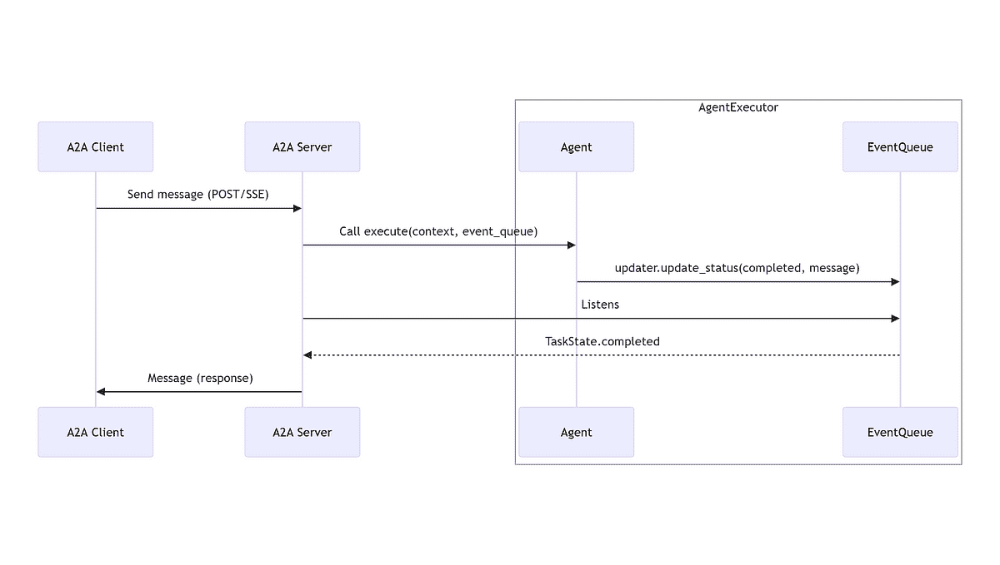
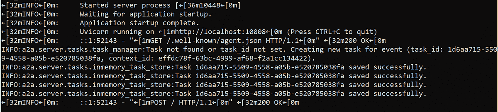
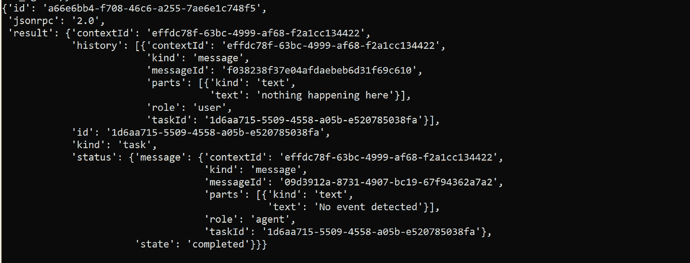
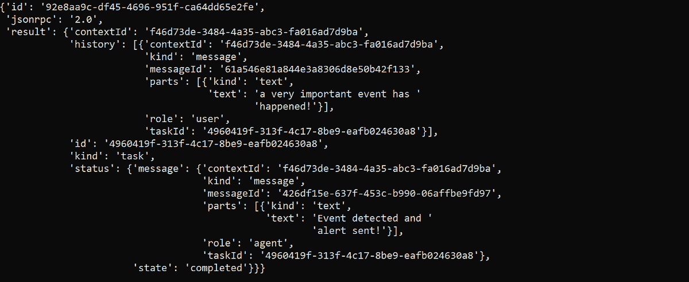

# 使用 A2A Python SDK 的多代理通信

> 原文：[`towardsdatascience.com/multi-agent-communication-with-the-a2a-python-sdk/`](https://towardsdatascience.com/multi-agent-communication-with-the-a2a-python-sdk/)

如果你不是躲在岩石下生活并且与 AI 工作，你很可能已经听说过 Agent2Agent（A2A）协议，“一个旨在使 AI 代理之间能够通信和协作的开放标准”。它仍然相当新，但它已经引起了很大的关注。由于它与 MCP（看起来它将成为行业标准）配合得很好，A2A 正在成为行业中多代理通信的**首选**标准。

当谷歌首次发布[协议规范](https://google.github.io/A2A/specification/)时，我的第一反应基本上是：“好吧，酷……但我应该用这个做什么？”幸运的是，本周他们发布了该协议的官方 Python SDK，现在它终于说出了我能理解的语言。

在这篇文章中，我们将深入探讨协议实际上是如何在代理和客户端之间建立通信的。剧透：它完全是面向任务的方式。为了使事情更具体，让我们一起构建一个小玩具示例。

## 事件检测代理与 A2A 客户端之间的通信

在我们的系统中，我们有一个**事件检测 AI 代理**（负责检测事件）和一个**警报 AI 代理**（负责向用户发出事件警报）。由于我这里专注于 A2A 协议，这两个代理都被模拟为简单的 Python 方法，返回字符串。但在现实生活中，你可以使用你喜欢的任何框架（LangGraph、Google ADK、CrewAI 等等）来构建你的代理。

我们系统中有三个角色，即**用户**、**事件代理**和**警报代理**。他们都使用**`Messages`**进行通信。**`Message`**代表 A2A 协议中的一次单独通信。我们将代理封装到**A2A 服务器**中。服务器公开了一个实现协议的 HTTP 端点。每个 A2A 服务器都有一个**`Event queues`**，它充当代理的异步执行和服务器响应处理之间的缓冲区。

**A2A 客户端**启动通信，如果两个代理需要通信，**A2A 服务器**也可以扮演**A2A 客户端**的角色。下面的图示显示了在协议中客户端和服务器是如何通信的。



*图片由作者提供*

`EventQueue`存储**`Messages`**、**`Tasks`**、**`TaskStatusUpdateEvent`**、**`TaskArtifactUpdateEvent`**、**`A2AError`**和**`JSONRPCError`**对象。**`Task`**可能是理解如何使用 A2A 构建多代理系统最重要的对象。根据[A2A 文档](https://google.github.io/A2A/topics/key-concepts/#fundamental-communication-elements)：

+   当客户端向代理发送消息时，代理可能会确定满足请求需要完成一个有状态的任务（例如，“生成报告”、“预订航班”、“回答问题”）。

+   每个任务都有一个由代理定义的唯一 ID，并按照定义的生命周期（例如，`submitted`、`working`、`input-required`、`completed`、`failed`）进行进展。

+   任务是有状态的，可能涉及客户端和服务器之间的多个交换（消息）。

将 `Task` 视为多智能体系统中具有 **明确** 和 **独特** 目标的东西。我们系统中有两个任务：

1.  检测事件

1.  通知用户

每个代理都执行自己的任务。让我们构建事件代理的 A2A 服务器，使事情更加具体。

## 构建事件代理的 A2A 服务器

首先：**代理卡**。代理卡是一个 JSON 文档，用于了解其他可用的代理。 <mdspan datatext="el1748462266520" class="mdspan-comment">它描述以下内容</mdspan>：

+   服务器的身份

+   能力

+   技能

+   服务端点

+   URL

+   客户端应该如何验证和与代理交互

让我们先定义事件检测 AI 代理的 `Agent Card`（我已经根据 [这个示例](https://github.com/google/a2a-python/tree/main/examples/google_adk) 定义了技能，该示例来自 Google）：

```py
agent_card = AgentCard(  
    name='Event Detection Agent',  
    description='Detects relevant events and alerts the user',  
    url='http://localhost:10008/',  
    version='1.0.0',  
    defaultInputModes=['text'],  
    defaultOutputModes=['text'],  
    capabilities=AgentCapabilities(streaming=False),  
    authentication={ "schemes": ["basic"] },  
    skills=[  
        AgentSkill(  
            id='detect_events',  
            name='Detect Events',  
            description='Detects events and alert the user',  
            tags=['event'],  
        ),  
    ],  
)
```

你可以在这里了解更多关于代理卡对象结构的信息：[`google.github.io/A2A/specification/#55-agentcard-object-structure`](https://google.github.io/A2A/specification/#55-agentcard-object-structure)

代理本身实际上将是一个 Uvicorn 服务器，因此让我们构建 `main()` 方法来使其启动并运行。所有请求将由 a2a-python SDK 的 `DefaultRequestHandler` 处理。处理程序需要一个 `TaskStore` 来存储任务，以及一个 `AgentExecutor`，它具有代理的核心逻辑实现（我们将在下一分钟构建 `EventAgentExecutor`）。

`main()` 方法的最后一个组件是 `A2AStarletteApplication`，这是实现 A2A 协议服务器端点的 [Starlette](https://www.starlette.io/) 应用程序。我们需要提供 `Agent Card` 和 `DefaultRequestHandler` 来初始化它。现在最后一步是使用 uvicorn 运行应用程序。以下是 `main()` 方法的完整代码：

```py
import click  
import uvicorn  
from a2a.types import (  
    AgentCard, AgentCapabilities, AgentSkill
) 
from a2a.server.request_handlers import DefaultRequestHandler  
from a2a.server.tasks import InMemoryTaskStore  
from a2a.server.apps import A2AStarletteApplication 

@click.command()  
@click.option('--host', default='localhost')  
@click.option('--port', default=10008)  
def main(host: str, port: int):  
    agent_executor = EventAgentExecutor()

    agent_card = AgentCard(  
        name='Event Detection Agent',  
        description='Detects relevant events and alerts the user',  
        url='http://localhost:10008/',  
        version='1.0.0',  
        defaultInputModes=['text'],  
        defaultOutputModes=['text'],  
        capabilities=AgentCapabilities(streaming=False),  
        authentication={ "schemes": ["basic"] },  
        skills=[              AgentSkill(                  id='detect_events',                  name='Detect Events',                  description='Detects events and alert the user',                  tags=['event'],  
            ),  
        ],  
    )

    request_handler = DefaultRequestHandler(  
        agent_executor=agent_executor,  
        task_store=InMemoryTaskStore()  
    ) 

    a2a_app = A2AStarletteApplication(  
        agent_card=agent_card,  
        http_handler=request_handler  
    )  

    uvicorn.run(a2a_app.build(), host=host, port=port)
```

### 创建 EventAgentExecutor

现在是时候构建我们代理的核心，并最终了解如何使用任务使代理相互交互了。`EventAgentExecutor` 类继承自 `AgentExecutor` 接口，因此我们需要实现 `execute()` 和 `cancel()` 方法。这两个方法都接受一个 `RequestContext` 和一个 `EventQueue` 对象作为参数。`RequestContext` 存储有关服务器正在处理当前请求的信息，而 `EventQueue` 则作为代理异步执行和服务器响应处理之间的缓冲区。

我们的代理将只检查用户发送的消息中是否包含字符串“`event`”。如果存在“`event`”，则应调用警报代理。我们将通过向另一个警报代理发送一个 `Message` 来完成此操作。这是 [直接配置](https://google.github.io/A2A/topics/agent-discovery/#2-curated-registries-catalog-based-discovery) 策略，意味着我们将使用一个 URL 来配置代理以获取警报代理的代理卡。为此，我们的事件代理将充当 A2A 客户端。

让我们逐步构建 Executor。首先，让我们创建主要任务（检测事件的任务）。我们需要实例化一个 `TaskUpdater` 对象（一个辅助类，用于代理向任务的事件队列发布更新），然后提交任务，并使用 `start_work()` 方法宣布我们正在处理它：

```py
from a2a.server.agent_execution import AgentExecutor

class EventAgentExecutor(AgentExecutor):  
    async def execute(self, context: RequestContext, event_queue: EventQueue):  
        task_updater = TaskUpdater(event_queue, context.task_id, context.context_id)  
        task_updater.submit()  
        task_updater.start_work()
```

用户将发送给代理的消息将看起来像这样：

```py
send_message_payload = {  
        'message': {  
            'role': 'user',  
            'parts': [{'type': 'text', 'text': f'it has an event!'}],  
            'messageId': uuid4().hex,  
        }  
    }
```

**`Part`** 代表 `Message` 中的一个独立内容块，表示可导出的内容，可以是 `TextPart`、`FilePart` 或 `DataPart`。我们将使用 `TextPart`，因此需要在执行器中将其展开：

```py
from a2a.server.agent_execution import AgentExecutor

class EventAgentExecutor(AgentExecutor):  
    async def execute(self, context: RequestContext, event_queue: EventQueue):  
        task_updater = TaskUpdater(event_queue, context.task_id, context.context_id)  
        task_updater.submit()  
        task_updater.start_work()

        await asyncio.sleep(1) #let's pretend we're actually doing something

        user_message = context.message.parts[0].root.text # unwraping the TextPart
```

是时候创建我们代理的超级高级逻辑了。如果消息中没有字符串“`event`”，我们就不需要调用警报代理，任务就完成了：

```py
from a2a.server.agent_execution import AgentExecutor

class EventAgentExecutor(AgentExecutor):  
    async def execute(self, context: RequestContext, event_queue: EventQueue):  
        task_updater = TaskUpdater(event_queue, context.task_id, context.context_id)  
        task_updater.submit()  
        task_updater.start_work()

        await asyncio.sleep(1) #let's pretend we're actually doing something

        user_message = context.message.parts[0].root.text # unwraping the TextPart

        if "event" not in user_message:  
            task_updater.update_status(  
                TaskState.completed,  
                message=task_updater.new_agent_message(parts=[TextPart(text=f"No event detected")]),
            )
```

### 为用户创建 A2A 客户端

让我们创建一个 A2A 客户端，这样我们就可以测试代理了。客户端使用 `A2AClient` 类中的 `get_client_from_agent_card_url()` 方法（猜猜看）获取代理卡。然后我们将消息包装在一个 `SendMessageRequest` 对象中，并通过客户端的 `send_message()` 方法将其发送到代理。以下是完整的代码：

```py
import httpx  
import asyncio  
from a2a.client import A2AClient  
from a2a.types import SendMessageRequest, MessageSendParams  
from uuid import uuid4  
from pprint import pprint

async def main():    
    send_message_payload = {  
        'message': {  
            'role': 'user',  
            'parts': [{'type': 'text', 'text': f'nothing happening here'}],  
            'messageId': uuid4().hex,  
        }  
    }  

    async with httpx.AsyncClient() as httpx_client:  
        client = await A2AClient.get_client_from_agent_card_url(  
            httpx_client, 'http://localhost:10008'  
        )  
        request = SendMessageRequest(  
            params=MessageSendParams(**send_message_payload)  
        )  
        response = await client.send_message(request)  
        pprint(response.model_dump(mode='json', exclude_none=True))  

if __name__ == "__main__":  
    asyncio.run(main())
```

这是运行 EventAgent 服务器的终端中发生的事情：



*图片由作者提供*

这是客户端看到的消息：



*图片由作者提供*

事件检测任务已创建，但没有检测到事件，太好了！但 A2A 的整个目的就是让智能体相互通信，所以让我们让事件智能体与警报智能体通信。

### 使事件智能体与警报智能体通信

要使事件智能体与警报智能体通信，事件智能体将充当客户端：

```py
from a2a.server.agent_execution import AgentExecutor

ALERT_AGENT_URL = "http://localhost:10009/" 

class EventAgentExecutor(AgentExecutor):  
    async def execute(self, context: RequestContext, event_queue: EventQueue):  
        task_updater = TaskUpdater(event_queue, context.task_id, context.context_id)  
        task_updater.submit()  
        task_updater.start_work()

        await asyncio.sleep(1) #let's pretend we're actually doing something

        user_message = context.message.parts[0].root.text # unwraping the TextPart

        if "event" not in user_message:  
            task_updater.update_status(  
                TaskState.completed,  
                message=task_updater.new_agent_message(parts=[TextPart(text=f"No event detected")]),
            )
        else:
            alert_message = task_updater.new_agent_message(parts=[TextPart(text="Event detected!")])

            send_alert_payload = SendMessageRequest(  
                params=MessageSendParams(  
                    message=alert_message  
                )  
            )  

            async with httpx.AsyncClient() as client:  
                alert_agent = A2AClient(httpx_client=client, url=ALERT_AGENT_URL)  
                response = await alert_agent.send_message(send_alert_payload)  

                if hasattr(response.root, "result"):  
                    alert_task = response.root.result  
                    # Polling until the task is done
                    while alert_task.status.state not in (  
                        TaskState.completed, TaskState.failed, TaskState.canceled, TaskState.rejected  
                    ):  
                        await asyncio.sleep(0.5)  
                        get_resp = await alert_agent.get_task(  
                            GetTaskRequest(params=TaskQueryParams(id=alert_task.id))  
                        )  
                        if isinstance(get_resp.root, GetTaskSuccessResponse):  
                            alert_task = get_resp.root.result  
                        else:  
                            break  

                    # Complete the original task  
                    if alert_task.status.state == TaskState.completed:  
                        task_updater.update_status(  
                            TaskState.completed,  
                            message=task_updater.new_agent_message(parts=[TextPart(text="Event detected and alert sent!")]),  
                        )  
                    else:  
                        task_updater.update_status(  
                            TaskState.failed,  
                            message=task_updater.new_agent_message(parts=[TextPart(text=f"Failed to send alert: {alert_task.status.state}")]),  
                        )  
                else:  
                    task_updater.update_status(  
                        TaskState.failed,  
                        message=task_updater.new_agent_message(parts=[TextPart(text=f"Failed to create alert task")]),  
                    )
```

我们将警报智能体称为用户称呼的事件智能体，当警报智能体任务完成后，我们完成原始的事件智能体任务。让我们再次调用事件智能体，但这次带有一个事件：



*图片由作者提供*

这里的美妙之处在于我们只需调用警报智能体，而无需了解它如何向用户发出警报。我们只需向它发送一条消息，并等待它完成。

警报智能体与事件智能体非常相似。你可以在这里查看整个代码：[`github.com/dmesquita/multi-agent-communication-a2a-python`](https://github.com/dmesquita/multi-agent-communication-a2a-python)

## 最后的想法

初次理解如何使用 A2A 构建多智能体系统可能会感到有些令人畏惧，但最终你只需**发送消息让智能体完成它们的工作**。要将你的智能体与 A2A 集成，你需要创建一个包含智能体逻辑的类，该类继承自`AgentExecutor`，并将智能体作为服务器运行。

希望这篇文章能帮助你完成 A2A 之旅，感谢阅读！

### 参考文献

[1] Padgham, Lin, and Michael Winikoff. *Developing intelligent agent systems: A practical guide*. John Wiley & Sons, 2005.

[2] [`github.com/google/a2a-python`](https://github.com/google/a2a-python)

[3] [`github.com/google/a2a-python/tree/main/examples/google_adk`](https://github.com/google/a2a-python/tree/main/examples/google_adk)

[4] [`developers.googleblog.com/en/agents-adk-agent-engine-a2a-enhancements-google-io/`](https://developers.googleblog.com/en/agents-adk-agent-engine-a2a-enhancements-google-io/)
