# 多头交叉注意力 – 手动实现

> 原文：[`towardsdatascience.com/multi-headed-cross-attention-by-hand-37c07b3ee8f2/`](https://towardsdatascience.com/multi-headed-cross-attention-by-hand-37c07b3ee8f2/)

“交叉”由 Daniel Warfield 使用 MidJourney 和 Affinity Design 2 创作。除非另有说明，所有图片均为作者所有。文章最初在[直观且详尽解释](https://iaee.substack.com/)上发布。

交叉注意力是创建能够同时理解多种数据形式的 AI 模型的基本工具。想象一下能够理解 ChatGPt 中使用的图像的语言模型，或者基于文本生成视频的 Sora 模型。

这份总结涵盖了交叉注意力中所有的关键数学运算，使你能够从基本层面理解其内部工作原理。

* * *

## 第 1 步：定义输入

* * *

在使用多种数据类型建模时，每种数据类型都可能以不同的方式格式化输入，这时会使用交叉注意力。对于自然语言数据，人们可能会使用词到向量的嵌入，配以位置编码，来计算代表每个单词的向量。

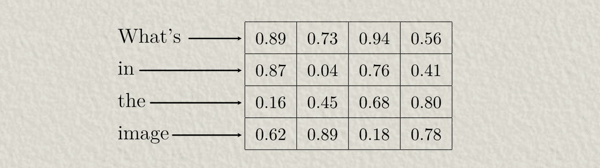

对于视觉数据，人们可能会将图像通过一个专门设计的编码器，将其总结成一个向量表示。

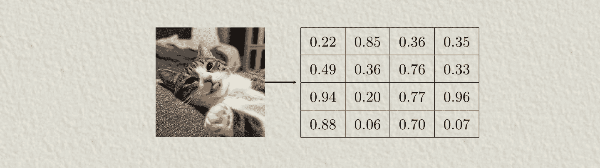

在交叉注意力中，我喜欢将其中一个输入视为过滤另一个输入，从而允许两个输入的数据在 AI 模型中相互交互。

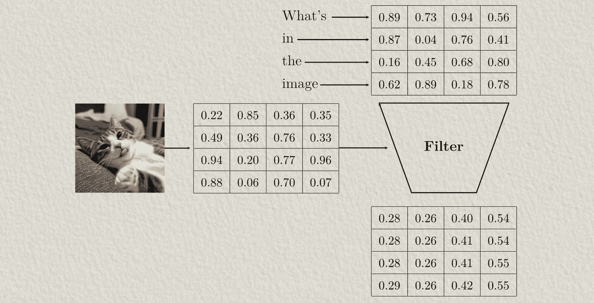

在这个例子中，我们可能会将图像数据称为“查询源输入”，因为它将被用于在注意力机制中构建“查询”，而文本数据则被称为“键值源输入”，因为它将被用于在注意力机制中构建“键”和“值”。

* * *

## 第 2 步：定义可学习参数

* * *

多头自注意力本质上学习了三个权重矩阵。这些矩阵用于构建“查询”、“键”和“值”，这些在后续的交叉注意力机制中使用。这些权重最初是随机定义的，然后在训练过程中进行更新。

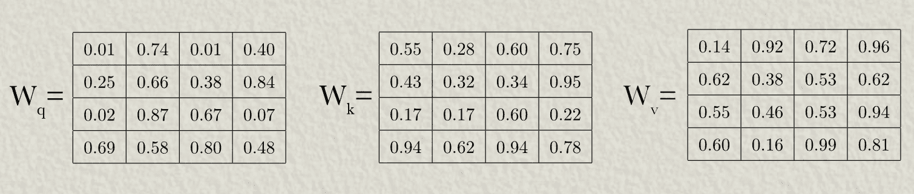

* * *

## 第 3 步：定义查询、键和值

* * *

现在我们已经为我们的模型有了权重矩阵，我们可以将它们与我们的输入相乘以生成我们的查询、键和值。在这个例子中，我们将查询的权重矩阵与图像数据相乘以生成查询，并将键和值的权重矩阵与文本数据相乘以生成键和值。回想一下，在矩阵乘法中，第一个矩阵每一行的每个值都与第二个矩阵对应列的值相乘。这些乘积值相加以表示输出中的一个值。

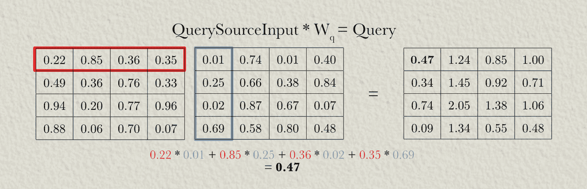

一旦图像数据通过查询权重相乘，文本数据通过键和值权重相乘，我们就得到了查询、键和值。

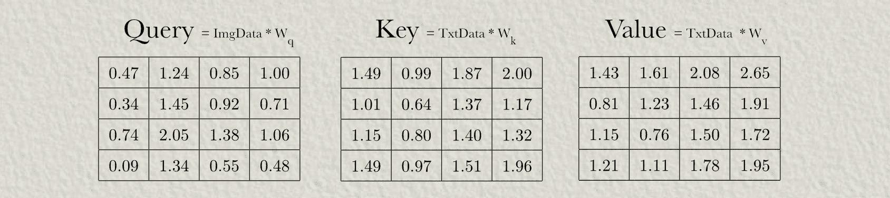

***

## 第 4 步：分割成头部

***

在这个例子中，我们将使用两个注意力头，这意味着我们将使用两个输入的子表示进行交叉注意力。我们将通过将查询、键和值分成两部分来设置它。

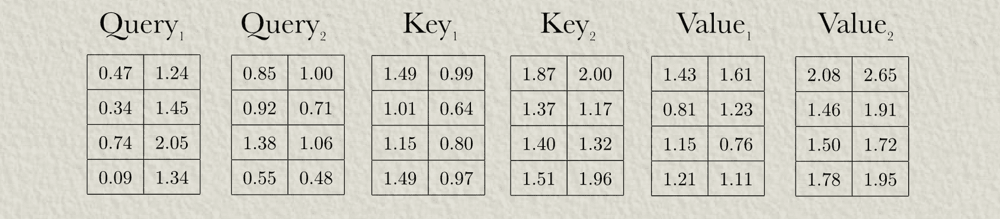

带有标签 1 的查询、键和值将被传递到第一个注意力头，带有标签 2 的查询、键和值将被传递到第二个注意力头。本质上，这允许多头交叉注意力并行以各种不同的方式对相同的输入进行推理。

***

## 第 5 步：计算 Z 矩阵

***

要构建注意力矩阵，我们首先将查询和键相乘以构建通常所说的“Z”矩阵。我们只会在注意力头 1 中这样做，但请记住，所有这些计算也在注意力头 2 中进行。

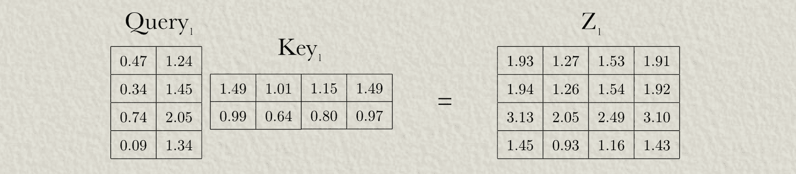

由于数学方式的原因，“Z”矩阵的值倾向于随着查询和键的大小增长而增长。这通过将“Z”矩阵中的值除以序列长度的平方根来抵消。

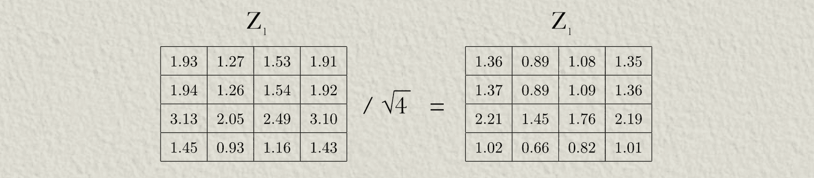

***

## 第 6 步（可选）：掩码

***

根据应用的不同，可能会对交叉注意力应用掩码，以便只有某些查询源输入标记可以与某些键-值源输入标记交互。在这个例子中我们不会这样做，因为我们希望所有图像数据都与所有文本数据交互，但你可以从[我的另一篇手写文章](https://towardsdatascience.com/multi-headed-self-attention-by-hand-d2ce1ae031db)中了解掩码的工作原理。

***

## 第 7 步：计算注意力矩阵

***

计算整个“Z”矩阵，并可选地应用掩码的整个目的是创建一个注意力矩阵。这可以通过对“Z”矩阵中的每一行进行 softmax 来实现。计算 softmax 的方程如下：

意味着行中的值等于 e 的该值次方，除以该行中所有值 e 的次方之和。我们可以对 Z 矩阵的第一行进行 softmax 操作：

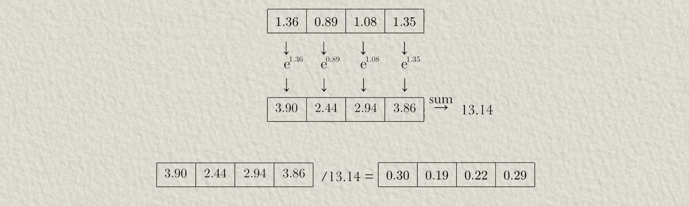

以这种方式，我们可以计算 z 矩阵中每一行的 softmax，从而计算注意力矩阵

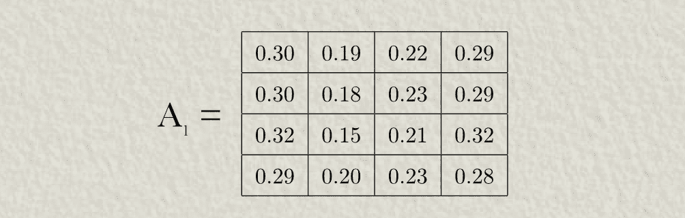

***

## 第 8 步：计算注意力头的输出

***

现在我们已经计算了注意力矩阵，我们可以将其与值矩阵相乘以构建注意力头的输出。

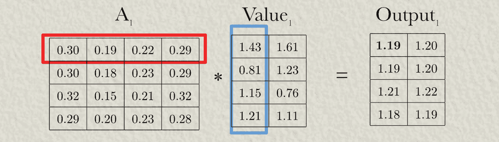

***

## 第 9 步：连接输出

***

两个注意力头创建一个独特的输出，这些输出被连接起来以产生多头交叉注意力的最终输出。

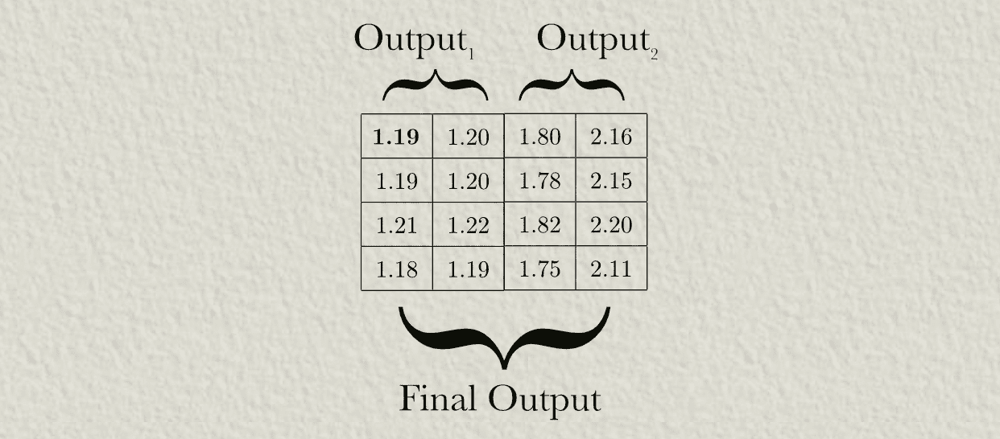

## 结论

也就是说，在这篇文章中，我们涵盖了计算多头交叉注意力输出的主要步骤：

1.  定义输入

1.  定义机制的可学习参数

1.  计算查询、键和值

1.  深入多个头部

1.  计算 Z 矩阵

1.  （可选）掩码

1.  计算注意力矩阵

1.  计算注意力头的输出

1.  连接输出

虽然我们使用了跨文本和图像的例子，但最终我们真正跨注意力的是值矩阵与另一个值矩阵。如果您可以将某些形式的数据（如音频、视频、机器人传感器数据等）转换为类似的矩阵，您就可以在交叉注意力中使用这些数据！

如果您想了解更多关于这个主题背后的直觉，请查看这些 IAEE 文章：

> [**Transformer – 直观且全面解释**](https://towardsdatascience.com/transformers-intuitively-and-exhaustively-explained-58a5c5df8dbb)
> 
> [**Flamingo – 直观且全面解释**](https://towardsdatascience.com/flamingo-intuitively-and-exhaustively-explained-bf745611238b)
> 
> [**Sora – 直观且全面解释**](https://towardsdatascience.com/sora-intuitively-and-exhaustively-explained-a54f83ea9c21)
> 
> [**多头自注意力 – 手动实现**](https://towardsdatascience.com/multi-headed-self-attention-by-hand-d2ce1ae031db)

## 加入 IAEE

在 IAEE，您可以找到：

+   长篇内容，如您刚刚阅读的文章

+   基于我的数据科学家、工程总监和企业家经验的思想碎片

+   一个专注于学习 AI 的 Discord 社区

+   每周由我进行的讲座

[加入 IAEE](https://iaee.substack.com/)
