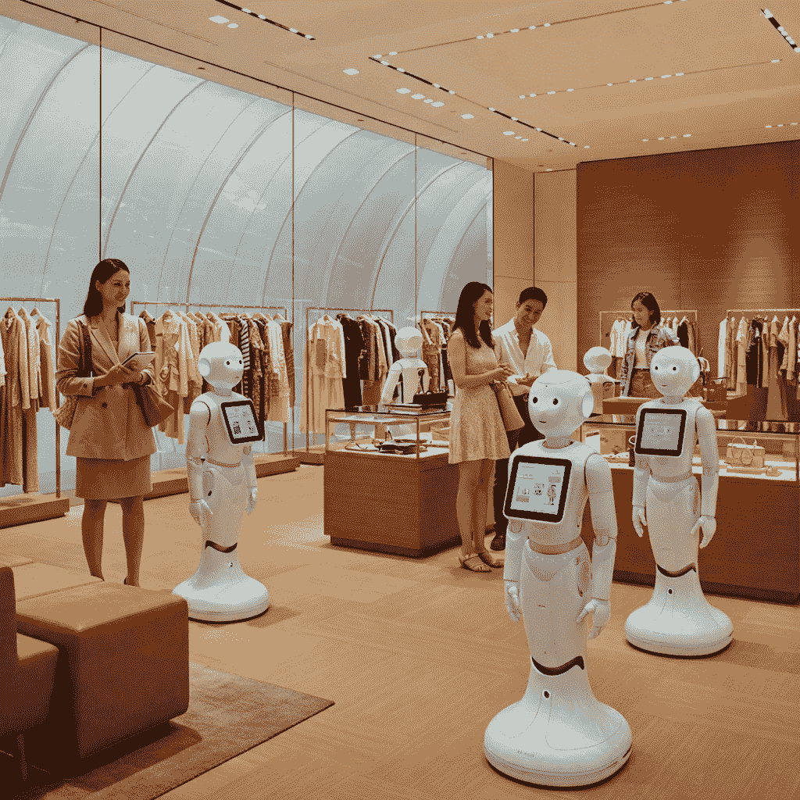
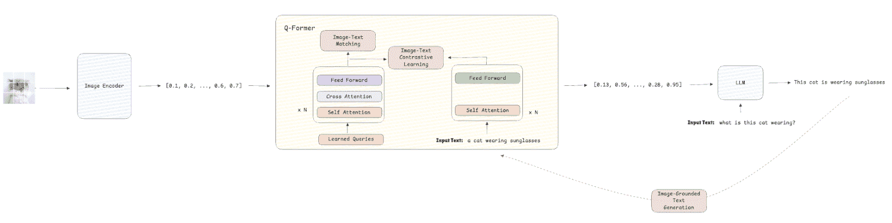
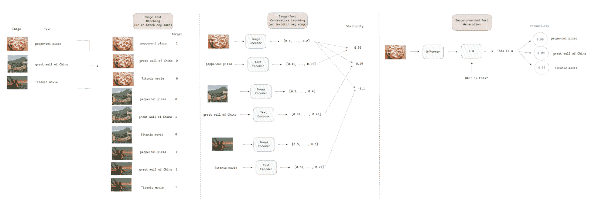
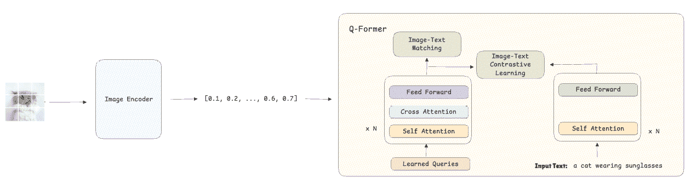
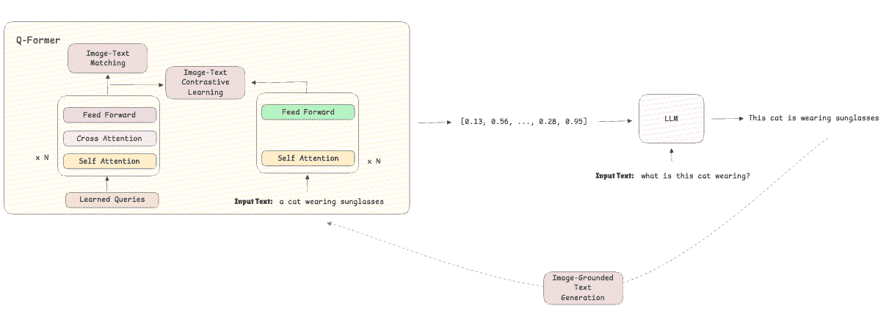
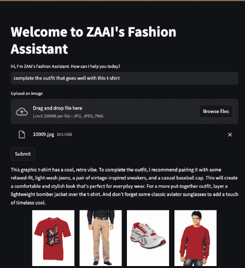
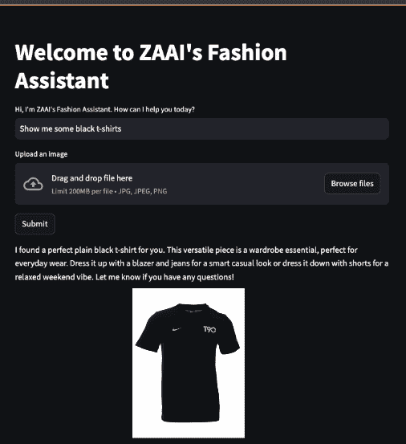

# 基于 BLIP-2 和 Gemini 的多模态搜索引擎代理

> 原文：[`towardsdatascience.com/multimodal-search-engine-agents-powered-by-blip-2-and-gemini/`](https://towardsdatascience.com/multimodal-search-engine-agents-powered-by-blip-2-and-gemini/)

*本文与 Rafael Guedes 共同撰写。*

## **简介**

传统模型只能处理单一类型的数据，如文本、图像或表格数据。多模态是人工智能研究社区中的一个趋势概念，指的是模型能够同时从多种类型的数据中学习。这项新技术（虽然不是全新的，但在过去几个月中得到了显著改进）具有众多潜在应用，将改变许多产品的用户体验。

一个很好的例子将是搜索引擎未来将如何工作，用户可以使用文本、图像、音频等多种模态的组合来输入查询。另一个例子可能是改进基于语音和文本输入的 AI 客户支持系统。在电子商务中，他们通过允许用户使用图像和文本进行搜索来增强产品发现。我们将在这篇文章中以此作为案例研究。

前沿人工智能研究实验室每月都在推出支持多种模态的模型。OpenAI 的 CLIP 和 DALL-E 以及 Salesforce 的 BLIP-2 结合了图像和文本。Meta 的 ImageBind 将多模态概念扩展到六种模态（文本、音频、深度、热成像、图像和惯性测量单元）。

在本文中，我们将通过解释其架构、其损失函数的工作方式以及其训练过程来探索 BLIP-2。我们还展示了一个实际用例，该用例结合了 BLIP-2 和 Gemini，创建了一个多模态时尚搜索代理，可以根据文本或文本和图像提示帮助客户找到最佳的搭配。



图 1：多模态搜索代理（作者使用 Gemini 绘制）

如往常一样，代码可在我们的[GitHub](https://github.com/zaai-ai/lab)上找到。

## **BLIP-2：一个多模态模型**

BLIP-2（自举语言-图像预训练）[1]是一个视觉-语言模型，旨在解决基于两种模态输入的任务，如视觉问答或多模态推理：图像和文本。正如我们下面将看到的，该模型是为了解决视觉-语言领域中的两个主要挑战而开发的：

1.  **使用冻结的预训练视觉编码器和 LLM 来**降低计算成本，与视觉和语言网络的联合训练相比，大幅减少了所需的训练资源。

1.  **通过引入 Q-Former 改进视觉-语言对齐**。Q-Former 将视觉和文本嵌入更接近，从而提高了推理任务的表现力和执行多模态检索的能力。

## **架构**

BLIP-2 的架构遵循模块化设计，集成了三个模块：

1.  **视觉编码器**是一个冻结的视觉模型，如 ViT，它从输入图像中提取视觉嵌入（然后用于下游任务）。

1.  **查询 Transformer（Q-Former）**是这种架构的关键。它由一个可训练的轻量级 Transformer 组成，作为视觉和语言模型之间的中间层。它负责从视觉嵌入生成上下文化的查询，以便它们可以被语言模型有效地处理。

1.  **LLM**是一个冻结的预训练 LLM，它处理精炼的视觉嵌入以生成文本描述或答案。



图 2：BLIP-2 架构（图片由作者提供）

## **损失函数**

BLIP-2 有三个损失函数来训练**Q-Former**模块：

+   **图像-文本对比损失** [2] 通过最大化成对图像-文本表示的相似性并推动不相似对分离来强制视觉和文本嵌入之间的对齐。

+   **图像-文本匹配损失** [3] 是一种二元分类损失，旨在通过预测文本描述是否与图像匹配（正例，即 target=1）或未匹配（负例，即 target=0）来使模型学习细粒度对齐。

+   **基于图像的文本生成损失函数** [4] 是一种交叉熵损失，用于 LLMs（大型语言模型）中预测序列中下一个标记的概率。Q-Former 架构不允许图像嵌入与文本标记之间的交互；因此，文本必须仅基于视觉信息生成，迫使模型提取相关的视觉特征。

对于**图像-文本对比损失**和**图像-文本匹配损失**，作者使用了批内负采样，这意味着如果我们有一个批大小为 512，每个图像-文本对有一个正样本和 511 个负样本。这种方法提高了效率，因为负样本是从批次中取出的，无需在整个数据集中搜索。它还提供了一组更多样化的比较，导致更好的梯度估计和更快的收敛。



图 3：训练损失解释（图片由作者提供）

## **训练过程**

BLIP-2 的训练包括两个阶段：

### **阶段 1 – 引导视觉-语言表示：**

1.  模型接收图像作为输入，这些图像使用冻结的视觉编码器转换为嵌入。

1.  与这些图像一起，模型接收它们的文本描述，这些描述也被转换为嵌入。

1.  Q-Former 使用**图像-文本对比损失**进行训练，确保视觉嵌入与其对应的文本嵌入紧密对齐，并远离不匹配的文本描述。同时，**图像-文本匹配损失**通过学习分类给定文本是否正确描述图像来帮助模型发展细粒度表示。



图 4：阶段 1 训练过程（图片由作者提供）

### **阶段 2 – 引导视觉到语言生成：**

1.  预训练的语言模型集成到架构中，用于根据先前学习到的表示生成文本。

1.  通过使用基于图像的文本生成损失，将重点从对齐转移到文本生成，这提高了模型的推理和文本生成能力。



图 5：阶段 2 训练过程（图片由作者提供）

## **使用 BLIP-2 和 Gemini 创建多模态时尚搜索代理**

在本节中，我们将利用 BLIP-2 的多模态能力构建一个时尚助手搜索代理，该代理可以接收输入文本和/或图像并返回推荐。对于代理的对话能力，我们将使用托管在 Vertex AI 上的 Gemini 1.5 Pro，而对于界面，我们将构建一个 Streamlit 应用。

在此用例中使用的时尚数据集根据 MIT 许可证授权，可以通过以下链接访问：[时尚产品图像数据集](https://www.kaggle.com/datasets/paramaggarwal/fashion-product-images-dataset)。它包含超过 44k 张时尚产品的图片。

使这一成为可能的第一步是设置一个向量数据库。这使代理能够基于商店中可用的项目图像嵌入和输入中的文本或图像嵌入执行向量化搜索。我们使用 docker 和 docker-compose 来帮助我们设置环境：

+   **Docker-Compose**与 Postgres（数据库）和允许向量搜索的 PGVector 扩展。

```py
services:
  postgres:
    container_name: container-pg
    image: ankane/pgvector
    hostname: localhost
    ports:
      - "5432:5432"
    env_file:
      - ./env/postgres.env
    volumes:
      - postgres-data:/var/lib/postgresql/data
    restart: unless-stopped

  pgadmin:
    container_name: container-pgadmin
    image: dpage/pgadmin4
    depends_on:
      - postgres
    ports:
      - "5050:80"
    env_file:
      - ./env/pgadmin.env
    restart: unless-stopped

volumes:
  postgres-data:
```

+   **Postgres 环境文件**，包含用于登录数据库的变量。

```py
POSTGRES_DB=postgres
POSTGRES_USER=admin
POSTGRES_PASSWORD=root
```

+   **Pgadmin 环境文件**，包含用于登录 UI 进行手动查询数据库的变量（可选）。

```py
[[email protected]](/cdn-cgi/l/email-protection) 
PGADMIN_DEFAULT_PASSWORD=root
```

+   **连接环境文件**，包含用于通过 Langchain 连接到 PGVector 的所有组件。

```py
DRIVER=psycopg
HOST=localhost
PORT=5432
DATABASE=postgres
USERNAME=admin
PASSWORD=root
```

一旦向量数据库设置并运行（docker-compose up -d），就是时候创建代理和工具以执行多模态搜索了。我们构建了两个代理来解决这个用例：一个用于理解用户请求的内容，另一个用于提供推荐：

+   **分类器**负责接收客户输入的消息并提取用户正在寻找的服装类别，例如，T 恤、裤子、鞋子、运动衫或衬衫。它还将返回客户想要的商品数量，以便我们可以从向量数据库中检索确切的数字。

```py
from langchain_core.output_parsers import PydanticOutputParser
from langchain_core.prompts import PromptTemplate
from langchain_google_vertexai import ChatVertexAI
from pydantic import BaseModel, Field

class ClassifierOutput(BaseModel):
    """
    Data structure for the model's output.
    """

    category: list = Field(
        description="A list of clothes category to search for ('t-shirt', 'pants', 'shoes', 'jersey', 'shirt')."
    )
    number_of_items: int = Field(description="The number of items we should retrieve.")

class Classifier:
    """
    Classifier class for classification of input text.
    """

    def __init__(self, model: ChatVertexAI) -> None:
        """
        Initialize the Chain class by creating the chain.
        Args:
            model (ChatVertexAI): The LLM model.
        """
        super().__init__()

        parser = PydanticOutputParser(pydantic_object=ClassifierOutput)

        text_prompt = """
        You are a fashion assistant expert on understanding what a customer needs and on extracting the category or categories of clothes a customer wants from the given text.
        Text:
        {text}

        Instructions:
        1\. Read carefully the text.
        2\. Extract the category or categories of clothes the customer is looking for, it can be:
            - t-shirt if the custimer is looking for a t-shirt.
            - pants if the customer is looking for pants.
            - jacket if the customer is looking for a jacket.
            - shoes if the customer is looking for shoes.
            - jersey if the customer is looking for a jersey.
            - shirt if the customer is looking for a shirt.
        3\. If the customer is looking for multiple items of the same category, return the number of items we should retrieve. If not specfied but the user asked for more than 1, return 2.
        4\. If the customer is looking for multiple category, the number of items should be 1.
        5\. Return a valid JSON with the categories found, the key must be 'category' and the value must be a list with the categories found and 'number_of_items' with the number of items we should retrieve.

        Provide the output as a valid JSON object without any additional formatting, such as backticks or extra text. Ensure the JSON is correctly structured according to the schema provided below.
        {format_instructions}

        Answer:
        """

        prompt = PromptTemplate.from_template(
            text_prompt, partial_variables={"format_instructions": parser.get_format_instructions()}
        )
        self.chain = prompt | model | parser

    def classify(self, text: str) -> ClassifierOutput:
        """
        Get the category from the model based on the text context.
        Args:
            text (str): user message.
        Returns:
            ClassifierOutput: The model's answer.
        """
        try:
            return self.chain.invoke({"text": text})
        except Exception as e:
            raise RuntimeError(f"Error invoking the chain: {e}") 
```

+   **助手**负责回答从向量数据库检索的个性化推荐。在这种情况下，我们也在利用 Gemini 的多模态能力分析检索到的图像，以产生更好的答案。

```py
from langchain_core.output_parsers import PydanticOutputParser
from langchain_core.prompts import PromptTemplate
from langchain_google_vertexai import ChatVertexAI
from pydantic import BaseModel, Field

class AssistantOutput(BaseModel):
    """
    Data structure for the model's output.
    """

    answer: str = Field(description="A string with the fashion advice for the customer.")

class Assistant:
    """
    Assitant class for providing fashion advice.
    """

    def __init__(self, model: ChatVertexAI) -> None:
        """
        Initialize the Chain class by creating the chain.
        Args:
            model (ChatVertexAI): The LLM model.
        """
        super().__init__()

        parser = PydanticOutputParser(pydantic_object=AssistantOutput)

        text_prompt = """
        You work for a fashion store and you are a fashion assistant expert on understanding what a customer needs.
        Based on the items that are available in the store and the customer message below, provide a fashion advice for the customer.
        Number of items: {number_of_items}

        Images of items:
        {items}

        Customer message:
        {customer_message}

        Instructions:
        1\. Check carefully the images provided.
        2\. Read carefully the customer needs.
        3\. Provide a fashion advice for the customer based on the items and customer message.
        4\. Return a valid JSON with the advice, the key must be 'answer' and the value must be a string with your advice.

        Provide the output as a valid JSON object without any additional formatting, such as backticks or extra text. Ensure the JSON is correctly structured according to the schema provided below.
        {format_instructions}

        Answer:
        """

        prompt = PromptTemplate.from_template(
            text_prompt, partial_variables={"format_instructions": parser.get_format_instructions()}
        )
        self.chain = prompt | model | parser

    def get_advice(self, text: str, items: list, number_of_items: int) -> AssistantOutput:
        """
        Get advice from the model based on the text and items context.
        Args:
            text (str): user message.
            items (list): items found for the customer.
            number_of_items (int): number of items to be retrieved.
        Returns:
            AssistantOutput: The model's answer.
        """
        try:
            return self.chain.invoke({"customer_message": text, "items": items, "number_of_items": number_of_items})
        except Exception as e:
            raise RuntimeError(f"Error invoking the chain: {e}") 
```

在工具方面，我们基于 BLIP-2 定义了一个。它由一个接收文本或图像作为输入并返回归一化嵌入的函数组成。根据输入，嵌入是通过 BLIP-2 的文本嵌入模型或图像嵌入模型产生的。

```py
from typing import Optional

import numpy as np
import torch
import torch.nn.functional as F
from PIL import Image
from PIL.JpegImagePlugin import JpegImageFile
from transformers import AutoProcessor, Blip2TextModelWithProjection, Blip2VisionModelWithProjection

PROCESSOR = AutoProcessor.from_pretrained("Salesforce/blip2-itm-vit-g")
TEXT_MODEL = Blip2TextModelWithProjection.from_pretrained("Salesforce/blip2-itm-vit-g", torch_dtype=torch.float32).to(
    "cpu"
)
IMAGE_MODEL = Blip2VisionModelWithProjection.from_pretrained(
    "Salesforce/blip2-itm-vit-g", torch_dtype=torch.float32
).to("cpu")

def generate_embeddings(text: Optional[str] = None, image: Optional[JpegImageFile] = None) -> np.ndarray:
    """
    Generate embeddings from text or image using the Blip2 model.
    Args:
        text (Optional[str]): customer input text
        image (Optional[Image]): customer input image
    Returns:
        np.ndarray: embedding vector
    """
    if text:
        inputs = PROCESSOR(text=text, return_tensors="pt").to("cpu")
        outputs = TEXT_MODEL(**inputs)
        embedding = F.normalize(outputs.text_embeds, p=2, dim=1)[:, 0, :].detach().numpy().flatten()
    else:
        inputs = PROCESSOR(images=image, return_tensors="pt").to("cpu", torch.float16)
        outputs = IMAGE_MODEL(**inputs)
        embedding = F.normalize(outputs.image_embeds, p=2, dim=1).mean(dim=1).detach().numpy().flatten()

    return embedding 
```

注意，我们使用不同的嵌入模型与 PGVector 建立连接，因为这是强制性的，尽管它将不会被使用，因为我们将直接存储 BLIP-2 产生的嵌入。

在下面的循环中，我们遍历所有服装类别，加载图像，并将要存储在向量数据库中的嵌入创建并附加到列表中。此外，我们将图像路径作为文本存储，以便我们可以在 Streamlit 应用程序中渲染它。最后，我们存储类别以根据分类代理预测的类别过滤结果。

```py
import glob
import os

from dotenv import load_dotenv
from langchain_huggingface.embeddings import HuggingFaceEmbeddings
from langchain_postgres.vectorstores import PGVector
from PIL import Image

from blip2 import generate_embeddings

load_dotenv("env/connection.env")

CONNECTION_STRING = PGVector.connection_string_from_db_params(
    driver=os.getenv("DRIVER"),
    host=os.getenv("HOST"),
    port=os.getenv("PORT"),
    database=os.getenv("DATABASE"),
    user=os.getenv("USERNAME"),
    password=os.getenv("PASSWORD"),
)

vector_db = PGVector(
    embeddings=HuggingFaceEmbeddings(model_name="nomic-ai/modernbert-embed-base"),  # does not matter for our use case
    collection_name="fashion",
    connection=CONNECTION_STRING,
    use_jsonb=True,
)

if __name__ == "__main__":

    # generate image embeddings
    # save path to image in text
    # save category in metadata
    texts = []
    embeddings = []
    metadatas = []

    for category in glob.glob("images/*"):
        cat = category.split("/")[-1]
        for img in glob.glob(f"{category}/*"):
            texts.append(img)
            embeddings.append(generate_embeddings(image=Image.open(img)).tolist())
            metadatas.append({"category": cat})

    vector_db.add_embeddings(texts, embeddings, metadatas)
```

我们现在可以构建我们的 Streamlit 应用程序，与我们的助手聊天并请求推荐。聊天从代理询问如何帮助并提供一个供客户写入消息和/或上传文件的框开始。

一旦客户回复，工作流程如下：

+   分类代理识别客户正在寻找的服装类别以及他们想要多少单位。

+   如果客户上传文件，该文件将被转换为嵌入，我们将根据客户想要的服装类别和数量在向量数据库中寻找类似的项目。

+   然后将检索到的项目和客户的输入消息发送到助手代理，以生成与检索到的图像一起呈现的推荐消息。

+   如果客户没有上传文件，过程相同，但不是生成用于检索的图像嵌入，而是创建文本嵌入。

```py
import os

import streamlit as st
from dotenv import load_dotenv
from langchain_google_vertexai import ChatVertexAI
from langchain_huggingface.embeddings import HuggingFaceEmbeddings
from langchain_postgres.vectorstores import PGVector
from PIL import Image

import utils
from assistant import Assistant
from blip2 import generate_embeddings
from classifier import Classifier

load_dotenv("env/connection.env")
load_dotenv("env/llm.env")

CONNECTION_STRING = PGVector.connection_string_from_db_params(
    driver=os.getenv("DRIVER"),
    host=os.getenv("HOST"),
    port=os.getenv("PORT"),
    database=os.getenv("DATABASE"),
    user=os.getenv("USERNAME"),
    password=os.getenv("PASSWORD"),
)

vector_db = PGVector(
    embeddings=HuggingFaceEmbeddings(model_name="nomic-ai/modernbert-embed-base"),  # does not matter for our use case
    collection_name="fashion",
    connection=CONNECTION_STRING,
    use_jsonb=True,
)

model = ChatVertexAI(model_name=os.getenv("MODEL_NAME"), project=os.getenv("PROJECT_ID"), temperarture=0.0)
classifier = Classifier(model)
assistant = Assistant(model)

st.title("Welcome to ZAAI's Fashion Assistant")

user_input = st.text_input("Hi, I'm ZAAI's Fashion Assistant. How can I help you today?")

uploaded_file = st.file_uploader("Upload an image", type=["jpg", "jpeg", "png"])

if st.button("Submit"):

    # understand what the user is asking for
    classification = classifier.classify(user_input)

    if uploaded_file:

        image = Image.open(uploaded_file)
        image.save("input_image.jpg")
        embedding = generate_embeddings(image=image)

    else:

        # create text embeddings in case the user does not upload an image
        embedding = generate_embeddings(text=user_input)

    # create a list of items to be retrieved and the path
    retrieved_items = []
    retrieved_items_path = []
    for item in classification.category:
        clothes = vector_db.similarity_search_by_vector(
            embedding, k=classification.number_of_items, filter={"category": {"$in": [item]}}
        )
        for clothe in clothes:
            retrieved_items.append({"bytesBase64Encoded": utils.encode_image_to_base64(clothe.page_content)})
            retrieved_items_path.append(clothe.page_content)

    # get assistant's recommendation
    assistant_output = assistant.get_advice(user_input, retrieved_items, len(retrieved_items))
    st.write(assistant_output.answer)

    cols = st.columns(len(retrieved_items)+1)
    for col, retrieved_item in zip(cols, ["input_image.jpg"]+retrieved_items_path):
        col.image(retrieved_item)

    user_input = st.text_input("")

else:
    st.warning("Please provide text.")
```

以下是可以看到的两个示例：

图 6 显示了一个示例，其中客户上传了一张红色 T 恤的图片，并要求代理完成这套服装。



图 6：文本和图像输入示例（图片由作者提供）

图 7 显示了一个更直接的示例，其中客户要求代理展示黑色 T 恤。



图 7：文本输入示例（图片由作者提供）

## **结论**

多模态 AI 不再是仅仅一个研究课题。它正在工业界被用来重塑客户与公司目录互动的方式。在这篇文章中，我们探讨了如何将 BLIP-2 和 Gemini 这样的多模态模型结合起来解决现实世界问题，并以可扩展的方式为客户提供更个性化的体验。

我们深入探讨了 BLIP-2 的架构，展示了它是如何弥合文本和图像模态之间的差距。为了扩展其功能，我们开发了一套代理系统，每个代理都专注于不同的任务。该系统集成了一个 LLM（Gemini）和向量数据库，使得可以使用文本和图像嵌入检索产品目录。我们还利用了 Gemini 的多模态推理来改进销售助手代理的响应，使其更加人性化。

使用 BLIP-2、Gemini 和 PG Vector 等工具，多模态搜索和检索的未来已经到来，未来的搜索引擎将与我们今天使用的非常不同。

## **关于我**

人工智能领域的连续创业者和领导者。我为商业开发人工智能产品，并投资于专注于人工智能的初创公司。

[ZAAI 创始人](http://zaai.ai/) | [领英](https://www.linkedin.com/in/luisbrasroque/) | [X/Twitter](https://x.com/luisbrasroque)

## **参考文献**

[1] 李军南，李东旭，西尔维奥·萨瓦雷塞，史蒂文·侯。2023\. BLIP-2：使用冻结图像编码器和大型语言模型启动语言-图像预训练。arXiv:2301.12597

[2] 普拉南·科斯拉，皮奥特·特特瓦克，王晨，阿龙·萨纳，田永龙，菲利普·伊索拉，阿龙·马希诺特，刘策，克里什南·迪利普。2020\. 监督对比学习。arXiv:2004.11362

[3] 李军南，拉姆普拉萨斯·R·塞尔瓦拉朱，阿基莱什·迪帕克·戈特马尔，沙菲克·乔蒂，辛格·熊，史蒂文·侯。2021\. 在融合前对齐：使用动量蒸馏进行视觉和语言表示学习。arXiv:2107.07651

[4] 李东，杨楠，王文辉，魏福如，刘晓东，王宇，高建峰，周明，侯晓鸥。2019\. 用于自然语言理解和生成的统一语言模型预训练。arXiv:1905.03197
