# 多元线性回归分析

> 原文：[`towardsdatascience.com/multiple-linear-regression-analysis/`](https://towardsdatascience.com/multiple-linear-regression-analysis/)
> 
> <mdspan datatext="el1747886201306" class="mdspan-comment">你可以在这个帖子的底部找到这个示例的完整代码。</mdspan>

当你的响应变量 Y 是连续的，并且你至少有 k 个协变量，或者与它线性相关的独立变量时，使用多元回归。数据的形式如下：

(Y₁, X₁), … ,(Yᵢ, Xᵢ), … ,(Yₙ, Xₙ)

其中 Xᵢ = (Xᵢ₁, …, Xᵢₖ) 是协变量的向量，n 是观察值的数量。在这里，Xi 是第 i 个观察值的 k 个协变量值的向量。

## 理解数据

为了使这个问题具体化，想象以下场景：

你喜欢跑步并通过记录每天跑的距离来跟踪你的表现。在连续的 100 天内，你收集了以下四条信息：

+   你跑的距离，

+   你跑步的小时数，

+   你昨晚睡的小时数，

+   以及你工作的小时数

现在，在第 101 天，你记录了除了跑步距离之外的所有信息。你希望使用你拥有的信息来估计这个缺失的值：你跑步的小时数，前一天你睡的小时数，以及那天你工作的小时数。

为了做到这一点，你可以依靠前 100 天的数据，其形式如下：

**(Y₁, X₁), … , (Yᵢ, Xᵢ), … , (Y₁₀₀, X₁₀₀)**

在这里，每个 **Yᵢ** 是你在第 *i* 天跑的距离，每个协变量向量 **Xᵢ = (Xᵢ₁, Xᵢ₂, Xᵢ₃)** 对应于：

+   **Xᵢ₁**: 跑步的小时数，

+   **Xᵢ₂**: 前一晚睡的小时数，

+   **Xᵢ₃**: 那天工作的小时数。

指数 *i = 1, …, 100* 指的是具有完整数据的 100 天。有了这个数据集，你现在可以拟合一个多元线性回归模型来估计第 101 天的缺失响应变量。

## 模型的规格

如果我们假设响应变量和协变量之间的线性关系，你可以使用皮尔逊相关系数来衡量，我们可以将模型指定如下：

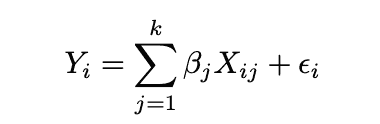

线性回归模型的规格

对于 i = 1, …, n，其中 E(ϵᵢ | Xᵢ₁, … , Xᵢₖ)。为了考虑截距，第一个变量设置为 **Xᵢ₁ = 1**，对于 i =1, …, n。为了估计系数，模型以矩阵形式表示。

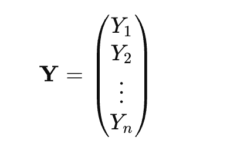

结果变量。

协变量将表示为：

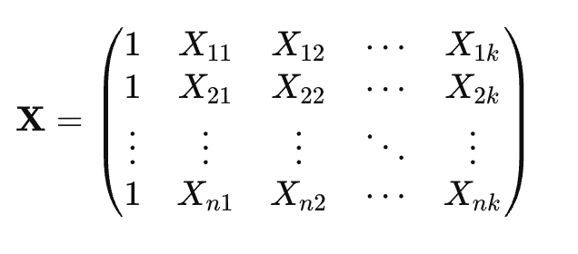

X 是 **设计矩阵**（包含截距和 k 个协变量）

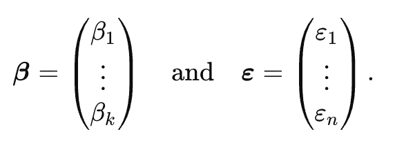

β 是系数的列向量，用于线性回归模型；ε 是随机误差项的列向量，每个观察值一个。

然后，我们可以将模型重写为：

Y = Xβ + ε

## 系数估计

假设(k+1)*(k+1)矩阵是可逆的，最小二乘估计的形式如下：

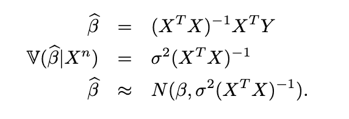

β的 least squares 估计。

我们可以推导出回归函数的估计、σ²的无偏估计以及βⱼ的近似 1−α置信区间：

+   回归函数的估计：r(x) = ∑ⱼ₌₁ᵏ βⱼ xⱼ

+   σ̂² = (1 / (n − k)) × ∑ᵢ₌₁ⁿ ε̂ᵢ² 其中 ϵ̂ = Y − Xβ̂ 是残差向量。

+   并且 β̂ⱼ ± tₙ₋ₖ,₁₋α⁄₂ × SE(β̂ⱼ) 是一个近似(1 − α)的置信区间。其中 SE(β̂ⱼ)是矩阵σ̂²(Xᵀ X)⁻¹的第 j 个对角元素。

## 应用示例

由于我们没有记录我们的跑步表现数据，我们将使用 1960 年 47 个州的犯罪数据集，可以从[这里](https://stats.oarc.ucla.edu/wp-content/uploads/2016/02/crime.txt)获得。在我们拟合线性回归之前，我们必须遵循许多步骤。

**理解数据的不同变量。**

数据的前 9 个观测值如下：

```py
 R	   Age	S	Ed	Ex0	Ex1	LF	M	N	NW	U1	U2	W	X
79.1	151	1	91	58	56	510	950	33	301	108	41	394	261
163.5	143	0	113	103	95	583	1012 13	102	96	36	557	194
57.8	142	1	89	45	44	533	969	18	219	94	33	318	250
196.9	136	0	121	149	141	577	994	157	80	102	39	673	167
123.4	141	0	121	109	101	591	985	18	30	91	20	578	174
68.2	121	0	110	118	115	547	964	25	44	84	29	689	126
96.3	127	1	111	82	79	519	982	4	139	97	38	620	168
155.5	131	1	109	115	109	542	969	50	179	79	35	472	206
85.6	157	1	90	65	62	553	955	39	286	81	28	421	239
```

数据有 14 个连续变量（响应变量 R、12 个预测变量和一个分类变量 S）：

1.  R：犯罪率：每百万人口向警方报告的犯罪数量

1.  年龄：每 1000 人口中 14-24 岁男性的数量

1.  S：南方各州的指标变量（0 = 否，1 = 是）

1.  Ed：25 岁及以上人群的平均受教育年限乘以 10

1.  Ex0：1960 年州和地方政府对警察的人均支出

1.  Ex1：1959 年州和地方政府对警察的人均支出

1.  LF：每 1000 名 14-24 岁城市男性劳动力参与率

1.  M：每 1000 名女性的男性人数

1.  N：州人口规模（以十万为单位）

1.  NW：每 1000 人口中的非白人数量

1.  U1：14-24 岁城市男性的失业率（每 1000 人）

1.  U2：35-39 岁城市男性的失业率（每 1000 人）

1.  W：可转让商品和资产或家庭收入的中间值（以十美元为单位）

1.  X：每 1000 个家庭中收入低于中位数一半的家庭数量

数据没有缺失值。

#### 协变量 X 与响应变量 Y 之间关系的图形分析

在执行线性回归时，图形分析解释变量与响应变量之间的关系是一个步骤。

它有助于可视化线性趋势，检测异常值，并在构建任何模型之前评估变量的相关性。

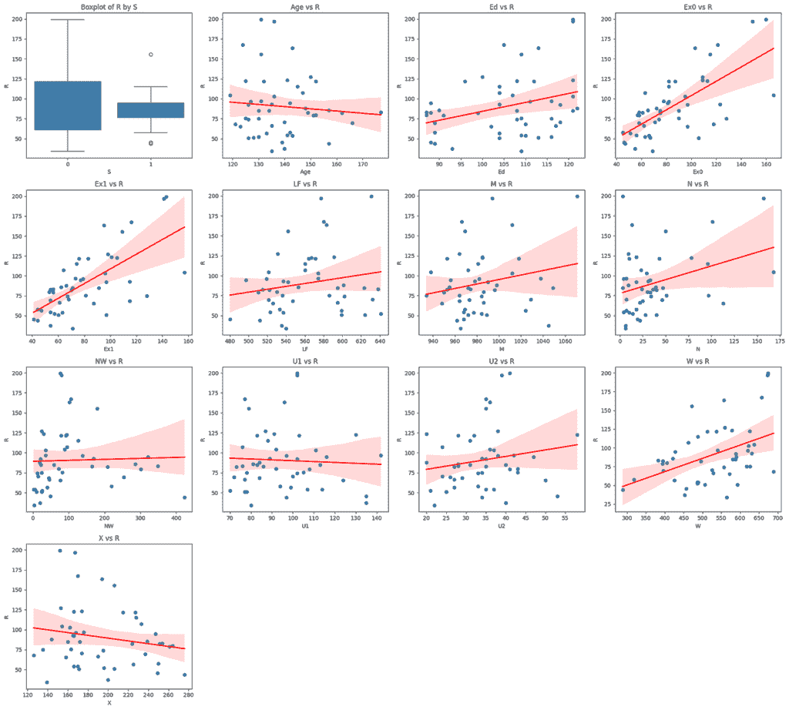

**带有拟合线性回归线的箱线图和散点图**说明了每个变量与**R**之间的趋势。

一些变量与犯罪率呈正相关，而其他变量则呈负相关。

例如，我们观察到 R（犯罪率）与 Ex1 之间有强烈的正相关关系。

相反，年龄似乎与犯罪率呈负相关。

最后，二元变量 S（表示区域：北方或南方）的箱线图表明，两个地区的犯罪率相对相似。然后，我们可以分析相关矩阵。

## 皮尔逊相关矩阵的热图

相关矩阵使我们能够研究变量之间关系的强度。虽然皮尔逊相关通常用于衡量线性关系，但当我们要捕捉变量之间单调的、可能非线性的关系时，斯皮尔曼相关更为合适。

在这次分析中，我们将使用斯皮尔曼相关来更好地解释这种非线性关联。

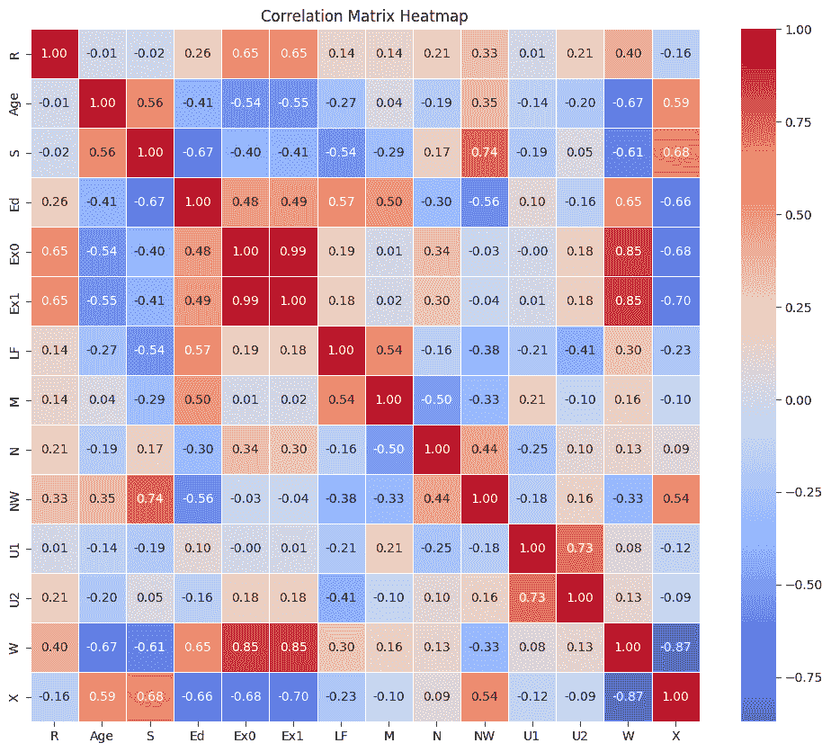

Python 中的**相关矩阵热图**

相关矩阵的第一行显示了每个协变量与响应变量 R 之间关系的强度。

例如，Ex0 和 Ex1 都与 R 有超过 60%的相关性，表明有很强的关联。这些变量似乎是对犯罪率的好预测因子。

然而，由于 Ex0 和 Ex1 之间的相关性几乎完美，它们很可能传达了相似的信息。为了避免冗余，我们可以只选择其中一个，最好是那个与 R 相关性最强的。

当几个变量彼此之间**高度相关（例如，相关系数为 60%）**时，它们往往携带冗余信息。在这种情况下，我们只保留其中一个——与响应变量 R 最强烈相关的那个。这使我们能够减少多重共线性。

这个练习使我们能够选择这些变量：[‘Ex1’，‘LF’，‘M’，‘N’，‘NW’，‘U2’]。

## 使用 VIF（方差膨胀因子）研究多重共线性

在拟合逻辑回归之前，研究多重共线性是很重要的。

当预测变量之间存在相关性时，系数估计的标准误差会增加，导致它们的方差膨胀。方差膨胀因子（VIF）是一种诊断工具，用于衡量由于多重共线性而膨胀的预测变量系数的方差，它通常在回归输出的“VIF”列下提供。

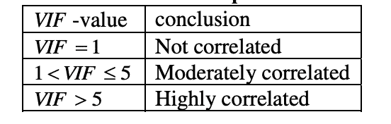

VIF 解释

这个 VIF 是针对模型中的每个预测变量计算的。方法是将第 i 个预测变量对其他所有预测变量进行回归。然后我们获得 Rᵢ²，可以使用该公式来计算 VIF：

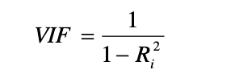

第 i 个变量的 VIF 值

下表展示了六个剩余变量的 VIF 值，所有这些值都低于 5。这表明多重共线性不是问题，我们可以继续拟合线性回归模型。

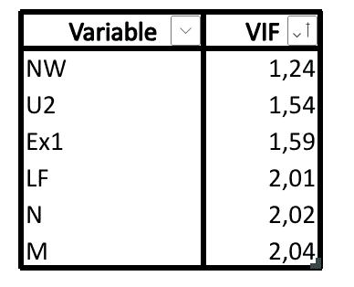

每个变量的 VIF 值都高于 5。

## 在六个变量上拟合线性回归

如果我们在 10 个变量上拟合犯罪率的线性回归，我们得到以下结果：

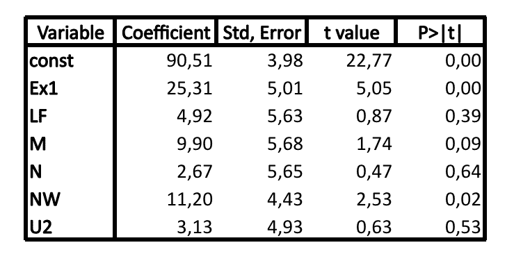

多元线性回归分析的结果输出。相应的代码在附录中提供。

## 残差的诊断

在解释回归结果之前，我们必须首先评估残差的质量，特别是通过检查自相关、同方差（恒定方差）和正态性。残差的诊断如下表所示：

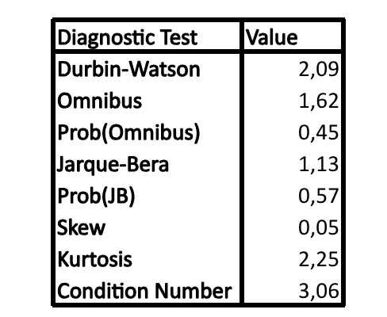

残差的诊断。来到回归的总结

+   Durbin-Watson ≈2 表明残差中没有自相关。

+   从全距到峰度，所有值都表明残差是对称的，并且具有正态分布。

+   低条件数（3.06）确认了预测变量之间没有多重共线性。

## 主要要点

我们也可以通过 R 平方和 F 统计量等指标来评估模型的总体质量，这些指标在本例中显示出令人满意的结果。（更多细节请见附录。）

我们现在可以从统计角度解释回归系数。

我们故意排除了对结果进行任何业务特定解释。

本分析的目标是说明使用多元线性回归建模问题的几个简单且必要的步骤。

在 5%的显著性水平下，有两个系数在统计上是显著的：Ex1 和 NW。

这并不令人惊讶，因为这些是两个与响应变量 R 的相关性大于 40%的变量。根据研究的背景和目标，可能需要移除或重新评估不具有统计显著性的变量，或者保留它们。

这篇文章为你提供了一些执行线性回归的指南：

+   通过图形分析检查**线性**并研究**响应变量与预测变量之间的相关性**是很重要的。

+   检查变量之间的相关性有助于减少**多重共线性**并支持**变量选择**。

+   当两个预测变量高度相关时，它们可能传达**冗余信息**。在这种情况下，你可以保留与响应变量**更强烈相关**的一个，或者根据领域专业知识——保留具有更大**业务相关性**或**可解释性**的一个。

+   **方差膨胀因子（VIF）**是一个有用的工具，可以量化并评估多重共线性。

+   在统计上解释模型系数之前，验证残差的自相关、正态性和同方差性是至关重要的，以确保模型假设得到满足。

虽然这项分析提供了有价值的见解，但它也存在某些局限性。

数据集中没有缺失值简化了研究，但在现实世界的场景中这种情况很少见。

如果你正在构建一个**预测模型**，将数据**分割**成**训练集**、**测试集**以及可能的一个**时间外验证集**对于确保稳健的评估非常重要。

对于**变量选择**，可以应用**逐步选择**和其他特征选择方法。

当比较多个模型时，定义适当的**性能指标**是至关重要的。

在线性回归的情况下，常用的指标包括**平均绝对误差（MAE）**和**均方误差（MSE）**。

### 图片来源

本文中的所有图像和可视化都是由作者使用 Python（pandas、matplotlib、seaborn 和 plotly）以及 Excel 创建的，除非另有说明。

### 参考文献

Wasserman, L. (2013). *All of statistics: a concise course in statistical inference*. Springer Science & Business Media.

### 数据与许可

本文使用的数据集包含了 1960 年 47 个美国州的犯罪相关和人口统计数据。

它源自联邦调查局的统一犯罪报告（UCR）计划以及额外的美国政府来源。

作为美国政府作品，数据根据 17 U.S. Code § 105 属于公共领域，可以无限制地使用、分享和复制。

**来源**：

+   [联邦调查局统一犯罪报告计划](https://www.fbi.gov/services/cjis/ucr)

+   [ICPSR 数据存储库](https://www.icpsr.umich.edu)

+   [加州大学洛杉矶分校统计在线资源中心](https://stats.oarc.ucla.edu/ucla/about/)

### 代码

> 导入数据

```py
import pandas as pd
import matplotlib.pyplot as plt
import seaborn as sns

# Load the dataset
df = pd.read_csv('data/Multiple_Regression_Dataset.csv')
df.head()
```

> *变量的可视化分析*

```py
Create a new figure

# Extract response variable and covariates
response = 'R'
covariates = [col for col in df.columns if col != response]

fig, axes = plt.subplots(nrows=4, ncols=4, figsize=(20, 18))
axes = axes.flatten()

# Plot boxplot for binary variable 'S'
sns.boxplot(data=df, x='S', y='R', ax=axes[0])
axes[0].set_title('Boxplot of R by S')
axes[0].set_xlabel('S')
axes[0].set_ylabel('R')

# Plot regression lines for all other covariates
plot_index = 1
for cov in covariates:
    if cov != 'S':
        sns.regplot(data=df, x=cov, y='R', ax=axes[plot_index], scatter=True, line_kws={"color": "red"})
        axes[plot_index].set_title(f'{cov} vs R')
        axes[plot_index].set_xlabel(cov)
        axes[plot_index].set_ylabel('R')
        plot_index += 1

# Hide unused subplots
for i in range(plot_index, len(axes)):
    fig.delaxes(axes[i])

fig.tight_layout()
plt.show()
```

> 变量之间的相关性分析

```py
spearman_corr = df.corr(method='spearman')
plt.figure(figsize=(12, 10))
sns.heatmap(spearman_corr, annot=True, cmap="coolwarm", fmt=".2f", linewidths=0.5)
plt.title("Correlation Matrix Heatmap")
plt.show()
```

> 过滤高度相关（ρ > 0.6）的预测变量

```py
# Step 2: Correlation of each variable with response R
spearman_corr_with_R = spearman_corr['R'].drop('R')  # exclude R-R

# Step 3: Identify pairs of covariates with strong inter-correlation (e.g., > 0.9)
strong_pairs = []
threshold = 0.6
covariates = spearman_corr_with_R.index

for i, var1 in enumerate(covariates):
    for var2 in covariates[i+1:]:
        if abs(spearman_corr.loc[var1, var2]) > threshold:
            strong_pairs.append((var1, var2))

# Step 4: From each correlated pair, keep only the variable most correlated with R
to_keep = set()
to_discard = set()

for var1, var2 in strong_pairs:
    if abs(spearman_corr_with_R[var1]) >= abs(spearman_corr_with_R[var2]):
        to_keep.add(var1)
        to_discard.add(var2)
    else:
        to_keep.add(var2)
        to_discard.add(var1)

# Final selection: all covariates excluding the ones to discard due to redundancy
final_selected_variables = [var for var in covariates if var not in to_discard]

final_selected_variables
```

> 使用 VIF 分析多重共线性

```py
from statsmodels.stats.outliers_influence import variance_inflation_factor
from statsmodels.tools.tools import add_constant
from sklearn.preprocessing import StandardScaler

X = df[final_selected_variables]  

X_with_const = add_constant(X)  

vif_data = pd.DataFrame()
vif_data["variable"] = X_with_const.columns
vif_data["VIF"] = [variance_inflation_factor(X_with_const.values, i)
                   for i in range(X_with_const.shape[1])]

vif_data = vif_data[vif_data["variable"] != "const"]

print(vif_data)
```

> 在标准化后，在六个变量上拟合线性回归模型，而不是将数据分割成训练集和测试集

```py
from sklearn.preprocessing import StandardScaler
from statsmodels.api import OLS, add_constant
import pandas as pd

# Variables
X = df[final_selected_variables]
y = df['R']

scaler = StandardScaler()
X_scaled_vars = scaler.fit_transform(X)

X_scaled_df = pd.DataFrame(X_scaled_vars, columns=final_selected_variables)

X_scaled_df = add_constant(X_scaled_df)

model = OLS(y, X_scaled_df).fit()
print(model.summary())
```

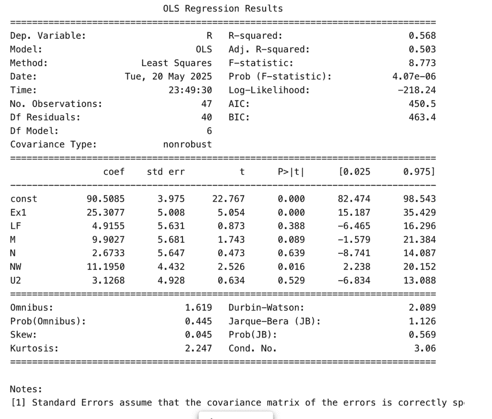

作者提供的图片：OLS 回归结果
