# 多元线性回归简单解释（第一部分）

> 原文：[`towardsdatascience.com/multiple-linear-regression-math-explained-simply-part-1/`](https://towardsdatascience.com/multiple-linear-regression-math-explained-simply-part-1/)

在这篇博客文章中，我们讨论**多元线性回归**。

<mdspan datatext="el1761024686865" class="mdspan-comment">我们都知道</mdspan>这是我们在机器学习旅程中最早学习的算法之一，因为它简单线性回归的扩展。

我们知道在简单线性回归中，我们有一个自变量和一个目标变量，而在多元线性回归中，我们有两个或更多的自变量和一个目标变量。

与仅使用 Python 应用算法不同，在这篇博客中，**让我们探索多元线性回归算法背后的数学原理**。

让我们考虑[鱼市场数据集](https://www.kaggle.com/datasets/vipullrathod/fish-market)，以了解多元线性回归背后的数学原理。

这个数据集包括每条鱼的物理属性，例如：

+   物种 – 鱼的类型（例如，鲈鱼，鲫鱼，鲑鱼）

+   重量 – 鱼的重量（克）（这将是我们的目标变量）

+   Length1, Length2, Length3 – 各种长度测量值（单位：厘米）

+   高度 – 鱼的高度（单位：厘米）

+   宽度 – 鱼体对角线宽度（单位：厘米）

为了理解多元线性回归，我们将使用两个自变量来保持简单并易于可视化。

我们将从这个数据集中考虑一个 20 个点的样本。

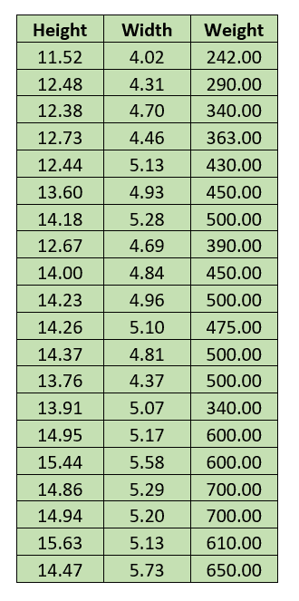

图片由作者提供

我们从鱼市场数据集中考虑了一个 20 个点的样本，它包括 20 条鱼的测量值，特别是它们的高度和宽度以及相应的重量。这三个值将帮助我们理解多元线性回归在实际中的应用。

首先，让我们使用 Python 在我们的 20 个点样本数据上拟合一个多元线性回归模型。

**代码：**

```py
import numpy as np
import pandas as pd
from sklearn.linear_model import LinearRegression

# 20-point sample data from Fish Market dataset
data = [
    [11.52, 4.02, 242.0],
    [12.48, 4.31, 290.0],
    [12.38, 4.70, 340.0],
    [12.73, 4.46, 363.0],
    [12.44, 5.13, 430.0],
    [13.60, 4.93, 450.0],
    [14.18, 5.28, 500.0],
    [12.67, 4.69, 390.0],
    [14.00, 4.84, 450.0],
    [14.23, 4.96, 500.0],
    [14.26, 5.10, 475.0],
    [14.37, 4.81, 500.0],
    [13.76, 4.37, 500.0],
    [13.91, 5.07, 340.0],
    [14.95, 5.17, 600.0],
    [15.44, 5.58, 600.0],
    [14.86, 5.29, 700.0],
    [14.94, 5.20, 700.0],
    [15.63, 5.13, 610.0],
    [14.47, 5.73, 650.0]
]

# Create DataFrame
df = pd.DataFrame(data, columns=["Height", "Width", "Weight"])

# Independent variables (Height and Width)
X = df[["Height", "Width"]]

# Target variable (Weight)
y = df["Weight"]

# Fit the model
model = LinearRegression().fit(X, y)

# Extract coefficients
b0 = model.intercept_           # β₀
b1, b2 = model.coef_            # β₁ (Height), β₂ (Width)

# Print results
print(f"Intercept (β₀): {b0:.4f}")
print(f"Height slope (β₁): {b1:.4f}")
print(f"Width slope  (β₂): {b2:.4f}") 
```

**结果：**

截距（β₀）：-1005.2810

高度斜率（β₁）：78.1404

宽度斜率（β₂）：82.0572

在这里，我们没有进行训练集和测试集的划分，因为这是一个小数据集，我们试图理解模型背后的数学原理，而不是构建模型。

***

我们使用 Python 在我们的样本数据集上应用了多元线性回归，并得到了结果。

下一步是什么？

要评估模型以查看其在预测方面的表现如何？

今天不！

在我们理解最初如何得到那些斜率和截距值之前，我们不会评估模型。

首先，我们将了解模型在幕后是如何工作的，然后使用数学方法来处理那些斜率和截距值。

***

首先，让我们绘制我们的样本数据。

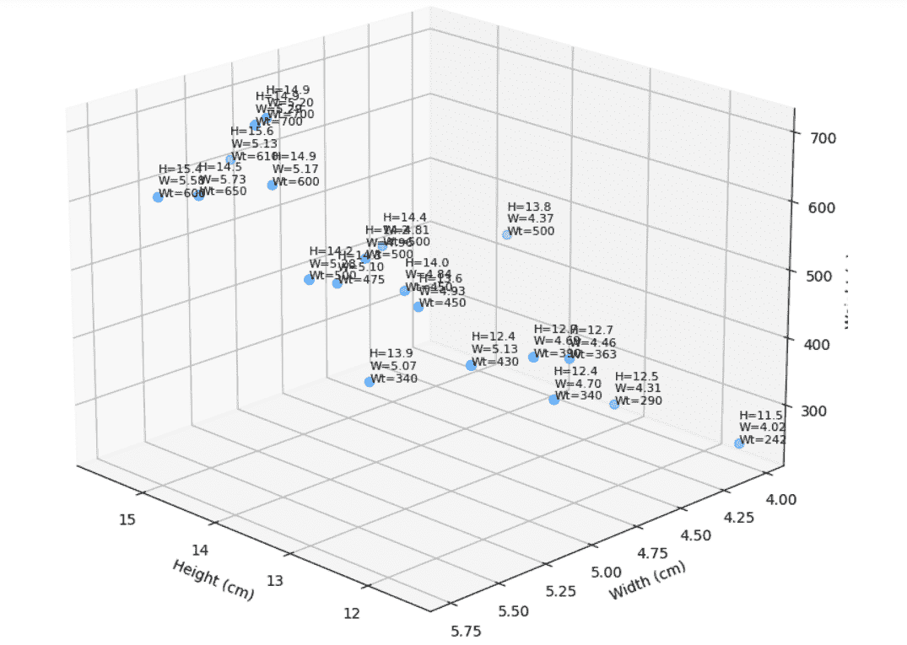

图片由作者提供

当涉及到简单线性回归时，我们只有一个自变量，数据是二维的。我们试图找到最佳拟合数据的线。

在多元线性回归中，我们可能有两个或更多的独立变量，数据是三维的。我们试图找到一个最佳拟合数据的平面。

在这里，我们考虑了两个独立变量，这意味着我们必须找到一个最佳拟合数据的平面。

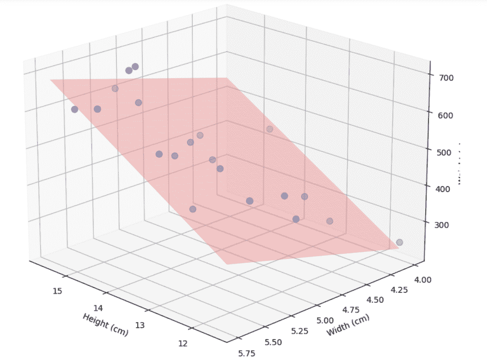

作者提供的图片

平面的方程是：

\[

y = \beta_0 + \beta_1 x_1 + \beta_2 x_2

\]

其中

**y**: 因变量（目标变量）的预测值

**β₀**: 截距（当所有 x 的值为 0 时 y 的值）

**β₁**: 特征 x₁ 的系数（或斜率）

**β₂**: 特征 x₂ 的系数

**x₁, x₂**: 自变量（特征）

假设我们已经计算了截距和斜率值，并想要计算特定点 ***i*** 的权重。

为了做到这一点，我们代入相应的值，我们称之为预测值，而实际值在我们的数据集中。我们现在正在计算该点的预测值。

让我们用 ****ŷᵢ**** 表示预测值。

\[

\hat{y}_i = \beta_0 + \beta_1 x_{i1} + \beta_2 x_{i2}

\]

**yᵢ** 表示实际值，**ŷᵢ** 表示预测值。

现在在点 ***i*** 处，让我们找到实际值和预测值之间的差异，即 **残差**。

\[

\text{Residual}_i = y_i – \hat{y}_i

\]

对于 **n** 个数据点，总残差将是

\[

\sum_{i=1}^{n} (y_i – \hat{y}_i)

\]

如果我们只计算残差的和，正负误差可能会相互抵消，导致总误差误导性地很小。

平方残差通过确保所有误差都贡献正数，同时给予较大偏差更多重视来解决此问题。

因此，我们计算残差的平方和：

\[

\text{SSR} = \sum_{i=1}^{n} (y_i – \hat{y}_i)²

\]

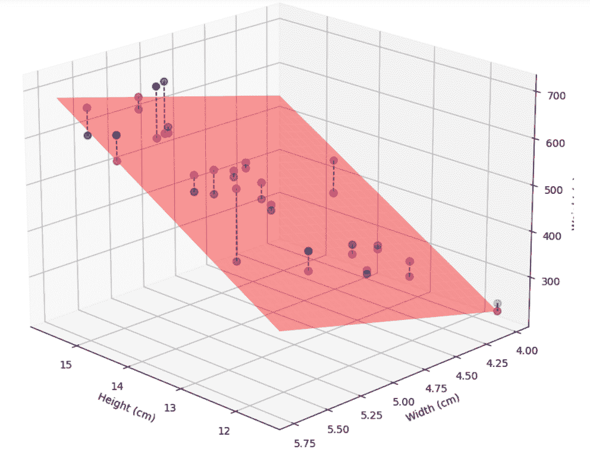

多元线性回归中的残差可视化

* * *

在多元线性回归中，模型试图通过数据拟合一个平面，使得残差的平方和最小化。

我们已经知道了平面的方程：

\[

\hat{y} = \beta_0 + \beta_1 x_1 + \beta_2 x_2

\]

现在我们需要找到最佳拟合我们的样本数据的平面方程，最小化残差的平方和。

我们已经知道 **ŷ** 是预测值，**x1** 和 **x2** 是数据集中的值。

现在剩下的项 **β₀**、**β₁** 和 **β₂**。

我们如何找到这些斜率和截距值？

在此之前，让我们看看当我们改变截距（β₀）时，平面会发生什么变化。


作者提供的 GIF

现在，让我们看看当我们改变斜率 β₁ 和 β₂ 时会发生什么。

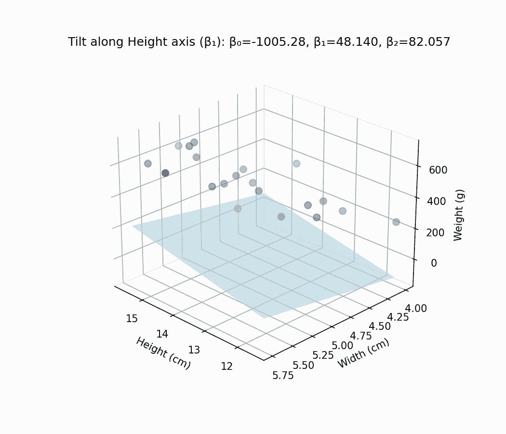

作者提供的 GIF

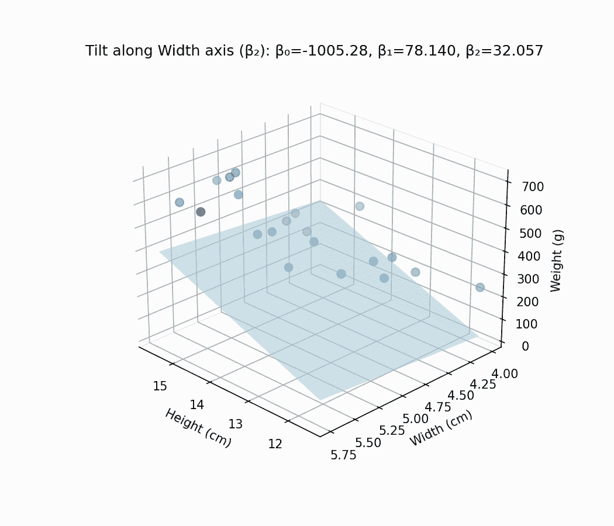

作者提供的 GIF

我们可以观察到斜率和截距的变化如何影响回归平面。

我们需要找到那些斜率和截距的确切值，使得残差的平方和最小。

* * *

现在，我们想要找到最佳拟合平面

\[

\hat{y} = \beta_0 + \beta_1 x_1 + \beta_2 x_2

\]

那个最小化**平方和残差（SSR）**：

\[

SSR = \sum_{i=1}^{n} (y_i – \hat{y}_i)² = \sum_{i=1}^{n} (y_i – \beta_0 – \beta_1 x_{i1} – \beta_2 x_{i2})²

\]

其中

\[

\hat{y}_i = \beta_0 + \beta_1 x_{i1} + \beta_2 x_{i2}

\]

* * *

我们如何找到这个最佳拟合平面的方程？

在进一步讨论之前，让我们回到我们的学校时代。

我曾经 wonder 为什么我们需要学习像微分、积分和极限这样的主题。我们在现实生活中真的使用它们吗？

我之所以那样想，是因为我发现这些主题很难理解。但是，当涉及到相对简单的主题，比如矩阵（至少在一定程度上），我从未质疑过我们为什么要学习它们或它们有什么用途。

正是在我开始学习机器学习的时候，我开始关注这些话题。

* * *

现在回到讨论中，让我们考虑一条直线。

y = 2x+1

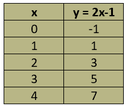

作者图片

让我们绘制这些值

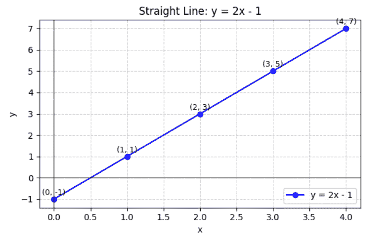

作者图片

让我们考虑直线上的两个点。

(x1, y1) = (2,3) 和 (x2, y2) = (3,5)

现在我们找到斜率。

\[

m = \frac{y_2 – y_1}{x_2 – x_1} = \frac{\text{y 的变化量}}{\text{x 的变化量}}

\]

\[

m = \frac{y_2 – y_1}{x_2 – x_1} = \frac{5 – 3}{3 – 2} = \frac{2}{1} = 2

\]

斜率是‘2’。

如果我们考虑任何两个点并计算斜率，这个值将保持不变，这意味着 y 相对于 x 的变化量在整个线上是相同的。

* * *

现在，让我们考虑方程 y=x²。

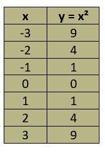

作者图片

让我们绘制这些值

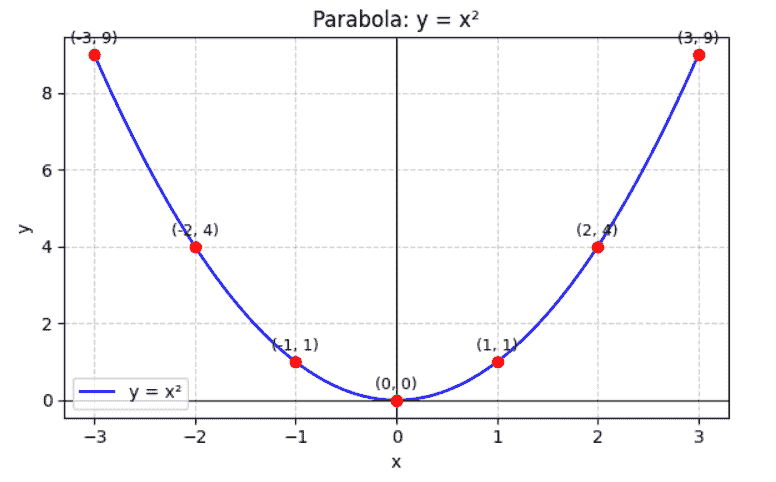

作者图片

y=x²代表一个曲线（抛物线）。

这条曲线的斜率是多少？

这条曲线有一个单一的斜率吗？

NO.

我们可以观察到斜率是连续变化的，这意味着 y 相对于 x 的变化率在整个曲线上并不相同。

这表明斜率从曲线上的一个点变化到另一个点。

换句话说，我们可以在每个特定的点上找到斜率，但并没有一个单一的斜率能代表整个曲线。

那么，我们如何找到这条曲线的斜率呢？

这就是我们要引入**微分**的地方。

首先，让我们考虑 x 轴上的一个点 x，以及距离它 h 个单位的另一个点，即点 x+h。

对于这些 x 值，相应的 y 坐标将是 f(x)和 f(x+h)，因为 y 是 x 的函数。

现在我们考虑曲线上的两个点 (x, f(x)) 和 (x+h, f(x+h))。

现在我们连接这两个点，连接曲线上两个点的线称为割线。

让我们找到这两点之间的斜率。

\[

\text{slope} = \frac{f(x + h) – f(x)}{(x + h) – x}

\]

这给出了在该区间内 y 相对于 x 的平均变化率。

但由于我们想要找到**特定点**的斜率，我们逐渐减小两点之间的距离‘h’。

当这两个点越来越近，最终重合时，**割线**（连接这两个点的线）成为该点的**切线**。这个斜率的极限值可以通过极限的概念找到。

**切线**是仅在一个点上接触曲线的直线。

它显示了该点的**瞬时斜率**。

\[

\frac{dy}{dx} = \lim_{h \to 0} \frac{f(x + h) – f(x)}{h}

\]

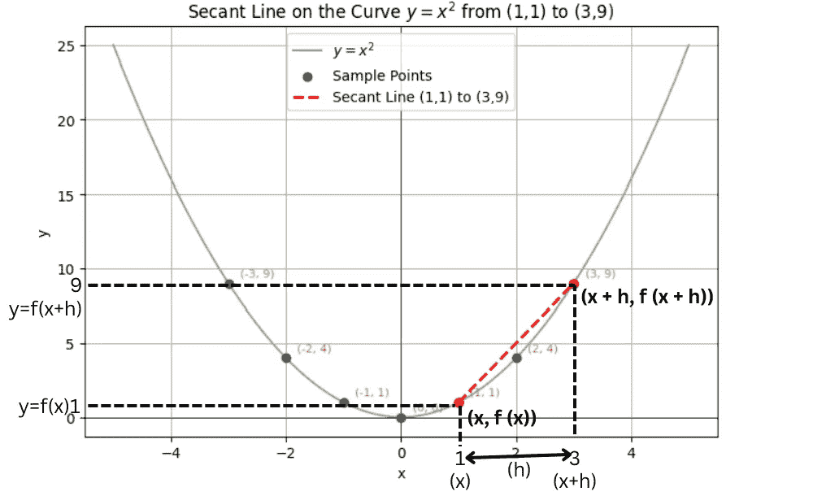

作者提供的图像

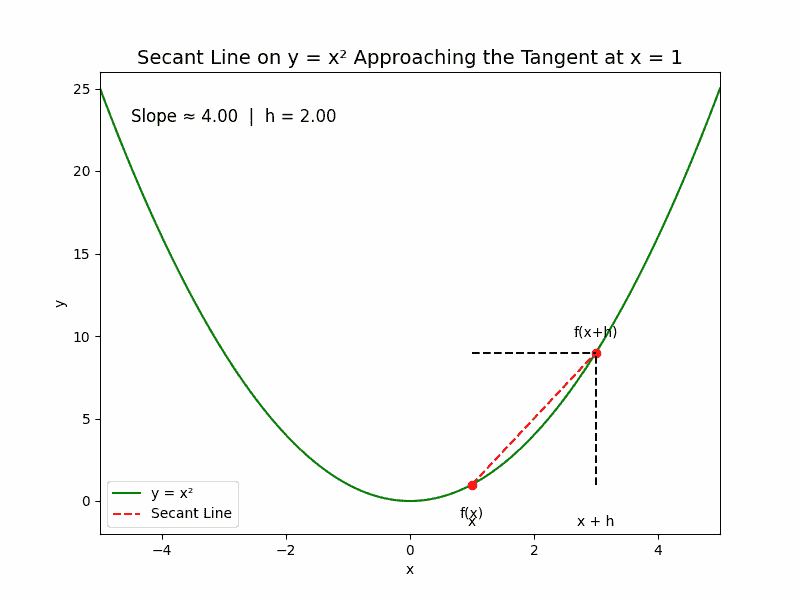

作者提供的 GIF

这就是微分学的概念。

现在让我们找到曲线 y=x²的斜率。

\[

已知：f(x) = x²

\]

\[

导数：f'(x) = \lim_{h \to 0} \frac{f(x + h) – f(x)}{h}

\] \[

= \lim_{h \to 0} \frac{(x + h)² – x²}{h}

\] \[

= \lim_{h \to 0} \frac{x² + 2xh + h² – x²}{h}

\] \[

= \lim_{h \to 0} \frac{2xh + h²}{h}

\] \[

= \lim_{h \to 0} (2x + h)

\] \[

= 2x

\]

**2x**是曲线 y=x²的斜率。

例如，在曲线 y=x²上，当 x=2 时，斜率是 2x=2×2=4。

在这一点上，我们在曲线上有坐标(2,4)，该点的斜率是 4。

这意味着在**那个确切点**，对于 x 的每 1 个单位变化，y 会有 4 个单位的变化。

现在考虑 x=0 时，斜率是 2×0=0。

这意味着 y 相对于 x 没有变化。

then y = 0.

在点(0,0)我们得到斜率为 0，这意味着(0,0)是极小点。

现在我们已经了解了微分的基本知识，让我们继续寻找最佳拟合平面。

* * *

现在，让我们回到成本函数

\[

SSR = \sum_{i=1}^{n} (y_i – \hat{y}_i)² = \sum_{i=1}^{n} (y_i – \beta_0 – \beta_1 x_{i1} – \beta_2 x_{i2})²

\]

这也代表了一个**曲线**，因为它包含了平方项。

在简单线性回归中，成本函数是：

\[

SSR = \sum_{i=1}^{n} (y_i – \hat{y}_i)² = \sum_{i=1}^{n} (y_i – \beta_0 – \beta_1 x_i)²

\]

当我们考虑随机的斜率和截距值并绘制它们时，我们可以看到一个碗形的曲线。

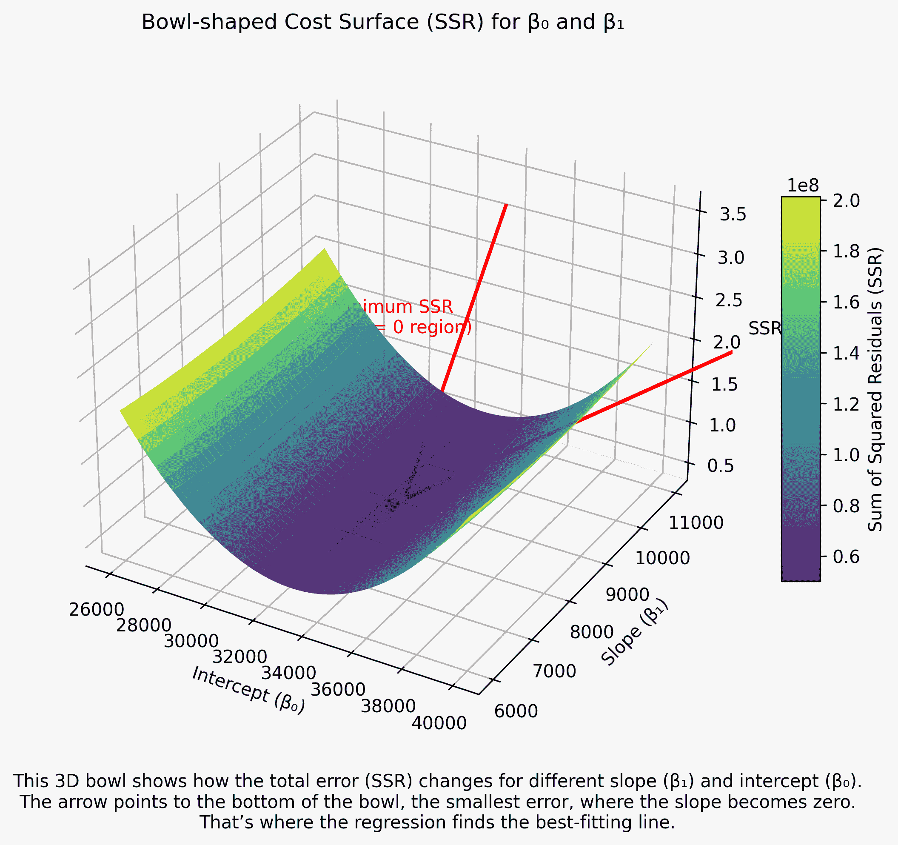

作者提供的图像

* * *

与简单线性回归相同，我们需要找到斜率等于零的点，这意味着我们得到了平方残差和（SSR）的最小值。

这里，这对应于找到β₀、β₁和β₂的值，使得 SSR 最小。这发生在 SSR 相对于每个系数的导数等于零时。

换句话说，在这个点上，即使β₀、β₁或β₂有轻微的变化，SSR 也不会改变，这表明我们已经达到了成本函数的最小点。

* * *

简单来说，我们可以说，在我们的例子 y=x²中，我们在 x=0 时得到了导数（斜率）2x=0，在该点，y 是最小的，在这种情况下是零。

现在，在我们的损失函数中，假设 SSR=y。在这里，我们正在寻找损失函数斜率为零的点处的斜率。

在 y=x² 的例子中，斜率只依赖于一个变量 x，但在我们的损失函数中，斜率依赖于三个变量：β0、β1 和 β2。

因此，我们需要在四维空间中找到一个点。就像我们在 y=x² 中得到了 (0,0) 作为最小点，在多元线性回归 (MLR) 中，我们需要找到点 (β0,β1,β2,SSR)，其中斜率（导数）等于零。

* * *

现在让我们开始推导。

由于平方残差和 (SSR) 依赖于参数 β₀、β₁ 和 β₂。

我们可以将其表示为这些参数的**函数**：

\[

L(\beta_0, \beta_1, \beta_2) = \sum_{i=1}^{n} (y_i – \beta_0 – \beta_1 x_{i1} – \beta_2 x_{i2})²

\]

**推导：**

这里，我们处理三个变量，因此不能使用常规的微分。相反，我们分别对每个变量求导，同时保持其他变量不变。这个过程称为**偏导数**。

**对 β₀ 的偏导数**

\[

\textbf{损失：}\quad L(\beta_0,\beta_1,\beta_2)=\sum_{i=1}^{n}\big(y_i-\beta_0-\beta_1 x_{i1}-\beta_2 x_{i2}\big)²

\]

\[

\textbf{令 } e_i = y_i-\beta_0-\beta_1 x_{i1}-\beta_2 x_{i2}\quad\Rightarrow\quad L=\sum e_i².

\] \[

\textbf{求导：}\quad

\frac{\partial L}{\partial \beta_0}

= \sum_{i=1}^{n} 2 e_i \cdot \frac{\partial e_i}{\partial \beta_0}

\quad\text{(链式法则：} \frac{d}{d\theta}u²=2u\,\frac{du}{d\theta}\text{)}

\] \[

\text{但是 }\frac{\partial e_i}{\partial \beta_0}

=\frac{\partial}{\partial \beta_0}(y_i-\beta_0-\beta_1 x_{i1}-\beta_2 x_{i2})

=\frac{\partial y_i}{\partial \beta_0}

-\frac{\partial \beta_0}{\partial \beta_0}

-\frac{\partial (\beta_1 x_{i1})}{\partial \beta_0}

-\frac{\partial (\beta_2 x_{i2})}{\partial \beta_0}.

\] \[

\text{由于 } y_i,\; x_{i1},\; x_{i2} \text{ 相对于 } \beta_0 \text{ 是常数；}

\text{它们的导数都是零。因此 } \frac{\partial e_i}{\partial \beta_0}=-1.

\] \[

\Rightarrow\quad \frac{\partial L}{\partial \beta_0}

= \sum 2 e_i \cdot (-1) = -2\sum_{i=1}^{n} e_i.

\] \[

\textbf{设为零（一阶条件）：}\quad

\frac{\partial L}{\partial \beta_0}=0 \;\Rightarrow\; \sum_{i=1}^{n} e_i = 0.

\] \[

\textbf{展开 } e_i:\quad

\sum_{i=1}^{n}\big(y_i-\beta_0-\beta_1 x_{i1}-\beta_2 x_{i2}\big)=0

\Rightarrow

\sum y_i – n\beta_0 – \beta_1\sum x_{i1} – \beta_2\sum x_{i2}=0.

\] \[

\textbf{求解 } \beta_0:\quad

\beta_0=\bar{y}-\beta_1 \bar{x}_1-\beta_2 \bar{x}_2

\quad\text{(除以 }n\text{ 并使用 } \bar{y}=\frac{1}{n}\sum y_i,\; \bar{x}_k=\frac{1}{n}\sum x_{ik}).

\]

* * *

**对 β1 的偏导数**

\[

\textbf{求导：}\quad

\frac{\partial L}{\partial \beta_1}

= \sum_{i=1}^{n} 2 e_i \cdot \frac{\partial e_i}{\partial \beta_1}.

\]

\[

\text{这里 }\frac{\partial e_i}{\partial \beta_1}

=\frac{\partial}{\partial \beta_1}(y_i-\beta_0-\beta_1 x_{i1}-\beta_2 x_{i2})=-x_{i1}.

\] \[

\Rightarrow\quad

\frac{\partial L}{\partial \beta_1}

= \sum 2 e_i (-x_{i1})

= -2\sum_{i=1}^{n} x_{i1} e_i.

\] \[

**设为零：**\quad

\frac{\partial L}{\partial \beta_1}=0

\;\Rightarrow\; \sum_{i=1}^{n} x_{i1} e_i = 0.

\] \[

\textbf{展开 } e_i:\quad

\sum x_{i1}\big(y_i-\beta_0-\beta_1 x_{i1}-\beta_2 x_{i2}\big)=0

\] \[

\Rightarrow\;

\sum x_{i1}y_i – \beta_0\sum x_{i1} – \beta_1\sum x_{i1}² – \beta_2\sum x_{i1}x_{i2}=0.

\]

* * *

**关于 β2 的偏导数** **求导**

\]

\textbf{求导：}\quad

\frac{\partial L}{\partial \beta_2}

= \sum_{i=1}^{n} 2 e_i \cdot \frac{\partial e_i}{\partial \beta_2}.

\]

\[

\text{这里 }\frac{\partial e_i}{\partial \beta_2}

=\frac{\partial}{\partial \beta_2}(y_i-\beta_0-\beta_1 x_{i1}-\beta_2 x_{i2})=-x_{i2}.

\] \[

\Rightarrow\quad

\frac{\partial L}{\partial \beta_2}

= \sum 2 e_i (-x_{i2})

= -2\sum_{i=1}^{n} x_{i2} e_i.

\] \[

\textbf{设为零：}\quad

\frac{\partial L}{\partial \beta_2}=0

\;\Rightarrow\; \sum_{i=1}^{n} x_{i2} e_i = 0.

\] \[

\textbf{展开 } e_i:\quad

\sum x_{i2}\big(y_i-\beta_0-\beta_1 x_{i1}-\beta_2 x_{i2}\big)=0

\] \[

\Rightarrow\;

\sum x_{i2}y_i – \beta_0\sum x_{i2} – \beta_1\sum x_{i1}x_{i2} – \beta_2\sum x_{i2}²=0.

\]

* * *

我们在执行偏导数运算后得到了这三个方程。

\[

\sum y_i – n\beta_0 – \beta_1\sum x_{i1} – \beta_2\sum x_{i2} = 0 \quad (1)

\]

\[

\sum x_{i1}y_i – \beta_0\sum x_{i1} – \beta_1\sum x_{i1}² – \beta_2\sum x_{i1}x_{i2} = 0 \quad (2)

\] \[

\sum x_{i2}y_i – \beta_0\sum x_{i2} – \beta_1\sum x_{i1}x_{i2} – \beta_2\sum x_{i2}² = 0 \quad (3)

\]

现在我们解这三个方程以得到 β₀、β₁ 和 β₂ 的值。

从方程 (1)：

\[

\sum y_i – n\beta_0 – \beta_1\sum x_{i1} – \beta_2\sum x_{i2} = 0

\]

重新排列：

\[

n\beta_0 = \sum y_i – \beta_1\sum x_{i1} – \beta_2\sum x_{i2}

\]

将两边除以 \( n \):

\[

\(\beta_0 = \frac{1}{n}\sum y_i – \beta_1\frac{1}{n}\sum x_{i1} – \beta_2\frac{1}{n}\sum x_{i2}\)

\]

定义平均值：

\[

\bar{y} = \frac{1}{n}\sum y_i,\quad

\bar{x}_1 = \frac{1}{n}\sum x_{i1},\quad

\bar{x}_2 = \frac{1}{n}\sum x_{i2}

\]

截距的最终形式：

\[

\beta_0 = \bar{y} – \beta_1\bar{x}_1 – \beta_2\bar{x}_2

\]

* * *

让我们在方程 2 中代入‘β₀’

第 1 步：从方程 (2) 开始

\[

\sum x_{i1}y_i – \beta_0\sum x_{i1} – \beta_1\sum x_{i1}² – \beta_2\sum x_{i1}x_{i2} = 0

\]

第 2 步：代入 \( \beta_0 \) 的表达式

\[

\beta_0 = \frac{\sum y_i – \beta_1\sum x_{i1} – \beta_2\sum x_{i2}}{n}

\]

第 3 步：代入方程 (2)

\[

\sum x_{i1}y_i

– \left( \frac{\sum y_i – \beta_1\sum x_{i1} – \beta_2\sum x_{i2}}{n} \right)\sum x_{i1}

– \beta_1 \sum x_{i1}²

– \beta_2 \sum x_{i1}x_{i2} = 0

\]

第 4 步：展开并简化

\[

\sum x_{i1}y_i

– \frac{ \sum x_{i1} \sum y_i }{n}

+ \beta_1 \cdot \frac{ ( \sum x_{i1} )² }{n}

+ \beta_2 \cdot \frac{ \sum x_{i1} \sum x_{i2} }{n}

– \beta_1 \sum x_{i1}²

– \beta_2 \sum x_{i1}x_{i2}

= 0

\]

第 5 步：重新排列形式（方程 4）

\[

\beta_1 \left( \sum x_{i1}² – \frac{ ( \sum x_{i1} )² }{n} \right)

+

\beta_2 \left( \sum x_{i1}x_{i2} – \frac{ \sum x_{i1} \sum x_{i2} }{n} \right)

=

\sum x_{i1}y_i – \frac{ \sum x_{i1} \sum y_i }{n}

\quad \text{(4)}

\]

* * *

现在将方程 3 中的‘β₀’代入：

第 1 步：从方程（3）开始

\[

\sum x_{i2}y_i – \beta_0\sum x_{i2} – \beta_1\sum x_{i1}x_{i2} – \beta_2\sum x_{i2}² = 0

\]

第 2 步：使用 \( \beta_0 \) 的表达式

\[

\beta_0 = \frac{\sum y_i – \beta_1\sum x_{i1} – \beta_2\sum x_{i2}}{n}

\]

第 3 步：将 \( \beta_0 \) 代入方程（3）

\[

\sum x_{i2}y_i

– \left( \frac{\sum y_i – \beta_1\sum x_{i1} – \beta_2\sum x_{i2}}{n} \right)\sum x_{i2}

– \beta_1 \sum x_{i1}x_{i2}

– \beta_2 \sum x_{i2}² = 0

\]

第 4 步：展开表达式

\[

\sum x_{i2}y_i

– \frac{ \sum x_{i2} \sum y_i }{n}

+ \beta_1 \cdot \frac{ \sum x_{i1} \sum x_{i2} }{n}

+ \beta_2 \cdot \frac{ ( \sum x_{i2} )² }{n}

– \beta_1 \sum x_{i1}x_{i2}

– \beta_2 \sum x_{i2}² = 0

\]

第 5 步：重新排列形式（方程 5）

\[

\beta_1 \left( \sum x_{i1}x_{i2} – \frac{ \sum x_{i1} \sum x_{i2} }{n} \right)

+

\beta_2 \left( \sum x_{i2}² – \frac{ ( \sum x_{i2} )² }{n} \right)

=

\sum x_{i2}y_i – \frac{ \sum x_{i2} \sum y_i }{n}

\quad \text{(5)}

\]

* * *

我们得到了这两个方程：

\[

\beta_1 \left( \sum x_{i1}² – \frac{ \left( \sum x_{i1} \right)² }{n} \right)

+

\beta_2 \left( \sum x_{i1}x_{i2} – \frac{ \sum x_{i1} \sum x_{i2} }{n} \right)

=

\sum x_{i1}y_i – \frac{ \sum x_{i1} \sum y_i }{n}

\quad \text{(4)}

\]

\[

\beta_1 \left( \sum x_{i1}x_{i2} – \frac{ \sum x_{i1} \sum x_{i2} }{n} \right)

+

\beta_2 \left( \sum x_{i2}² – \frac{ \left( \sum x_{i2} \right)² }{n} \right)

=

\sum x_{i2}y_i – \frac{ \sum x_{i2} \sum y_i }{n}

\quad \text{(5)}

\]

现在，我们使用克莱姆法则得到 β₁ 和 β₂ 的公式。

我们从简化的方程（4）和（5）开始：

\[

\beta_1 \left( \sum x_{i1}² – \frac{ ( \sum x_{i1} )² }{n} \right)

+

\beta_2 \left( \sum x_{i1}x_{i2} – \frac{ \sum x_{i1} \sum x_{i2} }{n} \right)

=

\sum x_{i1}y_i – \frac{ \sum x_{i1} \sum y_i }{n}

\quad \text{(4)}

\]

\[

\beta_1 \left( \sum x_{i1}x_{i2} – \frac{ \sum x_{i1} \sum x_{i2} }{n} \right)

+

\beta_2 \left( \sum x_{i2}² – \frac{ ( \sum x_{i2} )² }{n} \right)

=

\sum x_{i2}y_i – \frac{ \sum x_{i2} \sum y_i }{n}

\quad \text{(5)}

\]

让我们定义：

\( A = \sum x_{i1}² – \frac{(\sum x_{i1})²}{n} \)

\( B = \sum x_{i1}x_{i2} – \frac{(\sum x_{i1})(\sum x_{i2})}{n} \)

\( D = \sum x_{i2}² – \frac{(\sum x_{i2})²}{n} \)

\( C = \sum x_{i1}y_i – \frac{(\sum x_{i1})(\sum y_i)}{n} \)

\( E = \sum x_{i2}y_i – \frac{(\sum x_{i2})(\sum y_i)}{n} \)

现在，重新写这个系统：

\[

\begin{cases}

\beta_1 A + \beta_2 B = C \\

\beta_1 B + \beta_2 D = E

\end{cases}

\]

我们使用克莱姆法则解这个 2×2 系统。

首先，计算行列式：

\[

\Delta = AD – B²

\]

然后应用克莱姆法则：

\[

\beta_1 = \frac{CD – BE}{AD – B²}, \qquad

\beta_2 = \frac{AE – BC}{AD – B²}

\]

现在将原始求和项代入：

\[

\beta_1 =

\frac{

\left( \sum x_{i2}² – \frac{(\sum x_{i2})²}{n} \right)

\left( \sum x_{i1}y_i – \frac{(\sum x_{i1})(\sum y_i)}{n} \right)

–

\left( \sum x_{i1}x_{i2} – \frac{(\sum x_{i1})(\sum x_{i2})}{n} \right)

\left( \sum x_{i1}x_{i2} – \frac{(\sum x_{i1})(\sum x_{i2})}{n} \right)

}{

\left[

\left( \sum x_{i1}² – \frac{(\sum x_{i1})²}{n} \right)

\left( \sum x_{i2}² – \frac{(\sum x_{i2})²}{n} \right)

–

\left( \sum x_{i1}x_{i2} – \frac{(\sum x_{i1})(\sum x_{i2})}{n} \right)²

\right]

}

\]

\[

\beta_2 =

\frac{

\left( \sum x_{i1}² – \frac{(\sum x_{i1})²}{n} \right)

\left( \sum x_{i2}y_i – \frac{(\sum x_{i2})(\sum y_i)}{n} \right)

–

\left( \sum x_{i1}x_{i2} – \frac{(\sum x_{i1})(\sum x_{i2})}{n} \right)

\left( \sum x_{i1}y_i – \frac{(\sum x_{i1})(\sum y_i)}{n} \right)

}{

\left[

\left( \sum x_{i1}² – \frac{(\sum x_{i1})²}{n} \right)

\left( \sum x_{i2}² – \frac{(\sum x_{i2})²}{n} \right)

–

\left( \sum x_{i1}x_{i2} – \frac{(\sum x_{i1})(\sum x_{i2})}{n} \right)²

\right]

}

\]

如果数据已经中心化（均值为零），则第二项消失，我们得到简化的形式：

\[

\beta_1 =

\frac{

(\sum x_{i2}²)(\sum x_{i1}y_i)

–

(\sum x_{i1}x_{i2})(\sum x_{i2}y_i)

}{

(\sum x_{i2}²)(\sum x_{i1}y_i)

}

\]

\[

\beta_2 =

\frac{

(\sum x_{i1}²)(\sum x_{i2}y_i)

–

(\sum x_{i1}x_{i2})(\sum x_{i1}y_i)

}{

(\sum x_{i1}²)(\sum x_{i2}²) – (\sum x_{i1}x_{i2})²

}

\]

最后，我们推导出了 β₁ 和 β₂ 的公式。

* * *

让我们计算样本数据集的 β₀、β₁ 和 β₂，但在那之前，让我们了解中心化实际上意味着什么。

我们从一个包含 3 个观测值和 2 个特征的简单数据集开始：

\[

\begin{array}{|c|c|c|c|}

\hline

\text{i} & x_{i1} & x_{i2} & y_i \\

\hline

1 & 2 & 3 & 10 \\

2 & 4 & 5 & 14 \\

3 & 6 & 7 & 18 \\

\hline

\end{array}

\]

第 1 步：计算均值

\[

\bar{x}_1 = \frac{2 + 4 + 6}{3} = 4, \quad

\bar{x}_2 = \frac{3 + 5 + 7}{3} = 5, \quad

\bar{y} = \frac{10 + 14 + 18}{3} = 14

\]

第 2 步：对数据进行中心化（减去均值）

\[

x’_{i1} = x_{i1} – \bar{x}_1, \quad

x’_{i2} = x_{i2} – \bar{x}_2, \quad

y’_i = y_i – \bar{y}

\]

\[

\begin{array}{|c|c|c|c|}

\hline

\text{i} & x’_{i1} & x’_{i2} & y’_i \\

\hline

1 & -2 & -2 & -4 \\

2 & 0 & 0 & 0 \\

3 & +2 & +2 & +4 \\

\hline

\end{array}

\]

现在检查求和：

\[

\sum x’_{i1} = -2 + 0 + 2 = 0, \quad

\sum x’_{i2} = -2 + 0 + 2 = 0, \quad

\sum y’_i = -4 + 0 + 4 = 0

\]

第 3 步：理解中心化对某些项的影响

在正规方程中，我们看到像这样的项：

\[

\sum x_{i1} y_i – \frac{ \sum x_{i1} \sum y_i }{n}

\]

如果数据已经中心化：

\[

\sum x_{i1} = 0, \quad \sum y_i = 0 \quad \Rightarrow \quad \frac{0 \cdot 0}{n} = 0

\]

所以这个项变成了：

\[

\sum x_{i1} y_i

\]

如果我们直接使用中心化值：

\[

\sum x’_{i1} y’_i

\]

These are equivalent:

\[

\sum (x_{i1} – \bar{x}_1)(y_i – \bar{y}) = \sum x_{i1} y_i – \frac{ \sum x_{i1} \sum y_i }{n}

\]

第 4 步：比较原始值和中心化计算

使用原始值：

\[

\sum x_{i1} y_i = (2)(10) + (4)(14) + (6)(18) = 184

\]

\[

\sum x_{i1} = 12, \quad \sum y_i = 42, \quad n = 3

\]

\[

\frac{12 \cdot 42}{3} = 168

\]

\[

\sum x_{i1} y_i – \frac{ \sum x_{i1} \sum y_i }{n} = 184 – 168 = 16

\]

现在使用中心化值：

\[

\sum x’_{i1} y’_i = (-2)(-4) + (0)(0) + (2)(4) = 8 + 0 + 8 = 16

\]

同样的结果。

第 5 步：为什么我们要中心化

– Simplifies the formulas by removing extra terms

– Ensures mean of all variables is zero

– Improves numerical stability

– Makes intercept easier to calculate:

\[

\beta_0 = \bar{y} – \beta_1 \bar{x}_1 – \beta_2 \bar{x}_2

\]

第 6 步：

中心化后，我们可以直接使用：

\[

\sum (x’_{i1})(y’_i), \quad

\sum (x’_{i2})(y’_i), \quad

\sum {(x’_{i1})}², \quad

\sum {(x’_{i2})}², \quad

\sum (x’_{i1})(x’_{i2})

\]

\( \beta_1 \) 和 \( \beta_2 \) 的简化公式更容易计算。

这就是如何推导出 β₀、β₁ 和 β₂ 的公式的。

\[

\beta_1 =

\frac{

\left( \sum x_{i2}² \right)\left( \sum x_{i1} y_i \right)

–

\left( \sum x_{i1} x_{i2} \right)\left( \sum x_{i2} y_i \right)

}{

\left( \sum x_{i1}² \right)\left( \sum x_{i2}² \right)

–

\left( \sum x_{i1}² \right)\left( \sum x_{i2}² \right)

}

\]

\[

\beta_2 =

\frac{

\left( \sum x_{i1}² \right)\left( \sum x_{i2} y_i \right)

–

\left( \sum x_{i1} x_{i2} \right)\left( \sum x_{i1} y_i \right)

}{

\left( \sum x_{i1}² \right)\left( \sum x_{i2}² \right)

–

\left( \sum x_{i1} x_{i2} \right)²

}

\]

\[

\beta_0 = \bar{y}

\quad \text{(since the data is centered)}

\]

注意：中心化后，我们继续使用相同的符号 \( x_{i1}, x_{i2}, y_i \) 来表示中心化变量。

* * *

现在，让我们计算样本数据集的 β₀、β₁ 和 β₂。

第 1 步：计算均值（原始数据）

$$

\bar{x}_1 = \frac{1}{n} \sum x_{i1} = 13.841, \quad

\bar{x}_2 = \frac{1}{n} \sum x_{i2} = 4.9385, \quad

\bar{y} = \frac{1}{n} \sum y_i = 481.5

$$

第 2 步：中心化数据

$$

x’_{i1} = x_{i1} – \bar{x}_1, \quad

x’_{i2} = x_{i2} – \bar{x}_2, \quad

y’_i = y_i – \bar{y}

$$

第 3 步：计算中心化求和

$$

\sum x’_{i1} y’_i = 2465.60, \quad

\sum x’_{i2} y’_i = 816.57

$$

$$

\sum (x’_{i1})² = 24.3876, \quad

\sum (x’_{i2})² = 3.4531, \quad

\sum x’_{i1} x’_{i2} = 6.8238

$$

第 4 步：计算共同分母

$$

\Delta = (24.3876)(3.4531) – (6.8238)² = 37.6470

$$

第 5 步：计算斜率

$$

\beta_1 =

\frac{

(3.4531)(2465.60) – (6.8238)(816.57)

}{

37.6470

}

=

\frac{2940.99}{37.6470}

= 78.14

$$

$$

\beta_2 =

\frac{

(24.3876)(816.57) – (6.8238)(2465.60)

}{

37.6470

}

=

\frac{3089.79}{37.6470}

= 82.06

$$

注意：虽然斜率是使用中心化变量计算的，但最终模型使用的是原始变量。

因此，使用以下方法计算截距：

$$

\beta_0 = \bar{y} – \beta_1 \bar{x}_1 – \beta_2 \bar{x}_2

$$

第 6 步：计算截距

$$

\beta_0 = 481.5 – (78.14)(13.841) – (82.06)(4.9385)

$$

$$

= 481.5 – 1081.77 – 405.01 = -1005.28

$$

最终回归方程：

$$

y_i = -1005.28 + 78.14 \cdot x_{i1} + 82.06 \cdot x_{i2}

$$

这就是如何得到最终的斜率和截距值。

* * *

## 数据集

本博客中使用的数据集是**[鱼市场数据集](https://www.kaggle.com/datasets/vipullrathod/fish-market?select=Fish.csv)**，其中包含在市场上销售的鱼类物种的测量数据，包括重量、高度和宽度等属性。

它在 Kaggle 上公开发布，并受[**创意共享零（CC0 公共领域）**](https://creativecommons.org/publicdomain/zero/1.0/)许可协议的许可。这意味着它可以无限制地免费使用、修改和共享，无论是**非商业用途**还是**商业用途**。

* * *

**无论你是机器学习的新手还是仅仅对理解多重线性回归背后的数学感兴趣，我希望这篇博客能给你一些清晰的解释。**

请继续关注第二部分，我们将看到当超过两个预测变量起作用时会发生什么变化。

同时，如果你对如何评估信用评分模型感兴趣，我最近关于**基尼系数**的博客用简单的术语解释了它。你可以在这里阅读它[这里](https://towardsdatascience.com/beyond-roc-auc-and-ks-gini-coefficient-explained-simply/)。

感谢阅读！
