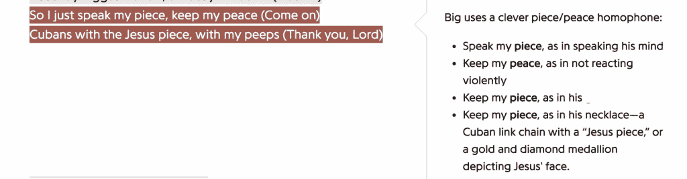
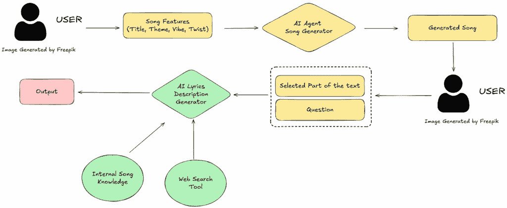
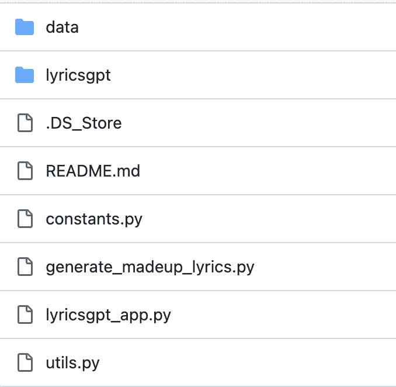
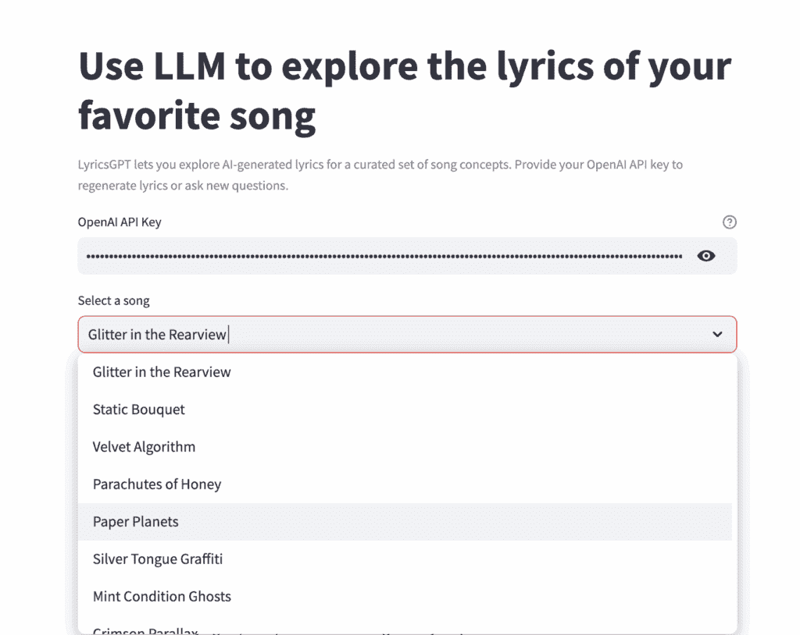
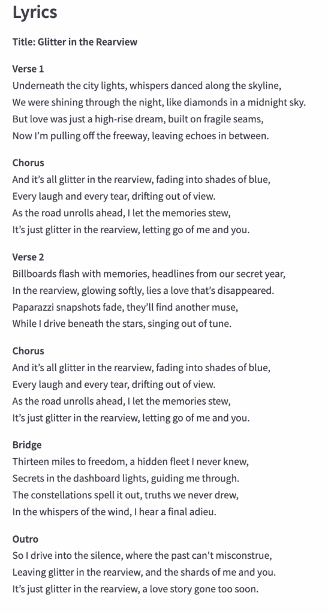
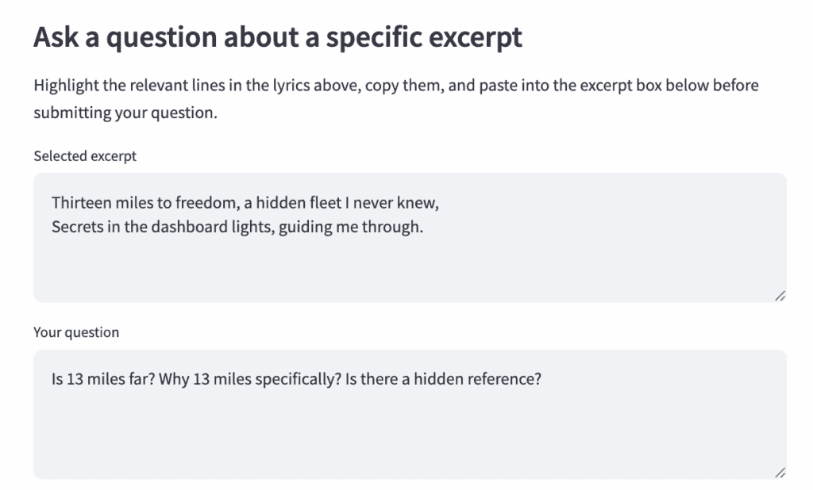
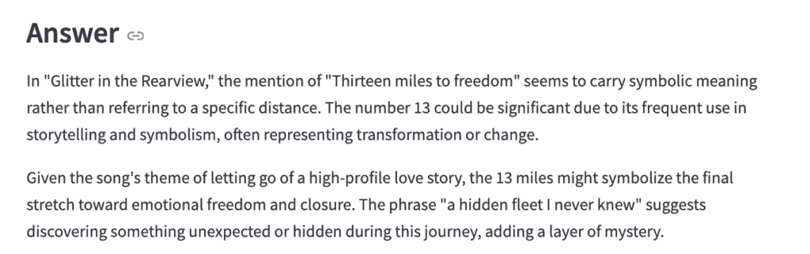
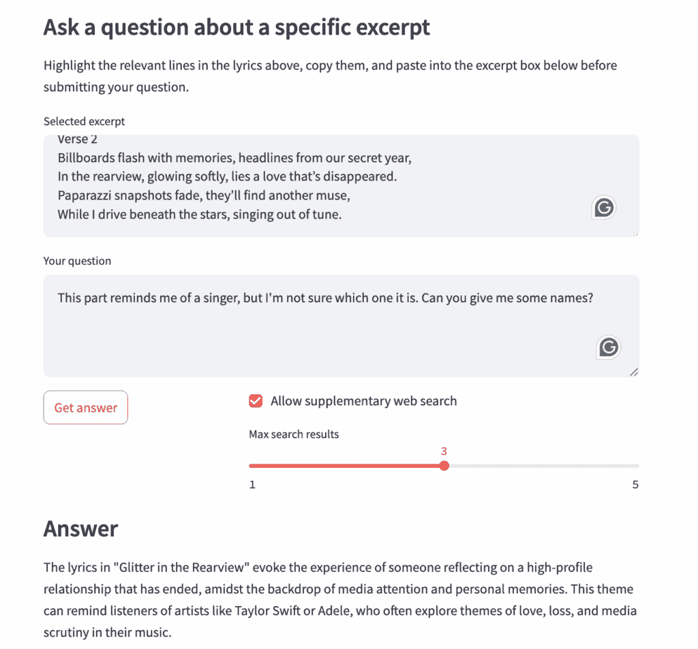

# 音乐、歌词和代理 AI：使用 Python 和 OpenAI 构建智能歌曲解释器

> 原文：[`towardsdatascience.com/music-lyrics-and-agentic-ai-building-a-smart-song-explainer-using-python-and-openai/`](https://towardsdatascience.com/music-lyrics-and-agentic-ai-building-a-smart-song-explainer-using-python-and-openai/)

<mdspan datatext="el1763096351725" class="mdspan-comment">我最喜欢的音乐类型</mdspan>是**说唱**。

说唱音乐让我哭泣、唱歌、跳舞，它也是我学习**英语**语言的方式。我仍然记得第一次坐下来尝试理解 Biggie 和 Tupac。我记得学习关于布鲁克林、加利福尼亚、俚语、斗争以及那些歌曲背后所有强大的信息。

说唱音乐是歌词如何仅凭自身就能使音乐成为**艺术品**的最佳例子。一些最好的嘻哈歌曲实际上只是采样，一些鼓点，以及一个人在 4/4 拍上吟唱诗歌。

虽然对于阅读歌词的人来说可能甚至没有必要，因为他们知道这种语言，但对于像我这样的非英语母语者来说，像**[Genius](https://genius.com/)**这样的工具使生活变得极其简单。Genius 是一个在线歌词音乐收藏者：如果你在寻找歌曲的歌词，Genius 就是你的选择。多亏了 Genius，即使我不理解 Biggie 在说什么，我也可以坐下来阅读歌词，然后谷歌它们并翻译它们。不仅如此：当说唱者（或一般歌手）做出一些难以理解的特定引用时，Genius 会通过一些**侧边栏片段**为你澄清。

图像来自 Genius [[link](https://genius.com/55163)]

但 Genius 是如何做到这一点的？他们是怎样制作出这样有洞察力、更新及时、有用的片段的？

嗯，***2009 年***，当 Genius 诞生时，我会说他们主要会**手动**制作这些类型的片段：用户只需添加他们的评论，也许一些版主会审查其中的一些，然后就这样，交易完成。

然而，***如今***，凭借我们拥有的强大人工智能技术，我们可以使流程变得更加顺畅和高效。虽然我不相信一个具有代理能力的 AI 能够胜任音乐专家的工作（有太多原因），但我相信拥有这样领域知识的人可以由代理 AI**帮助**，这将为他们提供创建片段的正确工具。

而***这正是我们今天所做的事情**。 :)

我们将使用**Streamlit**、**Python**和**OpenAI**来构建一个超级简单的网络应用，该应用在给定歌曲的歌词后，可以提供对文本含义的说明。**更具体地说**，我们将允许用户对文本提出**问题**，使 Genius 的想法更加“互动”。我们还将为我们的 AI 代理提供**网络搜索结果**，以便 LLM 在构建答案时可以查看其他歌曲和资源。

为了增加趣味性（以及版权目的 lol），我们还将**使用另一个 AI 代理创建自己的歌曲**。

太棒了！让我们开始吧！🚀

> 如果你对这个实验的最终结果感兴趣，请跳到第***三***部分。如果你想和我一起创造魔法，请从下一部分开始。不要评判。 🙂

## 1. 系统设计

让我们先设计我们的系统。这是它的样子：

由作者制作的照片

更具体地说：

1.  用户可以使用 AI 代理**从头开始创建歌曲**。这是可选的；已经生成了一批歌曲，也可以使用。

1.  用户可以**选择文本的一部分**并提问。

1.  AI 代理可以以“Genius-like”的风格**生成响应**。

AI 代理还配备了：

a. “**内部歌曲知识**”，由歌曲的提取特征/元数据组成（例如，感觉、标题、主题等…）。

b. **网络搜索工具**，允许代理上网寻找歌曲并为问题添加上下文

这种设计具有良好的**模块化**，意味着很容易添加部分来增加系统的复杂性。例如，如果您想使歌曲生成更复杂，可以轻松调整歌曲生成代理，而无需对代码的其他部分进行疯狂修改。

让我们一块一块地构建它。🧱

## 2. 代码

### 2.1 设置

> 整个代码可以在这个[Github 文件夹](https://github.com/PieroPaialungaAI/LyricsGPT)中找到

我们的工作结构将如下所示：

1.  一个**歌词生成器**，即`generate_madeup_lyrics.py`

1.  **歌词答案**，即`qa.py`

1.  **Web 应用本身**（我们将通过 Streamlit 运行的那个文件），即`lyricsgpt_app.py`

1.  一系列**辅助工具**（例如`utils.py`、`constants.py`、`config.py`等…）

数据也将存储在`data`文件夹中。

由作者制作的照片

我不想用所有这些细节来烦扰你，所以我只会描述这个结构的主要组件。让我们从核心开始：**Streamlit 应用**。

### 2.2 Streamlit 应用

> **请注意**：您需要准备好一个[OpenAI API 密钥](https://platform.openai.com/api-keys)，用于 Streamlit 应用以及需要 LLM 生成的任何内容。在 Streamlit 应用之外，最简单的方法是使用 OS 设置它：**os.getenv(“OPENAI_API_KEY”) = “api_key”**。在应用内部，您将被提示复制粘贴它。别担心，它都是本地的。

整个系统通过以下命令运行：

`streamlit run lyricsgpt_app.py`

`lyricsgpt_app.py`的代码如下：

这相当长，但相当直接：每一行代表 Web 应用的一部分：

1.  **Web 应用的标题**

1.  **歌曲选择器**，允许用户从数据文件夹中选择歌词（关于这一点稍后详述）

1.  **文本块的区域**，用户可以复制粘贴感兴趣的歌词部分

1.  **问题** **框**，用户可以在此处提出关于上述歌词部分的问题

1.  **答案** **框**，LLM 可以在此处回答问题。

但这只是一个执行者；“脏活”是由`lyricsgpt`模块及其对象/函数来完成的。让我们看看几个例子！

### 2.3 歌词生成器

> 这部分是可选的，不包括在专注于类似 Genius 的歌词解释器的网络应用中。如果你对此感兴趣，可以随意跳过。但我要说的是：这部分真的很酷。

对于歌词生成，游戏很简单：

+   ***你*** 给我一个 **标题**，**氛围**，**主题**，以及一个 **转折** 中的隐藏信息。

+   ***我*** 给你**歌词**。

例如：

生成：

> 第一段
> 
> 在城市灯光下，低语在天际线旁起舞，我们在夜晚闪耀，就像午夜天空中的钻石。但爱情只是一个摩天大楼的梦，建立在脆弱的接缝上，现在我正驶离高速公路，留下回声在中间。
> 
> 合唱
> 
> 而这一切都只是后视镜中的闪光，逐渐淡入蓝色阴影，每一个笑声和每一滴泪水，都飘出了视线。随着道路向前延伸，我让记忆慢慢沉淀，这只是一场后视镜中的闪光，让我和你放手。
> 
> [一些更多由 LLM 生成的文本]
> 
> 结尾
> 
> 所以我驶入寂静之中，过去无法误解，留下后视镜中的闪光，以及我和你的碎片。这只是一场后视镜中的闪光，一段过早结束的爱情故事。

非常酷，对吧？完成这个功能的代码如下：

你可以通过修改**SONG_PROMPTS**来玩它，它看起来像这样：

每次你生成一首歌，它都会进入一个**JSON**文件。默认情况下，是**data/generated_lyrics.json**。你不必一定要生成一首歌；里面已经有了一些我制作的例子。

### 2.4 歌词解释器

这个 Agentic 时代最酷的事情是**节省了构建这些内容的时间**。整个**问答逻辑**，加上 AI 使用在线网络搜索的能力，都包含在这个代码块中：

这一切都能做到：**回答**问题，**读取**歌词元数据，**集成**在线信息（如果需要）。

> 我不想做得太复杂，但你实际上可以给代理配备 web_search **工具**。在这种情况下，我正在直接解析信息；如果你给 LLM 这个工具，它可以选择何时以及是否在线搜索。

好的，但这管用吗？结果看起来怎么样？让我们来看看！

## 3. 魔法！

这是一个网络应用的例子。

1.  你复制粘贴你的**[OpenAI API](https://platform.openai.com/api-keys)**密钥，并选择一首歌。比如说“后视镜中的闪光”。

由作者制作的照片

2. 选择感兴趣的部分。例如，假设我是一个意大利人（我是的 lol），我使用**米**，所以我不知道一英里有多远。我还想知道当歌手说 13 英里时是否有对特定事物的引用（“Thirteen miles to freedom”是桥段的第一个句子）。

3. 看看魔法！

由作者制作

让我们尝试更难的事情。在这里，我粘贴了整个第二段，并要求 AI 告诉我哪位歌手会写出这样的歌词。

AI 指出**泰勒·斯威夫特**和**阿黛尔**。特别是泰勒·斯威夫特的引用非常准确，因为关于分手和爱情故事的歌是她最伟大的作品。她还在她的流行度和她的生活如何受到影响的歌曲中提到：“I know places”：

> 灯光闪烁，我们将冲向栅栏，让他们说他们想说的，我们不会听。
> 
> 泰勒·斯威夫特 – 我知道地方

我必须承认我不得不在谷歌上查找那个。

## 4. 一些思考…

现在，***这远非完美：***这是一个即插即用的周末项目，还不到 MVP。然而，它提供了三个普遍的启示：

1.  当提供正确的工具和元数据时，LLM 确实非常出色，并提供了有洞察力的信息（如泰勒·斯威夫特的建议）。

1.  构建一个 LLM 包装器比 5 个月前容易得多。这种技术的演变方式让你比以往任何时候都更有生产力。

1.  代理 AI 可以真正应用于**任何地方**。与其对此感到恐惧，不如接受它，看看我们能用它做什么。

## 5. 结论

感谢您与我共度时光；这对您意义重大❤️。这是我们共同完成的事情：

+   **设计了一个由代理 AI 驱动的灵感系统**，可以交互式地解释歌词。

+   **在 Python 和 Streamlit 中开发了后端组件**，从歌词生成器到问答引擎。

+   **构建了一个具有内部歌曲知识和网络搜索工具以提供上下文答案的 AI 代理**。

+   **构建了一个**能够智能解析歌词的应用。

+   **在这样做的时候，我确实玩得很开心**，希望如此。😊

我想以我自己的观点结束。在我每天的通勤中，我听的是**播客**（通常是采访）音乐家，他们解释歌曲、引用和歌词。如果有人用 AI 替换了这些音乐家，我将要**抗议**。不仅是因为我喜欢这些人本身，而且因为我相信他们会以激情、深度和同理心来解释事物，这是 LLM 无法提供的（我认为它们永远也不会提供）。

然而，如果我们向音乐评论家提供这些类型的 AI 工具，他们的工作会变得容易得多，他们可以提高 10 倍的生产力。

## 7. 在你出发之前！

再次感谢您抽出时间。这对您意义重大❤️

我的名字是皮埃罗·帕亚尔图加，我就是这里的人：

由作者制作的照片

我原本来自意大利，拥有辛辛那提大学的博士学位，并在纽约市**The Trade Desk**担任**数据科学家**。我在 TDS 和 LinkedIn 上撰写关于**人工智能、机器学习以及数据科学家角色演变**的文章。如果你喜欢这篇文章，并想了解更多关于机器学习的内容以及关注我的研究，你可以：

A. 在[**领英**](https://www.linkedin.com/in/pieropaialunga/)上关注我，我在那里发布所有故事

B. 在[**GitHub**](https://github.com/PieroPaialungaAI)上关注我，在那里你可以看到我所有的代码

C. 如有疑问，你可以通过以下邮箱发送给我：***piero.paialunga@hotmail***
