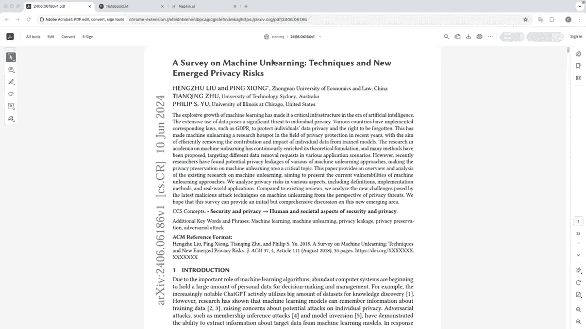
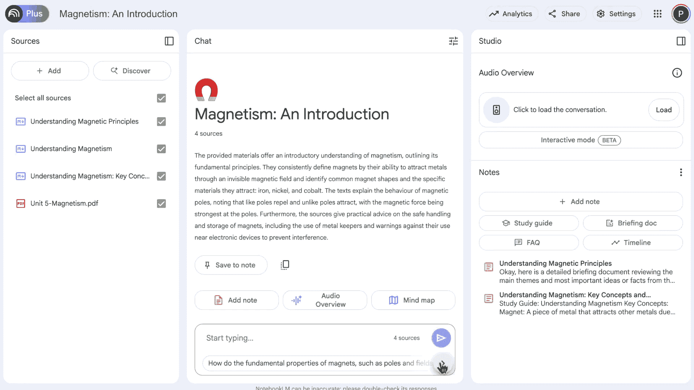
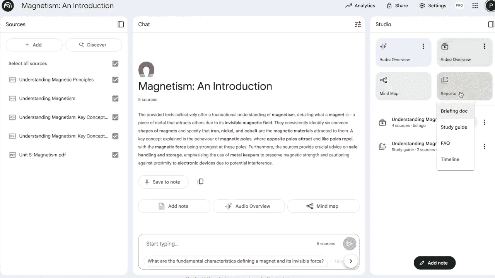
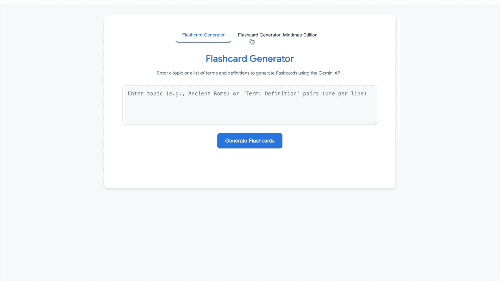
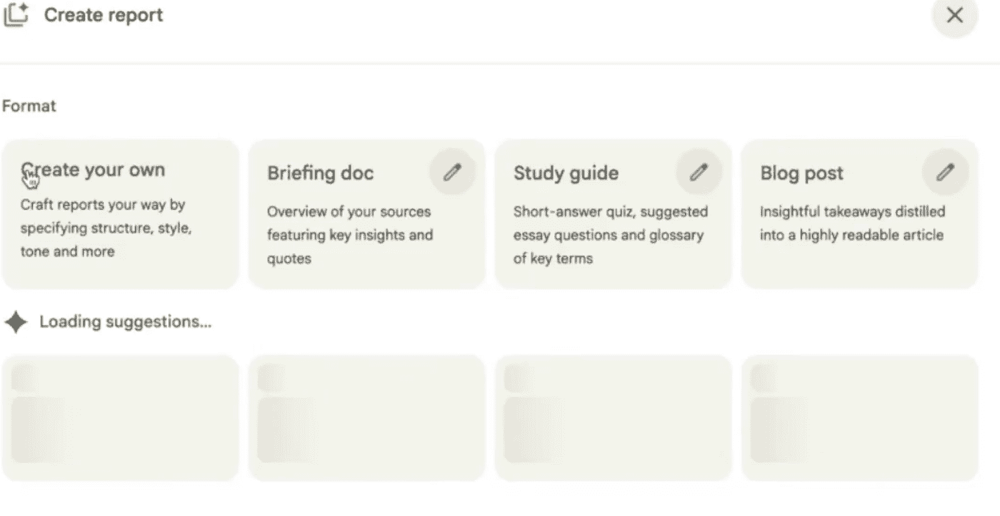
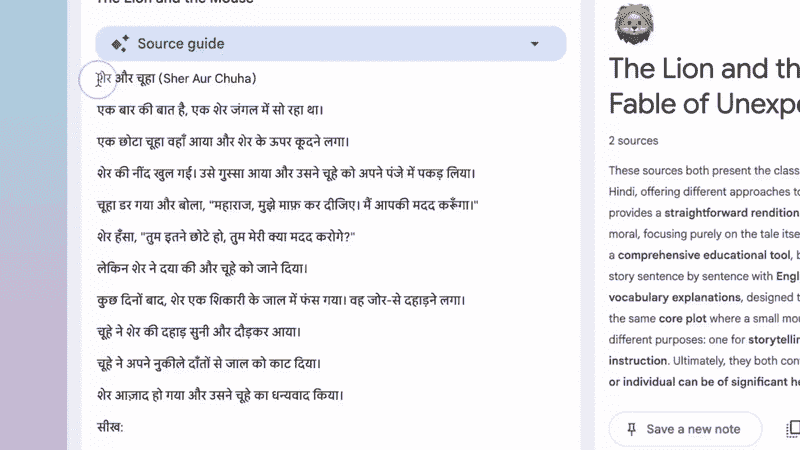

# 我使用 NotebookLM 进行教学实验

> 原文：[`towardsdatascience.com/my-experiments-with-notebooklm-for-teaching/`](https://towardsdatascience.com/my-experiments-with-notebooklm-for-teaching/)

<mdspan datatext="el1757965093024" class="mdspan-comment">如果你</mdspan>要<mdspan datatext="el1758044794402" class="mdspan-comment">滚动浏览</mdspan>我最近的[X 时间线](https://x.com/pandeyparul)，你会注意到我一直在尝试许多不同的 AI 工具，目的是为了教学。我一直在从事这个项目近一年，主要是为了探索我们如何利用 AI 来增强学习的互动性和有效性。我的重点是教育工作者、家长和教师，以便他们花更少的时间在网上寻找资源，更多的时间与学生在一起。我意识到已经有大量的教育网站，但根据我的经验，它们存在两个主要问题：

许多这些工具都需要不必要的注册，并且充满了大量不相关的广告。

有时内容根本不符合我们的需求。要么太基础，要么太复杂。

正因如此，我开始编写自己的工具或通过混合和匹配现有资源来创建定制资源。根据我从社区获得的积极反馈，我现在将它们整理在这篇文章中，从 NotebookLM 开始。随着时间的推移，我计划继续用其他工具继续这个系列。

通过这篇文章，我分享了我使用 NotebookLM 更有效地进行教学的经验，重点关注 K—10 年龄段的儿童。

## 为什么选择 NotebookLM 进行教育

NotebookLM 的口号是***理解一切***，它确实做到了这一点。NotebookLM 一直是我的一位优秀伴侣。我以各种方式使用它，从理解研究论文到组织想法，总结技术演讲，等等。但凭借其思维导图、闪卡、测验生成器、可定制的报告、视频概述等功能，它也可以成为有效的教学工具。

对于我来说，真正引人注目的是，答案与实际提供的信息紧密结合。这是使用任何教育工具时最重要的要求之一。你不想有一个产生幻觉的助手，尤其是在用它来学习的时候。

## 1. 使历史日期易于记忆

NotebookLM 有一个**时间线功能**，可以从您提供的来源自动生成时间线。这对于记住历史中的重要日期或事件特别有用，使学生更容易看到事物随时间如何相互关联。

让我们看看它的实际应用。下面，我在 NotebookLM 中粘贴了一些来自维基百科的人类历史文本作为来源。然后，通过转到**报告**并选择**时间线**选项，我可以获得主要事件的清晰时间线。

为了让这些日期记住，孩子们需要一些视觉的东西。您可以将生成的时间线复制到另一个名为 [**NapkinAI**](https://www.napkin.ai/) 的工具中，该工具旨在将文本转换为视觉内容。NapkinAI 将自动转换为学生可用于学习甚至包含在他们的项目中的漂亮时间线图表。

*使用 NotebookLM + NapkinAI 将维基百科文本转换为视觉历史时间线。* 视频由作者制作

* * *

但我们不需要仅限于历史课程；它也适用于学术论文。只需将来源换成研究论文，并遵循相同的步骤。这是一种巧妙的方法，可以提取导致该特定研究的关键里程碑。



*从研究论文中提取里程碑并将其转换为时间线图表，使用 NotebookLM + NapkinAI。* 视频由作者制作

## 2\. 将课程转换为互动填字游戏

学生喜欢填字游戏，如果我们能将他们的课程变成填字游戏，他们不仅会喜欢解答它们，而且这是一种帮助他们以有趣的方式记住课程内容的好方法。这也是一种测试理解能力的好方法。

对于此，我们将使用 [**CrosswordLabs**](https://crosswordlabs.com/)，这是一个免费网站，可以轻松创建填字游戏。但我们将直接从课程计划中提取线索。

将您的课程材料添加到 **NotebookLM**。现在，CrosswordLabs 预期线索以特定格式：

```py
dog Man's best friend
cat Likes to chase mice
bat Flying mammal
elephant Has a trunk
kangaroo Large marsupial
```

要以这种格式从您的课程中生成线索，请使用如上所示的几个示例提示 NotebookLM。例如，提示可以是：

```py
Given the lesson text, create word–clue pairs in this style:
dog Man's best friend
cat Likes to chase mice
bat Flying mammal.
```

将生成的输出粘贴到 CrosswordLabs，它将自动构建您的填字游戏。一旦准备好，您可以打印它，将其下载为 PDF 文件，或分享链接以便学生在线解答。



*从课文文本 → 单词-线索对 → 使用 NotebookLM + CrosswordLabs 的即时填字游戏。* 视频由作者制作

## 3\. 从学习指南到故事书

[Storybook](https://gemini.google/overview/storybook/) 是 [Gemini App](https://gemini.google.com/app?hl=en-IN) 中的一个出色功能，也是我最喜欢的之一。它允许您为任何主题、想法或情况创建一个 10 页的个性化、插图故事书。除了有趣之外，这些故事书对于向学生教授新概念非常有用。这是因为您可以根据他们的兴趣进行定制。例如，如果您的学生喜欢乐高，您可以围绕这个主题生成一个。也许他们喜欢野餐，可以围绕这个主题创建一个。

更有用的是，这种技术可以帮助学生理解复杂主题。所以，如果您是一位计划介绍新概念的教师，以下是您如何使用 Gemini Storybook 功能与 NotebookLM 一起使用，使其更容易的方法：

+   首先，从您计划使用的材料中在 NotebookLM 中创建一个简单的学习指南。

+   将生成的指南粘贴到 Gemini 应用中，并附带提示：

```py
Create a unique storybook about the study guide I've uploaded.
Tailor it for a 2nd grade kid.
```

这里是如何我为五年级学生介绍磁铁概念创建故事书的。



* 我将 NotebookLM 的磁铁学习指南转换成一本有趣的插图故事书，使用了 Gemini。* 视频由作者制作

这是一种快速将您的课程表转化为学生真正喜欢学习的方法。

## 4. NotebookLM + Google AI Studio

我非常喜欢 NotebookLM 的思维导图，因为它们能够很好地捕捉整个主题。但对于孩子们来说，纯文本是不够的，所以我转向 Google AI Studio 从头开始构建一个图像闪卡生成器。虽然 NotebookLM 最近增加了闪卡生成器，但它基于文本。

[Google AI Studio](https://aistudio.google.com/apps) 提供了各种小程序，可以混合使用，便于在其基础上构建。它就像一个实验游乐场，用于测试 Google Gemini 模型并创建原型，这些原型随后可以部署到云端。其中一个小程序是用于生成闪卡的，所以我修改了闪卡应用，将文本与图像配对，使闪卡更具吸引力和适合儿童。



*使用 NotebookLM + Google AI Studio 将纯文本思维导图升级为图像闪卡。* 视频由作者制作

我已经发布了[应用](https://aistudio.google.com/apps/drive/17wgHsdaCI89z3RK0GsWJsgpKzv_0VL_o?showPreview=true&showAssistant=true)，现在您可以使用它，或者制作您自己的版本。

## 5. 使用 NotebookLM 学习新语言

我一直在尝试使用 **NotebookLM** 进行语言学习，新的闪卡和自定义报告功能非常适合。由于 NotebookLM 现在支持多种语言，我尝试定制提示，以便输出更像是语言教师解释概念，而不仅仅是原始翻译。

如果您错过了这个功能，NotebookLM 现在新增了自定义报告功能。这意味着您不仅可以获得常规报告，还可以根据您的偏好和输出语言创建自己的报告。



NotebookLM 中的自定义报告选项 | 图片由作者提供

假设我是一个英语使用者，并且我想学习印地语。我可以选择任何我想要理解的印地语段落，通过指定输出语言为印地语来生成一个自定义报告，然后将该报告作为 NotebookLM 的源文件保存。从那里，我可以直接从源文件创建闪卡。

例如，报告提示可以是：

```py
You are a Hindi–English language tutor for kids who know English but are learning Hindi through stories. I will give you a Hindi story. Create a structured bilingual learning report in this format:

Title of the story in Hindi and English

Introduction in English: Explain what the story is about in a friendly way

For each sentence in the story:
• Write the original sentence in Hindi
• Give a simple English translation"*
 Read the passage below and rewrite it in simple Hindi with grammar notes and word meanings in brackets.
```



*使用 NotebookLM 中的自定义报告和闪卡功能，让印地语学习更接近真实导师的教学。* 视频由作者制作

虽然有很多优秀的语言学习应用，但并非每个人都通过回答重复的问题来学习效果最佳。对我自己和其他许多人来说，当专家解释语法细微差别时，更容易也更有效。在这种情况下，这位专家可以是 NotebookLM。

## 结论

在这篇文章中，我分享了一些我在教育 AI 领域使用 NotebookLM 进行的一些实验。每个孩子都以自己的节奏和不同的机制学习。我相信，通过创建针对每个学习者的定制内容，我们可以利用 AI 提供更个性化的教学方法。正如我之前提到的，我的重点是赋权教育工作者，因为他们需要正确的工具来有效地指导学生。这可以帮助他们节省时间，减少努力，并更多地关注与学生的实际学习旅程。
