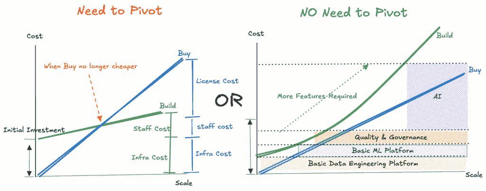
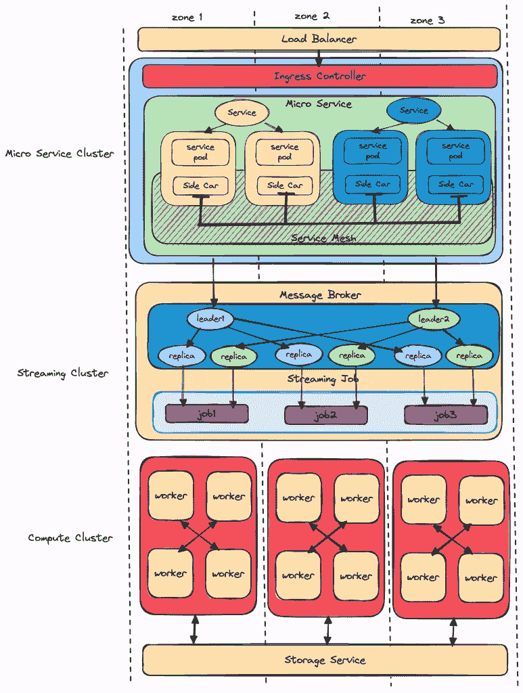
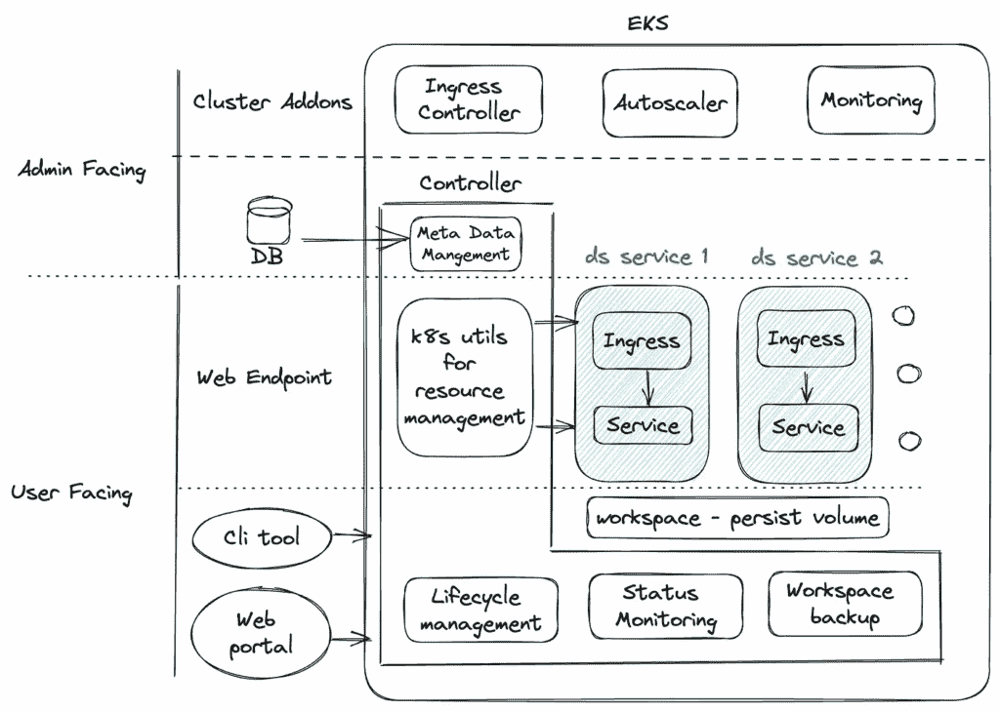
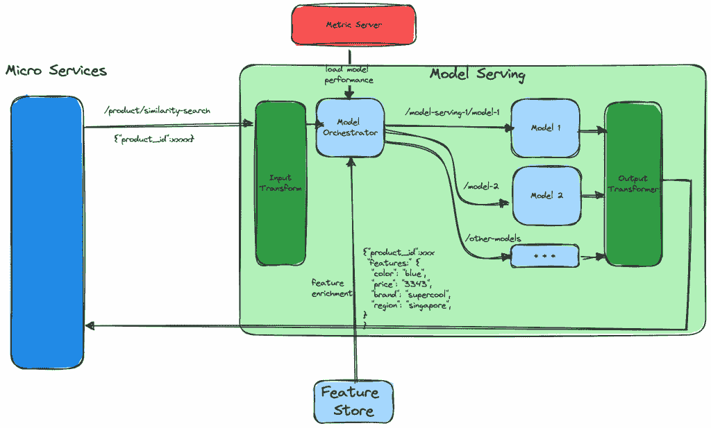
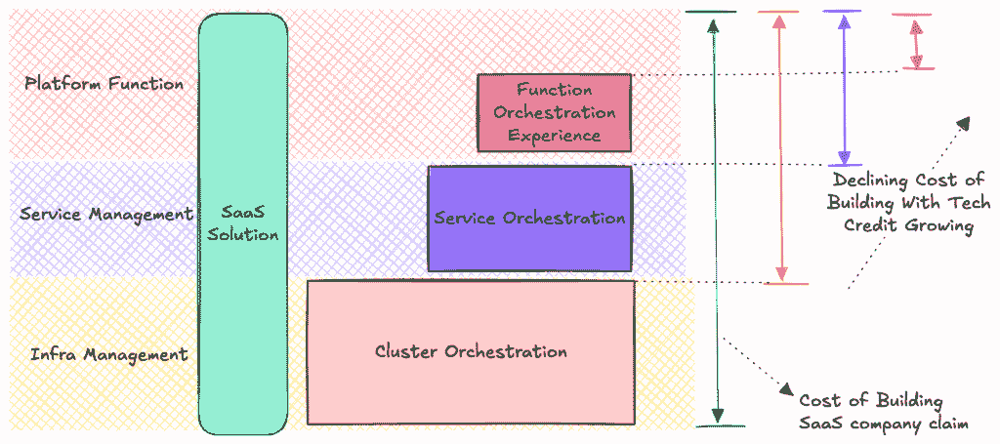
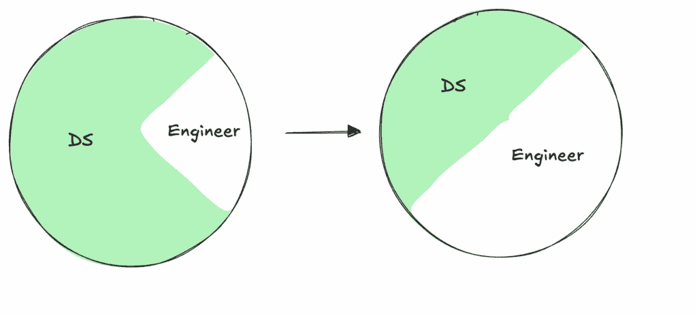
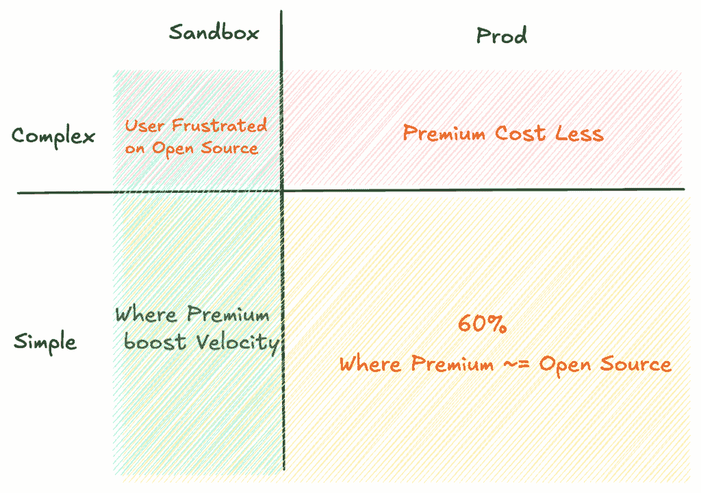
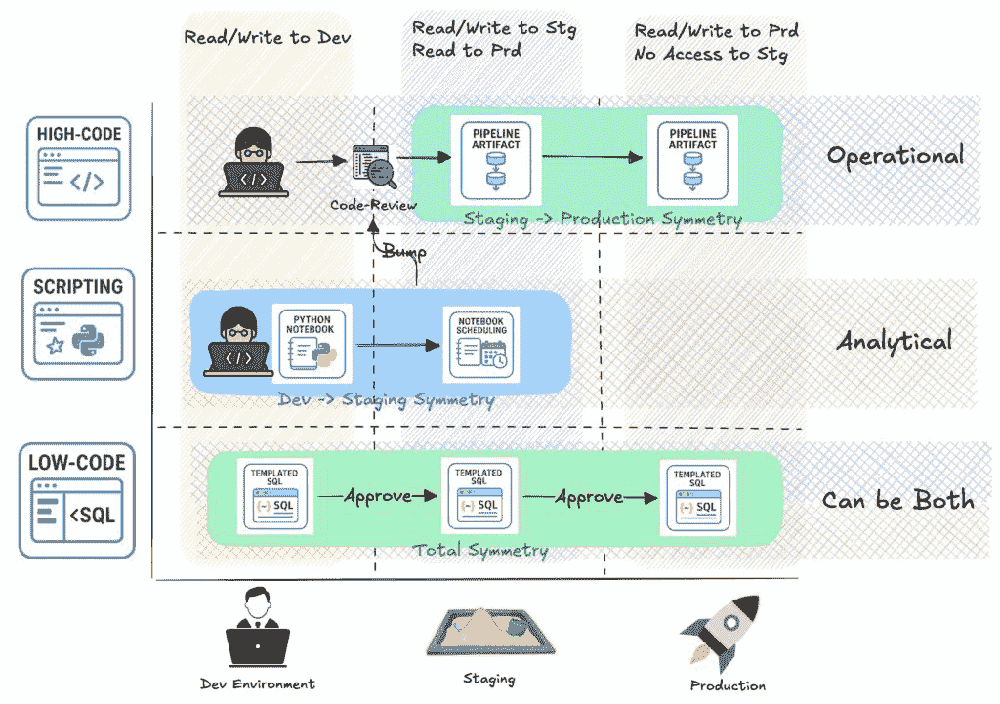

# 从购买到构建的数据平台神话般的转折点

> 原文：[`towardsdatascience.com/mythical-pivot-point-from-buy-to-build-for-data-platforms/`](https://towardsdatascience.com/mythical-pivot-point-from-buy-to-build-for-data-platforms/)

**TL;DR:** <mdspan datatext="el1750895483935" class="mdspan-comment">对于数据密集型架构的公司</mdspan>来说，在某个关键时刻，构建内部数据平台比购买现成解决方案更有意义。

* * *

## 神秘的转折点

购买现成的数据平台是初创公司加速业务的一种流行选择，尤其是在早期阶段。然而，是否真的像服务提供商所承诺的那样，已经购买的公司永远不会需要转向构建？这个观点的两边都有理由：

图片由作者提供

+   需要转向：购买的成本最终将超过构建的成本，因为购买的成本增长速度更快。

+   无需转向：平台的需求将继续演变并增加构建的成本，因此购买将始终更便宜。

这是一个如此复杂的谜题，然而却很少有文章讨论它。在这篇文章中，我们将深入探讨这个话题，分析三个增加构建原因的动力以及决定转向时需要考虑的两个策略。

| **动态** | **转向策略** |
| --- | --- |

| – 技术信用的增长 – 客户角色的转变

– 不一致的优先级 | – 基于成本的转向 – 基于价值的转向 |

* * *

## 技术信用的增长

所有这一切都始于数据平台之外。无论你是否想要，为了提高效率或运营，你的公司需要在三个不同级别上建立***技术信用***。无论你是否意识到，它们都将使构建对你来说更容易。

> 技术信用是什么？查看 ACM 发布的这篇[文章](https://cacm.acm.org/opinion/technical-credit/)。

这三个级别的***技术信用***是：

| **技术信用** | **关键目的** |
| --- | --- |
| 集群编排 | 提高管理多口味 Kubernetes 集群的效率。 |
| 容器编排 | 通过管理微服务和开源堆栈提高效率 |
| 函数编排 | 通过设置内部 FaaS（函数即服务）来抽象所有基础设施细节，从而提高效率。 |

对于集群编排，通常有三种不同的 Kubernetes 集群口味。

+   微服务集群

+   流服务集群

+   批处理集群

每个都需要不同的提供策略，尤其是在网络设计和自动扩展方面。查看这篇[文章](https://medium.com/towardsdev/network-design-of-kuberentes-cluster-on-cloud-4fca233425a9)以了解网络设计差异的概述。

不同类型 K8s 集群的网络设计差异。图片由作者提供

为了提高容器编排效率，一种可能的加速方法是通过对 Kubernetes 集群扩展自定义资源定义（CRD）。在这篇文章中，我分享了 kubebuilder 的工作原理以及用它构建的一些示例。例如，通过 CRD 构建的内部 DS 平台。

使用 CRD 构建的 DS 平台。作者图片

为了提高函数编排效率，需要 SDK 和基础设施的结合。许多组织将使用脚手架工具为微服务生成代码骨架。在这种控制反转中，用户的任务仅仅是填充 rest-api 的处理器体。

在 Toward Data Science 上的这篇 [文章](https://towardsdatascience.com/from-data-platform-to-ml-platform-4a8192edab5d/) 中，MLOps 旅程中的大多数服务都是使用 FaaS 构建的。特别是对于模型服务服务，机器学习工程师只需要填写几个关键函数，这些函数对于特征加载、转换和请求路由至关重要。

作者图片

下表分享了不同级别 **技术贡献** 的 **关键用户旅程** 和 **控制区域**。

| **技术贡献** | **关键用户旅程** | **控制区域** |
| --- | --- | --- |

| 集群编排 | 自助创建多功能的 K8s 集群。 | – 区域、区域和 IP CIDR 分配策略 – 网络对等

– 实例供应策略

– 安全和操作系统加固

– Terraform 模块和 CI/CD 管道 |

| 容器编排 | 自助进行服务部署、开源堆栈部署和 CRD 构建 | – 集群资源发布的 GitOps – 入口创建策略

– 客户资源定义策略

– 集群自动缩放策略

– 指标收集和监控策略

– 成本跟踪

|

| 函数编排 | 专注于通过填充预定义的函数骨架来实施业务逻辑。 | – 身份和权限控制 – 配置管理

– 内部状态检查点

– 调度和迁移

– 服务发现

– 健康监控 |

随着 **技术贡献** 的增长，构建成本将降低。

作者图片

然而，不同级别的技术贡献的可转移性有所不同。从下到上，可转移性越来越低。你将能够实施一致的基础设施管理和重用微服务。然而，很难在不同主题之间重用构建 FaaS 的技术贡献。此外，建设成本的下降并不意味着你需要自己重建一切。对于完整的构建-购买权衡分析，还有两个因素发挥作用，它们是：

+   客户角色转变

+   不一致的优先级

## 客户角色转变

随着公司的成长，你很快就会意识到数据平台的角色分布正在转变。

图片由作者提供

当您规模较小时，您的多数用户是数据科学家和数据分析师。他们探索数据，验证想法，并生成指标。然而，当更多以数据为中心的产品功能发布时，工程师开始编写 Spark 作业来支持他们的在线服务和机器学习模型。这些数据管道就像微服务一样是**一等公民**。这种角色转变使得完全 GitOps 数据管道开发之旅变得可接受，甚至受欢迎。

## 不一致的优先级

由于每个人都需要在自己的公司利益下行动，因此 SaaS 提供商和您之间将存在不匹配。这种不匹配最初可能看起来很小，但随着时间的推移可能会逐渐恶化。这些潜在的冲突包括：

| **优先级** | **SaaS 提供商** | **您** |
| --- | --- | --- |
| 功能优先级 | 大多数客户的好处 | 您组织的好处 |
| 成本 | 次要影响（潜在客户流失） | 直接影响（需要支付更多） |
| 系统集成 | 标准接口 | 可定制的集成 |
| 资源池 | 在他们的租户之间共享 | 在您的内部系统之间共享 |

对于资源池，数据系统与在线系统协同定位是理想的，因为它们的工作负载通常在不同的时间达到峰值。大多数时候，在线系统在白天经历高峰使用，而数据平台在夜间达到峰值。对您的云提供商的更高承诺使得资源池化的好处更加显著。特别是当您购买年度预留实例配额时，结合在线和离线工作负载可以为您提供更强的议价能力。然而，SaaS 提供商将优先考虑转向无服务器架构，以使其客户之间实现资源池化，从而提高其利润率。

* * *

## 转向！转向！转向？

即使建设成本下降，不匹配上升，建设永远不会是一个容易的选择。它需要领域专业知识以及长期投资。然而，好消息是您不必进行完全切换。采用混合方法或逐步转向有令人信服的理由，可以最大化从购买和建设中获得的投资回报。向前发展可能有两条途径：

+   基于成本的转向

+   基于价值的转向

* * *

免责声明：我在此提出我的观点。它提出了一些一般原则，并鼓励您进行自己的研究以进行验证。

## 方法一：基于成本的转向

80/20 规则也适用于 Spark 作业。80%的 Spark 作业在生产环境中运行，而剩余的 20%是由开发/沙盒环境中的用户提交的。在生产中的 80%的作业中，80%是小型且简单的，而剩余的 20%是大型且复杂的。*高级 Spark 引擎主要在大型且复杂的作业中脱颖而出*。

> 想要知道为什么 Databricks Photon 在复杂的 Spark 作业上表现良好？请查看[Huong](https://www.linkedin.com/in/hoaihuongbk/)的这篇[文章](https://codecookcash.substack.com/p/lessons-learned-sortmergejoin-vs)。

此外，沙盒或开发环境需要更强的数据治理控制和数据可发现性能力，这两者都需要相当复杂系统。相比之下，生产环境更侧重于 GitOps 控制，这可以通过云和开源社区现有的产品更容易地构建。

作者提供的图片

如果你能够构建一个基于成本的动态路由系统，例如多臂老虎机，将更简单的 Spark 作业路由到更经济的内部平台，你可能会节省大量的成本。然而，有两个前提条件：

+   **平台无关的工件**：Databricks 这样的平台可能有自己的 SDK 或笔记本符号，这是特定于 Databricks 生态系统的。为了实现动态路由，必须强制执行标准以创建可以在不同平台上运行的平台无关工件。这种做法对于长期防止供应商锁定至关重要。

+   **修补缺失组件**（例如，Hive Metastore）：两个系统并排存在是一种反模式。但在转向构建时，这可能是有必要的。例如，开源 Spark 无法充分利用 Databricks 的 Unity Catalog。因此，你可能需要为你的内部平台开发一个目录服务，如 Hive Metastore。

请注意，一小部分复杂的作业可能会占据你账单的大部分。因此，对你的案例进行彻底的研究是必要的。

## 第二种方法：基于价值的转向

第二种转向方法是基于剂量流水线为公司创造价值的方式。

+   操作：数据作为产品作为价值

+   分析：洞察作为价值

> 破坏框架的灵感来源于这篇文章，[MLOps：机器学习中的持续交付和自动化流水线](https://cloud.google.com/architecture/mlops-continuous-delivery-and-automation-pipelines-in-machine-learning)。它提出了一个重要的概念，称为实验-操作对称性。

作者提供的图片

我们从两个维度对数据流水线进行分类：

+   根据工件复杂性，它们被分为低代码、脚本和高度代码流水线。

+   根据其产生的价值，它们被分为操作和分析流水线。

高代码和操作管道需要***预发布->生产对称性***以进行严格的代码审查和验证。脚本和分析管道需要***开发->预发布对称性***以实现快速的开发速度。当一个分析管道携带重要的分析洞察并需要民主化时，它应该过渡到带有代码审查的操作管道，因为这个管道的健康状况将变得对许多人至关重要。

> 总体对称性，***开发 -> 预发布 -> 生产***，不建议用于脚本和高度代码化的工件。

让我们来看看这些不同管道的操作原理和关键要求。

| **管道类型** | **操作原理** | **平台的关键要求** |
| --- | --- | --- |
| 数据作为产品（操作） | 严格的 GitOps，失败时回滚 | 稳定性与紧密的内部集成 |
| 洞察作为价值观（分析） | 快速迭代，失败时回滚 | 用户体验与开发者速度 |

由于产生价值和操作原理的不同方式，您可以：

+   转向操作管道：由于内部集成对于操作管道更为关键，因此首先转向内部平台更有意义。

+   转向低代码管道：由于其低代码特性，低代码管道也可以轻松切换。

* * *

## 最后

转向与否，都不是一个容易的决定。总的来说，无论您做出什么决定，以下都是您应该采取的实践：

+   关注您内部技术信用的增长，并刷新您对总拥有成本的评估。

+   推广***平台无关的工件***以避免供应商锁定。

当然，当您确实需要转向时，制定一个彻底的策略。人工智能如何改变我们的评估？

+   人工智能使得从提示到高代码成为可能。它极大地加速了操作和分析管道的开发。为了跟上趋势，如果您有信心，您可能需要考虑购买或构建。

+   人工智能对数据质量要求更高。确保数据质量对于内部平台和 SaaS 提供商都更为关键。

这里是我对这个不受欢迎话题的看法，***从购买转向构建***。请告诉我您的看法。干杯！
