# 神话与数据：一天一个苹果，医生远离我？

> 原文：[`towardsdatascience.com/myths-vs-data-does-an-apple-a-day-keep-the-doctor-away/`](https://towardsdatascience.com/myths-vs-data-does-an-apple-a-day-keep-the-doctor-away/)

### 简介

“金钱买不到幸福。” “不能以貌取人。” “一天一个苹果，医生远离我。”

你可能已经听过这些说法好几次了，但当我们查看数据时，它们实际上站得住脚吗？在这篇文章系列中，我想通过使用真实世界的数据来检验流行的神话/说法。

我们可能会证实一些意想不到的真理，或者驳斥一些流行的观点。希望在这两种情况下，我们都能对周围的世界有新的认识。

#### 假设

“一天一个苹果，医生远离我”：有真实证据支持这一点吗？

如果这个神话是真的，我们应该期望**人均苹果消费与人均医生访问次数之间存在负相关性**。因此，一个国家消费的苹果越多，人们需要的医生访问次数应该越少。

让我们来看看数据，看看数字到底说了什么。

### 测试苹果消费与医生访问之间的关系

让我们从人均苹果消费与人均医生访问次数之间的简单相关性检查开始。

#### 数据来源

数据来源：

+   **人均苹果消费**：[我们的世界数据](https://ourworldindata.org/grapher/fruit-consumption-by-fruit-type)

+   **人均医生访问次数**：[经合组织](https://data-explorer.oecd.org/vis?lc=en&pg=0&tm=Doctors%27%20consultations&snb=51&vw=ov&df%5Bds%5D=dsDisseminateFinalDMZ&df%5Bid%5D=DSD_HEALTH_PROC%40DF_CONSULT&df%5Bag%5D=OECD.ELS.HD)

由于数据可用性因年份而异，因此选择了 2017 年，因为它在国家的数量上提供了最完整的数据。然而，其他年份的结果是一致的。

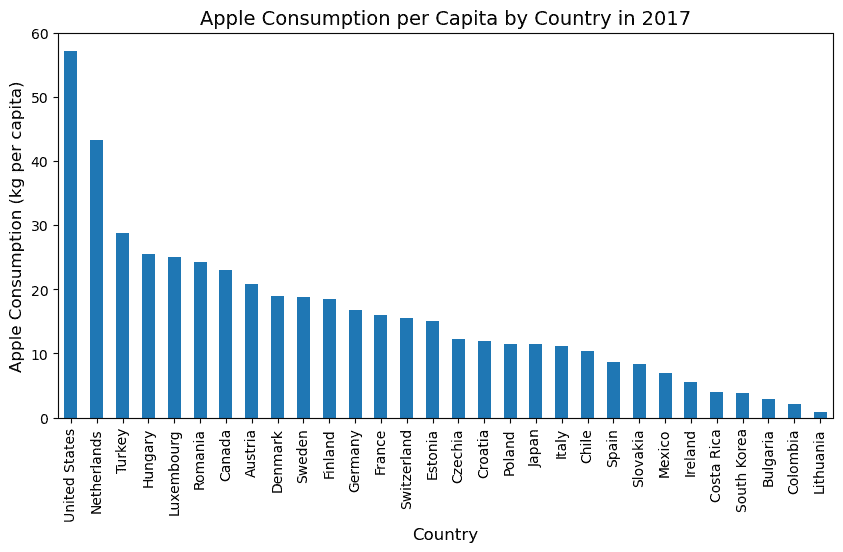

美国的人均苹果消费最高，每年超过 55 公斤，而立陶宛最低，每年消费不到 1 公斤。

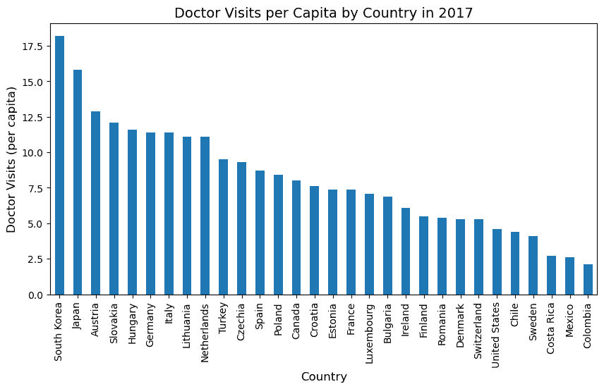

韩国的人均医生访问次数最多，每年超过 18 次，而哥伦比亚最低，每年略超过 2 次。

#### 可视化关系

为了可视化更高的苹果消费是否与更少的医生访问次数相关联，我们首先查看一个**带有回归线的散点图**。

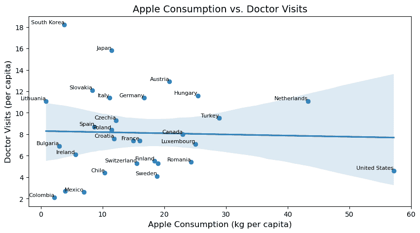

回归图显示了一个**非常微弱的负相关性**，这意味着在那些人们吃苹果更多的国家，医生访问次数有微乎其微的下降趋势。

不幸的是，这种趋势太弱，不能被认为是**有意义的**。

#### OLS 回归

为了从统计上测试这种关系，我们运行了一个**线性回归（OLS**），其中人均医生访问次数是因变量，人均苹果消费是自变量。

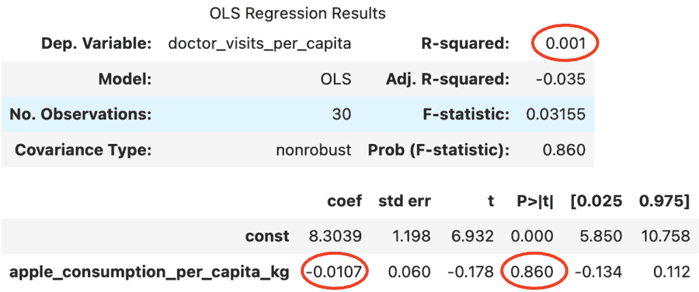

结果证实了散点图所暗示的：

+   **苹果消费系数**是**-0.0107**，这意味着即使有影响，它也是**非常小**的。

+   **p 值是 0.860（86%）**，远高于标准的显著性阈值**5%**。

+   **R²值几乎为零**，这意味着苹果消费几乎无法解释医生就诊的任何变化。

这并不意味着两者之间没有关系，而更确切地说，我们**无法**用现有数据证明这种关系。可能任何真实的影响都太小而无法检测，或者我们没有包括的其他因素可能发挥了更大的作用，或者数据本身并没有很好地反映这种关系。

### 控制混杂因素

我们完成了吗？还没有。到目前为止，我们只检查了苹果消费和医生就诊之间的直接关系。

如前所述，许多其他因素可能正在影响这两个变量，可能隐藏了真实的关系或创造了虚假的关系。

如果我们考虑这个因果图：

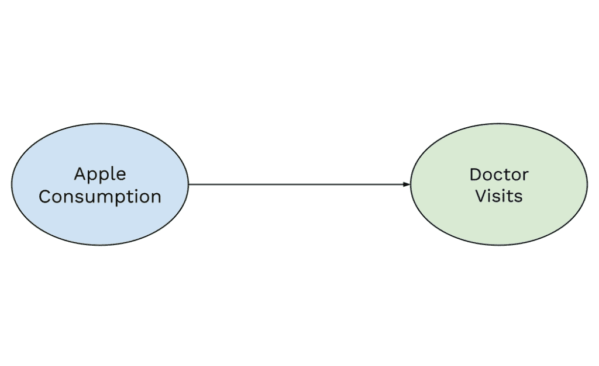

我们假设苹果消费直接影响医生就诊。然而，可能还有其他隐藏的因素在起作用。如果我们不考虑它们，我们可能会**未能检测到真实的关系**，如果确实存在的话。

一个著名的例子是 Messerli（2012）的研究，该研究发现人均巧克力消费与诺贝尔奖获得者数量之间存在有趣的关联。

那么，开始大量食用巧克力能帮助我们赢得诺贝尔奖吗？可能不会。可能的解释是人均 GDP 是一个混杂因素。这意味着富裕国家往往既有较高的巧克力消费，也有更多的诺贝尔奖获得者。观察到的关系不是因果的，而是由于一个隐藏的（混杂）因素。

在我们的情况下，可能也会发生同样的事情。可能存在影响苹果消费和医生就诊的混杂变量，如果确实存在真实的关系，这会使我们看到这种关系变得困难。

需要考虑的两个关键混杂因素是**人均 GDP**和**中位年龄**。富裕国家拥有更好的医疗保健系统和不同的饮食习惯，而老年人口更频繁地去看医生，可能还有不同的饮食习惯。

为了控制这一点，我们通过引入这些混杂因素来改变我们的模型：

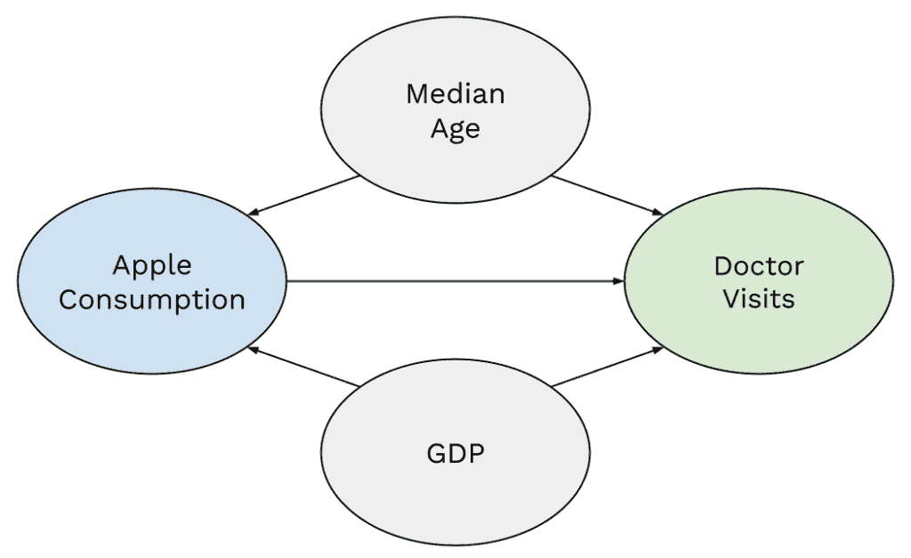

#### 数据来源

数据来源：

+   **GDP**: [我们的世界数据](https://ourworldindata.org/grapher/gdp-per-capita-worldbank)

+   **中位年龄**: [我们的世界数据](https://ourworldindata.org/grapher/median-age)

卢森堡的人均 GDP 最高，超过 11.5 万美元，而哥伦比亚最低，为 1.43 万美元。

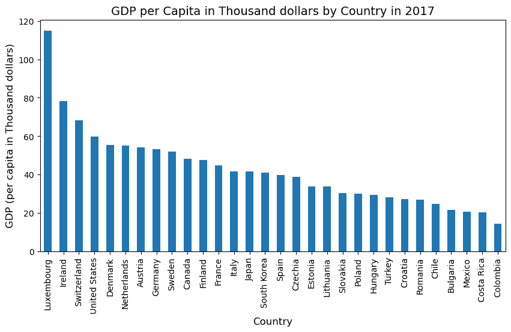

日本的中位数年龄最高，超过 46 岁，而墨西哥最低，不到 27 岁。

#### OLS 回归（包含混杂因素）

在控制了人均 GDP 和中位数年龄后，我们进行多重回归以测试苹果消费是否对医生就诊有显著影响。

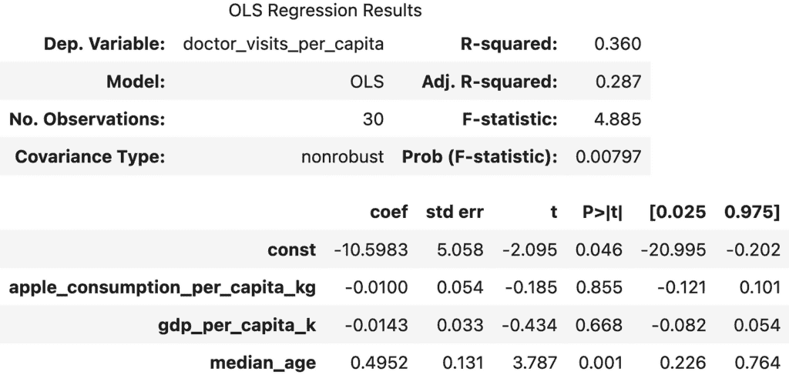

结果证实了我们之前观察到的：

+   **苹果消费系数**仍然**非常小(-0.0100**)，这意味着任何潜在的影响都可以忽略不计。

+   **p 值（85.5%）**仍然非常高，远未达到统计显著性。

+   我们**仍然不能拒绝零假设**，这意味着我们没有强有力的证据支持多吃苹果会导致医生就诊次数减少的观点。

和之前一样，这并不一定意味着**不存在任何关系**，而是说**我们无法用现有数据证明这种关系**。可能真实效果太小而无法检测，或者还有我们未考虑到的其他因素。

然而，有一个有趣的观察结果是，人均 GDP 与医生就诊之间也没有显著关系，其 p 值为 0.668（66.8%），这表明我们在数据中找不到财富解释医疗保健使用变化的证据。

另一方面，**中位数年龄似乎与医生就诊有很强的关联**，p 值为 0.001（0.1%），系数为正值（0.4952）。这表明**老龄化人口倾向于更频繁地就诊**，如果我们仔细思考，这实际上并不令人惊讶！

因此，尽管我们没有找到支持苹果神话的证据，但数据确实揭示了老龄化和医疗保健使用之间的有趣关系。

#### 中位数年龄 → 医生就诊次数

OLS 回归的结果显示中位数年龄和医生就诊次数之间存在强烈的关系，下面的可视化也证实了这一趋势。

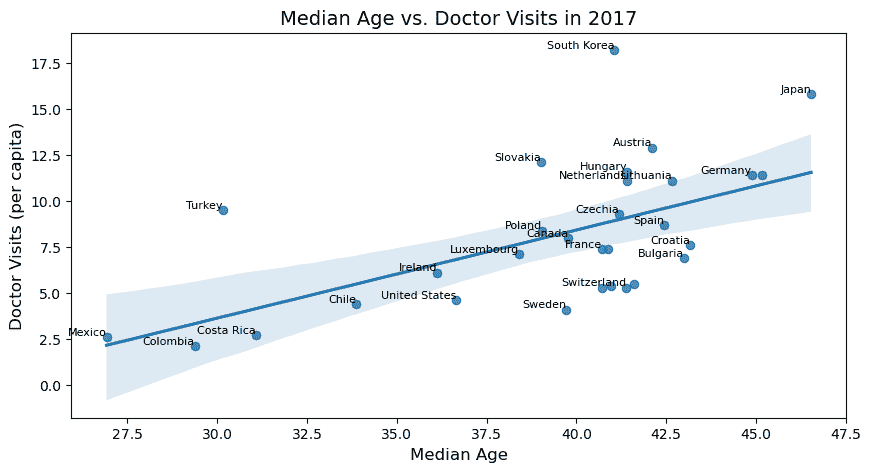

存在一个明显的上升趋势，这表明**老龄化国家的居民人均就诊次数更多**。

由于我们这里只考虑中位数年龄和医生就诊次数，有人可能会认为人均 GDP 可能是一个混杂因素，影响两者。然而，之前的 OLS 回归表明，即使在模型中包含了 GDP，这种关系仍然很强，并且具有统计学意义。

这表明**中位数年龄是解释各国医生就诊差异的关键因素**，独立于 GDP。

#### **GDP** → **苹果消费**

虽然与医生就诊没有直接关系，但当我们观察人均 GDP 和苹果消费之间的关系时，出现了一个有趣的次级发现。

一种可能的解释是，富裕国家有更好的新鲜产品获取途径。另一种可能是气候和地理因素的作用，因此许多高 GDP 国家可能位于苹果生产强盛的地区，这使得苹果更加易得且价格合理。

当然，其他因素可能也在影响这种关系，但在这里我们不会深入探讨。

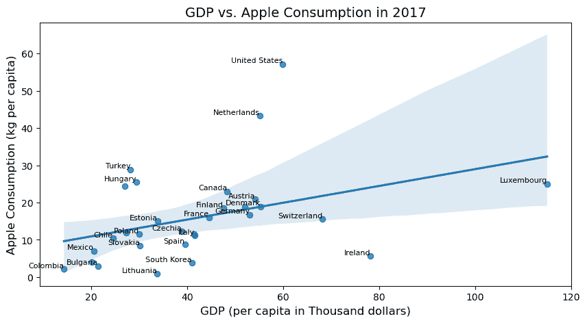

散点图显示**正相关**：**人均 GDP 增加时，苹果消费也倾向于增加**。然而，与中位数年龄和医生就诊相比，这种趋势较弱，数据中存在更多变化。

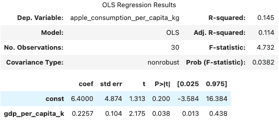

OLS 证实了这种关系：人均 GDP 的系数为 0.2257，我们可以估计每增加 1000 美元的人均 GDP，人均苹果消费将增加约 0.23 公斤。

3.8%的 p 值使我们能够拒绝零假设。因此，这种关系在统计学上是显著的。然而，R²值（0.145）相对较低，因此尽管 GDP 解释了苹果消费的一些变化，但许多其他因素可能也起了作用。

### 结论

俗话说：

> *“一天一个苹果，医生远离我。”*

但在用实际数据对这个神话进行测试后，结果似乎与这个说法不符。在多年的数据中，结果是一致的：**即使在控制了混杂因素后，苹果消费与医生就诊之间也没有出现有意义的关联**。似乎苹果本身并不能足够地让医生远离。

然而，这并不完全否定多吃苹果可以减少医生就诊次数的想法。无论我们如何控制混杂因素，观察数据都无法完全证明或否定因果关系。

为了得到更准确的统计答案，并且排除所有可能的混杂因素，以一个可以针对个人采取行动的粒度级别，我们需要进行**A/B 测试**。

在这样的实验中，参与者将被随机分配到两组，例如一组每天吃固定数量的苹果，另一组避免吃苹果。通过比较这两组在一段时间内的医生就诊情况，我们可以确定它们之间是否存在任何差异，从而提供更强的因果效应证据。

由于明显的原因，我选择不采取那条路线。雇佣一大群参与者会花费很多钱，而且从伦理上强迫人们为了科学而避免吃苹果是肯定有问题的。

然而，我们确实发现了一些有趣的模式。医生就诊的最强预测因素不是苹果消费，而是中位数年龄：**一个国家的平均人口越老，人们去看医生的频率就越高**。

同时，**GDP 与苹果消费之间存在轻微的联系**，这可能是因为富裕国家有更好的新鲜产品获取途径，或者因为苹果种植区往往更加发达。

因此，虽然我们无法确认原始神话，但我们可以提供一个不那么诗意，但**数据支持的版本**：

> “年轻使人远离医生。”

如果你喜欢这个分析并想联系我，你可以在[LinkedIn](https://www.linkedin.com/in/matteo-casolari/)上找到我。

完整分析可在 GitHub 上的此[笔记本](https://github.com/matteocasolari/myths-vs-data/blob/main/01_an_apple_a_day/notebooks/01_an_apple_a_day.ipynb)中找到。

* * *

### 数据来源

**水果消费**: 联合国粮食及农业组织（2023） — 由 Our World in Data 主要处理。“人均苹果消费量—FAO” [数据集]。联合国粮食及农业组织，“食物平衡：食物平衡（-2013，旧方法和人口）”；联合国粮食及农业组织，“食物平衡：食物平衡（2010-）” [原始数据]。许可协议下[CC BY 4.0](https://creativecommons.org/licenses/by/4.0/)。

**医生就诊次数**: 经济合作与发展组织（2024），咨询，[URL](https://data-explorer.oecd.org/vis?lc=en&pg=0&tm=Doctors%27%20consultations&snb=51&vw=ov&df%5Bds%5D=dsDisseminateFinalDMZ&df%5Bid%5D=DSD_HEALTH_PROC%40DF_CONSULT&df%5Bag%5D=OECD.ELS.HD)（2025 年 1 月 22 日访问）。许可协议下[CC BY 4.0](https://creativecommons.org/licenses/by/4.0/)。

**人均 GDP**: 世界银行（2025） — 由 Our World in Data 进行少量处理。“人均 GDP—世界银行—2021 年国际美元不变价” [数据集]。世界银行，“世界发展指标” [原始数据]。2025 年 1 月 31 日从[`ourworldindata.org/grapher/gdp-per-capita-worldbank`](https://ourworldindata.org/grapher/gdp-per-capita-worldbank)检索。许可协议下[CC BY 4.0](https://creativecommons.org/licenses/by/4.0/)。

**中位年龄**: 联合国，世界人口展望（2024） — 由 Our World in Data 处理。“中位年龄，中等预测—UN WPP” [数据集]。联合国，“世界人口展望” [原始数据]。许可协议下[CC BY 4.0](https://creativecommons.org/licenses/by/4.0/)。

* * *

所有图片，除非另有说明，均为作者所有。
