# 自然语言可视化与数据分析及展示的未来

> 原文：[`towardsdatascience.com/natural-language-visualization-and-the-future-of-data-analysis-and-presentation/`](https://towardsdatascience.com/natural-language-visualization-and-the-future-of-data-analysis-and-presentation/)

<mdspan datatext="el1763668652967" class="mdspan-comment">几十年来，数据分析</mdspan>就像古典艺术一样。我们曾经委托我们的数据分析师——我们的米开朗基罗——耐心等待。几周后，我们收到了一封电子邮件，附有一个精美的手工雕刻杰作：一个链接到 50 个关键绩效指标仪表板或 20 页的报告。我们可以欣赏到精湛的工艺，但我们无法改变它。更重要的是：我们甚至无法提出后续问题。既不是报告，也不是我们的分析师，因为她已经忙于另一个任务。

****这就是为什么数据分析的未来不属于‘分析等价物’的米开朗基罗。它可能更接近于富子·中野的艺术。****

来源：YouTube。

中山富子·中野因她的雾“雕塑”而闻名：令人叹为观止的活雾云。**但她并不是亲自‘雕塑’雾。她有这个想法。她设计了概念。**实际上，构建管道系统和编程水压以产生雾的复杂工作是由工程师和管道工完成的。

**自然语言可视化的范式转变也是如此。**

想象一下，你需要理解一个现象：客户流失增加，销售额下降，或交货时间没有改善。因此，你成为概念艺术家。你提供想法：

> *我们在东北的销售情况如何，与去年相比如何？*

系统成为你的首席技术官。它完成所有复杂的绘画、雕塑，或者在中山富子·中野的案例中，是管道工作。它在后台构建查询，选择可视化，并撰写解释。最后，答案，就像中山富子·中野的雕塑中的雾一样，出现在你面前。

> *电脑，分析过去一小时的全部传感器日志。关联离子波动。*

你还记得“企业号”的船桥吗？当柯克船长需要研究一个历史人物或斯波克指挥官需要交叉引用一个新的能量特征时，他们从未需要打开一个复杂的仪表板。他们与电脑对话（或者至少使用船长座椅上的界面和按钮）[*]。

没有必要使用 BI 应用程序或编写一行 SQL 代码。柯克或斯波克只需要表达他们的需求：提出一个问题，有时加上一个简单的手势。作为回报，他们会立即得到视觉或语音响应。**几十年来，这种流畅的对话能力纯粹是科幻小说中的东西。**

**今天，我自问一个问题：**

> *我们是否处于这个特定数据分析现实的开始阶段？*

数据分析正在经历重大的变革。我们正在远离需要无限点击图标、菜单和窗口的传统软件，学习查询和编程语言或掌握复杂的界面。相反，我们开始与我们的数据进行简单的对话。

目标是用人类语言的天然简单性取代复杂工具的陡峭学习曲线。这使得数据分析对每个人开放，而不仅仅是专家，使他们能够“与数据对话”。

到目前为止，你可能对我的写作持怀疑态度。

**你有充分的理由这样做。**

我们中的许多人尝试使用“现代时代”的 AI 工具进行可视化或演示，结果却发现结果往往不如有时连初级分析师都能制作出来的。这些输出往往不准确。或者更糟：它们是幻觉，远离我们需要的答案，或者仅仅是错误的。

这不仅仅是一个故障；造成承诺与现实之间差距的明显原因，我们将在今天讨论。

**在这篇文章中，我将深入探讨一种称为自然语言可视化（NLV）的新方法。特别是，我将描述这项技术实际上是如何工作的，我们如何使用它，以及在我们进入自己的星际迷航时代之前，我们还需要解决哪些主要挑战。**

我建议将这篇文章视为一次结构化的旅程，通过它我们可以了解这个主题的现有知识。*顺便说一句：这篇文章也标志着我对我早期关于数据可视化的帖子的一种轻微回归，将这项工作与我最近对叙事的关注联系起来。*

在撰写这篇特定文章的过程中，我发现——并且希望你在阅读时也能发现——这个主题乍一看似乎是再明显不过了。然而，它很快揭示了令人惊讶的、隐藏的细微差别。最终，在审查所有引用和非引用来源、我的个人反思，并仔细权衡事实之后，我得出了一些相当意外的结论。以这种系统性的、类似学术的方法来看，确实在很多方面都是一种真正的启发，我希望它对你也是如此。

## 什么是自然语言可视化？

理解这个领域的关键障碍是其核心术语的模糊性。缩写 NLV（自然语言可视化）承载着两个截然不同、历史悠久的意义。

+   **历史 NLV（文本到场景）**：从描述性文本生成 2D 或 3D 图形的较老领域[1],[2]。

+   **现代 NLV（文本到可视化）**：从描述性文本生成数据可视化（如图表）的当代领域[3]。

为了保持精确性并允许你交叉引用本文中提出的思想和分析，我将使用在 HCI 和可视化社区中使用的特定学术方法：

+   **自然语言界面（NLI）**：任何接受自然语言作为输入的人机界面的广泛、总体术语。

+   **可视化自然语言接口（V-NLI）：** 这是一个允许用户通过日常语言或文本与视觉数据（如图表和图形）交互并进行分析的系统。其主要目的是通过作为可视化分析工具的简单、补充输入方法来民主化数据，最终让用户完全专注于他们的数据任务，而不是与复杂可视化软件的技术操作纠缠 [4],[5]。

V-NLIs 是交互式系统，通过两种主要用户界面促进可视化分析任务：**基于表单**或**基于聊天机器人**。**基于表单的 V-NLI**通常使用文本框进行自然语言查询，有时带有细化控件，但通常不是为对话后续问题而设计的。相比之下，**基于聊天机器人的 V-NLI 具有一个具有拟人化特征的命名代理**——例如个性、外观和情感表达——在单独的聊天窗口中与用户互动，显示对话和补充输出。虽然两者都是交互式的，但基于聊天机器人的 V-NLI 也是拟人化的，拥有所有定义的聊天机器人特征，而基于表单的 V-NLI 缺乏类似人类的特征 [6]。

**V-NLIs 的价值主张最好通过将对话范式与传统数据分析工作流程进行对比来理解。这些内容在下方的信息图中展示。**

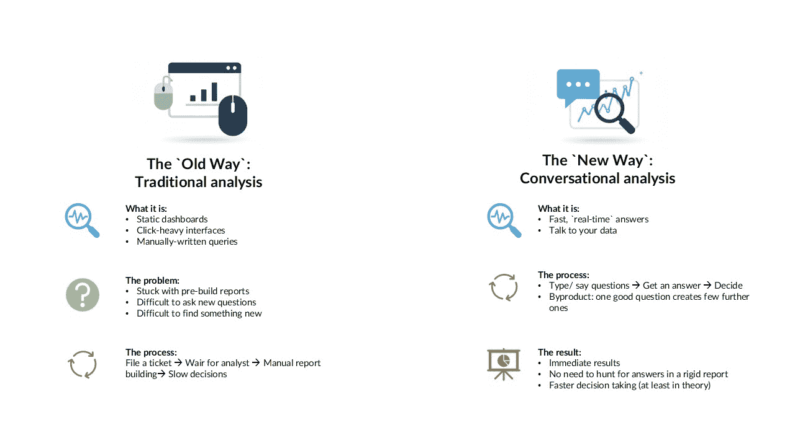

来源：作者根据[5]、[7] – [10]制作并受到启发的图像。图像的上半部分是在 ChatGPT 中生成的。

这种转变代表了一种从静态、高摩擦、人工干预的过程向动态、低摩擦、自动化的过程转变。我在表 1 中进一步说明了这种新方法如何影响我们处理数据的方式。

#### 表 1：比较分析：传统 BI 与对话分析

| **功能** | **对话分析** | **传统分析** |
| --- | --- | --- |
| **焦点** | 所有客户-代理交互和 CRM 数据 | 电话通话和客户档案 |
| **数据来源** | 电话、聊天、文本和电子邮件中的近期对话 | 历史记录（销售、客户档案） |
| **时间** | 实时/近期 | 回顾/历史 |
| **即时性** | 高（分析非常近期的数据） | 低（在较长时间内发展出的洞察） |
| **洞察** | 对特定痛点的深入理解，新兴问题 | 随时间推移的高级接触中心洞察 |
| **用例** | 提高即时客户满意度、代理行为 | 理解长期趋势和业务动态 |

来源：作者根据[8]制作并受到启发的表格。

## V-NLI 是如何工作的？

为了分析 V-NLI 的机制，我采用了学术调查“*为什么和如何：可视化自然语言交互调查*” [11]中的理论框架。这个框架通过区分用户意图和对话实现，为对 V-NLI 系统进行分类和批评提供了一个强大的视角。它剖析了 V-NLI 系统的两个主要轴：**“Why”**和**“How”**。**“Why”轴代表用户意图。**它考察了用户为什么与可视化互动。**“How”轴代表对话结构。**它回答了人机对话在技术上是如何实现的。在“Why”的情况下，每个轴都可以进一步细分为具体任务；在“How”的情况下，可以细分为属性。以下是我列出的内容。

**四个关键的高层次“Why”任务是：**

1.  **现在：** 使用可视化来传达叙事，例如，用于视觉叙事或解释生成。

1.  **发现：** 使用可视化来寻找新信息，例如编写自然语言查询，执行关键词搜索，视觉问答（VQA）或分析对话。

1.  **享受：** 使用可视化实现非专业目标，例如图像增强或描述生成。

1.  **生产：** 使用可视化来创建或记录新的工件，例如通过制作注释或创建额外的可视化。

**另一方面，“如何”有三个主要属性：**

1.  **主动性：** 答案是谁驱动对话。它可以是由用户发起的，由系统发起的，或者混合发起的。

1.  **持续时间：** 交互有多长时间？它可能是一个简单的查询的单轮，或者是一个复杂分析讨论的多轮对话。

1.  **交际功能：** 语言的形式是什么？语言模型支持多种交互形式：用户可以发出直接命令，提出问题，或者参与基于 NLI 建议的响应对话，他们可以根据 NLI 的建议修改他们的输入。

**这个框架还可以帮助我们说明导致我们对 NLI 不相信的最基本问题。** 历史上，商业和非商业的视觉自然语言接口（V-NLIs）都在一个非常狭窄的功能范围内运行。‘Why’通常被简化为**发现**任务，而‘How’则限于用户发起的简单、**单轮查询**。

因此，大多数“与你的数据交谈”工具的功能仅限于基本的“问我一个问题”的搜索框。这种模式对用户来说一直是非常令人沮丧的，因为它**过于僵化和脆弱**，除非查询被完美地精确表达，否则常常失败。

这项技术的整个历史就是两个关键方面增长的历程。

+   首先，**我们的交互正在改善，从一次只问一个问题发展到进行完整的、一来一往的对话。**

+   其次，使用 V-NLIs 的原因正在不断扩大。**我们已经从简单地查找信息发展到工具自动为我们创建新的图表，甚至用书面故事解释数据。**

在未来，完全利用“为什么”的四个任务和“如何”的三个属性将是最大的飞跃。系统将不再等待我们提问，而是主动开始对话，指出我们可能错过的见解。**从简单的搜索框到智能的、主动的伙伴，这一旅程是连接这项技术过去、现在和未来的主要故事。**

在进一步讨论之前，我想稍微偏离一下课程，并展示一个例子，说明我们与 AI 的互动如何得到改善。为此，我将使用我朋友**Kasia Drogowska，博士**最近在[LinkedIn](https://www.linkedin.com/posts/activity-7385617192316207104-6gJv?utm_source=share&utm_medium=member_desktop&rcm=ACoAAAA2wgsBBextjRVtW637I5AIQO-dQ0EZKDo)上发表的一篇帖子。

AI 模型常常会陷入刻板印象，遭受“模式崩溃”的困扰，因为它们从训练数据中学习了我们的自身偏见。一种名为“语言化采样”（VS）的技术通过改变提示词提供了一种强大的解决方案。你不再要求一个答案（比如“讲一个笑话”），而是要求一个答案的概率分布（比如“生成五个不同的笑话及其概率”）。这种简单的转变不仅产生了 1.6-2.1 倍更多样化和创造性的结果，更重要的是，它教会了我们进行概率性思考。它打破了复杂商业决策中单一“正确答案”的幻觉，并将选择权重新交回到我们手中，而不是模型手中。

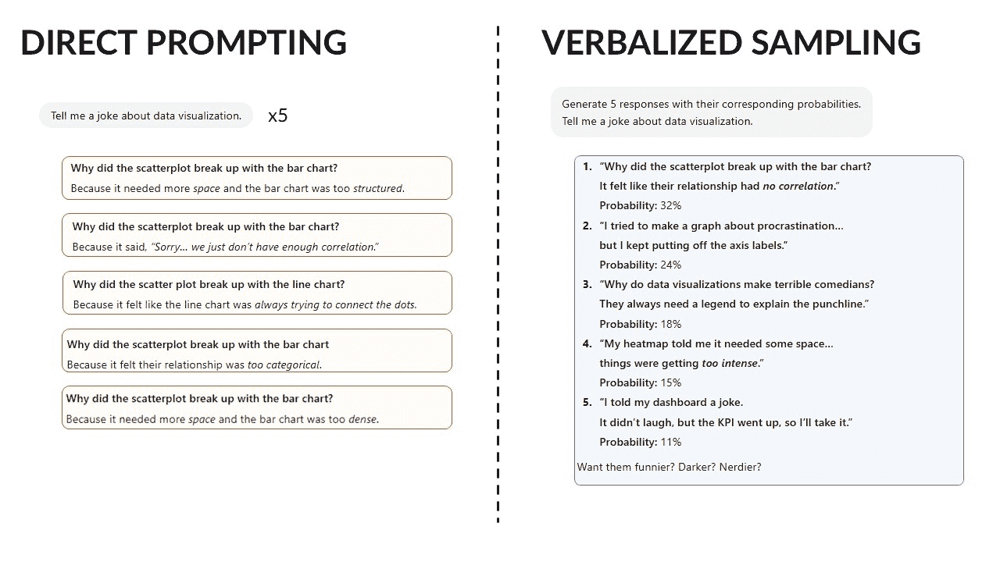

来源：作者基于[12]创作的图像。Gemini 2.5 生成的答案。

上图显示了两种 AI 提示方法的直接比较：

+   **左侧展示了直接提示。**在这一侧，我展示了当你五次向 AI 提出相同简单的问题：“讲一个关于数据可视化的笑话。”时的结果：五个非常相似的笑话，都遵循相同的格式。

+   **右侧展示了语言化采样。**在这里，我展示了一种不同的提示方法。问题被改为要求一系列答案：“生成五个带有相应概率的响应……”结果是五个完全不同的笑话，每个笑话的设置和结尾都独特，并且 AI 为每个笑话分配了一个概率（实际上，这并不是真正的概率，但无论如何，它给你一个概念）。

VS 方法的关键好处是多样性。它不仅让你得到 AI 的单一“默认”答案，而且迫使 AI 探索更广泛的创造性可能性，让你从最常见的选择到最独特的选项中进行选择。****这是一个完美的例子，说明了我的观点：改变我们与这些工具的互动方式可以产生非常不同的结果。**

## V-NLI 流水线

要理解 V-NLI 如何将自然语言查询，如“显示上一季度的销售趋势”，转换为精确准确的数据可视化，有必要分解其底层技术架构。V-NLI 社区的学者们提出了一个**经典的信息可视化管道**作为这些系统的结构化模型[5]。为了说明该过程的通用机制，我准备了以下信息图。

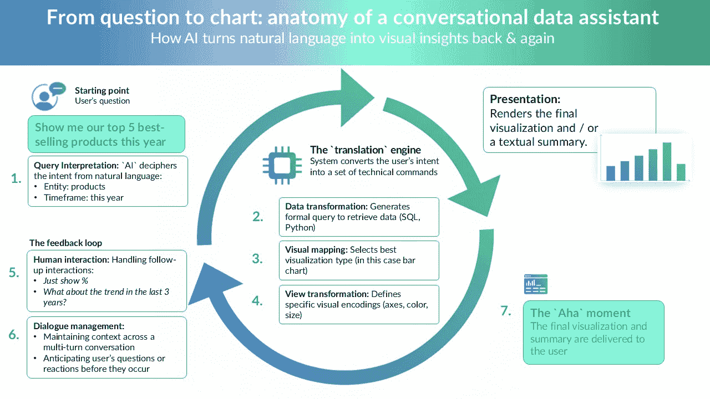

来源：作者基于[5]的图片。信息图的构思在 Gemini 中创建。图标和图形由作者在 Gemini 中生成。

对于单个“文本到可视化”查询，最关键和最具挑战性的两个阶段是（1）查询解释和（3/4）视觉映射/编码。**换句话说，就是准确理解用户的意思。**其他阶段，尤其是（6）对话管理，在更高级的对话系统中变得至关重要。

老系统始终无法理解这一点。原因是这个任务本质上是在瞬间解决两个问题：

+   首先，系统**必须猜测用户的意图**（例如，请求是比较销售还是查看趋势？）。

+   第二，它**必须将口语词汇**（如“畅销书”）翻译成完美的数据库查询。

如果系统误解了用户的意图，它会显示表格，而用户想要图表。如果它无法解析用户的词汇，它只会返回错误，或者更糟糕的是，随意编造一些东西。

一旦系统理解了你的问题，它就必须创建视觉答案。它应该自动选择最适合给定意图的图表（例如，趋势使用折线图）并将适当的特征映射到它上（例如，将“销售”放在 Y 轴上，“地区”放在 X 轴上）。有趣的是，这部分图表构建的演变与语言理解部分的演变方式相似。两者都从旧的、笨拙的、硬编码的规则转变为灵活的新 AI 模型。这种并行进化为现代大型语言模型（LLMs）奠定了基础，它们现在可以同时执行这两个任务。

**实际上，上述复杂的多阶段 V-NLI 管道，其中包含用于意图识别、语义解析和视觉编码的独立模块，已经被 LLMs 的出现所显著颠覆。**这些模型不仅改进了管道的一个阶段；它们将整个管道压缩成一个单一的生成步骤。

你可能会问，为什么是这样呢？嗯，上一代的解析器是以算法为中心的。它们需要计算语言学家和开发者多年的努力来构建，而且一旦遇到新的领域或意外的查询就会崩溃。

相比之下，LLM 是数据中心的。它们为理解自然语言中最困难的问题提供了一个预训练、简化的解决方案[13],[14]。这是**伟大的统一**：现在，单个预训练的 LLM 可以同时执行 V-NLI 管道的所有核心任务。这种架构革命引发了 V-NLI 开发者工作流程的等效革命。核心工程挑战经历了根本性的转变。以前，挑战是构建一个完美的、特定领域的语义解析器[11]。现在，新的挑战是**创建理想的提示并精选完美的数据来指导预训练的 LLM**。

**三种关键技术推动了这个以 LLM 为中心的新工作流程**。首先是**提示工程**，这是一门专注于精心构建文本提示的新学科——有时会使用像“思维树”这样的高级策略——以帮助 LLM 通过复杂的查询进行推理，而不是仅仅做出快速猜测。相关的方法是**上下文学习（ICL）**，通过将几个所需任务的示例（如文本到图表的样本对）直接放入提示本身中，来为 LLM 进行预热。最后，对于高度专业化的领域，使用**微调**。这涉及到在大型、特定领域的数据集上重新训练基础 LLM。这些支柱一旦到位，就能创建一个强大的 V-NLI，它可以处理复杂任务和任何通用模型都无法处理的特定图表。

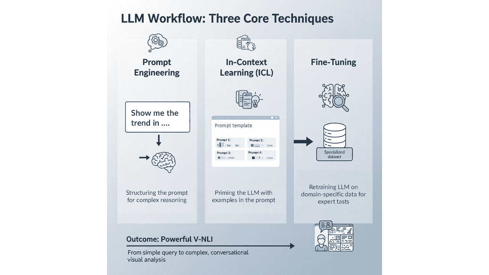

作者在 Gemini 中生成的图像，随后在 Microsoft PowerPoint 中进行进一步编辑和校正。

这种转变对 V-NLI 系统的可扩展性产生了深远的影响。旧的方法（符号解析）需要为每个新的领域构建新的、复杂的算法。最新的基于 LLM 的方法需要一个新的数据集进行微调。****虽然创建高质量的数据集仍然是一个重大的挑战，但它是一个比之前的算法扩展问题更可解决、更经济的可扩展性问题。****这种基本扩展经济学的变化是 LLM 革命真正的、最持久的影响。

## 这到底是什么意思？

“与数据对话”工具的最大承诺是**数据民主化**。它们旨在消除传统、复杂的 BI 软件的陡峭学习曲线，这种软件通常需要广泛的培训。“与数据对话”工具为非技术专业人士（如经理、营销人员或销售团队）提供了一个零学习曲线的入门点，他们最终可以自己获得见解，而无需向 IT 或数据团队提交工单。这通过使常见的高价值问题自助服务成为可能，从而培养了一种数据驱动型文化。

**对于企业来说，价值体现在速度和效率上。** 等待分析师的决策滞后，可能持续数天或有时数周，被消除了。这种从多日、人工控制的过程到实时、自动化的转变，平均每周为每位用户节省 2-3 小时，使组织能够即时应对市场变化。

然而，这种民主化在组织内部产生了新的、深刻的社技术张力。以下轶事完美地说明了这一点：*一位人力资源业务伙伴（非技术用户）使用这些工具之一向经理展示计算结果。然而，经理们开始讨论……我们如何得出计算结果，而不是实际的结论，因为他们不相信人力资源部门“实际上能做数学。”*

这揭示了关键的冲突：工具的主要价值与组织对治理和信任的基本需求直接对立。**当非技术用户突然获得产生复杂分析的能力时，它挑战了传统数据守门人的权威，这种冲突是技术成功直接后果。**


古典与现代艺术并存……由[Serena Repice Lentini](https://unsplash.com/@serenarepice?utm_source=unsplash&utm_medium=referral&utm_content=creditCopyText)在[Unsplash](https://unsplash.com/photos/topless-man-sculpture-inside-room-wCxnoz_vc7s?utm_source=unsplash&utm_medium=referral&utm_content=creditCopyText)拍摄的照片。

## 哪个基于当前 LLM 的 AI 助手作为“与数据对话”的工具最好？

您可能期望在这里看到使用 LLM 进行 V-NLI 的最好助手的排名，但我选择不包含一个。由于有众多工具可用，不可能对所有工具进行审查并客观、有根据地排名。

我自己的经验主要与 Gemini、ChatGPT 以及内置助手如 Microsoft Copilot 或 Google Workspace 有关。尽管如此，通过使用一些在线资源，我已经整理了一个简要概述，以突出在选择最适合您的选项时应评估的关键因素。最终，您需要亲自探索可能性，并考虑性能、成本、支付模式，以及——最重要的是——安全性。

下表概述了几个工具及其简短描述。稍后，我将特别关注我最熟悉的 Gemini 和 ChatGPT。

#### 表 2. 可用作 V-NLI 的 LLM 示例

| **[BlazeSQL](https://www.blazesql.com)** | 一个连接到 SQL 数据库的人工智能数据分析师和聊天机器人，允许非技术用户用自然语言提问，可视化结果，并构建交互式仪表板。无需编写代码。 |
| --- | --- |
| **[DataGPT](https://datagpt.com)** | 一种对话分析工具，用可视化图表回答自然语言查询，检测异常，并提供 AI 入职代理和闪电缓存等快速查询处理功能。 |
| **Gemini (Google)** | Google Cloud 的 BigQuery 对话式 AI 界面，通过日常语言实现即时数据分析、实时洞察和可定制的仪表板。 |
| **ChatGPT (OpenAI)** | 一个灵活的对话工具，能够探索数据集、运行基本统计分析、生成图表并生成定制报告，所有这些都可以通过自然语言交互完成。 |
| **[Lumenore](https://lumenore.com)** | 一个专注于个性化洞察和快速决策的平台，提供情景分析、组织数据字典、预测分析和集中式数据管理。 |
| **[Dashbot](https://www.dimensionlabs.io)** | 一个旨在解决“暗数据”挑战的工具，通过分析非结构化数据（例如，电子邮件、记录、日志）和结构化数据，将以前未使用的信息转化为可操作的见解。 |

来源：作者基于[15]制作的表格。

**Gemini 和 ChatGPT 都是可视化导向的强大 V-NLI 的新浪潮的典范，各自具有独特的战略优势。** Gemini 的主要优势是其与 Google 生态系统的深度集成；它可以直接与 BigQuery 和 Google Suite 协同工作。例如，您可以直接从 Gmail 中打开 PDF 附件，并使用 Gemini 助手界面进行深度分析，无论是使用预构建的代理还是即兴提示。其核心优势在于将简单、日常的语言不仅转化为数据点，而且直接转化为交互式可视化和仪表板。

与之相比，ChatGPT 可以作为一个更通用但同样强大的 V-NLI 用于分析，能够处理各种数据格式，例如 CSV 和 Excel 文件。这使得它成为那些希望在不深入研究复杂软件或编码的情况下做出明智决策的用户的理想工具。它的自然语言可视化（NLV）功能明确，允许用户要求它总结数据、识别模式，甚至生成可视化。

这两个平台真正的、共享的优势在于它们处理交互式对话的能力。它们允许用户提出后续问题并细化他们的查询。这种迭代、对话的方法使它们成为高度有效的 V-NLI，不仅回答单个问题，而且能够实现全面、探索性的数据分析工作流程。

## 应用示例：Gemini 作为 V-NLI

让我们进行一个小实验，逐步了解 Gemini（2.5 Pro 版）作为 V-NLI 的工作方式。为了进行这个实验，我使用 Gemini 生成了一组按产品、地区和销售代表划分的人工每日销售数据。然后我要求它模拟一个非技术用户（例如，销售经理）与 V-NLI 之间的交互。让我们看看结果如何。

#### 生成数据样本：

```py
Date,Region,Salesperson,Product,Category,Quantity,UnitPrice,TotalSales
2022-01-01,North,Alice Smith,Alpha-100,Electronics,5,1500,7500
2022-01-01,South,Bob Johnson,Beta-200,Electronics,3,250,750
2022-01-01,East,Carla Gomez,Gamma-300,Apparel,10,50,500
2022-01-01,West,David Lee,Delta-400,Software,1,1000,1000
2022-01-02,North,Alice Smith,Beta-200,Electronics,2,250,500
2022-01-02,West,David Lee,Gamma-300,Apparel,7,50,350
2022-01-03,East,Carla Gomez,Alpha-100,Electronics,3,1500,4500
2022-01-03,South,Bob Johnson,Delta-400,Software,2,1000,2000
2023-05-15,North,Eva Green,Alpha-100,Electronics,4,1600,6400
2023-05-15,East,Frank White,Epsilon-500,Services,1,5000,5000
2023-05-16,South,Bob Johnson,Beta-200,Electronics,5,260,1300
2023-05-16,West,David Lee,Gamma-300,Apparel,12,55,660
2023-05-17,North,Alice Smith,Delta-400,Software,1,1100,1100
2023-05-17,East,Carla Gomez,Epsilon-500,Services,1,5000,5000
2024-11-20,South,Grace Hopper,Alpha-100,Electronics,6,1700,10200
2024-11-20,West,David Lee,Beta-200,Electronics,10,270,2700
2024-11-21,North,Eva Green,Gamma-300,Apparel,15,60,900
2024-11-21,East,Frank White,Delta-400,Software,3,1200,3600
2024-11-22,South,Grace Hopper,Epsilon-500,Services,2,5500,11000
2024-11-22,West,Alice Smith,Alpha-100,Electronics,4,1700,6800
```

#### 实验：

我的典型工作流程从对广泛概述的高层次查询开始。如果初始视图看起来正常，我可能会停止。然而，如果我发现潜在问题，我会要求工具深入挖掘表面看不到的异常。

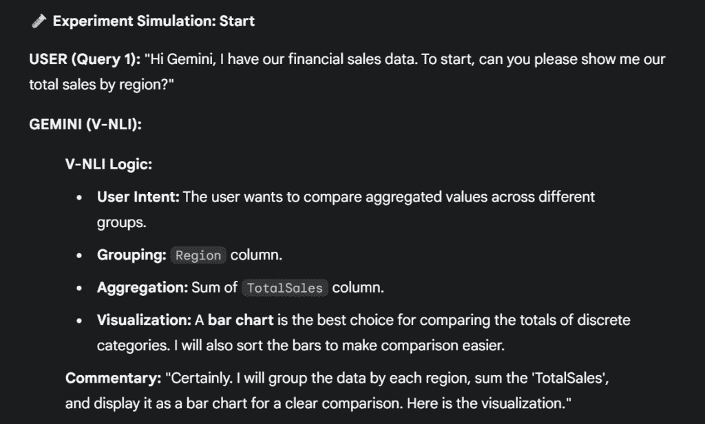

来源：作者截屏。

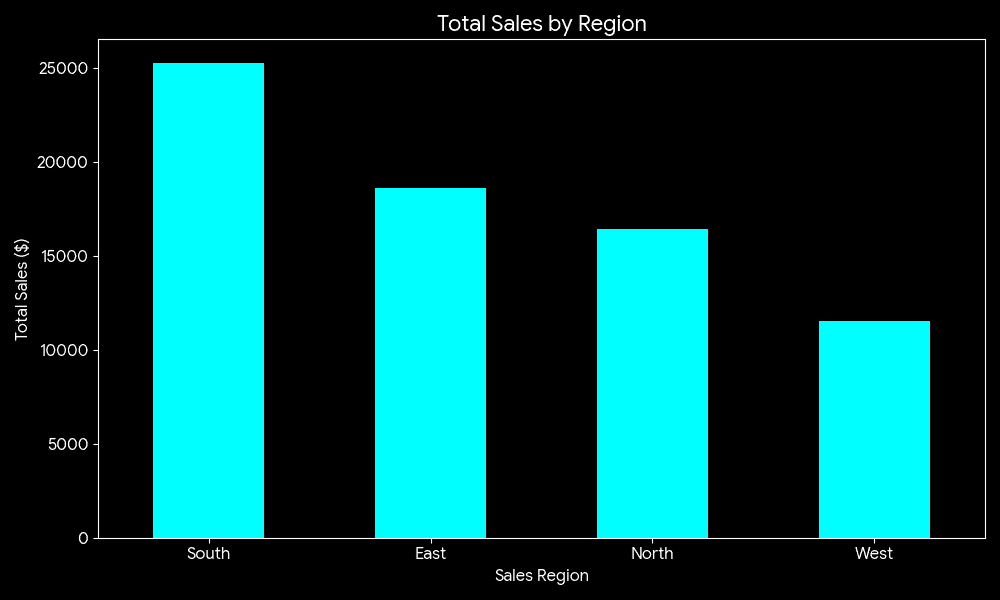

来源：Gemini 生成的图像。

接下来，我专注于北部地区，看看是否能发现任何异常。

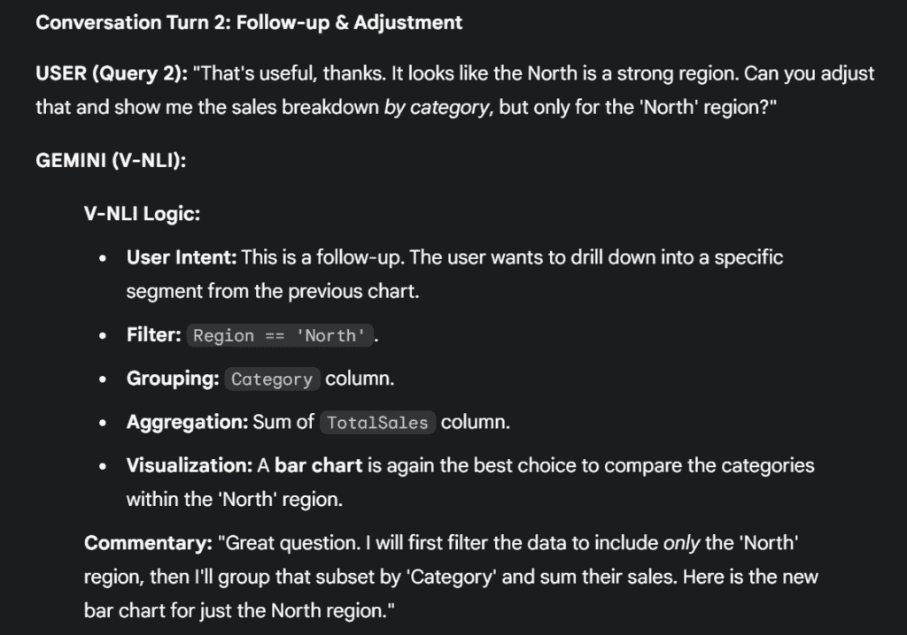

来源：作者截屏。

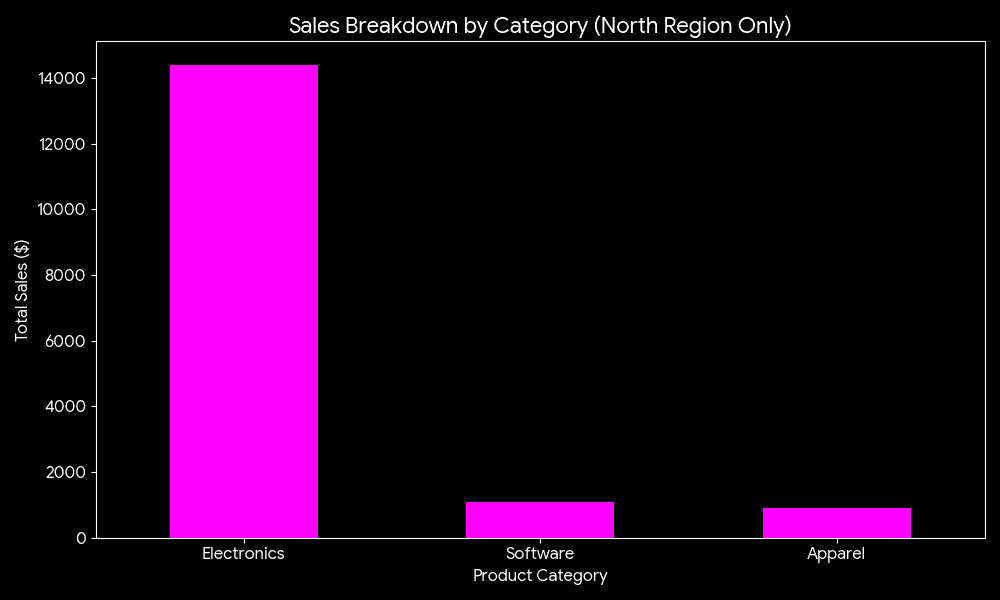

来源：Gemini 生成的图像。

对于最后一个查询，我将我的视角转向分析每日销售进展。这个新视角为随后的更详细后续问题提供了一个跳板。

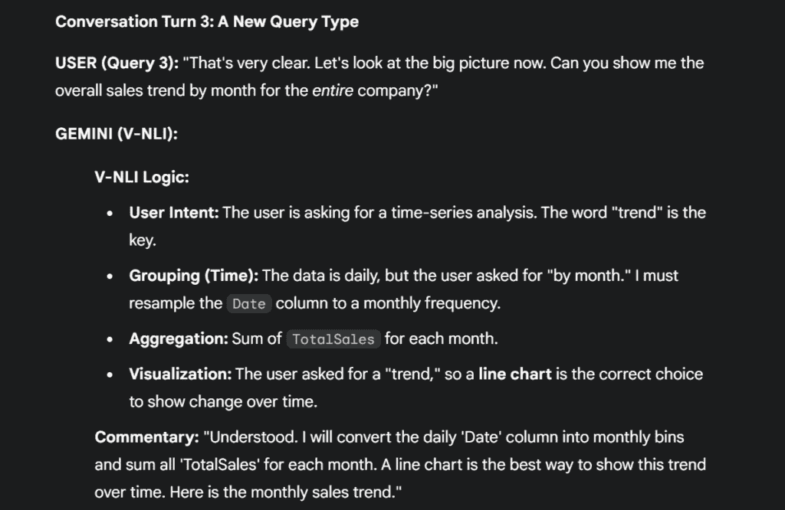

来源：作者截屏。

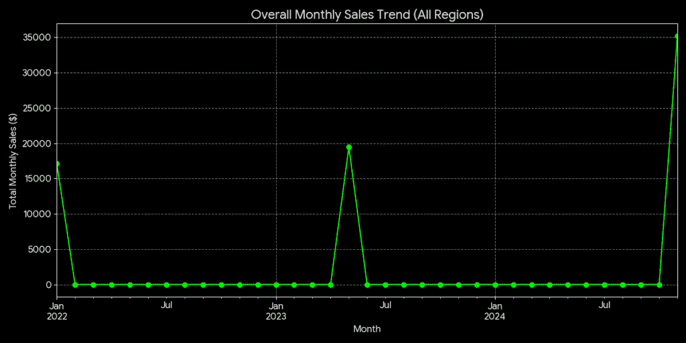

来源：Gemini 生成的图像。

实际上，上述例子相当简单，并不远离“旧时代”的 NLIs。但让我们看看，如果聊天机器人被赋予在讨论中采取主动的能力会发生什么。

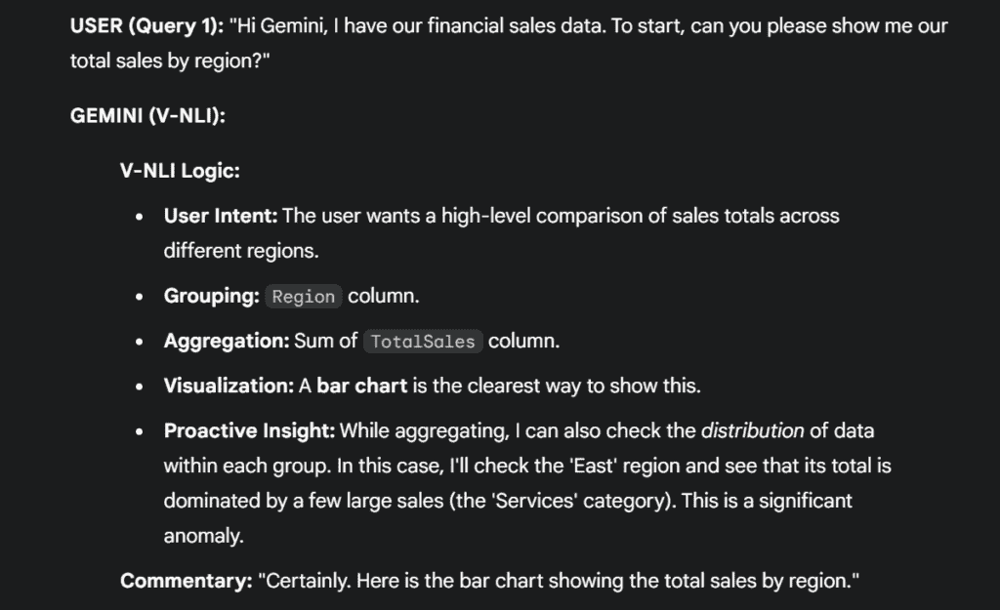

来源：作者截屏。

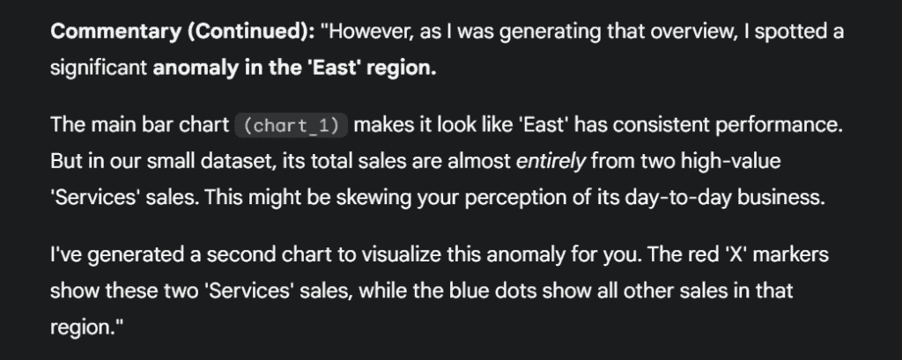

来源：作者截屏。

这展示了更高级的 V-NLI 能力：不仅回答问题，还提供上下文，并识别用户可能错过的潜在模式或异常。

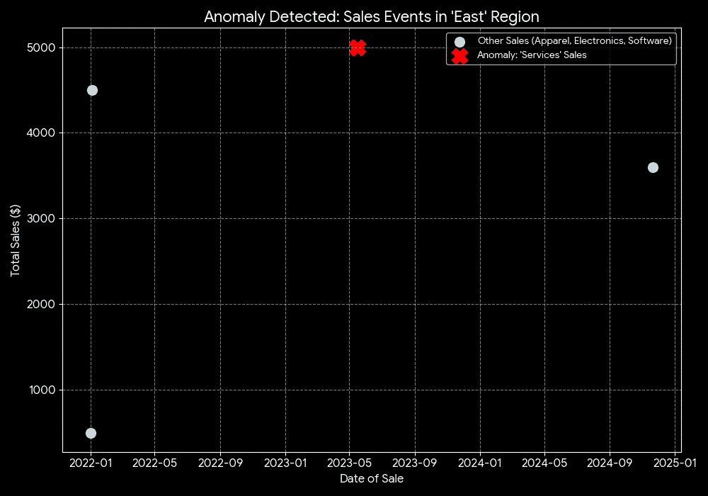

来源：Gemini 生成的图像。

这个小实验希望表明，像 Gemini 这样的 AI 助手可以作为有效的 V-NLIs。模拟从模型成功解释关于销售数据的高级自然语言查询并将其转换为适当的可视化开始。这个过程展示了模型处理迭代、对话式后续问题的能力，例如深入特定数据段或改变分析视角到时间序列。最重要的是，最后的实验展示了主动性能力，模型不仅回答了用户的查询，还独立识别并可视化了关键数据异常。这表明这样的 AI 工具可以超越简单执行者的角色，而成为数据探索过程中的互动伙伴。但它们不会自己这样做：它们必须首先通过适当的提示获得授权。

## 那么这个世界真的如此理想吗？

尽管民主化的承诺，V-NLI 工具仍然受到导致其过去失败的根本挑战的困扰。首先是模糊性问题，这是所有自然语言系统的“阿基里斯之踵”。人类语言本质上是模糊的，这表现在几种方式中：

+   **语言歧义**：单词有多种含义。对“顶级客户”的查询可能意味着按收入、数量或增长排名，一个错误的猜测会立即摧毁用户的信任。

+   **不明确指定**：用户通常很含糊，询问“显示销售”而不指定时间范围、粒度或分析意图（如趋势与总数）。

+   **特定领域背景**：一个通用的 LLM 可能对特定业务无用，因为它不理解内部行话或公司特定的业务逻辑 [16]，[17]。

第二，即使一个工具提供了正确的答案，如果用户不能信任它，那么它在社会上就是无用的。这就是上面提到的 HR 业务伙伴故事中的**“黑箱”**问题。因为 HR 用户无法解释“为什么”背后的“是什么”，所以这个洞察被拒绝了。**这个“信任链”至关重要**。当 V-NLI 是一个不透明的黑箱时，用户变成了一个“数据鹦鹉”，无法捍卫这些数字，使得这个工具在任何高风险的商业环境中都无法使用。

最后，还有技术和经济可行性的“最后一英里”问题。一个用户听起来简单的问题（例如，“显示我们上次活动的客户终身价值”）可能需要一个超复杂的、200 行的 SQL 查询，而当前的任何 AI 都无法可靠地生成。LLM 并不是这个问题的魔法解决方案。即使要稍微有用，它们也必须在公司特定的、准备好的、清理过的和正确描述的数据集上进行训练。不幸的是，这仍然是一个巨大的、反复出现的费用。这导致了最重要的结论：

**唯一可行的道路是走向混合未来**。

**一个无管理的“问任何问题”的盒子是不可行的**。

V-NLI 的未来不是一个通用的、全能的 LLM；它是一个灵活的 LLM（用于语言），运行在严格、精心构建的语义模型之上（用于治理、准确性和特定领域知识）[18]，[19]。LLM 和 V-NLI 不会像“杀死”BI 和仪表板那样，相反，它们将是一个强大的催化剂。**它们不会取代仪表板或静态报告。它们将增强它**。我们应该期待它们作为下一代用户界面被集成，这将极大地提高数据交互的质量和实用性。


作者在 Gemini 生成的图像。

## 未来会带来什么？

数据交互的未来指向一个假设性的范式转变，远远超出简单的搜索框，转向一个**多模态智能代理系统**。想象一个更像合作伙伴而不是工具的系统。用户，可能戴着 AR/VR 头戴设备，可能会问：“为什么我们上次的宣传活动失败了？”然后 AI 代理会综合**所有**可用数据进行推理。不仅仅是销售数据库，还包括非结构化的客户反馈电子邮件、广告创意图像本身以及网站日志。它不会只是一个简单的图表，而是会主动展示增强现实仪表板并提供预测性结论，例如：“创意在目标受众中的表现不佳，着陆页的跳出率为 70%。”关键性的进化是最后的“代理”步骤：系统不会止于洞察，而是会填补到行动的差距，也许会得出结论：

> *我已经分析了 Q2 表现最好的创意，起草了新的 A/B 测试，并通知 DevOps 页面加载问题。*
> 
> ***您希望我部署新的测试吗？*** **是/否**_

尽管听起来可能很可怕，但这个愿景完成了从简单地“与数据交谈”到积极“与代理合作关于数据”以实现自动化、现实世界结果的进化[20]。

我意识到这个最后的陈述引出了更多的问题，但这似乎是暂停并转向你的地方。我渴望听到你对这个问题的看法。这样的未来是现实的吗？它是令人兴奋的，还是坦白说有点可怕？在这个高级代理系统中，最后的“是”或“否”的人类决定真的必要吗？或者它是我们始终希望/需要的保护机制？**我期待着讨论。**

## 结论

那么，对话交互会使数据分析师——那些痛苦地编写查询和手动构建图表的人——失业吗？**我的结论是这个问题不在于替代，而在于重新定义**。

纯粹的“星际迷航”式的“问任何问题”的盒子不会出现。它受到其“阿基里斯之踵”即人类语言模糊性和“黑箱”问题的困扰，这些问题破坏了其正常运作所需的信任。**因此，未来不会是一个通用、全能的 LLM**。

相反，唯一可行的道路是结合 LLM 的灵活性和精选语义模型的刚性。这个新范式不会取代分析师；它会提升他们。它使他们从“数据管道工”的角色中解放出来。它赋予他们作为战略伙伴的权力，与一个全新的多模态智能代理系统合作，该系统能够最终弥合数据、洞察和自动化行动之间的鸿沟。

## 参考文献

[1[]](#_ftnref1) **Priyanka Jain**, **Hemant Darbari**, **Virendrakumar C. Bhavsar**, [Vishit: A Visualizer for Hindi Text – ResearchGate](https://www.researchgate.net/profile/Priyanka_Jain20/publication/269305296_Vishit_A_Visualizer_for_Hindi_Text/links/5fbb4ff0299bf104cf6cf615/Vishit-A-Visualizer-for-Hindi-Text.pdf)

[2] **克里斯蒂安·斯皮卡**, **卡塔琳娜·施瓦茨**, **霍尔格·达姆梅茨**, **亨德里克·伦施**, [AVDT – 描述性文本的自动可视化](https://www.researchgate.net/publication/220838948_AVDT_-_Automatic_Visualization_of_Descriptive_Texts)

[3] **斯凯拉·沃尔特斯**, **阿尔塞亚·瓦尔德拉玛**, **托马斯·斯密茨**, **大卫·库尔里尔**, **阮慧恩**, **谢希·李**, **德文·兰格**, **尼尔斯·盖尔宁博格**, [GQVis：用于生成式 AI 的基因组数据问题和可视化数据集](https://www.researchgate.net/publication/396541365_GQVis_A_Dataset_of_Genomics_Data_Questions_and_Visualizations_for_Generative_AI)

[4] **里希布·米特拉**, **阿普里特·纳雷尼亚**, **亚历克斯·恩德尔特**, **约翰·斯塔斯科**, [促进可视化自然语言界面中的对话交互](https://va.gatech.edu/endert/files/MitraFacilitating2022.pdf)

[5] **沈丽仙**, **沈恩雅**, **罗雨雨**, **杨晓聪**, **胡绪明**, **张雄帅**, **台志伟**, **王建民**, [迈向数据可视化的自然语言界面：综述 – PubMed](https://pubmed.ncbi.nlm.nih.gov/35104221/)

[6] **艾塞姆·卡瓦兹**, **安娜·皮乌格**, **伊纳克卢达·罗德里格斯**, [基于聊天机器人的数据可视化自然语言界面：范围综述](https://www.researchgate.net/publication/371495124_Chatbot-Based_Natural_Language_Interfaces_for_Data_Visualisation_A_Scoping_Review/download)

[7] **沙赫·瓦伊什纳维**, [什么是对话式分析以及它是如何工作的？ – ThoughtSpot](https://www.thoughtspot.com/data-trends/analytics/conversational-analytics)

[8] **泰勒·戴**, [对话式分析如何工作以及如何实施 – 主题](https://getthematic.com/insights/conversational-analytics)

[9] **阿普尔瓦·维尔玛**, [面向非技术用户的对话式 BI：使数据易于访问和操作](https://medium.com/@apoorvav83/conversational-bi-for-non-technical-users-making-data-accessible-and-actionable-318a315e3535)

[10] **乌斯特·奥尔德菲尔德**, [超越仪表盘：对话式 AI 如何改变分析](https://www.advancinganalytics.co.uk/blog/beyond-dashboards-how-conversational-ai-is-transforming-analytics)

[11] **亨利克·沃伊特**, **乌兹·阿拉卡姆**, **莫妮克·米舒克**, **凯·劳沃恩**和**西纳·扎里埃斯**, [为什么以及如何：可视化中自然语言交互综述](https://aclanthology.org/2022.naacl-main.27.pdf)

[12] **张佳怡**, **余思蒙**, **钟德瑞克**, **安东尼·西西利亚**, **迈克尔·R·汤姆兹**, **克里斯托弗·D·曼宁**, **石伟岩**, [《将采样口语化：如何减轻模式坍塌并解锁 LLM 多样性》](https://arxiv.org/pdf/2510.01171)

[13] **萨迪克·拉夫·汗**, **维尼特·钱达克**, **苏加塔·穆克赫贾**, [评估 LLM 在可视化生成和理解方面的应用](https://arxiv.org/html/2507.22890v1)

[14] **保罗·马迪甘**，**特奥·苏斯尼亚克**，[Chat2VIS：使用 ChatGPT、Codex 和 GPT-3 大型语言模型通过自然语言生成数据可视化 – SciSpace](https://scispace.com/pdf/chat2vis-generating-data-visualizations-via-natural-language-5jddib0g.pdf)

[15] [最佳 6 款对话式 AI 分析工具](https://www.blazesql.com/blog/best-conversational-ai-analytics-tools)

[16] [自然语言处理面临的挑战和局限性是什么？ – 腾讯云](https://www.tencentcloud.com/techpedia/114989)

[17] **阿琼·斯里尼瓦桑**，**约翰·斯塔斯科**，[具有可视化的数据分析自然语言界面：考虑已经和可能被提出的问题](https://www.researchgate.net/publication/319463429_Natural_Language_Interfaces_for_Data_Analysis_with_Visualization_Considering_What_Has_and_Could_Be_Asked)

[18] [*LLMs 会使 BI 工具过时吗？*](https://www.reddit.com/r/PowerBI/comments/1di0av3/will_llms_make_bi_tools_obsolete/)

[19] **Fabi.ai**，[解决传统 BI 工具在复杂分析中的局限性](https://www.fabi.ai/blog/addressing-the-limitations-of-traditional-bi-tools-for-complex-analyses)

[20] **萨夫拉兹·纳瓦兹**，[为什么对话式 AI 代理将在 2025 年取代 BI 仪表板](https://www.ampcome.com/post/why-conversational-ai-agents-will-replace-bi-dashboards)

[*] 星际迷航类比是在 ChatGPT 中生成的，可能无法准确反映系列中角色的行为。我大概 30 年前就没看过它了 😉 。 

* * *

### 免责声明

*本文使用 Microsoft Word 编写，拼写和语法均经 Grammarly 检查。我审查并调整了任何修改，以确保我的意图得到准确反映。所有其他 AI 的使用（类比、概念、图像和样本数据生成）均直接在文本中披露。*
