# 导航数据科学内容：识别常见陷阱，第一部分

> 原文：[`towardsdatascience.com/navigating-data-science-content-recognizing-common-pitfalls-part-1-72f5bab5a010/`](https://towardsdatascience.com/navigating-data-science-content-recognizing-common-pitfalls-part-1-72f5bab5a010/)

数据科学领域广阔而复杂，往往缺乏明确的答案。在在线寻求解决疑问和学习新概念时，我遇到了许多低质量、易出错的答案——一些答案尽管存在基本误解，但仍然得到了意想不到的好评。为了帮助他人避免这些陷阱，我开始撰写一系列文章，分享在线内容中发现的错误（其中一些可能是我在过去犯过的错误）。

在本文中，我将分享 4 个这样的例子，以及每个例子的反例来反驳这些陈述。对于第一部分，这些例子将围绕基本的机器学习和统计学概念展开。

例子将以这种方式结构化

```py
Mistake X : <Wrong Statement>

<Why is it wrong>
```

## **错误 1：在线性回归中，一个假设是目标 Y 必须是正态分布的**

这句话是不完整的，它应该是

"在线性回归（LR）中，一个假设是目标 Y 在 X 的条件分布必须是正态分布"

让我们回顾一下线性回归的定义——尽管它是最简单的形式：**目标 Y 被估计为 p 个预测变量的线性组合**

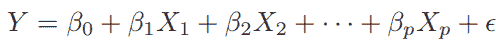

方程 1：线性回归

在使用线性回归建模数据集时，会做出一些假设：

(1) [线性关系] 目标 Y 与预测变量之间存在真实的线性关系

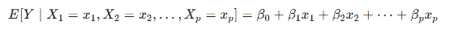

(2) [同方差性] 误差应该在所有 X 值上遵循恒定的方差

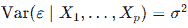

(3) 误差彼此独立

(4) [外生性] 误差不应与预测变量相关

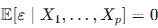

(5) 在预测变量条件下的误差遵循正态分布

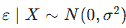

(6) [多重共线性] 没有两个预测变量之间高度相关

使用假设(5)和上面的方程 1，我们可以推导出目标 Y 在预测变量 X 条件下的条件分布：

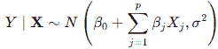

给定 X 的 Y 的条件分布

> 注意：这些假设是基于误差项，而不是残差，残差是误差项的估计

注意到 Y | X 是正态分布的，但这是否意味着 Y 的无条件分布也是正态分布的呢？让我们给出一个反例来证明这是错误的

**示例**

让我们从均匀分布中抽取**X iid**：

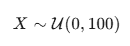

并使用**总体回归模型**生成**Y**：

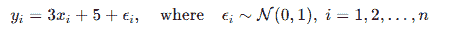

这是否遵守 LR 模型的假设？

> (1) [线性] 目标 Y 和预测变量之间存在真实的线性关系

是的。

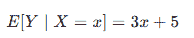

> (2) [同方差性] 误差的方差应该在所有 X 值上遵循恒定的方差

是的。误差具有恒定的方差 1。

> (3) 误差彼此独立

是的。由于 X 和噪声项是独立生成的，因此误差也将相互独立。

> (4) [外生性] 误差不应与预测变量相关

是的。误差的期望值与 N(0, 1) 相同，即 0。

> (5) 在给定预测变量的条件下，误差遵循正态分布

是的。误差遵循 N(0, 1)。

> (6) [多重共线性] 没有两个预测变量彼此高度相关

在上述例子中只有一个预测变量，因此不适用。

> 该模型符合 LR 的所有假设！

将最佳拟合线与其残差和目标分布一起绘制：

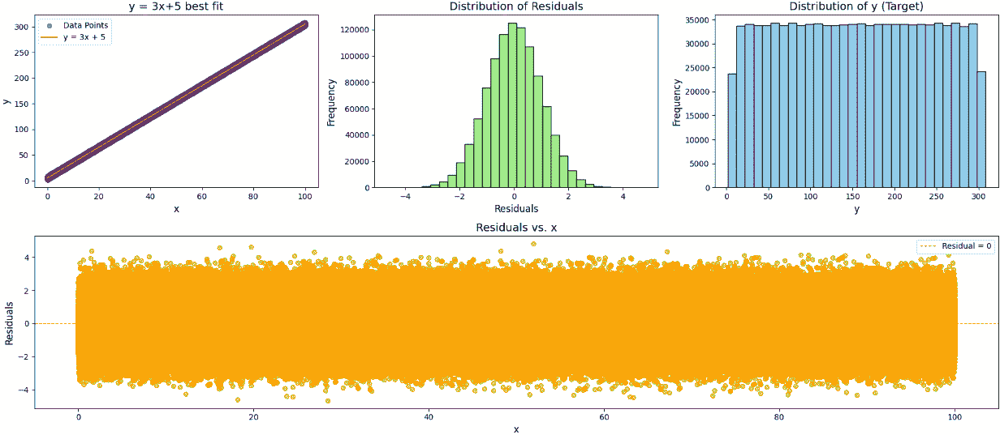

图 1

让我们用 **Shapiro-Wilk 检验**（一种统计假设检验，用于确定数据样本是否服从正态分布）来检查 Y 是否不遵循正态分布

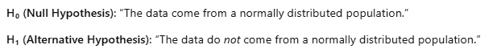

```py
import numpy as np
import pandas as pd
from scipy.stats import shapiro

np.random.seed(42) 
N = 1000000          

X = np.random.uniform(low=0, high=100, size=N)
epsilon = np.random.normal(loc=0, scale=1, size=N)
Y = 3 + 5*X + epsilon

shapiro_stat, shapiro_p = shapiro(Y)
print(f"Test Statistic: {shapiro_stat}")
print(f"p-value: {shapiro_p}")
```

```py
est Statistic: 0.9550506543292717
p-value: 3.4572639724334247e-129
```

观察图 1 中 Y 分布的视觉（一个平峰分布）并发现 p 值极小（约 0），我们得出结论，Y 不遵循正态分布，这完成了反例。

## **错误 2：偏度与峰度：在分布中，偏度衡量的是尾部的长度，而峰度衡量的是峰的高度**

这是不正确的。峰度衡量的是尾部有多“宽”，换句话说，分布的尾部有多少质量，这可能与峰的高度无关

示例：

让我们表示

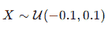

和

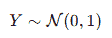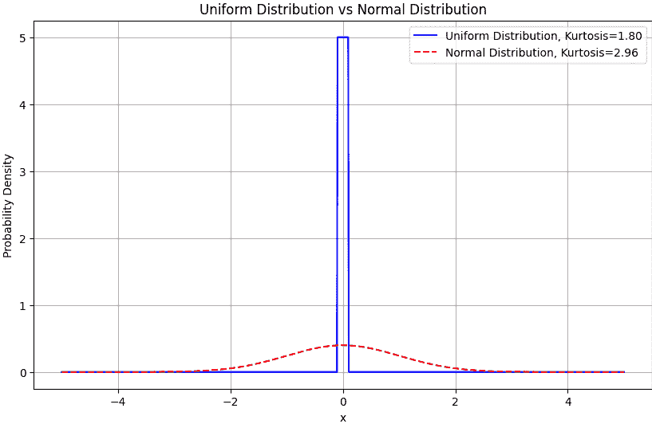

图 2

如图 2 所示，均匀分布的峰值要高得多，但由于它没有异常值（因此尾部较轻），其峰度低于标准正态分布

## **错误 3：一个函数 f(x) 是凸的，因为它只有一个全局最小值**

上述陈述**不足以**确保凸性。

“凸函数”这个术语在机器学习领域被广泛使用，特别是在优化算法（如梯度下降）的世界中——这是逻辑回归背后的一个关键因素。

回忆凸性的定义（为了简单起见，我将仅使用单变量函数）：

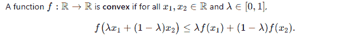

定义 1：函数在其定义域内任意两点之间的线段上的函数值小于或等于这两点函数值的加权平均值

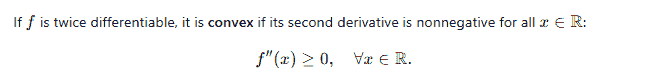

定义 2：对于二阶可微的函数，凸函数的二阶导数在其定义域内处处非负

让我们通过一个反例来展示这并不充分。

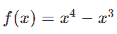

求一阶导数：

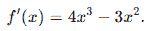

求二阶导数：

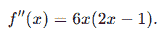

只需将 x = 0.25 代入，

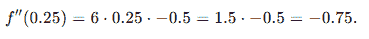

哇！这违反了第二个定义，因此该函数不是凸函数

让我们绘制这个函数并看看：

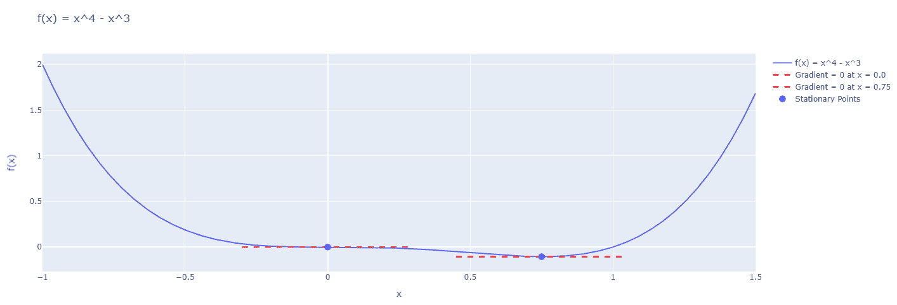

f(x) = x ^ 4 – x ^ 3 的图像

如我们所见，该函数确实只有一个全局最小值。然而，拐点（或当它是多元时的情况下的鞍点）是优化算法也可能收敛的区域，导致次优解。

## **错误 4：参数 95%置信区间的定义：有 95%的概率参数会落在该置信区间内**

我曾多次看到这种“有缺陷”的置信区间理解，甚至在我上大学的时候。

这种误解源于将置信区间解释为样本参数而不是总体参数。实际上，不同的随机样本会产生不同的置信区间。

正确的定义：95%置信区间（对于参数）意味着如果你

1.  从总体中创建 N 个随机样本

1.  为每个样本计算参数的 95%置信区间

你会得到 N 个不同的置信区间，其中 0.95N 个将包含真实的总体参数，如下面的图片所示。

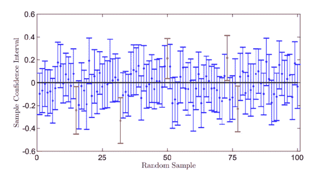

从不同的随机样本中创建 100 个置信区间，其中 95 个包含真实的参数值（0）。图片：[ResearchGate](https://www.researchgate.net/figure/llustration-of-the-confidence-level-of-a-confidence-interval-where-95-out-of-100_fig2_340898418)

## 结论

在数据科学这个不断发展的领域中，对基本概念的理解错误可能会层层递进，影响一个人在未来理解更高级概念的能力。在我数据科学之旅的开始，我犯了一个错误，那就是盲目地相信在线内容，假设它是正确的。随着我不断进步并积累更多经验，我开始用不同的心态来对待这些内容，不仅盲目相信，还借助其他来源进行明智的评估，从而更有信心地认为我所吸收的内容是正确的。

在数据科学中，理解每个概念背后的“为什么”与知道“如何”同样重要——这与软件工程非常不同，在软件工程中，问题往往在本质上更加结构化。

这是本系列的第一篇文章，未来的部分将继续探索和驳斥数据科学各个方面的错误/误解。

如往常一样，如果你在阅读完文章后有任何反馈，请随时评论！

*除非另有说明，所有图像均为作者所有。*
