# 神经网络 – 直观且详尽地解释

> 原文：[`towardsdatascience.com/neural-networks-intuitively-and-exhaustively-explained-0153f85c1007/`](https://towardsdatascience.com/neural-networks-intuitively-and-exhaustively-explained-0153f85c1007/)


"The Thinking Part" by Daniel Warfield 使用 MidJourney。除非另有说明，所有图片均为作者所有。文章最初在 [Intuitively and Exhaustively Explained](https://iaee.substack.com/) 上提供。

在这篇文章中，我们将全面了解神经网络，这是支撑几乎所有前沿人工智能系统的基石技术。我们将首先探索人脑中的神经元，然后探讨它们如何成为人工智能中神经网络的基本灵感来源。然后，我们将探讨反向传播，这是用于训练神经网络执行酷炫操作的算法。最后，在建立全面的概念理解之后，我们将从头开始实现一个神经网络，并训练它来解决一个玩具问题。

* * *

**这对谁有用？** 任何想要全面了解人工智能最新进展的人。

**这篇文章有多高级？** 这篇文章旨在让初学者易于理解，同时也包含详尽的信息，可能对经验更丰富的读者也很有用。

**先决条件：无**

* * *

## 来自大脑的灵感

神经网络直接从人脑中汲取灵感，人脑由数十亿个被称为神经元的极其复杂的细胞组成。

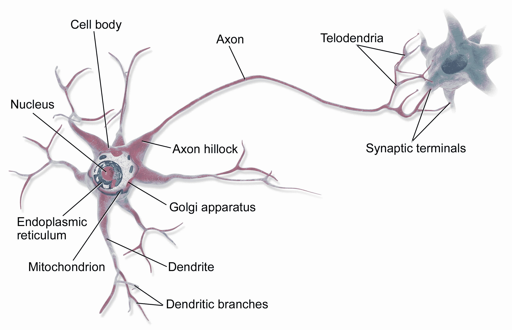

神经元，[来源](https://en.wikipedia.org/wiki/Neuron#/media/File:Blausen_0657_MultipolarNeuron.png)

人类大脑中的思维过程是神经元之间通信的结果。你可能以你所看到的东西的形式接收刺激，然后通过电化学信号将信息传播到大脑中的神经元。


使用 Midjourney 生成的眼睛图像

大脑中的第一个神经元接收那个刺激，然后每个神经元可能会根据它接收到的刺激量选择是否“放电”。“放电”，在这种情况下，是神经元决定向其连接的神经元发送信号的决定。


想象眼睛的信号直接进入三个神经元，其中两个决定放电。

然后，与这些神经元相连的神经元可能会选择放电，也可能不会。

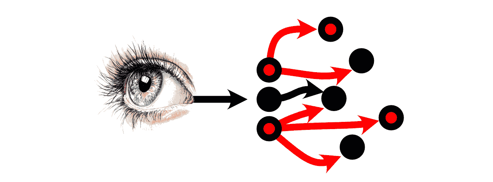

神经元从之前的神经元接收刺激，然后根据刺激的强度选择是否放电。

因此，“思想”可以理解为大量神经元根据来自其他神经元的刺激选择是否放电。

当一个人在世界中导航时，他可能会有比另一个人更多的某些想法。例如，一个大提琴家可能比数学家更多地使用某些神经元。


不同的任务需要使用不同的神经元。Midjourney 生成的图像

当我们更频繁地使用某些神经元时，它们的连接会变得更强，增加这些连接的强度。当我们不使用某些神经元时，这些连接会减弱。这个一般规则启发了“一起放电的神经元，一起连接”的短语，这是大脑负责学习过程的高级特性。


使用某些神经元加强其连接的过程。

我不是神经学家，所以当然这是一个极度简化的脑部描述。然而，这足以理解神经网络的基本概念。

## 神经网络的直觉

神经网络在本质上是一种数学上方便且简化的脑部神经元版本。神经网络由称为“感知器”的元素组成，这些元素直接受到神经元的启发。

 1, 来源 2](../Images/e5b20b6842d4f8dc6be7ac2946ccd467.png)

左边的感知器与右边的神经元。[来源](https://en.wikipedia.org/wiki/Neuron#/media/File:Blausen_0657_MultipolarNeuron.png) 1](https://commons.wikimedia.org/wiki/File:ArtificialNeuronModel_english.png), 来源 2

感知器接收数据，就像神经元一样，

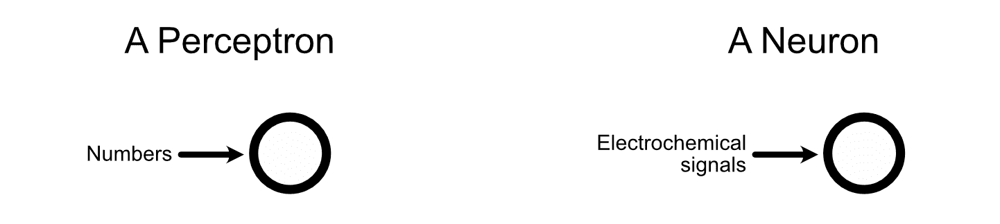

人工智能中的感知器使用数字，而大脑中的神经元使用电化学信号。

像神经元一样聚合数据，

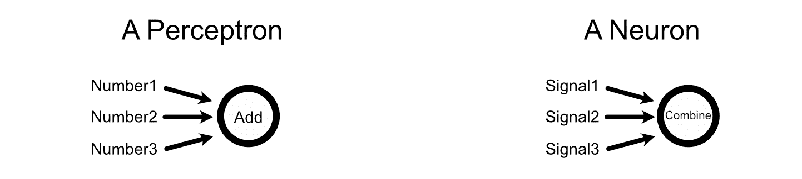

感知器通过聚合数字来得出输出，而神经元通过聚合电化学信号来得出输出。

然后根据输入输出信号，就像神经元一样。

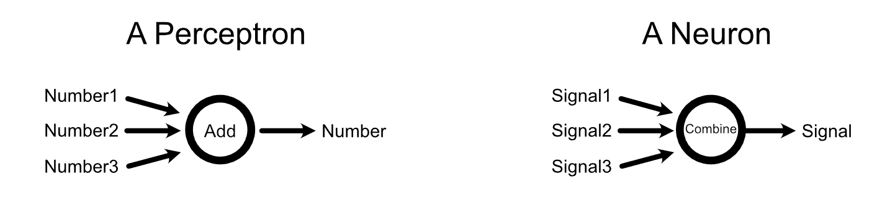

感知器输出数字，而神经元输出电化学信号。

可以将神经网络概念化为由这些感知器组成的大网络，就像大脑是由神经元组成的大网络一样。

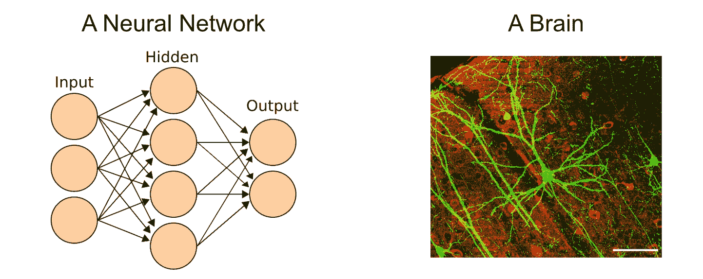

神经网络（左）与大脑（右）。[src1](https://upload.wikimedia.org/wikipedia/commons/thumb/e/e4/Artificial_neural_network.svg/560px-Artificial_neural_network.svg.png) [src2](https://www.google.com/url?sa=i&url=https%3A%2F%2Fcommons.wikimedia.org%2Fwiki%2FNeuron&psig=AOvVaw16zt0cwZKdlPi6mQqgRQLT&ust=1736975287779000&source=images&cd=vfe&opi=89978449&ved=0CBQQjRxqFwoTCNi7sKyP9ooDFQAAAAAdAAAAABAE)

当大脑中的神经元放电时，它以二进制决策的形式放电。或者换句话说，神经元要么放电，要么不放电。另一方面，感知器本身并不“放电”，而是根据感知器的输入输出一系列数字。

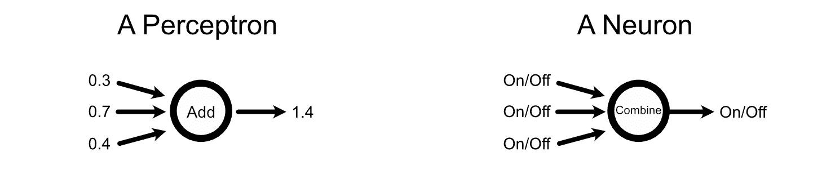

感知器输出一系列连续的数字，而神经元要么放电，要么不放电。

大脑中的神经元可以因其相对简单的二进制输入和输出而幸存，因为思想存在于时间之中。神经元本质上[以不同的速率脉冲](https://www.youtube.com/watch?v=Nxa19uWC_oA)，较慢和较快的脉冲传递不同的信息。

因此，神经元以开或关脉冲的形式具有简单的输入和输出，但它们脉冲的速率可以传递复杂的信息。感知器在每个网络通过中只看到一次输入，但它们的输入和输出可以是一个连续的值范围。如果你熟悉电子学，你可能会对数字信号和模拟信号之间的关系进行反思。

感知器的数学计算实际上非常简单。一个标准的神经网络由连接不同层感知器的一组权重组成。

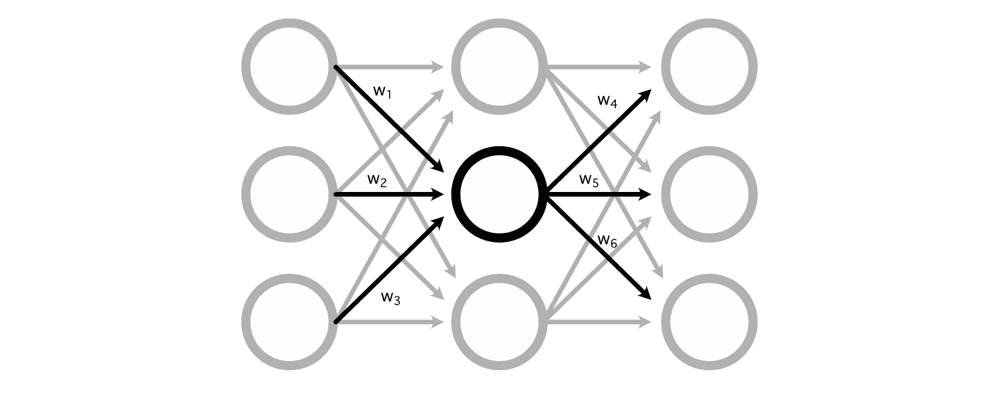

一个神经网络，其中特定感知器的输入和输出权重被突出显示。

你可以通过将所有输入加起来，乘以它们各自的权重来计算特定感知器的值。

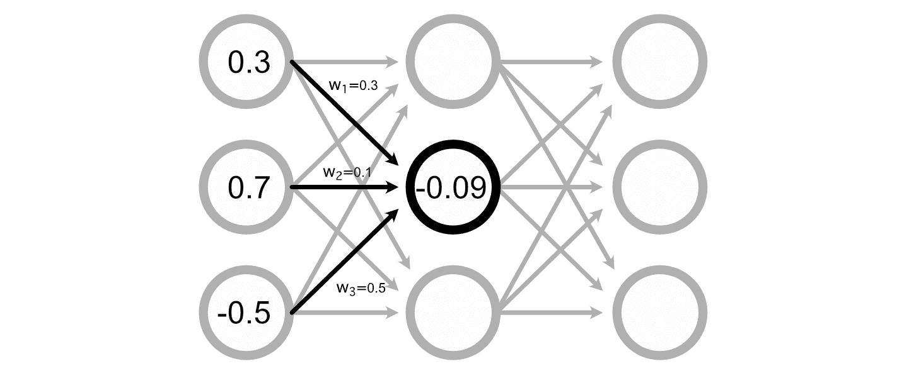

感知器值可能计算的示例。（0.3×0.3）+（0.7×0.1）+（-0.5×0.5）=-0.09

许多神经网络也与每个感知器相关联一个“偏差”，这个偏差被加到输入的总和上，以计算感知器的值。

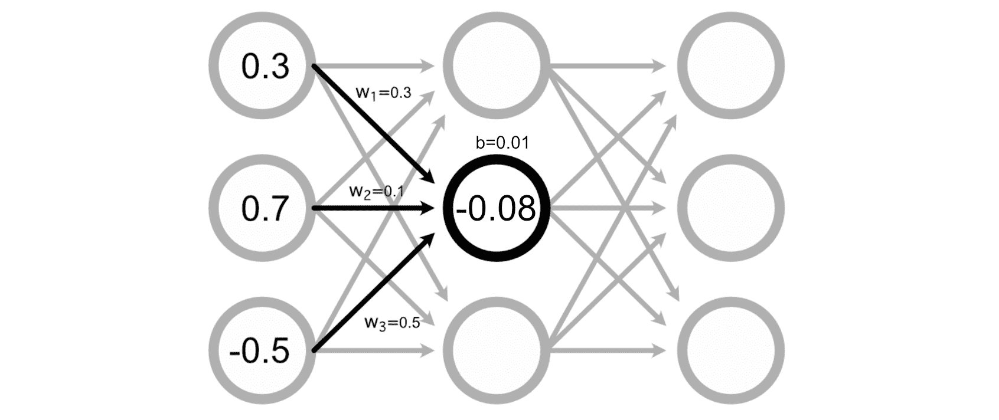

一个例子是，当模型中包含偏差项时，感知器的值可能如何计算。（0.3×0.3）+（0.7×0.1）+（-0.5×0.5）+ 0.01 = -0.08

因此，计算神经网络的输出，实际上就是进行一系列加法和乘法运算，以计算所有感知器的值。

有时数据科学家将这种通用操作称为“线性投影”，因为我们通过线性运算（加法和乘法）将输入映射到输出。这种方法的一个问题是，即使将数十亿个这样的层连接在一起，得到的模型仍然只是输入和输出之间的线性关系，因为所有这些都是加法和乘法。

这是一个严重的问题，因为输入和输出之间的所有关系并不都是线性的。为了解决这个问题，数据科学家采用了一种称为“激活函数”的方法。这些是非线性函数，可以在整个模型中注入，从而在本质上添加一些非线性。

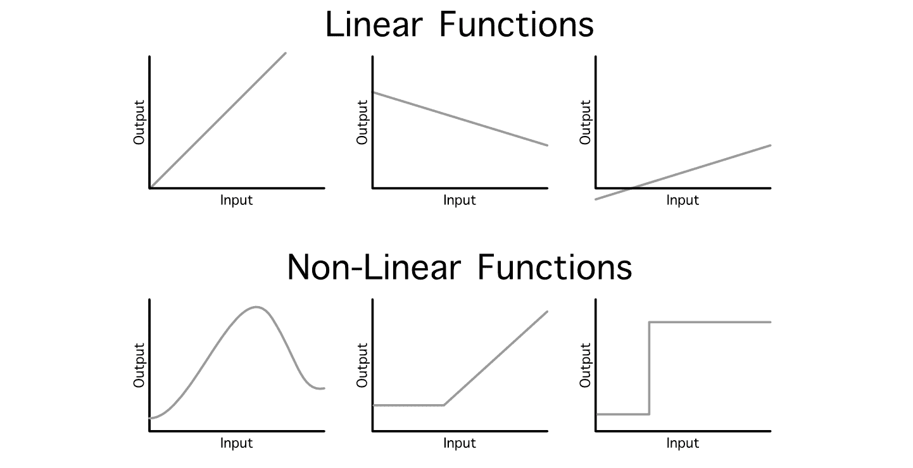

各种函数的示例，给定一些输入，产生一些输出。前三项是线性的，而后三项是非线性的。

通过在线性投影之间交织非线性激活函数，神经网络能够学习非常复杂的函数，

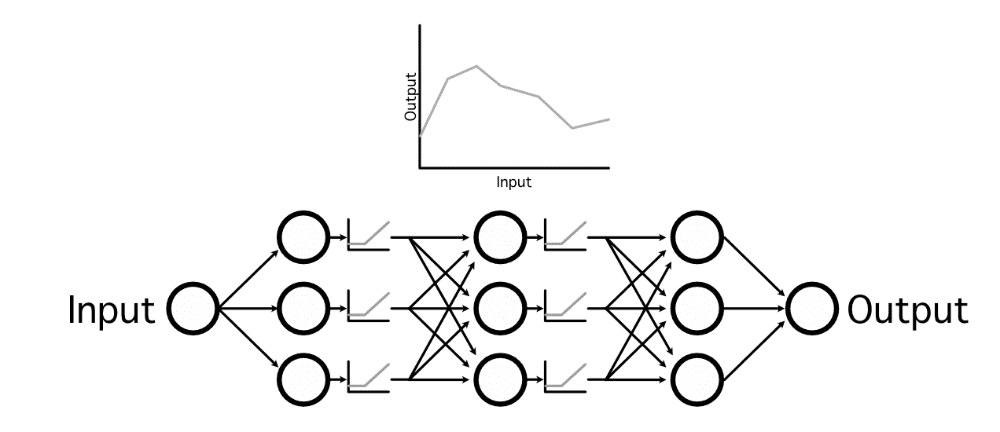

通过在神经网络中放置非线性激活函数，神经网络能够模拟复杂的关系。

在人工智能领域，有许多流行的激活函数，但行业已经大量集中在三种流行的函数上：ReLU、Sigmoid 和 Softmax，它们被用于各种不同的应用。在所有这些函数中，ReLU 由于其简单性和能够泛化以模仿几乎任何其他函数的能力，是最常见的。

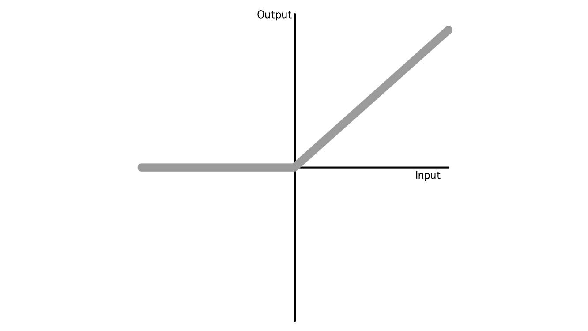

ReLU 激活函数，当输入小于零时输出为零，当输入大于零时输出等于输入。

因此，这就是 AI 模型进行预测的本质。它是一系列加法和乘法运算，其中穿插了一些非线性函数。

神经网络的另一个定义特征是它们可以被训练以更好地解决某个特定问题，我们将在下一节中探讨这一点。

## 反向传播

人工智能的一个基本思想是你可以“训练”一个模型。这是通过让一个神经网络（它最初的生命开始于一大堆随机数据）执行某些任务来完成的。然后，你根据模型输出与已知正确答案的比较来更新模型。

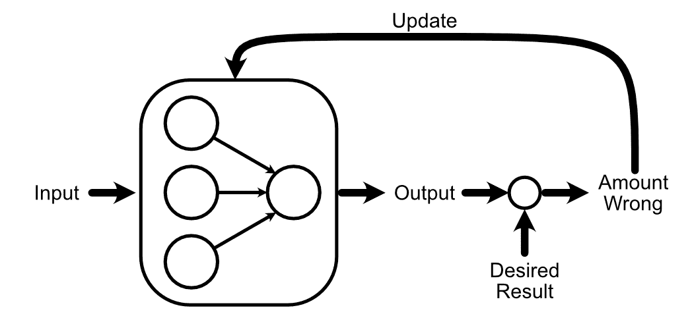

训练神经网络的根本思想。你给它一些数据，其中你知道你想要什么输出，比较神经网络的输出与你的期望结果，然后使用神经网络错误的大小来更新参数，使其更少错误。

对于本节，让我们想象一个具有输入层、隐藏层和输出层的神经网络。

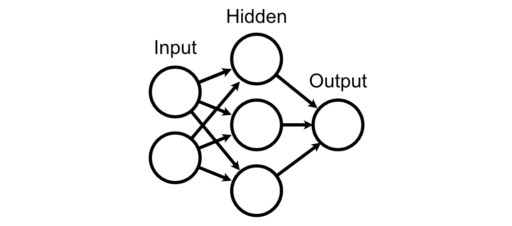

一个具有两个输入和一个输出的神经网络，中间有一个隐藏层，允许模型做出更复杂的预测。

这些每一层都通过最初完全随机的权重连接在一起。

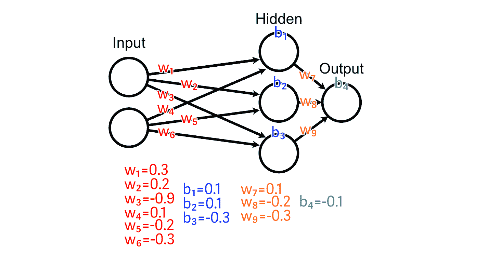

神经网络，具有随机定义的权重和偏差。

我们将在我们的隐藏层上使用 ReLU 激活函数。

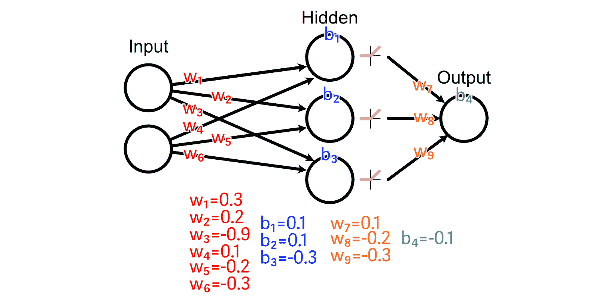

我们将 ReLU 激活函数应用于我们的隐藏感知器的值。

假设我们有一些训练数据，其中期望输出是输入的平均值。

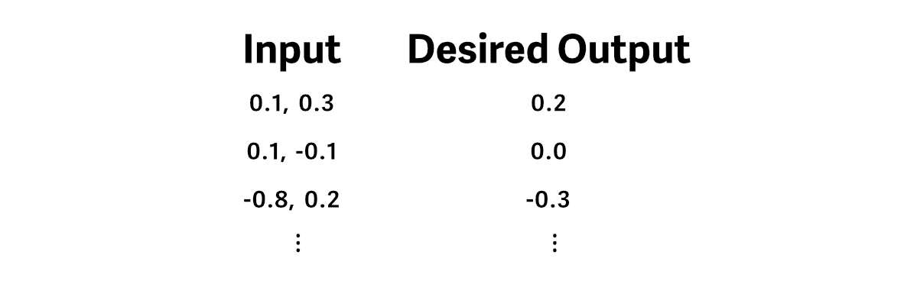

我们将要训练的数据示例。

我们将一个训练数据的示例通过模型传递，生成一个预测。

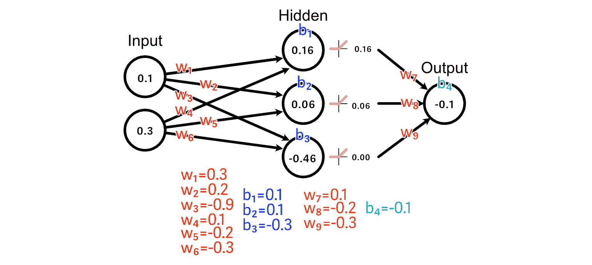

基于输入计算隐藏层和输出的值，包括所有主要中间步骤。

为了使我们的神经网络在计算输入平均值的任务上表现得更好，我们首先将预测输出与我们的期望输出进行比较。

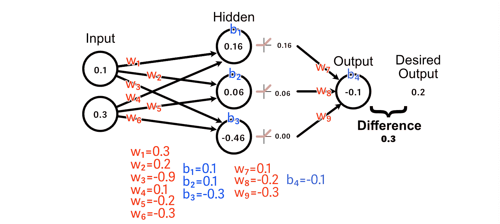

训练数据输入为 0.1 和 0.3，期望输出（输入的平均值）为 0.2。模型的预测值为-0.1。因此，输出与期望输出之间的差异是 0.3。

现在我们知道输出应该增加大小，我们可以回过头来通过模型计算我们的权重和偏差可能如何变化以促进这种变化。

首先，让我们看看直接指向输出的权重：w₇、w₈、w₉。因为第三个隐藏感知器的输出是-0.46，ReLU 的激活是 0.00。

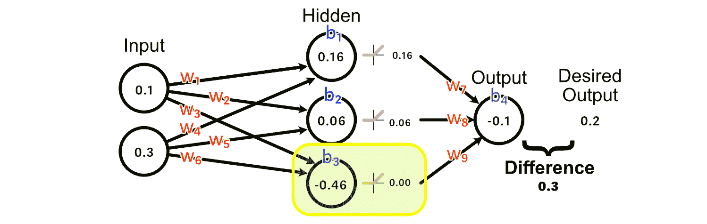

第三感知器的最终激活输出，0.00

因此，w₉的任何值都不会导致我们接近期望输出的变化，因为在特定例子中，w₉的每个值都会导致零的变化。

然而，第二个隐藏神经元确实有一个大于零的激活输出，因此调整 w₈将对本例的输出产生影响。

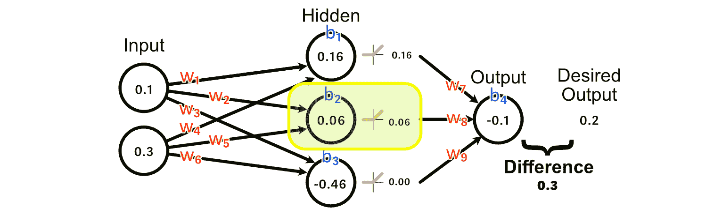

我们实际上计算 w₈应该变化多少的方法是将其应该变化的量乘以 w₈的输入。

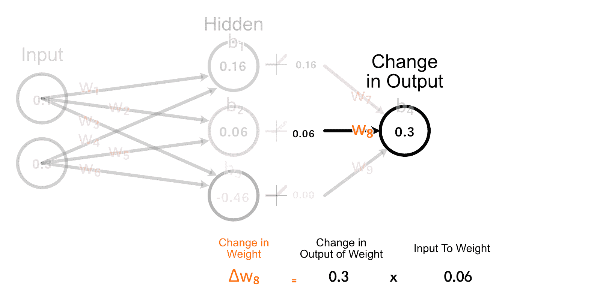

我们如何计算权重应该如何变化。这里符号Δ(Δelta)表示“变化”，所以Δw₈表示 w₈的变化

为什么我们这样做最简单的解释是“因为微积分”，但如果我们看看最后一层中所有权重的更新方式，我们可以形成一个有趣的直觉。

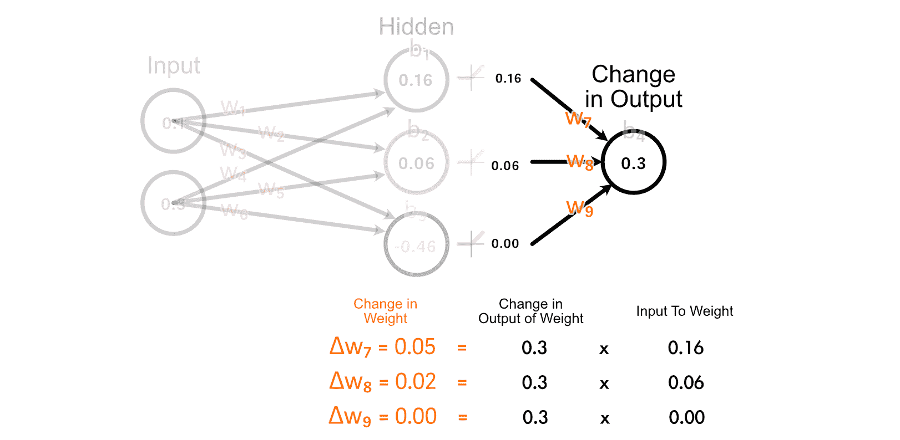

计算指向输出的权重应该如何变化。

注意两个“触发”（输出大于零）的感知器是如何一起更新的。也要注意，一个感知器的输出越强，其对应的权重更新就越多。这在某种程度上类似于人类大脑中“神经元一起触发，一起连接”的概念。

计算输出偏差的变化非常简单。实际上，我们已经在做了。因为偏差是感知器输出应该变化多少，所以偏差的变化就是期望输出的变化。所以，Δb₄=0.3

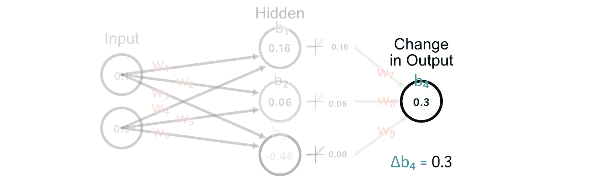

如何更新输出偏差。

现在我们已经计算了输出感知器的权重和偏差应该如何改变，我们可以“反向传播”我们期望的输出变化通过模型。让我们从反向传播开始，这样我们可以计算我们应该如何更新 w₁。

首先，我们计算第一个隐藏神经元的激活输出应该如何改变。我们通过将输出变化乘以 w₇来实现这一点。

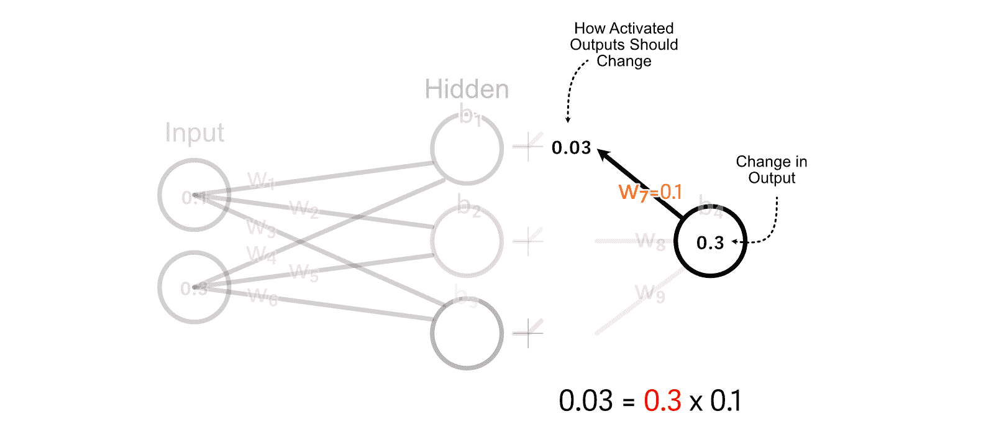

通过将期望的输出变化乘以 w₇来计算第一个隐藏神经元的激活输出应该如何改变。

对于大于零的值，ReLU 只是将这些值乘以 1。因此，在这个例子中，我们想要改变的第一个隐藏神经元的未激活值等于激活输出中期望的改变

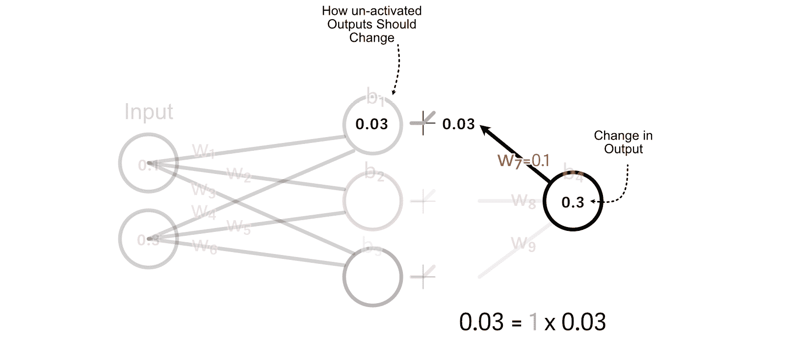

我们想要根据从输出反向传播的结果来改变第一个隐藏感知器的未激活值

回想一下，我们计算了如何通过将其输入乘以期望输出的变化来更新 w₇。我们可以用同样的方法来计算 w₁的变化。

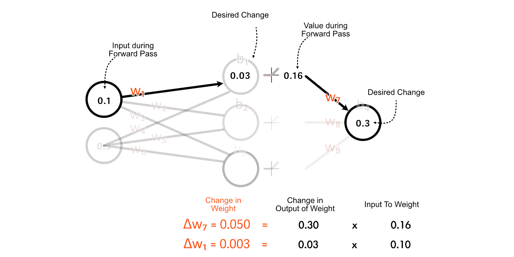

现在我们已经计算了第一个隐藏神经元应该如何改变，我们可以像之前计算 w₇应该如何更新一样计算我们应该如何更新 w₁。

重要的是要注意，在整个过程中，我们实际上并没有更新任何权重或偏差。相反，我们正在记录我们应该如何更新每个参数，假设没有其他参数被更新。

因此，我们可以进行这些计算来计算所有参数的变化。

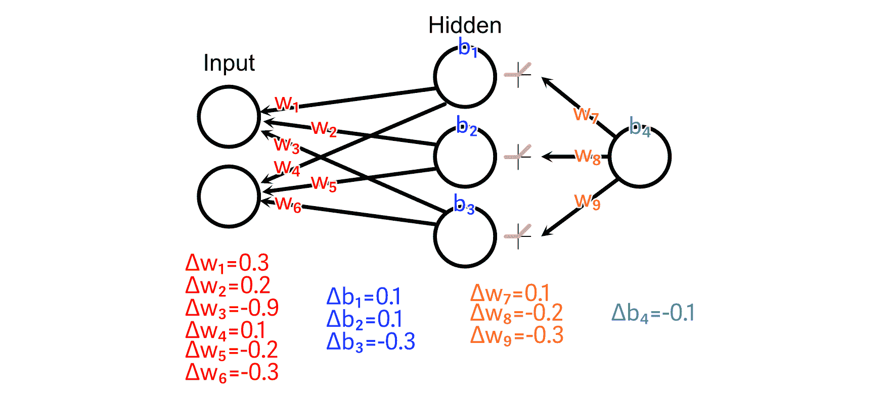

通过在模型的各个点使用前向传递的值和反向传递的期望变化值的组合来通过模型反向传播，我们可以计算所有参数应该如何改变

反向传播的一个基本思想被称为“学习率”，它关注的是我们根据特定批次的数据对神经网络所做的变化的大小。为了解释为什么这很重要，我想用一个类比来说明。

想象有一天你出去，看到戴帽子的每个人都给你一个滑稽的表情。你可能不想得出“戴帽子 = 滑稽表情”的结论，但你可能会对戴帽子的人有点怀疑。经过三天、四天、五天，一个月甚至一年，如果大多数戴帽子的人都给你一个滑稽的表情，你可能会开始考虑这是一个强烈的趋势。

同样，当我们训练一个神经网络时，我们不想根据单个训练示例完全改变神经网络的想法。相反，我们希望每个批次只逐步改变模型的想法。当我们向模型展示许多示例时，我们希望模型能够学习数据中的重要趋势。

在我们计算出每个参数应该如何变化，就像它是唯一被更新的参数一样之后，我们可以在应用这些变化到参数之前，将这些变化乘以一个很小的数，比如`0.001`。这个小的数通常被称为“学习率”，它应该有的确切值取决于我们正在训练的模型。这实际上在我们将调整应用到模型之前缩小了我们的调整幅度。

到目前为止，我们已经涵盖了实现神经网络所需了解的几乎所有内容。让我们试一试！


[加入 IAEE](https://iaee.substack.com/)

## 从零开始实现神经网络

通常，数据科学家会使用像`PyTorch`这样的库，用几行代码实现神经网络，但我们将从零开始使用 NumPy，一个数值计算库来定义神经网络。

首先，让我们从定义神经网络结构的方法开始。

```py
"""Blocking out the structure of the Neural Network
"""

import numpy as np

class SimpleNN:
    def __init__(self, architecture):
        self.architecture = architecture
        self.weights = []
        self.biases = []

        # Initialize weights and biases
        np.random.seed(99)
        for i in range(len(architecture) - 1):
            self.weights.append(np.random.uniform(
                low=-1, high=1,
                size=(architecture[i], architecture[i+1])
            ))
            self.biases.append(np.zeros((1, architecture[i+1])))

architecture = [2, 64, 64, 64, 1]  # Two inputs, two hidden layers, one output
model = SimpleNN(architecture)

print('weight dimensions:')
for w in model.weights:
    print(w.shape)

print('nbias dimensions:')
for b in model.biases:
    print(b.shape)
```

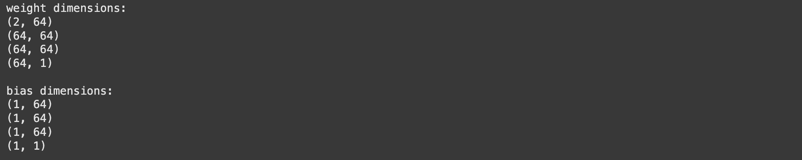

在样本神经网络中定义的权重和偏差矩阵。

虽然我们通常将神经网络绘制成一个密集的网络，但在现实中，我们用矩阵表示它们之间的权重。这是因为矩阵乘法相当于通过神经网络传递数据，这很方便。

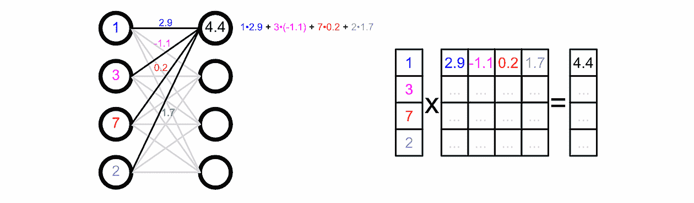

将密集网络视为左侧的加权连接，右侧的矩阵乘法。在右侧的图中，左侧的向量是输入，中间的矩阵是权重矩阵，右侧的向量是输出。为了可读性，只包含了一部分值。参见我关于[LoRA](https://medium.com/towards-data-science/lora-intuitively-and-exhaustively-explained-e944a6bff46b)的文章。

我们可以通过将输入通过每一层来使我们的模型根据一些输入做出预测。

```py
"""Implementing the Forward Pass
"""

import numpy as np

class SimpleNN:
    def __init__(self, architecture):
        self.architecture = architecture
        self.weights = []
        self.biases = []

        # Initialize weights and biases
        np.random.seed(99)
        for i in range(len(architecture) - 1):
            self.weights.append(np.random.uniform(
                low=-1, high=1,
                size=(architecture[i], architecture[i+1])
            ))
            self.biases.append(np.zeros((1, architecture[i+1])))

    @staticmethod
    def relu(x):
        #implementing the relu activation function
        return np.maximum(0, x)

    def forward(self, X):
        #iterating through all layers
        for W, b in zip(self.weights, self.biases):

            #applying the weight and bias of the layer
            X = np.dot(X, W) + b

            #doing ReLU for all but the last layer
            if W is not self.weights[-1]:
                X = self.relu(X)

        #returning the result
        return X

    def predict(self, X):
        y = self.forward(X)
        return y.flatten()

#defining a model
architecture = [2, 64, 64, 64, 1]  # Two inputs, two hidden layers, one output
model = SimpleNN(architecture)

# Generate predictions
prediction = model.predict(np.array([0.1,0.2]))
print(prediction)
```

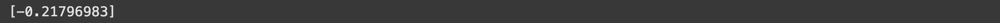

将我们的数据通过模型后的结果。我们的模型是随机定义的，所以这不是一个有用的预测，但它证实了模型正在工作。

我们需要能够训练这个模型，为此我们首先需要一个用于训练模型的问题。我定义了一个随机函数，它接受两个输入并产生一个输出：

```py
"""Defining what we want the model to learn
"""
import numpy as np
import matplotlib.pyplot as plt

# Define a random function with two inputs
def random_function(x, y):
    return (np.sin(x) + x * np.cos(y) + y + 3**(x/3))

# Generate a grid of x and y values
x = np.linspace(-10, 10, 100)
y = np.linspace(-10, 10, 100)
X, Y = np.meshgrid(x, y)

# Compute the output of the random function
Z = random_function(X, Y)

# Create a 2D plot
plt.figure(figsize=(8, 6))
contour = plt.contourf(X, Y, Z, cmap='viridis')
plt.colorbar(contour, label='Function Value')
plt.title('2D Plot of Objective Function')
plt.xlabel('X-axis')
plt.ylabel('Y-axis')
plt.show()
```

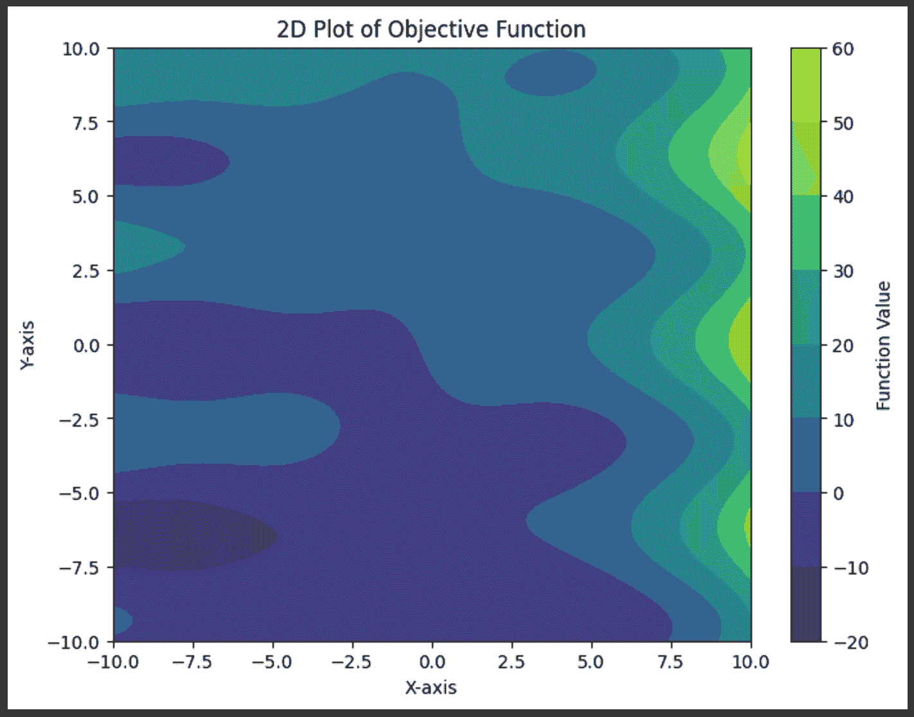

建模目标。给定两个输入（在此图中表示为 x 和 y），模型需要预测一个输出（在此图中表示为颜色）。这是一个完全随机的函数

在现实世界中，我们不会知道底层函数。我们可以通过创建一个由随机点组成的数据集来模拟这种现实：

```py
import numpy as np
import pandas as pd
import matplotlib.pyplot as plt

# Define a random function with two inputs
def random_function(x, y):
    return (np.sin(x) + x * np.cos(y) + y + 3**(x/3))

# Define the number of random samples to generate
n_samples = 1000

# Generate random X and Y values within a specified range
x_min, x_max = -10, 10
y_min, y_max = -10, 10

# Generate random values for X and Y
X_random = np.random.uniform(x_min, x_max, n_samples)
Y_random = np.random.uniform(y_min, y_max, n_samples)

# Evaluate the random function at the generated X and Y values
Z_random = random_function(X_random, Y_random)

# Create a dataset
dataset = pd.DataFrame({
    'X': X_random,
    'Y': Y_random,
    'Z': Z_random
})

# Display the dataset
print(dataset.head())

# Create a 2D scatter plot of the sampled data
plt.figure(figsize=(8, 6))
scatter = plt.scatter(dataset['X'], dataset['Y'], c=dataset['Z'], cmap='viridis', s=10)
plt.colorbar(scatter, label='Function Value')
plt.title('Scatter Plot of Randomly Sampled Data')
plt.xlabel('X-axis')
plt.ylabel('Y-axis')
plt.show()
```

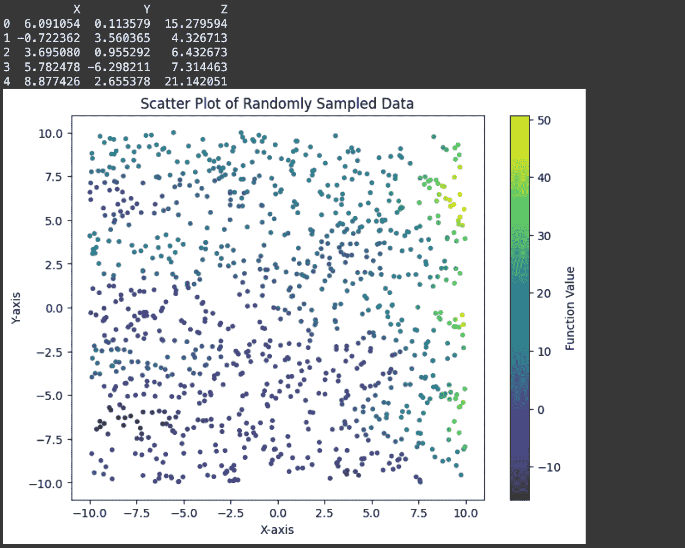

这是我们将在上面训练以尝试学习我们的函数的数据。

回想一下，反向传播算法根据前向传递中发生的情况更新参数。因此，在我们实现反向传播本身之前，让我们记录前向传递中的一些重要值：模型中每个感知器的输入和输出。

```py
import numpy as np

class SimpleNN:
    def __init__(self, architecture):
        self.architecture = architecture
        self.weights = []
        self.biases = []

        #keeping track of these values in this code block
        #so we can observe them
        self.perceptron_inputs = None
        self.perceptron_outputs = None

        # Initialize weights and biases
        np.random.seed(99)
        for i in range(len(architecture) - 1):
            self.weights.append(np.random.uniform(
                low=-1, high=1,
                size=(architecture[i], architecture[i+1])
            ))
            self.biases.append(np.zeros((1, architecture[i+1])))

    @staticmethod
    def relu(x):
        return np.maximum(0, x)

    def forward(self, X):
        self.perceptron_inputs = [X]
        self.perceptron_outputs = []

        for W, b in zip(self.weights, self.biases):
            Z = np.dot(self.perceptron_inputs[-1], W) + b
            self.perceptron_outputs.append(Z)

            if W is self.weights[-1]:  # Last layer (output)
                A = Z  # Linear output for regression
            else:
                A = self.relu(Z)
            self.perceptron_inputs.append(A)

        return self.perceptron_inputs, self.perceptron_outputs

    def predict(self, X):
        perceptron_inputs, _ = self.forward(X)
        return perceptron_inputs[-1].flatten()

#defining a model
architecture = [2, 64, 64, 64, 1]  # Two inputs, two hidden layers, one output
model = SimpleNN(architecture)

# Generate predictions
prediction = model.predict(np.array([0.1,0.2]))

#looking through critical optimization values
for i, (inpt, outpt) in enumerate(zip(model.perceptron_inputs, model.perceptron_outputs[:-1])):
    print(f'layer {i}')
    print(f'input: {inpt.shape}')
    print(f'output: {outpt.shape}')
    print('')

print('Final Output:')
print(model.perceptron_outputs[-1].shape)
```

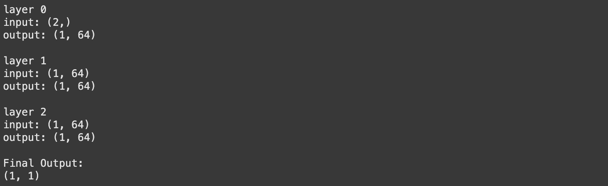

前向传递后，模型各层的值。这将使我们能够计算更新模型所需的必要变化。

现在我们已经记录了网络中关键中间值，我们可以使用这些值，以及模型对特定预测的错误，来计算我们应该对模型做出的更改。

```py
import numpy as np

class SimpleNN:
    def __init__(self, architecture):
        self.architecture = architecture
        self.weights = []
        self.biases = []

        # Initialize weights and biases
        np.random.seed(99)
        for i in range(len(architecture) - 1):
            self.weights.append(np.random.uniform(
                low=-1, high=1,
                size=(architecture[i], architecture[i+1])
            ))
            self.biases.append(np.zeros((1, architecture[i+1])))

    @staticmethod
    def relu(x):
        return np.maximum(0, x)

    @staticmethod
    def relu_as_weights(x):
        return (x > 0).astype(float)

    def forward(self, X):
        perceptron_inputs = [X]
        perceptron_outputs = []

        for W, b in zip(self.weights, self.biases):
            Z = np.dot(perceptron_inputs[-1], W) + b
            perceptron_outputs.append(Z)

            if W is self.weights[-1]:  # Last layer (output)
                A = Z  # Linear output for regression
            else:
                A = self.relu(Z)
            perceptron_inputs.append(A)

        return perceptron_inputs, perceptron_outputs

    def backward(self, perceptron_inputs, perceptron_outputs, target):
        weight_changes = []
        bias_changes = []

        m = len(target)
        dA = perceptron_inputs[-1] - target.reshape(-1, 1)  # Output layer gradient

        for i in reversed(range(len(self.weights))):
            dZ = dA if i == len(self.weights) - 1 else dA * self.relu_as_weights(perceptron_outputs[i])
            dW = np.dot(perceptron_inputs[i].T, dZ) / m
            db = np.sum(dZ, axis=0, keepdims=True) / m
            weight_changes.append(dW)
            bias_changes.append(db)

            if i > 0:
                dA = np.dot(dZ, self.weights[i].T)

        return list(reversed(weight_changes)), list(reversed(bias_changes))

    def predict(self, X):
        perceptron_inputs, _ = self.forward(X)
        return perceptron_inputs[-1].flatten()

#defining a model
architecture = [2, 64, 64, 64, 1]  # Two inputs, two hidden layers, one output
model = SimpleNN(architecture)

#defining a sample input and target output
input = np.array([[0.1,0.2]])
desired_output = np.array([0.5])

#doing forward and backward pass to calculate changes
perceptron_inputs, perceptron_outputs = model.forward(input)
weight_changes, bias_changes = model.backward(perceptron_inputs, perceptron_outputs, desired_output)

#smaller numbers for printing
np.set_printoptions(precision=2)

for i, (layer_weights, layer_biases, layer_weight_changes, layer_bias_changes)
in enumerate(zip(model.weights, model.biases, weight_changes, bias_changes)):
    print(f'layer {i}')
    print(f'weight matrix: {layer_weights.shape}')
    print(f'weight matrix changes: {layer_weight_changes.shape}')
    print(f'bias matrix: {layer_biases.shape}')
    print(f'bias matrix changes: {layer_bias_changes.shape}')
    print('')

print('The weight and weight change matrix of the second layer:')
print('weight matrix:')
print(model.weights[1])
print('change matrix:')
print(weight_changes[1])
```

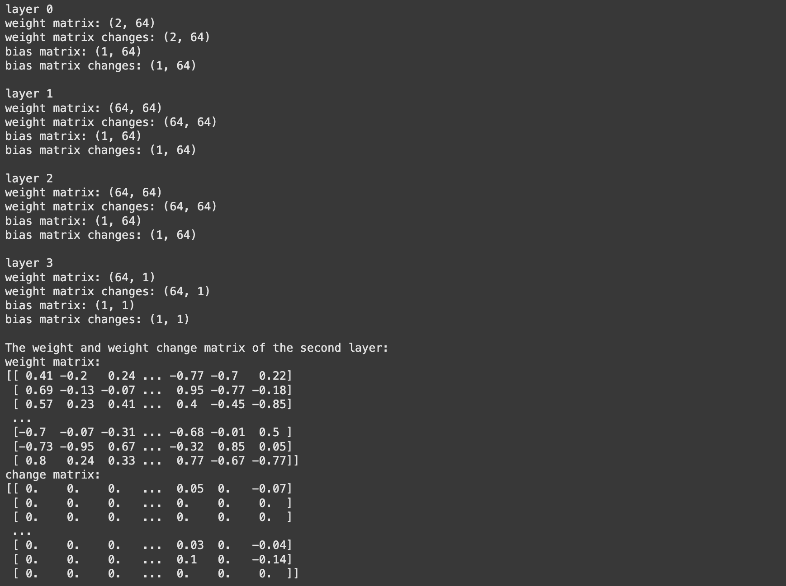

这可能是最复杂的实现步骤，所以我想要花点时间深入探讨一些细节。基本思想与我们之前章节中描述的完全一样。我们正在从前向后迭代所有层，计算每个权重和偏差的变化，以产生更好的输出。

```py
# calculating output error
dA = perceptron_inputs[-1] - target.reshape(-1, 1)

#a scaling factor for the batch size.
#you want changes to be an average across all batches
#so we divide by m once we've aggregated all changes.
m = len(target)

for i in reversed(range(len(self.weights))):
  dZ = dA #simplified for now

  # calculating change to weights
  dW = np.dot(perceptron_inputs[i].T, dZ) / m
  # calculating change to bias
  db = np.sum(dZ, axis=0, keepdims=True) / m

  # keeping track of required changes
  weight_changes.append(dW)
  bias_changes.append(db)
  ...
```

计算偏差的变化相当直接。如果你看看一个给定神经元的输出应该如何影响所有未来的神经元，你可以将这些值（既有正数也有负数）加起来，以了解神经元应该向正方向还是负方向偏置。

我们通过矩阵乘法计算权重变化的方式在数学上稍微复杂一些。

```py
dW = np.dot(perceptron_inputs[i].T, dZ) / m
```

事实上，这一行表示权重的变化应该等于进入感知器的值，乘以输出应该变化的程度。如果一个感知器有大的输入，其输出的权重变化应该是一个大的幅度；如果一个感知器有小的输入，其输出的权重变化将很小。此外，如果一个权重指向应该有很大变化的输出，那么这个权重应该有很大的变化。

我们在反向传播实现中还应讨论另一行。

```py
dZ = dA if i == len(self.weights) - 1 else dA * self.relu_as_weights(perceptron_outputs[i])
```

在这个特定的网络中，除了最终的输出之外，整个网络中都有激活函数。当我们进行反向传播时，我们需要通过这些激活函数进行反向传播，以便我们可以更新它们之前的神经元。我们只对除了最后一层之外的所有层这样做，因为最后一层没有激活函数，这就是为什么 `dZ = dA if i == len(self.weights) - 1` 的原因。

在复杂的数学术语中，我们会称之为导数，但因为我不想涉及微积分，所以我将这个函数称为 `relu_as_weights`。基本上，我们可以将我们的每个 ReLU 激活视为一个类似的小型神经网络，其权重是输入的函数。如果 ReLU 激活函数的输入小于零，那么就像通过一个权重为零的神经网络传递那个输入一样。如果 ReLU 的输入大于零，那么就像通过一个权重为之一的神经网络传递输入一样。


回忆 ReLU 激活函数。

这正是 `relu_as_weights` 函数所做的事情。

```py
def relu_as_weights(x):
        return (x > 0).astype(float)
```

使用这个逻辑，我们可以将 ReLU 的反向传播处理得就像我们在整个神经网络中的反向传播一样。

再次，我很快会从更稳健的数学角度来介绍这个概念，但这是从概念角度的基本想法。

现在我们已经实现了前向和反向传播，我们可以实现模型的训练。

```py
import numpy as np

class SimpleNN:
    def __init__(self, architecture):
        self.architecture = architecture
        self.weights = []
        self.biases = []

        # Initialize weights and biases
        np.random.seed(99)
        for i in range(len(architecture) - 1):
            self.weights.append(np.random.uniform(
                low=-1, high=1,
                size=(architecture[i], architecture[i+1])
            ))
            self.biases.append(np.zeros((1, architecture[i+1])))

    @staticmethod
    def relu(x):
        return np.maximum(0, x)

    @staticmethod
    def relu_as_weights(x):
        return (x > 0).astype(float)

    def forward(self, X):
        perceptron_inputs = [X]
        perceptron_outputs = []

        for W, b in zip(self.weights, self.biases):
            Z = np.dot(perceptron_inputs[-1], W) + b
            perceptron_outputs.append(Z)

            if W is self.weights[-1]:  # Last layer (output)
                A = Z  # Linear output for regression
            else:
                A = self.relu(Z)
            perceptron_inputs.append(A)

        return perceptron_inputs, perceptron_outputs

    def backward(self, perceptron_inputs, perceptron_outputs, y_true):
        weight_changes = []
        bias_changes = []

        m = len(y_true)
        dA = perceptron_inputs[-1] - y_true.reshape(-1, 1)  # Output layer gradient

        for i in reversed(range(len(self.weights))):
            dZ = dA if i == len(self.weights) - 1 else dA * self.relu_as_weights(perceptron_outputs[i])
            dW = np.dot(perceptron_inputs[i].T, dZ) / m
            db = np.sum(dZ, axis=0, keepdims=True) / m
            weight_changes.append(dW)
            bias_changes.append(db)

            if i > 0:
                dA = np.dot(dZ, self.weights[i].T)

        return list(reversed(weight_changes)), list(reversed(bias_changes))

    def update_weights(self, weight_changes, bias_changes, lr):
        for i in range(len(self.weights)):
            self.weights[i] -= lr * weight_changes[i]
            self.biases[i] -= lr * bias_changes[i]

    def train(self, X, y, epochs, lr=0.01):
        for epoch in range(epochs):
            perceptron_inputs, perceptron_outputs = self.forward(X)
            weight_changes, bias_changes = self.backward(perceptron_inputs, perceptron_outputs, y)
            self.update_weights(weight_changes, bias_changes, lr)

            if epoch % 20 == 0 or epoch == epochs - 1:
                loss = np.mean((perceptron_inputs[-1].flatten() - y) ** 2)  # MSE
                print(f"EPOCH {epoch}: Loss = {loss:.4f}")

    def predict(self, X):
        perceptron_inputs, _ = self.forward(X)
        return perceptron_inputs[-1].flatten()
```

`train` 函数：

+   遍历所有数据若干次（由 `epoch` 定义）

+   通过前向传播传递数据

+   计算权重和偏差应该如何变化

+   通过按学习率（`lr`）缩放它们的改变来更新权重和偏差

因此，我们已经实现了一个神经网络！让我们来训练它。

## 训练和评估神经网络。

回想一下，我们定义了一个任意的二维函数，我们想要学习如何模拟，


我们用一些点采样了这个空间，这些点被用来训练模型。

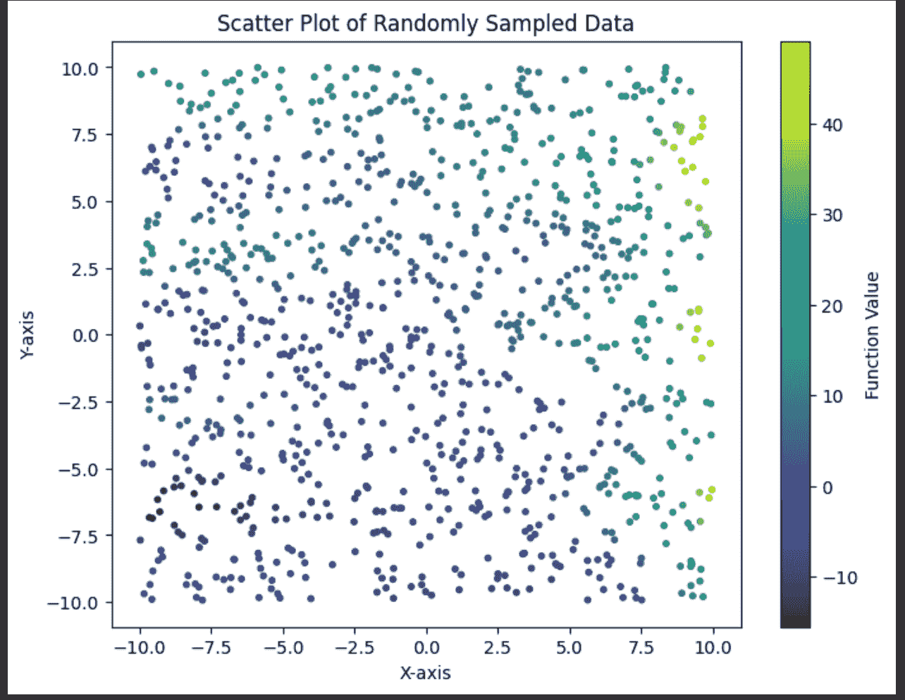

在将此数据输入我们的模型之前，我们首先“归一化”数据至关重要。数据集的某些值非常小或非常大，这可能会使训练神经网络变得非常困难。神经网络中的值可以迅速增长到荒谬的大值，或者减少到零，这可能会阻碍训练。归一化将我们所有的输入和期望的输出压缩到一个更合理的范围，平均值为零，具有称为“正态”分布的标准分布。

```py
# Flatten the data
X_flat = X.flatten()
Y_flat = Y.flatten()
Z_flat = Z.flatten()

# Stack X and Y as input features
inputs = np.column_stack((X_flat, Y_flat))
outputs = Z_flat

# Normalize the inputs and outputs
inputs_mean = np.mean(inputs, axis=0)
inputs_std = np.std(inputs, axis=0)
outputs_mean = np.mean(outputs)
outputs_std = np.std(outputs)

inputs = (inputs - inputs_mean) / inputs_std
outputs = (outputs - outputs_mean) / outputs_std
```

如果我们想要从原始数据集的实际数据范围内获取预测，我们可以使用这些值来基本上“解压”数据。

一旦我们做到了这一点，我们就可以定义并训练我们的模型。

```py
# Define the architecture: [input_dim, hidden1, ..., output_dim]
architecture = [2, 64, 64, 64, 1]  # Two inputs, two hidden layers, one output
model = SimpleNN(architecture)

# Train the model
model.train(inputs, outputs, epochs=2000, lr=0.001)
```

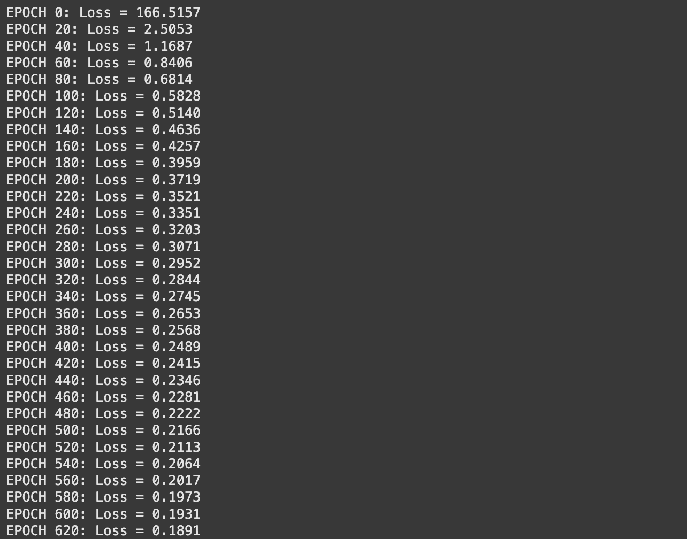

如图所示，损失值持续下降，表明模型正在改进。

然后，我们可以可视化神经网络预测的输出与实际函数的输出。

```py
import matplotlib.pyplot as plt

# Reshape predictions to grid format for visualization
Z_pred = model.predict(inputs) * outputs_std + outputs_mean
Z_pred = Z_pred.reshape(X.shape)

# Plot comparison of the true function and the model predictions
fig, axes = plt.subplots(1, 2, figsize=(14, 6))

# Plot the true function
axes[0].contourf(X, Y, Z, cmap='viridis')
axes[0].set_title("True Function")
axes[0].set_xlabel("X-axis")
axes[0].set_ylabel("Y-axis")
axes[0].colorbar = plt.colorbar(axes[0].contourf(X, Y, Z, cmap='viridis'), ax=axes[0], label="Function Value")

# Plot the predicted function
axes[1].contourf(X, Y, Z_pred, cmap='plasma')
axes[1].set_title("NN Predicted Function")
axes[1].set_xlabel("X-axis")
axes[1].set_ylabel("Y-axis")
axes[1].colorbar = plt.colorbar(axes[1].contourf(X, Y, Z_pred, cmap='plasma'), ax=axes[1], label="Function Value")

plt.tight_layout()
plt.show()
```

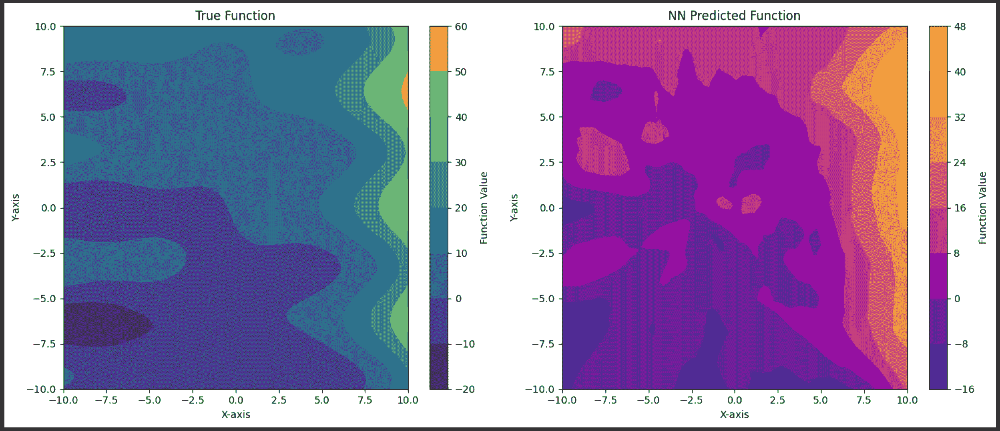

这做得还不错，但并没有我们期望的那么好。这就是许多数据科学家花费大量时间的地方，有许多方法可以使神经网络更好地适应特定问题。一些明显的方法包括：

+   使用更多数据

+   尝试调整学习率

+   进行更多 epoch 的训练

+   改变模型的架构

对于我们来说，增加训练数据量非常容易。让我们看看这会带我们到哪。在这里，我正在对数据集进行 10,000 次采样，这比我们之前的数据集多 10 倍的训练样本。

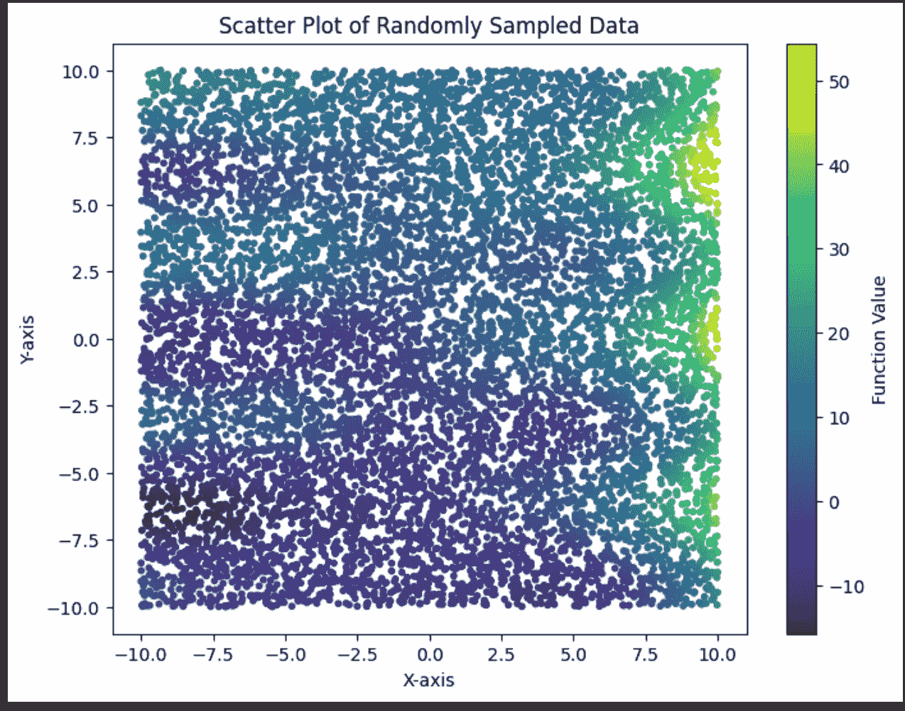

然后我像之前一样训练了模型，但这次花费的时间更长，因为每个 epoch 现在分析的是 10,000 个样本，而不是 1,000 个。

```py
# Define the architecture: [input_dim, hidden1, ..., output_dim]
architecture = [2, 64, 64, 64, 1]  # Two inputs, two hidden layers, one output
model = SimpleNN(architecture)

# Train the model
model.train(inputs, outputs, epochs=2000, lr=0.001)
```

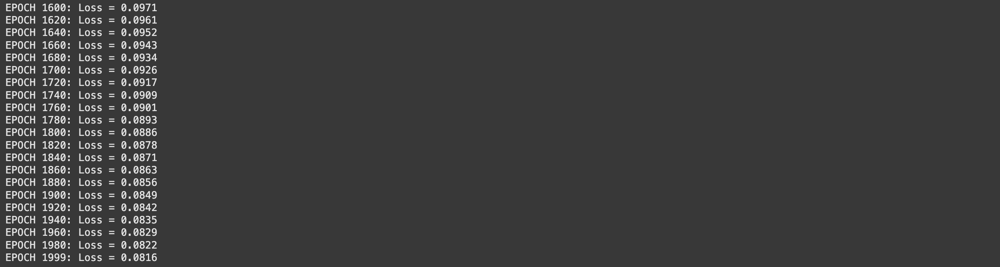

我然后以同样的方式渲染了这个模型的输出，但输出并没有看起来有太大的改进。

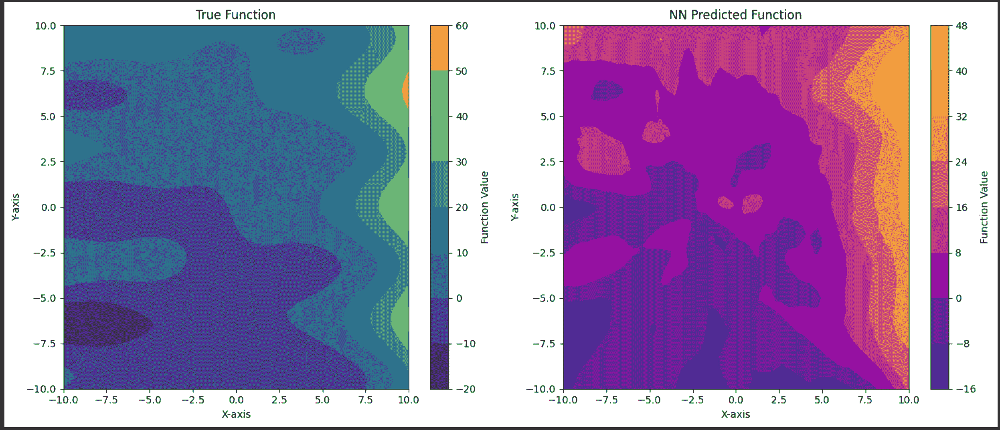

回顾训练中的损失输出，损失似乎仍在稳步下降。也许我只需要训练更长的时间。让我们试试。

```py
# Define the architecture: [input_dim, hidden1, ..., output_dim]
architecture = [2, 64, 64, 64, 1]  # Two inputs, two hidden layers, one output
model = SimpleNN(architecture)

# Train the model
model.train(inputs, outputs, epochs=4000, lr=0.001)
```

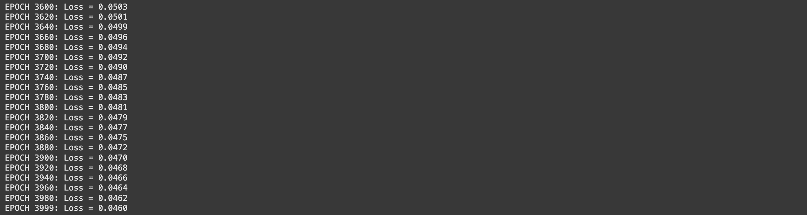

结果似乎好一些，但并不令人惊叹。

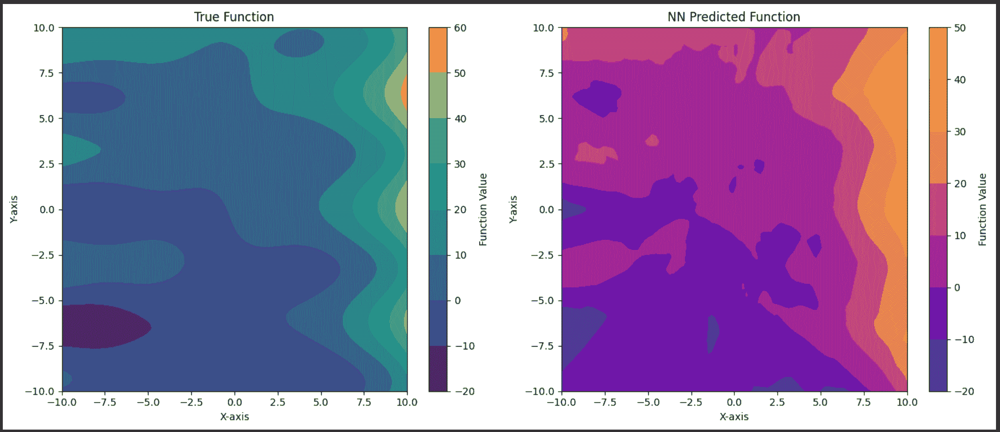

我不会详细说明。我运行了这个程序几次，得到了一些不错的结果，但从未达到完全一致。在未来的文章中，我将介绍数据科学家使用的更多高级方法，如退火和 dropout，这将导致更一致和更好的输出。尽管如此，我们还是从头开始构建了一个神经网络，并训练它做某件事，它做得相当不错！非常酷！

## 结论

在这篇文章中，我们像躲避瘟疫一样避开了微积分，同时锻造了对神经网络的理解。我们探讨了其理论，一点关于数学的内容，反向传播的概念，然后从头开始实现了一个神经网络。然后我们将神经网络应用于一个玩具问题，并探讨了数据科学家实际训练神经网络以擅长某些事情所采用的一些简单想法。

在未来的文章中，我们将探讨神经网络的一些更高级的方法，所以请保持关注！目前，你可能对梯度的更深入分析感兴趣，这是反向传播背后的基本数学。

> [**什么是梯度，为什么它们会爆炸？**](https://towardsdatascience.com/what-are-gradients-and-why-do-they-explode-add23264d24b)

你可能还对这篇文章感兴趣，它涵盖了使用更传统的数据科学工具如 PyTorch 训练神经网络的内容。

> [**AI 初学者指南 – 直观且全面解释**](https://towardsdatascience.com/ai-for-the-absolute-novice-intuitively-and-exhaustively-explained-7b353a31e6d7)

## 加入直观且全面解释

在 IAEE，你可以找到：

+   长篇内容，就像你刚刚读到的文章

+   一些最前沿人工智能主题的概念性分解

+   人工智能中关键数学操作的亲手演示

+   实践教程和解释


[加入 IAEE](https://iaee.substack.com/)
