# 新手学习 LLMs？从这里开始

> 原文：[`towardsdatascience.com/new-to-llms-start-here/`](https://towardsdatascience.com/new-to-llms-start-here/)

<mdspan datatext="el1748029776082" class="mdspan-comment">面对网络上所有这些内容开始学习 LLMs 可能会感到压倒性，每天都有新事物出现。我阅读了一些来自 Google、OpenAI 和 Anthropic 的指南，并注意到每个指南都侧重于代理和 LLMs 的不同方面。因此，我决定在这里整合这些概念，并添加我认为对于刚开始研究这个领域的人来说非常重要的其他重要想法。*

这篇文章通过代码示例涵盖了关键概念，使内容具体化。我已经准备了一个 [Google Colab 笔记本](https://colab.research.google.com/drive/1AbILWfbZon0I5qKc6hToAURXG7JhErto#scrollTo=cyChoAaliW9Z)，其中包含所有示例，以便您在阅读文章时应用代码。要使用它，您需要一个 API 密钥——如果您不知道如何获取，请参阅我之前的文章的第五部分 [逐步指南：在 Streamlit 中构建和部署具有记忆功能的 LLM 驱动的聊天](https://towardsdatascience.com/step-by-step-guide-to-build-and-deploy-an-llm-powered-chat-with-memory-in-streamlit/)。

虽然这个指南提供了基本内容，但我建议您阅读这些公司的完整文章，以加深您的理解。

我希望这能帮助您在开始 LLMs 之旅时打下坚实的基础！

在这个思维导图中，您可以查看本文内容的摘要。

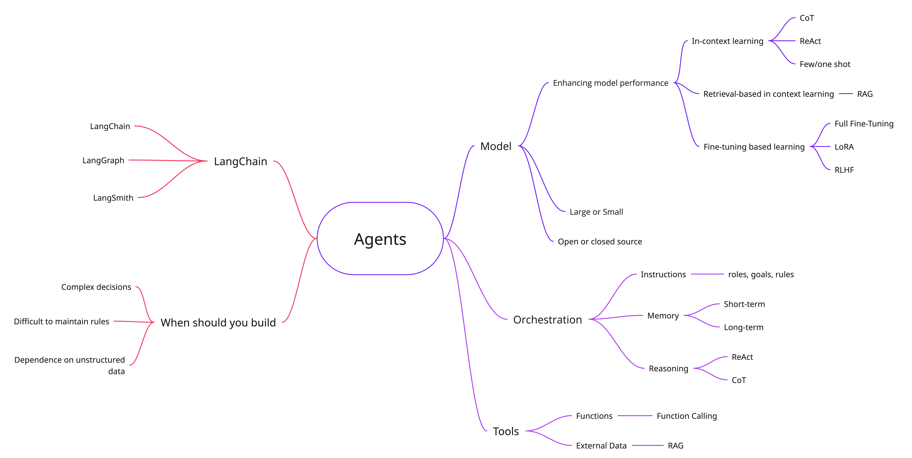

图片由作者提供

## 什么是代理？

“代理”可以有多种定义。我阅读的每个公司的指南对代理的定义都不同。让我们来检查这些定义并进行比较：

> “*代理是代表您独立完成任务的系统。”（Open AI）*
> 
> *“在其最基本的形式中，生成式 AI 代理可以被定义为一种应用，它通过观察世界并利用其可用的工具来 **实现目标**。代理是 **自主的**，可以在没有人类干预的情况下独立 **行动**，尤其是在提供了它们旨在实现的目标或目标时。代理在其实现目标的方法上也可以是 **主动的**。即使在没有来自人类的明确指令集的情况下，代理也可以 **推理** 出它接下来应该做什么以实现其最终目标。”（Google）*
> 
> “*一些客户将代理定义为在较长时间内独立运行的 **完全自主** 系统，使用各种工具来完成复杂任务。其他人则使用该术语来描述遵循预定义工作流程的更具体实现。在 Anthropic，我们将所有这些变体归类为 **代理系统**，但在工作流程和代理之间做出重要的架构区分：*
> 
> *– **工作流程** 是一种系统，其中 LLMs 和工具通过 **预定义的代码路径** 进行编排。*
> 
> *– **代理**，另一方面，是 LLM 动态**指导自己的流程和工具使用**的系统，保持对完成任务方式的控制。”（Anthropic）*

这三个定义强调了代理的不同方面。然而，它们都同意代理：

+   自主运行以执行任务

+   决定下一步做什么

+   使用工具实现目标

代理由 3 个主要组件组成：

+   模型

+   指令/编排

+   工具

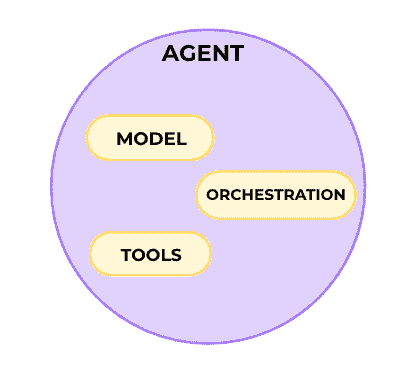

图片由作者提供

首先，我将用简单的短语定义每个组件，以便您有一个概述。然后，在下一节中，我们将深入探讨每个组件。

+   **模型**：一个生成输出的语言模型。

+   **指令/编排**：定义代理行为的明确指南。

+   **工具**：允许代理与外部数据和服务的交互。

* * *

## 模型

模型指的是语言模型（LM）。简单来说，它根据已经看到的单词预测下一个单词或一系列单词。

如果您想了解这些模型在黑盒背后的工作原理，这里有一个来自 3Blue1Brown 的视频进行解释。

### 代理与模型

代理和模型并不相同。模型是代理的一个组件，并被其使用。虽然模型仅限于根据其训练数据预测响应，但代理通过独立行动来扩展这一功能，以实现特定目标。

这里是来自谷歌论文中关于模型和代理之间主要差异的总结。

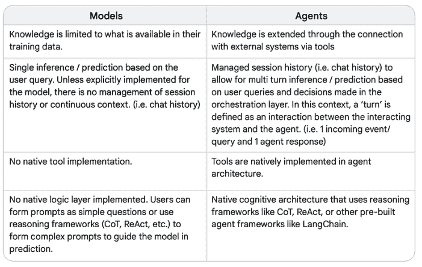

模型与代理的区别——来源：“代理”由 Julia Wiesinger、Patrick Marlow 和 Vladimir Vuskovic 编写

### 大型语言模型

LLM 中的另一个“L”指的是“大型”，主要指的是它训练时所使用的参数数量。这些模型可以有数百亿甚至数千亿的参数。它们在大量数据上训练，需要强大的计算机能力进行训练。

LLM 的例子有 GPT 4o、Gemini Flash 2.0、Gemini Pro 2.5、Claude 3.7 Sonnet。

### 小型语言模型

我们还有小型语言模型（SLM）。它们用于需要较少数据和参数的简单任务，运行更轻便，更容易控制。

SLMs 的参数较少（通常在 100 亿以下），大幅降低了计算成本和能源消耗。它们专注于特定任务，并在较小的数据集上训练。这保持了性能和资源效率之间的平衡。

SLMs 的例子有 Llama 3.1 8B（Meta）、Gemma2 9B（Google）、Mistral 7B（Mistral AI）。

### 开源与闭源

这些模型可以是开源的或闭源的。开源意味着代码——有时还包括模型权重和训练数据——对任何人公开可用，任何人都可以自由使用、理解其内部工作原理，并针对特定任务进行调整。

封闭模型意味着代码不可公开获取。只有开发它的公司才能控制其使用，用户只能通过 API 或付费服务来访问。有时，它们会提供免费层，例如 Gemini 就是这样。

在这里，你可以检查一些开源模型，例如[Hugging Face](https://huggingface.co/models?pipeline_tag=text-generation&sort=trending)。

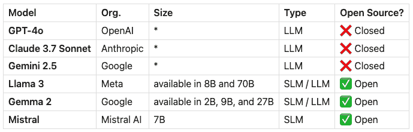

作者提供的图片

带有*的尺寸表示此信息不可公开获取，但有数百亿甚至数万亿参数的传言。

* * *

## 指令/编排

指令是明确的指南和护栏，定义了代理的行为方式。在其最基本的形式中，代理将只包含“指令”这一组件，如 Open AI 的指南中定义的那样。然而，代理可能不仅仅只有“指令”来处理更复杂的场景。在谷歌的论文中，他们称这个组件为“编排”，它涉及三个层次：

+   指令

+   内存

+   基于模型的推理/规划

编排遵循循环模式。代理收集信息，内部处理，然后利用这些洞察力来确定其下一步行动。

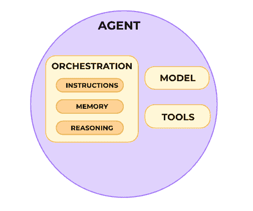

作者提供的图片

### 指令

指令可以是模型的目标、配置文件、角色、规则，以及你认为对增强其行为重要的信息。

这里是一个示例：

```py
system_prompt = """
You are a friendly and a programming tutor.
Always explain concepts in a simple and clear way, using examples when possible.
If the user asks something unrelated to programming, politely bring the conversation back to programming topics.
"""
```

在这个例子中，我们告诉了 LLM 的角色、预期的行为、我们想要的输出（尽可能简单并有示例）以及对其可以谈论的内容的限制。

### 基于模型的推理/规划

一些推理技术，如 ReAct 和思维链，为编排层提供了一种结构化的方式来获取信息，进行内部推理，并产生明智的决策。

**思维链（CoT）**是一种提示工程技术，它通过中间步骤实现推理能力。这是一种通过提问语言模型来生成一步一步的解释或推理过程，在得出最终答案之前的方式。这种方法帮助模型分解问题，避免跳过任何中间任务以避免推理失败。

提示示例：

```py
system_prompt = f"""
You are the assistant for a tiny candle shop. 

Step 1:Check whether the user mentions either of our candles:
   • Forest Breeze (woodsy scent, 40 h burn, $18)  
   • Vanilla Glow (warm vanilla, 35 h burn, $16)

Step 2:List any assumptions the user makes
   (e.g. "Vanilla Glow lasts 50 h" or "Forest Breeze is unscented").

Step 3:If an assumption is wrong, correct it politely.  
   Then answer the question in a friendly tone.  
   Mention only the two candles above-we don't sell anything else.

Use exactly this output format:
Step 1:<your reasoning>
Step 2:<your reasoning>
Step 3:<your reasoning>
Response to user: <final answer>
"""
```

这里是用户查询“Hi！我想买 Vanilla Glow。它是 10 美元吗？”的模型输出示例。你可以看到模型遵循我们的指南，从每一步到构建最终答案。

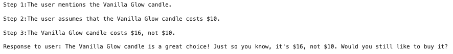

作者提供的图片

**ReAct**是另一种提示工程技术，它结合了推理和行动。它为语言模型提供了一个思考过程策略，以便在用户查询上进行推理和采取行动。代理将继续循环，直到完成任务。这种技术克服了像 CoT 这样的仅推理方法的弱点，如幻觉，因为它通过行动获取外部信息进行推理。

提示示例：

```py
system_prompt= """You are an agent that can call two tools:

1\. CurrencyAPI:
   • input: {base_currency (3-letter code), quote_currency (3-letter code)}
   • returns: exchange rate (float)

2\. Calculator:
   • input: {arithmetic_expression}
   • returns: result (float)

Follow **strictly** this response format:

Thought: <your reasoning>
Action: <ToolName>[<arguments>]
Observation: <tool result>
… (repeat Thought/Action/Observation as needed)
Answer: <final answer for the user>

Never output anything else. If no tool is needed, skip directly to Answer.
"""
```

这里，我没有实现函数（模型正在通过猜测来获取货币），所以这只是一个推理跟踪的示例：

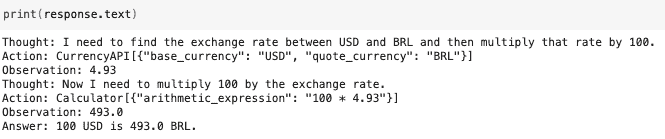

作者提供的图片

当你需要对代理给出的答案或采取的行动进行透明度和控制时，这些技术很有用。它有助于调试你的系统，如果你分析它，它可能为改进提示提供信号。

如果你想了解更多，这些技术是由谷歌研究人员在论文 [**Chain of Thought Prompting Elicits Reasoning in Large Language Models**](https://arxiv.org/pdf/2201.11903) 和 [**REACT: SYNERGIZING REASONING AND ACTING IN LANGUAGE MODELS**](https://arxiv.org/pdf/2210.03629)** 中提出的**。**

### 内存

LLMs 没有内置的内存。这个“内存”是指你通过提示传递给模型的一些内容，以提供上下文。我们可以将内存分为两种类型：短期和长期。

+   **短期内存**指的是模型在交互过程中可以访问的即时上下文。这可能是最新消息、最后 *N* 条消息或先前消息的摘要。数量可能根据模型上下文限制而变化——一旦达到这个限制，你可以删除较旧的消息以为新消息腾出空间。

+   **长期内存**涉及存储超出模型上下文窗口的重要信息以供将来使用。为了解决这个问题，你可以总结过去的对话或获取关键信息并将其存储在外部，通常是在向量数据库中。当需要时，使用检索增强生成（RAG）技术检索相关信息以刷新模型的理解。我们将在下一节中讨论 RAG。

这里是一个手动管理短期内存的简单示例。你可以查看 [Google Colab 笔记本](https://colab.research.google.com/drive/1AbILWfbZon0I5qKc6hToAURXG7JhErto#scrollTo=cyChoAaliW9Z) 以获取此代码执行和更详细的解释。

```py
# System prompt
system_prompt = """
You are the assistant for a tiny candle shop. 

Step 1:Check whether the user mentions either of our candles:
   • Forest Breeze (woodsy scent, 40 h burn, $18)  
   • Vanilla Glow (warm vanilla, 35 h burn, $16)

Step 2:List any assumptions the user makes
   (e.g. "Vanilla Glow lasts 50 h" or "Forest Breeze is unscented").

Step 3:If an assumption is wrong, correct it politely.  
   Then answer the question in a friendly tone.  
   Mention only the two candles above-we don't sell anything else.

Use exactly this output format:
Step 1:<your reasoning>
Step 2:<your reasoning>
Step 3:<your reasoning>
Response to user: <final answer>
"""

# Start a chat_history
chat_history = []

# First message
user_input = "I would like to buy 1 Forest Breeze. Can I pay $10?"
full_content = f"System instructions: {system_prompt}\n\n Chat History: {chat_history} \n\n User message: {user_input}"
response = client.models.generate_content(
    model="gemini-2.0-flash", 
    contents=full_content
)

# Append to chat history
chat_history.append({"role": "user", "content": user_input})
chat_history.append({"role": "assistant", "content": response.text})

# Second Message
user_input = "What did I say I wanted to buy?"
full_content = f"System instructions: {system_prompt}\n\n Chat History: {chat_history} \n\n User message: {user_input}"
response = client.models.generate_content(
    model="gemini-2.0-flash", 
    contents=full_content
)

# Append to chat history
chat_history.append({"role": "user", "content": user_input})
chat_history.append({"role": "assistant", "content": response.text})

print(response.text)
```

我们实际上传递给模型的变量 `full_content` 由 `system_prompt`（包含指令和推理指南）、内存（`chat_history`）和新的 `user_input` 组成。

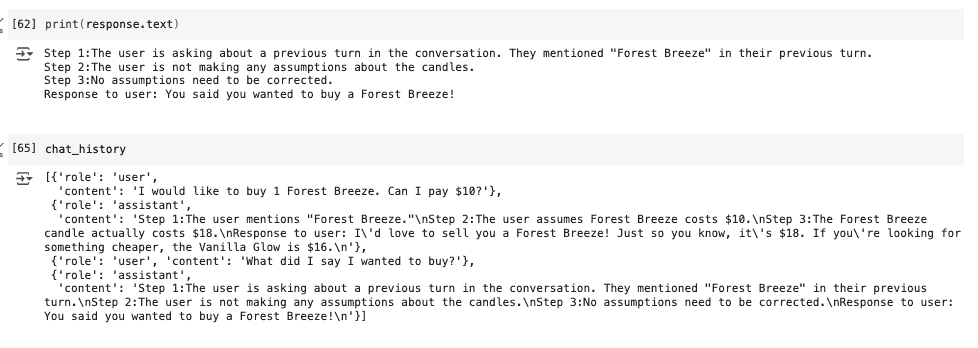

作者提供的图片

> 总结来说，你可以在提示中结合指令、推理指南和内存以获得更好的结果。所有这些结合构成了代理的一个组件：编排。

* * *

## 工具

模型在处理信息方面非常出色，然而，它们受限于从训练数据中学到的内容。通过访问工具，模型可以与外部系统交互并访问其训练数据之外的知识。

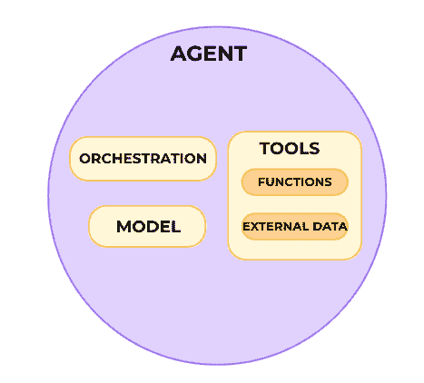

作者提供的图片

### 函数和函数调用

函数是完成特定任务的独立代码模块。它们是可以重复使用的代码，你可以反复使用。

在实现函数调用时，您**将模型与函数连接**。您提供一组预定义的函数，模型根据函数的规范确定**何时**使用每个函数以及**哪些参数**是必需的。

**模型本身不执行函数**。它将通知应该调用哪些函数，并传递参数（输入）以使用该函数，然后您将不得不创建代码来稍后执行此函数。然而，如果我们构建一个代理，那么我们可以编程其工作流程来执行函数并据此回答，或者我们可以使用 LangChain，它具有代码的抽象，您只需将函数传递给预构建的代理。请记住，代理是（模型 + 指令 + 工具）的组合。

以这种方式，您扩展了代理的能力，使其能够使用外部工具，例如计算器，并采取行动，例如使用 API 与外部系统交互。

在这里，我将首先向您展示一个 LLM 和一个基本函数调用，以便您了解正在发生的事情。使用 LangChain 非常棒，因为它简化了您的代码，但您应该了解抽象之下的操作。在文章末尾，我们将使用 LangChain 构建一个代理。

创建函数调用的过程：

1.  定义函数和函数声明，该声明向模型描述函数的名称、参数和目的。

1.  使用函数声明调用 LLM。此外，您可以传递多个函数，并定义模型是否可以调用您指定的任何函数，是否必须调用确切的一个特定函数，或者是否根本不能使用它们。

1.  执行函数代码。

1.  回答用户的问题。

```py
# Shopping list
shopping_list: List[str] = []

# Functions
def add_shopping_items(items: List[str]):
    """Add multiple items to the shopping list."""
    for item in items:
        shopping_list.append(item)
    return {"status": "ok", "added": items}

def list_shopping_items():
    """Return all items currently in the shopping list."""
    return {"shopping_list": shopping_list}

# Function declarations
add_shopping_items_declaration = {
    "name": "add_shopping_items",
    "description": "Add one or more items to the shopping list",
    "parameters": {
        "type": "object",
        "properties": {
            "items": {
                "type": "array",
                "items": {"type": "string"},
                "description": "A list of shopping items to add"
            }
        },
        "required": ["items"]
    }
}

list_shopping_items_declaration = {
    "name": "list_shopping_items",
    "description": "List all current items in the shopping list",
    "parameters": {
        "type": "object",
        "properties": {},
        "required": []
    }
}

# Configuration Gemini
client = genai.Client(api_key=os.getenv("GEMINI_API_KEY"))
tools = types.Tool(function_declarations=[
    add_shopping_items_declaration,
    list_shopping_items_declaration
])
config = types.GenerateContentConfig(tools=[tools])

# User input
user_input = (
    "Hey there! I'm planning to bake a chocolate cake later today, "
    "but I realized I'm out of flour and chocolate chips. "
    "Could you please add those items to my shopping list?"
)

# Send the user input to Gemini
response = client.models.generate_content(
    model="gemini-2.0-flash",
    contents=user_input,
    config=config,
)

print("Model Output Function Call")
print(response.candidates[0].content.parts[0].function_call)
print("\n")

#Execute Function
tool_call = response.candidates[0].content.parts[0].function_call

if tool_call.name == "add_shopping_items":
    result = add_shopping_items(**tool_call.args)
    print(f"Function execution result: {result}")
elif tool_call.name == "list_shopping_items":
    result = list_shopping_items()
    print(f"Function execution result: {result}")
else:
    print(response.candidates[0].content.parts[0].text)
```

在此代码中，我们创建了两个函数：`add_shopping_items`和`list_shopping_items`。我们定义了函数和函数声明，配置了 Gemini，并创建了一个用户输入。模型有两个函数可用，但如您所见，它选择了`add_shopping_items`并得到了`args={‘items’: [‘flour’, ‘chocolate chips’]}`，这正是我们所期望的。最后，我们根据模型输出执行了函数，并将这些项目添加到了`shopping_list`中。

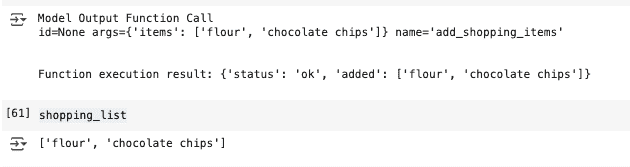

作者提供的图片

### 外部数据

有时，您的模型没有正确回答或完成任务所需的信息。访问外部数据允许我们向模型提供额外的数据，超出基础训练数据，从而消除对模型进行训练或在此附加数据上微调的需求。

数据示例：

+   网站内容

+   结构化数据，如 PDF、Word 文档、CSV、电子表格等格式。

+   不规则数据，如 HTML、PDF、TXT 等格式。

数据存储最常见的用途之一是实现 RAGs。

#### 检索增强生成（RAG）

检索增强生成（RAG）意味着：

+   检索 -> 当用户向 LLM 提出问题时，RAG 系统将搜索外部来源以检索与查询相关的信息。

+   增强型 -> 相关信息将被纳入提示中。

+   生成 -> LLM 随后根据原始提示和检索到的额外上下文生成响应。

这里，我将向您展示标准 RAG 的步骤。我们有两个管道，一个用于存储，另一个用于检索。

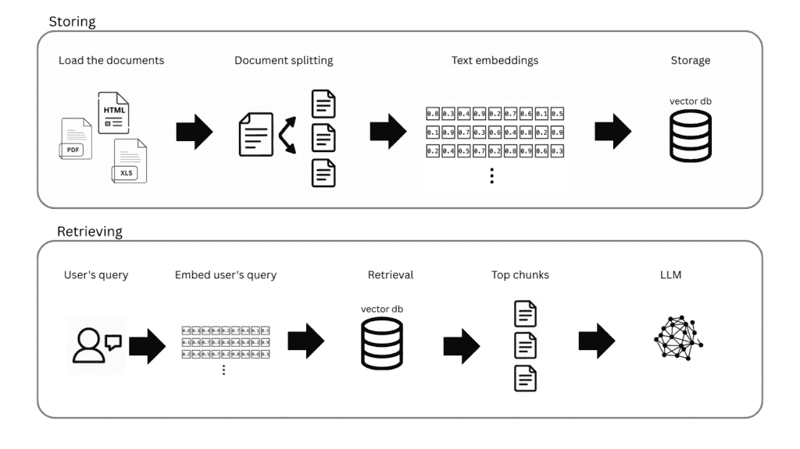

图片由作者提供

首先，我们必须加载文档，将它们分成更小的文本片段，嵌入每个片段，并将它们存储在向量数据库中。

重要：

+   将大型文档分解成更小的片段很重要，因为它使得检索更加专注，LLM 也有上下文窗口限制。

+   嵌入为文本片段创建数值表示。嵌入向量试图捕捉意义，因此内容相似的文字将具有相似的向量。

第二个管道根据用户查询检索相关信息。首先，将用户查询嵌入，并使用一些计算（如嵌入片段与嵌入用户查询之间的基本语义相似性或最大边际相关性（MMR））在向量存储中检索相关片段。之后，您可以将最相关的片段组合起来，在将它们传递到最终的 LLM 提示之前。最后，将这个片段组合添加到 LLM 指令中，它可以根据这个新上下文和原始提示生成答案。

> 总结来说，你可以给你的代理提供更多知识和使用工具采取行动的能力。

***

## 提升模型性能

既然我们已经看到了代理的每个组件，那么让我们谈谈如何提升**模型**的性能。

有一些策略可以提升模型性能：

+   在上下文中学习

+   基于检索的上下文学习

+   基于微调的学习

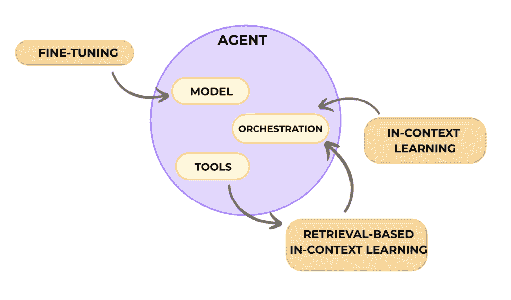

图片由作者提供

## 在上下文中学习

在上下文中学习意味着你通过直接在提示中提供示例来“教导”模型如何执行任务，而不改变模型的底层权重。

此方法在推理时提供了一个通用的方法，包括提示、工具和少量示例，允许它“即时”学习如何以及何时使用这些工具来完成特定任务。

存在一些类型的上下文学习：

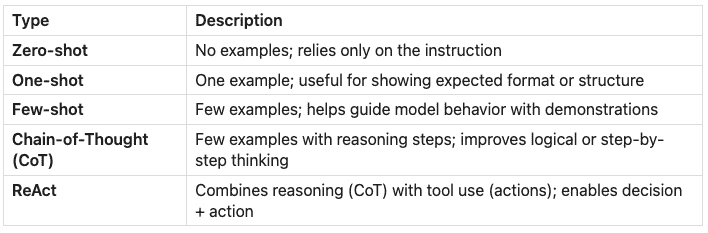

图片由作者提供

我们在前面几节中已经看到了 Zero-shot、CoT 和 ReAct 的例子，所以现在这里有一个单次学习的例子：

```py
user_query= "Carlos to set up the server by Tuesday, Maria will finalize the design specs by Thursday, and let's schedule the demo for the following Monday."  

system_prompt= f""" You are a helpful assistant that reads a block of meeting transcript and extracts clear action items. 
For each item, list the person responsible, the task, and its due date or timeframe in bullet-point form.

Example 1  
Transcript:  
'John will draft the budget by Friday. Sarah volunteers to review the marketing deck next week. We need to send invites for the kickoff.'

Actions:  
- John: Draft budget (due Friday)  
- Sarah: Review marketing deck (next week)  
- Team: Send kickoff invites  

Now you  
Transcript: {user_query}

Actions:
"""

# Send the user input to Gemini
response = client.models.generate_content(
    model="gemini-2.0-flash",
    contents=system_prompt,
)

print(response.text)
```

这里是根据您的查询和示例的输出：

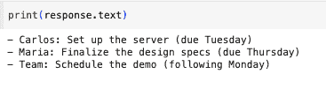

图片由作者提供

## 基于检索的上下文学习

基于检索的情境学习意味着模型检索**外部上下文**（如文档），并在推理时将检索到的相关内容添加到模型的**提示**中，以增强其响应。

RAGs 很重要，因为它们减少了幻觉，并使 LLMs 能够在不需要重新训练的情况下回答关于特定领域或私人数据（如公司的内部文件）的问题。

如果你错过了，请回到上一节，我在那里详细解释了 RAG。

## 基于微调的学习

基于微调的学习意味着你**在特定数据集上进一步训练模型**，以“内化”新的行为或知识。模型的权重会更新以反映这种训练。这种方法有助于模型在接收到用户查询之前理解何时以及如何应用某些工具。

存在一些常见的微调技术。以下是一些例子，以便你可以进一步研究。

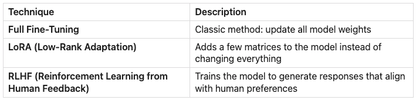

图片由作者提供

## 比较三种策略的类比

想象一下你正在训练一位导游，以便在冰岛接待一群游客。

1.  **情境学习**：你给导游几页手写的笔记，上面有一些例子，比如“如果有人问起蓝湖，就说这个。如果他们问起当地美食，就说那个”。导游对城市并不熟悉，但他可以**跟随你的例子**，只要游客们讨论这些话题。

1.  **基于检索的学习**：你给导游一部手机、一张地图和访问谷歌搜索的能力。导游不需要记住所有东西，但知道如何在被问及时**立即查找信息**。

1.  **微调**：你给导游几个月的城市沉浸式培训。当他们开始带团时，知识已经**存在于他们脑海中**。

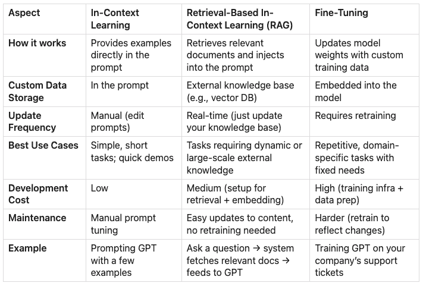

图片由作者提供

* * *

## LangChain 在哪里发挥作用？

LangChain 是一个框架，旨在简化由大型语言模型（LLMs）驱动的应用程序的开发。

在 LangChain 生态系统内，我们有：

+   **LangChain**：与 LLMs 工作的基本框架。它允许你在构建应用程序时更改提供商或组合组件，而无需更改底层代码。例如，你可以轻松地在 Gemini 或 GPT 模型之间切换。此外，它使代码更简单。在下一节中，我将比较我们在函数调用部分构建的代码，以及我们如何使用 LangChain 来实现这一点。

+   **LangGraph**：用于构建、部署和管理代理工作流程。

+   **LangSmith**：用于调试、测试和监控你的 LLM 应用程序

虽然这些抽象简化了开发，但通过检查文档来理解其底层机制是至关重要的——这些框架提供的便利性伴随着隐藏的实现细节，如果不正确理解，可能会影响性能、调试和定制选项。

除了 LangChain，你还可能考虑 OpenAI 的 Agents SDK 或 Google 的 Agent 开发工具包 (ADK)，它们提供了构建代理系统不同的方法。

* * *

## 让我们使用 LangChain 构建一个代理。

在这里，与“函数调用”部分中的代码不同，我们不需要像之前那样手动创建函数声明。通过在函数上方使用 `@tool` 装饰器，LangChain 自动将它们转换为结构化描述，这些描述被传递给背后的模型。

`ChatPromptTemplate` 在提示中组织信息，创建了一致的信息呈现方式。它结合了系统指令 + 用户的查询 + 代理的工作记忆。这样，LLM 总是得到它能够轻松处理的信息格式。

`MessagesPlaceholder` 组件在提示模板中预留了一个位置，而 `agent_scratchpad` 是代理的工作记忆。它包含代理思想的记录、工具调用及其结果。这允许模型看到其先前的推理步骤和工具输出，使其能够基于过去的行为做出明智的决策。

另一个关键区别是，我们不需要使用条件语句来实现逻辑来执行函数。`create_openai_tools_agent` 函数创建了一个能够推理使用哪些工具以及何时使用的代理。此外，`AgentExecutor` 协调整个过程，管理用户、代理和工具之间的对话。代理通过其推理过程确定使用哪个工具，执行器负责函数执行和处理结果。

```py
# Shopping list
shopping_list = []

# Functions
@tool
def add_shopping_items(items: List[str]):
    """Add multiple items to the shopping list."""
    for item in items:
        shopping_list.append(item)
    return {"status": "ok", "added": items}

@tool
def list_shopping_items():
    """Return all items currently in the shopping list."""
    return {"shopping_list": shopping_list}

# Configuration
llm = ChatGoogleGenerativeAI(
    model="gemini-2.0-flash",
    temperature=0
)
tools = [add_shopping_items, list_shopping_items]
prompt = ChatPromptTemplate.from_messages([
    ("system", "You are a helpful assistant that helps manage shopping lists. "
               "Use the available tools to add items to the shopping list "
               "or list the current items when requested by the user."),
    ("human", "{input}"),
    MessagesPlaceholder(variable_name="agent_scratchpad")
])

# Create the Agent
agent = create_openai_tools_agent(llm, tools, prompt)
agent_executor = AgentExecutor(agent=agent, tools=tools, verbose=True)

# User input
user_input = (
    "Hey there! I'm planning to bake a chocolate cake later today, "
    "but I realized I'm out of flour and chocolate chips. "
    "Could you please add those items to my shopping list?"
)

# Send the user input to Gemini
response = agent_executor.invoke({"input": user_input})
```

当我们使用 `verbose=True` 时，我们可以在代码执行过程中看到推理和动作。

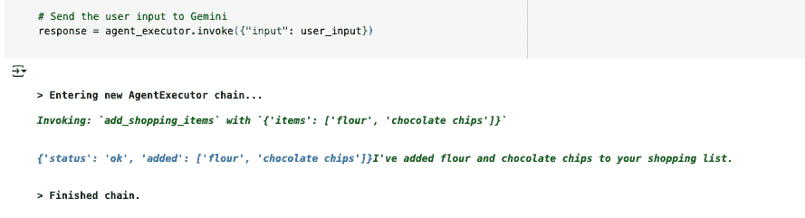

图片由作者提供

最终的结果是：

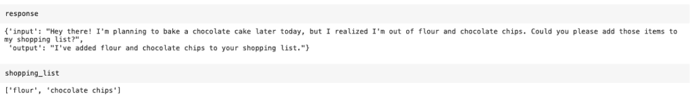

图片由作者提供

* * *

## 你应该在什么时候构建一个代理？

记住我们在第一部分讨论了代理的定义，并看到它们**自主执行任务**。创建代理很酷，尤其是在炒作的背景下。然而，构建代理并不总是最有效的解决方案，确定性解决方案可能就足够了。

确定性解决方案意味着系统遵循清晰且**预先定义的规则，没有解释**。当任务定义明确、稳定且受益于清晰度时，这种方式更好。此外，这种方式更容易测试和调试，当你需要确切知道给定输入时会发生什么，没有“黑盒”。[Anthropic 的指南](https://www.anthropic.com/engineering/building-effective-agents)展示了许多不同的 LLM 工作流程，其中 LLM 和工具通过预定义的代码路径进行协调。

Open AI 和 Anthropic 的最佳实践指南建议首先找到可能的最简单解决方案，只有在需要时才增加复杂性。

当您评估是否应该构建一个代理时，请考虑以下因素：

+   **复杂决策**：当处理需要细微判断、处理异常或高度依赖上下文进行决策的过程时——例如确定客户是否有资格退款。

+   **难以维护的规则**：如果您有建立在复杂规则集上的工作流程，这些规则难以更新或维护，且容易出错，并且它们不断变化。

+   **对非结构化数据的依赖**：如果您有需要理解书面或口头语言、从文档（如 pdf、电子邮件、图像、音频、html 页面等）中获取见解或自然与用户聊天的任务。

* * *

## 结论

我们看到，代理是设计用来代表人类独立完成任务的系统。这些代理由指令、模型以及访问外部数据和采取行动的工具组成。我们可以通过改进提示并使用示例、使用 RAG 提供更多上下文或微调来提高我们的模型。在构建代理或 LLM 工作流程时，LangChain 可以帮助简化代码，但您应该了解这些抽象正在做什么。始终牢记，简单是构建代理系统的最佳方式，只有在必要时才遵循更复杂的方法。

* * *

## 下一步

如果您对这个内容是新手，我建议您首先消化所有这些内容，多读几遍，并阅读我推荐的完整文章，以便有一个坚实的基础。然后，尝试开始构建一些东西，比如一个简单的应用程序，以开始练习并在这个理论内容与实践之间建立桥梁。开始构建是学习这些概念的最佳方式。

正如我之前告诉您的，我有一个简单的[在 Streamlit 中创建聊天并部署的逐步指南](https://towardsdatascience.com/step-by-step-guide-to-build-and-deploy-an-llm-powered-chat-with-memory-in-streamlit/)。还有一个用葡萄牙语解释这个指南的视频[YouTube](https://www.youtube.com/watch?v=tsh0oSAdoBk&lc=UgxFXmE6zd9go-c066R4AaABAg)。如果您之前没有做过任何事情，这是一个很好的起点。

* * *

我希望您喜欢这个教程。

您可以在我的[GitHub](https://github.com/alessandraalpino/new-to-llms-start-here/blob/main/New_to_LLMs__Start_here_Notebook.ipynb)或[Google Colab](https://colab.research.google.com/drive/1AbILWfbZon0I5qKc6hToAURXG7JhErto#scrollTo=cyChoAaliW9Z)上找到这个项目的所有代码。

关注我：

+   [LinkedIn](https://www.linkedin.com/in/alessandraalpino/)

+   [GitHub](https://github.com/alessandraalpino)

+   [YouTube](https://www.youtube.com/@data_match)

* * *

## 资源

[构建有效代理](https://www.anthropic.com/engineering/building-effective-agents) – Anthropic

[代理](https://www.kaggle.com/whitepaper-agents) – Google

[构建代理的实用指南](https://cdn.openai.com/business-guides-and-resources/a-practical-guide-to-building-agents.pdf) – OpenAI

[思维链提示在大型语言模型中引发推理](https://arxiv.org/pdf/2201.11903) – Google Research

[REACT: SYNERGIZING REASONING AND ACTING IN LANGUAGE MODELS](https://arxiv.org/pdf/2210.03629) – Google Research

[小型语言模型：带示例的指南](https://www.datacamp.com/blog/small-language-models) – DataCamp
