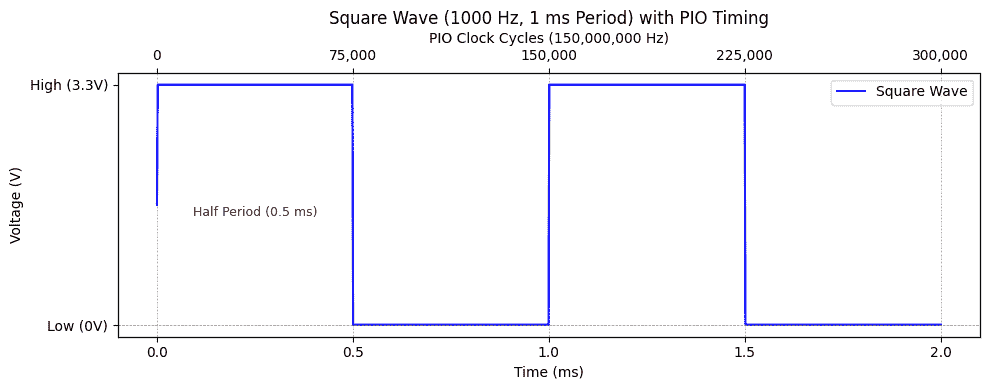
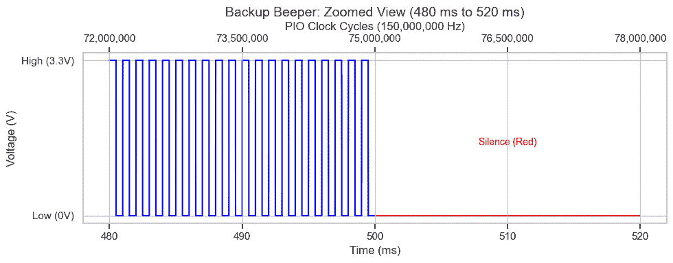
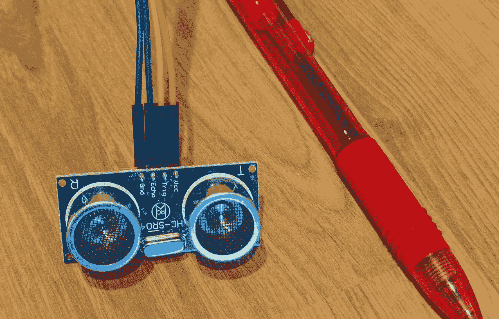

# 使用 MicroPython 的九个 Pico PIO Wats（第一部分）

> 原文：[`towardsdatascience.com/nine-pico-pio-wats-with-micropython-part-1-82b80fb84473/`](https://towardsdatascience.com/nine-pico-pio-wats-with-micropython-part-1-82b80fb84473/)


Pico PIO 惊喜 – 来源：[`openai.com/dall-e-2/`](https://openai.com/dall-e-2/)。所有其他图像来自作者。

*也提供：[本文的 Rust 版本](https://medium.com/towards-data-science/nine-pico-pio-wats-with-rust-part-1-9d062067dc25)*

在 JavaScript 和其他语言中，我们称[令人惊讶或不一致的行为为"Wat!"（即"What!?"]](https://www.destroyallsoftware.com/talks/wat)。例如，在 JavaScript 中，一个空数组加一个空数组产生一个空字符串，`[] + [] === ""`。Wat!

与之相比，Python 更一致、更可预测。然而，在 Raspberry Pi Pico 微控制器上的 MicroPython 的一个角落提供了类似的惊喜。具体来说，Pico 的**可编程输入/输出（PIO）**子系统，虽然功能强大且灵活，但也存在一些特殊性。

PIO 编程很重要，因为它为精确、低级硬件控制挑战提供了一个巧妙的解决方案。它非常快——即使从 MicroPython 编程，PIO 的表现也和从 Rust 或 C/C++编程一样高效。它的灵活性无与伦比：而不是依赖于特殊用途的硬件来控制你可能想要控制的无数外围设备，PIO 允许你在软件中定义自定义行为，无缝适应你的需求，而不会增加硬件复杂性。

考虑这个简单的例子：一个价值 15 美元的类似瑟琳娜的乐器。通过在空中挥动手臂，音乐家改变（诚然令人讨厌）的音调。使用 PIO 提供了一种简单的方式来编程这个设备，确保它能够即时响应运动。

所以，一切都很美好，除了——用蜘蛛侠的话来说：

> 权力越大，带来的惊喜也越多！九个 Wats!？

我们将通过创建这个瑟琳娜来探索和展示这九个 PIO Wats。

**本文面向谁？**

+   **所有程序员**: 像 Pico 这样的微控制器价格低于 7 美元，并支持 Python、Rust 和 C/C++等高级语言。本文将展示微控制器如何让您的程序与物理世界交互，并介绍如何编程 Pico 的低级、高性能 PIO 硬件。

+   **MicroPython Pico 程序员**: 对 Pico 的隐藏潜力感到好奇吗？除了其两个主要核心之外，它还拥有八个专门用于 PIO 编程的微型“状态机”。这些状态机接管了时间敏感的任务，为其他工作释放了主处理器，并实现了令人惊讶的并行性。

+   **C/C++ Pico 程序员**：虽然这篇文章使用 MicroPython，但 PIO 编程——无论是好是坏——在所有语言中几乎都是相同的。如果你在这里理解了它，你将准备好在 C/C++ 中应用它。

+   ***Rust Pico 程序员：** 你可能希望阅读 [Rust 版本的这篇文章。](https://medium.com/towards-data-science/nine-pico-pio-wats-with-rust-part-1-9d062067dc25)*

+   **PIO 程序员**：通过九个 Wat 的旅程可能不如 JavaScript 的怪癖那么有趣（幸运的是），但它将揭示 PIO 编程的奇特之处。如果你曾经觉得 PIO 编程令人困惑，这篇文章应该会让你放心，问题（不一定）是你——部分原因是 PIO 本身。最重要的是，理解这些 Wat 将使编写 PIO 代码变得更加简单和有效。

最后，这篇文章并不是关于 "修复" PIO 编程。PIO 在其主要目的上表现出色：高效且灵活地处理自定义外设接口。其设计是有目的的，非常适合其目标。相反，这篇文章专注于理解 PIO 编程及其怪癖——从奖励 Wat 开始。

## 奖励 Wat 0: "状态机" 不是状态机——除非它们是

尽管它们的名称如此，树莓派 Pico 中的八个 "PIO 状态机" 并不是在计算机科学严格、正式意义上的状态机。一个经典的 **[有限状态机 (FSM)](https://en.wikipedia.org/wiki/Finite-state_machine)** 由有限的状态和转换组成，完全由输入符号驱动。相比之下，Pico 的 PIO 状态机是具有自己指令集的小型可编程处理器。与正式的 FSM 不同，它们有一个程序计数器、**[寄存器](https://en.wikipedia.org/wiki/Register_machine)**，以及通过移位和递减来修改这些寄存器的**能力**，这使得它们能够存储中间值并影响执行流程，而不仅仅是固定的状态转换。

话虽如此，称它们为 **[可编程状态机](https://www.reddit.com/r/raspberrypipico/comments/1idteeq/comment/ma5kgy0/)** 是有道理的：它们的行为不是基于一组预定义的状态，而是取决于它们执行的程序。在大多数情况下，这个程序将定义一个状态机或类似的东西——特别是由于 PIO 经常用于实现精确、状态驱动的 I/O 控制。

每个 PIO 在每个时钟周期处理一条指令。$4 Pico 1 以每秒 1.25 亿个周期的速度运行，而 $5 Pico 2 提供更快的每秒 1.5 亿个周期。每条指令执行一个简单的操作，例如 "移动一个值" 或 "跳转到标签"。

在解决了那个奖励 Wat 之后，让我们转向我们的第一个主要 Wat。

## Wat 1: 寄存器饥饿游戏

在 PIO 编程中，一个 **寄存器** 是一个小型、快速的存储位置，它像变量一样作用于状态机。你可能梦想拥有大量的变量来存储你的计数器、延迟和临时值，但现实是残酷的：你只有两个通用寄存器，`x` 和 `y`。这就像《饥饿游戏》，无论有多少贡品进入竞技场，只有凯特尼斯和皮塔能成为胜利者。你必须无情地削减你的需求，以适应这两个寄存器，决定什么要优先考虑，什么要牺牲。同样，就像《饥饿游戏》一样，我们有时可以弯曲规则。

让我们从一项挑战开始：创建一个备用蜂鸣器 – 1000 Hz 持续 ½ 秒，然后静音 ½ 秒，重复。结果？ "哔哔哔……"

我们希望有五个变量：

+   `half_period`：保持电压高然后低的时钟周期数，以创建 1000 Hz 的音调。这是 150,000,000 / 1000 / 2 = 75,000 个周期高电平和 75,000 个周期低电平。



生成 1000 Hz 方波所需的电压和时序（毫秒和时钟周期）。

+   `y`：从 0 到 `half_period` 的循环计数器，以创建延迟。

+   `period_count`：填充 ½ 秒时间的重复周期数。150,000,000 × 0.5 / (75,000 × 2) = 500。

+   `x`：从 0 到 `period_count` 的循环计数器，以填充 ½ 秒的时间。

+   `silence_cycles`：½ 秒静音的时钟周期数。150,000,000 × 0.5 = 75,000,000。



我们想要五个寄存器，但只能有两个，所以游戏开始了！愿好运永远在您这边。

首先，我们可以消除 `silence_cycles`，因为它可以表示为 `half_period × period_count × 2`。虽然 PIO 不支持乘法，但它支持循环。通过嵌套两个循环——其中内循环延迟 2 个时钟周期——我们可以创建 75,000,000 个时钟周期的延迟。

一个变量已经确定，但我们如何消除另外两个？幸运的是，我们不必这样做。虽然 PIO 只提供两个通用寄存器，`x` 和 `y`，但它还包括两个专用寄存器：`osr`（输出移位寄存器）和 `isr`（输入移位寄存器）。

我们一会儿将看到的 PIO 代码实现了备用蜂鸣器。以下是其工作原理：

**初始化**：

+   `pull(block)` 指令从缓冲区读取音调的半周期（75,000 个时钟周期）并将其值放入 `osr`。

+   然后将该值复制到 `isr` 以供后续使用。

+   第二次 `pull(block)` 从缓冲区读取周期计数（500 次重复）并将其放置在 `osr` 中，我们将其保留。

**蜂鸣循环**：

+   `mov(x, osr)` 指令将周期计数复制到 `x` 寄存器，该寄存器作为外循环计数器。

+   对于内循环，`mov(y, isr)` 重复将半周期复制到 `y` 以创建音调的高电平和低电平状态的延迟。

**静音循环**：

+   静音循环与蜂鸣循环的结构相似，但不会设置任何引脚，因此它们仅作为延迟使用。

**包装和连续执行**：

+   `wrap_target()` 和 `wrap()` 指令定义了状态机的主循环。

+   完成蜂鸣和静音循环后，状态机跳回到程序的开始附近，无限重复序列。

在这个大纲的基础上，以下是生成备用蜂鸣器信号的 PIO 汇编代码。

```py
import rp2

@rp2.asm_pio(set_init=rp2.PIO.OUT_LOW)
def back_up():
    pull(block)                     # Read the half period of the beep sound.
    mov(isr, osr)                   # Store the half period in ISR.
    pull(block)                     # Read the period_count.

    wrap_target()                   # Start of the main loop.

    # Generate the beep sound.
    mov(x, osr)                     # Load period_count into X.
    label("beep_loop")

    set(pins, 1)                    # Set the buzzer to high voltage (start the tone).
    mov(y, isr)                     # Load the half period into Y.
    label("beep_high_delay")
    jmp(y_dec, "beep_high_delay")   # Delay for the half period.
    set(pins, 0)                    # Set the buzzer to low voltage (end the tone).
    mov(y, isr)                     # Load the half period into Y.
    label("beep_low_delay")
    jmp(y_dec, "beep_low_delay")    # Delay for the low duration.

    jmp(x_dec, "beep_loop")         # Repeat the beep loop.

    # Silence between beeps.
    mov(x, osr)                     # Load the period count into X for outer loop.
    label("silence_loop")

    mov(y, isr)                     # Load the half period into Y for inner loop.
    label("silence_delay")
    jmp(y_dec, "silence_delay")[1]  # Delay for two clock cycles (jmp + 1 extra)

    jmp(x_dec, "silence_loop")      # Repeat the silence loop.

    wrap()                          # End of the main loop, jumps back to wrap_target for continuous execution.
```

这是配置和运行备用蜂鸣器 PIO 程序的 MicroPython 代码。此脚本初始化状态机，计算计时值（`half_period` 和 `period_count`），并将它们发送到 PIO。它播放蜂鸣序列 5 秒，然后停止。如果通过 USB 连接到桌面计算机，你可以使用 `Ctrl-C` 提前停止它。

```py
import machine
from machine import Pin
import time

BUZZER_PIN = 15

def demo_back_up():
    print("Hello, back_up!")
    pio0 = rp2.PIO(0)
    pio0.remove_program()
    state_machine_frequency = machine.freq()
    back_up_state_machine = rp2.StateMachine(0, back_up, set_base=Pin(BUZZER_PIN))

    try:
        back_up_state_machine.active(1)
        half_period = int(state_machine_frequency / 1000 / 2)
        period_count = int(state_machine_frequency * 0.5 / (half_period * 2))
        print(f"half_period: {half_period}, period_count: {period_count}")
        back_up_state_machine.put(half_period)
        back_up_state_machine.put(period_count)
        time.sleep_ms(5_000)
    except KeyboardInterrupt:
        print("back_up demo stopped.")
    finally:
        back_up_state_machine.active(0)

demo_back_up()
```

当你运行程序时，会发生以下情况：

> 旁白 1：**亲自运行** 使用 MicroPython 编程 Raspberry Pi Pico 的最流行集成开发环境（IDE）是 [Thonny](https://thonny.org/)**。**我个人使用 VS Code 的 [PyMakr](https://marketplace.visualstudio.com/items?itemName=pycom.Pymakr) 扩展，尽管 [MicroPico](https://marketplace.visualstudio.com/items?itemName=paulober.pico-w-go) 扩展也是一个流行的选择。为了听到声音，我将一个无源蜂鸣器、一个电阻和一个晶体管连接到 Pico 上。有关详细的布线图和零件清单，请查看 SunFounder 的 Kepler Kit 中的 [无源蜂鸣器说明](https://docs.sunfounder.com/projects/kepler-kit/en/latest/pyproject/py_pa_buz.html#py-pa-buz)。
> 
> 旁白 2：如果你的唯一目标是使用 Pico 生成音调，则不需要 PIO。MicroPython 的速度足够快，可以直接 [切换引脚](https://docs.sunfounder.com/projects/kepler-kit/en/latest/pyproject/py_pa_buz.html#py-pa-buz)，或者你可以使用 Pico 内置的 [脉冲宽度调制（PWM）功能](https://docs.micropython.org/en/latest/library/machine.PWM.html)。

### 寄存器饥饿游戏的替代结局

我们使用了四个寄存器——两个通用和两个特殊——来解决这个挑战。如果这个解决方案感觉不够令人满意，这里有一些可以考虑的替代方法：

**使用常量**：为什么要把 `half_period`、`period_count` 和 `silence_cycles` 作为变量？直接将常量 "75,000"、"500" 和 "75,000,000" 编入代码可以简化设计。然而，PIO 常量有一些限制，我们将在 **Wat 5** 中探讨。

**打包位**：寄存器包含 32 位。我们真的需要两个寄存器（2×32=64 位）来存储 `half_period` 和 `period_count` 吗？不。存储 75,000 只需要 17 位，而 500 需要 9 位。我们可以将这些值打包到一个寄存器中，并使用 `out` 指令将值移位到 `x` 和 `y`。这种方法可以释放 `osr` 或 `isr` 以供其他任务使用，但一次只能使用一个——另一个寄存器必须持有打包的值。

**慢动作**：在 MicroPython 中，你可以通过简单地指定你想要的时钟速度来配置一个 PIO 状态机以较慢的频率运行。MicroPython 会为你处理细节，使状态机可以运行到 ~2290 Hz。以较慢的速度运行状态机意味着像 `half_period` 这样的值可以更小，可能小到 `2`。较小的值更容易作为常量硬编码，并且可以更紧凑地打包到寄存器中。

### 注册饥饿游戏的快乐结局

注册饥饿游戏要求战略性的牺牲和创造性的解决方案，但通过利用 PIO 的特殊寄存器和巧妙的循环结构，我们最终取得了胜利。如果风险更高，其他技术可能有助于我们适应并生存。

但在一个领域的胜利并不意味着挑战就此结束。在下一个 Wat 中，我们面临新的考验：PIO 的严格 32 指令限制。

## Wat 2：32 指令的持续手提箱

恭喜！你只需花费 4 美元就买了一张环游世界的机票。但是，有一个条件？你必须将所有物品都装入一个迷你手提箱中。同样，PIO 程序允许你创建令人难以置信的功能，但每个 PIO 程序都限制在仅 32 条指令。

**Wat！** 只有 32 条指令？这空间实在太小，无法装下所有你需要的东西！但通过巧妙的规划，你通常可以使其工作。


### 规则

+   没有任何 PIO 程序可以超过 32 条指令。

+   `wrap_target`、`label` 和 `wrap` 指令不计入。

+   Pico 1 包含八个状态机，分为两个四块。Pico 2 包含十二个状态机，分为三个四块。**每个块共享 32 条指令槽位**。因此，由于一个块中的四个状态机都从相同的 32 条指令池中抽取，如果一个机器的程序使用了所有 32 个槽位，那么其他三个机器就没有空间了。

### 避免动荡

为了平稳飞行**，**使用 MicroPython 代码在加载新程序之前清理块中的任何先前程序。以下是操作方法：

```py
pio0 = rp2.PIO(0) # Block 0, containing state machines 0,1,2,3
pio0.remove_program() # Remove all programs from block 0
back_up_state_machine = rp2.StateMachine(0, back_up, set_base=Pin(BUZZER_PIN))
```

这确保了你的指令内存是新鲜的，并准备好起飞。清除块特别重要，当使用 [PyMakr](https://marketplace.visualstudio.com/items?itemName=pycom.Pymakr) 扩展的 "开发模式" 时。

### 当你的手提箱无法关闭时

如果你的想法不适合 PIO 指令槽位，这些打包技巧可能有所帮助。**(免责声明：我并没有亲自尝试过所有这些。)*

+   **动态交换 PIO 程序**：不要试图将所有内容都塞进一个程序中，考虑在飞行中交换程序。只加载你需要的东西，在你需要的时候。

+   **跨状态机共享程序**：多个状态机可以同时运行相同的程序。每个状态机可以根据输入值使共享程序表现出不同的行为。

+   **使用 MicroPython 的`exec`命令**：通过将指令卸载到 MicroPython 中来节省空间。例如，你可以直接从字符串中执行初始化步骤：

```py
back_up_state_machine.exec("pull(block)")
```

+   **使用 PIO 的 exec 命令**：在你的状态机中，你可以使用`out(exec)`执行存储在`osr`中的指令值，或者使用`mov(exec, x)`或`mov(exec, y)`对寄存器进行操作。

+   **卸载到主处理器**：如果所有其他方法都失败了，将更多程序移动到 Pico 的大容量双处理器上——这可以想象为将你的额外行李分开运送到目的地。Pico SDK（[Pico SDK](https://datasheets.raspberrypi.com/pico/raspberry-pi-pico-c-sdk.pdf)部分 3.1.4）称这为"位打"。

现在背包已经打包好，让我们加入多利特医生寻找传说中的生物的队伍。

## 奖励 Wat 2.5：多利特医生的 PIO Pushmi-Pullyu

*两位读者指出我遗漏了一个重要的 PIO Wat——所以这里有一个奖励！* 当编程 PIO 时，你会注意到一些奇怪的事情：

+   PIO 的**`pull`**指令从 TX FIFO（**发送**缓冲区）接收值并将它们输入到**输出**移位寄存器（`osr`）。因此，它从输出端输入并从接收端发送。

+   同样，PIO 的**`push`**指令从**输入**移位寄存器（`isr`）输出值并将它们传输到 RX FIFO（**接收**缓冲区）。因此，它从输入端输出并从发送端接收。

**Wat!?** 就像来自《多利特医生》故事的两位头身的[Pushmi-Pullyu](https://en.wikipedia.org/wiki/List_of_Doctor_Dolittle_characters#Pushmi-Pullyu)一样，似乎有些事情是颠倒的。但当你意识到 PIO 命名大多数事物都是从**主机的视角**（MicroPython、Rust、C/C++）出发，而不是从 PIO 程序的角度出发时，它开始变得有道理。

此表总结了指令、寄存器和缓冲区名称。（"FIFO"代表先进先出。）


拿着 Pushmi-Pullyu，我们接下来来到一个神秘的场景。

## Wat 3: pull(noblock) “神秘”

在**Wat 1**中，我们将音频硬件编程为备用蜂鸣器。但这对我们的乐器来说不是我们需要的。相反，我们想要一个无限期播放给定音调的 PIO 程序——直到它被告知播放新的音调。程序还应等待特殊“休息”音调。

等待新音调提供以使用`pull(block)`编程休息是很容易的——我们将在下面探讨细节。在特定频率上播放音调也很简单，这是基于我们在**Wat 1**中完成的工作。

但我们如何在继续播放当前音调的同时检查是否有新的音调？答案是使用`pull(noblock)`中的"noblock"而不是"block"。现在，如果有新值，它将被加载到`osr`中，使程序能够无缝更新。

这里神秘开始的地方：如果调用`pull(noblock)`而没有新值，`osr`会发生什么？

我假设它会保持其之前的值。错了！也许它被重置为 0？再次错了！令人惊讶的真相：它得到`x`的值。为什么？（不，不是`y`——是`x`。）因为[Pico SDK](https://datasheets.raspberrypi.com/pico/raspberry-pi-pico-c-sdk.pdf)这么说。具体来说，3.4.9.2 节解释了：

> 在一个空的 FIFO 上进行的非阻塞 PULL 操作与 MOV OSR, X 的效果相同。

了解`pull(noblock)`的工作原理很重要，但这里有一个更大的教训。将[Pico SDK 文档](https://datasheets.raspberrypi.com/pico/raspberry-pi-pico-c-sdk.pdf)像神秘小说的背面一样对待。不要试图独自解决所有问题——作弊！跳到“谁干的”部分，在 3.4 节中，阅读你使用的每个命令的详细说明。阅读几段内容可以节省你数小时的困惑。

> 顺便说一句：当即使是 SDK 文档都感觉不清楚时，转向[RP2040](https://datasheets.raspberrypi.com/rp2040/rp2040-datasheet.pdf)（Pico 1）和[RP2350](https://datasheets.raspberrypi.com/rp2350/rp2350-datasheet.pdf)（Pico 2）的数据表。这些百科全书——分别有 600 页和 1300 页——就像全能的叙述者：它们提供了事实真相。

考虑到这一点，让我们看看一个实际例子。下面是播放持续音调和休止符的 PIO 程序。它使用`pull(block)`在休止期间等待输入，并使用`pull(noblock)`在播放音调时检查更新。

```py
import rp2

@rp2.asm_pio(set_init=rp2.PIO.OUT_LOW)
def sound():
    # Rest until a new tone is received.
    label("resting")
    pull(block)                     # Wait for a new delay value, keep it in osr.
    mov(x, osr)                     # Copy the delay into X.
    jmp(not_x, "resting")           # If new delay is zero, keep resting.

    # Play the tone until a new delay is received.
    wrap_target()                   # Start of the main loop.

    set(pins, 1)                    # Set the buzzer to high voltage.
    label("high_voltage_loop")
    jmp(x_dec, "high_voltage_loop") # Delay

    set(pins, 0)                    # Set the buzzer to low voltage.
    mov(x, osr)                     # Load the half period into X.
    label("low_voltage_loop")
    jmp(x_dec, "low_voltage_loop")  # Delay

    # Read any new delay value. If none, keep the current delay.
    mov(x, osr)                     # set x, the default value for "pull(noblock)"
    pull(noblock)                   # Read a new delay value or use the default.

    # If the new delay is zero, rest. Otherwise, continue playing the tone.
    mov(x, osr)                     # Copy the delay into X.
    jmp(not_x, "resting")           # If X is zero, rest.
    wrap()                          # Continue playing the sound.
```

我们最终会使用这个 PIO 程序在我们的类似 theremin 的乐器中。现在，让我们通过播放熟悉的旋律来查看 PIO 程序的实际效果。这个演示使用“Twinkle, Twinkle, Little Star”来展示你如何通过向状态机提供频率和持续时间来控制旋律。只需几行代码，你就可以让 Pico 唱歌！

```py
import rp2
import machine
from machine import Pin
import time

from sound_pio import sound

BUZZER_PIN = 15

twinkle_twinkle = [
    # Bar 1
    (262, 400, "Twin-"),  # C
    (262, 400, "-kle"),  # C
    (392, 400, "twin-"),  # G
    (392, 400, "-kle"),  # G
    (440, 400, "lit-"),  # A
    (440, 400, "-tle"),  # A
    (392, 800, "star"),  # G
    (0, 400, ""),  # rest
    # Bar 2
    (349, 400, "How"),  # F
    (349, 400, "I"),  # F
    (330, 400, "won-"),  # E
    (330, 400, "-der"),  # E
    (294, 400, "what"),  # D
    (294, 400, "you"),  # D
    (262, 800, "are"),  # C
    (0, 400, ""),  # rest
]

def demo_sound():
    print("Hello, sound!")
    pio0 = rp2.PIO(0)
    pio0.remove_program()
    state_machine_frequency = machine.freq()
    sound_state_machine = rp2.StateMachine(0, sound, set_base=Pin(BUZZER_PIN))

    try:
        sound_state_machine.active(1)
        for frequency, ms, lyrics in twinkle_twinkle:
            if frequency > 0:
                half_period = int(state_machine_frequency / frequency / 2)
                print(f"'{lyrics}' -- Frequency: {frequency}")
                # Send the half period to the PIO state machine
                sound_state_machine.put(half_period)
                time.sleep_ms(ms)  # Wait as the tone plays
                sound_state_machine.put(0)  # Stop the tone
                time.sleep_ms(50)  # Give a short pause between notes
            else:
                sound_state_machine.put(0)  # Play a silent rest
                time.sleep_ms(ms + 50)  # Wait for the rest duration + a short pause
    except KeyboardInterrupt:
        print("Sound demo stopped.")
    finally:
        sound_state_machine.active(0)

demo_sound()
```

当你运行程序时，会发生以下情况：

我们解决了一个谜团，但总会有另一个挑战潜伏在拐角处。在**Wat 4**中，我们将探讨当你的智能硬件带有陷阱——它也非常便宜时会发生什么。

## Wat 4：智能、便宜硬件：情感过山车

声音工作后，我们转向使用 HC-SR04+超声波测距仪测量音乐家手的距离。这个小巧但强大的设备售价不到两美元。



HC-SR04+测距仪（笔用于比例尺。）

这个小外围设备让我经历了“Wats!?！”的情感过山车。

+   **向上**：令人惊讶的是，这个 2 美元的测距仪包含了自己的微控制器，使其更智能且更容易使用。

+   **向下**：令人沮丧的是，那种相同的“智能”行为并不直观。

+   **向上**：方便的是，Pico 可以用 3.3V 或 5V 电源为外围设备供电。

+   **向下**：不可预测的是，许多测距仪在 3.3V 时不可靠——或者直接失败——，在 5V 时它们可能会损坏你的 Pico。

+   **向上**：幸运的是，损坏的测距仪和 Pico 都很便宜，而且测距仪的双电压版本解决了我的问题。

### 详细信息

我最初认为当回声返回时，测距仪会将 **Echo** 引脚置高。我错了。

相反，测距仪以 40 kHz 的频率发射 8 个超声波脉冲（把它想象成狗的备用蜂鸣器）。紧接着，它将 **Echo** 置高。然后 Pico 应该开始测量 **Echo** 下降的时间，这表示传感器检测到了模式——或者它超时了。

至于电压，文档指定测距仪在 5V 下运行。它似乎在 3.3V 下也能工作——直到它不能了。大约在同一时间，我的 Pico 停止连接到依赖特殊 USB 协议的 MicroPython IDE。

因此，到目前为止，Pico 和测距仪都损坏了。

在尝试了各种电缆、USB 驱动程序、编程语言，甚至一个旧的 5V 只测距仪后，我终于解决了以下问题：

+   我手头已经有一个新的 Pico 微控制器。（它是一个 Pico 2，但我认为型号并不重要。）

+   一个新的 [双电压 3.3/5V 测距仪](https://www.amazon.com/dp/B0CRKHV4XY?ref=ppx_yo2ov_dt_b_fed_asin_title)，仍然只要每件 2 美元。

### Wat 4：经验教训

当过山车回到车站时，我学到了两个关键教训。首先，多亏了微控制器，即使是简单的硬件也可能以非直观的方式表现，这需要仔细阅读文档。其次，虽然这个硬件很聪明，但它也很便宜——这意味着它容易出故障。当它出故障时，深呼吸，记住它只值几美元，然后更换它。

然而，硬件的怪癖只是故事的一部分。在 **Wat 5** 中，在 [第二部分](https://towardsdatascience.com/nine-pico-pio-wats-with-micropython-part-2-984a642f25a4)，我们将把注意力转回软件：PIO 编程语言本身。我们将揭示一种如此出乎意料的行为，可能会让你质疑你所知道的一切关于常量的知识。

* * *

这些是使用 MicroPython 编程 Pico PIO 的前四个 Wat。你可以在 [GitHub 上的项目代码](https://github.com/CarlKCarlK/pico_pio/) 中找到。

在 [第二部分](https://towardsdatascience.com/nine-pico-pio-wats-with-micropython-part-2-984a642f25a4) 中，我们探讨了 Wat 5 到 9。这些包括不恒定的常量、透过玻璃的条件、跳过跳跃、过多的引脚和笨拙的调试。我们还将揭示完成乐器的代码。

*请[在 Medium 上关注 Carl](https://medium.com/@carlmkadie)。我写关于 Rust 和 Python 中的科学编程、机器学习和统计学。我倾向于每月写一篇文章。*
