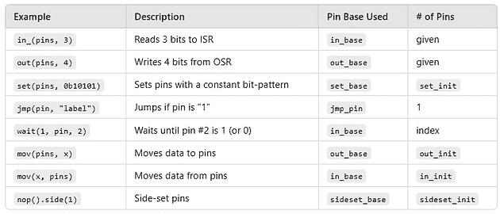

# 九个 Pico PIO Wat 与 MicroPython（第二部分）

> 原文：[`towardsdatascience.com/nine-pico-pio-wats-with-micropython-part-2-984a642f25a4/`](https://towardsdatascience.com/nine-pico-pio-wats-with-micropython-part-2-984a642f25a4/)


Pico PIO 惊喜，第二部分 – 来源：[`openai.com/dall-e-2/`](https://openai.com/dall-e-2/). 所有其他图表均来自作者。

这是探索使用 MicroPython 编程 Raspberry Pi Pico PIO 时意外特性的第二部分。如果您错过了[第一部分](https://medium.com/towards-data-science/nine-pico-pio-wats-with-micropython-part-1-82b80fb84473)，我们揭示了四个挑战关于寄存器数量、指令槽、`pull(noblock)` 的行为以及智能且经济的硬件假设的 Wat。

现在，我们继续我们的旅程，朝着制作一个类似 theremin 的乐器——一个项目，揭示了 PIO 编程的一些怪癖和困惑。准备好以莎士比亚悲剧的方式挑战您对常数的理解。

## Wat 5：不恒定的常数

在 PIO 编程的世界里，常数应该是可靠的、坚定的，而且，嗯，*恒定的*。但如果是这样的话呢？这让我们陷入了一个关于 PIO 中 `set` 指令如何工作——或者不工作——处理较大常量的困惑 Wat。

就像朱丽叶怀疑罗密欧的忠诚一样，您可能会发现自己想知道 PIO 常数是否会像她所说的那样，“证明同样多变”。

### 问题：常数并不像看起来那么大

想象一下，您正在编程一个超声波测距仪，需要从 500 开始计数，同时等待 Echo 信号从高电平降至低电平。在 PIO 中设置这个等待时间时，您可能会天真地尝试直接使用 `set` 加载常量值：

```py
set(y, 500)                   # Load max echo wait into Y
label("measure_echo_loop")
jmp(pin, "echo_active")         # if echo voltage is high continue count down
jmp("measurement_complete")     # if echo voltage is low, measurement is complete
label("echo_active")
jmp(y_dec, "measure_echo_loop") # Continue counting down unless timeout
```

> 顺便说一句：不要试图理解这里的疯狂 `jmp` 操作。我们将在 **Wat 6** 中讨论这些。

但是，这里有一个悲剧性的转折：PIO 中的 `set` 指令限制在 `0` 到 `31` 之间的常量。此外，MicroPython 的命运多舛的 `set` 指令不会报告错误。相反，[它静默地破坏了整个 PIO 指令](https://forums.raspberrypi.com/viewtopic.php?p=2289656#p2289173)。（Rust 的 PIO 也显示出类似的问题。）这会产生一个无意义的输出。

### 不恒定常数的解决方案

为了解决这个问题，考虑以下方法：

+   **读取值并将它们存储在寄存器中：** 我们在 **Wat 1** 中看到了这种方法。您可以将您的常量加载到 `osr` 寄存器中，然后将其传输到 `y`。例如：

```py
# Read the max echo wait into OSR.
pull()                          # same as pull(block)
mov(y, osr)                     # Load max echo wait into Y
```

+   **移位和组合较小的值：** 使用 `isr` 寄存器和 `in_` 指令，您可以构建任何大小的常量。然而，这会消耗您 32 操作预算中的时间和操作（参见 [Part 1](https://medium.com/towards-data-science/nine-pico-pio-wats-with-micropython-part-1-82b80fb84473)，**Wat 2**）。

```py
# Initialize Y to 500
set(y, 15)         # Load upper 5 bits (0b01111)
mov(isr, y)        # Transfer to ISR (clears ISR)
set(y, 20)         # Load lower 5 bits (0b10100)
in_(y, 5)          # Shift in lower bits to form 500 in ISR
mov(y, isr)        # Move final value (500) from ISR to y
```

+   **减慢计时速度**：降低状态机的频率，以便在更多的系统时钟周期中扩展延迟。例如，将状态机速度从 150 MHz 降低到 343 kHz，将超时常数 `218,659` 降低到 `500`。

+   **使用额外的延迟和（嵌套）循环**：所有指令都支持可选的延迟，允许你添加多达 31 个额外的周期。（要生成更长的延迟，请使用循环——甚至嵌套循环。）

```py
# Generate 10μs trigger pulse (4 cycles at 343_000Hz)
set(pins, 1)[3]                # Set trigger pin to high, add delay of 3
set(pins, 0)                   # Set trigger pin to low voltage
```

+   **使用“减法技巧”生成最大的 32 位整数**：在 Wat 7 中，我们将探讨一种通过减法生成 `4,294,967,295`（最大的无符号 32 位整数）的方法。

就像朱丽叶警告不要向不稳定的月亮发誓一样，我们发现 PIO 常数并不总是像看起来那样坚定不移。然而，就像他们的故事有意外转折一样，我们的故事也是如此，从常数的不可靠性转向条件的非均匀性。在下一个 Wat 中，我们将探讨 PIO 处理条件跳转的方式可能会让你对其对逻辑的忠诚度产生怀疑。

## Wat 6：通过镜中奇遇的条件

在大多数编程环境中，逻辑条件感觉是平衡的：你可以测试引脚是高还是低，或者检查寄存器是否相等或不等。在 PIO 中，这种对称性被打破了。你可以对引脚高进行跳转，但不能对引脚低进行跳转，也不能对 `x_not_y` 进行跳转，但不能对 `x_eq_y` 进行跳转。规则是任性的——就像《爱丽丝镜中奇遇记》中的 Humpty Dumpty：“当我提出一个条件时，它意味着我选择的意思——不多也不少。”

这些怪癖迫使我们重写代码以适应不平衡逻辑，从而在我们希望代码如何编写和我们必须如何编写代码之间产生鸿沟。

### 问题：不平衡条件在实际中的应用

考虑一个简单的场景：使用测距仪，你想要从最大等待时间（`y`）开始倒计时，直到超声波回声引脚变低。直观地，你可能会这样编写逻辑：

```py
label("measure_echo_loop")
jmp(not_pin, "measurement_complete") # If echo voltage is low, measurement is complete
jmp(y_dec, "measure_echo_loop")      # Continue counting down unless timeout
```

在处理测量时，如果我们只想输出与上一个值不同的值，我们会这样编写：

```py
label("measurement_complete")
jmp(x_eq_y, "cooldown")         # If measurement is the same, skip to cool down
mov(isr, y)                     # Store measurement in ISR
push()                          # Output ISR
mov(x, y)                       # Save the measurement in X
```

不幸的是，PIO 不允许你直接测试 `not_pin` 或 `x_eq_y`。你必须重新构建你的逻辑以适应可用的条件，例如 `pin` 和 `x_not_y`。

### 解决方案：必须这样做的方式

考虑到 PIO 的限制，我们采用两步方法来适应逻辑，以确保即使缺少条件也能实现所需的行为：

+   跳转到相反的条件以跳过两个指令。

+   接下来使用无条件跳转以到达目标位置。

这种解决方案增加了一个额外的跳转（影响指令限制），但额外的标签是免费的。

下面是重新编写的代码，用于倒计时直到引脚变低：

```py
label("measure_echo_loop")
jmp(pin, "echo_active")         # If echo voltage is high, continue countdown
jmp("measurement_complete")     # If echo voltage is low, measurement is complete
label("echo_active")
jmp(y_dec, "measure_echo_loop") # Continue counting down unless timeout
```

下面是处理测量的代码，以确保它只输出不同的值：

```py
label("measurement_complete")
jmp(x_not_y, "send_result")     # If measurement is different, send it
jmp("cooldown")                 # If measurement is the same, skip sending
label("send_result")
mov(isr, y)                     # Store measurement in ISR
push()                          # Output ISR
mov(x, y)                       # Save the measurement in X
```

### 从 Humpty Dumpty 的条件中汲取的教训

在《爱丽丝镜中奇遇记》中，爱丽丝学会了在 Humpty Dumpty 的奇特世界中导航——就像你将学会在 PIO 的不平衡条件奇境中导航。

但是，一旦你掌握了一个怪癖，另一个就会暴露出来。在下一个 Wat 中，我们将揭示`jmp`的一个令人惊讶的行为，如果它是一名运动员，将会打破世界纪录。

## Wat 7：越界跳跃

在[第一部分的](https://medium.com/towards-data-science/nine-pico-pio-wats-with-micropython-part-1-82b80fb84473) **Wat 1** 和 **Wat 3** 中，我们看到了`jmp x_dec`或`jmp y_dec`通常是如何通过递减一个寄存器直到它达到 0 来循环固定次数的。这很简单，对吧？但是当`y`为 0 时，我们运行以下指令会发生什么呢？

```py
jmp(y_dec, "measure_echo_loop")
```

如果你猜到它**不会**跳转到`measure_echo_loop`，而是直接跳到下一条指令，你完全正确。但为了满分，回答这个问题：**指令执行后`y`的值是多少？**

答案：**4,294,967,295**。为什么？因为`y`在测试为零之后才会递减。*哇！*

这个值，4,294,967,295，是 32 位无符号整数的最大值。这就像田径长跑运动员从起跑板起跳，但不是落在沙坑里，而是越过了沙坑，最终落在另一个大陆上。

> 旁白：****正如在 Wat 5 中预示的那样，我们可以有意使用这种行为来将寄存器设置为 4,294,967,295 的值。

现在我们已经学会了如何使用`jmp`来成功着陆，让我们看看我们是否可以避免被 PIO 读取和设置的引脚卡住。

## Wat 8：引脚过多

在苏斯博士的《太多的大卫》中，麦克凯夫夫人有 23 个儿子，他们都叫大卫，每当她叫他们的名字时，就会引起无尽的混乱。在 PIO 编程中，`pin`和`pins`可以根据上下文指代完全不同的引脚范围。很难知道你在和哪个大卫或大卫们说话。

### 问题：引脚范围和基

在 PIO 中，`pin`和`pins`都依赖于程序外部定义的**基引脚**。每条指令都与一个特定的基引脚交互，一些指令还操作从该基引脚开始的引脚范围。为了阐明 PIO 的行为，我创建了这个表格：



表格显示了 PIO 如何在不同指令中解释“pin”和“pins”，以及它们相关的上下文和配置。

### 示例：测距仪的距离程序

这是一个使用**触发**和**回声**引脚测量物体距离的 PIO 程序。此程序的关键特性包括：

+   **连续运行**：测距仪尽可能快地循环运行。

+   **最大范围限制**：测量值被限制在给定距离，如果未检测到物体，则返回值为`4,294,967,295`。

+   **过滤输出**：只有与直接前驱不同的测量值才会发送，从而降低输出速率。

快速浏览程序，注意尽管它在整个程序中都在使用两个引脚——**触发**和**回声**——但我们只看到了`pin`和`pins`。

```py
import rp2

@rp2.asm_pio(set_init=rp2.PIO.OUT_LOW)
def distance():
    # X is the last value sent. Initialize it to 
    # u32::MAX which means 'echo timeout'
    # (Set X to u32::MAX by subtracting 1 from 0)
    set(x, 0)
    label("subtraction_trick")
    jmp(x_dec, "subtraction_trick")

    # Read the max echo wait into OSR.
    pull()                           # same as pull(block)

    # Main loop
    wrap_target()

    # Generate 10μs trigger pulse (4 cycles at 343_000Hz)
    set(pins, 0b1)[3]                # Set trigger pin to high, add delay of 3
    set(pins, 0b0)                   # Set trigger pin to low voltage

    # When the trigger goes high, start counting down until it goes low
    wait(1, pin, 0)                 # Wait for echo pin to be high voltage
    mov(y, osr)                     # Load max echo wait into Y

    label("measure_echo_loop")
    jmp(pin, "echo_active")         # if echo voltage is high continue count down
    jmp("measurement_complete")     # if echo voltage is low, measurement is complete
    label("echo_active")
    jmp(y_dec, "measure_echo_loop") # Continue counting down unless timeout

    # Y tells where the echo countdown stopped. It
    # will be u32::MAX if the echo timed out.
    label("measurement_complete")
    jmp(x_not_y, "send_result")     # if measurement is different, then sent it.
    jmp("cooldown")                 # If measurement is the same, don't send.
    # Send the measurement
    label("send_result")
    mov(isr, y)                    # Store measurement in ISR
    push()                         # Output ISR
    mov(x, y)                      # Save the measurement in X

    # Cool down period before next measurement
    label("cooldown")
    wait(0, pin, 0)                 # Wait for echo pin to be low
    wrap()                          # Restart the measurement loop
```

### 配置引脚

为了确保 PIO 程序按预期运行：

+   `set(pins, 0b1)`应控制**触发器**引脚。

+   `wait(1, pin, 0)`应监控**回声**引脚。

+   `jmp(pin, "echo_active")`也应监控**回声**引脚。

以下是你在 MicroPython 中配置此方法的方式：

```py
ECHO_PIN = 16
TRIGGER_PIN = 17

echo = Pin(ECHO_PIN, Pin.IN)
distance_state_machine = rp2.StateMachine(
    4,  # PIO Block 1, State machine 4
    distance,  # PIO program
    freq=state_machine_frequency,
    in_base=echo,
    set_base=Pin(TRIGGER_PIN, Pin.OUT),
    jmp_pin=echo,
)
```

关键在于`StateMachine`构造函数的可选**`in_base`、`set_base`和`jmp_pin`**输入：

+   `in_base`: 指定**输入操作**的起始引脚，例如 `wait(1, pin, ...)`.

+   `set_base`: 配置**设置操作**的起始引脚，如 `set(pins, 1)`.

+   `jmp_pin`: 定义用于**条件跳转**的引脚，例如 `jmp(pin, ...)`.

如表格中所述，其他可选输入包括：

+   `out_base`: 设置**输出操作**的起始引脚，例如 `out(pins, ...)`.

+   `sideset_base`: 配置**sideset 操作**的起始引脚，这允许在执行其他指令时同时切换引脚。

### 配置多个引脚

虽然此程序不需要，但你可以在 PIO 中使用元组配置一系列引脚，该元组指定每个引脚的**初始状态**。与你的预期不同，范围不是通过指定基引脚和计数（或结束）来定义的。相反，元组确定引脚的初始值，并隐式设置范围，从`set_base`引脚开始。

例如，以下 PIO 装饰器配置了两个初始状态为`OUT_LOW`的引脚：

```py
@rp2.asm_pio(set_init=(rp2.PIO.OUT_LOW, rp2.PIO.OUT_LOW))
```

如果`set_base`设置为引脚 17，则此元组指定引脚 17 和下一个连续的引脚（引脚 18）为“设置引脚”。然后，单个指令可以控制这两个引脚：

```py
set(pins, 0b11)[3]  # Sets both trigger pins (17, 18) high, adds delay
set(pins, 0b00)     # Sets both trigger pins low
```

这种方法允许你有效地将位模式应用于多个引脚，从而简化涉及多个输出的应用的控件。

> **旁白：编程中的“设置”一词** 在编程中，“设置”一词因其多重含义而臭名昭著。在 PIO 的上下文中，“设置”指的是你可以分配值的东西——例如引脚的状态。它**不**意味着事物集合，正如它在其他编程上下文中经常做的那样。当 PIO 提到集合时，它通常使用“范围”一词。这种区别对于避免混淆至关重要，尤其是在你使用 PIO 时。

### 从麦克凯夫夫人的经验教训

在《太多戴夫》中，麦克凯夫夫人哀叹没有给她的 23 个戴夫起更独特的名字。你可以通过在注释中清晰地记录具有意义名称的引脚（如**触发器**和**回声**）来避免她的错误。

但如果你认为处理这些引脚范围很棘手，调试 PIO 程序则增加了全新的挑战层。在下一节 Wat 中，我们将深入了解可用的粗糙调试方法。让我们看看我们能将它们推进多远。

## Wat 9: 粗糙的调试

我喜欢在 VS Code 中使用交互式断点进行调试。MicroPython 不支持这一点。

备用方案是**`print`调试**，其中你插入临时打印语句以查看代码正在做什么以及变量的值。MicroPython 支持这一点，但 PIO 不支持。

回退到回退的是**按打印调试**。在 PIO 中，你暂时输出感兴趣的整数值进行调试。然后在 MicroPython 中，你打印这些值以进行检查。

例如，在下面的 PIO 程序中，我们暂时添加指令以推送`x`的值进行调试。我们还包括`set`和`out`以推送一个常数，例如 7，这个值必须在 0 到 31 之间（包括 0 和 31）。

```py
@rp2.asm_pio(set_init=rp2.PIO.OUT_LOW)
def distance():
    # X is the last value sent. Initialize it to
    # u32::MAX which means 'echo timeout'
    # (Set X to u32::MAX by subtracting 1 from 0)
    set(x, 0)
    label("subtraction_trick")
    jmp(x_dec, "subtraction_trick")

    # DEBUG: See the value of X
    mov(isr, x)
    push()

    # Read the max echo wait into OSR.
    pull()  # same as pull(block)

    # DEBUG: Send constant value
    set(y, 7)  # Push '7' so we know we've reached this point
    mov(isr, y)
    push()
    # ...
```

在 MicroPython 中，你可以读取并打印这些值以帮助理解 PIO 代码中发生的情况：

```py
import rp2
from machine import Pin

from distance_debug_pio import distance

def demo_debug():
    print("Hello, debug!")
    pio1 = rp2.PIO(1)
    pio1.remove_program()
    echo = Pin(16, Pin.IN)
    distance_state_machine = rp2.StateMachine(
        4, distance, freq=343_000, in_base=echo, set_base=Pin(17, Pin.OUT), jmp_pin=echo
    )
    try:
        distance_state_machine.active(1)  # Start the PIO state machine
        distance_state_machine.put(500)
        while True:
            end_loops = distance_state_machine.get()
            print(end_loops)
    except KeyboardInterrupt:
        print("distance demo stopped.")
    finally:
        distance_state_machine.active(0)

demo_debug()
```

输出：

```py
Hello, debug!
4294967295
7
```

当按打印调试不足以解决问题时，你可以转向硬件工具。我买了我第一台示波器（**FNIRSI DSO152**，售价 37 美元）。有了它，我能够确认**Echo**信号是正常工作的。然而，**触发**信号对于这个廉价的示波器来说太快，无法清晰地捕捉。

使用这些方法——特别是按打印调试——你可以在没有传统调试器的情况下追踪你的 PIO 程序流程。

> 旁注：在 C/C++（以及可能 Rust）中，你可以通过使用**piodebug**项目等方式，更接近于完整的 PIO 调试体验。

这样就完成了九个 Wats，但让我们在额外的 Wats 中将所有内容汇总在一起。

## 奖励 Wats 10：将所有内容汇总在一起

现在所有组件都已准备就绪，是时候将它们组合成一个可以工作的类似瑟琳的音乐仪器了。我们需要一个 MicroPython 监控程序。这个程序启动了两个 PIO 状态机——一个用于测量距离，另一个用于生成音调。然后它等待新的距离测量值，将该距离映射到音调，并将相应的音调频率发送到播放音调的状态机。如果距离超出范围，它将停止音调。

**MicroPython 的位置**：在这个系统的核心是一个将距离（从 0 到 50 厘米）映射到音调（大约**B2**到**F5**）的功能。在 MicroPython 中编写这个功能很简单，利用 Python 的浮点数数学和指数运算。由于其有限的指令集和缺乏浮点数支持，在 PIO 中实现这一点几乎是不可能的。

下面是运行瑟琳的监控程序：

```py
import math

import machine
import rp2
from machine import Pin

from distance_pio import distance
from sound_pio import sound

BUZZER_PIN = 15
ECHO_PIN = 16
TRIGGER_PIN = 17

CM_MAX = 50
CM_PRECISION = 0.1
LOWEST_TONE_FREQUENCY = 123.47  # B2
OCTAVE_COUNT = 2.5  #  to F5

def theremin():
    print("Hello, theremin!")

    pio0 = rp2.PIO(0)
    pio0.remove_program()
    sound_state_machine_frequency = machine.freq()
    sound_state_machine = rp2.StateMachine(0, sound, set_base=Pin(BUZZER_PIN))

    pio1 = rp2.PIO(1)
    pio1.remove_program()
    echo = Pin(ECHO_PIN, Pin.IN)
    distance_state_machine_frequency = int(2 * 34300.0 / CM_PRECISION / 2.0)
    distance_state_machine = rp2.StateMachine(
        4,
        distance,
        freq=distance_state_machine_frequency,
        set_base=Pin(TRIGGER_PIN, Pin.OUT),
        in_base=echo,
        jmp_pin=echo,
    )
    max_loops = int(CM_MAX / CM_PRECISION)

    try:
        sound_state_machine.active(1)
        distance_state_machine.active(1)
        distance_state_machine.put(max_loops)

        while True:
            end_loops = distance_state_machine.get()
            distance_cm = loop_difference_to_distance_cm(max_loops, end_loops)
            if distance_cm is None:
                sound_state_machine.put(0)
            else:
                tone_frequency = distance_to_tone_frequency(distance_cm)
                print(f"Distance: {distance_cm} cm, tone: {tone_frequency} Hz")
                half_period = int(sound_state_machine_frequency / (2 * tone_frequency))
                sound_state_machine.put(half_period)
    except KeyboardInterrupt:
        print("theremin stopped.")
    finally:
        sound_state_machine.active(0)
        distance_state_machine.active(0)

def loop_difference_to_distance_cm(max_loops, end_loops):
    if end_loops == 0xFFFFFFFF:
        return None
    distance_cm = (max_loops - end_loops) * CM_PRECISION
    return distance_cm

def distance_to_tone_frequency(distance):
    return LOWEST_TONE_FREQUENCY * 2.0 ** ((distance / CM_MAX) * OCTAVE_COUNT)

theremin()
```

注意，使用两个 PIO 状态机和 MicroPython 监控程序，我们能够同时运行三个程序。这种方法将简单性与响应性结合起来，实现了在 MicroPython 中单独难以实现的高性能水平。

现在我们已经组装了所有组件，让我们再次观看我“演奏”这个音乐仪器的视频。在监控屏幕上，你可以看到调试打印显示距离测量值和相应的音调。这种视觉连接突出了系统如何实时响应。

## 结论

在 Raspberry Pi Pico 上进行 PIO 编程是简单与复杂的迷人结合，提供了无与伦比的硬件控制，同时要求开发者改变习惯于高级编程的思维模式。通过我们探索的九个方面，PIO 既有其局限性让我们感到惊讶，也有其原始效率让我们印象深刻。

虽然我们已经覆盖了大量的内容——包括状态机管理、引脚分配、时序复杂性以及调试，但在需要时，您还可以学习到更多：DMA、IRQ、旁路设置引脚、Pico 1 和 Pico 2 上 PIO 的区别、自动推送和自动拉取、FIFO 联接等。

**推荐资源**

+   [GitHub 上的此项目代码](https://github.com/CarlKCarlK/pico_pio/)

+   [MicroPython PIO 文档](https://docs.micropython.org/en/latest/library/rp2.PIO.html)

+   [Pico SDK 手册](https://datasheets.raspberrypi.com/pico/raspberry-pi-pico-c-sdk.pdf)，第三章

+   [RP2040](https://datasheets.raspberrypi.com/rp2040/rp2040-datasheet.pdf)（Pico 1）和 [RP2350](https://datasheets.raspberrypi.com/rp2350/rp2350-datasheet.pdf)（Pico 2）数据手册

在其核心，PIO 的特性反映了优先考虑低级别硬件控制且开销最小化的设计理念。通过拥抱这些特性，PIO 不仅能够满足您项目的需求，还能为嵌入式系统编程开辟新的可能性。

*请[在 Medium 上关注 Carl](https://medium.com/@carlmkadie)。我撰写有关 Rust 和 Python 中的科学编程、机器学习和统计学方面的文章。我倾向于每月撰写一篇文章。*
