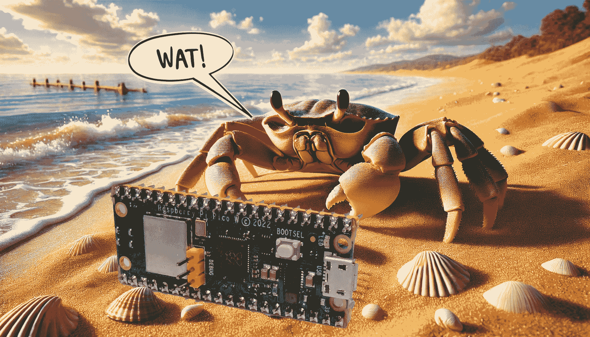
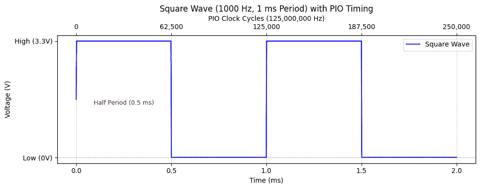
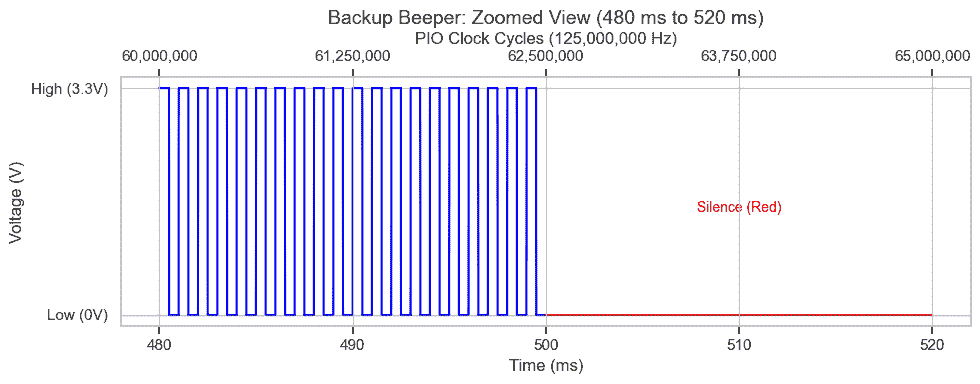
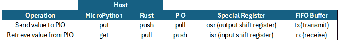
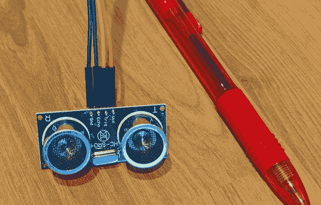

# 九个 Pico PIO Wat 与 Rust（第一部分）

> 原文：[`towardsdatascience.com/nine-pico-pio-wats-with-rust-part-1-9d062067dc25/`](https://towardsdatascience.com/nine-pico-pio-wats-with-rust-part-1-9d062067dc25/)



Pico PIO 惊喜 – 来源：[`openai.com/dall-e-2/`](https://openai.com/dall-e-2/)。所有其他图表均来自作者。

> 同样可用：[本文的 MicroPython 版本](https://medium.com/towards-data-science/nine-pico-pio-wats-with-micropython-part-1-82b80fb84473)

在 JavaScript 和其他语言中，我们称[令人惊讶或不一致的行为为“Wat!”](https://www.destroyallsoftware.com/talks/wat) [即“What!?”]。例如，在 JavaScript 中，一个空数组加一个空数组产生一个空字符串，`[] + [] === ""`。Wat!

与之相比，Rust 语言一致且可预测。然而，在 Raspberry Pi Pico 微控制器上的 Rust 语言有一个类似的惊喜。具体来说，Pico 的**可编程输入/输出（PIO）**子系统，虽然功能强大且用途广泛，但也存在一些特殊性。

PIO 编程很重要，因为它为精确、低级硬件控制挑战提供了一个巧妙的解决方案。它非常快且灵活：而不是依赖于特殊用途硬件来控制您可能想要控制的无数外围设备，PIO 允许您在软件中定义自定义行为，无缝适应您的需求，而不会增加硬件复杂性。

考虑这个简单的例子：一种类似$15 theremin 的音乐仪器。通过在空中挥动手臂，音乐家可以改变（诚然有些恼人的）音调。使用 PIO 提供了一种简单的方式来编程这个设备，确保它能即时响应动作。

因此，一切都很美好，除了——用蜘蛛侠的话来说：

> 权力越大……九个 Wat!？

我们将通过创建这个 theremin 来探索和展示这九个 PIO Wat。

**本文面向谁？**

+   **所有程序员**：像 Pico 这样的微控制器价格低于$7，并支持 Python、Rust 和 C/C++等高级语言。本文将展示微控制器如何让您的程序与物理世界交互，并介绍如何编程 Pico 的低级、高性能 PIO 硬件。

+   **Rust Pico 程序员**：对 Pico 的潜在能力感兴趣吗？除了其两个主要核心外，它还有八个专门用于 PIO 编程的微小“状态机”。这些状态机接管时间关键任务，为主处理器腾出空间进行其他工作，并实现令人惊讶的并行性。

+   **C/C++ Pico 程序员**：虽然本文使用 Rust，但 PIO 编程——无论是好是坏——在所有语言中几乎都是相同的。如果您在这里理解了它，您将能够很好地将其应用于 C/C++。

+   ***MicroPython Pico 程序员：**你可能想阅读[这篇文章的 MicroPython 版本](https://medium.com/towards-data-science/nine-pico-pio-wats-with-micropython-part-1-82b80fb84473)。*

+   **PIO 程序员**：通过九个 Wat 的旅程可能不会像 JavaScript 的怪癖那样有趣（幸运的是），但它将揭示 PIO 编程的奇特之处。如果你曾经觉得 PIO 编程令人困惑，这篇文章应该会让你放心，问题（不一定）是你——部分原因是 PIO 本身。最重要的是，理解这些 Wat 将使编写 PIO 代码变得更加简单和有效。

最后，这篇文章并不是关于“修复”PIO 编程的。PIO 在它的主要目的上表现出色：高效且灵活地处理自定义外围接口。其设计是有目的的，非常适合其目标。相反，这篇文章的重点是理解 PIO 编程及其怪癖——从奖励 Wat 开始。

## 奖励 Wat 0：“状态机”不是状态机——除非它们是

尽管名字叫作“PIO 状态机”，但树莓派 Pico 中的八个“PIO 状态机”在计算机科学的严格、正式意义上并不是状态机。一个经典的**[有限状态机 (FSM)](https://en.wikipedia.org/wiki/Finite-state_machine)**由有限个状态和转换组成，完全由输入符号驱动。相比之下，Pico 的 PIO 状态机是带有自己指令集的小型可编程处理器。与正式的 FSM 不同，它们有一个程序计数器、**[寄存器](https://en.wikipedia.org/wiki/Register_machine)**以及通过移位和递减来修改这些寄存器的**能力**，这使得它们能够存储中间值并影响执行流程，而不仅仅是固定的状态转换。

话虽如此，称它们为**[可编程状态机](https://www.reddit.com/r/raspberrypipico/comments/1idteeq/comment/ma5kgy0/)**是有道理的：它们的行为取决于它们执行的程序，而不是一个固定的预定义状态集。在大多数情况下，这个程序将定义一个状态机或类似的东西——特别是由于 PIO 经常用于实现精确、状态驱动的 I/O 控制。

每个 PIO 在每个时钟周期处理一条指令。$4 Pico 1 以每秒 1.25 亿个周期的速度运行，而$5 Pico 2 提供更快的每秒 1.5 亿个周期。每条指令执行一个简单的操作，例如“移动一个值”或“跳转到标签”。

随着奖励 Wat 的解决，让我们转向我们的第一个主要 Wat。

## Wat 1：寄存器饥饿游戏

在 PIO 编程中，一个 **寄存器** 是一个小的、快速的存储位置，它像状态机的变量一样工作。你可能梦想拥有大量的变量来存储你的计数器、延迟和临时值，但现实是残酷的：你只能得到两个通用寄存器，`x` 和 `y`。这就像《饥饿游戏》，无论有多少贡品进入竞技场，只有凯特尼斯和皮塔能成为胜利者。你必须无情地削减你的需求，以适应这两个寄存器，决定什么要优先考虑，什么要牺牲。同样，就像《饥饿游戏》一样，我们有时可以弯曲规则。

让我们从一项挑战开始：创建一个备用蜂鸣器 – 1000 Hz ½ 秒，静音 ½ 秒，重复。结果？“哔哔哔哔……”

我们希望有五个变量：

+   `half_period`：保持电压高然后低以创建 1000 Hz 音调所需的时钟周期数。这是 125,000,000 / 1000 / 2 = 62,500 个高周期和 62,500 个低周期。



生成 1000 Hz 方波音调所需的电压和时序（毫秒和时钟周期）。

+   `y`：循环计数器从 0 到 `half_period` 以创建延迟。

+   `period_count`：填充 ½ 秒时间所需的重复周期数。125,000,000 × 0.5 / (62,500 × 2) = 500。

+   `x`：循环计数器从 0 到 `period_count` 以填充 ½ 秒时间。

+   `silence_cycles`：½ 秒静音所需的时钟周期数。125,000,000 × 0.5 = 62,500,000。



我们想要五个寄存器，但只能有两个，所以游戏开始了！愿好运永远在您这边。

首先，我们可以消除 `silence_cycles`，因为它可以表示为 `half_period × period_count × 2`。虽然 PIO 不支持乘法，但它支持循环。通过嵌套两个循环——其中内部循环延迟 2 个时钟周期——我们可以创建 62,500,000 个时钟周期的延迟。

减少了一个变量，但我们如何消除另外两个呢？幸运的是，我们不必这样做。虽然 PIO 只提供了两个通用寄存器，`x` 和 `y`，但它还包括两个专用寄存器：`osr`（输出移位寄存器）和 `isr`（输入移位寄存器）。

我们一会儿将看到的 PIO 代码实现了备用蜂鸣器。这是它的工作原理：

**初始化**：

+   `pull block` 指令从缓冲区读取音调的半周期（62,500 个时钟周期）并将其值放入 `osr`。

+   然后将该值复制到 `isr` 以供以后使用。

+   第二个 `pull block` 从缓冲区读取周期计数（500 次重复）并将其值放入 `osr`，我们将其保留。

**蜂鸣循环**：

+   `mov x, osr` 指令将周期计数复制到 `x` 寄存器中，它作为外部循环计数器。

+   对于内部循环，`mov y, isr` 重复将半周期复制到 `y` 中，以创建音调的高低状态延迟。

**静音循环**：

+   静音循环与蜂鸣循环的结构相似，但不会设置任何引脚，因此它们仅作为延迟使用。

**包装和连续执行**：

+   `.wrap_target` 和 `.wrap` 指令定义了状态机的主循环。

+   在完成蜂鸣和静音循环后，状态机跳回到程序的开始附近，无限重复序列。

在这个大纲的基础上，以下是生成备用蜂鸣器信号的 PIO 汇编代码。

```py
.program backup

; Read initial configuration
    pull block         ; Read the half period of the beep sound
    mov isr, osr      ; Store the half period in ISR
    pull block        ; Read the period_count

.wrap_target          ; Start of the main loop

; Generate the beep sound
    mov x, osr        ; Load period_count into X
beep_loop:
    set pins, 1       ; Set the buzzer to high voltage (start the tone)
    mov y, isr        ; Load the half period into Y
beep_high_delay:
    jmp y--, beep_high_delay    ; Delay for the half period

    set pins, 0       ; Set the buzzer to low voltage (end the tone)
    mov y, isr        ; Load the half period into Y
beep_low_delay:
    jmp y--, beep_low_delay     ; Delay for the low duration

    jmp x--, beep_loop          ; Repeat the beep loop

; Silence between beeps
    mov x, osr        ; Load the period count into X for outer loop
silence_loop:
    mov y, isr        ; Load the half period into Y for inner loop
silence_delay:
    jmp y--, silence_delay [1]  ; Delay for two clock cycles (jmp + 1 extra)

    jmp x--, silence_loop       ; Repeat the silence loop

.wrap                 ; End of the main loop, jumps back to wrap_target
```

这是配置和运行备用蜂鸣器 PIO 程序的核心 Rust 代码。它使用 [Embassy](https://github.com/embassy-rs/embassy) 嵌入式应用程序框架。该函数初始化状态机，计算计时值（`half_period` 和 `period_count`），并将它们发送到 PIO。然后它播放蜂鸣序列 5 秒，然后进入一个无限循环。完整的源 [文件](https://github.com/CarlKCarlK/pico_pio/blob/main/examples/backup_demo.rs) 和 [项目](https://github.com/CarlKCarlK/pico_pio) 在 GitHub 上可用。

```py
async fn inner_main(_spawner: Spawner) -> Result<Never> {
    info!("Hello, back_up!");
    let hardware: Hardware<'_> = Hardware::default();
    let mut pio0 = hardware.pio0;
    let state_machine_frequency = embassy_rp::clocks::clk_sys_freq();
    let mut back_up_state_machine = pio0.sm0;
    let buzzer_pio = pio0.common.make_pio_pin(hardware.buzzer);
    back_up_state_machine.set_pin_dirs(Direction::Out, &amp;[&amp;buzzer_pio]);
    back_up_state_machine.set_config(&amp;{
        let mut config = Config::default();
        config.set_set_pins(&amp;[&amp;buzzer_pio]); // For set instruction
        let program_with_defines = pio_file!("examples/backup.pio");
        let program = pio0.common.load_program(&amp;program_with_defines.program);
        config.use_program(&amp;program, &amp;[]);
        config
    });
    back_up_state_machine.set_enable(true);
    let half_period = state_machine_frequency / 1000 / 2;
    let period_count = state_machine_frequency / (half_period * 2) / 2;
    info!(
        "Half period: {}, Period count: {}",
        half_period, period_count
    );
    back_up_state_machine.tx().wait_push(half_period).await;
    back_up_state_machine.tx().wait_push(period_count).await;
    Timer::after(Duration::from_millis(5000)).await;
    info!("Disabling back_up_state_machine");
    back_up_state_machine.set_enable(false);
    // run forever
    loop {
        Timer::after(Duration::from_secs(3_153_600_000)).await; // 100 years
    }
}
```

当您运行程序时，会发生以下情况：

> 旁注 1：**自行运行**在 Pico 上运行 Rust 代码最简单但往往令人沮丧的方法是在您的桌面上交叉编译它，并手动复制生成的文件。一个更好的方法是投资 $12 的 Raspberry Pi 调试探针，并在您的桌面上设置 **[[probe-rs](https://probe.rs/docs/getting-started/installation/)](https://probe.rs/)**。使用这种设置，您可以使用 `cargo run` 在桌面上自动编译，复制到您的 Pico，然后开始运行代码。更好的是，您的 Pico 代码可以使用 `info!` 语句将消息发送回您的桌面，您可以进行交互式断点调试。有关设置说明，请访问 probe-rs 网站。
> 
> 要听到声音，我连接了一个无源蜂鸣器、一个电阻和一个晶体管到 Pico。有关详细的布线图和零件清单，请查看 SunFounder 的 Kepler Kit 中的 [无源蜂鸣器说明](https://docs.sunfounder.com/projects/kepler-kit/en/latest/pyproject/py_pa_buz.html#py-pa-buz)。
> 
> 旁注 2：如果您唯一的目标是用 Pico 生成音调，则不需要 PIO。MicroPython 足够快，可以直接 [切换引脚](https://docs.sunfounder.com/projects/kepler-kit/en/latest/pyproject/py_pa_buz.html#py-pa-buz)，或者您可以使用 Pico 内置的 [脉冲宽度调制 (PWM) 功能](https://docs.micropython.org/en/latest/library/machine.PWM.html)。

### 注册饥饿游戏的替代结局

我们使用了四个寄存器——两个通用和两个特殊——来解决这个挑战。如果这个解决方案感觉不够令人满意，这里有一些可以考虑的替代方法：

**使用常量**：为什么要把 `half_period`、`period_count` 和 `silence_cycles` 变量都设置为变量？将常量“62,500”、“500”和“62,500,000”直接硬编码可以简化设计。然而，PIO 常量有一些限制，我们将在 **Wat 5** 中探讨。

**Pack Bits**: 寄存器可以存储 32 位。我们真的需要两个寄存器（2×32=64 位）来存储`half_period`和`period_count`吗？不。存储 62,500 只需要 16 位，而 500 只需要 9 位。我们可以将这些值打包到一个寄存器中，并使用`out`指令将值移位到`x`和`y`。这种方法可以释放`osr`或`isr`供其他任务使用，但一次只能释放一个——另一个寄存器必须持有打包的值。

**慢动作**：在 Rust 的 Embassy 框架中，你可以通过设置其`clock_divider`来配置一个运行在较低频率的 PIO 状态机。这允许状态机以高达~1907 Hz 的速度运行。以较慢的速度运行状态机意味着像`half_period`这样的值可以更小，可能小到`2`。较小的值更容易作为常量硬编码，并且可以更紧凑地打包到寄存器中。

### 寄存器饥饿游戏的快乐结局

寄存器饥饿游戏要求战略性的牺牲和创造性的解决方案，但通过利用 PIO 的特殊寄存器和巧妙的循环结构，我们最终取得了胜利。如果风险更高，其他技术可能有助于我们适应和生存。

但在一个领域的胜利并不意味着挑战就此结束。在下一个 Wat 中，我们面临新的考验：PIO 严格的 32 条指令限制。

## Wat 2：32 指令的便携式行李箱

恭喜！你只需花费$4 就购买了一次环球旅行的机会。但是，有一个条件？你必须把所有物品都塞进一个小型的便携式行李箱。同样，PIO 程序允许你创建令人难以置信的功能，但每个 PIO 程序都限制在仅 32 条指令。

**Wat！** 只有 32 条指令？这空间太小，无法装下所有你需要的东西！但通过巧妙的规划，你通常可以使其工作。


## 规则

+   没有 PIO 程序可以超过 32 条指令。

+   `wrap_target`和`wrap`指令不计入。

+   标签不计入。

+   Pico 1 包括八个状态机，分为两个四块。Pico 2 包括十二个状态机，分为三个四块。**每个块共享 32 条指令槽**。因此，由于一个块中的四个状态机都从相同的 32 条指令池中获取，如果一个机器的程序使用了所有 32 个槽位，那么其他三个就没有空间了。

## 当你的行李箱打不开时

如果你的想法不适合 PIO 指令槽，这些打包技巧可能有所帮助。**(免责声明：我并没有亲自尝试过所有这些。)*

```py
let half_period = state_machine_frequency / 1000 / 2;
back_up_state_machine.tx().push(half_period); // Using non-blocking push since FIFO is empty
let pull_block = pio_asm!("pull block").program.code[0];
unsafe {
    back_up_state_machine.exec_instr(pull_block);
}
```

+   **使用 PIO 的`exec`命令**：在你的状态机中，你可以使用 PIO 的`exec`机制动态执行指令。例如，你可以使用`out exec`执行存储在`osr`中的指令值。或者，你可以使用`mov exec, x`或`mov exec, y`直接从这些寄存器中执行指令。

现在行李打包好了，让我们加入多利特博士寻找传说中的生物的队伍。

## 奖励 Wat 2.5：多利特博士的 PIO Pushmi-Pullyu

*两位读者指出我遗漏了一个重要的 PIO Wat——所以这里有一个额外的内容!* 当编程 PIO 时，你会注意到一些奇怪的事情：

+   PIO **`pull`** 指令从 TX FIFO（**发送**缓冲区）接收值并将它们输入到**输出**移位寄存器（`osr`）。因此，它从输出输入并从接收发送。

+   同样，PIO **`push`** 指令从**输入**移位寄存器（`isr`）输出值并将它们发送到 RX FIFO（**接收**缓冲区）。因此，它从输入输出并从发送接收。

**Wat!?** 就像来自《多利特医生》故事的两位头[Pushmi-Pullyu](https://en.wikipedia.org/wiki/List_of_Doctor_Dolittle_characters#Pushmi-Pullyu)一样，似乎有些颠倒。但当你意识到 PIO 大多数事物都是从**主机视角**（MicroPython、Rust、C/C++）命名，而不是从 PIO 程序的角度看时，它开始变得有道理。

此表总结了指令、寄存器和缓冲区名称。（“FIFO”代表先进先出。）



拿着 Pushmi-Pullyu，我们接下来转向一个神秘场景。

## Wat 3: 拉取无阻塞“神秘”

在**Wat 1**中，我们将音频硬件编程为备用蜂鸣器。但这并不是我们乐器所需要的。相反，我们想要一个无限播放给定音调的 PIO 程序——直到它被告知播放新的音调。程序还应等待在给定特殊的“休息”音调时保持沉默。

在提供新的音调之前保持休息状态，使用`pull block`编程很容易——我们将在下面探讨细节。在特定频率播放音调也是直截了当的，建立在我们在**Wat 1**中完成的工作之上。

但我们如何检查新的音调，同时继续播放当前的音调呢？答案在于在`pull noblock`中使用“noblock”而不是“block”。现在，如果有新值，它将被加载到`osr`中，使程序能够无缝更新。

这里神秘开始的地方：如果调用`pull noblock`而没有新值，`osr`会发生什么？

我假设它会保持其之前的值。错了！也许它被重置为 0？再次错了！令人惊讶的真相：它得到`x`的值。为什么？（不，不是`y`——是`x`。）因为[Pico SDK](https://datasheets.raspberrypi.com/pico/raspberry-pi-pico-c-sdk.pdf)这么说。具体来说，3.4.9.2 节解释道：

> 在空 FIFO 上非阻塞的 PULL 与 MOV OSR, X 的效果相同。

了解`pull noblock`的工作原理很重要，但这里有一个更大的教训。将[Pico SDK 文档](https://datasheets.raspberrypi.com/pico/raspberry-pi-pico-c-sdk.pdf)像神秘小说的背面一样对待。不要试图独自解决所有问题——作弊！跳到“谁干的”部分，在 3.4 节中，仔细阅读你使用的每个命令的详细信息。阅读几段内容可以节省你数小时的困惑。

> 旁白：当即使 SDK 文档感觉不清楚时，转向 [RP2040](https://datasheets.raspberrypi.com/rp2040/rp2040-datasheet.pdf)（Pico 1）和 [RP2350](https://datasheets.raspberrypi.com/rp2350/rp2350-datasheet.pdf)（Pico 2）数据手册。这些百科全书——分别有 600 页和 1,300 页——就像全能的叙述者：它们提供了事实真相。

考虑到这一点，让我们看看一个实际例子。下面是播放持续音调和休止符的 PIO 程序。它使用 `pull block` 在休止期间等待输入，并使用 `pull noblock` 在播放音调时检查更新。

```py
.program sound

;  Rest until a new tone is received.
resting:
    pull block           ; Wait for a new delay value
    mov x, osr           ; Copy delay into X
    jmp !x resting       ; If delay is zero, keep resting

; Play the tone until a new delay is received.
.wrap_target             ; Start of the main loop
    set pins, 1          ; Set the buzzer high voltage.
high_voltage_loop:
    jmp x-- high_voltage_loop   ; Delay

    set pins, 0          ; Set the buzzer low voltage.
    mov x, osr           ; Load the half period into X.
low_voltage_loop:
    jmp x-- low_voltage_loop    ; Delay

; Read any new delay value. If none, keep the current delay.
    mov x, osr          ; set x, the default value for "pull(noblock)"
    pull noblock        ; Read a new delay value or use the default.

; If the new delay is zero, rest. Otherwise, continue playing the tone.    
    mov x, osr          ; Copy the delay into X.
    jmp !x resting      ; If X is zero, rest.
.wrap ; Continue playing the sound.
```

我们最终会在我们的类似 theremin 的乐器中使用这个 PIO 程序。现在，让我们通过播放熟悉的旋律来查看 PIO 程序的实际效果。这个演示使用“Twinkle, Twinkle, Little Star”来展示如何通过向状态机提供频率和持续时间来控制旋律。只需这段代码 ([完整文件](https://github.com/CarlKCarlK/pico_pio/blob/main/examples/sound_demo.rs) 和 [项目](https://github.com/CarlKCarlK/pico_pio))，你就可以让 Pico 唱歌！

```py
const TWINKLE_TWINKLE: [(u32, u64, &amp;str); 16] = [
    // Bar 1
    (262, 400, "Twin-"), // C
    (262, 400, "-kle"),  // C
    (392, 400, "twin-"), // G
    (392, 400, "-kle"),  // G
    (440, 400, "lit-"),  // A
    (440, 400, "-tle"),  // A
    (392, 800, "star"),  // G
    (0, 400, ""),        // rest
    // Bar 2
    (349, 400, "How"),  // F
    (349, 400, "I"),    // F
    (330, 400, "won-"), // E
    (330, 400, "-der"), // E
    (294, 400, "what"), // D
    (294, 400, "you"),  // D
    (262, 800, "are"),  // C
    (0, 400, ""),       // rest
];
async fn inner_main(_spawner: Spawner) -> Result<Never> {
    info!("Hello, sound!");
    let hardware: Hardware<'_> = Hardware::default();
    let mut pio0 = hardware.pio0;
    let state_machine_frequency = embassy_rp::clocks::clk_sys_freq();
    let mut sound_state_machine = pio0.sm0;
    let buzzer_pio = pio0.common.make_pio_pin(hardware.buzzer);
    sound_state_machine.set_pin_dirs(Direction::Out, &amp;[&amp;buzzer_pio]);
    sound_state_machine.set_config(&amp;{
        let mut config = Config::default();
        config.set_set_pins(&amp;[&amp;buzzer_pio]); // For set instruction
        let program_with_defines = pio_file!("examples/sound.pio");
        let program = pio0.common.load_program(&amp;program_with_defines.program);
        config.use_program(&amp;program, &amp;[]);
        config
    });
    sound_state_machine.set_enable(true);
    for (frequency, ms, lyrics) in TWINKLE_TWINKLE.iter() {
        if *frequency > 0 {
            let half_period = state_machine_frequency / frequency / 2;
            info!("{} -- Frequency: {}", lyrics, frequency);
            // Send the half period to the PIO state machine
            sound_state_machine.tx().wait_push(half_period).await;
            Timer::after(Duration::from_millis(*ms)).await; // Wait as the tone plays
            sound_state_machine.tx().wait_push(0).await; // Stop the tone
            Timer::after(Duration::from_millis(50)).await; // Give a short pause between notes
        } else {
            sound_state_machine.tx().wait_push(0).await; // Play a silent rust
            Timer::after(Duration::from_millis(*ms + 50)).await; // Wait for the rest duration + a short pause
        }
    }
    info!("Disabling sound_state_machine");
    sound_state_machine.set_enable(false);
    // run forever
    loop {
        Timer::after(Duration::from_secs(3_153_600_000)).await; // 100 years
    }
}
```

当你运行程序时，会发生以下情况：

我们解决了一个谜团，但总会有另一个挑战潜伏在角落里。在 **Wat 4** 中，我们将探讨当你的智能硬件带有陷阱——它也非常便宜时会发生什么。

## Wat 4：智能、便宜硬件：情感过山车

在声音工作后，我们转向使用 HC-SR04+ 超声波测距仪测量音乐家手的距离。这个小巧但强大的设备售价不到两美元。



HC-SR04+ 测距仪（笔用于标尺。）

这个小外围设备让我经历了“Wats!?！”的情感过山车：

+   **向上**：令人惊讶的是，这个 2 美元的测距仪包含自己的微控制器，使其更智能且易于使用。

+   **向下**：令人沮丧的是，那种“智能”的行为并不直观。

+   **向上**：方便的是，Pico 可以用 3.3V 或 5V 的电源为外围设备供电。

+   **向下**：不可预测的是，许多测距仪在 3.3V 下不可靠——或者直接失败——，并且在 5V 下可能会损坏你的 Pico。

+   **向上**：幸运的是，损坏的测距仪和 Pico 都很便宜，并且测距仪的双电压版本解决了我的问题。

### 详细信息

我最初认为当回声返回时，测距仪会将 **Echo** 引脚置高。我错了。

相反，测距仪会发出 8 个 40 kHz 的超声波脉冲模式（把它想象成狗的备用蜂鸣器）。紧接着，它将 **Echo** 置高。然后 Pico 应该开始测量 **Echo** 降至低的时间，这表示传感器检测到了模式——或者它超时了。

至于电压，文档指定测距仪在 5V 下运行。它似乎在 3.3V 下也能工作——直到它不能。大约在同一时间，当我的 Pico 继续使用 Rust（通过[调试探针](https://www.raspberrypi.com/documentation/microcontrollers/debug-probe.html)和[probe-rs](https://probe.rs/))工作时，它停止了与任何 MicroPython IDE 的工作，这些 IDE 依赖于特殊的 USB 协议。

因此，此时 Pico 和测距仪都损坏了。

在尝试了各种电缆、USB 驱动程序、编程语言，甚至一个旧的仅 5V 范围的测距仪后，我终于通过以下方式解决了问题：

+   继续使用 Rust 的 Pico，但切换到另一个 Pico 用于 MicroPython。

+   购买一个新的[双电压 3.3/5V 测距仪](https://www.amazon.com/dp/B0CRKHV4XY?ref=ppx_yo2ov_dt_b_fed_asin_title)，仍然每件只需 2 美元。

### Wat 4: 经验教训

当过山车回到站台时，我学到了两个关键教训。首先，多亏了微控制器，即使是简单的硬件也可能以非直观的方式表现，这需要仔细阅读文档。其次，虽然这款硬件很聪明，但它也很便宜——这意味着它容易出故障。当它出故障时，深呼吸，记住它只值几美元，然后更换它。

然而，硬件的怪癖只是故事的一部分。在**Wat 5**的第二部分中，我们将把注意力转回软件：PIO 编程语言本身。我们将揭示一种如此出乎意料的行为，可能会让你质疑你所知道的一切关于常量的知识。

* * *

这些就是用 MicroPython 编程 Pico PIO 的前四个 Wat。你可以在 GitHub 上找到[项目的代码](https://github.com/CarlKCarlK/pico_pio/)。

在**[第二部分](https://towardsdatascience.com/nine-pico-pio-wats-with-rust-part-2/)**中，我们将探索 Wat 5 到 9。这些将涵盖不稳定的常量、透过玻璃的条件、跳过跳跃、过多的引脚和笨拙的调试。我们还将揭示完成乐器的代码。

*[关注我在 Medium 上的账号](https://medium.com/@carlmkadie)，获取关于这篇文章和未来文章的更新通知。我主要撰写关于 Rust 和 Python 的科学编程、机器学习和统计学方面的文章。我通常每月发布一篇文章。*
