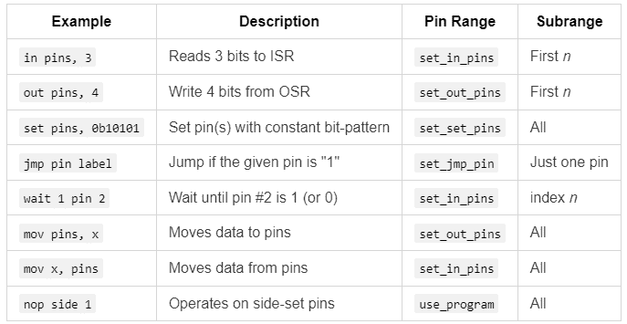

# Rust 中的九个 Pico PIO Wat（第二部分）

> 原文：[`towardsdatascience.com/nine-pico-pio-wats-with-rust-part-2/`](https://towardsdatascience.com/nine-pico-pio-wats-with-rust-part-2/)

这是探索使用 Rust 编程 Raspberry Pi Pico PIO 时意外怪癖的第二部分。如果你错过了[第一部分](https://towardsdatascience.com/nine-pico-pio-wats-with-rust-part-1-9d062067dc25/)，我们揭露了四个*Wat*，挑战了关于寄存器数量、指令槽、`pull noblock`的行为以及智能且经济的硬件的假设。

现在，我们继续我们的旅程，朝着制作一个类似特雷门琴的音乐乐器前进——这个项目揭示了一些 PIO 编程的怪癖和困惑。准备好以莎士比亚悲剧的方式挑战你对常量的理解。

## Wat 5：不恒定的常量

在 PIO 编程的世界里，常量应该是可靠、坚定，并且，嗯，*恒定的*。但假如它们不是呢？这让我们对如何处理较大常量的 PIO 中的设置指令——或者不处理——产生了疑惑。

就像朱丽叶怀疑罗密欧的恒定性一样，你可能会发现自己想知道 PIO 常量是否会像她说的那样，“证明同样多变。”

## 问题：常量并不像看起来那么大

想象你正在编写一个超声波测距仪的代码，需要从 500 开始计数，同时等待 Echo 信号从高电平变为低电平。为了在 PIO 中设置这个等待时间，你可能天真地尝试直接使用`set`加载常量值：

```py
; In Rust, be sure 'config.shift_in.direction = ShiftDirection::Left;'
set y, 15       ; Load upper 5 bits (0b01111)
mov isr, y      ; Transfer to ISR (clears ISR)
set y, 20       ; Load lower 5 bits (0b10100)
in y, 5         ; Shift in lower bits to form 500 in ISR
mov y, isr      ; Transfer back to y
```

> *旁白：不要试图理解这里的疯狂* *jmp* *操作。我们将在* ***Wat 6*****中讨论这些。

但这里有一个悲剧性的转折：PIO 中的设置指令限制在 0 到 31 之间的常量。此外，那个命运多舛的设置指令不会报告错误。相反，[它静默地破坏了整个 PIO 指令](https://forums.raspberrypi.com/viewtopic.php?p=2289656#p2289173)。这会产生一个无意义的输出。

## 不恒定常量的解决方案

为了解决这个问题，考虑以下方法：

+   **读取值并将它们存储在寄存器中：** 我们在**Wat 1**中看到了这种方法。你可以将你的常量加载到`osr`寄存器中，然后将其传输到 y。例如：

```py
# Read the max echo wait into OSR.
pull                    ; same as pull block
mov y, osr              ; Load max echo wait into Y
```

+   **移位和组合较小的值：** 使用`isr`寄存器和`in`指令，你可以构建任何大小的常量。然而，这会消耗你的 32 操作预算中的时间和操作（参见[第一部分](https://towardsdatascience.com/nine-pico-pio-wats-with-rust-part-1-9d062067dc25/)，**Wat 2**）。

```py
; In Rust, be sure 'config.shift_in.direction = ShiftDirection::Left;'

set y, 15       ; Load upper 5 bits (0b01111)
mov isr, y      ; Transfer to ISR (clears ISR)
set y, 20       ; Load lower 5 bits (0b10100)
in y, 5         ; Shift in lower bits to form 500 in ISR
mov y, isr      ; Transfer back to y
```

+   **减慢计时速度**：降低状态机的频率，以在更多的系统时钟周期中扩展延迟。例如，将状态机速度从 125 MHz 降低到 343 kHz，将超时常量`182`、`216`降低到`500`。

+   **使用额外的延迟和（嵌套）循环：** 所有指令都支持可选的延迟，允许你添加多达 31 个额外的周期。（为了生成更长的延迟，可以使用循环——甚至嵌套循环。）

```py
; Generate 10μs trigger pulse (4 cycles at 343_000Hz)
set pins, 1 [3]       ; Set trigger pin to high, add delay of 3
set pins, 0           ; Set trigger pin to low voltage
```

+   **使用“减法技巧”生成最大 32 位整数**：在 Wat 7 中，我们将探讨一种通过减法生成 `4,294,967,295`（最大无符号 32 位整数）的方法。

就像朱丽叶警告人们不要向不稳定的月亮发誓一样，我们发现 PIO 常量并不总是像看起来那样坚定不移。然而，就像他们的故事会有意想不到的转折一样，我们的故事也是如此，从常量的不稳定性转向条件的不平衡性。在下一个 Wat 中，我们将探讨 PIO 处理条件跳转的方式可能会让你对其对逻辑的忠诚度产生怀疑。

## Wat 6：条件语句通过镜子看

在大多数编程环境中，逻辑条件感觉是平衡的：你可以测试引脚是高电平还是低电平，或者检查寄存器是否相等或不相等。但在 PIO 中，这种对称性被打破了。你可以跳转到高电平引脚，但不能跳转到低电平引脚，以及 `x!=y`，但不能 `x==y`。规则是任性的——就像《通过镜子看》中的 Humpty Dumpty：“当我定义一个条件时，它意味着我选择它所代表的意思——既不多也不少。”

这些怪癖迫使我们重写代码以适应不平衡的逻辑，从而在我们希望代码能如何编写和我们必须如何编写之间产生鸿沟。

## 问题：不平衡条件在实际中的应用

考虑一个简单的场景：使用测距仪，你想从最大等待时间（y）开始倒计时，直到超声波回声引脚变低。直观地，你可能会这样编写逻辑：

```py
measure_echo_loop:
 jmp !pin measurement_complete   ; If echo voltage is low, measurement is complete
 jmp y-- measure_echo_loop       ; Continue counting down unless timeout
```

在处理测量时，如果我们只想输出与上一个值不同的值，我们会这样写：

```py
measurement_complete:
 jmp x==y cooldown             ; If measurement is the same, skip to cool down
 mov isr, y                    ; Store measurement in ISR
 push                          ; Output ISR
 mov x, y                      ; Save the measurement in X
```

不幸的是，PIO 不允许你直接测试 `!pin` 或 `x==y`。你必须重新构建你的逻辑以适应可用的条件语句，例如 `pin` 和 `x!=y`。

## 解决方案：必须这样做的方式

由于 PIO 的限制，我们采用两步法来调整我们的逻辑，以确保即使缺少条件语句也能实现所需的行为：

+   跳转到相反的条件语句以跳过两个指令。

+   接下来，使用无条件跳转到达目标位置。

这个解决方案增加了一个额外的跳转（影响指令限制），但额外的标签是免费的。

这里是重新编写的代码，用于倒计时直到引脚变低：

```py
measure_echo_loop:
   jmp pin echo_active     ; if echo voltage is high continue count down
   jmp measurement_complete ; if echo voltage is low, measurement is complete
echo_active:
   jmp y-- measure_echo_loop ; Continue counting down unless timeout
```

以下是处理测量的代码，以便它只输出不同的值：

```py
measurement_complete:
   jmp x!=y send_result    ; if measurement is different, then send it.
   jmp cooldown            ; If measurement is the same, don't send.

send_result:
   mov isr, y              ; Store measurement in ISR
   push                    ; Output ISR
   mov x, y               ; Save the measurement in X
```

## 从 Humpty Dumpty 的条件语句中得到的教训

在《通过镜子看》中，爱丽丝学会了在 Humpty Dumpty 的奇特世界中导航——就像你将学会在 PIO 的不平衡条件奇境中导航。

但一旦你掌握了一个怪癖，另一个怪癖就会显现出来。在下一个 Wat 中，我们将揭示 jmp 的一个令人惊讶的行为，如果它是一名运动员，将会打破世界纪录。

# Wat 7：跳过过多

在[第一部分](https://towardsdatascience.com/nine-pico-pio-wats-with-rust-part-1-9d062067dc25/)的**Wat 1**和**Wat 3**中，我们看到了`jmp x--`或`jmp y--`是如何通过递减寄存器直到它达到 0 来循环固定次数的。这很简单，对吧？但当我们运行以下指令时 y 为 0 会发生什么呢？

```py
jmp y-- measure_echo_loop
```

如果你猜到它不会跳转到`measure_echo_loop`而是直接执行下一条指令，你完全正确。但为了满分，请回答：**指令执行后 y 的值是多少？**

答案：**4,294,967,295**。为什么？因为 y 在测试为零之后才会递减。*哇！*

> 顺便说一句：如果你对此不感到惊讶，你很可能有 C 或 C++的经验，它们区分了前增量（例如，`++x`）和后增量（例如，x++）操作。`jmp y--`的行为等同于后递减，其中值在递减之前被测试。

这个值，4,294,967,295，是 32 位无符号整数的最大值。这就像田径长跳远运动员从起跳板起飞，但不是落在沙坑里，而是飞越并最终落在另一个大陆上。

> 顺便说一句：正如在**Wat 5**中预示的那样，我们可以有意使用这种行为将寄存器设置为 4,294,967,295 的值。

现在我们已经学会了如何使用`jmp`来稳稳着陆，让我们看看我们是否可以避免被 PIO 读取和设置的引脚所困扰。

# Wat 8：太多的“pins”

在苏斯博士的《太多的大卫》中，麦克凯夫夫人有 23 个儿子，他们都叫大卫，每当她叫出他们的名字时，就会引起无尽的混乱。在 PIO 编程中，`pin`和`pins`可以根据上下文指代完全不同的引脚范围。很难知道你在和哪个大卫或大卫们说话。

## 问题：引脚范围和子范围

在 PIO 中，`pin`和`pins`指令都依赖于在 PIO 外部定义的**引脚范围**。然而，单个指令通常操作于这些引脚范围的**子范围**。行为会根据命令的不同而变化：子范围可能是该范围的第一个*n*个引脚、所有引脚，或者由索引指定的特定引脚。为了阐明 PIO 的行为，我创建了以下表格：



此表展示了 PIO 在不同指令中如何解释`pin`和`pins`这两个术语，以及它们相关的上下文和配置。

## 示例：测距仪的距离程序

这是一个使用**触发**和**回声**引脚测量物体距离的 PIO 程序。此程序的关键特性包括：

+   **连续操作**：测距仪尽可能快地循环运行。

+   **最大范围限制**：测量值被限制在给定的距离，如果未检测到物体，则返回值为`4,294,967,295`。

+   **过滤输出**：只有与直接前驱不同的测量值会被发送，从而降低了输出速率。

快速浏览一下程序，你会注意到尽管它通过两个引脚——**触发**和**回声**——在整个程序中工作，但我们只看到了`pin`和`pins`。

```py
.program distance

; X is the last value sent. Initialize it to
; u32::MAX which means 'echo timeout'
; (Set X to u32::MAX by subtracting 1 from 0)
   set x, 0
subtraction_trick:
   jmp x-- subtraction_trick

; Read the max echo wait into OSR
   pull                         ; same as pull block

; Main loop
.wrap_target
   ; Generate 10μs trigger pulse (4 cycles at 343_000Hz)
   set pins, 0b1 [3]       ; Set trigger pin to high, add delay of 3
   set pins, 0b0           ; Set trigger pin to low voltage

   ; When the trigger goes high, start counting down until it goes low
   wait 1 pin 0            ; Wait for echo pin to be high voltage
   mov y, osr              ; Load max echo wait into Y

measure_echo_loop:
   jmp pin echo_active     ; if echo voltage is high continue count down
   jmp measurement_complete ; if echo voltage is low, measurement is complete
echo_active:
   jmp y-- measure_echo_loop ; Continue counting down unless timeout

; Y tells where the echo countdown stopped. It
; will be u32::MAX if the echo timed out.
measurement_complete:
   jmp x!=y send_result    ; if measurement is different, then sent it.
   jmp cooldown            ; If measurement is the same, don't send.

send_result:
   mov isr, y              ; Store measurement in ISR
   push                    ; Output ISR
   mov x, y               ; Save the measurement in X

; Cool down period before next measurement
cooldown:
   wait 0 pin 0           ; Wait for echo pin to be low
.wrap                      ; Restart the measurement loop
```

#### **配置引脚**

为了确保 PIO 程序按预期运行：

+   `set pins, 0b1`应该控制**触发**引脚。

+   `wait 1 pin 0`应该监控**回声**引脚。

+   `jmp pin echo_active`也应该监控**回声**引脚。

这是在 Rust 中如何配置它（随后是解释）：

```py
let mut distance_state_machine = pio1.sm0;
let trigger_pio = pio1.common.make_pio_pin(hardware.trigger);
let echo_pio = pio1.common.make_pio_pin(hardware.echo);
distance_state_machine.set_pin_dirs(Direction::Out, &[&trigger_pio]);
distance_state_machine.set_pin_dirs(Direction::In, &[&echo_pio]);
distance_state_machine.set_config(&{
   let mut config = Config::default();
   config.set_set_pins(&[&trigger_pio]); // For set instruction
   config.set_in_pins(&[&echo_pio]); // For wait instruction
   config.set_jmp_pin(&echo_pio); // For jmp instruction
   let program_with_defines = pio_file!("examples/distance.pio");
   let program = pio1.common.load_program(&program_with_defines.program);
   config.use_program(&program, &[]); // No side-set pins
   config
});
```

这里的关键是`<strong>set_set_pins</strong>`、`<strong>set_in_pins</strong>`和`**set_jmp_pin**`方法在`Config`结构体上的应用。

+   `set_in_pins`：指定用于**输入操作**的引脚，例如`wait(1, pin, …)`。这些“输入”引脚也必须是连续的。

+   `set_set_pins`：配置用于**设置操作**的引脚，如`set(pins, 1)`。这些“设置”引脚也必须是连续的。

+   `set_jmp_pin`：定义用于**条件跳转**的单个引脚，例如`jmp(pin, ...)`。

如表格中所述，其他可选输入包括：

+   `set_out_pins`：为**输出操作**设置连续引脚，例如`out(pins, …)`。

+   `use_program`：设置 a)加载的程序和 b)用于**边设置操作**的连续引脚。边设置操作允许在执行其他指令时同时切换引脚。

#### **配置多个引脚**

虽然这个程序不需要，但你可以通过提供连续引脚的切片来在 PIO 中配置一系列引脚。例如，假设我们有两个超声波测距仪：

```py
let trigger_a_pio = pio1.common.make_pio_pin(hardware.trigger_a);
let trigger_b_pio = pio1.common.make_pio_pin(hardware.trigger_b);
config.set_set_pins(&[&trigger_a_pio, &trigger_b_pio]);
```

然后一条指令可以控制这两个引脚：

```py
set pins, 0b11 [3]  # Sets both trigger pins (17, 18) high, adds delay
set pins, 0b00      # Sets both trigger pins low
```

这种方法让你能够高效地将位模式应用于多个引脚，从而简化涉及多个输出的应用的控件。

> **旁白：编程中的“设置”一词** 
> 
> 在编程中，“设置”这个词因其多重含义而臭名昭著。在 PIO 的上下文中，“设置”指的是你可以分配值的对象——例如引脚的状态。它**不**意味着事物集合，正如它在其他编程上下文中经常做的那样。当 PIO 指代集合时，通常使用“范围”这个词。这种区别对于避免在处理 PIO 时产生混淆至关重要。

## 麦克凯夫夫人的教训

在《太多戴夫》中，麦克凯夫夫人哀叹没有给她 23 个戴夫起更独特的名字。你可以通过在你的注释中用有意义的名字——如**触发**和**回声**——清楚地记录你的引脚来避免她的错误。

但如果你认为处理这些引脚范围很棘手，调试一个 PIO 程序则增加了全新的挑战层。在下一个 Wat 中，我们将深入了解可用的笨拙调试方法。让我们看看我们能把它们推进多远。

# Wat 9：笨拙的调试

我喜欢在 VS Code 中使用交互式断点进行调试。我还做**打印调试**，即在代码中插入临时的信息语句来查看代码正在做什么以及变量的值。使用 [**树莓派调试探头**](https://www.raspberrypi.com/documentation/microcontrollers/debug-probe.html) 和 [**probe-rs**](https://probe.rs/)，我可以在 Pico 上的常规 Rust 代码中做这两件事。

然而，使用 PIO 编程，我却无法做到这些。

备选方案是**按打印调试**。在 PIO 中，你暂时输出感兴趣的整数值。然后在 Rust 中，你使用 `info!` 来打印这些值以供检查。

例如，在下面的 PIO 程序中，我们临时添加指令来推送 `x` 的值以进行调试。我们还包括 `set` 和 `out` 来推送一个常数，例如 7，这个常数必须在 0 到 31 之间（包含 0 和 31）。

```py
.program distance

; X is the last value sent. Initialize it to
; u32::MAX which means 'echo timeout'
; (Set X to u32::MAX by subtracting 1 from 0)
   set x, 0
subtraction_trick:
   jmp x-- subtraction_trick

; DEBUG: See the value of x
   mov isr, x
   push

; Read the max echo wait into OSR
   pull                         ; same as pull block

; DEBUG: Send constant value
   set y, 7           ; Push '7' so that we know we've reached this point
   mov isr, y
   push
; ...
```

在 Rust 中，你可以读取并打印这些值以帮助理解 PIO 代码中的情况（[完整代码](https://github.com/CarlKCarlK/pico_pio/blob/main/examples/distance_debug.rs) 和 [项目](https://github.com/CarlKCarlK/pico_pio/)）：

```py
 // ...
   distance_state_machine.set_enable(true);
   distance_state_machine.tx().wait_push(MAX_LOOPS).await;
   loop {
       let end_loops = distance_state_machine.rx().wait_pull().await;
       info!("end_loops: {}", end_loops);
   }
  // ... 
```

输出：

```py
INFO  Hello, debug!
└─ distance_debug::inner_main::{async_fn#0} @ examples\distance_debug.rs:27
INFO  end_loops: 4294967295
└─ distance_debug::inner_main::{async_fn#0} @ examples\distance_debug.rs:57
INFO  end_loops: 7
└─ distance_debug::inner_main::{async_fn#0} @ examples\distance_debug.rs:57
```

当按打印调试不够用时，你可以转向硬件工具。我买了我第一台示波器（**FNIRSI DSO152**，售价 37 美元）。有了它，我能够确认**回波**信号是正常工作的。然而，**触发**信号对于这个廉价的示波器来说太快，无法清晰地捕捉。

使用这些方法——特别是按打印调试——你可以追踪你的 PIO 程序的流程，即使没有传统的调试器。

> *旁白***：在 C/C++（以及可能 Rust）中，你可以通过使用* [***piodebug*** *项目](https://github.com/PaulAccisano/piodebug)** 来获得更接近完整的 PIO 调试体验。

这九个 Wat 就这样结束了，但让我们在奖励 Wat 中将所有内容结合起来。

# 奖励 Wat 10：将所有内容组合在一起

现在所有组件都已准备就绪，是时候将它们组合成一个工作原理的类似 theremin 的乐器了。我们需要一个 Rust 监视程序。这个程序启动两个 PIO 状态机——一个用于测量距离，另一个用于生成音调。然后它等待新的距离测量值，将该距离映射到音调，并将相应的音调频率发送到播放音调的状态机。如果距离超出范围，它将停止播放音调。

**Rust 的位置**：在这个系统的核心是一个将距离（从 0 到 50 厘米）映射到音调（大约**B2**到**F5**）的功能。这个功能在 Rust 中编写起来很简单，利用 Rust 的浮点数数学和指数运算。由于它的指令集有限且缺乏浮点数支持，在 PIO 中实现这一点几乎是不可能的。

这是运行 theremin 的核心监视程序（[完整文件](https://github.com/CarlKCarlK/pico_pio/blob/main/examples/theremin.rs) 和 [项目](https://github.com/CarlKCarlK/pico_pio/)）：

```py
sound_state_machine.set_enable(true);
distance_state_machine.set_enable(true);
distance_state_machine.tx().wait_push(MAX_LOOPS).await;
loop {
   let end_loops = distance_state_machine.rx().wait_pull().await;
   match loop_difference_to_distance_cm(end_loops) {
       None => {
           info!("Distance: out of range");
           sound_state_machine.tx().wait_push(0).await;
       }
       Some(distance_cm) => {
           let tone_frequency = distance_to_tone_frequency(distance_cm);
           let half_period = sound_state_machine_frequency / tone_frequency as u32 / 2;
           info!("Distance: {} cm, tone: {} Hz", distance_cm, tone_frequency);
           sound_state_machine.tx().push(half_period); // non-blocking push
           Timer::after(Duration::from_millis(50)).await;
       }
   }
}
```

使用两个 PIO 状态机与一个 Rust 监视程序一起，您可以同时运行三个程序。这种设置本身就非常方便，当需要严格的时序或非常高频的 I/O 操作时，这是必不可少的。

> ***旁白：*** *或者，Rust Embassy 的异步任务允许您在单个主处理器上直接实现协作多任务。您用 Rust 编码，而不是 Rust 和 PIO 的混合。尽管 Embassy 任务并非真正并行运行，但它们切换得足够快，可以处理类似 theremin 这样的应用。以下是从* [*theremin_no_pio.rs*](https://github.com/CarlKCarlK/pico_pio/blob/main/examples/theremin_no_pio.rs) *中摘录的类似核心循环片段：*

```py
loop {
       match distance.measure().await {
           None => {
               info!("Distance: out of range");
               sound.rest().await;
           }
           Some(distance_cm) => {
               let tone_frequency = distance_to_tone_frequency(distance_cm);
               info!("Distance: {} cm, tone: {} Hz", distance_cm, tone_frequency);
               sound.play(tone_frequency).await;
               Timer::after(Duration::from_millis(50)).await;
           }
       }
   }
```

*请参阅我们* [*最近关于 Rust Embassy 编程的文章*](https://medium.com/@carlmkadie/how-rust-embassy-shine-on-embedded-devices-part-1-9f4911c92007) *以获取更多详细信息。*

现在我们已经组装好了所有组件，让我们再次观看我“演奏”乐器时的视频。在监视器屏幕上，您可以看到显示距离测量和相应音调的调试打印信息。这种视觉连接突出了系统如何实时响应。

### **结论**

在 Raspberry Pi Pico 上进行 PIO 编程是一种简单与复杂的迷人结合，提供了无与伦比的硬件控制，同时要求开发者改变习惯于高级编程的思维模式。通过我们探索的九个方面，PIO 既有其局限性让我们感到惊讶，也有其原始效率让我们印象深刻。

虽然我们已经覆盖了重要的内容——管理状态机、引脚分配、时序细节和调试——但仍有更多内容可以根据需要学习：DMA、IRQ、侧置引脚、Pico 1 和 Pico 2 上 PIO 的区别、自动推送和自动拉取、FIFO 联接等。

**推荐资源**

+   [GitHub 上的此项目代码](https://github.com/CarlKCarlK/pico_pio/)

+   [Pico SDK 手册](https://datasheets.raspberrypi.com/pico/raspberry-pi-pico-c-sdk.pdf)，第三章

+   [Embassy PIO API 文档](https://docs.embassy.dev/embassy-rp/git/rp2040/pio/index.html)

+   [RP2040](https://datasheets.raspberrypi.com/rp2040/rp2040-datasheet.pdf)（Pico 1）和 [RP2350](https://datasheets.raspberrypi.com/rp2350/rp2350-datasheet.pdf)（Pico 2）数据手册

在其核心，PIO 的特性反映了优先考虑低级硬件控制且开销最小化的设计理念。通过拥抱这些特性，PIO 不仅能够满足您项目的需求，还能为嵌入式系统编程开辟新的可能性。

*请* [*关注卡尔在 Towards Data Science*](https://towardsdatascience.com/author/carlmkadie/) *和* [@carlkadie.bsky.social](https://bsky.app/profile/carlkadie.bsky.social)*。我主要撰写关于 Rust 和 Python 的科学编程、机器学习和统计学方面的文章。我通常每月撰写一篇文章。
