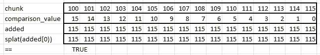
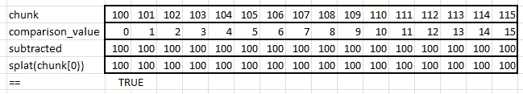
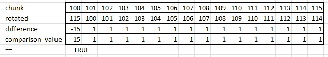
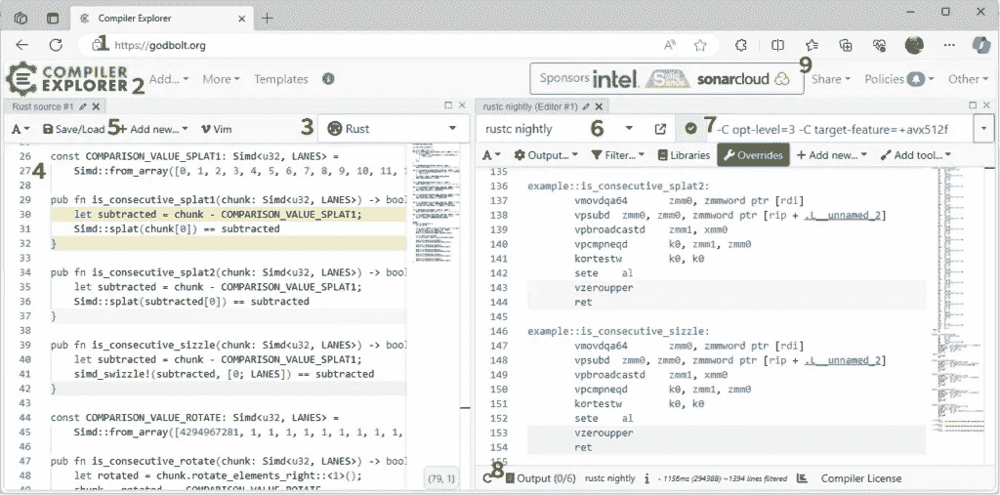
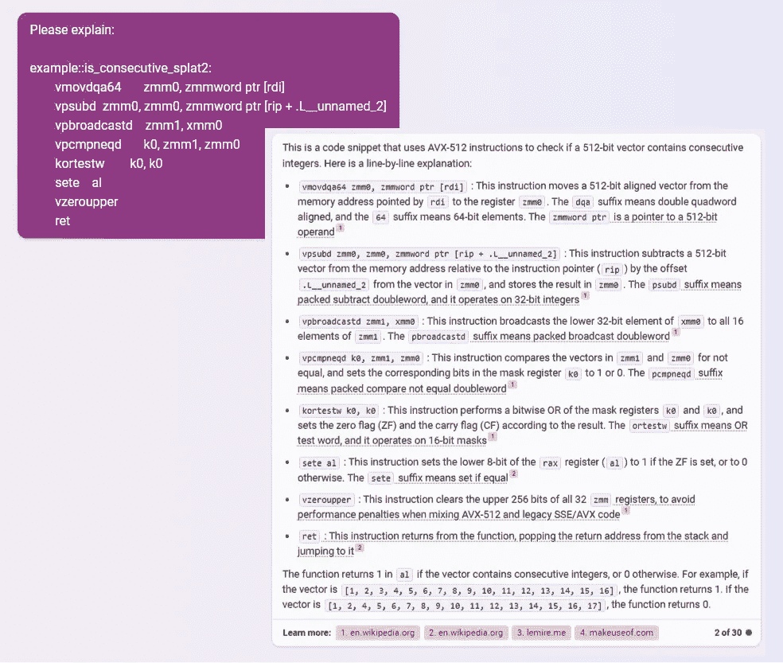

# Nine Rules for SIMD Acceleration of Your Rust Code (Part 1)

> 原文：[`towardsdatascience.com/nine-rules-for-simd-acceleration-of-your-rust-code-part-1-c16fe639ce21/`](https://towardsdatascience.com/nine-rules-for-simd-acceleration-of-your-rust-code-part-1-c16fe639ce21/)
> 
> *感谢 Ben Lichtman（B3NNY）在西雅图 Rust Meetup 上为我指明了 SIMD 的正确方向。*

[SIMD](https://en.wikipedia.org/wiki/Single_instruction,_multiple_data)（单指令，多数据）操作自 2000 年代初以来一直是 Intel/AMD 和 ARM CPU 的特性。这些操作使你能够，例如，仅用一个 CPU 操作**在单个核心**上对八个`i32`数组进行加法运算，并将结果加到另一个八个`i32`数组上。使用 SIMD 操作可以大大加快某些任务的执行速度。如果你没有使用 SIMD，你可能没有充分利用 CPU 的能力。

这是不是又一篇“另一种 Rust 和 SIMD”的文章？是的，也不是。是的，我确实将 SIMD 应用于一个编程问题，然后觉得有必要写一篇文章来讨论它。不，我希望这篇文章也足够深入，能够指导你完成**你的**项目。它解释了 Rust nightly 中新可用的 SIMD 功能和设置。它包括一个 Rust SIMD 速查表。它展示了如何在不离开安全 Rust 的情况下使你的 SIMD 代码通用。它使用 Godbolt 和 Criterion 等工具帮助你入门。最后，它介绍了新的 cargo 命令，使这个过程更加容易。

* * *

`range-set-blaze` crate 使用其`RangeSetBlaze::from_iter`方法来处理可能很长的整数序列。当整数“密集”时，它可以比 Rust 的标准`HashSet::from_iter`快**30 倍**[（[bench.md](https://github.com/CarlKCarlK/range-set-blaze/blob/main/docs/bench.md)）]。如果我们使用 SIMD 操作，我们能做得更好吗？是的！

> *请参阅[此文档](https://docs.rs/range-set-blaze/latest/range_set_blaze/struct.RangeSetBlaze.html#constructor-performance)了解“密集”的定义。此外，如果整数不是密集分布，会发生什么？`RangeSetBlaze`比`HashSet`慢**2 到 3 倍**[（[slower](https://github.com/CarlKCarlK/range-set-blaze/blob/main/docs/bench.md)）]。

在处理密集整数时，`RangeSetBlaze::from_slice`——一个基于 SIMD 操作的新方法——比`RangeSetBlaze::from_iter`快 7 倍。这使得它比`HashSet::from_iter`快 200 多倍。（当整数不是密集分布时，它仍然比`HashSet`慢 2 到 3 倍。）

在实现这个加速的过程中，我学到了九条规则，可以帮助你通过 SIMD 操作加速你的项目。

规则是：

1.  使用 nightly Rust 和`core::simd`，Rust 的实验性标准 SIMD 模块。

1.  CCC：检查，控制，并选择你电脑的 SIMD 能力。

1.  学习`core::simd`，但要有所选择。

1.  思考候选算法。

1.  使用 Godbolt 和 AI 来理解你的代码的汇编，即使你不知道汇编语言。

1.  通过内联泛型、（如果那不行）宏、（如果那不行）特性将所有类型和 LANEs 进行泛化。

查看 [第二部分](https://towardsdatascience.com/nine-rules-for-simd-acceleration-of-your-rust-code-part-2-6a104b3be6f3) 中的这些规则：

*7. 使用 Criterion 基准测试来选择算法，并发现 LANE 应该（几乎）总是 32 或 64。*

*8. 使用 `as_simd`、针对 `i128/u128` 的特殊代码以及额外的上下文基准测试将最佳 SIMD 算法集成到你的项目中。*

*9. 从项目中提取最佳 SIMD 算法（目前）并使用可选的 cargo 功能。*

*此外：为了避免犹豫不决，我称这些为“规则”，但它们当然只是建议。*

## 规则 1：使用 nightly Rust 和 `core::simd`，Rust 的实验性标准 SIMD 模块。

Rust 可以通过稳定的 [`core::arch`](https://doc.rust-lang.org/core/arch/index.html) 模块或通过 nighty 的 [`core::simd`](https://doc.rust-lang.org/nightly/core/simd/struct.Simd.html) 模块来访问 SIMD 操作。让我们比较它们：

**`core::arch`**

+   Stable

+   [“[N]ot the easiest thing in the world](https://doc.rust-lang.org/core/arch/index.html#ergonomics)”]

+   为你的 crate 的下游用户提供高性能。例如，因为 [regex](https://github.com/BurntSushi/regex) 和 [`memchr`](https://github.com/BurntSushi/memchr) 采取了这条路线，超过 10 万个其他 crate 免费获得了稳定的 SIMD 加速。[[Reddit 讨论](https://www.reddit.com/r/rust/comments/18hj1m6/comment/kdbfktb/?utm_source=share&utm_medium=web2x&context=3)，[一些相关的 `memchr` 代码](https://github.com/BurntSushi/memchr/blob/master/src/arch/x86_64/memchr.rs)]]

**`core::simd`**

+   Nightly

+   令人愉快且易于携带。

+   限制下游用户使用 nightly 版本。

我决定选择“简单”。如果你决定走更难的路，先从简单的路径开始可能仍然值得。

* * *

在我们尝试在更大的项目中使用 SIMD 操作之前，让我们确保我们能够使它们正常工作。以下是步骤：

首先，创建一个名为 `simd_hello` 的项目：

```py
cargo new simd_hello
cd simd_hello
```

编辑 `src/main.rs` 以包含 ([Rust playground](https://play.rust-lang.org/?version=nightly&mode=debug&edition=2021&gist=e39aa876c0abed9915d389fe73687839))：

```py
// Tell nightly Rust to enable 'portable_simd'
#![feature(portable_simd)]
use core::simd::prelude::*;

// constant Simd structs
const LANES: usize = 32;
const THIRTEENS: Simd<u8, LANES> = Simd::<u8, LANES>::from_array([13; LANES]);
const TWENTYSIXS: Simd<u8, LANES> = Simd::<u8, LANES>::from_array([26; LANES]);
const ZEES: Simd<u8, LANES> = Simd::<u8, LANES>::from_array([b'Z'; LANES]);

fn main() {
    // create a Simd struct from a slice of LANES bytes
    let mut data = Simd::<u8, LANES>::from_slice(b"URYYBJBEYQVQBUBCRVGFNYYTBVATJRYY");

    data += THIRTEENS; // add 13 to each byte

    // compare each byte to 'Z', where the byte is greater than 'Z', subtract 26
    let mask = data.simd_gt(ZEES); // compare each byte to 'Z'
    data = mask.select(data - TWENTYSIXS, data);

    let output = String::from_utf8_lossy(data.as_array());
    assert_eq!(output, "HELLOWORLDIDOHOPEITSALLGOINGWELL");
    println!("{}", output);
}
```

接下来——完整的 SIMD 功能需要 Rust 的 nightly 版本。假设你已经安装了 Rust，安装 nightly (`rustup install nightly`)。确保你有最新的 nightly 版本 (`rustup update nightly`)。最后，将此项目设置为使用 nightly (`rustup override set nightly`)。

你现在可以使用 `cargo run` 来运行程序。该程序对 32 个字节的 uppercase 字母应用 [ROT13 解密](https://en.wikipedia.org/wiki/ROT13)。使用 SIMD，程序可以同时解密所有 32 个字节。

让我们看看程序的每个部分，看看它是如何工作的。它从：

```py
#![feature(portable_simd)]
use core::simd::prelude::*;
```

Rust 夜间版本只在其请求的情况下提供额外的功能（或“特性”）。`#![feature(portable_simd)]` 声明请求 Rust 夜间版本使新的实验性 `core::simd` 模块可用。然后 `use` 声明导入模块最重要的类型和特性。

在代码的下一部分，我们定义了有用的常量：

```py
const LANES: usize = 32;
const THIRTEENS: Simd<u8, LANES> = Simd::<u8, LANES>::from_array([13; LANES]);
const TWENTYSIXS: Simd<u8, LANES> = Simd::<u8, LANES>::from_array([26; LANES]);
const ZEES: Simd<u8, LANES> = Simd::<u8, LANES>::from_array([b'Z'; LANES]);
```

`Simd` 结构体是一种特殊的 Rust 数组。（例如，它总是内存对齐的。）常量 `LANES` 告诉 `Simd` 数组的长度。`from_array` 构造函数将常规 Rust 数组复制以创建一个 `Simd`。在这种情况下，因为我们想要 `const` `Simd`，所以我们构造的数组也必须是 `const`。

接下来的两行将我们的加密文本复制到 `data` 中，然后对每个字母加 13。

```py
let mut data = Simd::<u8, LANES>::from_slice(b"URYYBJBEYQVQBUBCRVGFNYYTBVATJRYY");
data += THIRTEENS;
```

如果你出错，并且你的加密文本的长度不是正好为 `LANES`（32），会怎样？遗憾的是，编译器不会告诉你。相反，当你运行程序时，`from_slice` 将引发恐慌。如果加密文本包含非大写字母怎么办？在这个示例程序中，我们将忽略这种可能性。

`+=` 运算符在 `Simd` `data` 和 `Simd` `THIRTEENS` 之间执行逐元素加法。结果存储在 `data` 中。回想一下，常规 Rust 加法构建版本会检查溢出。但对于 SIMD 来说并非如此。Rust 定义了 SIMD 算术运算符以确保总是回绕。`u8` 类型的值在 255 后回绕。

意外的是，Rot13 解密也要求回绕，但不是在 255 之后，而是在 'Z' 之后。这里是一个编码所需 Rot13 回绕的方法。它从任何超过 'Z' 的值中减去 26。

```py
let mask = data.simd_gt(ZEES);
data = mask.select(data - TWENTYSIXS, data);
```

这表示要找到超过 'Z' 的逐元素位置。然后，从所有值中减去 26。在感兴趣的位置使用减去的值。在其他位置使用原始值。从所有值中减去然后只使用一些值是否显得浪费？使用 SIMD，这不会占用额外的计算机时间，并避免跳跃。因此，这种策略是有效且常见的。

程序以这种方式结束：

```py
let output = String::from_utf8_lossy(data.as_array());
assert_eq!(output, "HELLOWORLDIDOHOPEITSALLGOINGWELL");
println!("{}", output);
```

注意到 `.as_array()` 方法。它安全地将 `Simd` 结构体转换为常规 Rust 数组，而不进行复制。

令我惊讶的是，这个程序在没有 SIMD 扩展的电脑上也能正常运行。Rust 夜间版本将代码编译成常规（非 SIMD）指令。但我们不仅想要运行“良好”，我们想要运行得更快。这需要我们打开电脑的 SIMD 功能。

## 规则 2：CCC：检查、控制和选择你电脑的 SIMD 功能。

要使 SIMD 程序在你的机器上运行得更快，你必须首先发现你的机器支持哪些 SIMD 扩展。如果你有 Intel/AMD 机器，你可以使用我的 `simd-detect` cargo 命令。

运行方式：

```py
rustup override set nightly
cargo install cargo-simd-detect --force
cargo simd-detect
```

在我的机器上，它输出：

```py
extension       width                   available       enabled
sse2            128-bit/16-bytes        true            true
avx2            256-bit/32-bytes        true            false
avx512f         512-bit/64-bytes        true            false
```

这表示我的机器支持 `sse2`、`avx2` 和 `avx512f` SIMD 扩展。在这些中，默认情况下，Rust 启用了无处不在的二十年前就有的 `sse2` 扩展。

SIMD 扩展形成了一个层次结构，其中`avx512f`位于`avx2`之上，`avx2`位于`sse2`之上。启用高级扩展也会启用低级扩展。

大多数英特尔/AMD 计算机也支持十年前的`avx2`扩展。您可以通过设置环境变量来启用它：

```py
# For Windows Command Prompt
set RUSTFLAGS=-C target-feature=+avx2

# For Unix-like shells (like Bash)
export RUSTFLAGS="-C target-feature=+avx2"
```

“强制安装”并再次运行`simd-detect`，您应该会看到`avx2`已被启用。

```py
# Force install every time to see changes to 'enabled'
cargo install cargo-simd-detect --force
cargo simd-detect
```

```py
extension         width                   available       enabled
sse2            128-bit/16-bytes        true            true
avx2            256-bit/32-bytes        true            true
avx512f         512-bit/64-bytes        true            false
```

或者，您可以选择您机器支持的每个 SIMD 扩展：

```py
# For Windows Command Prompt
set RUSTFLAGS=-C target-cpu=native

# For Unix-like shells (like Bash)
export RUSTFLAGS="-C target-cpu=native"
```

在我的机器上，这启用了`avx512f`，这是某些英特尔计算机和少数 AMD 计算机支持的较新的 SIMD 扩展。

您可以使用以下命令将 SIMD 扩展重置为其默认值（英特尔/AMD 上的`sse2`）：

```py
# For Windows Command Prompt
set RUSTFLAGS=

# For Unix-like shells (like Bash)
unset RUSTFLAGS
```

您可能会想知道为什么`target-cpu=native`不是 Rust 的默认设置。问题是使用`avx2`或`avx512f`创建的二进制文件无法在没有这些 SIMD 扩展的计算机上运行。因此，如果您只为自己的使用编译，请使用`target-cpu=native`。然而，如果您为他人编译，请仔细选择您的 SIMD 扩展，并让人们知道您假设的 SIMD 扩展级别。

幸运的是，无论您选择哪种 SIMD 扩展级别，Rust 的 SIMD 支持都非常灵活，您可以轻松地稍后更改您的决定。接下来，让我们学习如何在 Rust 中使用 SIMD 编程的细节。

## 规则 3：学习`core::simd`，但要有所选择。

要使用 Rust 的新`[`core::simd`](https://doc.rust-lang.org/nightly/core/simd/index.html)模块进行构建，您应该学习所选的构建块。以下是一个[速查表](https://github.com/CarlKCarlK/range-set-blaze/blob/nov23/examples/simd/rust_simd_cheatsheet.md)，其中包含我找到的最有用的结构体、方法等。每个条目都包含其[文档](https://doc.rust-lang.org/nightly/core/simd/index.html)的链接。

### 结构体

+   [`Simd`](https://doc.rust-lang.org/nightly/core/simd/struct.Simd.html) – 一个特殊的、对齐的、固定长度的数组，包含`[`SimdElement`](https://doc.rust-lang.org/std/simd/trait.SimdElement.html)。我们称数组中的位置和存储在该位置的元素为“通道”。默认情况下，我们复制`Simd`结构体而不是引用它们。

+   [`Mask`](https://doc.rust-lang.org/nightly/core/simd/struct.Mask.html) – 一个特殊的布尔数组，显示每个通道的包含/排除情况。

### SimdElements

+   浮点类型：`f32`，`f64`

+   整数类型：`i8`，`u8`，`i16`，`u16`，`i32`，`u32`，`i64`，`u64`，`isize`，`usize`

+   — [*但不是`i128`，`u128`*](https://github.com/rust-lang/portable-simd/issues/108)

### **`Simd`构造函数**

+   [`Simd::from_array`](https://doc.rust-lang.org/nightly/core/simd/struct.Simd.html#method.from_array) – 通过复制固定长度的数组来创建`Simd`结构体。

+   [`Simd::from_slice`](https://doc.rust-lang.org/nightly/core/simd/struct.Simd.html#method.from_slice) – 通过复制切片的第一个`LANE`个元素来创建`Simd<T,LANE>`结构体。

+   [`Simd::splat`](https://doc.rust-lang.org/nightly/core/simd/struct.Simd.html#method.splat) – 在`Simd`结构体的所有通道上复制单个值。

+   [slice::as_simd](https://doc.rust-lang.org/nightly/core/simd/struct.Simd.html#method.to_simd) – 不复制，安全地将常规切片转换为对齐的`Simd`切片（以及未对齐的剩余部分）。

### **`Simd`转换**

+   [Simd::as_array](https://doc.rust-lang.org/nightly/core/simd/struct.Simd.html#method.as_array) – 不复制，安全地将`Simd`结构体转换为常规数组引用。

### **`Simd`方法和运算符**

+   [simd[i]](https://doc.rust-lang.org/nightly/core/simd/struct.Simd.html#method.index) – 从`Simd`的一个通道中提取值。

+   [simd + simd](https://doc.rust-lang.org/core/simd/struct.Simd.html#impl-Add%3C%26'rhs+Simd%3CT,+LANES%3E%3E-for-%26'lhs+Simd%3CT,+LANES%3E) – 执行两个`Simd`结构体的逐元素加法。也支持`-`、`*`、`/`、`%`、余数、按位与、或、异或、非、左移等运算符。

+   [simd += simd](https://doc.rust-lang.org/core/simd/struct.Simd.html#impl-AddAssign%3CU%3E-for-Simd%3CT,+LANES%3E) – 将另一个`Simd`结构体添加到当前结构体中，就地修改。其他运算符也支持。

+   [Simd::simd_gt](https://doc.rust-lang.org/nightly/core/simd/struct.Simd.html#method.simd_gt) – 比较两个`Simd`结构体，返回一个`Mask`，指示第一个结构体的哪些元素大于第二个结构体的元素。也支持`simd_lt`、`simd_le`、`simd_ge`、`simd_lt`、`simd_eq`、`simd_ne`。

+   [Simd::rotate_elements_left](https://doc.rust-lang.org/nightly/core/simd/struct.Simd.html#method.rotate_elements_left) – 将`Simd`结构体的元素按指定数量向左旋转。也支持`rotate_elements_right`。

+   [simd_swizzle!(simd, indexes)](https://doc.rust-lang.org/std/simd/prelude/macro.simd_swizzle.html) – 根据指定的常量索引重新排列`Simd`结构体的元素。

+   [simd == simd](https://doc.rust-lang.org/nightly/core/simd/struct.Simd.html#impl-Eq-for-Simd%3CT,+N%3E) – 检查两个`Simd`结构体之间的相等性，返回一个常规的`bool`结果。

+   [Simd::reduce_and](https://doc.rust-lang.org/nightly/core/simd/struct.Simd.html#method.reduce_and) – 在`Simd`结构体的所有通道上执行按位与的归约。同时支持：`reduce_or`、`reduce_xor`、`reduce_max`、`reduce_min`、`reduce_sum`（但不支持`reduce_eq`）。

### **`Mask`方法和运算符**

+   [Mask::select](https://doc.rust-lang.org/nightly/core/simd/struct.Mask.html#method.select) – 根据掩码从两个`Simd`结构体中选择元素。

+   [Mask::all](https://doc.rust-lang.org/nightly/core/simd/struct.Mask.html#method.all) – 判断掩码是否全部为`true`。

+   [Mask::any](https://doc.rust-lang.org/nightly/core/simd/struct.Mask.html#method.any) – 判断掩码中是否包含任何`true`。

### **关于通道的所有内容**

+   [Simd::LANES](https://doc.rust-lang.org/nightly/core/simd/struct.Simd.html#associatedconstant.LANES) – 表示`Simd`结构体中元素（通道）数量的常量。

+   [SupportedLaneCount](https://doc.rust-lang.org/nightly/core/simd/trait.SupportedLaneCount.html) – 告诉`LANES`允许的值。通过泛型使用。

+   [simd.lanes](https://doc.rust-lang.org/core/simd/struct.Simd.html#method.lanes) – 常量方法，告诉`Simd`结构体的通道数。

### **低级对齐，偏移量等。**

*尽可能使用[*`to_simd`*](https://doc.rust-lang.org/nightly/core/simd/struct.Simd.html#method.to_simd)*代替*。

+   [mem::size_of](https://doc.rust-lang.org/std/mem/fn.size_of.html), [mem::align_of](https://doc.rust-lang.org/std/mem/fn.align_of.html), [mem::align_to](https://doc.rust-lang.org/std/mem/fn.align_to.html), [intrinsics::offset](https://doc.rust-lang.org/std/intrinsics/fn.offset.html), [pointer::read_unaligned](https://doc.rust-lang.org/std/primitive.pointer.html#method.read_unaligned)（不安全）, [pointer::write_unaligned](https://doc.rust-lang.org/std/primitive.pointer.html#method.write_unaligned)（不安全）, [mem::transmute](https://doc.rust-lang.org/std/mem/fn.transmute.html)（不安全，const）

### **更多，可能感兴趣**

+   [deinterleave](https://doc.rust-lang.org/nightly/core/simd/struct.Simd.html#method.deinterleave), [gather_or](https://doc.rust-lang.org/nightly/core/simd/struct.Simd.html#method.gather_or), [reverse](https://doc.rust-lang.org/nightly/core/simd/struct.Simd.html#method.reverse), [scatter](https://doc.rust-lang.org/nightly/core/simd/struct.Simd.html#method.scatter)

拥有这些构建块后，是时候构建一些东西了。

## 规则 4：头脑风暴候选算法。

你想加速什么？你事先不知道哪种 SIMD 方法（任何一种）会工作得最好。因此，你应该创建许多算法，然后你可以分析（规则 5）和基准测试（规则 7）。

我想加速 [`range-set-blaze`](https://crates.io/crates/range-set-blaze)，这是一个用于操作“块状”整数集合的 crate。我希望创建一个名为`is_consecutive`的函数，用于检测连续整数块，这将是有用的。

> **背景：** Crate `range-set-blaze` 处理“块状”整数。“C*lumpy”，在这里意味着表示数据所需的范围数量与输入整数数量相比很小。例如，这些 1002 个输入整数
> 
> `100, 101,` …, `489, 499, 501, 502,` …, `998, 999, 999, 100, 0`
> 
> 最终成为三个 Rust 范围：
> 
> `0..=0, 100..=499, 501..=999`.
> 
> （内部，`[*`RangeSetBlaze`*](https://docs.rs/range-set-blaze/latest/range_set_blaze/struct.RangeSetBlaze.html#) 结构体将整数集合表示为存储在缓存高效的[BTreeMap](http://const%20method%20that%20tells%20a%20simd%20struct's%20number%20of%20lanes./) 中的有序不交范围列表。）
> 
> 虽然输入的整数可以是无序的和重复的，但我们期望它们通常是“好的”。RangeSetBlaze 的 `from_iter` 构造函数已经通过将相邻整数分组来利用这种期望。例如，`from_iter` 首先将 1002 个输入整数转换为四个范围
> 
> *`100..=499, 501..=999, 100..=100, 0..=0.`*
> 
> 使用最小、常量内存使用，独立于输入大小。然后它对这些缩减范围进行排序和合并。
> 
> 我想知道一个新的 `from_slice` 方法是否可以通过快速找到（一些）连续整数来加速从类似数组的输入构建。例如，它——使用最小、常量内存——能否将 1002 个输入整数 *转换成五个 Rust 范围：*
> 
> *`100..=499, 501..=999, 999..=999, 100..=100, 0..=0.`*
> 
> *如果这样，`from_iter` 就可以快速完成处理。*

让我们从用常规 Rust 编写 `is_consecutive` 开始：

```py
pub const LANES: usize = 16;
pub fn is_consecutive_regular(chunk: &[u32; LANES]) -> bool {
    for i in 1..LANES {
        if chunk[i - 1].checked_add(1) != Some(chunk[i]) {
            return false;
        }
    }
    true
}
```

算法只是顺序遍历数组，检查每个值是否比其前一个值大 1。它还避免了溢出。

遍历项目似乎很简单，我不确定 SIMD 是否能做得更好。这是我第一次尝试：

### Splat0

```py
use std::simd::prelude::*;

const COMPARISON_VALUE_SPLAT0: Simd<u32, LANES> =
    Simd::from_array([15, 14, 13, 12, 11, 10, 9, 8, 7, 6, 5, 4, 3, 2, 1, 0]);

pub fn is_consecutive_splat0(chunk: Simd<u32, LANES>) -> bool {
    if chunk[0].overflowing_add(LANES as u32 - 1) != (chunk[LANES - 1], false) {
        return false;
    }
    let added = chunk + COMPARISON_VALUE_SPLAT0;
    Simd::splat(added[0]) == added
}
```

这里是其计算概述：



来源：本文及所有后续图像均由作者提供。

它首先（不必要地）检查第一个和最后一个元素之间相隔 15 个。然后通过将 0 号元素加 15、下一个加 14 等来创建 `added`。最后，为了检查 `added` 中的所有元素是否相同，它基于 `added` 的 0 号元素创建一个新的 `Simd` 并进行比较。回想一下，`splat` 是从一个值创建一个 `Simd` 结构。

### Splat1 & Splat2

当我向本·利希滕曼提到 `is_consecutive` 问题的时候，他独立地提出了这个，Splat1：

```py
const COMPARISON_VALUE_SPLAT1: Simd<u32, LANES> =
    Simd::from_array([0, 1, 2, 3, 4, 5, 6, 7, 8, 9, 10, 11, 12, 13, 14, 15]);

pub fn is_consecutive_splat1(chunk: Simd<u32, LANES>) -> bool {
    let subtracted = chunk - COMPARISON_VALUE_SPLAT1;
    Simd::splat(chunk[0]) == subtracted
}
```

Splat1 从 `chunk` 中减去比较值，并检查结果是否与 `chunk` 的第一个元素展开后的结果相同。



他还提出了一种称为 Splat2 的变体，它将 `subtracted` 的第一个元素而不是 `chunk` 进行展开。这似乎可以避免一次内存访问。

我确信你一定想知道这些中哪一个最好，但在我们讨论这个之前，让我们看看另外两个候选人。

### Swizzle

Swizzle 与 Splat2 类似，但使用 `simd_swizzle!` 而不是 `splat`。宏 `simd_swizzle!` 通过根据索引数组重新排列旧 `Simd` 的通道来创建一个新的 `Simd`。

```py
pub fn is_consecutive_sizzle(chunk: Simd<u32, LANES>) -> bool {
    let subtracted = chunk - COMPARISON_VALUE_SPLAT1;
    simd_swizzle!(subtracted, [0; LANES]) == subtracted
}
```

### 旋转

这个不同。我对它寄予厚望。

```py
const COMPARISON_VALUE_ROTATE: Simd<u32, LANES> =
    Simd::from_array([4294967281, 1, 1, 1, 1, 1, 1, 1, 1, 1, 1, 1, 1, 1, 1, 1]);

pub fn is_consecutive_rotate(chunk: Simd<u32, LANES>) -> bool {
    let rotated = chunk.rotate_elements_right::<1>();
    chunk - rotated == COMPARISON_VALUE_ROTATE
}
```

策略是将所有元素向右旋转一个位置。然后我们从 `rotated` 中减去原始的 `chunk`。如果输入是连续的，结果应该是“-15”后面跟着所有 1。（使用包装减法，-15 是 `4294967281u32`。）



现在我们有了候选人，让我们开始评估它们。

## 规则 5：使用 Godbolt 和 AI 来理解你的代码的汇编，即使你不知道汇编语言。

我们将以两种方式评估候选人。首先，在本规则中，我们将查看从我们的代码生成的汇编语言。其次，在规则 7 中，我们将对代码的速度进行基准测试。

> *如果你不知道汇编语言，你仍然可以从查看它中获得一些东西。*

最容易查看生成的汇编语言的方法是使用[编译器探索器，又称 Godbolt](https://godbolt.org/z/j5GdGah89)。它最适合短小的代码片段，不使用外部 crate。它看起来像这样：



参考上图中的数字，按照以下步骤使用 Godbolt：

1.  使用你的网络浏览器打开[godbolt.org](https://godbolt.org/z/odrPv5WcG)。

1.  添加一个新的源代码编辑器。

1.  选择 Rust 作为你的语言。

1.  将感兴趣的代码粘贴进来。将感兴趣的函数设置为公共的（`pub fn`）。不要包含`main`或不需要的函数。该工具不支持外部 crate。

1.  添加一个新的编译器。

1.  将编译器版本设置为 nightly。

1.  设置选项（目前）为`-C opt-level=3 -C target-feature=+avx512f`。

1.  如果有错误，请查看输出。

1.  如果你想分享或保存工具的状态，请点击“分享”。

从上图可以看到，Splat2 和 Sizzle 完全相同，因此我们可以从考虑中移除 Sizzle。如果你[打开我的 Godbolt 会话的副本](https://godbolt.org/z/j5GdGah89)，你也会看到大多数函数编译成大约相同数量的汇编操作。例外的是 Regular——它非常长——和 Splat0——它包括早期检查。

在汇编中，512 位寄存器以 ZMM 开头。256 位寄存器以 YMM 开头。128 位寄存器以 XMM 开头。如果你想更好地理解生成的汇编语言，请使用 AI 工具生成注释。例如，这里我向[Bing Chat](https://www.bing.com/search?q=Bing+AI&showconv=1&FORM=hpcodx)询问 Splat2：



尝试不同的编译器设置，包括`-C target-feature=+avx2`，然后完全关闭`target-feature`。

较少的汇编操作不一定意味着更快的速度。然而，查看汇编语言可以让我们检查编译器是否至少尝试使用 SIMD 操作、内联常量引用等。同样，就像 Splat1 和 Swizzle 一样，它有时可以让我们知道两个候选者是否相同。

> *你可能需要 Godbolt 提供的超出其功能的反汇编功能，例如，处理使用外部 crate 的代码的能力。B3NNY 向我推荐了 cargo 工具[`cargo-show-asm`](https://github.com/pacak/cargo-show-asm)。我试了试，发现它使用起来相当简单。*

`range-set-blaze` crate 必须处理超出`u32`的整型。此外，我们必须选择一个 LANES 的数量，但我们没有理由认为 16 个 LANES 总是最好的。为了满足这些需求，在下一个规则中，我们将泛化代码。

## 规则 6：使用内联泛型将所有类型和 LANES 泛化，（如果那不起作用）使用宏，以及（如果那不起作用）使用特性。

让我们首先使用泛型泛化 Splat1。

```py
#[inline]
pub fn is_consecutive_splat1_gen<T, const N: usize>(
    chunk: Simd<T, N>,
    comparison_value: Simd<T, N>,
) -> bool
where
    T: SimdElement + PartialEq,
    Simd<T, N>: Sub<Simd<T, N>, Output = Simd<T, N>>,
    LaneCount<N>: SupportedLaneCount,
{
    let subtracted = chunk - comparison_value;
    Simd::splat(chunk[0]) == subtracted
}
```

首先，注意`#[inline]`属性。这对于效率很重要，我们将在这些小型函数的每一个上使用它。

上文中定义的函数`is_consecutive_splat1_gen`看起来很棒，除了它还需要一个名为`comparison_value`的第二个输入，而这个输入我们尚未定义。

> *如果你不需要一个泛型常量`comparison_value`，我羡慕你。如果你愿意，可以跳到下一条规则。同样，如果你在将来阅读这篇文章，创建一个泛型常量`comparison_value`就像让个人机器人帮你做家务一样轻松，那么我更加羡慕你。*

我们可以尝试创建一个泛型和常量的`comparison_value_splat_gen`。遗憾的是，既不是`From<usize>`也不是替代的`T::One`是常量，所以这行不通：

```py
// DOESN'T WORK BECAUSE From<usize> is not const
pub const fn comparison_value_splat_gen<T, const N: usize>() -> Simd<T, N>
where
    T: SimdElement + Default + From<usize> + AddAssign,
    LaneCount<N>: SupportedLaneCount,
{
    let mut arr: [T; N] = [T::from(0usize); N];
    let mut i_usize = 0;
    while i_usize < N {
        arr[i_usize] = T::from(i_usize);
        i_usize += 1;
    }
    Simd::from_array(arr)
}
```

**宏是坏蛋的最后避难所**。所以，让我们使用宏：

```py
#[macro_export]
macro_rules! define_is_consecutive_splat1 {
    ($function:ident, $type:ty) => {
        #[inline]
        pub fn $function<const N: usize>(chunk: Simd<$type, N>) -> bool
        where
            LaneCount<N>: SupportedLaneCount,
        {
            define_comparison_value_splat!(comparison_value_splat, $type);

            let subtracted = chunk - comparison_value_splat();
            Simd::splat(chunk[0]) == subtracted
        }
    };
}
#[macro_export]
macro_rules! define_comparison_value_splat {
    ($function:ident, $type:ty) => {
        pub const fn $function<const N: usize>() -> Simd<$type, N>
        where
            LaneCount<N>: SupportedLaneCount,
        {
            let mut arr: [$type; N] = [0; N];
            let mut i = 0;
            while i < N {
                arr[i] = i as $type;
                i += 1;
            }
            Simd::from_array(arr)
        }
    };
}
```

这让我们可以在任何特定的元素类型和所有数量的 LANES 上运行（[Rust Playground](https://play.rust-lang.org/?version=nightly&mode=debug&edition=2021&gist=f5a6fbac31d64f3ae79440d5613e44ec)）：

```py
define_is_consecutive_splat1!(is_consecutive_splat1_i32, i32);

let a: Simd<i32, 16> = black_box(Simd::from_array(array::from_fn(|i| 100 + i as i32)));
let ninety_nines: Simd<i32, 16> = black_box(Simd::from_array([99; 16]));
assert!(is_consecutive_splat1_i32(a));
assert!(!is_consecutive_splat1_i32(ninety_nines));
```

很遗憾，这仍然不足以满足`range-set-blaze`的需求。它需要在所有元素类型（而不仅仅是其中一种）上运行，并且（理想情况下）在所有 LANES（而不仅仅是其中一种）上运行。

幸运的是，有一个解决方案，这同样依赖于宏。它还利用了这样一个事实，我们只需要支持有限类型的列表，即：`i8`、`i16`、`i32`、`i64`、`isize`、`u8`、`u16`、`u32`、`u64`和`usize`。如果你还需要（或者代替）支持`f32`和`f64`，那也是可以的。

> *另一方面，如果你需要支持`i128`和`u128`，你可能运气不佳。`core::simd`模块不支持它们。我们将在规则 8 中看到`range-set-blaze`如何以性能成本绕过这一点。*

这个解决方案定义了一个新的特性，这里称为`IsConsecutive`。然后我们使用一个宏（该宏调用另一个宏，该宏再调用另一个宏）来在 10 种感兴趣的类型上实现这个特性。

```py
pub trait IsConsecutive {
    fn is_consecutive<const N: usize>(chunk: Simd<Self, N>) -> bool
    where
        Self: SimdElement,
        Simd<Self, N>: Sub<Simd<Self, N>, Output = Simd<Self, N>>,
        LaneCount<N>: SupportedLaneCount;
}

macro_rules! impl_is_consecutive {
    ($type:ty) => {
        impl IsConsecutive for $type {
            #[inline] // very important
            fn is_consecutive<const N: usize>(chunk: Simd<Self, N>) -> bool
            where
                Self: SimdElement,
                Simd<Self, N>: Sub<Simd<Self, N>, Output = Simd<Self, N>>,
                LaneCount<N>: SupportedLaneCount,
            {
                define_is_consecutive_splat1!(is_consecutive_splat1, $type);
                is_consecutive_splat1(chunk)
            }
        }
    };
}

impl_is_consecutive!(i8);
impl_is_consecutive!(i16);
impl_is_consecutive!(i32);
impl_is_consecutive!(i64);
impl_is_consecutive!(isize);
impl_is_consecutive!(u8);
impl_is_consecutive!(u16);
impl_is_consecutive!(u32);
impl_is_consecutive!(u64);
impl_is_consecutive!(usize);
```

我们现在可以调用完全泛型的代码（Rust Playground）：

```py
// Works on i32 and 16 lanes
let a: Simd<i32, 16> = black_box(Simd::from_array(array::from_fn(|i| 100 + i as i32)));
let ninety_nines: Simd<i32, 16> = black_box(Simd::from_array([99; 16]));

assert!(IsConsecutive::is_consecutive(a));
assert!(!IsConsecutive::is_consecutive(ninety_nines));

// Works on i8 and 64 lanes
let a: Simd<i8, 64> = black_box(Simd::from_array(array::from_fn(|i| 10 + i as i8)));
let ninety_nines: Simd<i8, 64> = black_box(Simd::from_array([99; 64]));

assert!(IsConsecutive::is_consecutive(a));
assert!(!IsConsecutive::is_consecutive(ninety_nines));
```

使用这种技术，我们可以创建多个完全泛化类型和 LANES 的候选算法。接下来，是时候进行基准测试，看看哪些算法最快。

* * *

这些是添加 SIMD 代码到 Rust 的前六条规则。在[第二部分](https://towardsdatascience.com/nine-rules-for-simd-acceleration-of-your-rust-code-part-2-6a104b3be6f3)中，我们将探讨规则 7 到 9。这些规则将涵盖如何选择算法和设置 LANES，以及如何将 SIMD 操作集成到现有的代码中，并且（重要的是）如何使其可选。第二部分以讨论何时/是否应该使用 SIMD 以及改进 Rust 的 SIMD 体验的想法结束。我希望在那里见到你[那里](https://towardsdatascience.com/nine-rules-for-simd-acceleration-of-your-rust-code-part-2-6a104b3be6f3)。

*请* [*关注卡尔在 Medium 上的账号*](https://medium.com/@carlmkadie)。我主要撰写关于 Rust 和 Python 的科学编程、机器学习和统计学方面的文章。我倾向于每月撰写一篇文章。*
