# 非参数密度估计：理论与应用

> 原文：[`towardsdatascience.com/non-parametric-density-estimation-theory-and-applications/`](https://towardsdatascience.com/non-parametric-density-estimation-theory-and-applications/)

在本文中，我们将讨论什么是密度估计以及它在统计分析中的作用。我们将分析两种流行的密度估计方法，**直方图**和**核密度估计器**，并分析它们的理论性质以及它们在实际中的表现。最后，我们将探讨密度估计如何作为分类任务的工具。希望阅读本文后，您能对密度估计作为一项基本统计工具有所认识，并对我们讨论的密度估计方法有一个坚实的直觉。理想情况下，本文还将激发您对密度估计的进一步学习兴趣，并为您指向更多资源，帮助您深入了解本文所讨论的内容！

**内容：**

+   **背景概念**

+   **什么是密度估计？**

+   **直方图**

    +   **概述**

    +   **理论性质**

    +   **理论性质的演示**

+   **核密度估计器 (KDE)**

    +   **朴素密度估计器**

    +   **KDE：概述**

    +   **核和带宽**

+   **用于分类的密度估计**

+   **总结**

+   **来源**

* * *

## 背景概念

学习/复习以下概念将有助于充分理解本文中讨论的其余内容。

+   [偏差和方差](https://en.wikipedia.org/wiki/Bias%E2%80%93variance_tradeoff)：讨论所讨论的密度估计方法准确性时的重要概念。

+   累积分布函数（[累积分布函数](https://en.wikipedia.org/wiki/Cumulative_distribution_function)）和概率密度函数（[概率密度函数](https://en.wikipedia.org/wiki/Probability_density_function)）。

+   [参数统计](https://en.wikipedia.org/wiki/Parametric_statistics) 与 [非参数统计](https://en.wikipedia.org/wiki/Nonparametric_statistics)：了解二者的区别将有助于理解所讨论的密度估计方法的相关性。

+   [O 表示法](https://en.wikipedia.org/wiki/Big_O_notation)：用于描述密度估计器的偏差/方差的渐近行为。

+   [<mdspan datatext="el1747164591183" class="mdspan-comment">核函数</mdspan>](https://en.wikipedia.org/wiki/Kernel_(statistics))：对于核密度估计器来说很重要。

* * *

## 什么是密度估计？

密度估计涉及根据随机变量 *X* 的随机变量样本 *X[1], X*[2]*,…, X[n]* 重建其概率密度函数。

密度估计在统计分析中起着至关重要的作用。它可以作为一个独立的方法来分析随机变量分布的特性，如模态、范围和偏度。或者，密度估计可以用作进一步统计分析的手段，例如分类任务、拟合优度检验和异常检测等。

你们中的一些人可能还记得，随机变量 *X* 的概率分布可以完全由其累积分布函数（CDF），*F*(⋅) 来表征。

+   如果 *X* 是一个离散随机变量，那么我们可以通过以下关系从其 CDF 推导出其概率质量函数（PMF），*p*(⋅)：*p*(X[i]) *= F(X*[i]*) − F(X*[*i*-1])，其中 **X*[*i*-1]* 表示小于 *X*[*i*] 的离散分布中 *X* 的最大值。

+   如果 *X* 是连续的，那么其概率密度函数（PDF），*p*(⋅)，可以通过对其累积分布函数（CDF）求导得到，即 *F′*(⋅) *= p*(⋅)。

基于此，你可能想知道，当我们可以直接利用上述关系时，为什么还需要方法来估计 *X* 的概率分布。

当然，给定数据样本 **X[1],…, X[n]**，我们总是可以构建其 CDF 的估计。如果 *X* 是离散的，那么构建其 PMF 是直接的，因为它只需要计算样本中每个不同值出现的频率。

然而，如果 *X* 是连续的，估计其 PDF 并不简单。请注意，我们的 CDF 估计，*F*(⋅)，必然遵循一个离散分布，因为我们有有限数量的经验数据。由于 *F*(⋅) 是离散的，我们不能简单地对其进行微分以获得 PDF 的估计。因此，这促使我们需要其他方法来估计 *p*(⋅)。

为了提供一些关于密度估计的额外动机，CDF 可能不是分析 *X* 概率分布特性的最佳选择。例如，考虑以下展示。

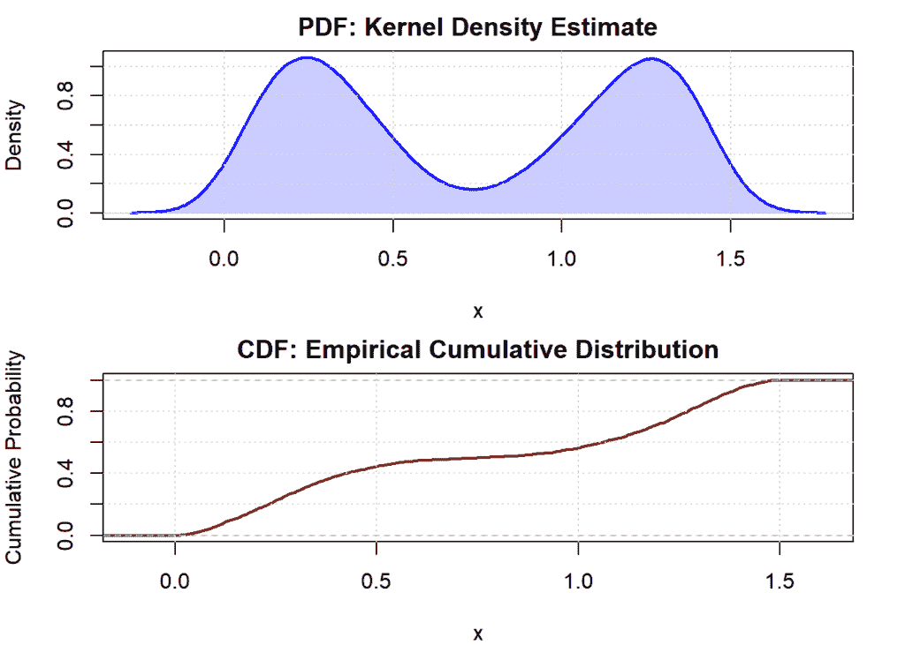

双峰分布数据的 PDF 与 CDF 对比。

从分析 *X* 的 PDF 可以立即清楚地看出 *X* 分布的某些特性，例如其双峰性质。然而，由于分布的累积性质，这些特性从分析其 CDF 中很难察觉。对于许多人来说，PDF 可能提供了对 *X* 分布的更直观的展示——在 *X* 更可能“发生”的值处更大，而在 *X* 不太可能发生的值处更小。

广义而言，密度估计方法可以分为 *参数化* 或 *非参数化*。

+   *参数*密度估计假设*X*遵循某种分布，该分布可能由某些参数（例如：*X ∼ N*(*μ,σ*)）来表征。在这种情况下，密度估计涉及估计*X*的参数分布的相关参数，然后将这些参数估计值插入到*X*的相应密度函数公式中。

+   *非参数*密度估计对*X*的分布做出较少的严格假设，并直接从经验数据中估计密度函数的形状。因此，与参数密度估计相比，非参数密度估计通常具有较低的偏差和较高的方差。当*X*的潜在分布未知且我们处理大量经验数据时，可能需要使用非参数方法。

在本文的剩余部分，我们将专注于分析两种流行的非参数密度估计方法：**直方图**和**核密度估计器**（KDEs）。我们将深入了解它们的工作原理，每种方法的优缺点，以及它们如何准确地估计随机变量的真实密度函数。最后，我们将探讨密度估计如何应用于分类问题，以及密度估计器的质量如何影响分类性能。

* * *

## 直方图

### 概述

直方图是从数据样本构建密度估计的简单非参数方法。直观地说，这种方法涉及将我们的数据范围划分为不同的等长区间。然后，对于任何给定的点，将其密度分配为位于同一区间内的点的比例，并按区间长度进行归一化。

形式上，给定一个包含*n*个观测值的样本

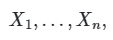

将域划分为*M*个区间

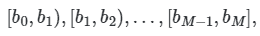

使得

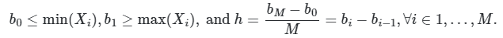

对于给定的点*x* ∈ *β[l]*，其中*β[l]*表示第*l*个区间，直方图产生的密度估计将是

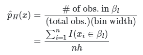

直方图的点密度估计。

由于直方图密度估计器将均匀密度分配给同一区间内的所有点，因此密度估计在其断点处将是不连续的，在这些断点处密度估计值不同。

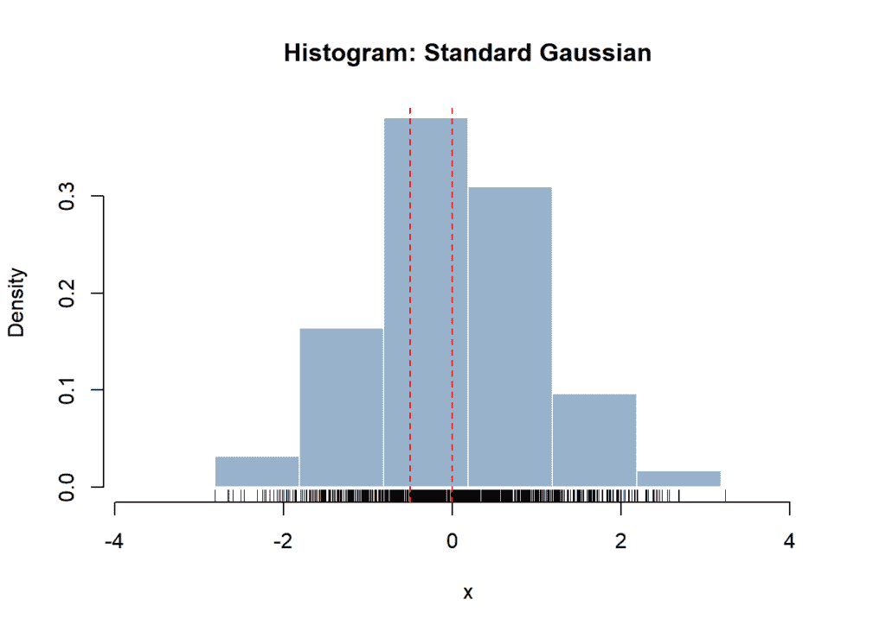

标准高斯分布的直方图密度估计。所有点在同一区间内被分配了均匀密度。

如上所示，我们得到了从 1000 个数据点样本生成的标准高斯分布的直方图密度估计。我们看到*x* =0 和*x* =−0.5 位于同一区间内，因此具有相同的密度估计值。

### 理论性质

直方图是密度估计的一种简单直观方法。它们对随机变量的潜在分布没有任何假设。直方图估计只需要调整**h**（箱宽）和直方图箱起始点**t**[0]。然而，我们很快就会看到，直方图估计器的准确性高度依赖于这些参数的适当调整。

如预期的那样，直方图估计器是一个真正的密度函数。

+   它在其整个定义域内非负。

+   它积分到 1。

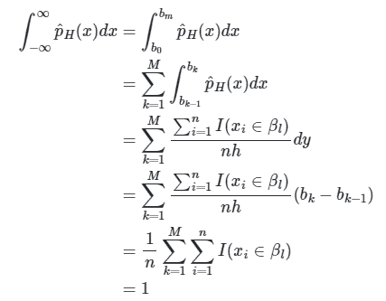

直方图密度估计器的积分。

我们可以通过将直方图估计器的均方误差分解为其偏差和方差项来评估直方图估计器估计真实密度**p**(⋅)的准确性。

首先，让我们考察其在给定点**x** ∈ (*b[k-1], b[k]*]处的偏差。

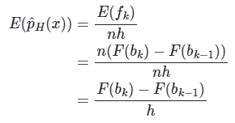

点值直方图密度估计的期望值。

让我们在这里跳一下。使用泰勒级数展开，PDF 是 CDF 的导数，以及|*x − b[k-1]*| ≤ *h*，我们可以推导出以下结论。

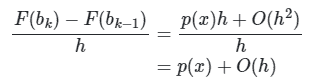

因此，我们有

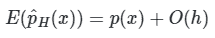

这意味着

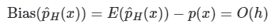

直方图密度估计器的渐近偏差。

因此，当箱宽趋近于 0 时，直方图估计器是真实密度**p**(⋅)的无偏估计。

现在，让我们分析直方图估计器的方差。

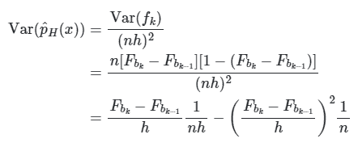

注意到当**h** → ∞时，我们有

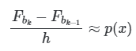

因此，

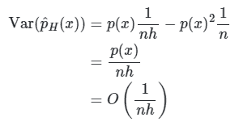

直方图密度估计器的渐近方差。

现在，我们遇到了一点困境；我们看到，当**h** → ∞时，直方图密度估计的偏差减少，而其方差增加。

我们通常关注大样本量（即**n** → ∞）下密度估计的准确性。因此，为了最大化直方图密度估计的准确性，我们将想要调整**h**以实现以下行为：

+   选择一个小的**h**以最小化偏差。

+   当**h** → 0 和**n** → ∞时，我们必须有**nh** → ∞以最小化方差。换句话说，大样本量应该压倒小的箱宽，渐近地。

这种偏差-方差权衡并不意外：

+   小的箱宽可以以高精度捕捉到特定点的密度。然而，由于较少的点会落在同一个箱中，密度估计可能会随着数据集之间的小随机变化而改变。

+   当计算给定点的密度估计时，大的箱宽包括更多的数据点，这意味着密度估计将更能抵抗数据中的小随机变化。

让我们通过一些例子来说明这种权衡。

### 理论性质的演示

首先，我们将探讨较小的桶宽度如何可能导致直方图密度估计器的方差较大。在这个例子中，我们将从标准高斯分布中抽取四个样本，每个样本包含 50 个随机变量。我们将设置一个相对较小的桶宽度（*h* = 0.2）。

```py
set.seed(25)

# Standard Gaussian
mu <- 0
sd <- 1

# Parameters for density estimate
n <- 50
h <- 0.2

# Generate 4 samples of standard Gaussian
samples <- replicate(4, rnorm(n, mean = mu, sd = sd), simplify = FALSE)

# Setup 2x2 plot
par(mfrow = c(2, 2), mar = c(4, 4, 3, 1))

# Plot histograms
titles <- paste("Sample", 1:4)
invisible(mapply(plot_histogram, samples, title = titles,
       MoreArgs = list(binwidth = h, origin = 0, line = 0)))
```

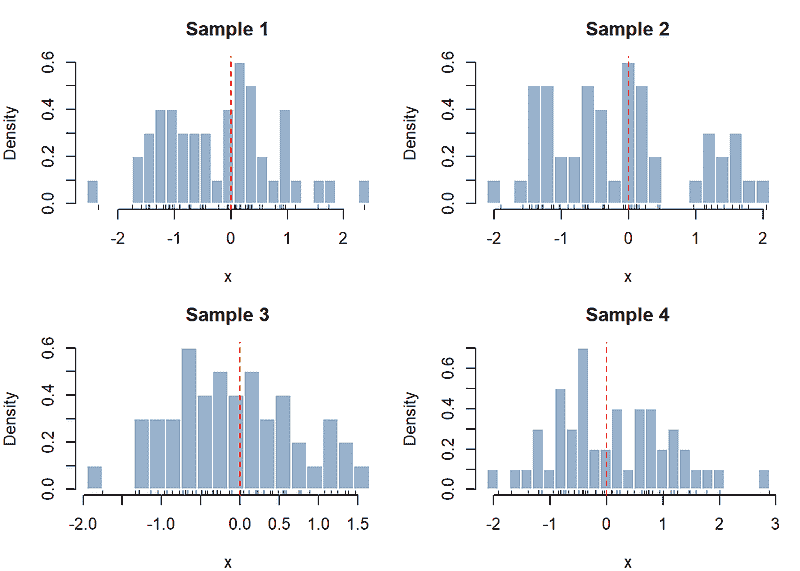

从标准高斯分布的 4 个不同样本生成的直方图密度估计（h = 0.2）。注意样本间密度估计的高变异性。

很明显，直方图密度估计变化很大。例如，我们看到在 *x* = 0 的点密度估计在样本 4 中约为 0.2，在样本 2 中约为 0.6。此外，样本 1 中产生的密度估计的分布几乎呈双峰，峰值在-1 和略高于 0。

让我们重复这个练习来展示较大的桶宽度如何导致具有较低方差但较高偏差的密度估计。在这个例子中，让我们从由两个高斯分布 N(0, 1)和 N(3, 1)混合而成的双峰分布中抽取四个样本。我们将设置一个相对较大的桶宽度（*h* = 2）。

```py
set.seed(25)

# Bimodal distribution parameters - mixture of N(0, 1) and N(4, 1)
mu_1 <- 0
sd_1 <- 1
mu_2 <- 3
sd_2 <- 1

# Density estimation parameters
n <- 100
h <- 2

# Generate 4 samples from bimodal distribution
samples <- replicate(4, c(rnorm(n/2, mean = mu_1, sd = sd_1), rnorm(n/2, mean = mu_2, sd = sd_2)), simplify = FALSE)

# Set up 2x2 plotting grid
par(mfrow = c(2, 2), mar = c(4, 4, 3, 1))

# Plot histograms
titles <- paste("Sample", 1:4)
invisible(mapply(plot_histogram, samples, title = titles,
       MoreArgs = list(binwidth = h, origin = 0, line = 0)))
```

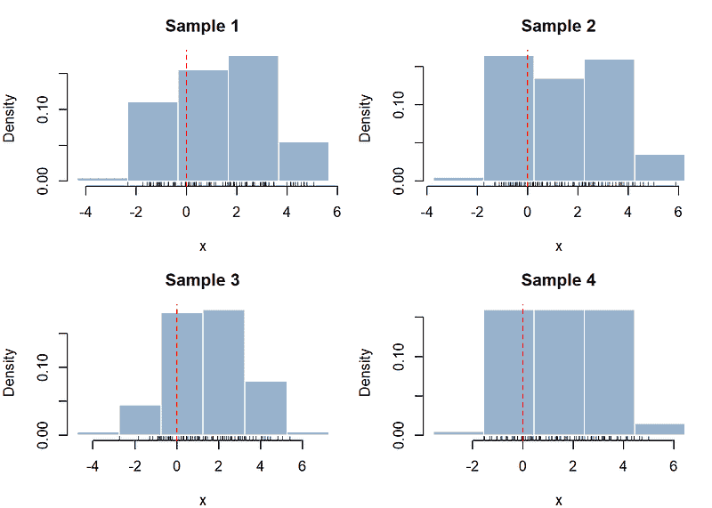

从 4 个不同的双峰分布样本生成的直方图密度估计（h = 2）。这些直方图未能捕捉到数据的双峰特性。

在四个直方图中，密度估计仍然存在一些变化，但相对于我们上面看到的较小桶宽度的密度估计，它们似乎更稳定。例如，似乎所有直方图中在 *x* = 0 的点密度估计大约为 0.15。然而，很明显，这些直方图估计引入了大量的偏差，因为真实密度函数的双峰分布被较大的桶宽度所掩盖。

此外，我们之前提到直方图估计器需要调整原点，*t*[0]。让我们通过一个例子来说明**t*[0]*的选择如何影响直方图密度估计。

```py
set.seed(123)

# Distribution and density estimation parameters
# Bimodal distribution: mixture of N(0, 1) and N(5, 1)
n <- 50
data <- c(rnorm(n/2, mean = 0, sd = 1), rnorm(n/2, mean = 5, sd = 1))
h <- 3

# Set up plotting grid
par(mfrow = c(1, 2), mar = c(4, 4, 3, 1))

# Same bin width, different origins
plot_histogram(data, binwidth = h, origin = 0, title = paste("Bin width = ", h, ", Origin = 0"))
plot_histogram(data, binwidth = h, origin = 1, title = paste("Bin width = ", h, ", Origin = 1"))
```

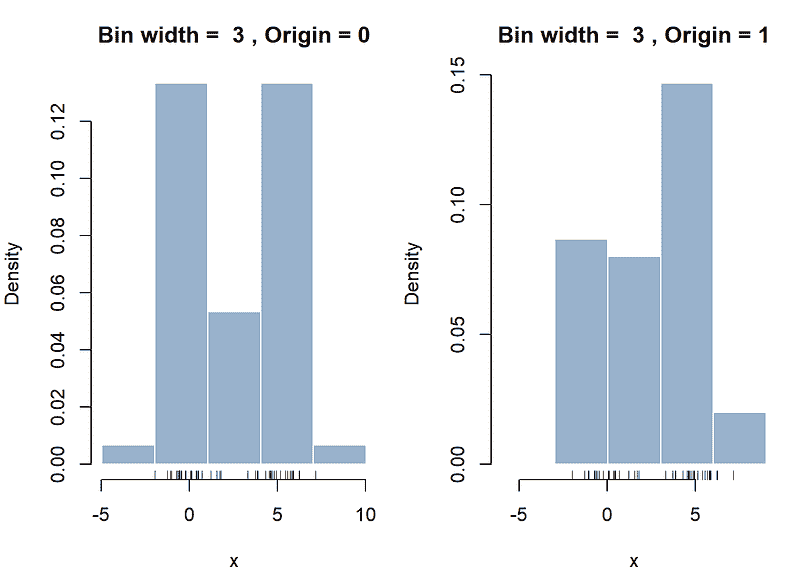

不同原点的双峰分布的直方图密度估计。注意右边的直方图未能捕捉到数据的双峰特性。

上述直方图密度估计在原点上的差异为 1 的量级。不同原点对结果直方图密度估计的影响是明显的。左边的直方图捕捉到分布是双峰的，峰值在 0 和 5 附近。相比之下，右边的直方图给人一种 *X* 的密度遵循单峰分布，峰值在 5 附近的印象。

直方图是密度估计的一种简单直观的方法。然而，直方图总是会生成遵循离散分布的密度估计，我们已经看到结果密度估计可能高度依赖于任意选择的原点。接下来，我们将探讨另一种密度估计方法，即**核密度估计**，该方法解决了这些缺点。

* * *

## 核密度估计器 (KDE)

### 朴素密度估计器

我们首先来看核密度估计器最基本的形式，即**朴素密度估计器**。这种方法也被称为“移动直方图”；它是传统直方图密度估计器的扩展，通过检查落在以该点为中心的区间内的观测值数量来计算给定点的密度。

形式上，朴素密度估计器在 *x* 处产生的点密度估计可以写成以下形式。

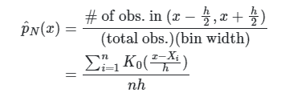

朴素密度估计器的点密度估计。

其对应的 [核](https://en.wikipedia.org/wiki/Kernel_%28statistics%29)定义为以下内容。

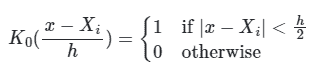

朴素密度估计器的核函数。

与传统的直方图密度估计不同，移动直方图产生的密度估计不会根据原点选择而变化。实际上，在移动直方图中没有“原点”的概念，因为密度估计在 *x* 处只依赖于位于邻域（*x* − (*h*/2), *x* + (*h*/2)）内的点。

让我们检查朴素密度估计器为我们上面用来突出直方图对原点依赖性的双峰分布产生的密度估计。

```py
set.seed(123)

# Bimodal distribution - mixture of N(0, 1) and N(5, 1)
data <- c(rnorm(n/2, mean = 0, sd = 1), rnorm(n/2, mean = 5, sd = 1))

# Density estimate parameters
n <- 50
h <- 1 

# Naive Density Estimator: KDE with rectangular kernel using half the bin width
# Rectangular kernel counts points within (x - h, x + h)
pdf_est <- density(data, kernel = "rectangular", bw = h/2) 

# Plot PDF
plot(pdf_est, main = "NDE: Bimodal Gaussian", xlab = "x", ylab = "Density", col = "blue", lwd = 2)
rug(data)
polygon(pdf_est, col = rgb(0, 0, 1, 0.2), border = NA)
grid()
```

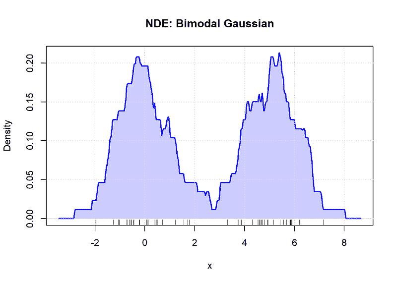

朴素密度估计器对包含 N(0, 1)和 N(5, 1)混合的双峰分布的估计。

显然，朴素密度估计器产生的密度估计比传统的直方图更准确地捕捉到双峰分布。此外，每个点的密度都以更精细的粒度进行捕捉。

话虽如此，NDE 产生的密度估计仍然相当“粗糙”，即密度估计没有平滑的曲率。这是因为当计算点密度估计时，每个观测值都被视为“全有或全无”，这可以从其核函数 *K*[0] 中明显看出。具体来说，邻域（*x* − (*h*/2), *x* + (*h*/2)）内的所有点对密度估计的贡献是相等的，而区间外的点则没有任何贡献。

理想情况下，当计算 *x* 的密度估计时，我们希望根据点与 *x* 的距离成比例地**加权**，这样离 *x* 更近/更远的点对其密度估计的影响就更高/更低。

这就是 KDE（核密度估计）的基本原理：它通过用任意密度函数（**核**）替换均匀密度函数来泛化朴素密度估计器。直观地，你可以将 KDE 视为一个平滑的直方图。

### KDE：概述

从样本 *X[1],…, X[n]* 生成的核密度估计器可以定义为以下：

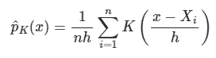

KDE 的点密度估计。

下面是一些在密度估计中常用的核函数的选择。

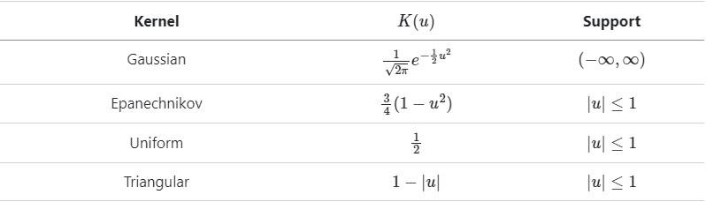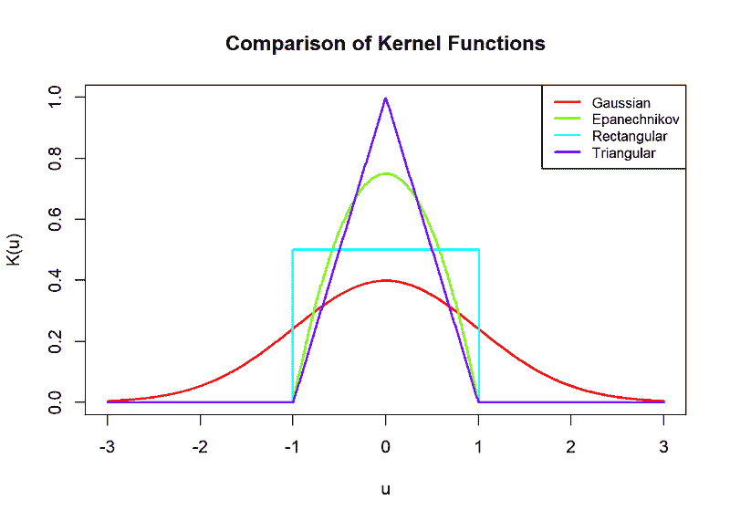

这些只是通常用于密度估计的几个更受欢迎的核函数。有关核函数的更多信息，请参阅[Wikipedia](https://en.wikipedia.org/wiki/Kernel_%28statistics%29#Kernel_functions_in_common_use)。如果你在寻找关于核函数究竟是什么的直观解释（就像我一样），请查看这个[quora 线程](https://www.quora.com/What-is-the-intuitive-explanation-of-a-kernel-in-statistics)。

我们可以看到 KDE 是一个真正的密度函数。

+   由于 *K*(⋅) 是一个密度函数，所以它总是非负的。

+   它的积分等于 1。

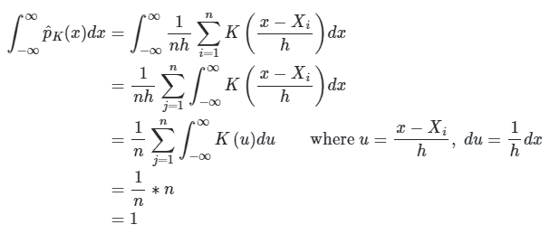

KDE 的积分。

### 核和带宽

在实践中，*K*(⋅) 被选择为在 0 周围对称且单峰（∫*u⋅K*(*u*)*du* = 0）。此外，*K*(⋅) 通常缩放到具有单位方差，当用于密度估计时（∫*u*²⋅*K*(*u*)*du* = 1）。这种缩放本质上标准化了带宽 *h* 的选择对 KDE 的影响，无论使用哪种核。

由于在给定点的 KDE 是其邻近点的加权总和，其中权重由 *K*(⋅) 计算，因此密度估计的平滑性继承了核函数的平滑性。

+   平滑的核函数将产生平滑的 KDE。我们可以看到上面描绘的高斯核是无限可导的，因此使用高斯核的 KDE 将产生具有平滑曲率的密度估计。

+   另一方面，其他核函数（如 Epanechnikov、矩形、三角形）在所有地方（例如±1）不可导，在矩形和三角形核的情况下，没有平滑的曲率。因此，使用这些核的 KDE 将产生更粗糙的密度估计。

然而，在实践中，我们会看到，只要核函数是连续的，与带宽的选择相比，核的选择对 KDE 的影响相对较小。

```py
set.seed(123)

# sample from standard Gaussian
x <- rnorm(50)

# kernel/bandwidths for KDEs
kernels <- c("gaussian", "epanechnikov", "rectangular", "triangular")
bandwidths <- c(0.5, 1, 2)

colors_k <- rainbow(length(kernels))
colors_b <- rainbow(length(bandwidths))

plot_kde_comparison <- function(values, label, type = c("kernel", "bandwidth")) {
  type <- match.arg(type)
  plot(NULL, xlim = range(x) + c(-1, 1), ylim = c(0, 0.5),
       xlab = "x", ylab = "Density", main = paste("KDE with Different", label))

  for (i in seq_along(values)) {
    if (type == "kernel") {
      d <- density(x, kernel = values[i])
      col <- colors_k[i]
    } else {
      d <- density(x, bw = values[i], kernel = "gaussian")
      col <- colors_b[i]
    }
    lines(d$x, d$y, col = col, lwd = 2)
  }

  curve(dnorm(x), add = TRUE, lty = 2, lwd = 2)
  legend("topright", legend = c(as.character(values), "True Density"),
         col = c(if (type == "kernel") colors_k else colors_b, "black"),
         lwd = 2, lty = c(rep(1, length(values)), 2), cex = 0.8)
  rug(x)
}

plot_kde_comparison(kernels, "Kernels", type = "kernel")
plot_kde_comparison(bandwidths, "Bandwidths", type = "bandwidth")
```

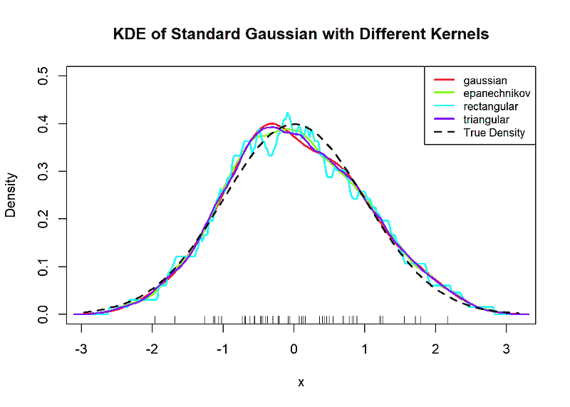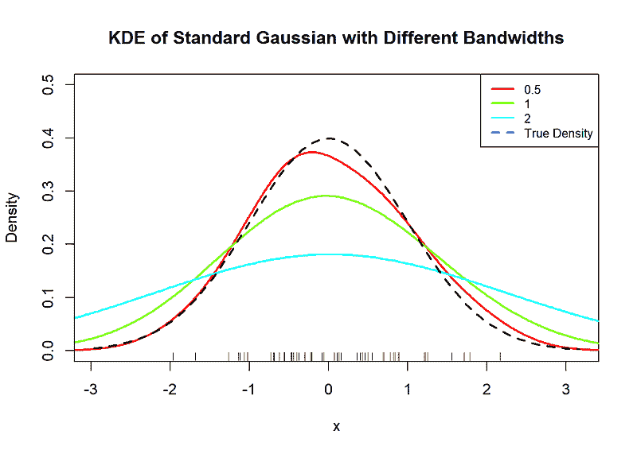

我们可以看到，与各种带宽产生的 KDE 相比，具有各种核的标准高斯 KDE 相对相似。

### KDE 的准确性

让我们考察 KDE 如何准确地估计真实密度 *p*(⋅)。正如我们对待直方图估计器一样，我们可以将其均方误差分解为其偏差和方差项。关于如何推导这些偏差和方差项的详细内容，请查看这些笔记的第 6 讲[这些笔记](https://faculty.washington.edu/yenchic/18W_stat425.html)。

在 *x* 处的 KDE 的偏差和方差可以表示如下。

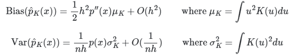

KDE 的渐近偏差和方差。

直观地说，这些结果给我们以下启示：

+   *K*(⋅) 对 KDE 准确性的影响主要通过 σ²[K] = ∫*K*(*u*)²*du* 这个项来捕捉。Epanechnikov 核函数最小化这个积分，因此理论上它应该产生最优的 KDE。然而，我们已经看到，与带宽相比，核函数的选择对 KDE 的实际影响很小。此外，Epanechnikov 核函数的支持区间是有界的（[−1, 1]）。因此，与在整个实数空间上非零的核函数（例如高斯核）相比，它可能产生更粗糙的密度估计。因此，高斯核在实践中被广泛使用。

+   回想一下，当 h → ∞ 时，直方图估计器的渐近偏差和方差分别是 *O*(*h*) 和 *O*(*1*/*(nh*))。将这些与核密度估计（KDE）进行比较，告诉我们 *KDE 主要通过减少渐近偏差来改进直方图密度估计器*。这是预期的：在计算 *x* 的点密度时，核函数平滑地改变 *x* 的邻近点的权重，而不是将均匀密度分配给域中的任意固定区间。换句话说，与直方图方法相比，KDE 对密度估计施加的结构更为灵活。

对于直方图和核密度估计（KDE），我们已经看到带宽 *h* 对密度估计的准确性有显著影响。理想情况下，我们会选择 *h* 使得密度估计器的均方误差最小化。然而，实际上，这个理论上最优的 *h* 取决于真实密度 *p(⋅)* 的曲率，这在实践中是未知的（否则我们就不需要密度估计了）！

一些流行的带宽选择方法包括：

+   假设真实密度类似于某个参考分布 *p[0]*(⋅)（例如高斯分布），然后通过将 *p[0]*(⋅) 的曲率代入来推导带宽。[这种方法](https://en.wikipedia.org/wiki/Kernel_density_estimation#A_rule_of-thumb_bandwidth_estimator)很简单，但它假设了数据的分布，因此如果你想要构建密度估计来 *探索* 数据，这可能是一个较差的选择。

+   非参数带宽选择方法，例如交叉验证和插值方法。[无偏交叉验证](https://academic.oup.com/biomet/article-abstract/71/2/353/233423?redirectedFrom=fulltext&login=false)和[Sheather-Jones](https://academic.oup.com/jrsssb/article/53/3/683/7028194?login=false)方法是流行的带宽选择器，通常能产生相当准确的密度估计。

更多关于带宽选择对 KDE 影响的信息，请查看这篇[博客文章](https://aakinshin.net/posts/kde-bw/)。

```py
set.seed(42)

# Simulate data: a bimodal distribution
x <- c(rnorm(150, mean = -2), rnorm(150, mean = 2))

# Define true density
true_density <- function(x) {
  0.5 * dnorm(x, mean = -2, sd = 1) + 
  0.5 * dnorm(x, mean = 2, sd = 1)
}

# Create plotting range
x_grid <- seq(min(x) - 1, max(x) + 1, length.out = 500)
xlim <- range(x_grid)
ylim <- c(0, max(true_density(x_grid)) * 1.2)

# Base plot
plot(NULL, xlim = xlim, ylim = ylim,
     main = "KDE: Various Bandwidth Selection Methods",
     xlab = "x", ylab = "Density")

# KDE with different bandwidths
lines(density(x), col = "red", lwd = 2, lty = 4)
h_scott <- 1.06 * sd(x) * length(x)^(-1/5)
lines(density(x, bw = h_scott), col = "blue", lwd = 2, lty = 2)
lines(density(x, bw = bw.ucv(x)), col = "darkgreen", lwd = 2, lty = 3)
lines(density(x, bw = bw.SJ(x)), col = "purple", lwd = 2, lty = 4)

# True density
lines(x_grid, true_density(x_grid), col = "black", lwd = 2)

# Add legend
legend("topright",
       legend = c("Silverman (Default))", "Scott's Rule", "Unbiased CV",
                  "Sheather-Jones", "True Density"),
       col = c("red", "blue", "darkgreen", "purple", "black"),
       lty = 1:6, lwd = 2, cex = 0.8)
```

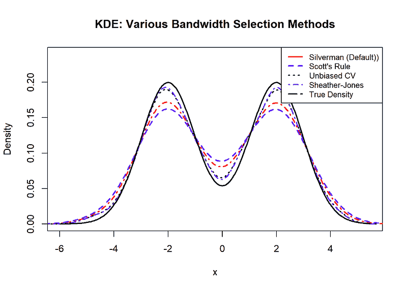

使用各种带宽选择方法的核密度估计（KDEs），其中基础数据遵循双峰分布。注意使用 Sheather-Jones 和无偏交叉验证方法的 KDEs 产生的密度估计最接近真实密度。

* * *

## 用于分类的密度估计

我们已经讨论了很多关于直方图和 KDE 的底层理论，并展示了它们在建模某些样本数据的真实密度方面的表现。现在，我们将探讨如何将我们关于密度估计的知识应用于简单的分类任务。

例如，假设我们想要从一个包含*n*个观察值(*x*[1], *y[1]*),…, (**x*[n], *y**[n])的样本中构建一个分类器，其中每个*x[i]*来自*p*-维特征空间*X*，而*y*[i]对应于从*Y* = {1,…, *m*}中抽取的目标标签。

直观地，我们想要构建一个分类器，使得对于每个观察值，我们的分类器将其分配给类别标签*k*，以满足以下条件。

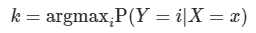

[贝叶斯分类器](https://en.wikipedia.org/wiki/Bayes_classifier)正是如此，并使用以下方程计算上述条件概率。

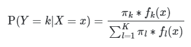

贝叶斯分类器

这个分类器依赖于以下：

+   π[k] = P(*Y* = *k*): 观察值(*x*[i], *y[i]*)属于第*k*类（即*y[i]* = *k*）的先验概率。这可以通过简单地从我们的样本数据中计算每个类别的点比例来估计。

+   *f[k]*(*x*) ≡ P(*X* = *x* | *Y* = *k*): 对于目标类别*k*中所有观察到的*X*的*p*-维密度函数。这更难估计：对于每个*m*个目标类别，我们必须确定*X*每个维度的分布形状，以及是否存在不同维度之间的关联。

如果上述量可以精确计算，贝叶斯分类器是*最优*的。然而，在实际操作中，当处理有限样本数据时，这是不可能实现的。更多关于为什么贝叶斯分类器是最优的细节，请查看[这个网站](https://mlweb.loria.fr/book/en/bayesclassifier.html)。

***因此，问题变成了，我们如何近似贝叶斯分类器？***

一种流行的方法是[朴素贝叶斯分类器](https://en.wikipedia.org/wiki/Naive_Bayes_classifier)。朴素贝叶斯假设类条件独立性，这意味着对于每个目标类别，它将*p*-维密度估计问题简化为*p*个单独的单变量密度估计任务。这些单变量密度可以参数化或非参数化估计。一种典型的参数化方法会假设*X*的每个维度都遵循具有类别特定均值和对角协方差矩阵的单变量高斯分布，而一种非参数方法可能使用直方图或 KDE 来模拟*X*的每个维度。

当我们相对于特征空间的大小只有少量数据时，朴素贝叶斯中单变量密度估计的参数化方法可能是有用的，因为高斯假设引入的偏差可能有助于减少分类器的方差。然而，高斯假设可能并不总是适用于你所处理的数据分布。

让我们考察参数化与非参数密度估计如何影响朴素贝叶斯分类器的决策边界。我们将在[Iris 数据集](https://archive.ics.uci.edu/dataset/53/iris)上构建两个分类器：其中一个将假设每个特征遵循高斯分布，另一个将为每个特征构建核密度估计。

```py
# Parametric Naive Bayes
param_nb <- naive_bayes(Species ~ ., data = train)

# Nonparametric Naive Bayes
# KDE with Gaussian kernel and Sheather-Jones bandwidth
nonparam_nb <- naive_bayes(Species ~ ., data = train, 
                           usekernel = TRUE, 
                           kernel="gaussian",
                           bw="sj") # play with bandwidth to see how it affects the classification boundaries!

# Create grid for plotting decision boundaries
x_seq <- seq(min(iris2D$Sepal.Length), max(iris2D$Sepal.Length), length.out = 200)
y_seq <- seq(min(iris2D$Petal.Length), max(iris2D$Petal.Length), length.out = 200)
grid <- expand.grid(Sepal.Length = x_seq, Petal.Length = y_seq)

# Predict class for each point on grid
grid$param_pred <- predict(param_nb, grid)
grid$nonparam_pred <- predict(nonparam_nb, grid)

# Plot decision boundaries
nb_parametric <- ggplot() +
  geom_tile(data = grid, aes(x = Sepal.Length, y = Petal.Length, fill = param_pred), alpha = 0.3) +
  geom_point(data = train, aes(x = Sepal.Length, y = Petal.Length, color = Species), size = 2) +
  ggtitle("Parametric Naive Bayes Decision Boundary") +
  theme_minimal()

nb_nonparametric <- ggplot() +
  geom_tile(data = grid, aes(x = Sepal.Length, y = Petal.Length, fill = nonparam_pred), alpha = 0.3) +
  geom_point(data = train, aes(x = Sepal.Length, y = Petal.Length, color = Species), size = 2) +
  ggtitle("Nonparametric Naive Bayes Decision Boundary") +
  theme_minimal()

nb_parametric
nb_nonparametric
```

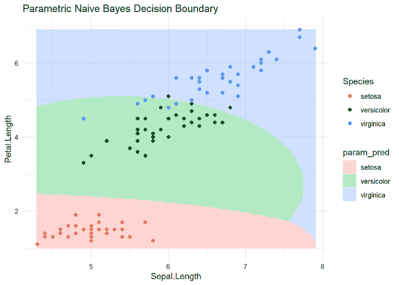

参数化朴素贝叶斯分类器产生的决策边界。

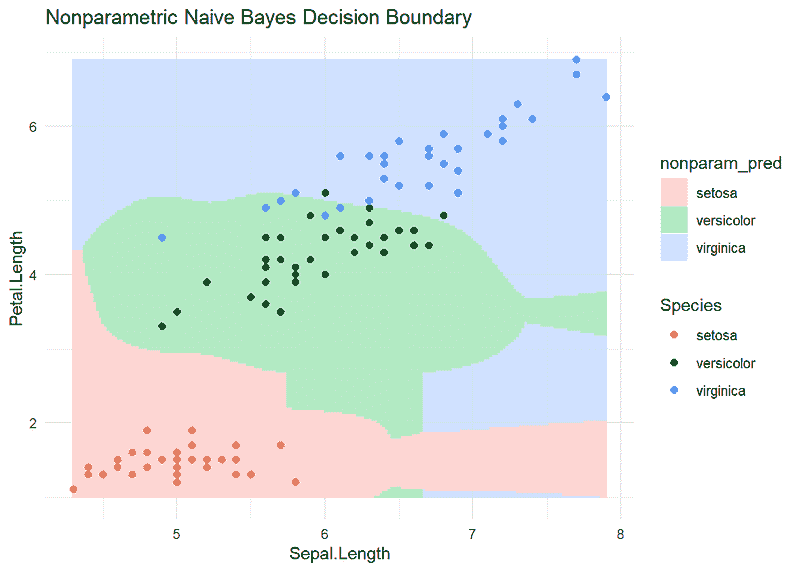

非参数朴素贝叶斯分类器产生的决策边界。注意相对于其参数化对应物的粗糙决策边界。

```py
# Parametric Naive Bayes prediction on test data
param_pred <- predict(param_nb, newdata = test)

# Non-parametric Naive Bayes prediction on test data
nonparam_pred <- predict(nonparam_nb, newdata = test)

# Create confusion matrices
param_cm <- confusionMatrix(param_pred, test$Species)
nonparam_cm <- confusionMatrix(nonparam_pred, test$Species)

output <- capture.output({
  # Print confusion matrices
  cat("\n=== Parametric Naive Bayes Metrics ===\n")
  print(param_cm$table)
  cat("Parametric Naive Bayes Accuracy: ", param_cm$overall['Accuracy'], "\n\n")

  cat("=== Non-parametric Naive Bayes Metrics ===\n")
  print(nonparam_cm$table)
  cat("Nonparametric Naive Bayes Accuracy: ", nonparam_cm$overall['Accuracy'], "\n")
})
cat(paste(output, collapse = "\n"))
```

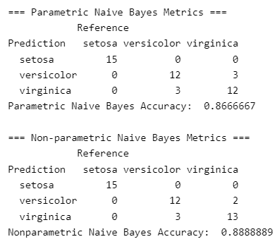

两种朴素贝叶斯模型的分类性能。非参数朴素贝叶斯在我们的数据上实现了略好的性能。

我们看到，非参数朴素贝叶斯分类器比其参数化对应物略好。这是因为非参数密度估计产生了一个具有更灵活决策边界的分类器。结果，一些被参数化分类器错误地分类为“versicolor”的“virginica”观测值最终被非参数模型正确分类。

话虽如此，非参数朴素贝叶斯产生的决策边界看起来是粗糙且不连续的。因此，特征空间中的一些区域，分类边界可能存在疑问，并且无法很好地推广到新数据。相比之下，参数化朴素贝叶斯分类器产生的决策边界平滑且连续，似乎准确地捕捉了每个物种的特征分布的一般模式。

这种区分提出了一个重要观点：“更灵活的密度估计”并不等同于“更好的密度估计”，尤其是在应用于分类时。毕竟，朴素贝叶斯分类之所以受欢迎，是有原因的。尽管对数据分布的假设较少可能看起来是产生无偏密度估计的愿望，但在缺乏足够经验数据以产生高质量估计，或者如果认为参数假设大部分是准确的情况下，简化假设可能是有效的。在后一种情况下，参数估计将对估计者引入很少或没有偏差，而非参数方法可能会引入大量的方差。

的确，从下面的特征分布来看，参数朴素贝叶斯的正态分布假设似乎并不不合适。大部分情况下，类分布对于花瓣和花瓣长度似乎都是单峰且对称的。

```py
iris_long <- pivot_longer(iris, cols = c(Sepal.Length, Petal.Length), names_to = "Feature", values_to = "Value")

ggplot(iris_long, aes(x = Value, fill = Species)) +
  geom_density(alpha = 0.5, bw="sj") +
  facet_wrap(~ Feature, scales = "free") +
  labs(title = "Distribution of Sepal and Petal Lengths by Species", x = "Length (cm)", y = "Density") +
  theme_minimal()
```

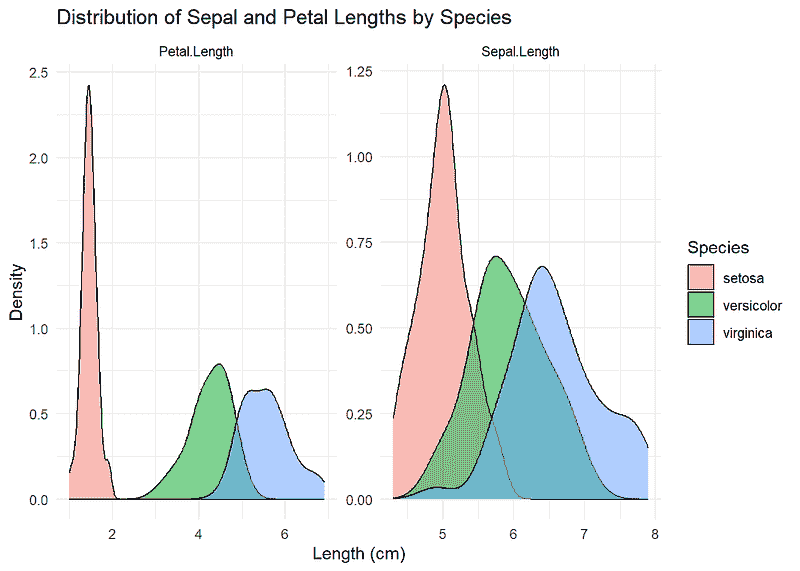

花瓣和花瓣长度的密度分布。对于这两个特征，所有物种的单变量密度似乎都是单峰且对称的。

* * *

## 总结

感谢阅读！我们深入探讨了直方图和核密度估计的理论以及如何在特定情境下应用它们。

让我们简要总结一下我们讨论的内容：

+   密度估计是统计分析中的基本工具，用于分析变量的分布，或作为更深入统计分析的中间工具。密度估计方法可以广泛分为参数估计和非参数估计。

+   直方图和核密度估计是非参数密度估计的两种流行方法。直方图通过计算数据中每个不同数据箱内点的归一化频率来产生密度估计。核密度估计是“平滑”的直方图，通过计算其周围点的加权总和来估计给定点的密度，其中邻居的权重与其距离成比例。

+   非参数密度估计可以应用于需要为每个目标类别建模特征密度的分类算法（贝叶斯分类）。使用非参数密度估计构建的分类器可能能够定义更灵活的决策边界，但代价是更高的方差。

如果你对了解更多信息感兴趣，请查看以下来源！

*本文中所有图片均由作者创建。*

* * *

## 来源

学习资源：

+   García-Portugués, E. (2025). 《非参数统计笔记》. 版本 6.12.0. ISBN 978-84-09-29537-1. 可在 [`bookdown.org/egarpor/NP-UC3M/`](https://bookdown.org/egarpor/NP-UC3M/) 获取。

+   García-Portugués, E. (2022). 《非参数曲线估计简明课程》。版本 2.1.1。可在 [`bookdown.org/egarpor/NP-EAFIT/`](https://bookdown.org/egarpor/NP-EAFIT/) 获取。

+   [UW Stat 425: 非参数统计导论（2018 年冬季）](https://faculty.washington.edu/yenchic/18W_stat425.html)

+   James 等人，《统计学习导论》(https://www.statlearning.com/)

+   Hastie 等人，《统计学习要素》(https://hastie.su.domains/ElemStatLearn/)

+   安德烈·阿金申，《核密度估计带宽的重要性》(https://aakinshin.net/posts/kde-bw/)

数据集：

+   费舍尔，R. (1936). 爱丽丝 [数据集]. UCI 机器学习仓库. https://doi.org/10.24432/C56C76\. (CC BY 4.0)
