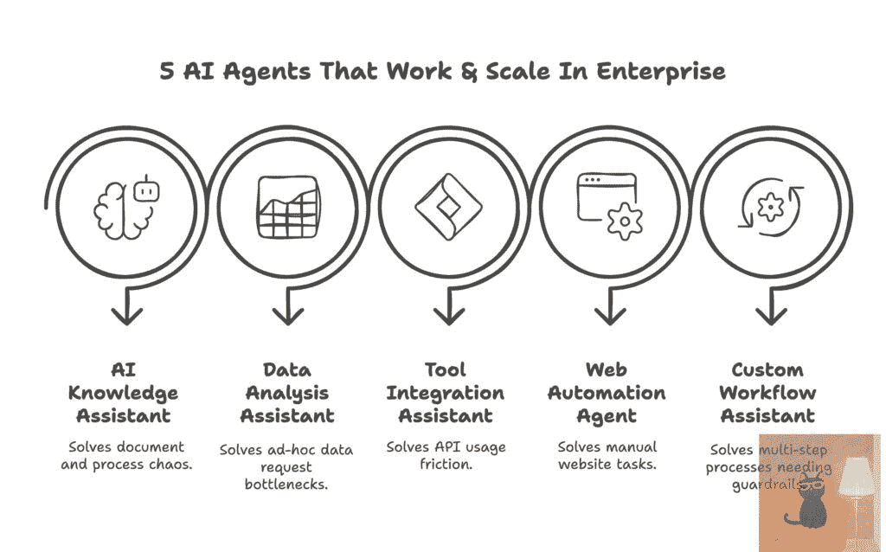
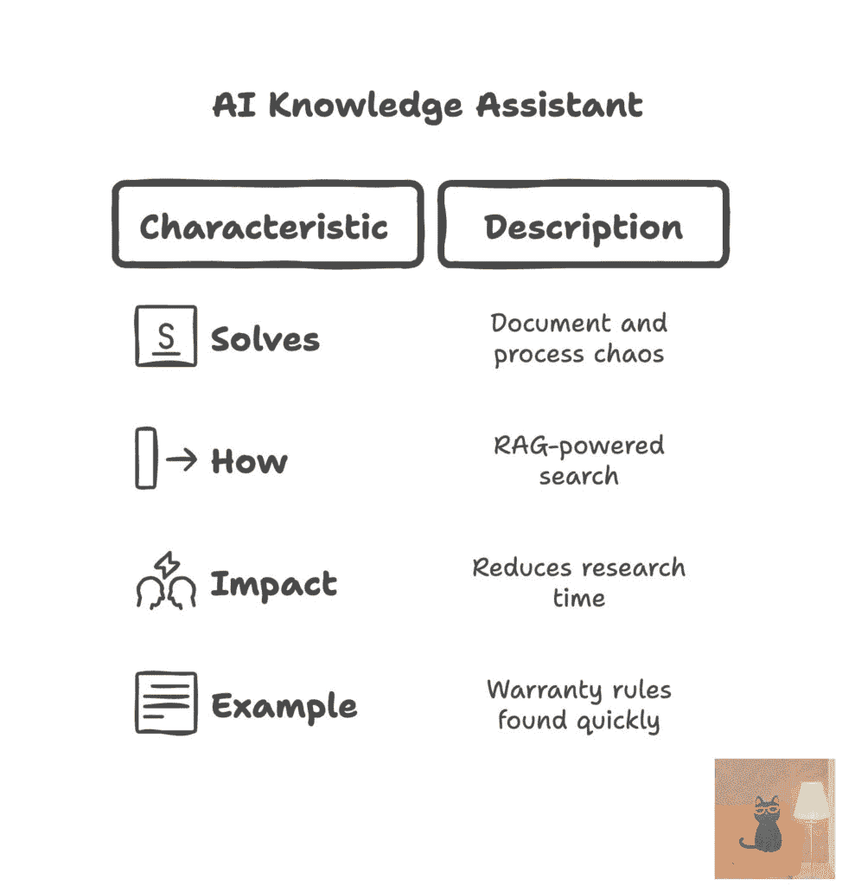
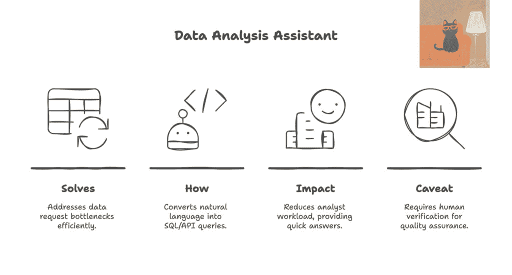
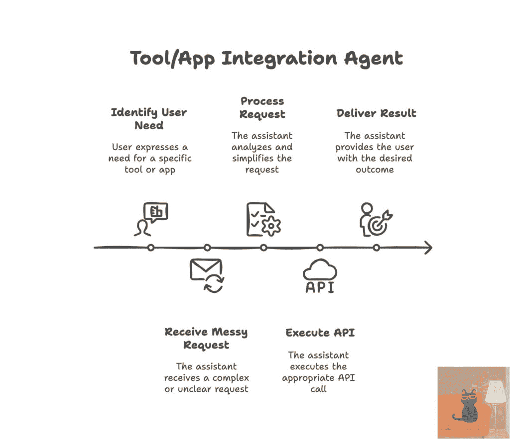
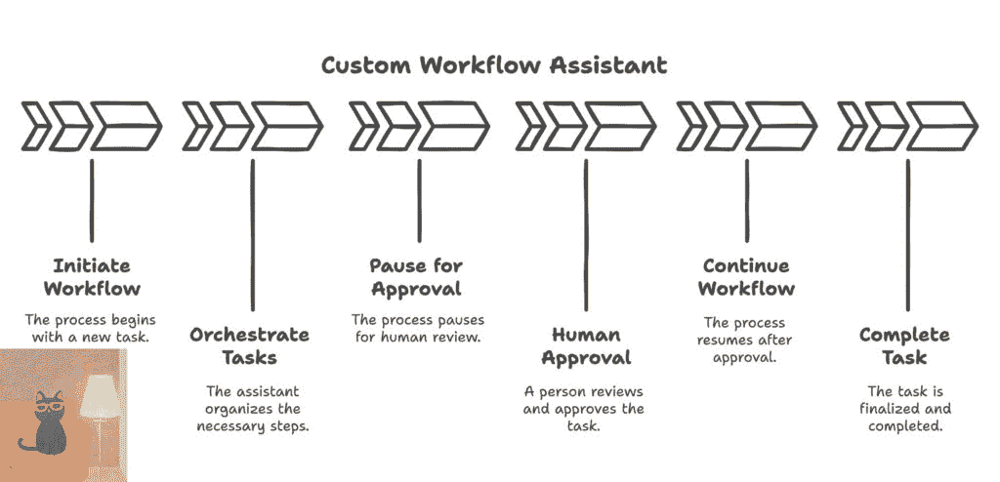
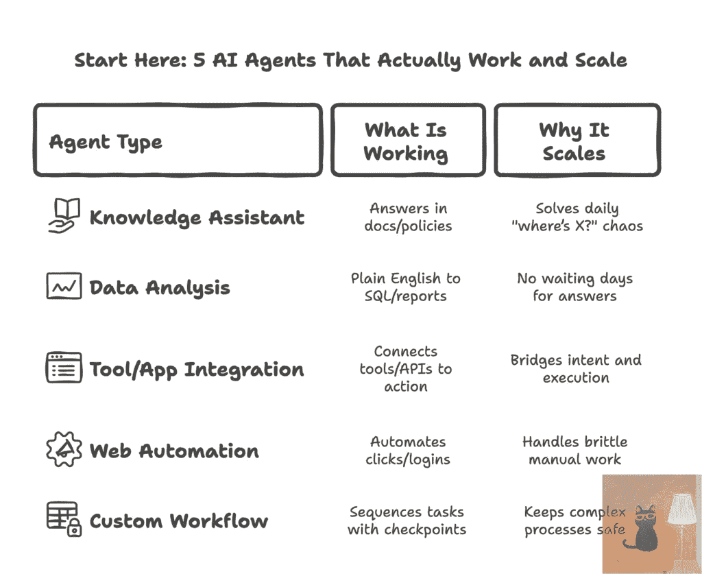

# 并非所有事情都需要自动化：5 个能为企业带来价值的实用人工智能代理

> 原文：[`towardsdatascience.com/not-everything-needs-automation-5-practical-ai-agents-that-deliver-enterprise-value/`](https://towardsdatascience.com/not-everything-needs-automation-5-practical-ai-agents-that-deliver-enterprise-value/)

<mdspan datatext="el1749232156517" class="mdspan-comment">如果你在一个企业组织中工作，你可能已经亲身体验了这个悖论。人工智能主导着你的战略规划，充斥着你的审查会议，并融入路线图讨论中。然而，当你试图将这些人工智能愿景转化为实际解决方案时，你常常会感到困惑：

> *实际上什么在起作用？我们从哪里开始看到人工智能可衡量的价值？*

目前，大多数人工智能对话都围绕着共同飞行员、自主工作流程和代理链。但我看到在数据、运营和平台团队中持续成功的是那些专注于简化重复性任务、消除日常烦恼并使团队能够更有意义地利用时间的解决方案。

我认为真正的企业人工智能价值并非始于宏伟的目标，而在于改善你团队每天所面临的混乱和复杂的环境。那些能带来切实成果的人工智能代理会精确地满足你组织的现状，帮助你的团队夺回时间，优化工作流程，并放大业务影响。以下是最重要的五个用例，如果你在寻找如何开始或扩展企业人工智能之旅的清晰路径。

图片来自 [The Next Step](https://thenextsteps1.substack.com/)

* * *

## 1. 人工智能知识助手

人工智能代理最具有影响力的用例之一是帮助团队有效地利用他们自己的内部知识。想象一下，一个 AI 知识助手是你组织的可信赖的内部顾问，它是可搜索的、对话式的，并且能够在 SharePoint 文件夹、Confluence 站点和内部维基等文档中找到隐藏的关键信息。

在许多组织中，机构知识往往被困在无序的文档、过时的内部网络页面或漫长的电子邮件链中。新员工经常反复提出相同的基本问题，即使是资深的员工也花费数小时追踪他们之前看到的答案。这减缓了团队的工作进度，降低了生产力，并导致不必要的挫败感。

人工智能知识助手利用基于 RAG 的方法。当有人提出问题时，代理使用嵌入模型和向量数据库从你组织的内部文档中检索相关信息。他们将这个精心挑选的上下文提供给语言模型，该模型生成定制化的回答。这些代理不是依赖于通用的互联网知识，而是基于你公司的内容提供答案。

图片来自 Weiwei Hu 的 [The Next Step](https://thenextsteps1.substack.com/)

LangChain 和 LlamaIndex 等工具通过抽象复杂性并简化组织、索引和查询知识库的方式，使这一过程得以简化。Langchain-Chatchat 或 FastGPT 等平台提供了用户友好的解决方案，您的团队可以快速部署，无需大量编码或定制工程。

为了说明现实世界的影响，考虑一个管理多个全球地区的合同供应链组织。员工经常难以找到关键信息，这往往导致延误。他们实施了一个基于多年航运政策、保修规则和区域合规指南的 AI 知识助手。现在员工可以简单地提出问题，例如，“向特定国家的运输有什么保修要求？”并立即获得精确的答案。有了这些代理，团队可以收回因重复研究和电子邮件交换而损失的时间。他们成为供应链团队的关键合作伙伴，释放了他们的能力，使他们能够从事更有价值的工作。

* * *

## 2. 数据分析助手

在当今的企业中，大多数企业团队已经采用了 BI 工具来简化报告和仪表板。但仅靠这些工具并不能总是满足灵活、即兴的数据查询需求。尽管自助仪表板随时可用，但业务利益相关者仍然经常直接向数据分析师发送消息，询问诸如“你能帮我拉取这些数据吗？”等问题。这种动态创造了一个瓶颈：数据分析师被 JIRA 的即兴请求压得喘不过气来，而利益相关者仍然在黑箱中运营，等待他们问题的简单答案。

根本问题是这样的：决策者倾向于提出仪表板没有明确设计来回答的具体问题。数据分析师每天花费数小时来满足这些一次性请求，这让他们几乎没有时间来处理更深层次的战略性问题。因此，重要的业务问题往往未提出或未得到解答，这会减缓整个组织的决策过程。

这正是数据分析代理发挥作用的地方。这些代理使利益相关者能够提出问题，而无需自己编写 SQL 查询或导航复杂的分析工具。通过将普通语言请求转换为结构化查询、代码片段或直接 API 调用，数据分析代理可以显著减少获取关键数据所需的时间和精力。在安全、精心策划的数据环境中运行，数据代理可以利用语义层、权限感知查询和上下文敏感提示来确保准确性和安全性。

根据具体请求和可用数据源，数据分析代理还可以直接与报告 API 交互，查询本地 SQL 数据仓库，解析 Excel 文件中的数据，甚至编排多步骤工作流程，最终生成可视化报告或仪表板。

考虑一个典型的场景：产品经理想快速确定过去一个季度有多少不活跃的订阅者重新激活了他们的账户。而不是创建另一个临时的 JIRA 请求，经理可以直接用普通英语询问代理。代理将生成一个针对精选数据集的 SQL 查询，安全地执行它，并立即提供结果。这减少了数据分析师的工作量，清除了临时的请求积压，并将响应时间从几天或几周缩短到几分钟甚至几秒钟。

然而，需要注意的是，这些数据分析代理的有效性高度依赖于底层 LLM 的可靠性。即使是高度调优的方法，如 Text2SQL，目前最佳准确率也仅为 80% 左右。因此，在复杂的商业环境中，拥有回退逻辑和人工监督以确保数据分析结果和结果的准确性和可信度至关重要。

图片由胡伟伟来自 [The Next Step](https://thenextsteps1.substack.com/)

* * *

## 3. 工具和应用程序集成助手

今天，AI 工具和 API 的获取相对容易，但将员工意图转化为实际行动仍然出奇地困难。即使存在 API，它们通常文档不完善或维护不一致。参数可能会在没有明确沟通的情况下发生变化，使团队感到困惑和沮丧。除此之外，人们可能也没有完全意识到他们可以使用的工具或 API。即使他们知道，他们可能缺乏有效利用它们的必要权限或技能。

这就是集成代理变得至关重要的地方。它们可以帮助弥合混乱的用户请求和结构化 API 调用之间的差距。这些代理使用智能检索技术，如综合 API 文档的向量搜索，结合结构化提示工程和 JSON 解析，以确保请求被准确理解并可靠执行。一些团队通过将 API 功能作为 JSON 模式对象结构化，检索相关工具以避免信息过载，并以减少混淆或错误的方式组装提示来进一步增强这种方法。

图片由胡伟伟来自 [The Next Step](https://thenextsteps1.substack.com/)

想象一个常见的场景，企业人力资源平台管理着多个相互独立的内部系统。员工必须为日常任务（如提交休假申请、检索税务文件或检查福利）在各个独立的系统中导航。这对所有相关人员来说都是繁琐、缓慢且令人沮丧的。

一个集成代理可以通过让员工简单地询问“你能给我最新的税务表格吗？”来解决这个问题。代理解释请求，在工资、人力资源信息系统和文档管理系统之间进行身份验证，执行所需的 API 调用，并在几秒钟内而不是通过在不同的人力资源门户中多次点击来提供所需的文档。这种简化的方法不仅减少了在常规任务上的时间，而且赋予了员工权力，减少了人力资源支持工单，使人力资源团队能够专注于更具战略性和有意义的活动。

* * *

## 4. 网络自动化代理

对于许多企业组织来说，有许多关键的工作流程和数据收集任务完全依赖于手动浏览器交互。传统的门户网站、合作伙伴网站或内部仪表板通常缺乏可访问的 API，而重建或集成它们的努力很少被优先考虑。因此，团队继续日复一日地执行重复的、基于 UI 的任务。

与依赖于一旦界面有任何变化就会中断的僵化 RPA 脚本不同，网络自动化代理使用自然语言指令与浏览器交互。它们帮助导航页面、点击按钮、填写表格和抓取数据，适应微小的界面变化。

一支电子商务团队负责跟踪多个供应商网站的价格和库存水平。保持价格一致对于保护利润率至关重要，然而跟踪过程本身是手工的且容易出错。解决方案是部署一个网络自动化代理，每天登录供应商门户，直接导航到相关产品页面，抓取准确的价格和库存信息，并将其编制成结构化的每日报告。结果，该代理释放了相当于两名全职协调员的工作量，并提高了价格跟踪的准确性。之前几天都未被注意到的价格差异现在一天内就能被发现，这显著减少了损失利润。

当然，即使有了这些改进，网络自动化也有其挑战。DOM 结构可能会一夜之间改变，页面布局可能会意外地移动，或者登录流程可能会改变，这会引入脆弱性并需要系统性的监控。由于这些固有的限制，网络自动化代理最适合定义良好的工作流程。当任务明确、一致且可重复时，如批量数据提取或结构化表单提交，它们工作得很好。展望未来，由 GPT-4V 等技术驱动的更复杂的视觉代理可以进一步扩大这种灵活性，通过视觉识别 UI 元素并本能地适应复杂的变化。

当谨慎应用时，网络自动化代理可以将重复的低效任务转化为既可管理又可扩展的工作流程。它们帮助团队节省数小时的体力劳动，并使他们能够重新专注于更有意义、更具战略性的工作。

* * *

## 5. 定制工作流程助手

你如何让一切协同工作？你能否让代理在多种工具中规划、推理和协调多个动作，而不会陷入完全未受检查的自动化？对于企业领导和风险团队来说，保持透明度、检查点和控制至关重要。仅通过完全自动化和不足的监督运行的黑盒流程，对于审计、合规和风险管理团队来说会引发红旗。

正因如此，编排代理产生了共鸣。把它们想象成智能编排：代理处理检索、决策逻辑和执行，同时安全地运行在明确定义的轨道上。AI 代理不承诺完全自主，而是提供辅助智能。它们帮助起草第一版，适当路由任务，收集必要的上下文，并提出有用的下一步建议。人类保留最终审批权，确保每一步都有明确的问责制。这是一个可以扩展的模型，因为它培养了信任，并展示了可靠性、清晰性和安全性。

照片由胡伟伟提供，来自 [The Next Step](https://thenextsteps1.substack.com/)

在实践中，这些定制的流程代理将复杂的多步骤请求分解为可理解的子任务。它们使用内部知识的检索来路由决策，调用相关工具，生成并执行代码片段，并且重要的是，在关键检查点进行人工验证。像 OpenAgents 这样的代理平台反映了这种做法，强调受控的、分步骤的执行，并在工作流程中内置了检查点。

考虑一个需要管理快速涌入的供应商报价的企业采购团队。挑战在于这些买家需要快速响应价格波动、验证限制、获得必要的批准以及最终确定文件。他们部署了一个定制的流程代理，该代理有助于监控 incoming 供应商报价，自动将价格与内部指南进行比对，准备购买意向草案，并将它们直接路由到采购经理那里以快速审批。他们能够减少处理时间，使采购团队能够迅速反应，并且每月捕捉到两倍多的增加利润的机会。

* * *

## 什么有效以及为什么

最有价值的 AI 代理不是那些试图实现完全自主的代理。它们是专注于完成任务的内嵌助手，使你的现有流程更加顺畅，并让你的团队能够恢复时间和注意力。如果你在考虑从哪里开始，不要从通用 AI 开始。相反，从与你的团队当前工作方式相一致的具体用例开始：

+   一个**知识助手代理**，可以从你的内部文档、政策或历史决策中提取答案。

+   一个**数据分析代理**，可以将自然语言转换为 SQL 或报告逻辑，这样你就不必等待几天才能得到答案。

+   一个**集成代理**，它连接你的内部工具和 API，将意图转化为行动。

+   一个**网页自动化代理**，可以处理跨遗留系统或第三方系统的常规点击和登录。

+   一个**自定义工作流程代理**，它按顺序执行多步操作，路由审批，并确保人们始终在流程中。

图片由胡伟伟提供，来自[下一步](https://thenextsteps1.substack.com/)

这些是实际上可以在企业中扩展的 AI 代理。它们提供你可以信赖的结果，因为它们是模块化的、经过人工检查的，并且是为适应你的环境而构建的。当你用明确的范围、智能回退逻辑和紧密集成来构建 AI 代理时，它们就成为了每个人都可以依赖的队友，处理那些很少有人有时间去做的事情，但又能让其他事情运行得更好。

因此，你不需要自动化一切。只需足够自动化，使你正在做的事情变得更智能。这就是真正的企业人工智能价值所在，有了这些有能力和可扩展的代理，你希望它们站在你这边。

* * *

**作者注：**

*本文最初发布于[下一步](https://thenextsteps1.substack.com/)，我在那里分享关于领导力、个人成长和构建未来的思考。欢迎订阅以获取更多见解！*

* * *
