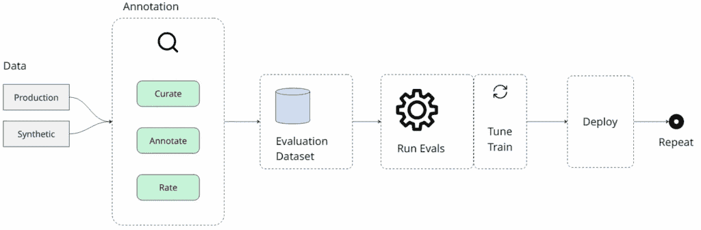

# LLM 评估笔记

> 原文：[`towardsdatascience.com/notes-on-llm-evaluation/`](https://towardsdatascience.com/notes-on-llm-evaluation/)

<mdspan datatext="el1758741855120" class="mdspan-comment">在人工智能工程领域</mdspan>，有人可能会认为，我们的大部分工作与传统软件开发更相似，而不是机器学习或数据科学，考虑到我们通常使用现成的基座模型而不是自己训练。即便如此，我仍然认为，构建基于 LLM 的应用程序中最关键的部分之一是数据，特别是评估流程。你不能改善你不能衡量的东西，你不能衡量你不懂的东西。要构建评估流程，你仍然需要在检查、理解和分析你的数据上投入大量努力。

在这篇博客文章中，我想记录下我目前正在开发的一个基于 LLM 的应用程序评估流程构建过程中的笔记。这同样是一个将我在网上阅读的理论概念应用到具体例子中的练习，主要来自[Hamel Husain 的博客](https://hamel.dev/blog/posts/evals-faq/)。

## 目录

1.  **应用** – 解释我们的场景和用例

1.  **评估流程** – 评估流程及其主要组件的概述。对于每个步骤，我们将将其分为：

    1.  **概述** – 对步骤的简要、概念性解释。

    1.  **实践** – 根据我们的用例应用概念的具体例子。

1.  **未来展望** – 这只是开始。我们的评估流程将如何演变？

1.  **结论** – 总结关键步骤和最终思考。

* * *

## 1. 应用

为了使我们的讨论具体化，让我们用一个具体的例子来说明：一个**AI 驱动的 IT 帮助台助手**。

AI 作为第一线的支持。员工提交一个描述技术问题的工单——他们的笔记本电脑运行缓慢，他们无法连接到 VPN，或者应用程序崩溃。AI 的任务是分析工单，提供初步的故障排除步骤，或者解决问题或者将其升级给适当的人类专家。

评估这个应用程序的性能是一个主观的任务。AI 的输出是自由形式的文本，这意味着没有单一的“正确”答案。一个有用的响应可以以多种方式表达，所以我们不能简单地检查输出是“选项 A”还是“选项 B”。这也不是一个回归任务，我们可以使用像均方误差（MSE）这样的指标来衡量数值误差。

一个“好的”响应是由多个因素决定的：AI 是否正确诊断了问题？它是否提出了相关且安全的故障排除步骤？它是否知道何时将一个关键问题升级给人类专家？一个响应可能是事实上的正确，但无助于解决问题，或者它可能因为未能升级一个严重问题而失败。

> * 为了说明：我正在使用 IT 帮助台场景作为我实际用例的替代品，以公开讨论方法论。这个类比并不完美，所以一些例子可能为了说明特定观点而感觉有点牵强。

## 2. 评估流程

现在我们已经了解了我们的用例，让我们继续概述提出的评估流程。在接下来的部分中，我们将详细说明每个部分，并通过提供与我们的用例相关的示例来对其进行背景化。



评估流程概述，展示从数据收集到可重复、迭代改进周期的流程。图由作者提供。

### 数据

所有这一切都始于数据——理想情况下，来自你的生产环境的真实数据。如果你还没有，你可以尝试自己使用你的应用程序，或者请朋友使用它来了解它可能失败的方式。在某些情况下，生成合成数据以开始工作或补充现有数据是有可能的，如果你的数据量较低。

当使用合成数据时，确保其质量高且与真实世界数据的期望紧密匹配。

虽然 LLM 相对较新，但人类已经研究、培训和认证自己很长时间了。如果可能的话，尝试利用为人类设计的现有材料来帮助你为你的应用程序生成数据。

### 在实践中

我的初始数据集很小，包含一些来自生产的真实用户工单和一些领域专家创建的演示示例，以涵盖常见场景。

由于我没有很多示例，我使用了现有的 IT 支持专业人员的认证考试，这些考试包括带有答案指南和评分关键的多选题。这样，我不仅有了正确答案，还有每个选项为什么对或错的详细解释。

我使用一个 LLM 将这些考试问题转换成更有用的格式。每个问题都变成了模拟的用户工单，答案键和解释被重新用于生成有效和无效 AI 响应的示例，每个示例都有明确的理由。

当使用外部来源时，重要的是要留意数据污染。如果认证材料是公开可用的，它可能已经被包含在基础模型的训练数据中。这可能导致你评估模型的记忆能力而不是其对新、未见问题的推理能力，这可能会导致过于乐观或误导性的结果。如果模型在这组数据上的表现看起来出奇地完美，或者如果其输出与源文本非常接近，那么很可能是存在污染。

### 数据标注

现在你已经收集了一些数据，下一步至关重要的步骤是分析它。这个过程应该是主动的，所以确保你在进行的过程中记录你的见解。数据标注中涉及的不同任务有多种分类或划分方式。我通常将其考虑为两个主要部分：

+   **错误分析**：审查现有的（通常是完美的）输出以识别故障。例如，你可以添加解释故障的文本注释或用不同的错误类别标记不充分的回答。你可以在[Hamel Husain 的博客](https://hamel.dev/blog/posts/evals-faq/#error-analysis-data-collection)上找到关于错误分析的更详细解释。

+   **成功定义**：创建理想的工件来定义成功的外观。例如，对于每个输出，你可以编写真实参考答案或制定一个评分标准，其中包含指定理想答案应包含的指南。

主要目标是更清楚地了解你的数据和应用程序。错误分析有助于识别你的应用程序面临的主要故障模式，使你能够解决根本问题。同时，定义成功使你能够建立适当的准则和指标，以准确评估你的模型性能。

如果你对精确记录信息不确定，不要担心。最好从开放式笔记和无结构化的注释开始，而不是过分关注完美的格式。随着时间的推移，你会注意到需要评估的关键方面和常见的失败模式自然会显现出来。

### 在实践中

我决定首先创建一个专门为数据标注设计的定制工具，这样我就可以扫描生产数据，添加注释，并生成参考答案，如前所述。我发现这是一个相对快速的过程，因为我们可以构建一个在一定程度上独立于你的主要应用程序的工具。考虑到这是一个个人使用且范围有限的工具，我能够以比通常设置更少的担忧“vibe-code”它。当然，我仍然会审查代码，但如果偶尔出现问题，我并不太担心。

对我来说，这个过程最重要的成果是，我逐渐学会了什么因素使得一个回答不好，以及什么因素使得一个回答好。有了这个认识，你可以定义你的评估指标，以有效地衡量对你用例重要的事情。例如，我意识到我的解决方案表现出“过度推荐”的行为，这意味着将简单的请求升级到人工专家。其他问题，程度较轻，包括不准确的故障排除步骤和错误的根本原因诊断。

### 编写评分标准

在成功定义步骤中，我发现编写**评分标准**非常有帮助。我创建评分标准的指导原则是问自己：**什么因素使得一个理想的回答成为好的回答？**这有助于减少评估过程的主观性——无论回答如何措辞，它都应该在评分标准中勾选所有框。

考虑到这是您评估过程的初始阶段，您事先可能无法了解所有整体标准，因此我将以示例为基础定义需求，而不是试图为所有示例建立一个单一指南。我也并没有过于担心设置一个严格的方案。我的评分标准中任何一项都需要有一个键和一个值。我可以选择这个值是布尔值、字符串或字符串列表。评分标准可以灵活，因为它们旨在由人类或 LLM 评委使用，两者都可以处理这种主观性。此外，如前所述，随着您继续这个过程，理想的评分标准指南将自然稳定。

这里有一个例子：

```py
{
  "fields": {
    "clarifying_questions": {
      "type": "array<string>",
      "value": [
        "Asks for the specific error message",
        "Asks if the user recently changed their password"
      ]
    },
    "root_cause_diagnosis": {
      "type": "string",
      "value": "Expired user credentials or MFA token sync issue"
    },
    "escalation_required": {
      "type": "boolean",
      "value": false
    },
    "recommended_solution_steps": {
      "type": "array<string>",
      "value": [
        "Guide user to reset their company password",
        "Instruct user to re-sync their MFA device"
      ]
    }
  }
}
```

尽管每个示例的评分标准可能与其他的不同，但我们可以将它们分组为定义良好的评估标准，用于下一步。

### 运行评估

拥有标注数据在手，您可以构建一个可重复的评估过程。第一步是精心挑选您标注示例的一个子集，以创建一个版本化的评估数据集。这个数据集应包含代表性的示例，涵盖您应用常见用例以及您已识别的所有故障模式。版本化是至关重要的；在比较不同的实验时，您必须确保它们是在相同的数据上进行的基准测试。

对于像我们这样的主观任务，其中输出是自由文本，一个“LLM 作为评委”可以自动化评分过程。评估流程将您的数据集中的一个输入、AI 应用的相应输出以及您创建的注释（如参考答案和评分标准）提供给 LLM 评委。评委的角色是针对提供的标准对输出进行评分，将主观评估转化为可量化的指标。

这些指标允许您系统地衡量任何变化的影响，无论是新的提示、不同的模型还是 RAG 策略的变化。为了确保这些指标有意义，定期验证 LLM 评委的评估与人类领域专家在可接受的范围内一致是至关重要的。

### 在实践中

在完成数据标注过程后，我们应该对什么使一个响应好或不好有一个更清晰的理解，并在此基础上建立一套核心的评估维度。在我的情况下，我确定了以下领域：

+   **升级行为**：衡量 AI 是否适当地升级工单。一个响应被评为适当、过度升级（升级简单问题）或不足升级（未能升级关键问题）。

+   **根本原因准确性**：评估 AI 是否正确识别了用户的问题。这是一个二元的正确或错误评估。

+   **解决方案质量**：评估提出的故障排除步骤的相关性和安全性。它还考虑 AI 在提供解决方案之前是否请求必要的澄清信息。它被评为适当或不适当。

在定义了这些维度之后，我可以运行评估。对于我的版本化评估集中的每个项目，系统都会生成一个响应。然后，将这个响应、原始票据及其注释的评分标准传递给一个 LLM 评分员。评分员收到一个提示，指导它如何使用评分标准在三个维度上评分响应。

这是我为 LLM 评分员使用的提示：

```py
You are an expert IT Support AI evaluator. Your task is to judge the quality of an AI-generated response to an IT helpdesk ticket. To do so, you will be given the ticket details, a reference answer from a senior IT specialist, and a rubric with evaluation criteria.

#{ticket_details}

**REFERENCE ANSWER (from IT Specialist):**
#{reference_answer}

**NEW AI RESPONSE (to be evaluated):**
#{new_ai_response}

**RUBRIC CRITERIA:**
#{rubric_criteria}

**EVALUATION INSTRUCTIONS:**

[Evaluation instructions here...]

**Evaluation Dimensions**
Evaluate the AI response on the following dimensions:
- Overall Judgment: GOOD/BAD
- Escalation Behavior: If the rubric's `escalation_required` is `false` but the AI escalates, label it as `OVER-ESCALATION`. If `escalation_required` is `true` but the AI does not escalate, label it `UNDER-ESCALATION`. Otherwise, label it `ADEQUATE`.
- Root Cause Accuracy: Compare the AI's diagnosis with the `root_cause_diagnosis` field in the rubric. Label it `CORRECT` or `INCORRECT`.
- Solution Quality: If the AI's response fails to include necessary `recommended_solution_steps` or `clarifying_questions` from the rubric, or suggests something unsafe, label it as `INADEQUATE`. Otherwise, label it as `ADEQUATE`.

If the rubric does not provide enough information to evaluate a dimension, use the reference answer and your expert judgment.

**Please provide:**
1\. An overall judgment (GOOD/BAD)
2\. A detailed explanation of your reasoning
3\. The escalation behavior (`OVER-ESCALATION`, `ADEQUATE`, `UNDER-ESCALATION`)
4\. The root cause accuracy (`CORRECT`, `INCORRECT`)
5\. The solution quality (`ADEQUATE`, `INADEQUATE`)

**Response Format**
Provide your response in the following JSON format:

{
  "JUDGMENT": "GOOD/BAD",
  "REASONING": "Detailed explanation",
  "ESCALATION_BEHAVIOR": "OVER-ESCALATION/ADEQUATE/UNDER-ESCALATION",
  "ROOT_CAUSE_ACCURACY": "CORRECT/INCORRECT",
  "SOLUTION_QUALITY": "ADEQUATE/INADEQUATE"
}
```

## 3. 未来展望

我们的应用程序开始时很简单，我们的评估流程也是如此。随着系统的扩展，我们需要调整我们衡量其性能的方法。这意味着我们将来必须考虑几个方面。一些关键方面包括：

### 需要多少个示例才足够？

我开始时大约有 50 个示例，但我还没有分析这个数字是否接近理想值。理想情况下，我们希望有足够的示例来产生可靠的结果，同时保持运行成本可负担。在[Chip Huyen 的《AI 工程》](https://www.amazon.com.br/AI-Engineering-Building-Applications-Foundation/dp/1098166302)一书中，提到了一种有趣的方法，该方法涉及创建评估集的自举。例如，从我最初的 50 个样本集中，我可以通过替换抽取 50 个样本来创建多个自举，然后评估并比较这些自举的性能。如果你观察到非常不同的结果，这可能意味着你需要更多示例在你的评估集中。

当涉及到错误分析时，我们也可以应用来自[Husain 的博客](https://hamel.dev/blog/posts/evals-faq/#iterative-refinement)的有用经验法则：

> 继续迭代更多轨迹，直到达到理论饱和，这意味着新的轨迹似乎没有揭示新的失败模式或信息给你。作为一个经验法则，你应该努力至少审查至少 100 个轨迹。

### 将 LLM 评分员与人类专家对齐

我们希望我们的 LLM 评分员尽可能保持一致性，但这很具挑战性，因为判断提示将被修订，底层模型可能会由提供商更改或更新，等等。此外，随着时间的推移，你评分输出时，你的评估标准也会提高，因此始终确保你的 LLM 评分员与你的判断或领域专家的判断保持一致至关重要。你可以安排定期会议与领域专家审查 LLM 判断的样本，并计算自动评估和人工评估之间的简单一致性百分比，当然，在必要时调整你的流程。

### 过拟合

在 LLM 世界中，过拟合仍然是一个问题。即使我们不是直接训练模型，我们仍然通过调整指令提示、完善检索系统、设置参数和增强上下文工程来训练我们的系统。如果我们的更改基于评估结果，那么我们可能会过度优化当前集合，因此我们仍然需要遵循标准建议来防止过拟合，例如使用保留集。

### 增加的复杂性

目前，我保持这个应用程序简单，因此我们有较少的组件需要评估。随着我们的解决方案变得更加复杂，我们的评估流程也将变得更加复杂。如果我们的应用程序涉及具有记忆的多轮对话，或不同的工具使用或上下文检索系统，我们应该将系统分解成多个任务，并单独评估每个组件。到目前为止，我一直在使用简单的输入/输出对进行评估，因此直接从我的数据库中检索数据就足够了。然而，随着我们系统的演变，我们可能需要跟踪单个请求的整个事件链。这涉及到采用记录 LLM 跟踪的解决方案，例如使用[Arize](https://arize.com/)、[HoneyHive](https://www.honeyhive.ai/)或[LangFuse](https://langfuse.com/)等平台。

### 持续迭代和数据漂移

生产环境不断变化。用户期望不断演变，使用模式转变，新的故障模式出现。今天创建的评估集可能在六个月后就不再具有代表性。这种变化需要持续的数据标注，以确保评估集始终反映应用程序当前的使用状态及其不足之处。

## 4. 结论

在本文中，我们介绍了一些构建评估数据基础的关键概念，以及我们用例的实用细节。我们从一个小型、混合来源的数据集开始，逐步开发了一个可重复的测量系统。主要步骤包括积极标注数据、分析错误，并使用评分标准定义成功，这帮助我们将主观问题转化为可衡量的维度。在标注我们的数据并更好地理解它之后，我们使用一个大型语言模型（LLM）作为评判者来自动评分，并创建一个反馈循环以实现持续改进。

虽然这里概述的流程是一个起点，但下一步需要解决数据漂移、评判者一致性以及系统复杂性增加等挑战。通过努力理解和组织你的评估数据，你将获得有效迭代和开发更可靠应用程序所需的清晰度。

*“[关于 LLM 评估的笔记](https://open.substack.com/pub/datatravelogues/p/notes-on-llm-evaluation?r=osn8a&utm_campaign=post&utm_medium=web&showWelcomeOnShare=false)”最初发表在作者的[个人通讯](https://datatravelogues.substack.com/)中。*

## 参考文献

+   [Hamel Husain 的博客](https://hamel.dev/)

+   Shankar, Shreya, 等人。 “[谁验证验证者？将 LLM 辅助的 LLM 输出评估与人类偏好对齐。](https://arxiv.org/abs/2404.12272)“

+   [Chip Huyen 的《AI 工程：使用基础模型构建应用程序》](https://www.amazon.com.br/AI-Engineering-Building-Applications-Foundation/dp/1098166302)
