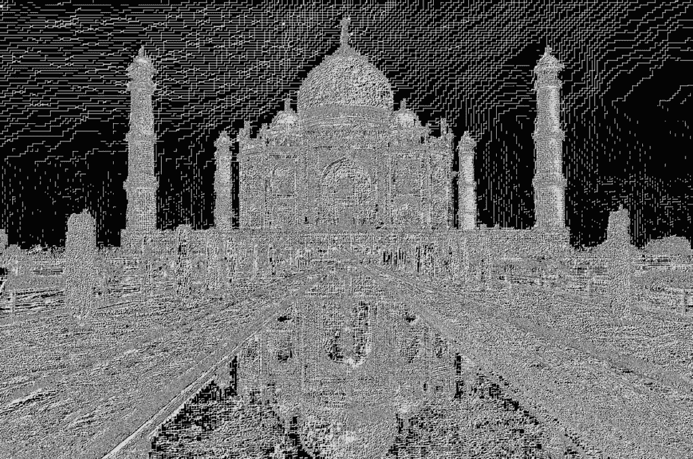
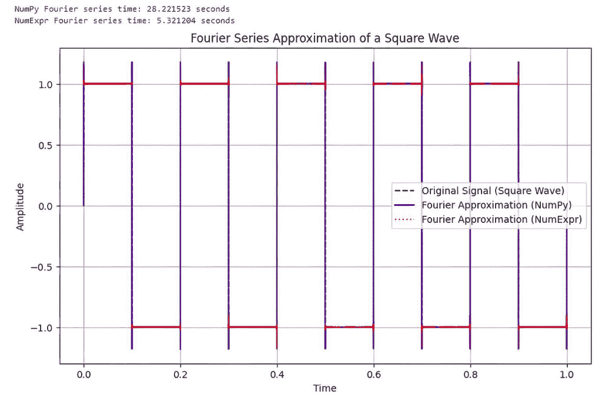

# NumExpr：大多数数据科学家从未使用过的“比 NumPy 更快的库”

> 原文：[`towardsdatascience.com/numexpr-the-faster-than-numpy-library-that-no-ones-heard-of/`](https://towardsdatascience.com/numexpr-the-faster-than-numpy-library-that-no-ones-heard-of/)

<mdspan datatext="el1745609197438" class="mdspan-comment">前几天在 GitHub 上浏览时，我遇到了一个我以前从未听说过的库。它被称为 **NumExpr**。</mdspan>

我立刻对此产生了兴趣，因为关于这个库的一些说法。特别是，它声称对于某些复杂的数值计算，它的速度比 NumPy 快 15 倍。

我对此感到好奇，因为到目前为止，NumPy 在 Python 的数值计算空间中一直占据主导地位。特别是在数据科学领域，NumPy 是机器学习、数据探索分析和模型训练的基石。任何可以帮助我们从系统中挤出最后一丝性能的东西都将受到欢迎。因此，我决定亲自对这些说法进行测试。

您可以在本文末尾找到 NumExpr 存储库的链接。

## 什么是 NumExpr？

根据其 GitHub 页面，NumExpr 是一个快速的 NumPy 数值表达式评估器。使用它，操作数组的表达式会加速，并且比使用其他数值库（如 NumPy）在 Python 中执行相同的计算使用更少的内存。

此外，由于它是多线程的，NumExpr 可以使用您所有的 CPU 核心，这通常会导致与 NumPy 相比有实质性的性能提升。

## 设置开发环境

在我们开始编码之前，让我们设置我们的开发环境。最佳实践是创建一个单独的 Python 环境，在那里您可以安装任何必要的软件并尝试编码，知道您在这个环境中所做的任何操作都不会影响您的整个系统。我使用 conda 来做这件事，但您可以使用您最熟悉且适合您的方法。

如果您想走 Miniconda 路线并且还没有安装它，您必须首先安装 Miniconda。使用此链接获取它：

[`www.anaconda.com/docs/main`](https://www.anaconda.com/docs/main)

**1/ 创建我们的新开发环境并安装所需的库** 

```py
(base) $ conda create -n numexpr_test python=3.12-y
(base) $ conda activate numexpr
(numexpr_test) $ pip install numexpr
(numexpr_test) $ pip install jupyter
```

**2/ 开始 Jupyter**

现在请在您的命令提示符中输入`jupyter notebook`。您应该在浏览器中看到一个打开的 Jupyter Notebook。如果它没有自动打开，您可能会在`jupyter notebook`命令后看到一整屏的信息。在底部附近，您会找到一个您应该复制并粘贴到浏览器中以启动 Jupyter Notebook 的 URL。

您的 URL 将与我的不同，但它应该看起来像这样：-

```py
http://127.0.0.1:8888/tree?token=3b9f7bd07b6966b41b68e2350721b2d0b6f388d248cc69
```

## 比较 NumExpr 和 NumPy 的性能

为了比较性能，我们将使用 NumPy 和 NumExpr 运行一系列数值计算，并测量这两个系统的运行时间。

**示例 1 — 一个简单的数组加法计算**

在这个例子中，我们运行了两个大型数组向量化加法 5000 次。

```py
import numpy as np
import numexpr as ne
import timeit

a = np.random.rand(1000000)
b = np.random.rand(1000000)

# Using timeit with lambda functions
time_np_expr = timeit.timeit(lambda: 2*a + 3*b, number=5000)
time_ne_expr = timeit.timeit(lambda: ne.evaluate("2*a + 3*b"), number=5000)

print(f"Execution time (NumPy): {time_np_expr} seconds")
print(f"Execution time (NumExpr): {time_ne_expr} seconds")

>>>>>>>>>>>

Execution time (NumPy): 12.03680682599952 seconds
Execution time (NumExpr): 1.8075962659931974 seconds
```

我必须说，NumExpr 库的起点已经相当令人印象深刻了。我认为这比 NumPy 运行时间快了 6 倍。

让我们再次确认这两个操作返回相同的结果集。

```py
 # Arrays to store the results
result_np = 2*a + 3*b
result_ne = ne.evaluate("2*a + 3*b")

# Ensure the two new arrays are equal
arrays_equal = np.array_equal(result_np, result_ne)
print(f"Arrays equal: {arrays_equal}")

>>>>>>>>>>>>

Arrays equal: True
```

**示例 2—使用蒙特卡洛计算π**

我们的第二个例子将检查一个更复杂的用例，它有更多的实际应用。

蒙特卡洛模拟涉及运行许多随机过程的迭代来估计系统的属性，这可能计算量很大。

在这个例子中，我们将使用蒙特卡洛计算π的值。这是一个众所周知的例子，我们取一个边长为 1 个单位的正方形，并在其中绘制一个半径为 1 个单位的四分之一圆。四分之一圆的面积与正方形面积之比为*(π/4)/1，我们可以将这个表达式乘以 4 来得到***π***。

因此，如果我们考虑所有位于或位于正方形边界内的随机(x,y)点，随着这些点的总数趋于无穷大，位于或位于四分之一圆内或其上的点的比例趋于π。

首先，是 NumPy 的实现。

```py
import numpy as np
import timeit

def monte_carlo_pi_numpy(num_samples):
    x = np.random.rand(num_samples)
    y = np.random.rand(num_samples)
    inside_circle = (x**2 + y**2) <= 1.0
    pi_estimate = (np.sum(inside_circle) / num_samples) * 4
    return pi_estimate

# Benchmark the NumPy version
num_samples = 1000000
time_np_expr = timeit.timeit(lambda: monte_carlo_pi_numpy(num_samples), number=1000)
pi_estimate = monte_carlo_pi_numpy(num_samples)

print(f"Estimated Pi (NumPy): {pi_estimate}")
print(f"Execution Time (NumPy): {time_np_expr} seconds")

>>>>>>>>

Estimated Pi (NumPy): 3.144832
Execution Time (NumPy): 10.642843848007033 seconds
```

现在，使用 NumExpr。

```py
import numpy as np
import numexpr as ne
import timeit

def monte_carlo_pi_numexpr(num_samples):
    x = np.random.rand(num_samples)
    y = np.random.rand(num_samples)
    inside_circle = ne.evaluate("(x**2 + y**2) <= 1.0")
    pi_estimate = (np.sum(inside_circle) / num_samples) * 4  # Use NumPy for summation
    return pi_estimate

# Benchmark the NumExpr version
num_samples = 1000000
time_ne_expr = timeit.timeit(lambda: monte_carlo_pi_numexpr(num_samples), number=1000)
pi_estimate = monte_carlo_pi_numexpr(num_samples)

print(f"Estimated Pi (NumExpr): {pi_estimate}")
print(f"Execution Time (NumExpr): {time_ne_expr} seconds")

>>>>>>>>>>>>>>>

Estimated Pi (NumExpr): 3.141684
Execution Time (NumExpr): 8.077501275009126 seconds
```

好吧，那次加速并不那么令人印象深刻，但 20%的改进也不算差。部分原因是 NumExpr 没有优化的 SUM()函数，所以我们不得不默认回到 NumPy 来执行这个操作。

**示例 3—实现 Sobel 图像滤波器**

在这个例子中，我们将实现图像的 Sobel 滤波器。Sobel 滤波器在图像处理中常用于边缘检测。它计算每个像素的图像强度梯度，突出边缘和强度变化。我们的输入图像是印度的泰姬陵。


**原始图像由 Yury Taranik 提供（授权自 Shutterstock）**

让我们先看看 NumPy 代码的运行情况，并计时。

```py
import numpy as np
from scipy.ndimage import convolve
from PIL import Image
import timeit

# Sobel kernels
sobel_x = np.array([[-1, 0, 1],
                    [-2, 0, 2],
                    [-1, 0, 1]])

sobel_y = np.array([[-1, -2, -1],
                    [ 0,  0,  0],
                    [ 1,  2,  1]])

def sobel_filter_numpy(image):
    """Apply Sobel filter using NumPy."""
    img_array = np.array(image.convert('L'))  # Convert to grayscale
    gradient_x = convolve(img_array, sobel_x)
    gradient_y = convolve(img_array, sobel_y)
    gradient_magnitude = np.sqrt(gradient_x**2 + gradient_y**2)
    gradient_magnitude *= 255.0 / gradient_magnitude.max()  # Normalize to 0-255

    return Image.fromarray(gradient_magnitude.astype(np.uint8))

# Load an example image
image = Image.open("/mnt/d/test/taj_mahal.png")

# Benchmark the NumPy version
time_np_sobel = timeit.timeit(lambda: sobel_filter_numpy(image), number=100)
sobel_image_np = sobel_filter_numpy(image)
sobel_image_np.save("/mnt/d/test/sobel_taj_mahal_numpy.png")

print(f"Execution Time (NumPy): {time_np_sobel} seconds")

>>>>>>>>>

Execution Time (NumPy): 8.093792188999942 seconds
```

现在来看看 NumExpr 的代码。

```py
import numpy as np
import numexpr as ne
from scipy.ndimage import convolve
from PIL import Image
import timeit

# Sobel kernels
sobel_x = np.array([[-1, 0, 1],
                    [-2, 0, 2],
                    [-1, 0, 1]])

sobel_y = np.array([[-1, -2, -1],
                    [ 0,  0,  0],
                    [ 1,  2,  1]])

def sobel_filter_numexpr(image):
    """Apply Sobel filter using NumExpr for gradient magnitude computation."""
    img_array = np.array(image.convert('L'))  # Convert to grayscale
    gradient_x = convolve(img_array, sobel_x)
    gradient_y = convolve(img_array, sobel_y)
    gradient_magnitude = ne.evaluate("sqrt(gradient_x**2 + gradient_y**2)")
    gradient_magnitude *= 255.0 / gradient_magnitude.max()  # Normalize to 0-255

    return Image.fromarray(gradient_magnitude.astype(np.uint8))

# Load an example image
image = Image.open("/mnt/d/test/taj_mahal.png")

# Benchmark the NumExpr version
time_ne_sobel = timeit.timeit(lambda: sobel_filter_numexpr(image), number=100)
sobel_image_ne = sobel_filter_numexpr(image)
sobel_image_ne.save("/mnt/d/test/sobel_taj_mahal_numexpr.png")

print(f"Execution Time (NumExpr): {time_ne_sobel} seconds")

>>>>>>>>>>>>>

Execution Time (NumExpr): 4.938702256011311 seconds
```

在这个场合，使用 NumExpr 得到了一个很好的结果，性能接近 NumPy 的两倍。

这就是边缘检测图像的样子。



**图像由作者提供**

**示例 4—傅里叶级数近似**

众所周知，复周期函数可以通过叠加一系列正弦波来模拟。在极端情况下，甚至可以用这种方法轻松地模拟方波。这种方法被称为傅里叶级数近似。虽然是一种近似，但我们可以在内存和计算能力允许的范围内尽可能接近目标波形。

所有这些背后的数学并不是主要关注点。只需知道，当我们增加迭代次数时，解决方案的运行时间会显著增加。

```py
import numpy as np
import numexpr as ne
import time
import matplotlib.pyplot as plt

# Define the constant pi explicitly
pi = np.pi

# Generate a time vector and a square wave signal
t = np.linspace(0, 1, 1000000) # Reduced size for better visualization
signal = np.sign(np.sin(2 * np.pi * 5 * t))

# Number of terms in the Fourier series
n_terms = 10000

# Fourier series approximation using NumPy
start_time = time.time()
approx_np = np.zeros_like(t)
for n in range(1, n_terms + 1, 2):
    approx_np += (4 / (np.pi * n)) * np.sin(2 * np.pi * n * 5 * t)
numpy_time = time.time() - start_time

# Fourier series approximation using NumExpr
start_time = time.time()
approx_ne = np.zeros_like(t)
for n in range(1, n_terms + 1, 2):
    approx_ne = ne.evaluate("approx_ne + (4 / (pi * n)) * sin(2 * pi * n * 5 * t)", local_dict={"pi": pi, "n": n, "approx_ne": approx_ne, "t": t})
numexpr_time = time.time() - start_time

print(f"NumPy Fourier series time: {numpy_time:.6f} seconds")
print(f"NumExpr Fourier series time: {numexpr_time:.6f} seconds")

# Plotting the results
plt.figure(figsize=(10, 6))

plt.plot(t, signal, label='Original Signal (Square Wave)', color='black', linestyle='--')
plt.plot(t, approx_np, label='Fourier Approximation (NumPy)', color='blue')
plt.plot(t, approx_ne, label='Fourier Approximation (NumExpr)', color='red', linestyle='dotted')

plt.title('Fourier Series Approximation of a Square Wave')
plt.xlabel('Time')
plt.ylabel('Amplitude')
plt.legend()
plt.grid(True)
plt.show()
```

输出结果是什么？



**图像由作者提供**

这又是一个相当不错的结果。在这个场合，NumExpr 比 Numpy 快了 5 倍。

### **总结**

NumPy 和 NumExpr 都是用于 Python 数值计算的强大库。它们各自具有独特的优势和用例，使得它们适用于不同类型的任务。在这里，我们比较了它们在特定计算任务中的性能和适用性，重点关注从简单的数组加法到更复杂的应用，例如使用 Sobel 滤波器进行图像边缘检测的示例。

虽然在我的测试中并没有看到声称的比 NumPy 快 15 倍的速度提升，但毫无疑问，在许多情况下 NumExpr 可以比 NumPy 快得多。

如果你是一个 NumPy 的重度用户，并且需要从你的代码中提取每一分性能，我建议尝试使用 NumExpr 库。除了并非所有 NumPy 代码都可以使用 NumExpr 来复制之外，实际上没有多少缺点，而且潜在的好处可能会让你感到惊讶。

想要了解更多关于 NumExpr 库的详细信息，请查看 GitHub 页面 [这里](https://github.com/pydata/numexpr)。
