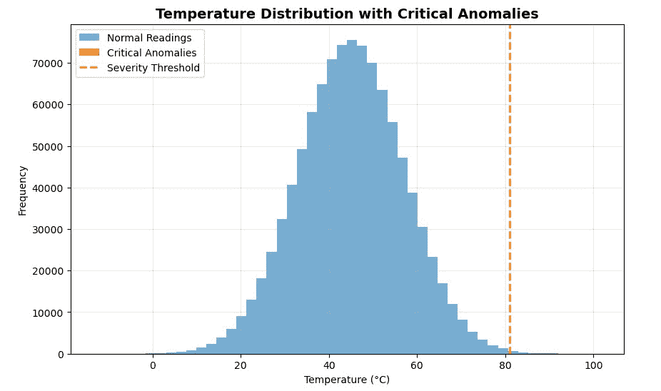

# NumPy 绝对入门：基于项目的方法进行数据分析

> 原文：[`towardsdatascience.com/numpy-for-absolute-beginners-a-project-based-approach-to-data-analysis/`](https://towardsdatascience.com/numpy-for-absolute-beginners-a-project-based-approach-to-data-analysis/)

<mdspan datatext="el1762287817531" class="mdspan-comment">为了学习 NumPy，我一直在</mdspan>进行一系列构建小型项目的活动。我构建了一个[个人习惯](https://towardsdatascience.com/using-numpy-to-analyze-my-daily-habits-sleep-screen-time-mood/)和[天气分析](https://towardsdatascience.com/hidden-gems-in-numpy-7-functions-every-data-scientist-should-know/)项目。但我还没有真正有机会探索 NumPy 的全部功能和能力。我想尝试理解为什么 NumPy 在数据分析中如此有用。为了结束这个系列，我将实时展示这一点。

我将使用一个虚构的客户或公司来使事情互动。在这种情况下，我们的客户将是**EnviroTech Dynamics**，一个全球工业传感器网络的运营商。

目前，EnviroTech 依赖于过时的基于循环的 Python 脚本来处理每天超过**100 万次传感器读数**。这个过程非常缓慢，延迟了关键维护决策，影响了运营效率。他们需要一个现代化、高性能的解决方案。

我被要求创建一个基于 NumPy 的证明概念，以展示如何**加速他们的数据管道**。

## 数据集：模拟传感器读数

为了证明这个概念，我将使用 NumPy 的随机模块生成的大型模拟数据集进行工作，其中包含以下关键数组：

+   温度 — 每个数据点代表机器或系统组件运行时的热度。这些读数可以快速帮助我们检测到机器开始过热的情况——这是可能故障、效率低下或安全风险的迹象。

+   压力 — 显示系统内部压力积累的数据，以及它是否在安全范围内

+   状态码 — 代表在特定时刻每个机器或系统的健康状况或状态。0（正常），1（警告），2（关键），3（故障/缺失）。

## 项目目标

核心目标是提供四个清晰、向量化的解决方案来解决 EnviroTech 的数据挑战，展示速度和力量。所以，我将展示所有这些：

+   性能和效率基准

+   基础统计基线

+   关键异常检测

+   数据清洗和插补

到这篇文章结束时，你应该能够全面掌握 NumPy 及其在数据分析中的实用性。

## 目标 1：性能和效率基准

首先，我们需要一个庞大的数据集来使速度差异明显。我将使用我们之前计划的**100 万次温度读数**。

```py
import numpy as np
# Set the size of our data
NUM_READINGS = 1_000_000

# Generate the Temperature array (1 million random floating-point numbers)
# We use a seed so the results are the same every time you run the code
np.random.seed(42)
mean_temp = 45.0
std_dev_temp = 12.0
temperature_data = np.random.normal(loc=mean_temp, scale=std_dev_temp, size=NUM_READINGS)

print(f”Data array size: {temperature_data.size} elements”)
print(f”First 5 temperatures: {temperature_data[:5]}”)
```

**输出：**

```py
Data array size: 1000000 elements
First 5 temperatures: [50.96056984 43.34082839 52.77226246 63.27635828 42.1901595 ]
```

现在我们有了我们的记录。让我们看看 NumPy 的有效性。

假设我们想要使用标准的 Python 循环计算所有这些元素的平均值，它将类似于这样。

```py
# Function using a standard Python loop
def calculate_mean_loop(data):
total = 0
count = 0
for value in data:
total += value
count += 1
return total / count

# Let’s run it once to make sure it works
loop_mean = calculate_mean_loop(temperature_data)
print(f”Mean (Loop method): {loop_mean:.4f}”)
```

这种方法没有问题。但是它相当慢，因为计算机必须逐个处理每个数字，不断地在 Python 解释器和 CPU 之间移动。

为了真正展示速度，我将使用 `%timeit` 命令。这个命令会运行代码数百次，以提供可靠的平均执行时间。

```py
# Time the standard Python loop (will be slow)
print(“ — — Timing the Python Loop — -”)
%timeit -n 10 -r 5 calculate_mean_loop(temperature_data)
```

**输出**

```py
--- Timing the Python Loop ---
244 ms ± 51.5 ms per loop (mean ± std. dev. of 5 runs, 10 loops each)
```

使用 `-n 10`，我基本上是在循环中运行代码 10 次（以获得稳定的平均值），使用 `-r 5`，整个过程将重复 5 次（以获得更多的稳定性）。

现在，让我们将这个与 NumPy 的矢量化进行比较。通过矢量化，我的意思是整个操作（在这个例子中是平均值）将一次性在整个数组上执行，使用后台高度优化的 C 代码。

这是使用 NumPy 计算平均值的示例

```py
# Using the built-in NumPy mean function
def calculate_mean_numpy(data):
return np.mean(data)
# Let’s run it once to make sure it works
numpy_mean = calculate_mean_numpy(temperature_data)
print(f”Mean (NumPy method): {numpy_mean:.4f}”)
```

**输出：**

```py
Mean (NumPy method): 44.9808
```

现在让我们计时。

```py
# Time the NumPy vectorized function (will be fast)
print(“ — — Timing the NumPy Vectorization — -”)
%timeit -n 10 -r 5 calculate_mean_numpy(temperature_data)
```

**输出：**

```py
--- Timing the NumPy Vectorization ---
1.49 ms ± 114 μs per loop (mean ± std. dev. of 5 runs, 10 loops each)
```

现在，这是一个巨大的差异。这几乎是不存在的。这就是矢量化（vectorisation）的力量。

让我们向客户展示这个速度差异：

> “我们比较了两种在百万个温度读数上执行相同计算的方法—传统的 Python for 循环和 NumPy 矢量化操作。
> 
> 差异非常显著：纯 Python 循环每次运行大约需要 **244 毫秒**，而 NumPy 版本只需 **1.49 毫秒**就完成了同样的任务。
> 
> 这大约是 **160 倍的速度提升**。”

## 目标 2：基础统计基准

NumPy 提供的另一个酷炫功能是能够执行基本的到高级的统计计算—这样，你可以很好地了解你的数据集中发生了什么。它提供了如下操作：

+   np.mean() — 用于计算平均值

+   np.median — 数据的中值

+   np.std() — 显示你的数字与平均值的离散程度

+   np.percentile() — 告诉你数据中某个百分比以下的价值。

现在我们已经成功提供了一个替代且高效的解决方案来检索和对其庞大的数据集进行总结和计算，我们可以开始尝试使用它。

我们已经成功生成了模拟的温度数据。让我们为压力做同样的处理。计算压力是展示 NumPy 能够在极短的时间内处理多个大型数组能力的好方法。

对于我们的客户，这也允许我展示他们对工业系统的健康检查。

此外，温度和压力通常相关。压力的突然下降可能是温度上升的原因，反之亦然。计算两者的基线使我们能够看到它们是否一起或独立地漂移。

```py
# Generate the Pressure array (Uniform distribution between 100.0 and 500.0)
np.random.seed(43) # Use a different seed for a new dataset
pressure_data = np.random.uniform(low=100.0, high=500.0, size=1_000_000)
print(“Data arrays ready.”)
```

**输出：**

```py
Data arrays ready.
```

好的，让我们开始计算。

```py
print(“\n — — Temperature Statistics — -”)
# 1\. Mean and Median
temp_mean = np.mean(temperature_data)
temp_median = np.median(temperature_data)

# 2\. Standard Deviation
temp_std = np.std(temperature_data)

# 3\. Percentiles (Defining the 90% Normal Range)
temp_p5 = np.percentile(temperature_data, 5) # 5th percentile
temp_p95 = np.percentile(temperature_data, 95) # 95th percentile

# Formating our results
print(f”Mean (Average): {temp_mean:.2f}°C”)
print(f”Median (Middle): {temp_median:.2f}°C”)
print(f”Std. Deviation (Spread): {temp_std:.2f}°C”)
print(f”90% Normal Range: {temp_p5:.2f}°C to {temp_p95:.2f}°C”)
```

**以下是输出：**

```py
--- Temperature Statistics ---
Mean (Average): 44.98°C
Median (Middle): 44.99°C
Std. Deviation (Spread): 12.00°C
90% Normal Range: 25.24°C to 64.71°C
```

因此，为了解释你在这里看到的内容

**平均值（平均数）：44.98°C**基本上给出了一个中心点，大多数读数预计会落在这个点周围。这非常酷，因为我们不需要扫描整个大型数据集。有了这个数字，我已经对温度读数通常落在哪里有了相当好的了解。

**中位数（中间值）：44.99°C**如果你注意的话，与平均值非常相似。这告诉我们，没有极端的异常值将平均值拉得太高或太低。

**12°C 的标准差**意味着温度与平均值差异很大。基本上，有些日子比其他日子热或冷得多。一个较低的值（比如说 3°C 或 4°C）会表明更多的稳定性，但 12°C 表明一个高度可变的模式。

对于**百分位数**，基本上意味着大多数日子在 25°C 和 65°C 之间徘徊，

如果我要向客户展示这个，我可能会这样说：

> “平均而言，系统（或环境）维持在大约**45°C**的温度，这作为典型操作或环境条件的可靠基线。12°C 的偏差表明温度水平在平均值周围波动很大。
> 
> 简单来说，读数并不非常稳定。最后，90%的所有读数都落在 25°C 和 65°C 之间。这为我们描绘了“正常”的实际情况，有助于你定义警报或维护的可接受阈值。为了提高性能或可靠性，我们可以确定高波动的原因（例如，外部热源、通风模式、系统负载）。

让我们也为压力计算一下。

```py
print(“\n — — Pressure Statistics — -”)
# Calculate all 5 measures for Pressure
pressure_stats = {
“Mean”: np.mean(pressure_data),
“Median”: np.median(pressure_data),
“Std. Dev”: np.std(pressure_data),
“5th %tile”: np.percentile(pressure_data, 5),
“95th %tile”: np.percentile(pressure_data, 95),
}
for label, value in pressure_stats.items():
print(f”{label:<12}: {value:.2f} kPa”)
```

为了改进我们的代码库，我将所有计算存储在一个名为 pressure stats 的字典中，我只是简单地遍历键值对。

**以下是输出：**

```py
--- Pressure Statistics ---
Mean : 300.09 kPa
Median : 300.04 kPa
Std. Dev : 115.47 kPa
5th %tile : 120.11 kPa
95th %tile : 480.09 kPa
```

如果我要向客户展示这个，可能会是这样的：

> “我们的**压力读数平均约为** **300 千帕**，中位数——中间值——几乎相同。这告诉我们压力分布总体上相当平衡。然而，**标准差约为 115 kPa**，这意味着读数之间有很大的差异。换句话说，有些读数比典型的 300 kPa 水平高得多或低得多。
> 
> 看一下**百分位数**，90%的读数落在**120 至 480 kPa**之间。这是一个很大的范围，表明压力条件不稳定——可能在操作期间在低和高状态之间波动。所以虽然平均看起来不错，但变异性可能指向**不一致的性能**或**影响系统的环境因素**。

## 目标 3：关键异常识别

NumPy 我最喜欢的功能之一是能够快速识别和过滤数据集中的异常值。为了演示这一点，我们的虚构客户 EnviroTech Dynamics 为我们提供了一个包含系统状态代码的有用数组。这告诉我们机器是如何持续运行的。它只是一个代码范围（0-3）。

+   **0** → 正常

+   **1** → 警告

+   **2** → 关键

+   **3** → 传感器错误

他们每天接收数百万个读数，我们的任务是找到每个既处于关键状态又运行过热的机器。

用手工或甚至用循环来做这件事会花费很长时间。这就是布尔索引（掩码）发挥作用的地方。它允许我们通过直接将逻辑条件应用于数组来在毫秒内过滤大量数据集，而不需要循环。

之前，我们生成了温度和压力数据。让我们为状态代码做同样的事情。

```py
# Reusing 'temperature_data' from earlier
import numpy as np

np.random.seed(42) # For reproducibility

status_codes = np.random.choice(
a=[0, 1, 2, 3],
size=len(temperature_data),
p=[0.85, 0.10, 0.03, 0.02] # 0=Normal, 1=Warning, 2=Critical, 3=Offline
)

# Let’s preview our data
print(status_codes[:5])
```

**输出：**

```py
[0 2 0 0 0]
```

每个温度读数现在都有一个匹配的状态代码。这使我们能够确定哪些传感器报告了问题以及它们有多严重。

接下来，我们需要某种类型的阈值或异常标准。在大多数情况下，任何超过**平均值 + 3 × 标准差**的数据都被认为是严重的异常值，是你不希望出现在系统中的读数。为了计算这个

```py
temp_mean = np.mean(temperature_data)
temp_std = np.std(temperature_data)
SEVERITY_THRESHOLD = temp_mean + (3 * temp_std)
print(f”Severe Outlier Threshold: {SEVERITY_THRESHOLD:.2f}°C”)
```

**输出：**

```py
Severe Outlier Threshold: 80.99°C
```

接下来，我们将创建两个过滤器（掩码）来隔离符合我们条件的数据。一个用于系统状态为关键（代码 2）的读数，另一个用于温度超过阈值的读数。

```py
# Mask 1 — Readings where system status = Critical (code 2)
critical_status_mask = (status_codes == 2)

# Mask 2 — Readings where temperature exceeds threshold
high_temp_outlier_mask = (temperature_data > SEVERITY_THRESHOLD)

print(f”Critical status readings: {critical_status_mask.sum()}”)
print(f”High-temp outliers: {high_temp_outlier_mask.sum()}”)
```

这就是幕后发生的事情。NumPy 创建了两个填充着 True 或 False 的数组。每个 True 标记一个满足条件的读数。True 将表示为 1，False 将表示为 0。快速求和可以计算匹配的数量。

这是输出：

```py
Critical status readings: 30178
High-temp outliers: 1333
```

让我们在打印最终结果之前将这两个异常合并。我们想要的是既关键又过热的读数。NumPy 允许我们使用逻辑运算符对多个条件进行过滤。在这种情况下，我们将使用表示为`&.`的 AND 函数。

```py
# Combine both conditions with a logical AND
critical_anomaly_mask = critical_status_mask & high_temp_outlier_mask

# Extract actual temperatures of those anomalies
extracted_anomalies = temperature_data[critical_anomaly_mask]
anomaly_count = critical_anomaly_mask.sum()

print(“\n — — Final Results — -”)
print(f”Total Critical Anomalies: {anomaly_count}”)
print(f”Sample Temperatures: {extracted_anomalies[:5]}”)
```

**输出：**

```py
--- Final Results ---
Total Critical Anomalies: 34
Sample Temperatures: [81.9465697 81.11047892 82.23841531 86.65859372 81.146086 ]
```

让我们向客户展示这个

> “在分析了一百万个温度读数后，我们的系统检测到**34 个关键异常**——这些读数既被机器标记为“关键状态”，又超过了高温阈值。
> 
> 这些读数的前几个在**81°C 和 86°C 之间**，这远远高于我们大约 45°C 的正常工作范围。这表明少数传感器报告了**危险的峰值**，可能表明过热或传感器故障。
> 
> 换句话说，虽然我们 99.99%的数据看起来很稳定，但这两个 34 个点代表了我们应该关注维护或进一步调查的**确切位置**。”

让我们用 matplotlib 快速可视化一下



当我第一次绘制结果时，我预期会看到一簇红色柱状图显示我的关键异常。但一个都没有。

起初，我以为出了问题，但后来我想通了。在一百万个读数中，只有 34 个是关键的。这就是布尔掩码的美丽之处：它检测到你的眼睛看不到的东西。即使异常隐藏在数百万个正常值中，NumPy 也能在毫秒内标记它们。

## 目标 4：数据清洗和插补

最后，NumPy 允许你消除不一致和不合逻辑的数据。你可能已经接触到了数据分析中数据清洗的概念。在 Python 中，NumPy 和 Pandas 通常用于简化这一活动。

为了演示这一点，我们的`status_codes`包含值为 3（故障/缺失）的条目。如果我们将这些故障温度读数用于我们的整体分析，它们将扭曲我们的结果。解决方案是将故障读数替换为统计上合理的估计值。

第一步是确定我们应该使用什么值来替换不良数据。中位数总是一个很好的选择，因为它与平均值不同，受极端值的影响较小。

```py
# TASK: Identify the mask for ‘Valid’ data (where status_codes is NOT 3 — Faulty/Missing).
valid_data_mask = (status_codes != 3)

# TASK: Calculate the median temperature ONLY for the Valid data points. This is our imputation value.
valid_median_temp = np.median(temperature_data[valid_data_mask])
print(f”Median of all valid readings: {valid_median_temp:.2f}°C”)
```

**输出：**

```py
Median of all valid readings: 44.99°C
```

现在，我们将使用强大的`np.where()`函数进行一些条件替换。以下是该函数的典型结构。

**np.where(条件, 如果为真则使用的值, 如果为假则使用的值)**

在我们的案例中：

+   **条件：**状态码是否为**3**（故障/缺失）？

+   **如果为真则使用的值：**使用我们计算的`valid_median_temp`。

+   **如果错误：**保留原始温度读数。

```py
# TASK: Implement the conditional replacement using np.where().
cleaned_temperature_data = np.where(
status_codes == 3, # CONDITION: Is the reading faulty?
valid_median_temp, # VALUE_IF_TRUE: Replace with the calculated median.
temperature_data # VALUE_IF_FALSE: Keep the original temperature value.
)

# TASK: Print the total number of replaced values.
imputed_count = (status_codes == 3).sum()
print(f”Total Faulty readings imputed: {imputed_count}”)
```

**输出：**

```py
Total Faulty readings imputed: 20102
```

我没有预料到缺失值会这么多。这可能在某种程度上影响了我们之前的阅读。幸运的是，我们设法在几秒钟内就替换了它们。

现在，让我们通过检查原始数据和清理后的数据的平均值来验证修复。

```py
# TASK: Print the change in the overall mean or median to show the impact of the cleaning.
print(f”\nOriginal Median: {np.median(temperature_data):.2f}°C”)
print(f”Cleaned Median: {np.median(cleaned_temperature_data):.2f}°C”)
```

**输出：**

```py
Original Median: 44.99°C
Cleaned Median: 44.99°C
```

在这种情况下，即使在清理超过 20,000 条故障记录之后，平均温度仍然稳定在**44.99°C**，这表明数据集在统计上是有声望且平衡的。

让我们向客户展示这一点：

> “在一百万个温度读数中，**20,102**个被标记为故障（状态码=3）。我们不是删除这些故障记录，而是用**平均温度值（≈ 45°C）**来替换它们——这是一种标准的数据清洗方法，它保持了数据集的一致性，而没有扭曲趋势。
> 
> 有趣的是，在清理前后，**平均温度保持不变（44.99°C）**。这是一个好兆头：这意味着故障读数没有扭曲数据集，替换也没有改变整体数据分布。

## 结论

现在开始了！我们启动这个项目是为了解决**EnviroTech Dynamics**的一个关键问题：对更快、无循环的数据分析的需求。NumPy 数组和向量化技术的力量使我们能够解决问题，并确保他们的分析流程具有未来性。

NumPy ndarray 是整个 Python 数据科学生态系统的无声引擎。每个主要库，如**Pandas**、**scikit-learn**、**TensorFlow**和**PyTorch**，都使用 NumPy 数组作为其核心进行快速数值计算。

通过掌握 NumPy，你已经建立了一个强大的分析基础。对我来说，下一步的逻辑步骤是从单个数组过渡到使用 Pandas 库进行结构化分析，该库将 NumPy 数组组织成表格（DataFrames），以便更容易地进行标签化和操作。

感谢阅读！请随时与我联系：

[Medium](https://medium.com/@ibbysalam)

[LinkedIn](https://www.linkedin.com/in/ibrahim-salami-059863228/)

[Twitter](https://x.com/IbbySalam)

[YouTube](https://www.youtube.com/@ibbysalam)
