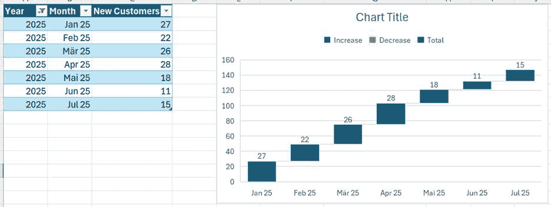
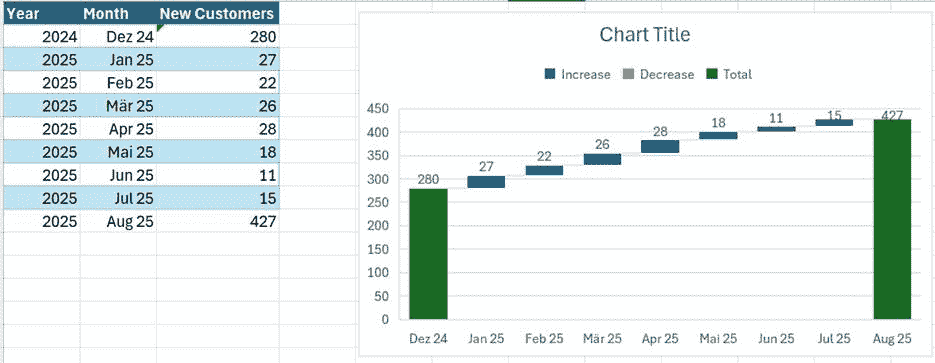
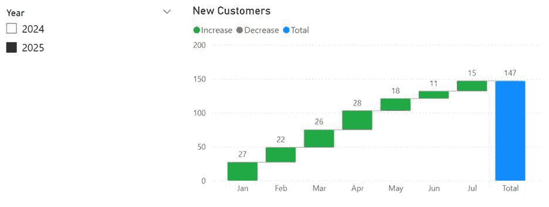
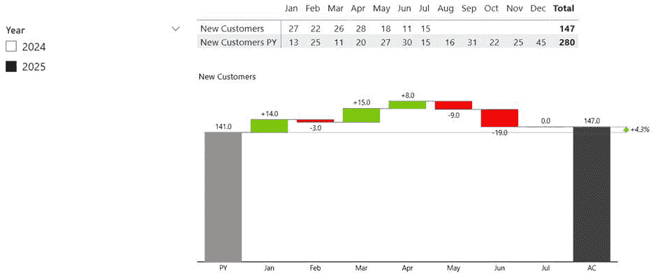
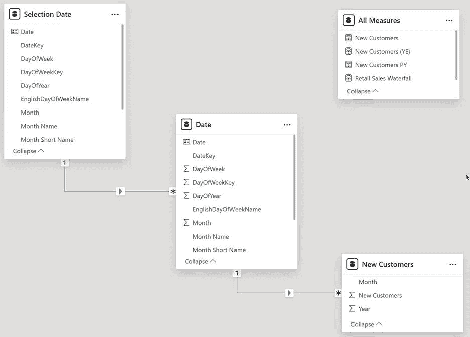
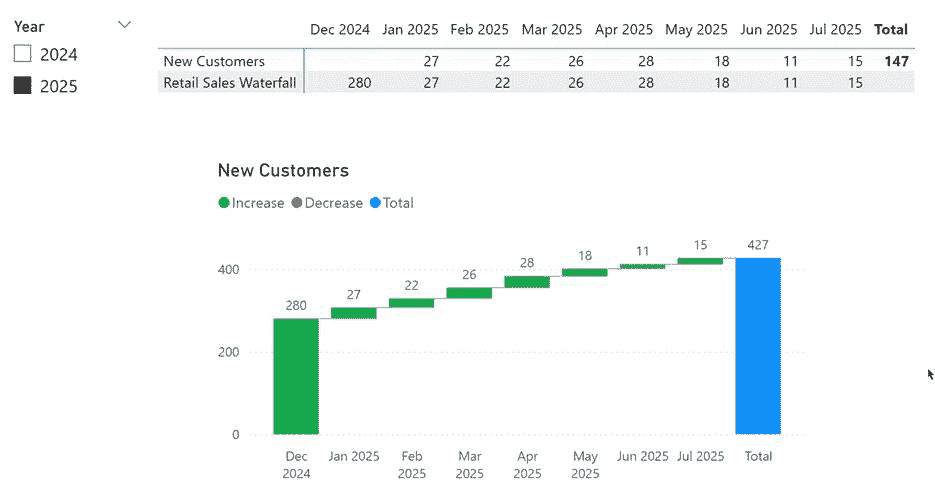

# 在 Power BI 中添加瀑布图的起始值

> 原文：[`towardsdatascience.com/on-adding-a-start-value-to-a-waterfall-chart-in-power-bi/`](https://towardsdatascience.com/on-adding-a-start-value-to-a-waterfall-chart-in-power-bi/)


由 [Jeffrey Workman](https://unsplash.com/@jeffreyp?utm_content=creditCopyText&utm_medium=referral&utm_source=unsplash) 在 [Unsplash](https://unsplash.com/photos/long-exposure-photo-of-lake-with-waterfall-at-daytime-YvkH8R1zoQM?utm_content=creditCopyText&utm_medium=referral&utm_source=unsplash) 拍摄的照片

## <mdspan datatext="el1754326196090" class="mdspan-comment">引言</mdspan>

首先，让我们定义挑战的范围：想象一下，我们想要跟踪客户群随时间的变化。

我们创建了一个度量值来根据客户的首次订单计数客户，以识别每个月的新客户。

但现在，我们想要使用瀑布视觉效果创建这个度量值的可视化，我们得到的结果如下：



图 1 – Excel 中的初始瀑布图（图由作者提供）

但我们需要更多。

我们需要初始值，即截至上年末的客户数量，然后为每个月的新客户数量加到报告期末的客户总数中。

大概是这样的：



图 2 – Excel 中的第二个示例，包括初始总数、2024 年末和 2025 年 8 月的总数（图由作者提供）

不幸的是，我们无法在 Power BI 中将一列设置为起始总数。

因此，当将度量值添加到 Power BI 的瀑布视觉效果中时，结果类似于 Excel 中的第一个示例：



图 3 – Power BI 中的初始方法。注意 Power BI 自动计算瀑布中的总数（图由作者提供）

即使使用像 Zebra BI 这样的商业自定义视觉，结果也不是我们需要的：



图 4 – 使用 Zebra BI 视觉效果的示例（图由作者提供）

在这种情况下，我添加了上年的度量值来设置起始值。然而，视觉效果计算了与上年的偏差，并基于这些偏差显示总数。

上年的结果 141 是由于 Zebra BI 检测到当前年份只有 7 个月的数据，并且只为那 7 个月计算了上年的总和。

在这个特定情况下，这并不是我们需要的，因为我们不感兴趣的是与上年的偏差，而是从去年年末开始的增长。

尽管这个自定义视觉非常强大，但在我们的情况下并没有帮助。

## 扩展数据模型

我们现在需要的方法不仅能够计算，而且能够在选择年份，例如 2025 年时，显示上一年的最后一个月。

我已经通过添加第二个日期表并编写相应的度量解决了这个问题。

你可以在下面的参考资料部分找到这个解决方案的完整描述以及其工作原理的解释。

修改后的数据模型看起来是这样的：



图 5 – 带有中间新报告日期表的修改后的数据模型（作者提供的图）

这个新的日期表使我们能够使用在“选择日期”表中选择的项，并使用日期表进行计算。

为了支持这一点，我将两个表都设置为“日期表”。我仍然可以像往常一样无限制地使用“日期”表。

## 开发度量

下一步是编写度量。

首先，我必须计算起始值，即（上一）年末的客户数量。

为了实现这个目标，我必须计算前一年所有行的总和，但对于所有月份：

```py
New Customers (YE) =

    VAR SelYearPY = SELECTEDVALUE('Date'[Year])

    VAR Result = CALCULATE([New Customers]

                            ,REMOVEFILTERS('Date')

                            ,'Date'[Year] = SelYearPY

                            )

RETURN

    Result
```

结果是 2024 年的 280。

你可能会想知道为什么我计算所选年份的总和而不是前一年的总和。

原因是我们想显示这个度量在 2024 年 12 月（当选择 2025 年时）的结果。请稍等，直到你看到结果。这些将帮助你理解它。

现在，我们必须开发一个度量，它根据 X 轴上的月份返回正确的值。

这应该是 2024 年 12 月的上一年的年末值，或者当前（所选）每年每月的新客户数量。参见前面的度量。

我们需要的度量必须执行以下步骤：

1.  从日期表中获取所选年份。

1.  计算报告中要显示的第一个和最后一个月。

1.  通过从用于筛选器的日期表中移除过滤器来计算结果（“选择日期”表）。

1.  决定哪些结果需要显示在哪些月份。

最后一步至关重要。

当我们从两个日期表中移除所选年份的过滤器时，我们必须控制是否应该为每个月显示一个结果。你将在下面的度量中的[SWITCH()](https://dax.guide/switch/)部分找到这个步骤。

这是完整的度量：

```py
Retail Sales Waterfall =

    VAR SelYear = SELECTEDVALUE('Selection Date'[Year])

    VAR MinYearMonth = SelYear * 100 + 1

    VAR MaxYearMonth = SelYear * 100 + 12

    VAR LastPYYearMonth = (SelYear - 1) * 100 + 12

    VAR ActualMK = CALCULATE(

                    MAX('Date'[MonthKey])

                    ,CROSSFILTER('Selection Date'[DateKey]

                                ,'Date'[DateKey]

                                ,None)

                                )

RETURN

SWITCH(TRUE()

    ,ActualMK = LastPYYearMonth

        ,CALCULATE([New Customers (YE)]

                    ,CROSSFILTER('Selection Date'[DateKey]

                                ,'Date'[DateKey]

                                ,None)

                    ,REMOVEFILTERS('Date')

                    ,'Date'[MonthKey] = (SelYear - 1) * 100 + 12

                    )

    ,ActualMK >= MinYearMonth

        && ActualMK <= MaxYearMonth

        ,CALCULATE([New Customers]

                            ,CROSSFILTER('Selection Date'[DateKey]

                                        ,'Date'[DateKey]

                                        ,None)

                                )

        ,BLANK()

    )
```

这是结果：



图 6 – 以上一年的年末起始值显示的最终结果（作者提供的图）

在瀑布图上方，你可以看到度量返回的数字。

如上所述，左上角的年份筛选器不使用“日期”表中的年份列，而是使用“选择日期”表中的年份列。这是至关重要的。当使用“日期”表中的年份列时，解决方案将无法工作。

## 结论

瀑布图视觉效果非常适合展示从一个元素到另一个元素的价值变化。一个元素可以是一个月或其它不同的东西。例如，您可以在下面的参考文献部分找到另一篇文章，其中我展示了如何在 Power BI 中通过瀑布图视觉展示业务流程的数据模型修改方法。

这里展示的解决方案是一个典型的例子，说明我如何重用之前开发的方法来解决新的挑战。

这种方法的优点在于，它允许我继续无限制地使用所有度量值，使用“常规”日期表，并且使用“选择日期”表为报告添加更多功能。

在这个例子中，我为瀑布图添加了一个之前不可用的功能。

我不会说你需要总是有两个日期表。只有在你需要的时候才添加它们。仅仅为了拥有它们而添加表到数据模型中是没有意义的。

## 参考文献

下面是我的作品，展示了我是如何扩展我的数据模型以展示比所选日期更多的日期：

> [如何在 DAX 中展示比所选日期更多的日期](https://towardsdatascience.com/how-to-show-more-dates-than-selected-in-dax-bda0c4140121/)

在这里，我解释了如何通过瀑布图来展示业务流程的数据转换方法：

> [通过数据序列化可视化业务流程](https://towardsdatascience.com/visualize-a-business-process-through-data-serialization-772cd9510c31/)

就像在我之前的文章中一样，我使用了 Contoso 样本数据集。您可以从微软[这里](https://www.microsoft.com/en-us/download/details.aspx?id=18279)免费下载 ContosoRetailDW 数据集。

根据描述[在此文档](https://github.com/microsoft/Power-BI-Embedded-Contoso-Sales-Demo)中的 MIT 许可证，Contoso 数据可以自由使用。我将数据集更改以将数据转移到当代日期。
