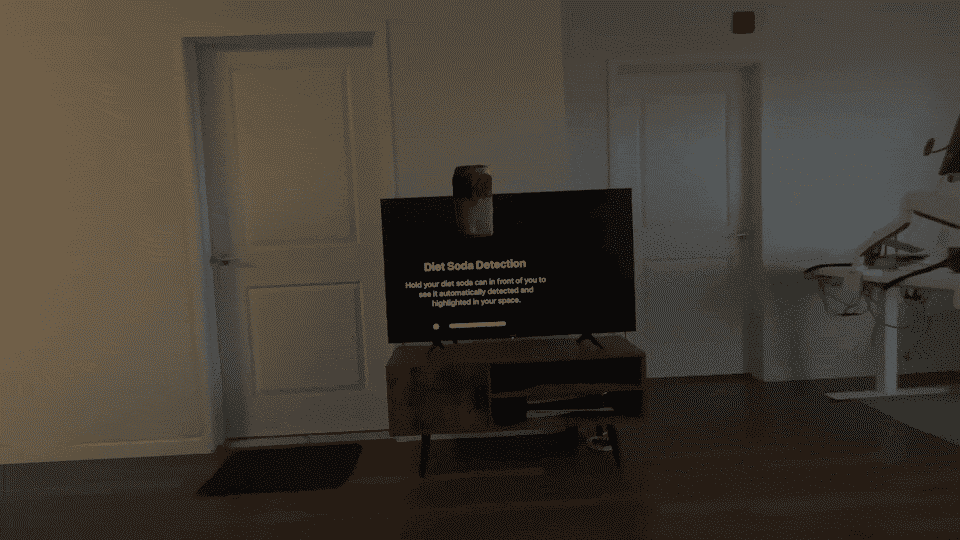
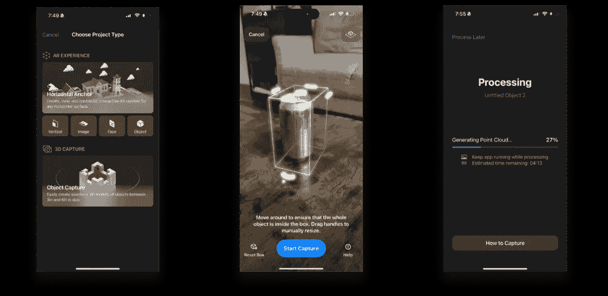
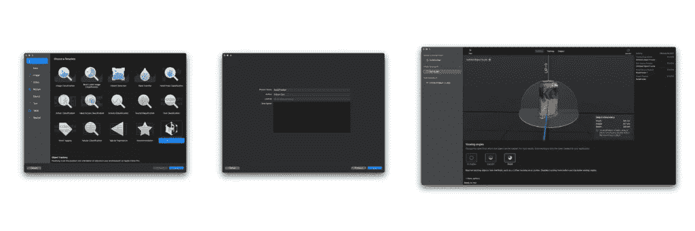
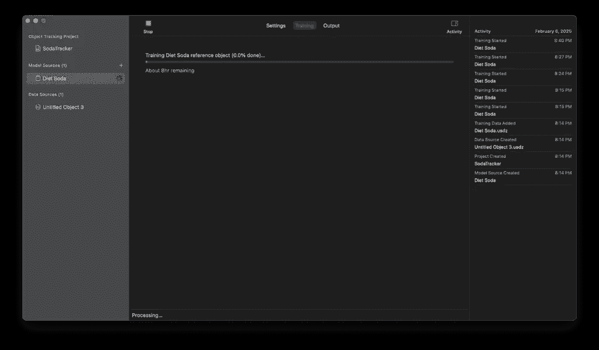
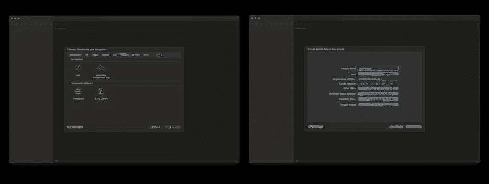
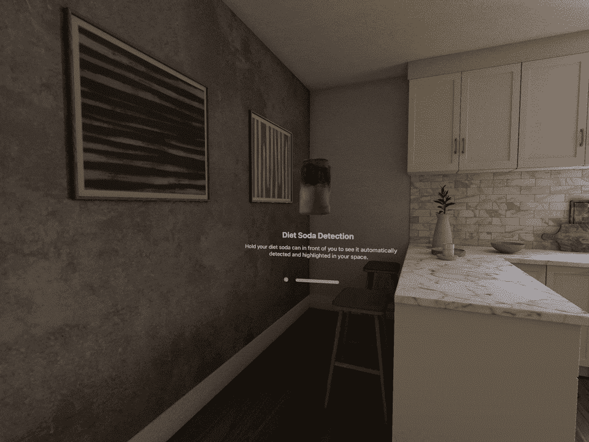
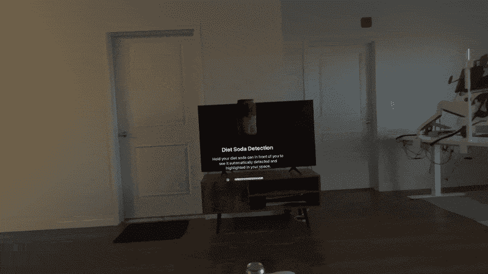

# 空间计算中的设备上机器学习

> 原文：[`towardsdatascience.com/on-device-machine-learning-in-spatial-computing/`](https://towardsdatascience.com/on-device-machine-learning-in-spatial-computing/)

随着空间计算平台（VR 和 AR）的出现，计算领域正在经历深刻的变革。当我们步入这个新时代，虚拟现实、增强现实和设备上机器学习的交汇为开发者提供了前所未有的机会，以创建无缝融合数字内容与物理世界的体验。

**visionOS**的引入标志着这一演变过程中的一个重要里程碑。苹果的空间计算平台结合了复杂的硬件功能与强大的开发框架，使开发者能够构建能够实时理解和交互物理环境的应用程序。这种空间感知和设备上机器学习能力相结合为对象识别和跟踪应用开辟了新的可能性，这些应用以前难以实现。

* * *

## 我们要构建的内容

在本指南中，我们将构建一个展示 visionOS 上设备机器学习力量的应用程序。我们将创建一个能够实时识别和跟踪健怡可乐罐的应用程序，直接在用户的视野中叠加视觉指示和信息。



我们的应用程序将利用 visionOS 生态系统中的几个关键技术。当用户运行应用程序时，他们会被展示一个包含我们目标对象旋转 3D 模型以及使用说明的窗口。当他们环顾四周的环境时，应用程序会持续扫描寻找健怡可乐罐。一旦检测到，它会在罐子周围显示动态边界线，并在其上方放置一个浮动文本标签，同时保持对物体或用户在空间中移动的精确跟踪。

在我们开始开发之前，让我们确保我们已经准备好了必要的工具和理解。本教程需要：

+   安装了 visionOS SDK 的最新版 Xcode 16

+   在 Apple Vision Pro 设备上运行 visionOS 2.0 或更高版本

+   对 SwiftUI 和 Swift 编程语言的基本熟悉度

开发过程将带我们经历几个关键阶段，从捕捉目标对象的 3D 模型到实现实时跟踪和可视化。每个阶段都建立在之前的基础上，让你彻底理解为 visionOS 开发由设备上机器学习驱动的功能。

## 建立基础：3D 对象捕捉

创建我们的目标识别系统的第一步是捕捉我们目标对象的详细 3D 模型。苹果为此提供了一个强大的应用程序：[**RealityComposer**](https://apps.apple.com/us/app/reality-composer/id1462358802)，可通过 App Store 在 iOS 上获取。

在捕捉 3D 模型时，环境条件对我们的结果质量起着至关重要的作用。正确设置捕捉环境确保我们为机器学习模型获取最佳可能的数据。一个光线充足且光照一致的空间有助于捕捉系统准确检测物体的特征和尺寸。应该将碳酸饮料罐放置在具有良好对比度的表面上，这样系统更容易区分物体的边界。

捕捉过程从启动**RealityComposer**应用并从可用选项中选择“对象捕捉”开始。应用引导我们在目标物体周围定位边界框。这个边界框至关重要，因为它定义了捕捉体积的空间边界。



RealityComposer — 对象捕捉流程 — 图片由作者提供

在使用应用内指南的帮助下捕捉到碳酸饮料罐的所有细节并处理完图像后，将创建一个包含我们的 3D 模型的**.usdz**文件。这种文件格式专门为 AR/VR 应用设计，不仅包含我们物体的视觉表示，还包含在训练过程中将使用的重要信息。

## 训练参考模型

拥有我们的 3D 模型后，我们进入下一个关键阶段：使用**Create ML**训练我们的识别模型。苹果的**Create ML**应用提供了一个直观的界面来训练机器学习模型，包括为空间计算应用专门设计的模板。

要开始训练过程，我们启动**Create ML**并从空间类别中选择“对象跟踪”模板。这个模板专门设计用于训练能够在三维空间中识别和跟踪物体的模型。



CreateML 项目设置 — 图片由作者提供

在创建新项目后，我们将**.usdz**文件导入到 Create ML 中。系统自动分析 3D 模型并提取用于识别的关键特征。界面提供了配置我们的物体在空间中如何被识别的选项，包括观看角度和跟踪偏好。

一旦你已导入 3D 模型并在各个角度分析它，就点击“训练”。**Create ML**将处理我们的模型并开始训练阶段。在这个阶段，系统学习从不同角度和不同条件下识别我们的物体。训练过程可能需要几个小时，因为系统正在构建对我们物体特征的全面理解。



创建机器学习训练过程 — 图片由作者提供

此训练过程的输出是一个**.referenceobject**文件，它包含针对 visionOS 实时对象检测优化的训练模型数据。此文件封装了所有学习到的特征和识别参数，这将使我们的应用能够识别用户环境中的低卡汽水瓶。

我们参考对象的创建成功标志着我们开发过程中的一个重要里程碑。现在我们有一个训练好的模型，能够在实时中识别我们的目标对象，为在 visionOS 应用中实现实际的检测和可视化功能奠定了基础。

## 初始项目设置

现在我们有了我们的训练好的参考对象，让我们设置我们的 visionOS 项目。启动**Xcode**并选择“创建一个新的 Xcode 项目”。在模板选择器中，选择平台过滤器下的 visionOS，并选择“App”。此模板提供了创建 visionOS 应用所需的基本结构。



Xcode visionOS 项目设置 — 图片由作者提供

在项目配置对话框中，使用以下主要设置配置你的项目：

+   产品名称：SodaTracker

+   初始场景：窗口

+   混合空间渲染器：RealityKit

+   混合空间：混合

项目创建后，我们需要进行一些基本修改。首先，删除名为**ToggleImmersiveSpaceButton.swift**的文件，因为我们不会在我们的实现中使用它。

接下来，我们将添加我们之前创建的资产到项目中。在 Xcode 的项目导航器中，找到“**RealityKitContent.rkassets**”文件夹，并添加 3D 对象文件（“**SodaModel.usdz**”文件）。这个 3D 模型将用于我们的信息视图。创建一个名为“**ReferenceObjects**”的新组，并添加我们使用 Create ML 生成的“**Diet Soda.referenceobject**”文件。

最后的设置步骤是为对象跟踪配置必要的权限。打开你的项目**Info.plist**文件，并添加一个新键：**NSWorldSensingUsageDescription**。将其值设置为“用于跟踪低卡汽水瓶”。此权限对于应用在用户环境中检测和跟踪对象是必需的。

完成这些设置步骤后，我们就有了一个配置正确的 visionOS 项目，可以开始实现我们的对象跟踪功能。

## 入口点实现

让我们从**SodaTrackerApp.swift**开始，这是在我们设置 visionOS 项目时自动创建的。我们需要修改此文件以支持我们的对象跟踪功能。用以下代码替换默认实现：

```py
import SwiftUI

/**
 SodaTrackerApp is the main entry point for the application.
 It configures the app's window and immersive space, and manages
 the initialization of object detection capabilities.

 The app automatically launches into an immersive experience
 where users can see Diet Soda cans being detected and highlighted
 in their environment.
 */
@main
struct SodaTrackerApp: App {
    /// Shared model that manages object detection state
    @StateObject private var appModel = AppModel()

    /// System environment value for launching immersive experiences
    @Environment(\.openImmersiveSpace) var openImmersiveSpace

    var body: some Scene {
        WindowGroup {
            ContentView()
                .environmentObject(appModel)
                .task {
                    // Load and prepare object detection capabilities
                    await appModel.initializeDetector()
                }
                .onAppear {
                    Task {
                        // Launch directly into immersive experience
                        await openImmersiveSpace(id: appModel.immersiveSpaceID)
                    }
                }
        }
        .windowStyle(.plain)
        .windowResizability(.contentSize)

        // Configure the immersive space for object detection
        ImmersiveSpace(id: appModel.immersiveSpaceID) {
            ImmersiveView()
                .environment(appModel)
        }
        // Use mixed immersion to blend virtual content with reality
        .immersionStyle(selection: .constant(.mixed), in: .mixed)
        // Hide system UI for a more immersive experience
        .persistentSystemOverlays(.hidden)
    }
} 
```

此实现的要点是我们对象检测系统的初始化和管理。当应用启动时，我们初始化我们的**AppModel**，它处理**ARKit**会话和对象跟踪设置。初始化序列至关重要：

```py
.task {
    await appModel.initializeDetector()
}
```

此异步初始化加载我们的训练参考对象，并为对象跟踪准备**ARKit**会话。我们确保在打开实际检测将发生的沉浸空间之前完成此操作。

沉浸空间配置对于对象跟踪尤为重要：

```py
.immersionStyle(selection: .constant(.mixed), in: .mixed)
```

混合沉浸式风格对我们对象跟踪实现至关重要，因为它允许**RealityKit**将我们的视觉指示器（边界框和标签）与检测对象的现实世界环境融合在一起。这创造了一种无缝体验，其中数字内容与用户空间中的物理对象准确对齐。

通过对**SodaTrackerApp.swift**的这些修改，我们的应用程序已准备好开始对象检测过程，ARKit、RealityKit 和我们的训练模型在混合现实环境中协同工作。在下一节中，我们将检查**AppModel.swift**中的核心对象检测功能，这是在项目设置期间创建的另一个文件。

## 核心检测模型实现

在项目设置期间创建的**AppModel.swift**作为我们的核心检测系统。该文件管理**ARKit**会话，加载我们的训练模型，并协调对象跟踪过程。让我们看看它的实现：

```py
import SwiftUI
import RealityKit
import ARKit

/**
 AppModel serves as the core model for the soda can detection application.
 It manages the ARKit session, handles object tracking initialization,
 and maintains the state of object detection throughout the app's lifecycle.

 This model is designed to work with visionOS's object tracking capabilities,
 specifically optimized for detecting Diet Soda cans in the user's environment.
 */
@MainActor
@Observable
class AppModel: ObservableObject {
    /// Unique identifier for the immersive space where object detection occurs
    let immersiveSpaceID = "SodaTracking"

    /// ARKit session instance that manages the core tracking functionality
    /// This session coordinates with visionOS to process spatial data
    private var arSession = ARKitSession()

    /// Dedicated provider that handles the real-time tracking of soda cans
    /// This maintains the state of currently tracked objects
    private var sodaTracker: ObjectTrackingProvider?

    /// Collection of reference objects used for detection
    /// These objects contain the trained model data for recognizing soda cans
    private var targetObjects: [ReferenceObject] = []

    /**
     Initializes the object detection system by loading and preparing
     the reference object (Diet Soda can) from the app bundle.

     This method loads a pre-trained model that contains spatial and
     visual information about the Diet Soda can we want to detect.
     */
    func initializeDetector() async {
        guard let objectURL = Bundle.main.url(forResource: "Diet Soda", withExtension: "referenceobject") else {
            print("Error: Failed to locate reference object in bundle - ensure Diet Soda.referenceobject exists")
            return
        }

        do {
            let referenceObject = try await ReferenceObject(from: objectURL)
            self.targetObjects = [referenceObject]
        } catch {
            print("Error: Failed to initialize reference object: \(error)")
        }
    }

    /**
     Starts the active object detection process using ARKit.

     This method initializes the tracking provider with loaded reference objects
     and begins the real-time detection process in the user's environment.

     Returns: An ObjectTrackingProvider if successfully initialized, nil otherwise
     */
    func beginDetection() async -> ObjectTrackingProvider? {
        guard !targetObjects.isEmpty else { return nil }

        let tracker = ObjectTrackingProvider(referenceObjects: targetObjects)
        do {
            try await arSession.run([tracker])
            self.sodaTracker = tracker
            return tracker
        } catch {
            print("Error: Failed to initialize tracking: \(error)")
            return nil
        }
    }

    /**
     Terminates the object detection process.

     This method safely stops the ARKit session and cleans up
     tracking resources when object detection is no longer needed.
     */
    func endDetection() {
        arSession.stop()
    }
}
```

我们实现的核心是**ARKitSession**，它是 visionOS 通向空间计算能力的门户。**@MainActor**属性确保我们的对象检测操作在主线程上运行，这对于与渲染管道同步至关重要。

```py
private var arSession = ARKitSession()
private var sodaTracker: ObjectTrackingProvider?
private var targetObjects: [ReferenceObject] = []
```

**ObjectTrackingProvider**是 visionOS 中的一个专用组件，用于处理实时对象检测。它与包含我们从训练模型中获取的空间和视觉信息的**ReferenceObject**实例协同工作。我们将其作为私有属性维护，以确保适当的生命周期管理。

初始化过程尤为重要：

```py
let referenceObject = try await ReferenceObject(from: objectURL)
self.targetObjects = [referenceObject]
```

在这里，我们将我们的训练模型（我们在 Create ML 中创建的.refereceobject 文件）加载到**ReferenceObject**实例中。这个过程是异步的，因为系统需要解析和准备模型数据以进行实时检测。

beginDetection 方法设置实际的跟踪过程：

```py
let tracker = ObjectTrackingProvider(referenceObjects: targetObjects)
try await arSession.run([tracker])
```

当我们创建**ObjectTrackingProvider**时，我们传递我们的参考对象。提供者使用这些对象来建立检测参数——要寻找什么，要匹配哪些特征，以及如何在 3D 空间中跟踪对象。**ARKitSession.run**调用激活了跟踪系统，开始对用户环境的实时分析。

## 沉浸体验实现

**ImmersiveView.swift**，在初始项目设置中提供，用于管理用户空间中的实时对象检测可视化。此视图处理检测数据的连续流，并创建检测对象的视觉表示。以下是其实施：

```py
import SwiftUI
import RealityKit
import ARKit

/**
 ImmersiveView is responsible for creating and managing the augmented reality
 experience where object detection occurs. This view handles the real-time
 visualization of detected soda cans in the user's environment.

 It maintains a collection of visual representations for each detected object
 and updates them in real-time as objects are detected, moved, or removed
 from view.
 */
struct ImmersiveView: View {
    /// Access to the app's shared model for object detection functionality
    @Environment(AppModel.self) private var appModel

    /// Root entity that serves as the parent for all AR content
    /// This entity provides a consistent coordinate space for all visualizations
    @State private var sceneRoot = Entity()

    /// Maps unique object identifiers to their visual representations
    /// Enables efficient updating of specific object visualizations
    @State private var activeVisualizations: [UUID: ObjectVisualization] = [:]

    var body: some View {
        RealityView { content in
            // Initialize the AR scene with our root entity
            content.add(sceneRoot)

            Task {
                // Begin object detection and track changes
                let detector = await appModel.beginDetection()
                guard let detector else { return }

                // Process real-time updates for object detection
                for await update in detector.anchorUpdates {
                    let anchor = update.anchor
                    let id = anchor.id

                    switch update.event {
                    case .added:
                        // Object newly detected - create and add visualization
                        let visualization = ObjectVisualization(for: anchor)
                        activeVisualizations[id] = visualization
                        sceneRoot.addChild(visualization.entity)

                    case .updated:
                        // Object moved - update its position and orientation
                        activeVisualizations[id]?.refreshTracking(with: anchor)

                    case .removed:
                        // Object no longer visible - remove its visualization
                        activeVisualizations[id]?.entity.removeFromParent()
                        activeVisualizations.removeValue(forKey: id)
                    }
                }
            }
        }
        .onDisappear {
            // Clean up AR resources when view is dismissed
            cleanupVisualizations()
        }
    }

    /**
     Removes all active visualizations and stops object detection.
     This ensures proper cleanup of AR resources when the view is no longer active.
     */
    private func cleanupVisualizations() {
        for (_, visualization) in activeVisualizations {
            visualization.entity.removeFromParent()
        }
        activeVisualizations.removeAll()
        appModel.endDetection()
    }
}
```

我们物体跟踪可视化的核心在于检测器的 **anchorUpdates** 流。这个 **ARKit** 功能提供了一个连续的物体检测事件流：

```py
for await update in detector.anchorUpdates {
    let anchor = update.anchor
    let id = anchor.id

    switch update.event {
    case .added:
        // Object first detected
    case .updated:
        // Object position changed
    case .removed:
        // Object no longer visible
    }
}
```

每个 **ObjectAnchor** 包含关于检测到的碳酸饮料罐的关键空间数据，包括其在 3D 空间中的位置、朝向和边界框。当检测到新物体时（.added 事件），我们创建一个可视化，**RealityKit** 将在正确的位置相对于物理对象进行渲染。当物体或用户移动时，.updated 事件确保我们的虚拟内容与真实世界保持完美对齐。

## 视觉反馈系统

为处理检测到的物体的视觉表示创建一个名为 **ObjectVisualization.swift** 的新文件。这个组件负责创建和管理出现在检测到的碳酸饮料罐周围的边界框和文本叠加：

```py
import RealityKit
import ARKit
import UIKit
import SwiftUI

/**
 ObjectVisualization manages the visual elements that appear when a soda can is detected.
 This class handles both the 3D text label that appears above the object and the
 bounding box that outlines the detected object in space.
 */
@MainActor
class ObjectVisualization {
    /// Root entity that contains all visual elements
    var entity: Entity

    /// Entity specifically for the bounding box visualization
    private var boundingBox: Entity

    /// Width of bounding box lines - 0.003 provides optimal visibility without being too intrusive
    private let outlineWidth: Float = 0.003

    init(for anchor: ObjectAnchor) {
        entity = Entity()
        boundingBox = Entity()

        // Set up the main entity's transform based on the detected object's position
        entity.transform = Transform(matrix: anchor.originFromAnchorTransform)
        entity.isEnabled = anchor.isTracked

        createFloatingLabel(for: anchor)
        setupBoundingBox(for: anchor)
        refreshBoundingBoxGeometry(with: anchor)
    }

    /**
     Creates a floating text label that hovers above the detected object.
     The text uses Avenir Next font for optimal readability in AR space and
     is positioned slightly above the object for clear visibility.
     */
    private func createFloatingLabel(for anchor: ObjectAnchor) {
        // 0.06 units provides optimal text size for viewing at typical distances
        let labelSize: Float = 0.06

        // Use Avenir Next for its clarity and modern appearance in AR
        let font = MeshResource.Font(name: "Avenir Next", size: CGFloat(labelSize))!
        let textMesh = MeshResource.generateText("Diet Soda",
                                               extrusionDepth: labelSize * 0.15,
                                               font: font)

        // Create a material that makes text clearly visible against any background
        var textMaterial = UnlitMaterial()
        textMaterial.color = .init(tint: .orange)

        let textEntity = ModelEntity(mesh: textMesh, materials: [textMaterial])

        // Position text above object with enough clearance to avoid intersection
        textEntity.transform.translation = SIMD3(
            anchor.boundingBox.center.x - textMesh.bounds.max.x / 2,
            anchor.boundingBox.extent.y + labelSize * 1.5,
            0
        )

        entity.addChild(textEntity)
    }

    /**
     Creates a bounding box visualization that outlines the detected object.
     Uses a magenta color transparency to provide a clear
     but non-distracting visual boundary around the detected soda can.
     */
    private func setupBoundingBox(for anchor: ObjectAnchor) {
        let boxMesh = MeshResource.generateBox(size: [1.0, 1.0, 1.0])

        // Create a single material for all edges with magenta color
        let boundsMaterial = UnlitMaterial(color: .magenta.withAlphaComponent(0.4))

        // Create all edges with uniform appearance
        for _ in 0..<12 {
            let edge = ModelEntity(mesh: boxMesh, materials: [boundsMaterial])
            boundingBox.addChild(edge)
        }

        entity.addChild(boundingBox)
    }

    /**
     Updates the visualization when the tracked object moves.
     This ensures the bounding box and text maintain accurate positioning
     relative to the physical object being tracked.
     */
    func refreshTracking(with anchor: ObjectAnchor) {
        entity.isEnabled = anchor.isTracked
        guard anchor.isTracked else { return }

        entity.transform = Transform(matrix: anchor.originFromAnchorTransform)
        refreshBoundingBoxGeometry(with: anchor)
    }

    /**
     Updates the bounding box geometry to match the detected object's dimensions.
     Creates a precise outline that exactly matches the physical object's boundaries
     while maintaining the gradient visual effect.
     */
    private func refreshBoundingBoxGeometry(with anchor: ObjectAnchor) {
        let extent = anchor.boundingBox.extent
        boundingBox.transform.translation = anchor.boundingBox.center

        for (index, edge) in boundingBox.children.enumerated() {
            guard let edge = edge as? ModelEntity else { continue }

            switch index {
            case 0...3:  // Horizontal edges along width
                edge.scale = SIMD3(extent.x, outlineWidth, outlineWidth)
                edge.position = [
                    0,
                    extent.y / 2 * (index % 2 == 0 ? -1 : 1),
                    extent.z / 2 * (index < 2 ? -1 : 1)
                ]
            case 4...7:  // Vertical edges along height
                edge.scale = SIMD3(outlineWidth, extent.y, outlineWidth)
                edge.position = [
                    extent.x / 2 * (index % 2 == 0 ? -1 : 1),
                    0,
                    extent.z / 2 * (index < 6 ? -1 : 1)
                ]
            case 8...11: // Depth edges
                edge.scale = SIMD3(outlineWidth, outlineWidth, extent.z)
                edge.position = [
                    extent.x / 2 * (index % 2 == 0 ? -1 : 1),
                    extent.y / 2 * (index < 10 ? -1 : 1),
                    0
                ]
            default:
                break
            }
        }
    }
}
```

边界框的创建是我们可视化中的一个关键方面。我们不是使用单个盒子网格，而是构建 12 个单独的边缘，形成一个线框轮廓。这种方法提供了更好的视觉清晰度，并允许更精确地控制外观。边缘使用 SIMD3 向量定位，以进行高效的空间计算：

```py
edge.position = [
    extent.x / 2 * (index % 2 == 0 ? -1 : 1),
    extent.y / 2 * (index < 10 ? -1 : 1),
    0
]
```

这种数学定位确保每个边缘与检测到的物体的尺寸完美对齐。计算使用物体的范围（宽度、高度、深度）并在其中心点周围创建对称排列。

这个可视化系统与我们的 **ImmersiveView** 协同工作，以创建实时视觉反馈。当 ImmersiveView 从 ARKit 接收位置更新时，它调用我们的可视化中的 refreshTracking，以更新变换矩阵，以保持虚拟叠加与物理对象之间的精确对齐。

## 信息视图



带有说明的 ContentView — 作者提供的图片

**ContentView.swift**，包含在我们的项目模板中，负责处理应用程序的信息界面。以下是实现方式：

```py
import SwiftUI
import RealityKit
import RealityKitContent

/**
 ContentView provides the main window interface for the application.
 Displays a rotating 3D model of the target object (Diet Soda can)
 along with clear instructions for users on how to use the detection feature.
 */
struct ContentView: View {
    // State to control the continuous rotation animation
    @State private var rotation: Double = 0

    var body: some View {
        VStack(spacing: 30) {
            // 3D model display with rotation animation
            Model3D(named: "SodaModel", bundle: realityKitContentBundle)
                .padding(.vertical, 20)
                .frame(width: 200, height: 200)
                .rotation3DEffect(
                    .degrees(rotation),
                    axis: (x: 0, y: 1, z: 0)
                )
                .onAppear {
                    // Create continuous rotation animation
                    withAnimation(.linear(duration: 5.0).repeatForever(autoreverses: true)) {
                        rotation = 180
                    }
                }

            // Instructions for users
            VStack(spacing: 15) {
                Text("Diet Soda Detection")
                    .font(.title)
                    .fontWeight(.bold)

                Text("Hold your diet soda can in front of you to see it automatically detected and highlighted in your space.")
                    .font(.body)
                    .multilineTextAlignment(.center)
                    .foregroundColor(.secondary)
                    .padding(.horizontal)
            }
        }
        .padding()
        .frame(maxWidth: 400)
    }
}
```

此实现显示我们的 3D 扫描的碳酸饮料模型（SodaModel.usdz），带有旋转动画，为用户提供了一个清晰的参考，说明系统正在寻找什么。旋转帮助用户了解如何呈现物体以实现最佳检测。

在这些组件到位之后，我们的应用程序现在提供了一套完整的物体检测体验。系统使用我们训练的模型来识别碳酸饮料罐，实时创建精确的视觉指示，并通过信息界面提供清晰的用户指导。

## 结论



我们的最终应用程序 — 作者提供的图片

在本教程中，我们为 visionOS 构建了一个完整的物体检测系统，展示了多种强大技术的集成。从 3D 物体捕捉，到在 Create ML 中进行机器学习模型训练，再到使用 ARKit 和 RealityKit 进行实时检测，我们创建了一个能够无缝检测和跟踪用户空间中物体的应用程序。

这种实现仅仅代表了在空间计算中利用设备端机器学习所能实现的可能性的开始。随着硬件的不断发展，拥有更强大的神经引擎和专门的机器学习加速器和框架，如 Core ML 的成熟，我们将看到越来越复杂的实时理解和交互物理世界的应用。空间计算与设备端机器学习的结合，为从高级 AR 体验到智能环境理解等应用开辟了可能性，同时保持用户隐私和低延迟。
