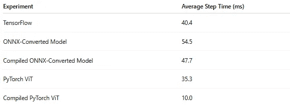
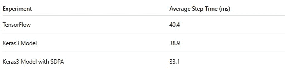
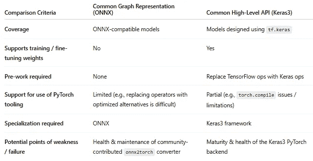

# 将 TensorFlow 模型转换为 PyTorch 的挑战

> 原文：[`towardsdatascience.com/on-the-challenge-of-converting-tensorflow-models-to-pytorch/`](https://towardsdatascience.com/on-the-challenge-of-converting-tensorflow-models-to-pytorch/)

## <mdspan datatext="el1764721965620" class="mdspan-comment">序言</mdspan>

为了管理读者的期望并防止失望，我们首先声明，本文**并不**提供对标题中描述的问题的完全令人满意的解决方案。我们将提出并评估两种自动将 TensorFlow 模型转换为 PyTorch 的方案——第一种基于[开放神经网络交换](https://onnx.ai/)（ONNX）格式和库，第二种使用[Keras3](https://keras.io/) API。然而，正如我们将看到的，每种方案都伴随着其自身的挑战和限制。据作者所知，在撰写本文时，尚无公开可用的万无一失的解决方案。

感谢 [Rom Maltser](https://www.linkedin.com/in/rom-maltser) 对本文的贡献。

## TensorFlow 的衰落

多年来，计算机科学领域经历了其份额的“宗教战争”——程序员和工程师之间关于“最佳”工具、语言和方法的热烈、有时是敌对的辩论。直到几年前，两个突出的开源深度学习框架 PyTorch 和 TensorFlow 之间的宗教战争仍然很严重。TensorFlow 的支持者会强调其快速的图执行模式，而 PyTorch 营地的成员则会强调其“Pythonic”特性和易用性。

然而，如今，PyTorch 的活跃度远远超过了 TensorFlow。这一点可以从拥抱 PyTorch 而非 TensorFlow 的大科技公司数量、[HuggingFace 的模型](https://huggingface.co/models)存储库中每个框架的模型数量以及每个框架中的创新和优化程度得到证明。简单来说，TensorFlow 已经不再是过去的自己。战争已经结束，PyTorch 是最终的赢家。关于 PyTorch-TensorFlow 战争的简要历史和 TensorFlow 衰退的原因，请参阅[潘星汉](https://medium.com/@sampan090611)的文章：[TensorFlow 已死。PyTorch 获胜](https://medium.com/@sampan090611/tensorflow-is-dead-pytorch-won-2d0bc6e9b1a4)。

## 问题：我们该如何处理所有遗留的 TensorFlow 模型？！！！

鉴于这一新的现实情况，许多曾经使用 TensorFlow 的组织已经将所有新的 AI/ML 模型开发迁移到 PyTorch。但他们在处理遗留代码时面临着一个难题：他们应该如何处理已经在 TensorFlow 中构建和部署的所有模型？

### 选项 1：什么都不做。

您可能会想知道这为什么会成为一个问题——TensorFlow 模型是工作的——我们不要动它们。虽然这是一种有效的方法，但应该考虑以下缺点：

1.  **维护减少**：随着 TensorFlow 的持续衰落，其维护也将减少。不可避免的是，一些问题将会出现。例如，可能与新的 Python 包或系统库的兼容性问题。

1.  **受限的生态系统**：AI/ML 解决方案通常涉及多个支持软件库和服务，这些库和服务与我们的选择框架接口，无论是 PyTorch 还是 TensorFlow。随着时间的推移，我们可以预期其中许多将停止对 TensorFlow 的支持。以 HuggingFace 最近[宣布停止对 TensorFlow 的支持](https://www.linkedin.com/posts/lysandredebut_i-have-bittersweet-news-to-share-yesterday-activity-7338966863403528192-om5p?)为例。

1.  **社区有限**：AI/ML 行业的快速发展在很大程度上归功于其社区。开源项目数量、在线教程数量以及 AI/ML 领域专用支持渠道的活动量都是无与伦比的。随着 TensorFlow 的衰落，其社区也将衰落，您可能会越来越难以获得所需的帮助。不用说，PyTorch 社区正在蓬勃发展。

1.  **机会成本**：PyTorch 生态系统充满创新和优化，发展势头强劲。近年来，开发了闪存注意力内核、支持八位浮点数据类型、图编译等多项进步，这些进步显著提高了运行时性能，并显著降低了 AI/ML 成本。与此同时，TensorFlow 的功能提供基本上保持不变。坚持使用 TensorFlow 意味着放弃了许多 AI/ML 成本优化的机会。

### 选项 2：手动将 TensorFlow 模型转换为 PyTorch

第二种选择是将遗留的 TensorFlow 模型重写为 PyTorch。从结果来看，这可能是最佳选择，但对于在多年中积累了大量技术债务的公司来说，即使是转换单个模型也可能是一项艰巨的任务。考虑到所需的努力，您可能只选择对仍在积极开发中的模型（例如，在模型训练阶段）进行转换。对所有已部署的模型进行此操作可能过于昂贵。

### 选项 3：自动化 TensorFlow 到 PyTorch 的转换

第三种选择，也是我们在本文中探讨的方法，是将遗留的 TensorFlow 模型自动转换为 PyTorch。通过这种方式，我们希望实现 PyTorch 模型执行的好处，但无需手动转换每一个模型。

为了便于讨论，我们将定义一个玩具 TensorFlow 模型，并评估将其转换为 PyTorch 的两个提案。作为我们的运行环境，我们将使用一个带有 [NVIDIA L40S](https://www.nvidia.com/en-eu/data-center/l40s/) GPU 的 [Amazon EC2 g6e.xlarge](https://aws.amazon.com/ec2/instance-types/g6e/)，以及一个 [AWS Deep Learning Ubuntu (22.04) AMI](https://docs.aws.amazon.com/dlami/latest/devguide/aws-deep-learning-x86-gpu-tensorflow-2.18-ubuntu-22-04.html)。我们的 Python 环境将包括 [TensorFlow](https://www.tensorflow.org/install)（2.20）、[PyTorch](https://pytorch.org/get-started/locally/)（2.9）、[torchvision](https://pypi.org/project/torchvision/)（0.24.0）和 [transformers](https://huggingface.co/docs/transformers/en/index)（4.55.4）库。请注意，我们将分享的代码块仅用于演示目的。请勿将我们对任何代码、库或平台的使用视为对其使用的认可。

## 模型转换——为什么这么难？

一个 AI 模型定义由两个组件组成：模型架构和其训练好的权重。模型转换解决方案必须解决这两个组件。模型权重的转换相对简单；权重通常以可以轻松解析为单个张量数组的格式存储，并可以在选择的框架中重新应用。相比之下，模型架构的转换则是一个更大的挑战。

一种可能的方法是在每个框架中创建模型构建块的映射。然而，有许多因素使得这种方法在实际上几乎无法实现：

+   **API 重叠和激增**：当你考虑到构建模型组件的 TensorFlow API 数量庞大，且往往重叠，再加上每个层的 API 控制和参数数量庞大，你就能理解创建一个全面的一对一映射是如何迅速变得复杂的。

+   **不同的实现方法**：在实现层面，TensorFlow 和 PyTorch 采用了根本不同的方法。尽管这些方法通常隐藏在顶层 API 之后，但一些假设需要用户特别注意。例如，虽然 TensorFlow 默认使用“channels-last”（NHWC）格式，但 PyTorch 更倾向于“channels-first”（NCHW）。这种张量索引和存储方式的不同，使得模型操作的转换变得复杂，因为每个层都必须检查/修改以确保维度顺序正确。

与在 API 级别尝试转换相比，另一种替代方法可能是捕获并转换 TensorFlow 的内部图表示。然而，正如任何曾经查看 TensorFlow 内部结构的人都会告诉你的，这也可能很快变得相当复杂。TensorFlow 的内部图表示非常复杂，通常包括许多低级操作、控制流和辅助节点，这些在 PyTorch 中没有直接等价物（尤其是如果你处理的是 TensorFlow 的旧版本）。仅仅理解它似乎就超出了普通人的能力，更不用说将其转换为 PyTorch 了。

注意，同样的挑战将使生成式 AI 模型以完全可靠的方式进行转换变得困难。

### 提出的转换方案

鉴于这些困难，我们放弃了实现我们自己的模型转换器的尝试，而是转向查看 AI/ML 社区提供了哪些工具。更具体地说，我们考虑了两种不同的策略来克服我们描述的挑战：

1.  **通过统一图表示进行转换**：这个解决方案假设有一个共同的标准来表示 AI/ML 模型定义，以及将模型转换为和从这个标准转换的工具。我们将探索的解决方案使用的是流行的 ONNX 格式。

1.  **基于标准化高级 API 的转换**：在这个解决方案中，我们通过将我们的模型限制为定义的一组高级抽象 API，并在感兴趣的每个 AI/ML 框架中支持这些 API 的实现，从而简化了转换任务。对于这种方法，我们将使用 Keras3 库。

在接下来的几节中，我们将评估这些策略在一个玩具 TensorFlow 模型上的效果。

## 一个玩具 TensorFlow 模型

在下面的代码块中，我们初始化并运行了一个来自[HuggingFace 的](https://huggingface.co/)流行的[transformers](https://pypi.org/project/transformers/)库（版本 4.55.4）的 TensorFlow 视觉 Transformer（ViT）模型，[TFViTForImageClassification](https://huggingface.co/docs/transformers/v4.55.4/en/model_doc/vit#transformers.TFViTForImageClassification)。请注意，根据[HuggingFace 的](https://huggingface.co/)决定弃用对 TensorFlow 的支持，这个类已被从库的最近版本中移除。HuggingFace 的 TensorFlow 模型依赖于 Keras 2，我们通过[tf-keras](https://pypi.org/project/tf-keras/)（2.20.1）包尽职尽责地安装了它。我们将[ViTConfig.hidden_act](https://huggingface.co/docs/transformers/v4.55.4/en/model_doc/vit#transformers.ViTConfig.hidden_act)字段设置为“gelu_new”以实现 ONNX 兼容性：

```py
import tensorflow as tf
gpu = tf.config.list_physical_devices('GPU')[0]
tf.config.experimental.set_memory_growth(gpu, True)

from transformers import ViTConfig, TFViTForImageClassification
vit_config = ViTConfig(hidden_act="gelu_new", return_dict=False)
tf_model = TFViTForImageClassification(vit_config)
```

## 使用 ONNX 进行模型转换

我们评估的第一种方法依赖于[Open Neural Network Exchange](https://onnx.ai/)（ONNX），这是一个旨在定义一个开放格式来构建 AI/ML 模型，以增加 AI/ML 框架之间的互操作性并减少对任何单一框架的依赖的社区项目。ONNX API 提供了一系列工具，可以将模型从常见的框架转换为 ONNX 格式，包括[TensorFlow](https://github.com/onnx/tensorflow-onnx)。还有几个公共库可以将 ONNX 模型转换为 PyTorch。在这篇文章中，我们使用了[onnx2torch](https://github.com/ENOT-AutoDL/onnx2torch)工具。因此，可以通过依次应用 TensorFlow 到 ONNX 的转换，然后是 ONNX 到 PyTorch 的转换来实现从 TensorFlow 到 PyTorch 的模型转换。

为了评估这个解决方案，我们安装了[onnx](https://pypi.org/project/onnx/)（1.19.1），[tf2onnx](https://pypi.org/project/tf2onnx/)（1.16.1），以及[onnx2torch](https://pypi.org/project/onnx2torch/)（1.5.15）库。我们应用了*no-deps*标志来防止 protobuf 库的不期望降级：

```py
pip install --no-deps onnx tf2onnx onnx2torch
```

转换方案如下面的代码块所示：

```py
import tensorflow as tf
import torch
import tf2onnx, onnx2torch

BATCH_SIZE = 32
DEVICE = "cuda"

spec = (tf.TensorSpec((BATCH_SIZE, 3, 224, 224), tf.float32, name="input"),)
onnx_model, _ = tf2onnx.convert.from_keras(tf_model, input_signature=spec)
converted_model = onnx2torch.convert(onnx_model)
```

为了确保结果模型确实是一个 PyTorch 模块，我们运行以下断言：

```py
assert isinstance(converted_model, torch.nn.Module)
```

让我们现在评估结果 PyTorch 模型的质量和组成。

### 数值精度

为了验证转换后模型的正确性，我们在相同的输入上执行 TensorFlow 模型和转换后的模型，并比较结果：

```py
import numpy as np

batch_input = np.random.randn(BATCH_SIZE, 3, 224, 224).astype(np.float32)

# execute tf model
tf_input = tf.convert_to_tensor(batch_input)
tf_output = tf_model(tf_input, training=False)
tf_output = tf_output[0].numpy()

# execute converted model
converted_model = converted_model.to(DEVICE)
converted_model = converted_model.eval()
torch_input = torch.from_numpy(batch_input).to(DEVICE)
torch_output = converted_model(torch_input)
torch_output = torch_output.detach().cpu().numpy()

# compare results
print("Max diff:", np.max(np.abs(tf_output - torch_output)))

# sample output:
# Max diff: 9.3877316e-07
```

输出确实足够接近，可以验证转换后的模型。

### 模型结构

为了了解转换后模型的结构，我们计算可训练参数的数量，并将其与原始模型进行比较：

```py
num_tf_params = sum([np.prod(v.shape) for v in tf_model.trainable_weights])
num_pyt_params = sum([p.numel()
                      for p in converted_model.parameters()
                      if p.requires_grad])
print(f"TensorFlow trainable parameters: {num_tf_params}")
print(f"PyTorch Trainable Parameters: {num_pyt_params:,}")
```

可训练参数数量的差异是显著的，转换后的模型中只有 589,824 个，而原始模型中超过 8500 万个。遍历转换后模型的层得出同样的结论：基于 ONNX 的转换已经完全改变了模型结构，使其几乎无法识别。这一发现带来了一系列影响，包括：

1.  **训练/微调转换后的模型**：尽管我们已经表明转换后的模型可以用于推理，但结构的变化——尤其是模型参数中的一些已经被固定的事实——意味着我们无法使用转换后的模型进行训练或微调。

1.  **将精确的 PyTorch 优化应用于模型**：转换后的模型由大量层组成，每层代表一个相对低级的操作。这极大地限制了我们将低效操作替换为优化的 PyTorch 等价物的能力，例如[torch.nn.functional.scaled_dot_product_attention](https://docs.pytorch.org/docs/stable/generated/torch.nn.functional.scaled_dot_product_attention.html)（SPDA）。

### 模型优化

我们已经看到我们访问和修改模型操作的能力有限，但我们可以应用一些不需要这种访问的优化。在下面的代码块中，我们应用了[PyTorch 编译](https://docs.pytorch.org/tutorials/intermediate/torch_compile_tutorial.html)和[自动混合精度](https://docs.pytorch.org/tutorials/recipes/recipes/amp_recipe.html)（AMP），并将结果吞吐量与 TensorFlow 模型进行比较。为了进一步了解，我们还测试了[ViTForImageClassification](https://huggingface.co/docs/transformers/v4.55.4/en/model_doc/vit#transformers.ViTForImageClassification)模型的 PyTorch 版本：

```py
# Set tf mixed precision policy to bfloat16
tf.keras.mixed_precision.set_global_policy('mixed_bfloat16')

# Set torch matmul precision to high
torch.set_float32_matmul_precision('high')

@tf.function
def tf_infer_fn(batch):
    return tf_model(batch, training=False)

def get_torch_infer_fn(model):
    def infer_fn(batch):
        with torch.inference_mode(), torch.amp.autocast(
                DEVICE,
                dtype=torch.bfloat16,
                enabled=DEVICE=='cuda'
        ):
            output = model(batch)
        return output
    return infer_fn

def benchmark(infer_fn, batch):
    # warm-up
    for _ in range(20):
        _ = infer_fn(batch)
    start = torch.cuda.Event(enable_timing=True)
    end = torch.cuda.Event(enable_timing=True)
    torch.cuda.synchronize()
    start.record()

    iters = 100

    for _ in range(iters):
        _ = infer_fn(batch)
    end.record()
    torch.cuda.synchronize()
    return start.elapsed_time(end) / iters

# assess throughput of TF model
avg_time = benchmark(tf_infer_fn, tf_input)
print(f"\nTensorFlow average step time: {(avg_time):.4f}")

# assess throughput of converted model
torch_infer_fn = get_torch_infer_fn(converted_model) 
avg_time = benchmark(torch_infer_fn, torch_input)
print(f"\nConverted model average step time: {(avg_time):.4f}")

# assess throughput of compiled model
torch_infer_fn = get_torch_infer_fn(torch.compile(converted_model)) 
avg_time = benchmark(torch_infer_fn, torch_input)
print(f"\nCompiled model average step time: {(avg_time):.4f}")

# assess throughput of torch ViT
from transformers import ViTForImageClassification
torch_model = ViTForImageClassification(vit_config).to(DEVICE)
torch_infer_fn = get_torch_infer_fn(torch_model) 
avg_time = benchmark(torch_infer_fn, torch_input)
print(f"\nPyTorch ViT model average step time: {(avg_time):.4f}")

# assess throughput of compiled torch ViT
torch_infer_fn = get_torch_infer_fn(torch.compile(torch_model)) 
avg_time = benchmark(torch_infer_fn, torch_input)
print(f"\nCompiled ViT model average step time: {(avg_time):.4f}")
```

注意，最初由于在[OnnxReshape](https://github.com/ENOT-AutoDL/onnx2torch/blob/v1.5.15/onnx2torch/node_converters/reshape.py#L17C7-L17C18)层中使用了[torch.Size](https://github.com/ENOT-AutoDL/onnx2torch/blob/v1.5.15/onnx2torch/node_converters/reshape.py#L23)运算符，PyTorch 编译在转换后的模型上失败。虽然这很容易修复（例如，`tuple([int(i) for i in shape])`），但它指向了模型优化的更深层次的障碍：该模型中出现数十次的 reshape 层将形状视为位于 GPU 上的 PyTorch 张量。这意味着每次调用都需要将形状张量从图中分离出来并复制到 CPU。结论是，尽管转换后的模型在功能上是准确的，但其结果定义并未针对运行时性能进行优化。这可以从不同模型配置的步骤时间结果中看出：



基于 ONNX 的转换步骤时间结果（作者）

转换后的模型比原始的 TensorFlow 流程慢，并且比 ViT 模型的 PyTorch 版本慢得多。

### 局限性

尽管在我们的玩具模型的情况下，基于 ONNX 的转换方案是有效的，但它存在一些显著的局限性：

1.  在转换过程中，许多参数被烘焙到模型中，限制了其仅适用于推理工作负载。

1.  ONNX 转换将计算图分解为低级运算符，这使得难以应用和/或获得一些 PyTorch 优化的好处。

1.  依赖于 ONNX 意味着我们的转换方案将仅适用于 ONNX 友好的模型。它将无法在无法映射到标准 ONNX 运算符集的模型上工作（例如，具有动态控制流的模型）。

1.  转换方案依赖于一个第三方库的健康和维护，该库不属于官方 ONNX 提供的内容。

虽然该方案是有效的——至少对于推理工作负载——但你可能会发现这些局限性过于严格，不适合用于你自己的 TensorFlow 模型。一个可能的选择是放弃 ONNX 到 PyTorch 的转换，并使用[ONNX Runtime](https://onnxruntime.ai/)库进行推理。

## 通过 Keras3 进行模型转换

[Keras3](https://keras.io/) 是一个面向高级深度学习 API，旨在最大化 AI/ML 应用程序的易读性、可维护性和易用性。在[之前的文章](https://towardsdatascience.com/multi-framework-ai-ml-development-with-keras-3-cf7be29eb23d/)中，我们评估了 Keras3 并强调了其对多个后端的支持。在这篇文章中，我们重新审视了其多框架支持，并评估这能否用于模型转换。我们提出的方案是 1)将现有的 TensorFlow 模型迁移到 Keras3[迁移指南](https://keras.io/guides/migrating_to_keras_3/)，然后 2)使用 Keras3 PyTorch 后端运行模型。

## 将 TensorFlow 升级到 Keras3

与基于 ONNX 的转换方案相反，我们的当前解决方案可能需要对 TensorFlow 模型进行一些代码更改，以便将其迁移到 Keras3。虽然[文档](https://keras.io/guides/migrating_to_keras_3/)听起来很简单，但在实践中，迁移的难度将很大程度上取决于模型实现的细节。在我们的玩具模型中，HuggingFace 明确强制使用遗留的[tf-keras](https://pypi.org/project/tf-keras/)，防止使用 Keras3。为了实现我们的方案，我们需要 1)重新定义模型，不使用这种限制，2)用 Keras3 等效操作符替换原生 TensorFlow 操作符。下面的代码块包含了一个简化后的模型版本，以及所需的调整。要全面了解所需的更改，请与[原始模型定义](https://github.com/huggingface/transformers/blob/v4.55.4/src/transformers/models/vit/modeling_tf_vit.py)进行逐行代码比较。

```py
import math
import keras

HIDDEN_SIZE = 768
IMG_SIZE = 224
PATCH_SIZE = 16
ATTN_HEADS = 12
NUM_LAYERS = 12
INTER_SZ = 4*HIDDEN_SIZE
N_LABELS = 2

class TFViTEmbeddings(keras.layers.Layer):
    def __init__(self, **kwargs):
        super().__init__(**kwargs)
        self.patch_embeddings = TFViTPatchEmbeddings()
        num_patches = self.patch_embeddings.num_patches
        self.cls_token = self.add_weight((1, 1, HIDDEN_SIZE))
        self.position_embeddings = self.add_weight((1, num_patches+1,
                                                    HIDDEN_SIZE))

    def call(self, pixel_values, training=False):
        bs, num_channels, height, width = pixel_values.shape
        embeddings = self.patch_embeddings(pixel_values, training=training)
        cls_tokens = keras.ops.repeat(self.cls_token, repeats=bs, axis=0)
        embeddings = keras.ops.concatenate((cls_tokens, embeddings), axis=1)
        embeddings = embeddings + self.position_embeddings
        return embeddings

class TFViTPatchEmbeddings(keras.layers.Layer):
    def __init__(self, **kwargs):
        super().__init__(**kwargs)
        patch_size = (PATCH_SIZE, PATCH_SIZE)
        image_size = (IMG_SIZE, IMG_SIZE)
        num_patches = (image_size[1]//patch_size[1]) * \
                      (image_size[0]//patch_size[0])
        self.patch_size = patch_size
        self.num_patches = num_patches
        self.projection = keras.layers.Conv2D(
            filters=HIDDEN_SIZE,
            kernel_size=patch_size,
            strides=patch_size,
            padding="valid",
            data_format="channels_last"
        )

    def call(self, pixel_values, training=False):
        bs, num_channels, height, width = pixel_values.shape
        pixel_values = keras.ops.transpose(pixel_values, (0, 2, 3, 1))
        projection = self.projection(pixel_values)
        num_patches = (width // self.patch_size[1]) * \
                      (height // self.patch_size[0])
        embeddings = keras.ops.reshape(projection, (bs, num_patches, -1))
        return embeddings

class TFViTSelfAttention(keras.layers.Layer):
    def __init__(self, **kwargs):
        super().__init__(**kwargs)
        self.num_attention_heads = ATTN_HEADS
        self.attention_head_size = int(HIDDEN_SIZE / ATTN_HEADS)
        self.all_head_size = ATTN_HEADS * self.attention_head_size
        self.sqrt_att_head_size = math.sqrt(self.attention_head_size)
        self.query = keras.layers.Dense(self.all_head_size,  name="query")
        self.key = keras.layers.Dense(self.all_head_size, name="key")
        self.value = keras.layers.Dense(self.all_head_size, name="value")

    def transpose_for_scores(self, tensor, batch_size: int):
        tensor = keras.ops.reshape(tensor, (batch_size, -1, ATTN_HEADS,
                                            self.attention_head_size))
        return keras.ops.transpose(tensor, [0, 2, 1, 3])

    def call(self, hidden_states, training=False):
        bs = hidden_states.shape[0]
        mixed_query_layer = self.query(inputs=hidden_states)
        mixed_key_layer = self.key(inputs=hidden_states)
        mixed_value_layer = self.value(inputs=hidden_states)
        query_layer = self.transpose_for_scores(mixed_query_layer, bs)
        key_layer = self.transpose_for_scores(mixed_key_layer, bs)
        value_layer = self.transpose_for_scores(mixed_value_layer, bs)
        key_layer_T = keras.ops.transpose(key_layer, [0,1,3,2])
        attention_scores = keras.ops.matmul(query_layer, key_layer_T)
        dk = keras.ops.cast(self.sqrt_att_head_size,
                            dtype=attention_scores.dtype)
        attention_scores = keras.ops.divide(attention_scores, dk)
        attention_probs = keras.ops.softmax(attention_scores+1e-9, axis=-1)
        attention_output = keras.ops.matmul(attention_probs, value_layer)
        attention_output = keras.ops.transpose(attention_output,[0,2,1,3])
        attention_output = keras.ops.reshape(attention_output,
                                             (bs, -1, self.all_head_size))
        return (attention_output,)

class TFViTSelfOutput(keras.layers.Layer):
    def __init__(self, **kwargs):
        super().__init__(**kwargs)
        self.dense = keras.layers.Dense(HIDDEN_SIZE)

    def call(self, hidden_states, input_tensor, training = False):
        return self.dense(inputs=hidden_states)

class TFViTAttention(keras.layers.Layer):
    def __init__(self, **kwargs):
        super().__init__(**kwargs)
        self.self_attention = TFViTSelfAttention()
        self.dense_output = TFViTSelfOutput()

    def call(self, input_tensor, training = False):
        self_outputs = self.self_attention(
            hidden_states=input_tensor, training=training
        )
        attention_output = self.dense_output(
            hidden_states=self_outputs[0],
            input_tensor=input_tensor,
            training=training
        )
        return (attention_output,)

class TFViTIntermediate(keras.layers.Layer):
    def __init__(self, **kwargs):
        super().__init__(**kwargs)
        self.dense = keras.layers.Dense(INTER_SZ)
        self.intermediate_act_fn = keras.activations.gelu

    def call(self, hidden_states):
        hidden_states = self.dense(hidden_states)
        hidden_states = self.intermediate_act_fn(hidden_states)
        return hidden_states

class TFViTOutput(keras.layers.Layer):
    def __init__(self, **kwargs):
        super().__init__(**kwargs)
        self.dense = keras.layers.Dense(HIDDEN_SIZE)

    def call(self, hidden_states, input_tensor, training: bool = False):
        hidden_states = self.dense(inputs=hidden_states)
        hidden_states = hidden_states + input_tensor
        return hidden_states

class TFViTLayer(keras.layers.Layer):
    def __init__(self, **kwargs):
        super().__init__(**kwargs)
        self.attention = TFViTAttention()
        self.intermediate = TFViTIntermediate()
        self.vit_output = TFViTOutput()
        self.layernorm_before = keras.layers.LayerNormalization(
            epsilon=1e-12
        )
        self.layernorm_after = keras.layers.LayerNormalization(
            epsilon=1e-12
        )

    def call(self, hidden_states, training=False):
        attention_outputs = self.attention(
            input_tensor=self.layernorm_before(inputs=hidden_states),
            training=training,
        )
        attention_output = attention_outputs[0]
        hidden_states = attention_output + hidden_states
        layer_output = self.layernorm_after(hidden_states)
        intermediate_output = self.intermediate(layer_output)
        layer_output = self.vit_output(
            hidden_states=intermediate_output,
            input_tensor=hidden_states,
            training=training
        )
        outputs = (layer_output,)
        return outputs

class TFViTEncoder(keras.layers.Layer):
    def __init__(self, **kwargs):
        super().__init__(**kwargs)
        self.layer = [TFViTLayer(name=f"layer_{i}")
                      for i in range(NUM_LAYERS)]

    def call(self, hidden_states, training=False):
        for i, layer_module in enumerate(self.layer):
            layer_outputs = layer_module(
                hidden_states=hidden_states,
                training=training,
            )
            hidden_states = layer_outputs[0]
        return tuple([hidden_states])

class TFViTMainLayer(keras.layers.Layer):
    def __init__(self, **kwargs):
        super().__init__(**kwargs)
        self.embeddings = TFViTEmbeddings()
        self.encoder = TFViTEncoder()
        self.layernorm = keras.layers.LayerNormalization(epsilon=1e-12)

    def call(self, pixel_values, training=False):
        embedding_output = self.embeddings(
            pixel_values=pixel_values,
            training=training,
        )
        encoder_outputs = self.encoder(
            hidden_states=embedding_output,
            training=training,
        )
        sequence_output = encoder_outputs[0]
        sequence_output = self.layernorm(inputs=sequence_output)
        return (sequence_output,)

class TFViTForImageClassification(keras.Model):
    def __init__(self, *inputs, **kwargs):
        super().__init__(*inputs, **kwargs)
        self.vit = TFViTMainLayer()
        self.classifier = keras.layers.Dense(N_LABELS)

    def call(self, pixel_values, training=False):
        outputs = self.vit(pixel_values, training=training)
        sequence_output = outputs[0]
        logits = self.classifier(inputs=sequence_output[:, 0, :])
        return (logits,)
```

### TensorFlow 到 PyTorch 转换

以下代码块中显示了转换序列。与之前一样，我们验证了结果模型的输出以及可训练参数的数量。

```py
# save weights of TensorFlow model
tf_model.save_weights("model_weights.h5")

import keras
keras.config.set_backend("torch")

from keras3_vit import TFViTForImageClassification as Keras3ViT
keras3_model = Keras3ViT()

# call model to initializate all layers
keras3_model(torch_input, training=False)

# load the weights from the TensorFlow model
keras3_model.load_weights("model_weights.h5")

# validate converted model
assert isinstance(keras3_model, torch.nn.Module)

keras3_model = keras3_model.to(DEVICE)
keras3_model = keras3_model.eval()
torch_output = keras3_model(torch_input, training=False)
torch_output = torch_output[0].detach().cpu().numpy()
print("Max diff:", np.max(np.abs(tf_output - torch_output)))

num_pyt_params = sum([p.numel()
                      for p in keras3_model.parameters()
                      if p.requires_grad])
print(f"Keras3 Trainable Parameters: {num_pyt_params:,}")
```

### 训练/微调模型

与基于 ONNX 转换的模型相反，Keras3 模型保持了相同的结构和可训练参数。这允许在转换后的模型上继续训练和/或微调。这可以在[Keras3 训练](https://keras.io/api/models/model_training_apis/)框架内完成，或者使用[标准的 PyTorch 训练循环](https://keras.io/guides/writing_a_custom_training_loop_in_torch/)。

### 优化模型层

与基于 ONNX 转换的模型相反，Keras3 模型定义的连贯性使得修改和优化层实现变得容易。在下面的代码块中，我们用 PyTorch 的非常高效的[SDPA](https://docs.pytorch.org/docs/stable/generated/torch.nn.functional.scaled_dot_product_attention.html)操作符替换了现有的注意力机制。

```py
from torch.nn.functional import scaled_dot_product_attention as sdpa

class TFViTSelfAttention(keras.layers.Layer):
    def __init__(self, **kwargs):
        super().__init__(**kwargs)
        self.num_attention_heads = ATTN_HEADS
        self.attention_head_size = int(HIDDEN_SIZE / ATTN_HEADS)
        self.all_head_size = ATTN_HEADS * self.attention_head_size
        self.sqrt_att_head_size = math.sqrt(self.attention_head_size)
        self.query = keras.layers.Dense(self.all_head_size,  name="query")
        self.key = keras.layers.Dense(self.all_head_size, name="key")
        self.value = keras.layers.Dense(self.all_head_size, name="value")

    def transpose_for_scores(self, tensor, batch_size: int):
        tensor = keras.ops.reshape(tensor, (batch_size, -1, ATTN_HEADS,
                                            self.attention_head_size))
        return keras.ops.transpose(tensor, [0, 2, 1, 3])

    def call(self, hidden_states, training=False):
        bs = hidden_states.shape[0]
        mixed_query_layer = self.query(inputs=hidden_states)
        mixed_key_layer = self.key(inputs=hidden_states)
        mixed_value_layer = self.value(inputs=hidden_states)
        query_layer = self.transpose_for_scores(mixed_query_layer, bs)
        key_layer = self.transpose_for_scores(mixed_key_layer, bs)
        value_layer = self.transpose_for_scores(mixed_value_layer, bs)
        sdpa_output = sdpa(query_layer, key_layer, value_layer)
        attention_output = keras.ops.transpose(sdpa_output,[0,2,1,3])
        attention_output = keras.ops.reshape(attention_output,
                                             (bs, -1, self.all_head_size))
        return (attention_output,)
```

我们使用上面相同的基准测试函数来评估这种优化对模型运行时性能的影响：

```py
torch_infer_fn = get_torch_infer_fn(keras3_model)
avg_time = benchmark(torch_infer_fn, torch_input)
print(f"\Keras3 converted model average step time: {(avg_time):.4f}")
```

结果如下表所示：



Keras3 转换步骤时间结果（作者提供）

使用基于 Keras3 的模型转换方案，并应用 SDPA 优化，我们能够将模型推理吞吐量比原始 TensorFlow 模型提高 22%。

### 模型编译

我们还希望应用另一种优化是 [PyTorch 编译](https://docs.pytorch.org/tutorials/intermediate/torch_compile_tutorial.html)。不幸的是（截至本文写作之时），在 Keras3 中 PyTorch 编译有限。在我们的玩具模型中，无论是直接尝试将 torch.compile 应用到模型上，还是设置 Keras3 [Model.compile](https://keras.io/api/models/model_training_apis/) 函数的 *jit_compile* 字段，都失败了。在这两种情况下，失败都是由于 Keras3 内部机制触发的多次重新编译引起的。虽然 Keras3 提供了对 PyTorch 生态系统的访问，但其高级抽象可能施加一些限制。

### 局限性

再次强调，我们有一个可行的转换方案，但有几个限制：

1.  TensorFlow 模型必须是 Keras3 兼容的。这将需要的工作量将取决于您模型实现的细节。可能需要一些 [Keras 层定制](https://keras.io/guides/making_new_layers_and_models_via_subclassing/)。

1.  虽然生成的模型是 torch.nn.Module，但它不是一个“纯”PyTorch 模型，因为它由 Keras3 层组成，并包含大量的额外 Keras3 代码。这可能需要对我们 PyTorch 工具进行一些调整，并可能施加一些限制，正如我们在尝试应用 PyTorch 编译时所见。 

1.  该方案依赖于 Keras3 的健康维护及其对 TensorFlow 和 PyTorch 后端的支持。

## 摘要

在本文中，我们提出了两种将遗留 TensorFlow 模型自动转换为 PyTorch 的方法，并对其进行了评估。我们将在以下表格中总结我们的发现。



转换方案比较（作者）

最终，最佳方法，无论是这里讨论的方法之一、手动转换、基于生成式 AI 的解决方案，还是决定完全不进行转换的决定，都将极大地取决于模型的细节和具体情况。
