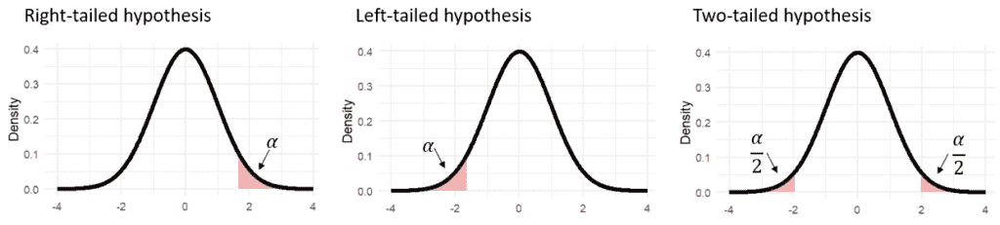
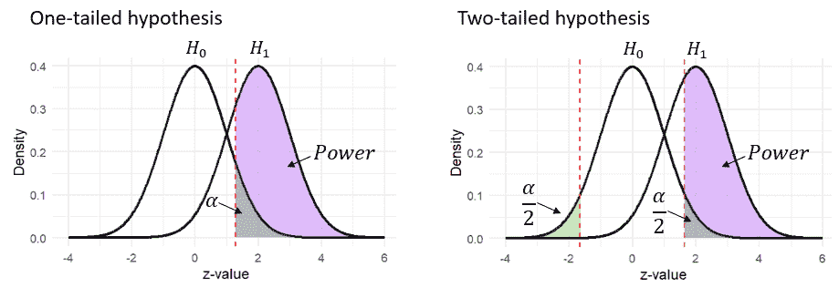
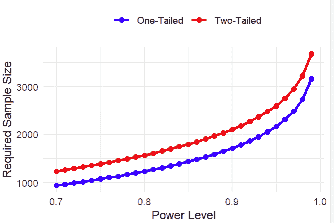

# 单尾与双尾检验

> 原文：[`towardsdatascience.com/one-tailed-vs-two-tailed-tests/`](https://towardsdatascience.com/one-tailed-vs-two-tailed-tests/)

## 简介

如果你曾经使用内置的 t 检验函数分析数据，例如 R 或 SciPy 中的函数，那么这里有一个问题给你：你是否曾经调整过备择假设的默认设置？如果你的答案是“没有”——或者你甚至不确定这是什么意思——那么这篇博客文章就是为你准备的！

备择假设参数，在统计学中通常被称为“单尾”与“双尾”，定义了控制组和处理组之间差异的预期方向。在双尾测试中，我们评估两组之间是否存在任何均值差异，而不指定方向。另一方面，单尾测试则提出一个特定的方向——控制组的均值是否小于或大于处理组的均值。

选择单尾和双尾假设可能看起来像是一个小细节，但它影响 A/B 测试的每个阶段：从测试规划到数据分析以及结果解释。本文构建了一个理论基础，解释为什么假设方向很重要，并探讨了每种方法的优缺点。

## 单尾与双尾假设检验：理解差异

为了理解选择单尾和双尾假设的重要性，让我们简要回顾一下 t 检验的基础知识，这是 A/B 测试中常用的方法。与其他假设检验方法一样，t 检验从一个保守的假设开始：两组之间没有差异（零假设）。只有当我们找到强烈反对这个假设的证据时，我们才能拒绝零假设，并得出治疗有影响的结论。

但什么算是“强烈证据”？为了这个目的，在零假设下确定了一个拒绝区域，所有落在这个区域内的结果都被认为是不太可能的，我们将它们作为反对零假设可行性的证据。这个拒绝区域的大小基于一个预定的概率，称为 alpha（α），它代表错误拒绝零假设的可能性。

这与备择假设的方向有什么关系？实际上关系很大。虽然α水平决定了拒绝区域的大小，但备择假设决定了其位置。在单尾测试中，当我们假设一个特定的差异方向时，拒绝区域只位于分布的一个尾部。对于假设的正效应（例如，治疗组的均值高于对照组的均值），拒绝区域将位于右尾，形成右尾测试。相反，如果我们假设负效应（例如，治疗组的均值低于对照组的均值），拒绝区域将被放置在左尾，从而形成左尾测试。

相比之下，双尾测试允许检测任一方向上的差异，因此拒绝区域分布在分布的两个尾部之间。这允许观察任一方向上的极端值，无论是正效应还是负效应。

为了建立直观理解，让我们可视化在不同假设下拒绝区域是如何出现的。回想一下，根据零假设，两组之间的差异应该围绕零中心。得益于中心极限定理，我们还知道这种分布近似于正态分布。因此，对应于不同备择假设的拒绝区域看起来是这样的：

### 这为什么很重要？

备择假设方向的选择会影响整个 A/B 测试过程，从规划阶段开始——特别是在确定样本量时。样本量是根据测试所需的功效计算的，这是在存在真实差异时检测两组之间差异的概率。为了计算功效，我们检查备择假设下对应于拒绝区域的面积（因为功效反映了在备择假设为真时拒绝零假设的能力）。

由于假设的方向会影响这个拒绝区域的大小，因此双尾假设的功效通常较低。这是因为拒绝区域被分在两个尾部，使得检测任何单一方向上的效应变得更加困难。以下图表说明了两种假设类型的比较。请注意，与双尾假设相比，单尾假设的紫色区域更大：

在实践中，为了保持所需的功效水平，我们通过增加样本量来补偿双尾假设的降低功效（增加样本量可以提高功效，尽管这一过程的机制可能是一个单独文章的主题）。因此，单尾和双尾假设的选择直接影响了测试所需的样本量。

超过规划阶段，备择假设的选择将直接影响结果的分析和解释。有些情况下，一个测试可能使用单尾方法达到显著性，但使用双尾方法则不行，反之亦然。回顾之前的图表可以帮助说明这一点：例如，在双尾假设下，左尾的结果可能显著，但在右尾单尾假设下则不显著。相反，某些结果可能落在右尾单尾测试的拒绝域内，但在双尾测试的拒绝区域外。

## 如何决定选择单尾还是双尾假设

让我们从底线开始：这里没有绝对的对或错的选择。两种方法都是有效的，主要考虑因素应该是您的具体商业需求。为了帮助您决定哪种选项最适合您的公司，我们将概述每种选择的优缺点。

初看之下，单尾备择假设可能看起来是明显的选择，因为它通常与商业目标更吻合。在工业应用中，重点通常在于提高特定的指标，而不是探索治疗方法在两个方向上的影响。这在 A/B 测试中尤为重要，其目标通常是优化转化率或增加收入。如果治疗方法没有导致显著的改进，那么所考察的变化就不会被实施。

除了这个概念优势之外，我们已提到单尾假设的一个关键好处：它需要的样本量更小。因此，选择单尾备择假设可以节省时间和资源。为了说明这一优势，以下图表显示了不同功效水平（α设置为 5%）下单尾和双尾假设所需的样本量。

在这种情况下，单尾和双尾假设之间的选择在顺序测试中尤为重要——这是一种允许持续数据分析而不增加α水平的方法。在这里，选择单尾测试可以显著缩短测试时间，从而实现更快决策，这在需要迅速响应的动态商业环境中尤其有价值。

然而，不要急于否定双尾假设！它有其自身的优势。在某些商业环境中，能够检测到“负显著结果”的能力是一个主要优势。正如一位客户曾经分享的，他更喜欢负显著结果而不是不确定的结果，因为它们提供了宝贵的学习机会。即使结果并不如预期，他也可以得出结论，治疗方法有负面影响，并深入了解产品。

双尾检验的另一个好处是它们可以使用置信区间（CIs）进行直接解释。在双尾检验中，一个不包括零的置信区间直接表明显著性，这使得从业者可以一目了然地解释结果。这种清晰度特别吸引人，因为置信区间在 A/B 测试平台上被广泛使用。相反，在单尾检验中，一个显著的结果可能仍然包括置信区间中的零，这可能导致对发现结果的困惑或不信任。尽管在一尾检验中可以使用单侧置信区间，但这种做法并不常见。

## 结论

通过调整单个参数，你可以显著影响你的 A/B 测试：具体来说，你需要收集的样本量和结果解释。在决定使用单尾还是双尾假设时，考虑因素如可用的样本量、检测负面效应的优势以及将置信区间（CIs）与假设检验对齐的便利性。最终，这个决定应该经过深思熟虑，考虑到最适合你的业务需求。

(*注意：本帖中所有图像均由作者创建)*
