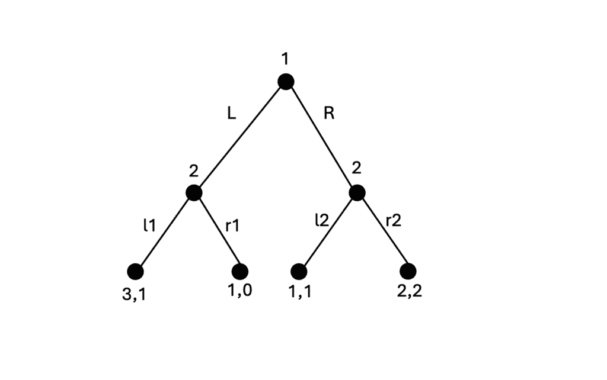
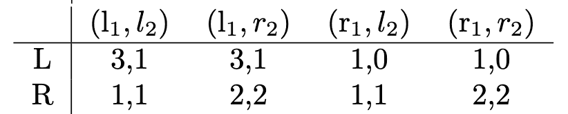
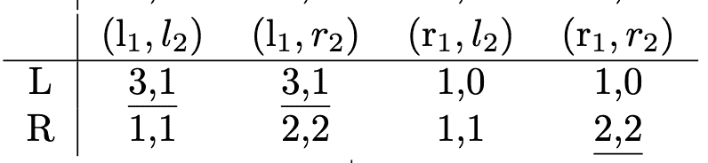
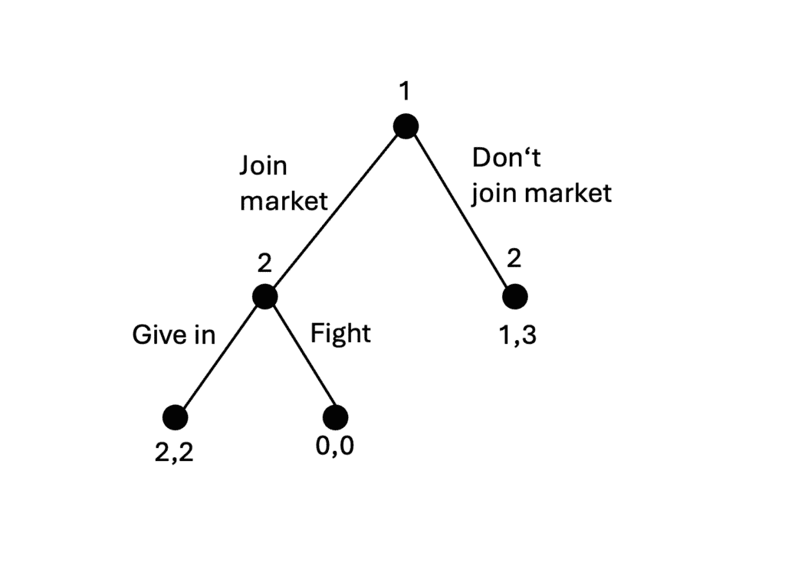
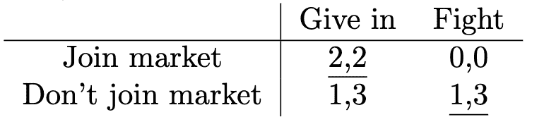
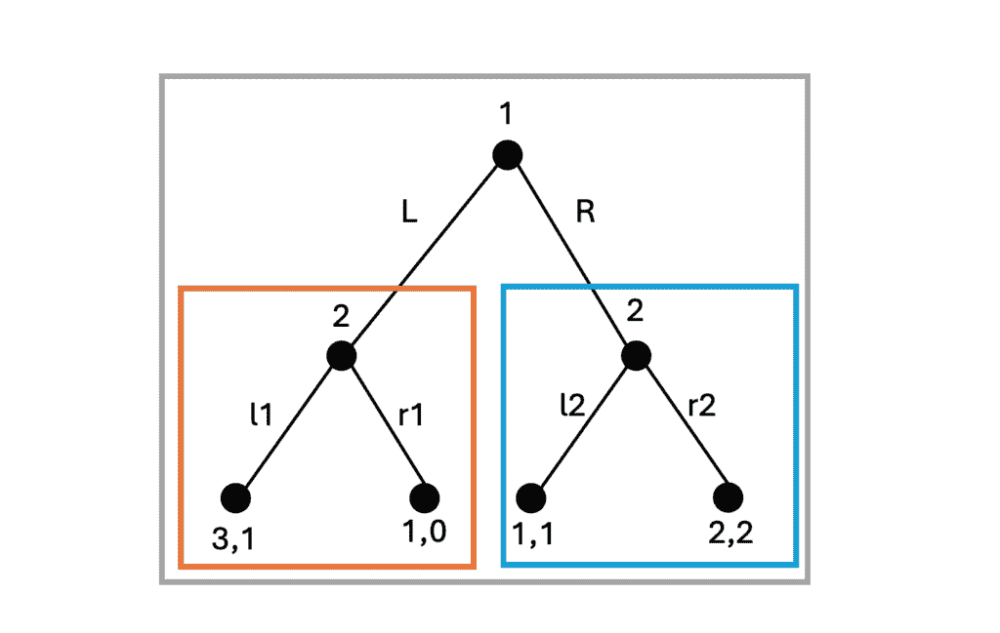
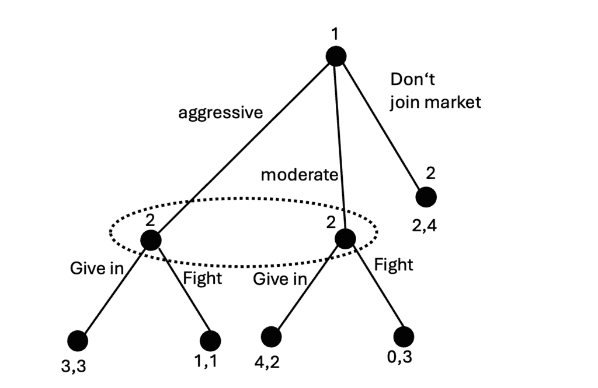
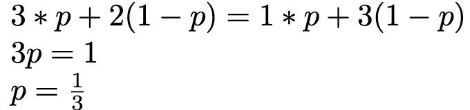

# 一轮又一轮

> 原文：[`towardsdatascience.com/one-turn-after-another/`](https://towardsdatascience.com/one-turn-after-another/)

虽然有些游戏，如剪刀石头布，只有当所有玩家同时决定他们的动作时才能工作，但其他游戏，如象棋或大富翁，期望玩家一个接一个地轮流进行。在博弈论中，这种类型的游戏被称为**静态游戏**，而轮流是所谓**动态游戏**的特性。在这篇文章中，我们将使用博弈论的方法来分析后者。

这篇文章是关于博弈论基础的四篇系列文章的第四部分。如果你还没有阅读，我建议你阅读[第一篇](https://towardsdatascience.com/talking-about-games/) [第二篇](https://towardsdatascience.com/i-wont-change-unless-you-do/) [第三篇](https://towardsdatascience.com/when-you-just-cant-decide-on-a-single-action/)，因为这里展示的概念将建立在之前文章中引入的术语和范例之上。但如果你已经熟悉博弈论的核心基础，不要让自己停下来，继续前进！

## 动态游戏

动态游戏可以像树一样可视化。图片由[Adarsh Kummur](https://unsplash.com/@akummur?utm_source=medium&utm_medium=referral)在[Unsplash](https://unsplash.com?utm_source=medium&utm_medium=referral)上提供。

虽然到目前为止我们只看了**静态游戏**，但现在我们将介绍**动态游戏**，在这种游戏中玩家轮流进行。和之前一样，这类游戏包括多个**玩家**n，每个玩家有一组**动作**，以及一个**奖励函数**，该函数根据其他玩家的动作评估玩家的动作。除此之外，对于动态游戏，我们还需要定义玩家轮流顺序。考虑以下动态游戏的树状可视化。

动态游戏的可视化。图由作者绘制。

在顶部有一个节点，玩家 1 需要在两个动作 L 和 R 之间做出选择。这决定了是否跟随树的左侧或右侧部分。玩家 1 回合结束后，玩家 2 进行回合。如果玩家 1 选择 L，玩家 2 可以在 l1 和 r1 之间做出选择。如果玩家 1 选择 R，玩家 2 必须选择 l2 或 r2。在树的叶子（底部的节点）上，我们看到奖励，就像我们在静态游戏的矩阵单元中看到的那样。例如，如果玩家 1 选择 L，玩家 2 选择 r1，则奖励为(1,0)；也就是说，玩家 1 获得 1 的奖励，玩家 2 获得 0 的奖励。

我打赌你很想知道这个游戏的纳什均衡，这正是博弈论的主要内容（如果你仍然对纳什均衡的概念感到困惑，你可能想回顾一下本系列的 [第二章](https://towardsdatascience.com/i-wont-change-unless-you-do/)）。为了做到这一点，我们可以将游戏转换成矩阵，因为我们已经知道如何在矩阵形式的游戏中找到纳什均衡。玩家 1 决定矩阵的行，玩家 2 决定列，单元格中的值指定了奖励。然而，有一个重要的点需要注意。当我们以树的形式查看游戏时，玩家 2 在玩家 1 之后决定他们的行动，因此只关心实际到达的树的部分。如果玩家 1 选择行动 L，玩家 2 只在 l1 和 r1 之间做出选择，而不关心 l2 和 r2，因为这些行动无论如何都是不可能的。然而，当我们寻找纳什均衡时，我们需要意识到如果玩家 1 改变他们的行动会发生什么。因此，我们必须知道如果玩家 1 选择了不同的选项，玩家 2 会做什么。这就是为什么在下图中我们有四列，以确保始终考虑到树的两个部分的决策。

类似于 (r1,l2) 的列可以读作“如果玩家 1 选择了 L，则玩家 2 选择 r1；如果玩家 1 选择了 R，则玩家 2 选择 l2”。在这个矩阵中，我们可以寻找最佳答案。例如，奖励为 3,1 的单元格 (L, (l1,l2)) 是一个最佳答案。玩家 1 没有理由从 L 改变到 R，因为这会降低他的奖励（从 3 降低到 1），同样，玩家 2 也没有理由改变，因为其他选项都没有更好（虽然有一个选项和它一样好）。总的来说，我们找到了三个纳什均衡，这些均衡在下图中被划线标注：

## 巧克力布丁市场

现在我们将讨论巧克力布丁。同时，也会谈到博弈论。图片由 [American Heritage Chocolate](https://unsplash.com/@americanheritagechocolate?utm_source=medium&utm_medium=referral) 在 [Unsplash](https://unsplash.com?utm_source=medium&utm_medium=referral) 提供

我们接下来的例子将动态游戏的概念生动地展现出来。让我们假设玩家 2 是巧克力布丁市场的市场领先零售商。玩家 1 也想建立自己的业务，但还不确定是否要加入巧克力布丁市场，或者他们是否应该卖其他东西。在我们的游戏中，玩家 1 有第一个回合，可以选择两个行动。加入市场（即销售巧克力布丁），或者不加入市场（即销售其他东西）。如果玩家 1 决定销售除巧克力布丁以外的其他东西，玩家 2 将保持巧克力布丁市场的市场主导零售商，玩家 1 将在他们决定的其他领域赚一些钱。这在上一个图中的树形图的右侧部分通过回报 1,3 反映出来。

市场游戏作为一个动态游戏。图由作者绘制。

但是，如果玩家 1 对巧克力布丁市场沉睡的难以想象的财富贪婪？如果他们决定加入市场，那么轮到玩家 2 了。他们可以决定接受这个新竞争者，屈服并分享市场。在这种情况下，两个玩家都将获得 2 的回报。但玩家 2 也可以决定发动价格战，以向新竞争者展示他的优越性。在这种情况下，两个玩家都将获得 0 的回报，因为他们通过倾销价格破坏了他们的利润。

就像之前一样，我们可以将这个树形图转换成矩阵，通过寻找最佳答案来找到纳什均衡：

如果玩家 1 加入市场，玩家 1 的最佳选择是屈服。这是一个均衡，因为没有任何玩家有改变的理由。对于玩家 1 来说，离开市场（这将获得 1 的回报而不是 2）没有意义，而对于玩家 2 来说，转向战斗也不是一个好主意（这将获得 0 的回报而不是 2）。另一个纳什均衡发生在玩家 1 根本不加入市场的情况下。然而，这个场景包括玩家 2 决定战斗的情况，如果玩家 1 选择加入市场的话。他基本上是在发出威胁，说“如果你加入市场，我将与你战斗。”记住我们之前说过，即使在看起来不会发生的情况下，我们也需要知道玩家会怎么做？这里我们看到了为什么这一点很重要。玩家 1 需要假设玩家 2 会战斗，因为这是玩家 1 留在市场外的唯一原因。如果玩家 2 不威胁要战斗，我们就不会有一个纳什均衡，因为那时加入市场对玩家 1 来说将变成一个更好的选择。

但是这种威胁的合理性如何呢？它将玩家 1 排除在市场之外，但如果玩家 1 不相信这种威胁并决定仍然加入市场会怎样呢？玩家 2 真的会执行他的威胁并战斗吗？那将非常愚蠢，因为这会给他带来 0 的回报，而屈服则会带来 2 的回报。从这个角度来看，玩家 2 使用了一个不合理的空威胁。如果这种情况真的发生，他无论如何也不会执行，对吧？

## 子博弈完美均衡

对于子博弈完美均衡，在获得整个图景之前，你需要从游戏的小部分开始。照片由[Ben Stern](https://unsplash.com/@benst287?utm_source=medium&utm_medium=referral)在[Unsplash](https://unsplash.com?utm_source=medium&utm_medium=referral)提供。

之前的例子表明，有时会出现一些纳什均衡，在游戏中并不合理。为了解决这个问题，引入了一个更严格的均衡概念，称为**子博弈完美均衡**。这给均衡的概念增加了一些更严格的条件。因此，每一个子博弈完美均衡都是纳什均衡，但并不是所有的纳什均衡都是子博弈完美的。

如果这个均衡的每一个子博弈本身也是一个纳什均衡，那么纳什均衡就是*子博弈完美的*。这意味着什么？首先，我们必须理解，子博弈是游戏树中从任何节点开始的任何部分。例如，如果玩家 1 选择 L，那么通过玩 L 到达的节点下的树剩余部分就是一个子博弈。同样地，行动 R 之后的树也是一个子博弈。最后但同样重要的是，整个游戏始终是它自己的子博弈。因此，我们最初举的例子有三个子博弈，在下面的图中用灰色、橙色和蓝色标记：

市场游戏有三个子博弈。图由作者绘制。

我们已经看到，这个博弈有三个纳什均衡，分别是(L,(l1,l2))、(L, (l1,r2))和(R,(r1,r2))。现在让我们找出其中哪些是子博弈完美的。为此，我们一个接一个地研究子博弈，从橙色子博弈开始。如果我们只看树形的橙色部分，如果玩家 2 选择 l1，就会有一个纳什均衡出现。如果我们看蓝色子博弈，当玩家 2 选择 r2 时，也会有一个纳什均衡出现。这告诉我们，在每一个子博弈完美的纳什均衡中，如果进入橙色子博弈（即玩家 1 选择 L），玩家 2 必须选择选项 l1；如果进入蓝色子博弈（即玩家 1 选择 R），玩家 2 必须选择选项 r2。只有之前的一个纳什均衡满足这个条件，即(L,(l1,r2))。因此，这是整个博弈唯一的子博弈完美纳什均衡。其他两个版本也是纳什均衡，但它们在逻辑上有些不合理，因为它们包含了一些类似我们在巧克力布丁市场例子中看到的那种空洞的威胁。我们刚才用来找到子博弈完美纳什均衡的方法叫做**逆向归纳法**。

## 不确定性

在动态博弈中，可能会出现你必须做出决定，但不知道自己处于游戏中的哪个节点的情况。照片由[Denise Jans](https://unsplash.com/@dmjdenise?utm_source=medium&utm_medium=referral)在[Unsplash](https://unsplash.com?utm_source=medium&utm_medium=referral)提供。

到目前为止，在我们的动态博弈中，我们总是知道其他玩家做出了哪些决定。对于像棋类游戏这样的游戏，这确实是如此，因为你的对手的每一个动作都是可以完美观察到的。然而，还有其他一些情况，你可能不确定其他玩家确切的动作。作为一个例子，我们回到巧克力布丁市场。你以已经进入市场的零售商的角度来看，你必须决定如果其他玩家加入市场，你是否会开始竞争。但有一件事你不知道，那就是你的对手将有多激进。当你开始竞争时，他们会轻易害怕并放弃吗？还是他们会变得激进，与你战斗直到只剩下一个？这可以被视为其他玩家做出的影响你决策的决定。如果你预计其他玩家是懦夫，你可能会选择战斗，但如果他们表现出攻击性，你可能会更愿意屈服（这让你想起了上一章中鸟类为食物而战斗的场景，不是吗？）。我们可以用这样的博弈来模拟这个场景：

一个具有隐藏决策的动态博弈（用虚线圆圈表示）。图由作者绘制。

围绕两个节点的虚线圆圈表示，这些是隐藏的决策，不是每个人都能观察到的。如果你是玩家 2，你知道玩家 1 是否加入了市场，但如果他们加入了，你不知道他们是攻击性的（左节点）还是温和的（右节点）。因此，你在不确定性下行动，这在现实世界中你玩的大多数游戏中都是非常常见的。如果每个人都知道了每个人的牌，扑克就会变得非常无聊，这就是为什么存在私有信息，即只有你知道你手中的牌。

现在你仍然必须决定是战斗还是屈服，尽管你并不确切知道你在树的哪个节点。要做到这一点，你必须对每个状态的可能性做出假设。如果你非常确信其他玩家行为温和，你可能愿意战斗，但如果你假设他们攻击性，你可能更愿意屈服。比如说，有一个概率 *p* 表示其他玩家是攻击性的，*1-p* 表示他们行为温和。如果你假设 *p* 较高，你应该屈服，但如果 *p* 变得较小，应该有一个点，你的决定会从战斗转向屈服。让我们试着找到那个点。特别是，在攻击性和温和性之间应该有一个甜点，其他玩家攻击性和温和性的概率使得战斗和屈服是彼此的等价选择。也就是说，奖励将是相等的，我们可以用以下模型来表示：

你看懂了这个公式是如何从树的不同叶子上的战斗或屈服的奖励中推导出来的吗？这个公式解出来是 p=1/3，所以如果其他玩家攻击性的概率是 1/3，那么战斗或屈服都没有区别。但是如果你假设其他玩家攻击性的概率超过 1/3，你应该屈服，如果你假设攻击性比 1/3 更不可能，你应该战斗。这是你在其他游戏中也有的思考链，在这些游戏中你是在不确定性下行动的。当你玩扑克时，你可能不会精确地计算概率，但你会问自己，“约翰手上有两张国王的可能性有多大？”然后根据你对那个概率的假设，你检查、加注或放弃。

## 概括与展望

你在博弈论海洋上的旅程才刚刚开始。还有更多东西要探索。照片由 [George Liapis](https://unsplash.com/@senseiminimal?utm_source=medium&utm_medium=referral) 在 [Unsplash](https://unsplash.com?utm_source=medium&utm_medium=referral) 提供

现在我们已经学到了很多关于动态博弈的知识。让我们总结我们的主要发现。

+   动态博弈包括玩家轮流行动的顺序。

+   在动态博弈中，玩家的可能行动 **取决于** 其他玩家之前执行的行动。

+   在动态博弈中，纳什均衡可能是**不可信的**，因为它包含了一个**空洞的威胁**，这在理性上是不合理的。

+   **子博弈完美均衡**的概念防止了这种不可信的解决方案。

+   在动态博弈中，决策可以是**隐藏的**。在这种情况下，玩家可能不知道他们处于游戏的哪个节点，并必须为游戏的不同状态分配概率。

有了这些，我们就到达了关于博弈论基础系列的终点。我们学到了很多，但还有很多东西我们没有机会涉及。博弈论是一门科学，而我们只是触及了表面。扩展博弈论分析可能性的其他概念包括：

+   分析重复**多次**进行的游戏。如果你多次玩囚徒困境，你可能会倾向于惩罚在上一轮背叛你的玩家。

+   在**合作博弈**中，玩家可以达成具有约束力的合同，以确定他们的行动，共同解决游戏。这与我们所研究的非合作博弈不同，在非合作博弈中，所有玩家都可以自由决定并最大化自己的奖励。

+   虽然我们只看了**离散博弈**，其中每个玩家都有有限数量的行动可供选择，但**连续博弈**允许无限数量的行动（例如，0 到 1 之间的任何数）。

+   博弈论的一大部分考虑了**公共物品**的使用以及个人可能消费这些物品而不对其维护做出贡献的问题。

这些概念使我们能够从拍卖、社交网络、进化、市场、信息共享、投票行为等多个领域的现实场景进行分析。我希望你喜欢这个系列，并能在你获得的知识中找到有意义的用途，无论是分析客户行为、政治谈判还是与朋友们的下一场游戏之夜。从博弈论的角度来看，生活本身就是一个游戏！

## 参考文献

这里介绍的主题通常在博弈论的标准教科书中都有涉及。我主要使用了这本，尽管它是用德语写的：

+   Bartholomae, F., & Wiens, M. (2016). *Spieltheorie. Ein anwendungsorientiertes Lehrbuch*. Wiesbaden: Springer Fachmedien Wiesbaden.

英文中的一个替代选项可以是这个：

+   Espinola-Arredondo, A., & Muñoz-Garcia, F. (2023). *博弈论：带步骤示例的入门*. Springer Nature.

博弈论是一个相对较新的研究领域，其第一本主要教科书就是这本：

+   Von Neumann, J., & Morgenstern, O. (1944). Theory of games and economic behavior.

*喜欢这篇文章吗？* [*关注我*](https://medium.com/@doriandrost) 以获取我未来文章的通知。
