# 使用 Python 优化营销组合模型的预算

> 原文：[`towardsdatascience.com/optimising-budgets-with-marketing-mix-models-in-python-d14f50622453/`](https://towardsdatascience.com/optimising-budgets-with-marketing-mix-models-in-python-d14f50622453/)


图片由 [Towfiqu barbhuiya](https://unsplash.com/@towfiqu999999?utm_source=medium&utm_medium=referral) 在 [Unsplash](https://unsplash.com?utm_source=medium&utm_medium=referral) 上提供

## 这一系列是关于什么的？

欢迎来到关于营销组合建模（MMM）系列的第三部分，这是一本实用的指南，帮助你掌握 MMM。在本系列中，我们将涵盖模型训练、验证、校准和预算优化等关键主题，所有这些都将使用强大的 **pymc-marketing** Python 包。无论你是营销组合建模的新手还是想提高你的技能，这个系列都将为你提供实用的工具和见解，以改善你的营销策略。

如果你错过了第二部分，请在这里查看：

> [**在 Python 中校准营销组合模型**](https://towardsdatascience.com/calibrating-marketing-mix-models-in-python-49dce1a5b33d)

## 简介

在本系列的第三部分，我们将探讨如何通过以下领域开始从我们的营销组合模型中获得业务价值：

+   为什么组织希望优化他们的营销预算？

+   我们如何使用营销组合模型的结果来优化预算？

+   使用 **pymc-marketing** 优化预算的 Python 演示。

完整的笔记本可以在这里找到：

> [**pymc_marketing/notebooks/3\. optimising budgets with marketing mix models (MMM) in python.ipynb at…**](https://github.com/raz1470/pymc_marketing/blob/main/notebooks/3.%20optimising%20budgets%20with%20marketing%20mix%20models%20(MMM)%20in%20python.ipynb)

## 1.0 为什么组织希望优化他们的营销预算？

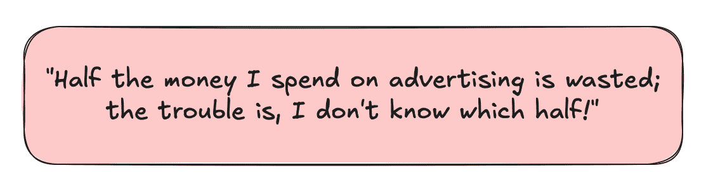

用户生成图像

这句著名的话（我想是来自约翰·华纳梅克？）说明了营销中的挑战和机遇。虽然现代分析已经取得了长足的进步，但挑战仍然存在：理解你的营销预算的哪些部分能带来价值。

由于几个因素，营销渠道在性能和 ROI 方面可能存在显著差异：

+   **受众覆盖和参与度 –** 一些渠道在触及与目标受众对齐的特定潜在客户方面更有效。

+   **获取成本 –** 不同的渠道达到潜在客户所需的成本不同。

+   **渠道饱和 –** 过度使用营销渠道可能导致收益递减。

这种可变性创造了提出关键问题的机会，这些问题可以改变你的营销策略：

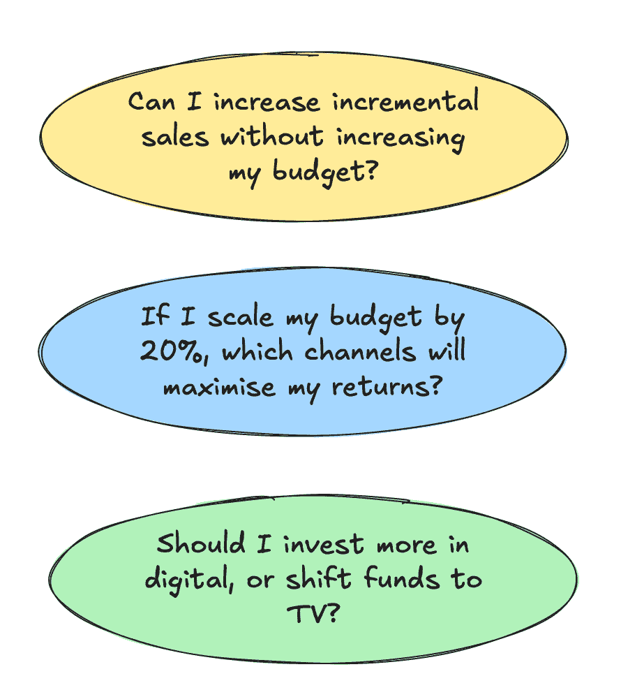

用户生成图像

有效的预算优化是现代营销策略的一个关键组成部分。通过利用 MMM 的输出，企业可以就如何分配资源以产生最大影响做出明智的决策。MMM 提供了关于各种渠道如何贡献于整体销售的见解，使我们能够识别改进和优化的机会。在接下来的章节中，我们将探讨如何将 MMM 的输出转换为可操作的预算分配策略。

### 2.1 响应曲线

响应曲线可以将 MMM 的输出转换为综合形式，显示销售对每个营销渠道支出的反应。

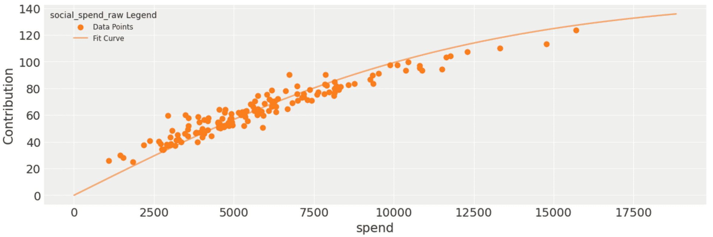

用户生成图像

单独的响应曲线非常强大，它允许我们运行假设情景。以上面的响应曲线为例，我们可以估计随着我们投入更多，社会变化对销售的贡献。我们还可以直观地看到收益递减开始发挥作用的地方。但如果我们想尝试回答更复杂的假设情景，比如在固定总预算的情况下优化渠道级别预算，那该怎么办呢？这正是线性规划发挥作用的地方——让我们在下一节中探讨这个问题！

### 2.2 线性规划

线性规划是一种优化方法，可以用来在给定一些约束条件下找到线性函数的最优解。它是运筹学领域的一个非常通用的工具，但并不常得到应有的认可。它用于解决调度、运输和资源分配问题。我们将探讨如何利用它来优化营销预算。

让我们尝试通过一个简单的预算优化问题来理解线性规划：

+   **决策变量（x）：** 这些是我们想要估计最优值的未知量，例如，每个渠道的营销支出。

+   **目标函数（Z）：** 我们试图最小化或最大化的线性方程，例如，最大化每个渠道的销售贡献总和。

+   **约束条件：** 对决策变量的某些限制，通常用线性不等式表示，例如，总营销预算等于 5000 万英镑，渠道级别预算在 500 万至 1500 万英镑之间。

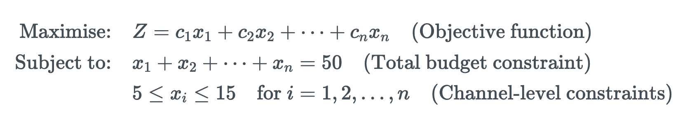

用户生成图像

所有约束条件的交集形成一个可行区域，这是满足给定约束的所有可能解的集合。线性规划的目标是在可行区域内找到使目标函数最优化的点。

考虑到我们对每个营销渠道应用的饱和度转换，优化渠道级别预算实际上是一个非线性规划问题。序列最小二乘规划（SLSQP）是一种用于解决非线性规划问题的算法。它允许使用等式和不等式约束，使其成为我们用例的合理选择。

+   **等式约束**例如，总营销预算等于 5000 万英镑

+   **不等式约束**例如，渠道级别预算在 500 万至 1500 万英镑之间

SciPy 有一个很好的 SLSQP 实现：

> [**优化（scipy.optimize）- SciPy v1.14.1 手册**](https://docs.scipy.org/doc/scipy/tutorial/optimize.html)

下面的例子说明了我们如何使用它：

```py
from scipy.optimize import minimize

result = minimize(
    fun=objective_function,  # Define your ROI function here
    x0=initial_guess,        # Initial guesses for spends
    bounds=bounds,           # Channel-level budget constraints
    constraints=constraints, # Equality and inequality constraints
    method='SLSQP'
)
print(result)
```

从头开始编写预算优化代码是一个复杂但非常有价值的练习。幸运的是，**pymc-marketing**团队已经完成了繁重的工作，提供了一个强大的框架来运行预算优化场景。在下一节中，我们将探讨他们的包如何简化预算分配过程，使其更容易为分析师使用。

## 3.0 Python 演示

现在我们了解了如何使用 MMM 的输出来优化预算，让我们看看我们如何使用上一篇文章中的模型来创造多少价值！在这个演示中，我们将涵盖：

+   模拟数据

+   训练模型

+   验证模型

+   响应曲线

+   预算优化

### 3.1 模拟数据

我们将重新使用第一篇文章中的数据生成过程。如果您想回顾数据生成过程，请查看第一篇文章，我们在那里进行了详细的说明：

> [**精通 Python 中的营销组合建模**](https://towardsdatascience.com/mastering-marketing-mix-modelling-in-python-7bbfe31360f9)

```py
np.random.seed(10)

# Set parameters for data generator
start_date = "2021-01-01"
periods = 52 * 3
channels = ["tv", "social", "search"]
adstock_alphas = [0.50, 0.25, 0.05]
saturation_lamdas = [1.5, 2.5, 3.5]
betas = [350, 150, 50]
spend_scalars = [10, 15, 20]

df = dg.data_generator(start_date, periods, channels, spend_scalars, adstock_alphas, saturation_lamdas, betas)

# Scale betas using maximum sales value - this is so it is comparable to the fitted beta from pymc (pymc does feature and target scaling using MaxAbsScaler from sklearn)
betas_scaled = [
    ((df["tv_sales"] / df["sales"].max()) / df["tv_saturated"]).mean(),
    ((df["social_sales"] / df["sales"].max()) / df["social_saturated"]).mean(),
    ((df["search_sales"] / df["sales"].max()) / df["search_saturated"]).mean()
]

# Calculate contributions
contributions = np.asarray([
    round((df["tv_sales"].sum() / df["sales"].sum()), 2),
    round((df["social_sales"].sum() / df["sales"].sum()), 2),
    round((df["search_sales"].sum() / df["sales"].sum()), 2),
    round((df["demand"].sum() / df["sales"].sum()), 2)
])

df[["date", "demand", "demand_proxy", "tv_spend_raw", "social_spend_raw", "search_spend_raw", "sales"]]
```

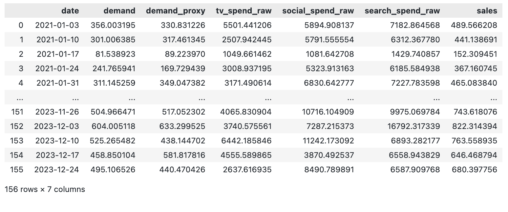

用户生成图像

### 3.2 训练模型

我们现在将重新训练第一篇文章中的模型。我们将像上次一样准备训练数据，通过：

+   将数据拆分为特征和目标。

+   创建训练和超时切片的索引。

然而，由于本文的重点不是模型校准，我们将需求作为一个控制变量而不是需求代理。这意味着模型将非常精确校准——尽管这并不非常现实，但它将给我们一些好的结果来展示我们如何优化预算。

```py
# set date column
date_col = "date"

# set outcome column
y_col = "sales"

# set marketing variables
channel_cols = ["tv_spend_raw",
                "social_spend_raw",
                "search_spend_raw"]

# set control variables
control_cols = ["demand"]

# create arrays
X = df[[date_col] + channel_cols + control_cols]
y = df[y_col]

# set test (out-of-sample) length
test_len = 8

# create train and test indexs
train_idx = slice(0, len(df) - test_len)
out_of_time_idx = slice(len(df) - test_len, len(df))

mmm_default = MMM(
    adstock=GeometricAdstock(l_max=8),
    saturation=LogisticSaturation(),
    date_column=date_col,
    channel_columns=channel_cols,
    control_columns=control_cols,
)

fit_kwargs = {
    "tune": 1_000,
    "chains": 4,
    "draws": 1_000,
    "target_accept": 0.9,
}

mmm_default.fit(X[train_idx], y[train_idx], **fit_kwargs)
```

### 3.3 验证模型

在我们进行优化之前，让我们检查我们的模型拟合得很好。首先，我们检查真实贡献：

```py
channels = np.array(["tv", "social", "search", "demand"])

true_contributions = pd.DataFrame({'Channels': channels, 'Contributions': contributions})
true_contributions= true_contributions.sort_values(by='Contributions', ascending=False).reset_index(drop=True)
true_contributions = true_contributions.style.bar(subset=['Contributions'], color='lightblue')

true_contributions
```

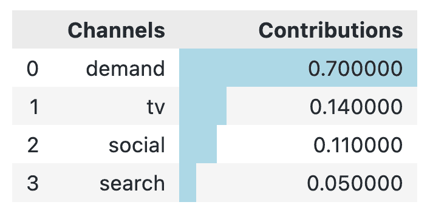

用户生成图像

如预期的那样，我们的模型与真实贡献非常吻合：

```py
mmm_default.plot_waterfall_components_decomposition(figsize=(10,6));
```

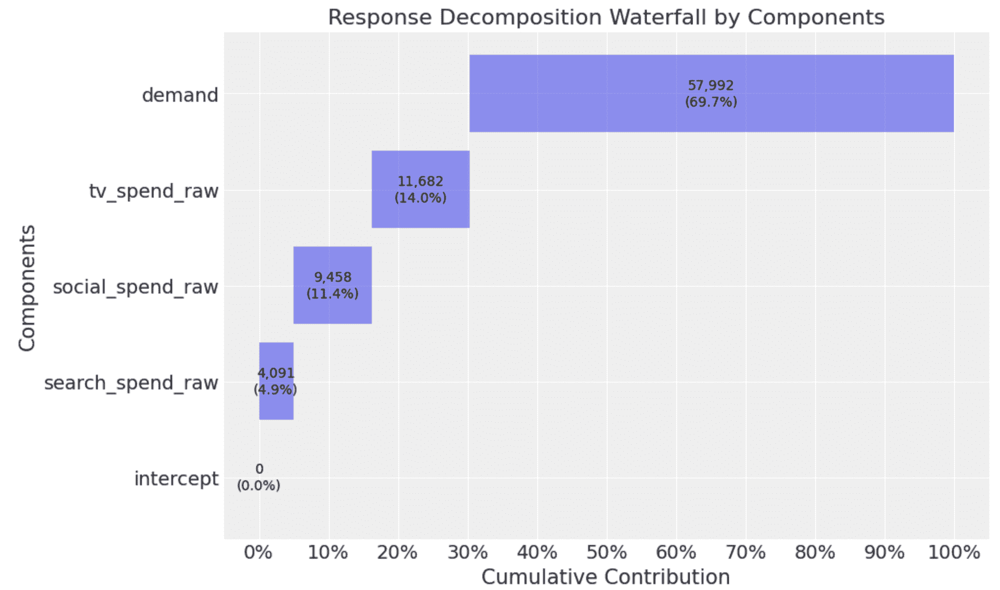

用户生成图像

### 3.4 响应曲线

在我们进行预算优化之前，让我们看看响应曲线。在**pymc-marketing**包中查看响应曲线有两种方式：

1.  直接响应曲线

1.  成本分担响应曲线

让我们从直接响应曲线开始。在直接响应曲线中，我们只是为每个渠道创建每周支出与每周贡献的散点图。

下面我们绘制直接响应曲线：

```py
fig = mmm_default.plot_direct_contribution_curves(show_fit=True, xlim_max=1.2)
[ax.set(xlabel="spend") for ax in fig.axes];
```

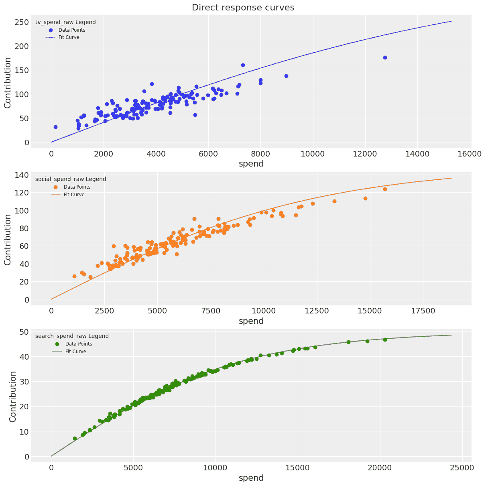

用户生成图像

成本份额响应曲线是另一种比较渠道有效性的方法。当δ = 1.0 时，渠道支出保持在训练数据相同的水平。当δ = 1.2 时，渠道支出增加了 20%。

下面我们绘制成本份额响应曲线：

```py
mmm_default.plot_channel_contributions_grid(start=0, stop=1.5, num=12, figsize=(15, 7));
```

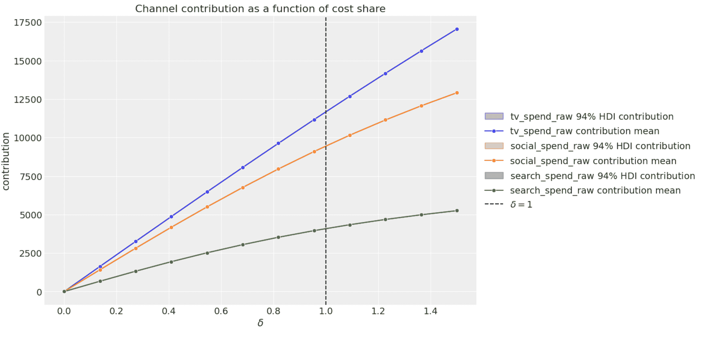

用户生成图像

我们也可以将 x 轴改为显示绝对支出值：

```py
mmm_default.plot_channel_contributions_grid(start=0, stop=1.5, num=12, absolute_xrange=True, figsize=(15, 7));
```

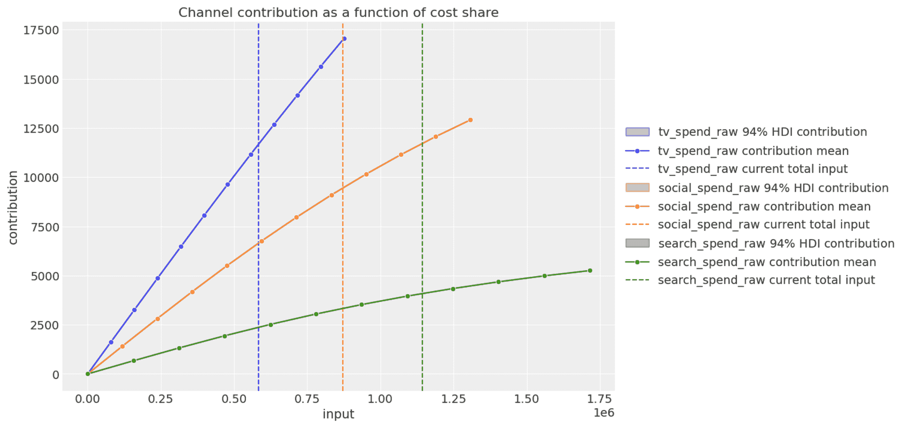

用户生成图像

响应曲线是帮助思考在渠道层面规划未来营销预算的绝佳工具。接下来，让我们将它们付诸实践，运行一些预算优化场景！

### 3.5 预算优化

首先，让我们设置几个参数：

+   **perc_change**：这个参数用于设置每个渠道最小和最大支出的约束。这个约束有助于使场景更现实，意味着我们不会将响应曲线外推得太远，超出模型在训练中看到的内容。

+   **budget_len**：这是预算场景的周数长度。

我们将首先使用期望的预算场景长度来选择最近的数据周期。

```py
perc_change = 0.20
budget_len = 12
budget_idx = slice(len(df) - test_len, len(df))
recent_period = X[budget_idx][channel_cols]

recent_period
```

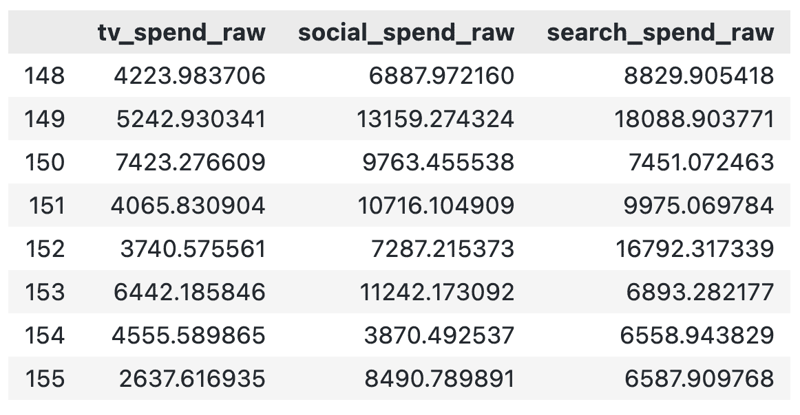

用户生成图像

然后，我们使用这个最近周期来设置整体预算约束和每周级别的渠道约束：

```py
# set overall budget constraint (to the nearest £1k)
budget = round(recent_period.sum(axis=0).sum() / budget_len, -3)

# record the current budget split by channel
current_budget_split = round(recent_period.mean() / recent_period.mean().sum(), 2)

# set channel level constraints
lower_bounds = round(recent_period.min(axis=0) * (1 - perc_change))
upper_bounds = round(recent_period.max(axis=0) * (1 + perc_change))

budget_bounds = {
    channel: [lower_bounds[channel], upper_bounds[channel]]
    for channel in channel_cols
}

print(f'Overall budget constraint: {budget}')
print('Channel constraints:')
for channel, bounds in budget_bounds.items():
    print(f'  {channel}: Lower Bound = {bounds[0]}, Upper Bound = {bounds[1]}')
```

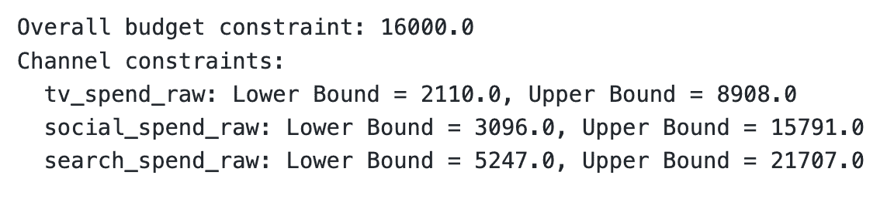

用户生成图像

现在是运行我们的场景的时候了！我们输入相关数据和参数，得到最佳支出。我们将其与将总预算按当前预算分配比例分割（我们称之为实际支出）进行比较。

```py
model_granularity = "weekly"

# run scenario
allocation_strategy, optimization_result = mmm_default.optimize_budget(
    budget=budget,
    num_periods=budget_len,
    budget_bounds=budget_bounds,
    minimize_kwargs={
        "method": "SLSQP",
        "options": {"ftol": 1e-9, "maxiter": 5_000},
    },
)

response = mmm_default.sample_response_distribution(
    allocation_strategy=allocation_strategy,
    time_granularity=model_granularity,
    num_periods=budget_len,
    noise_level=0.05,
)

# extract optimal spend
opt_spend = pd.Series(allocation_strategy, index=recent_period.mean().index).to_frame(name="opt_spend")
opt_spend["avg_spend"] = budget * current_budget_split

# plot actual vs optimal spend
fig, ax = plt.subplots(figsize=(9, 4))
opt_spend.plot(kind='barh', ax=ax, color=['blue', 'orange'])

plt.xlabel("Spend")
plt.ylabel("Channel")
plt.title("Actual vs Optimal Spend by Channel")
plt.legend(["Optimal Spend", "Actual Spend"])
plt.legend(["Optimal Spend", "Actual Spend"], loc='lower right', bbox_to_anchor=(1.5, 0.0))

plt.show()
```

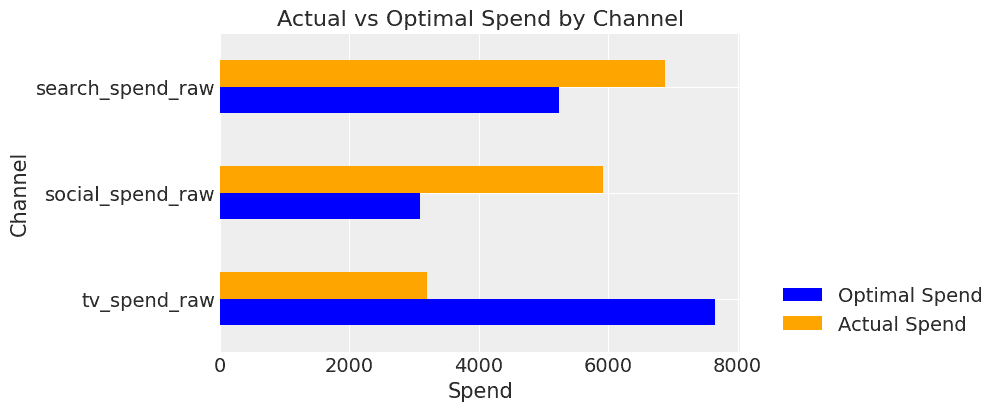

用户生成图像

我们可以看到建议是将预算从数字渠道转移到电视。但这对销售有什么影响？

为了计算最佳支出的贡献，我们需要输入每个渠道的新支出值以及模型中的任何其他变量。我们只有需求，所以我们输入最近周期的平均值。我们也将以同样的方式计算平均支出的贡献。

```py
# create dataframe with optimal spend
last_date = mmm_default.X["date"].max()
new_dates = pd.date_range(start=last_date, periods=1 + budget_len, freq="W-MON")[1:]
budget_scenario_opt = pd.DataFrame({"date": new_dates,})
budget_scenario_opt["tv_spend_raw"] = opt_spend["opt_spend"]["tv_spend_raw"]
budget_scenario_opt["social_spend_raw"] = opt_spend["opt_spend"]["social_spend_raw"]
budget_scenario_opt["search_spend_raw"] = opt_spend["opt_spend"]["search_spend_raw"]
budget_scenario_opt["demand"] = X[budget_idx][control_cols].mean()[0]

# calculate overall contribution
scenario_contrib_opt = mmm_default.sample_posterior_predictive(
    X_pred=budget_scenario_opt, extend_idata=False
)

opt_contrib = scenario_contrib_opt.mean(dim="sample").sum()["y"].values

# create dataframe with avg spend
last_date = mmm_default.X["date"].max()
new_dates = pd.date_range(start=last_date, periods=1 + budget_len, freq="W-MON")[1:]
budget_scenario_avg = pd.DataFrame({"date": new_dates,})
budget_scenario_avg["tv_spend_raw"] = opt_spend["avg_spend"]["tv_spend_raw"]
budget_scenario_avg["social_spend_raw"] = opt_spend["avg_spend"]["social_spend_raw"]
budget_scenario_avg["search_spend_raw"] = opt_spend["avg_spend"]["search_spend_raw"]
budget_scenario_avg["demand"] = X[budget_idx][control_cols].mean()[0]

# calculate overall contribution
scenario_contrib_avg  = mmm_default.sample_posterior_predictive(
    X_pred=budget_scenario_avg , extend_idata=False
)

avg_contrib = scenario_contrib_avg.mean(dim="sample").sum()["y"].values

# calculate % increase in sales
print(f'% increase in sales: {round((opt_contrib / avg_contrib) - 1, 2)}')
```

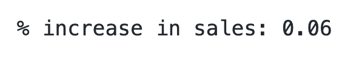

用户生成图像

最佳支出给我们带来了 6%的销售增长！这在固定了整体预算的情况下尤其令人印象深刻！

## 收尾思考

今天我们看到了预算优化有多么强大。它可以帮助组织进行月度/季度/年度预算规划和预测。一如既往，提出良好建议的关键在于拥有一个稳健、校准良好的模型。

* * *

希望你们喜欢第三部分！这就是本系列关于掌握 MMM 的最后一部分。然而，如果你想了解衡量长期品牌建设效果的复杂主题，请继续关注！
