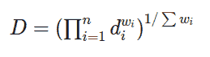
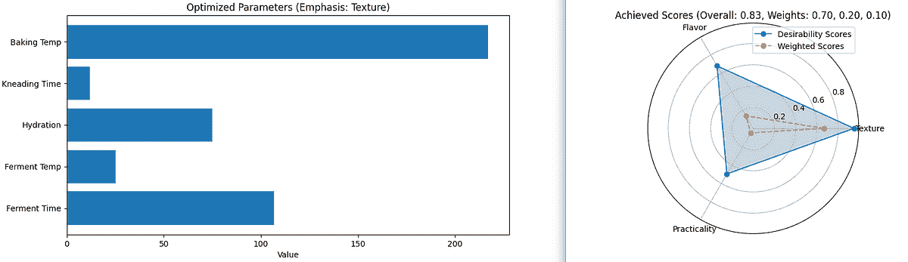

# 使用可接受度函数优化多目标问题

> 原文：[`towardsdatascience.com/optimizing-multi-objective-problems-with-desirability-functions/`](https://towardsdatascience.com/optimizing-multi-objective-problems-with-desirability-functions/)

<mdspan datatext="el1747766571172" class="mdspan-comment">在数据科学工作中</mdspan>，遇到具有竞争目标的问题并不罕见。无论是设计产品、调整算法还是优化投资组合，我们通常需要平衡多个指标以获得最佳结果。有时，最大化一个指标可能会以牺牲另一个指标为代价，这使得很难有一个整体优化的解决方案。

虽然存在多种解决多目标优化问题的方法，但我发现可接受度函数既优雅又易于向非技术受众解释。这使得它们成为一个值得考虑的有趣选项。可接受度函数将结合多个指标生成一个标准化的分数，从而实现整体优化。

在本文中，我们将探讨：

+   可接受度函数的数学基础

+   如何在 Python 中实现这些函数

+   如何使用可接受度函数优化多目标问题

+   结果的可视化用于解释和说明

为了将这些概念应用于实际例子，我们将应用可接受度函数来优化面包烘焙：这是一个具有少量相互关联参数和竞争质量目标的玩具问题，这将使我们能够探索几种优化选择。

到本文结束时，你将拥有一个强大的新工具，可以用于解决多个领域的多目标优化问题，以及在此处可用的完整功能代码 [GitHub](https://github.com/vincent-vdb/medium_posts)。

### 什么是可接受度函数？

可接受度函数最初由 [Harrington (1965)](https://www.scirp.org/reference/referencespapers?referenceid=1542744) 正式提出，后来由 [Derringer and Suich (1980)](https://www.tandfonline.com/doi/abs/10.1080/00224065.1980.11980968) 扩展。其想法是：

+   将每个响应转换为一个介于 0（绝对不可接受）和 1（理想值）之间的性能分数

+   将所有分数合并为一个单一指标以最大化

让我们探讨可接受度函数的类型以及如何将所有分数结合起来。

#### 不同的可接受度函数类型

有三种不同的可接受度函数，可以处理许多不同的情况。

+   **越小越好**：当最小化响应是可取的时候使用

```py
def desirability_smaller_is_better(x: float, x_min: float, x_max: float) -> float:
    """Calculate desirability function value where smaller values are better.

    Args:
        x: Input parameter value
        x_min: Minimum acceptable value
        x_max: Maximum acceptable value

    Returns:
        Desirability score between 0 and 1
    """
    if x <= x_min:
        return 1.0
    elif x >= x_max:
        return 0.0
    else:
        return (x_max - x) / (x_max - x_min)
```

+   **越大越好**：当最大化响应是可取的时候使用

```py
def desirability_larger_is_better(x: float, x_min: float, x_max: float) -> float:
    """Calculate desirability function value where larger values are better.

    Args:
        x: Input parameter value
        x_min: Minimum acceptable value
        x_max: Maximum acceptable value

    Returns:
        Desirability score between 0 and 1
    """
    if x <= x_min:
        return 0.0
    elif x >= x_max:
        return 1.0
    else:
        return (x - x_min) / (x_max - x_min)
```

+   **目标最优**：当特定目标值是最优的时候使用

```py
def desirability_target_is_best(x: float, x_min: float, x_target: float, x_max: float) -> float:
    """Calculate two-sided desirability function value with target value.

    Args:
        x: Input parameter value
        x_min: Minimum acceptable value
        x_target: Target (optimal) value
        x_max: Maximum acceptable value

    Returns:
        Desirability score between 0 and 1
    """
    if x_min <= x <= x_target:
        return (x - x_min) / (x_target - x_min)
    elif x_target < x <= x_max:
        return (x_max - x) / (x_max - x_target)
    else:
        return 0.0
```

每个输入参数都可以用这三种可接受度函数之一进行参数化，在将它们合并为一个单一的可接受度分数之前。

#### 结合可接受度分数

一旦个别指标被转换为可接受度分数，它们需要组合成一个整体可接受度。最常见的方法是几何平均：



其中 d[i]是单个可接受度值，w[i]是反映每个指标相对重要性的权重。

几何平均有一个重要的特性：如果任何单个可接受度为 0（即完全不可接受），则整体可接受度也为 0，无论其他值如何。这强制要求在某种程度上满足所有要求。

```py
def overall_desirability(desirabilities, weights=None):
    """Compute overall desirability using geometric mean

    Parameters:
    -----------
    desirabilities : list
        Individual desirability scores
    weights : list
        Weights for each desirability

    Returns:
    --------
    float
        Overall desirability score
    """
    if weights is None:
        weights = [1] * len(desirabilities)

    # Convert to numpy arrays
    d = np.array(desirabilities)
    w = np.array(weights)

    # Calculate geometric mean
    return np.prod(d ** w) ** (1 / np.sum(w))
```

权重是超参数，它对最终结果有杠杆作用，并为定制留出空间。

### 一个实用的优化示例：面包烘焙

为了展示可接受度函数的实际应用，让我们将它们应用于一个玩具问题：面包烘焙优化问题。

#### 参数和质量指标

让我们玩以下参数：

1.  **发酵时间**（30–180 分钟）

1.  **发酵温度**（20–30°C）

1.  **水合水平**（60–85%）

1.  **揉面时间**（0–20 分钟）

1.  **烘焙温度**（180–250°C）

让我们尝试优化这些指标：

1.  **质地质量**：面包的质地

1.  **风味轮廓**：面包的风味

1.  **实用性**：整个过程的实用性

当然，每个这些指标都依赖于多个参数。因此，这里有一个最关键的步骤：将参数映射到质量指标。

对于每个质量指标，我们需要定义参数如何影响它：

```py
def compute_flavor_profile(params: List[float]) -> float:
    """Compute flavor profile score based on input parameters.

    Args:
        params: List of parameter values [fermentation_time, ferment_temp, hydration,
               kneading_time, baking_temp]

    Returns:
        Weighted flavor profile score between 0 and 1
    """
    # Flavor mainly affected by fermentation parameters
    fermentation_d = desirability_larger_is_better(params[0], 30, 180)
    ferment_temp_d = desirability_target_is_best(params[1], 20, 24, 28)
    hydration_d = desirability_target_is_best(params[2], 65, 75, 85)

    # Baking temperature has minimal effect on flavor
    weights = [0.5, 0.3, 0.2]
    return np.average([fermentation_d, ferment_temp_d, hydration_d],
                      weights=weights)
```

例如，风味受以下因素影响：

+   发酵时间，最小可接受度低于 30 分钟，最大可接受度高于 180 分钟

+   发酵温度，最大可接受度在 24 摄氏度时达到峰值

+   水合作用，在最大可接受度达到 75%湿度时达到峰值

这些计算出的参数随后被加权平均，以返回风味可接受度。对质地质量和实用性也进行了类似的计算。

#### 目标函数

按照可接受度函数方法，我们将使用整体可接受度作为我们的目标函数。目标是最大化这个整体得分，这意味着找到同时满足我们三个要求的最佳参数：

```py
def objective_function(params: List[float], weights: List[float]) -> float:
    """Compute overall desirability score based on individual quality metrics.

    Args:
        params: List of parameter values
        weights: Weights for texture, flavor and practicality scores

    Returns:
        Negative overall desirability score (for minimization)
    """
    # Compute individual desirability scores
    texture = compute_texture_quality(params)
    flavor = compute_flavor_profile(params)
    practicality = compute_practicality(params)

    # Ensure weights sum up to one
    weights = np.array(weights) / np.sum(weights)

    # Calculate overall desirability using geometric mean
    overall_d = overall_desirability([texture, flavor, practicality], weights)

    # Return negative value since we want to maximize desirability
    # but optimization functions typically minimize
    return -overall_d
```

在计算了质地、风味和实用性的个别可接受度之后，整体可接受度简单地通过加权几何平均来计算。它最终返回负的整体可接受度，以便可以最小化。

#### 使用 SciPy 进行优化

我们最终使用 SciPy 的`minimize`函数来寻找最佳参数。由于我们返回了负的整体可接受度作为目标函数，最小化它将最大化整体可接受度：

```py
def optimize(weights: list[float]) -> list[float]:
    # Define parameter bounds
    bounds = {
        'fermentation_time': (1, 24),
        'fermentation_temp': (20, 30),
        'hydration_level': (60, 85),
        'kneading_time': (0, 20),
        'baking_temp': (180, 250)
    }

    # Initial guess (middle of bounds)
    x0 = [(b[0] + b[1]) / 2 for b in bounds.values()]

    # Run optimization
    result = minimize(
        objective_function,
        x0,
        args=(weights,),
        bounds=list(bounds.values()),
        method='SLSQP'
    )

    return result.x
```

在这个函数中，在为每个参数定义边界后，初始猜测被计算为边界的中间值，然后作为 SciPy 的`minimize`函数的输入。最终返回结果。

权重也被作为输入提供给优化器，并且是自定义输出的好方法。例如，如果实用性权重较大，优化解将侧重于实用性，而不是口味和纹理。

现在让我们可视化几组权重的结果。

#### 结果的可视化

让我们看看优化器如何处理不同的偏好配置文件，展示了可行性函数在各种输入权重下的灵活性。

让我们看看在实用性权重偏向的情况下结果如何：


优化参数，权重偏向实用性。图片由作者提供。

由于实用性权重占主导地位，整体可行性达到 0.69，揉捏时间仅为 5 分钟，因为高值对实用性有负面影响。

现在，如果我们侧重于纹理进行优化，结果略有不同：



优化参数，权重偏向纹理。图片由作者提供。

在这种情况下，整体可行性达到 0.85，显著更高。揉捏时间这次是 12 分钟，因为高值对纹理有积极影响，并且由于实用性而受到的惩罚较少。

### 结论：可行性函数的实用应用

虽然我们以面包烘焙为例，但相同的方法可以应用于各种领域，例如化妆品中的产品配方或投资组合优化中的资源分配。

可行性函数为解决众多数据科学应用中的多目标优化问题提供了一个强大的数学框架。通过将原始指标转换为标准化的可行性分数，我们可以有效地结合和优化不同的目标。

这种方法的关键优势包括：

+   标准化尺度使不同指标可比较，并易于组合成单一目标

+   处理不同类型目标的灵活性：最小化、最大化、目标值

+   通过数学函数清晰传达偏好

这里展示的代码为您的实验提供了一个起点。无论您是在优化工业流程、机器学习模型还是产品配方，希望可行性函数能提供一个系统的方法来在各种竞争目标之间找到最佳折衷方案。
