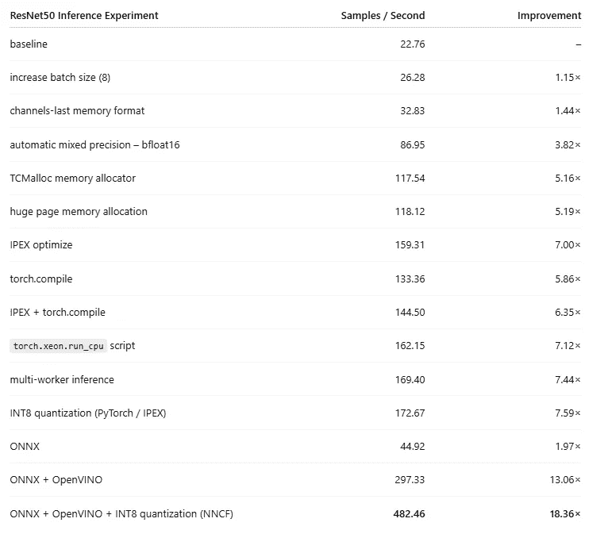
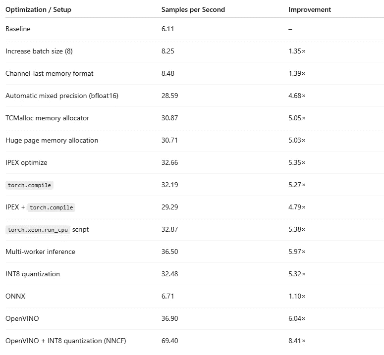

# 在 CPU 上优化 PyTorch 模型推理

> 原文：[`towardsdatascience.com/optimizing-pytorch-model-inference-on-cpu/`](https://towardsdatascience.com/optimizing-pytorch-model-inference-on-cpu/)

<mdspan datatext="el1764509051498" class="mdspan-comment">随着</mdspan> <mdspan datatext="el1764807856821" class="mdspan-comment">对 AI 模型</mdspan>的依赖性增加，优化它们运行时性能的重要性也在增加。虽然 AI 模型将超越人类智能的程度仍然是一个热烈的辩论话题，但它们对强大且昂贵的计算资源的需求是不容置疑的——甚至可以说是臭名昭著的。

在 [之前的文章](https://towardsdatascience.com/author/chaimrand/)中，我们讨论了 AI 模型优化的主题——主要是在模型训练的背景下——并展示了它如何对 AI 模型开发的成本和速度产生决定性的影响。在这篇文章中，我们将关注 AI 模型推理，其中模型优化有一个额外的目标：最小化推理请求的延迟并提高模型消费者的用户体验。

在本文中，我们将假设模型推理所进行的平台是一个第 4 代英特尔® 至强® 可扩展处理器，更具体地说，是一个亚马逊 EC2 [c7i.xlarge](https://aws.amazon.com/ec2/instance-types/c7i/)实例（带有 4 个英特尔至强 vCPU），运行一个专门的 [深度学习 Ubuntu (22.04) AMI](https://docs.aws.amazon.com/dlami/latest/devguide/aws-deep-learning-x86-gpu-pytorch-2.7-ubuntu-22-04.html)和一个 CPU 构建的 [PyTorch 2.8.0](https://pytorch.org/get-started/locally/)。当然，选择模型部署平台是在设计 AI 解决方案时做出的许多重要决策之一，包括模型架构、开发框架、训练加速器、数据格式、部署策略等的选择——每个选择都必须考虑到相关的成本和运行速度。在专用 AI 推理加速器数量持续增长的时代，为运行模型推理选择 CPU 处理器可能看起来有些令人惊讶。然而，正如我们将看到的，在某些情况下，最佳（且最经济）的选择可能恰恰是一个老式的优秀 CPU。

我们将介绍一个玩具图像分类模型，并继续展示在英特尔® 至强® CPU 上对 AI 模型推理进行优化的机会。AI 模型的部署通常包括一个完整的推理服务器解决方案，但为了简化讨论，我们将仅限于讨论模型的核执行部分。有关模型推理服务的入门知识，请参阅我们之前的文章： [集中式 AI 模型推理服务的案例](https://towardsdatascience.com/the-case-for-centralized-ai-model-inference-serving/)。

在本文中，我们的目的是展示：1）一些简单的优化技术可以带来有意义的性能提升，2）达到这样的结果并不需要性能分析器（如[Intel® VTune™ Profiler](https://www.intel.com/content/www/us/en/developer/tools/oneapi/vtune-profiler.html)）或底层计算内核内部工作的专业知识。重要的是，AI 模型优化的过程可能因模型架构和运行时环境的不同而有很大差异。针对训练的优化与针对推理的优化不同。优化 Transformer 模型与优化 CNN 模型不同。优化 22 亿参数模型与优化 1 亿参数模型不同。优化模型在 GPU 上运行与优化它在 CPU 上运行不同。即使是同一 CPU 系列的不同的代产品，也可能有不同的计算组件和相应的优化技术。虽然优化给定实例上给定模型的总体步骤相当标准，但具体路径和最终结果可能会根据具体项目有很大的不同。

我们将分享的代码片段仅用于演示目的。请勿依赖它们的准确性或最优性。请勿将我们提及的任何工具或技术解释为对其使用的认可。最终，最适合你用例的设计选择将极大地取决于你项目的细节，鉴于对性能可能产生的影响程度，应该用适当的时间和注意力进行评估。

## 为什么是 CPU？

随着执行 AI/ML 模型推理的硬件解决方案数量的不断增长，我们选择 CPU 作为推理平台可能看起来令人惊讶。在本节中，我们将描述一些 CPU 可能是推理首选平台的情况。

1.  **可访问性**：使用专用的人工智能加速器（如 GPU）通常需要专门的部署和维护，或者，在云服务平台上访问这些实例。另一方面，CPU 无处不在。设计在 CPU 上运行的解决方案提供了更大的灵活性，并增加了部署的机会。

1.  **可用性**：即使你的算法可以访问人工智能加速器，也存在可用性的问题。人工智能加速器需求极高，即使你能够获得一个，无论是本地还是云端的，你可能会选择将它们优先用于更资源密集型的任务，例如人工智能模型训练。

1.  **降低延迟**：有许多情况，你的 AI 模型只是运行在标准 CPU 上的软件算法管道中的一个组件。虽然 AI 模型在人工智能加速器上可能执行得更快，但考虑到发送推理请求到网络所需的时间，它在同一 CPU 上运行可能会更快。

1.  **加速器利用率不足**：AI 加速器通常相当昂贵。为了证明其成本合理，你的目标应该是保持其完全占用，最小化其空闲时间。在某些情况下，推理负载可能无法证明昂贵 AI 加速器的成本合理。

1.  **模型架构**：如今，我们往往自动假设 AI 模型在 AI 加速器上的性能将显著优于 CPU。尽管这种情况通常确实如此，但你的模型可能包含在 CPU 上表现更好的层。例如，序列算法如非极大值抑制（NMS）和匈牙利匹配算法通常在 CPU 上的表现优于 GPU，即使有 GPU 可用，也经常将它们卸载到 CPU 上（例如，参见[这里](https://github.com/pytorch/vision/blob/v0.19.1/torchvision/csrc/ops/cuda/nms_kernel.cu)）。如果你的模型包含许多这样的层，在 CPU 上运行可能并不是一个糟糕的选择。

### 为什么选择 Intel Xeon？

[Intel® Xeon® 可扩展 CPU](https://www.intel.com/content/www/us/en/products/details/processors/xeon/scalable.html)处理器内置了针对典型 AI/ML 工作负载中常见的矩阵和卷积算子的加速器。这些包括[AVX-512](https://www.intel.com/content/www/us/en/architecture-and-technology/avx-512-overview.html)（在第一代中引入）、[VNNI 扩展](https://www.intel.com/content/www/us/en/developer/articles/guide/deep-learning-with-avx512-and-dl-boost.html)（第二代）和[AMX](https://www.intel.com/content/www/us/en/products/docs/accelerator-engines/what-is-intel-amx.html)（第四代）。特别是，AMX 引擎包括用于使用 bfloat16 和 int8 精度数据类型执行 AI 模型的专用硬件指令。加速引擎与英特尔优化的软件堆栈紧密集成，该软件堆栈包括[oneDNN](https://www.intel.com/content/www/us/en/developer/tools/oneapi/onednn.html)、[OpenVINO](https://www.intel.com/content/www/us/en/developer/tools/openvino-toolkit/overview.html)和[PyTorch 的英特尔扩展](https://www.intel.com/content/www/us/en/developer/articles/technical/accelerate-with-intel-extension-for-pytorch.html)（IPEX）。这些库利用了专门的 Intel® Xeon®硬件能力，以最小的代码更改优化模型执行。

尽管本节中提出了论点，但在考虑所有可用选项并评估每个选项的优化机会之后，才应做出推理工具的选择。在下一节中，我们将介绍一个玩具实验并探讨 CPU 上的某些优化机会。

## 推理实验

在本节中，我们定义了一个玩具 AI 模型推理实验，包括一个[Resnet50](https://docs.pytorch.org/vision/main/models/generated/torchvision.models.resnet50.html)图像分类模型、一个随机生成的输入批次，以及一个简单的基准测试工具，我们使用它来报告每秒处理的平均输入样本数（SPS）。

```py
import torch, torchvision
import time

def get_model():
    model = torchvision.models.resnet50()
    model = model.eval()
    return model

def get_input(batch_size):
    batch = torch.randn(batch_size, 3, 224, 224)
    return batch

def get_inference_fn(model):
    def infer_fn(batch):
        with torch.inference_mode():
            output = model(batch)
        return output
    return infer_fn

def benchmark(infer_fn, batch):
    # warm-up
    for _ in range(10):
        _ = infer_fn(batch)

    iters = 100

    start = time.time()
    for _ in range(iters):
        _ = infer_fn(batch)
    end = time.time()

    return (end - start) / iters

batch_size = 1
model = get_model()
batch = get_input(batch_size)
infer_fn = get_inference_fn(model)
avg_time = benchmark(infer_fn, batch)
print(f"\nAverage samples per second: {(batch_size/avg_time):.2f}")
```

我们玩具模型的基线性能为每秒 22.76 个样本（SPS）。

## 模型推理优化

在本节中，我们对玩具实验应用了多项优化，并评估了它们对运行时性能的影响。我们的重点是那些相对容易应用的优化技术。虽然很可能会实现额外的性能提升，但这些可能需要更大的专业化和更多的时间投入。

我们的重点将放在不改变模型架构的优化上；如模型蒸馏和模型剪枝等优化技术超出了本文的范畴。此外，优化特定模型组件的方法，例如通过实现定制的 PyTorch 运算符，也不在本节讨论范围内。

在之前的一篇文章中，我们讨论了在 Intel XEON CPU 上针对训练工作负载的 AI 模型优化。在本节中，我们将回顾其中的一些技术，这次是在 AI 模型推理的背景下。我们将补充一些仅适用于推理设置的优化技术，包括推理模型编译、INT8 量化以及多工作者推理。

我们展示优化方法的顺序不是强制性的。实际上，一些技术是相互依赖的；例如，增加推理工作者的数量可能会影响最佳批次大小的选择。

### 优化 1：批处理推理

提高资源利用率同时减少平均推理响应时间的常用方法是将输入样本分组为批次。在现实场景中，我们需要确保限制批次大小以满足服务级别响应时间要求，但为了实验目的，我们忽略这一要求。通过实验不同批次大小，我们发现批次大小为 8 时，吞吐量为 26.28 SPS，比基线结果高 15%。

注意，如果输入样本的形状不同，分组需要更多的处理（例如，参见[这里](https://towardsdatascience.com/optimizing-transformer-models-for-variable-length-input-sequences-19fb88fddf71/)）。

### 优化 2：通道最后内存格式

在 PyTorch 中，默认情况下，4D 张量以 NCHW 格式存储，即四个维度分别代表批大小、通道、高度和宽度。然而，channels-last 或 NHWC 格式（即批大小、高度、宽度、通道）在 CPU 上表现出更好的性能。调整我们的推理脚本以应用 channels-last 优化，只需将模型和输入的内存格式设置为 *torch.channels_last*，如下所示：

```py
def get_model(channels_last=False):
    model = torchvision.models.resnet50()
    if channels_last:
        model= model.to(memory_format=torch.channels_last)
    model = model.eval()
    return model

def get_input(batch_size, channels_last=False):
    batch = torch.randn(batch_size, 3, 224, 224)
    if channels_last:
        batch = batch.to(memory_format=torch.channels_last)
    return batch

batch_size = 8
model = get_model(channels_last=True)
batch = get_input(batch_size, channels_last=True)
infer_fn = get_inference_fn(model)
avg_time = benchmark(infer_fn, batch)
print(f"\nAverage samples per second: {(batch_size/avg_time):.2f}")
```

应用 *channels-last* 内存优化，进一步提升了 25% 的吞吐量。

这种优化的影响在具有许多卷积层的模型上最为明显。预计它不会对其他模型架构（例如，转换器模型）产生明显的影响。

请参阅 [PyTorch 文档](https://docs.pytorch.org/tutorials/intermediate/memory_format_tutorial.html) 了解内存格式优化的更多详细信息，以及 [英特尔文档](https://intel.github.io/intel-extension-for-pytorch/cpu/latest/tutorials/features/nhwc.html) 了解如何在 oneDNN 内部实现此功能。

### 优化 3：自动混合精度

现代英特尔® 至强® 可扩展处理器（从第 3 代开始）原生支持 bfloat16 数据类型，这是标准 float32 的 16 位浮点数替代品。我们可以通过应用 PyTorch 的自动混合精度包 [torch.amp](https://pytorch.org/docs/stable/amp.html) 来利用这一点，如下所示：

```py
def get_inference_fn(model, enable_amp=False):
    def infer_fn(batch):
        with torch.inference_mode(), torch.amp.autocast(
                'cpu',
                dtype=torch.bfloat16,
                enabled=enable_amp
        ):
            output = model(batch)
        return output
    return infer_fn

batch_size = 8
model = get_model(channels_last=True)
batch = get_input(batch_size, channels_last=True)
infer_fn = get_inference_fn(model, enable_amp=True)
avg_time = benchmark(infer_fn, batch)
print(f"\nAverage samples per second: {(batch_size/avg_time):.2f}")
```

应用混合精度后的结果是每秒 86.95 个样本的吞吐量，是之前实验的 2.6 倍，是基准结果的 3.8 倍。

注意，使用降低精度的浮点数类型可能会影响数值精度，并且其对模型质量性能的影响必须进行评估。

### 优化 4：内存分配优化

典型的 AI/ML 工作负载需要分配和访问大块内存。许多优化技术旨在调整模型执行期间内存的分配和使用方式。一个常见的步骤是将默认的系统分配器（ptmalloc）替换为替代内存分配库，例如 [Jemalloc](https://github.com/jemalloc/jemalloc) 和 [TCMalloc](https://google.github.io/tcmalloc/overview.html)，这些库在常见的 AI/ML 工作负载上已被证明表现更佳（例如，参见 [此处](https://docs.pytorch.org/tutorials/recipes/xeon_run_cpu.html#choosing-an-optimized-memory-allocator)）。要安装 [TCMalloc](https://google.github.io/tcmalloc/overview.html)，请运行：

```py
sudo apt-get install google-perftools
```

我们通过 *LD_PRELOAD* 环境变量来编程其使用：

```py
LD_PRELOAD=/usr/lib/x86_64-linux-gnu/libtcmalloc.so.4 python main.py
```

这种优化带来了另一个显著的性能提升：117.54 SPS，比我们之前的实验高出 35%！！

### 优化 5：启用大页分配

默认情况下，Linux 内核以 4 KB 的块分配内存，通常称为页面。虚拟和物理内存地址之间的映射由 CPU 的内存管理单元（MMU）管理，它使用一个称为转换后备缓冲器（TLB）的小型硬件缓存。TLB 的条目数量有限。当你有 *很多* 小页面（如大型神经网络模型）时，TLB 缓存未命中次数会迅速增加，增加延迟并降低程序的速度。解决这个问题的常见方法是使用“大页面”——每个页面 2 MB（或 1 GB）的块。这减少了所需的 TLB 条目数量，提高了内存访问效率并降低了分配延迟。

```py
export THP_MEM_ALLOC_ENABLE=1
```

在我们的模型情况下，影响微乎其微。然而，这对于许多 AI/ML 工作负载来说是一个重要的优化。

#### 优化 6：IPEX

[Intel® Extension for PyTorch (IPEX)](https://intel.github.io/intel-extension-for-pytorch/cpu/latest/) 是一个针对 PyTorch 的库扩展，为英特尔硬件提供了最新的性能优化。要安装它，我们运行：

```py
pip install intel_extension_for_pytorch
```

在下面的代码块中，我们演示了 [ipex.optimize](https://intel.github.io/intel-extension-for-pytorch/latest/tutorials/api_doc.html) API 的基本用法。

```py
import intel_extension_for_pytorch as ipex

def get_model(channels_last=False, ipex_optimize=False):
    model = torchvision.models.resnet50()

    if channels_last:
        model= model.to(memory_format=torch.channels_last)

    model = model.eval()

    if ipex_optimize:
        model = ipex.optimize(model, dtype=torch.bfloat16)

    return model
```

结果的吞吐量为 159.31 SPS，提高了 36% 的性能。

请参阅官方文档以获取更多关于 IPEX 提供的众多优化细节。

### 优化 7：模型编译

另一个流行的 PyTorch 优化是 torch.compile。自 PyTorch 2.0 引入，这个即时编译（JIT）功能执行内核融合和其他优化。在之前的文章中，我们详细介绍了 PyTorch 的编译，涵盖了其许多功能、控制和限制。在这里，我们演示其基本用法：

```py
def get_model(channels_last=False, ipex_optimize=False, compile=False):
    model = torchvision.models.resnet50()

    if channels_last:
        model= model.to(memory_format=torch.channels_last)

    model = model.eval()

    if ipex_optimize:
        model = ipex.optimize(model, dtype=torch.bfloat16)

    if compile:
        model = torch.compile(model)

    return model
```

在 IPEX 优化的模型上应用 torch.compile，结果吞吐量为 144.5 SPS，低于我们之前的实验。在我们的模型情况下，IPEX 和 torch.compile 并不兼容。仅应用 torch.compile 时，吞吐量为 133.36 SPS。

从这个实验中得出的总体结论是，对于给定的模型，任何两种优化技术都可能相互干扰。这需要评估多个配置对给定模型运行时性能的影响，以找到最佳配置。

### 优化 8：使用 **`torch.xeon.run_cpu`** 自动调整环境设置

有许多环境设置可以控制线程和内存管理，并可用于进一步微调 AI/ML 工作负载的运行时性能。而不是手动设置这些设置，PyTorch 提供了 [torch.xeon.run_cpu](https://docs.pytorch.org/tutorials/recipes/xeon_run_cpu.html) 脚本来自动完成这些操作。为了使用此脚本，我们安装了英特尔的多线程和进程库，[one TBB](https://www.intel.com/content/www/us/en/developer/tools/oneapi/onetbb.html) 和 [Intel OpenMP](https://www.intel.com/content/www/us/en/docs/oneapi/installation-guide-linux/2023-0/pip.html)。我们还添加了一个符号链接到我们的 [TCMalloc](https://google.github.io/tcmalloc/overview.html) 安装。

```py
# install TBB
sudo apt install -y libtbb12
# install openMP
pip install intel-openmp
# link to tcmalloc
sudo ln -sf /usr/lib/x86_64-linux-gnu/libtcmalloc.so.4 /usr/lib/libtcmalloc.so
```

在我们的玩具模型中，使用 torch.xeon.run_cpu 将吞吐量提高到 162.15 SPS —— 比我们之前的最大值 159.31 SPS 略有增加。

请参阅 [PyTorch 文档](https://docs.pytorch.org/tutorials/recipes/xeon_run_cpu.html) 了解 `torch.xeon.run_cpu` 的更多功能和它应用的环境变量的更多详细信息。

### 优化 9：多工作者推理

另一种提高资源利用率和扩展性的流行技术是加载多个 AI 模型实例，并在单独的进程中并行运行它们。尽管这种技术更常应用于具有许多 CPU 的机器（分为多个 [NUMA 节点](https://docs.pytorch.org/tutorials/recipes/xeon_run_cpu.html#applying-numa-access-control)）—— 而不是我们的小型 4-vCPU 实例——但我们在此处包含它以供演示。在下面的脚本中，我们并行运行了我们的模型 2 个实例：

```py
python -m torch.backends.xeon.run_cpu --ninstances 2 main.py
```

这使得吞吐量达到 169.4 SPS —— 另外一个适度但有意义 4% 的增加。

### 优化 10：INT8 量化

INT8 量化是加速 AI 模型推理执行的另一种常见技术。在 INT8 量化中，模型权重和激活的浮点数据类型被替换为 8 位整数。英特尔的 Xeon 处理器包括用于处理 INT8 操作的专用加速器（例如，请参阅 [此处](https://pytorch.org/blog/int8-quantization/))）。INT8 量化可以导致速度的显著提高和更低的内存占用。重要的是，降低的位精度可能会对模型输出的质量产生重大影响。关于 INT8 量化的方法有很多，其中一些包括校准或重新训练。还有许多不同的工具和库可以用于应用量化。关于量化的全面讨论超出了本文的范围。

由于在这篇文章中我们只关注潜在的性能影响，我们展示了使用[TorchAO](https://github.com/pytorch/ao)的一个量化方案，没有考虑对模型质量的影响。在下面的代码块中，我们实现了[通过 Inductor 使用 X86 后端进行 PyTorch 2 导出量化](https://docs.pytorch.org/ao/stable/tutorials_source/pt2e_quant_x86_inductor.html)。INT8 量化是加速 AI 模型推理执行的一种常见技术。在 INT8 量化中，模型权重和激活的浮点数据类型被替换为 8 位整数。Intel 的 Xeon 处理器包括用于处理 INT8 操作的专用加速器（例如，请参阅[这里](https://pytorch.org/blog/int8-quantization/)）。INT8 量化可以显著提高速度并降低内存占用。

重要的是，降低的位精度可能会对模型输出的质量产生重大影响。关于 INT8 量化有许多不同的方法，其中一些包括校准或重新训练。还有各种各样的工具和库用于应用量化。关于量化的全面讨论超出了本文的范围。由于在这篇文章中我们只关注潜在的性能影响，我们展示了使用[TorchAO](https://github.com/pytorch/ao)的一个量化方案，没有考虑对模型质量的影响。在下面的代码块中，我们实现了[通过 Inductor 使用 X86 后端进行 PyTorch 2 导出量化](https://docs.pytorch.org/ao/stable/tutorials_source/pt2e_quant_x86_inductor.html)。请参阅文档以获取完整详情：

```py
from torchao.quantization.pt2e.quantize_pt2e import prepare_pt2e, convert_pt2e
import torchao.quantization.pt2e.quantizer.x86_inductor_quantizer as xiq

def quantize_model(model):
    x = torch.randn(4, 3, 224, 224).contiguous(
                            memory_format=torch.channels_last)
    example_inputs = (x,)
    batch_dim = torch.export.Dim("batch")
    with torch.no_grad():
        exported_model = torch.export.export(
            model,
            example_inputs,
            dynamic_shapes=((batch_dim,
                             torch.export.Dim.STATIC,
                             torch.export.Dim.STATIC,
                             torch.export.Dim.STATIC),
                            )
        ).module()
    quantizer = xiq.X86InductorQuantizer()
    quantizer.set_global(xiq.get_default_x86_inductor_quantization_config())
    prepared_model = prepare_pt2e(exported_model, quantizer)
    prepared_model(*example_inputs)
    converted_model = convert_pt2e(prepared_model)
    optimized_model = torch.compile(converted_model)
    return optimized_model

batch_size = 8
model = get_model(channels_last=True)
model = quantize_model(model)
batch = get_input(batch_size, channels_last=True)
infer_fn = get_inference_fn(model, enable_amp=True)
avg_time = benchmark(infer_fn, batch)
print(f"\nAverage samples per second: {(batch_size/avg_time):.2f}")
```

这导致吞吐量为 172.67 SPS。

请参阅[这里](https://docs.pytorch.org/docs/2.9/quantization.html)以获取 PyTorch 中关于量化的更多详细信息。

### 优化 11：使用 ONNX 进行图编译和执行

有许多第三方库专门用于将 PyTorch 模型编译成图表示，并针对目标推理设备上的运行时性能进行优化。其中最受欢迎的库之一是[Open Neural Network Exchange](https://onnx.ai/)（ONNX）。ONNX 对 AI/ML 模型进行预编译，并使用专用运行时库执行它们。

虽然 PyTorch 包含 ONNX 编译支持，但执行 ONNX 模型需要以下库：

```py
pip install onnxruntime
```

在下面的代码块中，我们展示了 ONNX 编译和模型执行：

```py
def export_to_onnx(model, onnx_path="resnet50.onnx"):
    dummy_input = torch.randn(4, 3, 224, 224)
    batch = torch.export.Dim("batch")
    torch.onnx.export(
        model,
        dummy_input,
        onnx_path,
        input_names=["input"],
        output_names=["output"],
        dynamic_shapes=((batch,
                         torch.export.Dim.STATIC,
                         torch.export.Dim.STATIC,
                         torch.export.Dim.STATIC),
                        ),
        dynamo=True
    )
    return onnx_path

def onnx_infer_fn(onnx_path):
    import onnxruntime as ort

    sess = ort.InferenceSession(
        onnx_path,
        providers=["CPUExecutionProvider"]
    )
    input_name = sess.get_inputs()[0].name

    def infer_fn(batch):
        result = sess.run(None, {input_name: batch})
        return result
    return infer_fn

batch_size = 8
model = get_model()
onnx_path = export_to_onnx(model)
batch = get_input(batch_size).numpy()
infer_fn = onnx_infer_fn(onnx_path)
avg_time = benchmark(infer_fn, batch)
print(f"\nAverage samples per second: {(batch_size/avg_time):.2f}")
```

结果吞吐量为 44.92 SPS，远低于我们之前的实验。在我们的玩具模型中，ONNX 运行时并没有提供任何优势。

### 优化 12：使用 OpenVINO 进行图编译和执行

另一个针对部署高性能 AI 解决方案的开源工具包是[OpenVINO](https://docs.openvino.ai/2025/index.html)。[OpenVINO](https://pypi.org/project/openvino/)针对在英特尔硬件上执行模型进行了高度优化——例如，通过充分利用英特尔 AMX 指令。在 PyTorch 中应用 OpenVINO 的常见方法是将模型首先转换为 ONNX：

```py
from openvino import Core

def compile_openvino_model(onnx_path):
    core = Core()
    model = core.read_model(onnx_path)
    compiled = core.compile_model(model, "CPU")
    return compiled

def openvino_infer_fn(compiled_model):
    def infer_fn(batch):
        result = compiled_model([batch])[0]
        return result
    return infer_fn

batch_size = 8
model = get_model()
onnx_path = export_to_onnx(model)
ovm = compile_openvino_model(onnx_path)
batch = get_input(batch_size).numpy()
infer_fn = openvino_infer_fn(ovm)
avg_time = benchmark(infer_fn, batch)
print(f"\nAverage samples per second: {(batch_size/avg_time):.2f}")
```

这次优化的结果是吞吐量为 297.33 SPS，几乎是之前最佳实验的两倍速度！！

请参阅官方文档以获取更多关于 OpenVINO 的详细信息。

### 优化 13：OpenVINO 中的 NNCF INT8 量化

作为我们最后的优化，我们重新审视了 INT8 量化，这次是在[OpenVINO 编译](https://docs.openvino.ai/2025/openvino-workflow/model-optimization.html)的框架下。和之前一样，有几种执行量化的方法——旨在最小化对质量性能的影响。在这里，我们使用[NNCF](https://pypi.org/project/nncf/)库演示了基本流程，如[此处](https://docs.openvino.ai/2025/openvino-workflow/model-optimization-guide/quantizing-models-post-training/basic-quantization-flow.html)所述。

```py
class RandomDataset(torch.utils.data.Dataset):

    def __len__(self):
        return 10000

    def __getitem__(self, idx):
        return torch.randn(3, 224, 224)

def nncf_quantize(onnx_path):
    import nncf

    core = Core()
    onnx_model = core.read_model(onnx_path)
    calibration_loader = torch.utils.data.DataLoader(RandomDataset())
    input_name = onnx_model.inputs[0].get_any_name()
    transform_fn = lambda data_item: {input_name: data_item.numpy()}
    calibration_dataset = nncf.Dataset(calibration_loader, transform_fn)
    quantized_model = nncf.quantize(onnx_model, calibration_dataset)
    return core.compile_model(quantized_model, "CPU")

batch_size = 8
model = get_model()
onnx_path = export_to_onnx(model)
q_model = nncf_quantize(onnx_path)
batch = get_input(batch_size).numpy()
infer_fn = openvino_infer_fn(q_model)
avg_time = benchmark(infer_fn, batch)
print(f"\nAverage samples per second: {(batch_size/avg_time):.2f}")
```

这使得吞吐量达到了 482.46(!!) SPS，又一次大幅提升，比我们的基线实验快 18 倍以上。

### 结果

我们在下面的表格中总结了我们的实验结果：



ResNet50 推理实验（作者）

在我们的玩具模型的情况下，我们展示的优化步骤导致了巨大的性能提升。重要的是，每个优化的影响可能会根据模型的细节有很大的不同。你可能发现这些技术中的一些并不适用于你的模型，或者并没有带来性能提升。例如，当我们将相同的优化序列重新应用于一个视觉 Transformer (ViT) 模型时，结果性能提升为 8.41X——仍然很显著，但低于我们实验中的 18.36X。请参阅本帖的附录以获取详细信息。

我们的重点一直在于运行时性能，但评估每个优化对您认为重要的其他指标的影响也同样关键——最重要的是模型质量。

毫无疑问，还有许多更多的优化技术可以应用；我们仅仅只是触及了表面。希望，

## 摘要

本文继续我们关于 AI/ML 模型运行时性能分析和优化的重要主题系列[文章](https://towardsdatascience.com/author/chaimrand/)。本文的重点是模型在 Intel® Xeon® CPU 处理器上的推理。鉴于 CPU 的普遍性和普及性，能够在它们上以可靠和高效的方式执行模型的能力，可能极具吸引力。正如我们所展示的，通过应用一系列相对简单的技术，我们可以在模型性能上实现显著的提升，这对推理成本和推理延迟有深远的影响。

请随时提出评论、问题或更正。

## 附录：视觉 Transformer 优化

为了展示我们讨论的运行时优化对我们讨论的 AI/ML 模型细节的影响，我们在流行的[timm](https://pypi.org/project/timm/)库中的一个视觉 Transformer（ViT）模型上重新进行了实验：

```py
from timm.models.vision_transformer import VisionTransformer

def get_model(channels_last=False, ipex_optimize=False, compile=False):
    model = VisionTransformer()

    if channels_last:
        model= model.to(memory_format=torch.channels_last)

    model = model.eval()

    if ipex_optimize:
        model = ipex.optimize(model, dtype=torch.bfloat16)

    if compile:
        model = torch.compile(model)

    return model
```

在这个实验中的一个修改是将[OpenVINO 编译直接应用于 PyTorch 模型](https://docs.openvino.ai/2025/openvino-workflow/model-preparation/convert-model-pytorch.html)，而不是中间的 ONNX 模型。这是因为 OpenVINO 编译在 ViT ONNX 模型上失败了。下面展示了修订后的[NNCF 量化](https://docs.openvino.ai/2025/openvino-workflow/model-optimization-guide/quantizing-models-post-training/basic-quantization-flow.html#)和 OpenVINO 编译序列：

```py
import openvino as ov
import nncf

batch_size = 8
model = get_model()
calibration_loader = torch.utils.data.DataLoader(RandomDataset())
calibration_dataset = nncf.Dataset(calibration_loader)

# quantize PyTorch model
model = nncf.quantize(model, calibration_dataset)
ovm = ov.convert_model(model, example_input=torch.randn(1, 3, 224, 224))
ovm = ov.compile_model(ovm)
batch = get_input(batch_size).numpy()
infer_fn = openvino_infer_fn(ovm)
avg_time = benchmark(infer_fn, batch)
print(f"\nAverage samples per second: {(batch_size/avg_time):.2f}")
```

下表总结了本文讨论的优化结果，当应用于 ViT 模型时：



视觉 Transformer 推理实验（作者）
