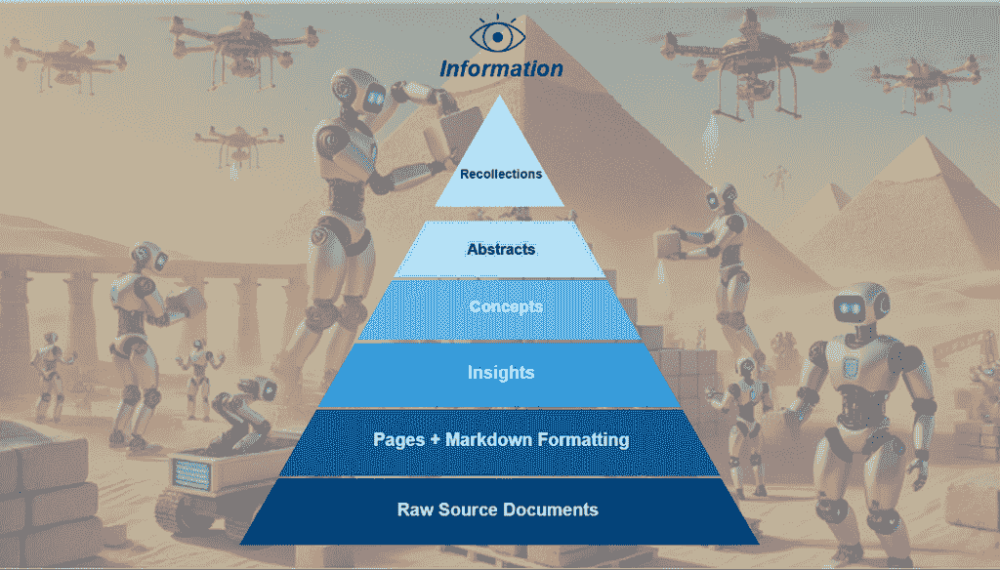
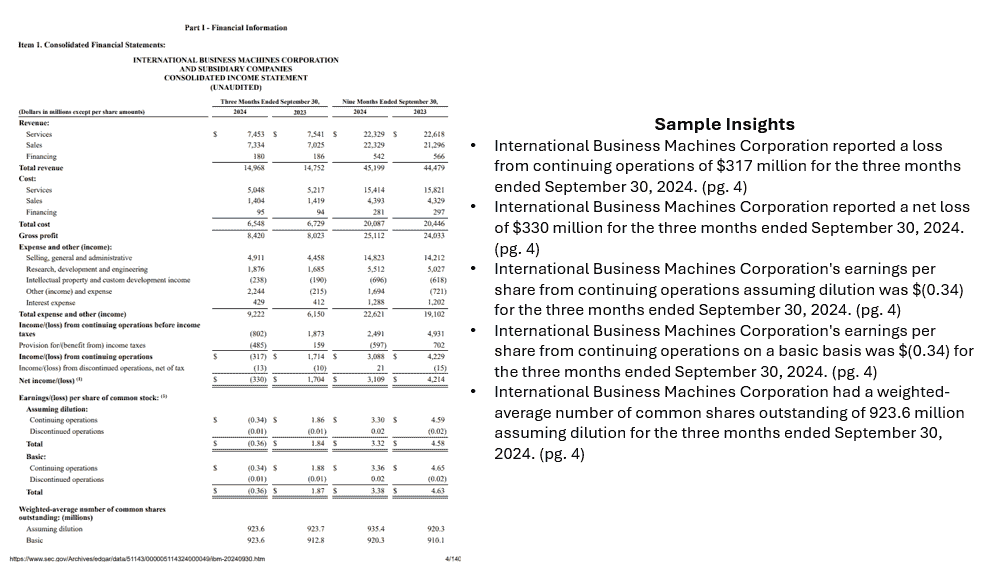
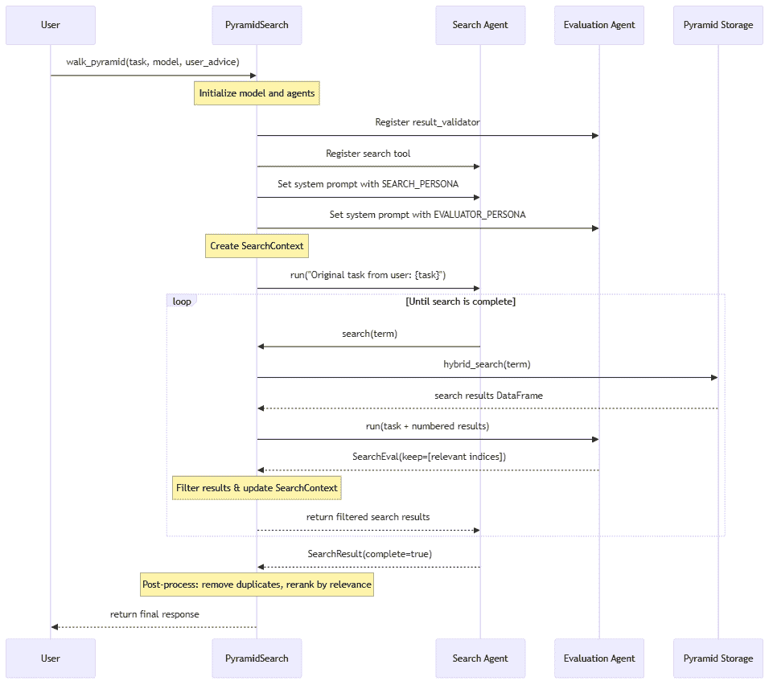
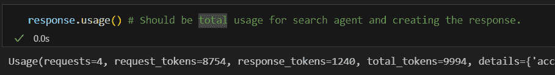
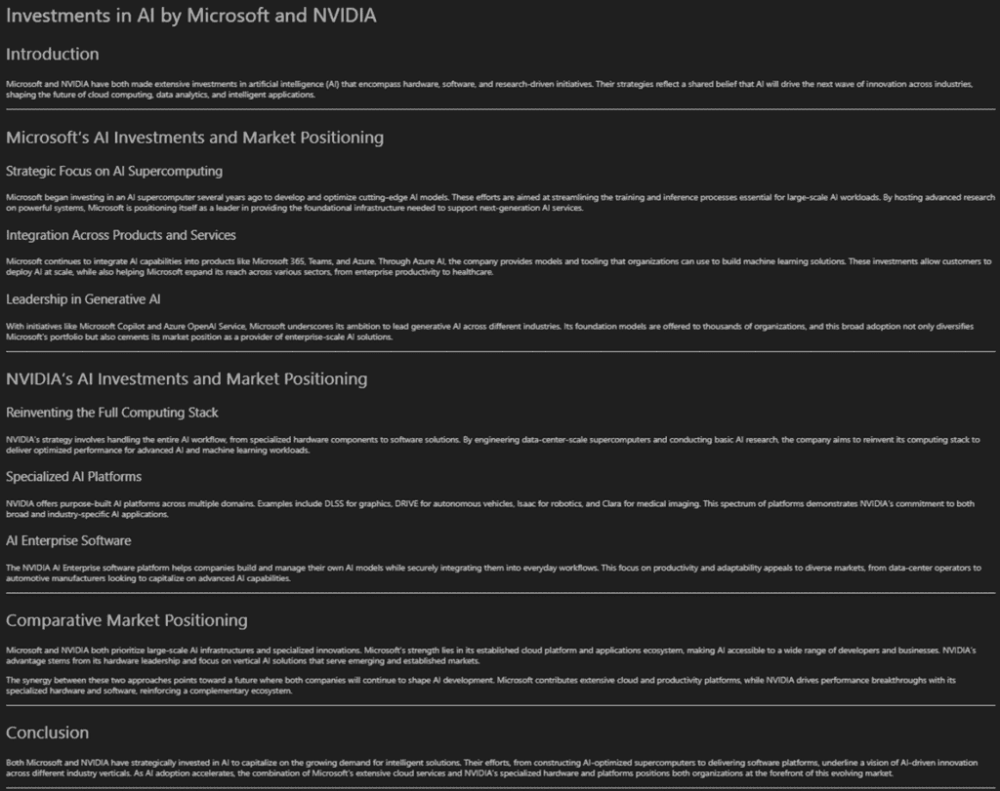
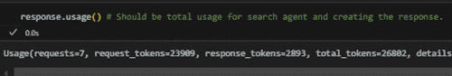
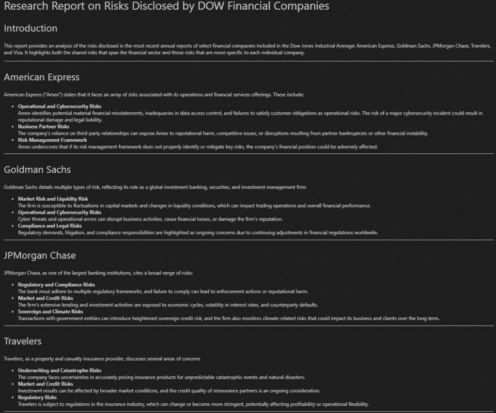
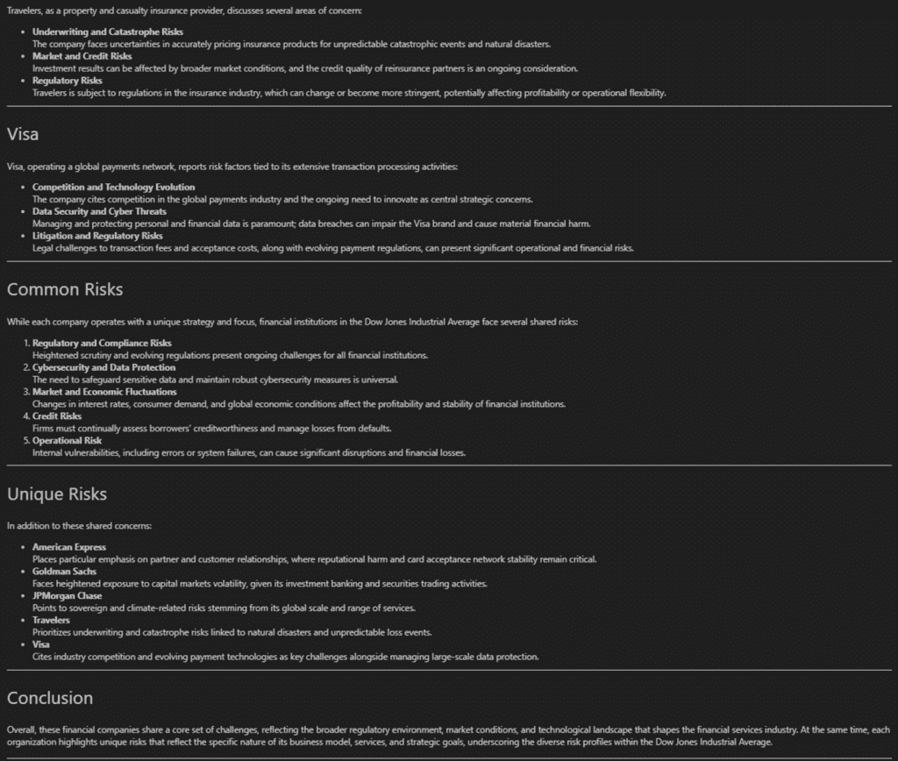
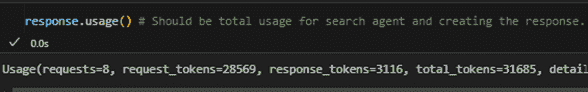

# 使用代理知识蒸馏克服失败的文档摄入与 RAG 策略

> 原文：[`towardsdatascience.com/overcome-failing-document-ingestion-rag-strategies-with-agentic-knowledge-distillation/`](https://towardsdatascience.com/overcome-failing-document-ingestion-rag-strategies-with-agentic-knowledge-distillation/)

## 引言

许多生成式 AI 用例仍然围绕检索增强生成（RAG）展开，但往往无法达到用户期望。尽管关于 RAG 改进的研究越来越多，甚至将代理加入其中，但许多解决方案仍然无法返回详尽的结果，遗漏了在文档中虽不常提及但至关重要的信息，需要多次搜索迭代，并且通常难以在多份文档中调和关键主题。更糟糕的是，许多实现仍然依赖于尽可能多地将“相关”信息塞入模型的上下文窗口，同时提供详细的系统和用户提示。整合所有这些信息往往超出了模型的认识能力，并损害了响应的质量和一致性。

正是在这里，我们的代理知识蒸馏 + 基于金字塔的搜索方法发挥了作用。我们团队，包括[Jim Brown](https://www.linkedin.com/in/jim-brown-71427356/)、[Mason Sawtell](https://www.linkedin.com/in/mason-sawtell/)、[Sandi Besen](https://www.linkedin.com/in/sandibesen/)和[我](https://www.linkedin.com/in/tula-masterman/)，采取了一种代理方法来处理文档摄入。

*我们利用模型在摄入时的全部能力，专注于从文档数据集中提炼和保留最有意义的信息。这从根本上简化了 RAG 过程，允许模型将推理能力集中于应对用户/系统指令，而不是挣扎于理解文档块之间的格式和不同信息。*

**我们特别针对那些通常难以评估的高价值问题，因为它们可能有多个正确答案或解决方案路径。** 这些是传统 RAG 解决方案最难以应对的情况，现有的 RAG 评估数据集在很大程度上不足以测试这个问题空间。在我们的研究实现中，我们下载了过去一年道琼斯工业平均指数中 30 家公司的年度和季度报告。这些文件可以通过[SEC EDGAR 网站](https://www.sec.gov/edgar/search/)找到。[EDGAR 上的信息是可访问的，并且可以免费下载](https://www.sec.gov/search-filings/edgar-search-assistance/accessing-edgar-data)或可以通过[EDGAR 公共搜索](https://www.sec.gov/edgar/search/)进行查询。有关 SEC 隐私政策的详细信息，请参阅[SEC 隐私政策](https://www.sec.gov/about/privacy-information)。我们选择这个数据集有两个主要原因：首先，它超出了评估的模型的知识截止点，确保模型不能基于其预训练的知识回答问题；其次，它是对现实世界商业问题的近似，同时允许我们使用公开数据讨论和分享我们的发现。

虽然典型的 RAG 解决方案在事实检索方面表现出色，例如在文档数据集中容易识别答案（例如，“苹果公司的年度股东大会何时举行？”），但它们在需要深入理解跨文档概念细微差别的问题上却显得力不从心（例如，“道琼斯工业平均指数中哪家公司的 AI 战略最有前景？”）。我们的代理知识蒸馏 + 金字塔搜索方法在解决这类问题上比我们测试的其他标准方法取得了更大的成功，并克服了在 RAG 系统中使用知识图相关的局限性。

在本文中，我们将介绍我们的知识蒸馏过程是如何工作的，这种方法的要点好处，示例，以及关于如何评估这类系统的开放讨论，在这些情况下，往往没有单一的“正确”答案。

## 建造金字塔：代理知识蒸馏是如何工作的

作者和团队绘制的描绘文档摄取金字塔结构的图像。机器人代表构建金字塔的代理。

### 概述

我们的知识提炼过程从原始源文档中创建了一个多级信息金字塔。我们的方法受到深度学习计算机视觉任务中使用的金字塔的启发，这些金字塔允许模型在多个尺度上分析图像。我们将原始文档的内容转换为 Markdown，并将其提炼成一系列原子洞察、相关概念、文档摘要和一般回忆/记忆。在检索过程中，可以访问金字塔的任何或所有级别来响应用户请求。

### 如何提炼文档并构建金字塔：

1.  **将文档转换为 Markdown**：将所有原始源文档转换为 Markdown。我们发现，与其他格式如 JSON 相比，模型处理 Markdown 最有效，而且它更高效。我们使用 Azure Document Intelligence 为文档的每一页生成 Markdown，但还有许多其他开源库，如[MarkItDown](https://github.com/microsoft/markitdown)，也能完成同样的工作。我们的数据集包括**331**份文档和**16,601**页。

1.  **从每一页提取原子洞察**：我们使用两页滑动窗口处理文档，这使得每一页都能被分析两次。这给代理提供了机会，在最初处理页面时纠正任何潜在的错误。我们指导模型创建一个随着处理文档页面而增长的编号洞察列表。如果代理在前一页看到的洞察是错误的，它可以覆盖它们，因为它看到了每一页两次。我们指导模型以主语-谓语-宾语（SVO）格式提取洞察，并像用户将英语作为第二语言一样撰写句子。这通过鼓励清晰和精确性显著提高了性能。多次滚动每一页并使用 SVO 格式还解决了歧义问题，这对于知识图谱来说是一个巨大的挑战。洞察生成步骤对于从表格中提取信息也非常有帮助，因为模型以清晰、简洁的句子捕捉表格中的事实。我们的数据集产生了**216,931**个**总洞察，平均每页约 13 个洞察，每份文档约 655 个洞察**。

1.  **从洞察中提炼概念**：从详细的洞察列表中，我们识别出将文档中相关信息的更高层次概念。这一步骤显著减少了文档中的噪声和冗余信息，同时保留了关键信息和主题。我们的数据集产生了**14,824**个**总概念，平均每页约 1 个概念，每份文档约 45 个概念**。

1.  **从概念创建摘要**：给定文档中的洞察力和概念，LLM 编写了一个摘要，这个摘要不仅比任何人类编写的摘要都要好，而且比原始文档中的任何摘要都要信息密集。LLM 生成的摘要提供了关于文档的极其全面的知识，以小的标记密度承载了大量的信息。我们为每份文档生成**一个摘要，总共 331 个**。

1.  **跨文档存储回忆/记忆**：在金字塔的顶部，我们存储对所有任务都有用的关键信息。这可能包括用户关于任务的分享信息，或者代理通过研究和响应任务随时间学习的数据集信息。例如，我们可以将当前 30 家道琼斯工业平均指数（DOW）的公司作为回忆存储，因为这个列表与模型知识截止时的 30 家公司不同。随着我们进行越来越多的研究任务，我们可以不断改进我们的回忆，并维护这些回忆来源的审计轨迹。例如，我们可以跟踪公司的 AI 策略，公司在哪里进行重大投资等。这些高级连接非常重要，因为它们揭示了在单页或文档中不明显的关系和信息。

从 IBM 10Q，2024 年第三季度（第 4 页）提取的洞察力样本

我们在 Azure PostgreSQL 中存储金字塔每一层的文本和嵌入（页面及以上）。最初我们使用 Azure AI Search，但由于成本原因转向了 PostgreSQL。这要求我们编写自己的混合搜索功能，因为 PostgreSQL 尚未原生支持此功能。这种实现方式可以与您选择的任何向量数据库或向量索引一起工作。关键要求是在金字塔的任何级别存储和高效检索文本和向量嵌入。

这种方法本质上创建了一个知识图谱的精髓，但以自然语言存储信息，这是 LLM 原生想要与之交互的方式，并且在标记检索上更高效。我们还让 LLM 选择用于分类金字塔每一层的术语，这似乎让模型自己决定如何描述和区分存储在每个级别的信息。例如，LLM 更喜欢将“洞察力”作为提炼知识第一层的标签，而不是“事实”。我们这样做是为了更好地理解 LLM 是如何思考这个过程的，让它自己决定如何存储和分组相关信息。

## 使用金字塔：如何与 RAG 和代理一起工作

在推理时间，传统的 RAG 和代理方法都从我们在知识金字塔中摄取的预处理、提炼信息中受益。金字塔结构允许在传统 RAG 案例中高效检索，其中仅检索 X 个相关条目，或者在代理案例中，代理在返回最终响应之前迭代地计划、检索和评估信息。

金字塔方法的优点是**金字塔任何层级的信息都可以在推理期间使用**。在我们的实现中，我们使用 PydanticAI 创建了一个搜索代理，该代理接收用户请求，生成搜索词，探索与请求相关的想法，并跟踪与请求相关的信息。一旦搜索代理确定有足够的信息来处理用户请求，结果就会被重新排序并返回给 LLM 生成最终回复。我们的实现允许搜索代理在收集关于概念/搜索词的详细信息时遍历金字塔中的信息。这与在知识图上行走类似，但以对 LLM 来说更自然的方式，因为金字塔中的所有信息都存储在自然语言中。

根据用例，代理可以访问金字塔的所有层级信息，或者仅访问特定层级（例如，仅从概念中检索信息）。在我们的实验中，我们没有检索原始页面级数据，因为我们想专注于 token 效率，并发现 LLM 生成的见解、概念、摘要和回忆信息足以完成我们的任务。从理论上讲，代理也可以访问页面数据；这将提供额外的机会让代理重新检查原始文档文本；然而，这也会显著增加总 token 的使用量。

这里是我们对用户请求进行代理响应方法的高级可视化：

由作者及其团队创建的代理研究 & 响应过程概述图像

## 金字塔结果：现实世界示例

为了评估我们方法的有效性，我们将其与各种问题类别进行了测试，包括典型的信息查找问题和复杂的跨文档研究和分析任务。

### 事实查找（矛鱼捕鱼）：

这些任务需要识别文档中隐藏的特定信息或事实。这些是典型 RAG 解决方案针对的问题类型，但通常需要多次搜索并消耗大量 token 才能正确回答。

***示例任务***: “在最新的财务报告中，IBM 的总收入是多少？”

***使用金字塔方法示例回复***: “2024 年第三季度，IBM 的总收入为 1496.8 亿美元[ibm-10q-q3-2024.pdf, 第 4 页]”

总用于研究和生成响应的令牌

这个结果是正确的（经过人工验证）并且仅使用了 9,994 个总令牌，其中生成最终响应使用了 1,240 个令牌。

### 复杂研究和分析：

这些任务涉及研究和理解多个概念，以获得对文档的更广泛理解，并根据收集的事实进行推理和有根据的假设。

***示例任务***： “分析微软和英伟达在 AI 方面的投资以及他们在市场中的定位。报告应格式清晰。”

***示例响应：***

代理生成的分析微软和英伟达的 AI 投资和定位的响应。

结果是一份执行迅速且包含每家公司详细信息的综合报告。总共使用了 26,802 个令牌来研究和响应请求，其中相当一部分用于最终响应（2,893 个令牌或约 11%）。这些结果也经过人工审核以验证其有效性。

指示任务总令牌使用的片段

***示例任务：*** “创建一份关于分析道琼斯指数中各金融公司披露的风险的报告。指出哪些风险是共有的，哪些是独特的。”

***示例响应***:

代理生成的关于披露风险的响应第一部分。

代理生成的关于披露风险的响应第二部分。

同样，这项任务在 42.7 秒内完成，使用了 31,685 个总令牌，其中 3,116 个令牌用于生成最终报告。

指示任务总令牌使用的片段

这些关于事实查找和复杂分析任务的结果表明，**金字塔方法有效地使用最少的令牌以低延迟创建详细的报告。用于任务的令牌承载着密集的意义，噪音很少，使得在各个任务中都能提供高质量、全面的响应。**

## 金字塔的好处：为什么使用它？

总体而言，我们发现我们的金字塔方法在回答高质量问题和整体性能方面提供了显著的提升。

#### **我们观察到的关键好处包括：**

+   **降低模型认知负荷**：当代理收到用户任务时，它检索的是预处理的、提炼的信息，而不是原始的、格式不一致、内容分散的文档片段。这从根本上改善了检索过程，因为模型不需要在第一次尝试时浪费其认知能力来分解页面/片段文本。

+   **优化的表格处理**：通过分解表格信息并将其存储在简洁但描述性的句子中，金字塔方法使得通过自然语言查询在推理时检索相关信息变得更加容易。这对于我们的数据集尤为重要，因为财务报告中的表格包含大量关键信息。

+   **对多种请求的响应质量提升**：金字塔使系统能够对精确的事实查找问题和涉及众多文档和主题的广泛分析任务提供更全面的上下文感知响应。

+   **关键上下文的保留**：由于提炼过程识别并跟踪关键事实，那些可能只在文档中出现一次的重要信息更容易保持。例如，指出所有表格都是以百万美元或特定货币表示的。传统的分块方法往往导致此类信息丢失。

+   **优化的标记使用、内存和速度**：通过在摄入时提炼信息，我们显著减少了推理过程中所需的标记数量，能够最大化上下文窗口中信息的价值，并提高内存使用。

+   **可扩展性**：许多解决方案在文档数据集规模扩大时难以表现良好。这种方法通过仅保留关键信息，提供了一种更有效的方式来管理大量文本。这也允许更有效地使用 LLMs 的上下文窗口，因为它只发送有用、清晰的信息。

+   **高效的概念探索**：金字塔使代理能够探索类似导航知识图谱的相关信息，但不需要在图中生成或维护关系。代理可以使用自然语言 exclusively，并以高度标记效率和流畅的方式跟踪其探索的概念相关的重要事实。

+   **数据集理解的自发形成**：在测试过程中，这种方法出现了一个意外的好处。当询问诸如“你能告诉我关于这个数据集的什么信息？”或“我能问哪些类型的问题？”等问题时，系统能够响应并建议富有成效的搜索主题，因为它通过访问金字塔的更高层次（如摘要和回忆）获得了对数据集上下文的更稳健的理解。

## 超越金字塔：评估挑战与未来方向

### 挑战

当使用金字塔搜索方法时，我们观察到的结果令人惊叹，但找到方法来建立有意义的指标以评估整个系统在摄入时间和信息检索期间都是一项挑战。传统的 RAG 和代理评估框架往往无法解决许多不同响应都有效的细微问题和分析性响应。

我们团队计划在未来撰写一篇关于这种方法的学术论文，并且我们欢迎来自社区的任何想法和反馈，尤其是在评估指标方面。我们发现的许多现有数据集都集中在评估单个文档内的 RAG 用例或跨多个文档的精确信息检索，而不是跨文档和领域的鲁棒概念和主题分析。

我们感兴趣的主要用例与更广泛的问题相关，这些问题代表了企业实际如何与 GenAI 系统互动。例如，“告诉我关于客户 X 需要知道的一切”或“客户 A 和 B 的行为有何不同？我更有可能和哪位客户成功会面？”。这类问题需要深入理解来自多个来源的信息。这些问题的答案通常需要一个人从商业的多个领域综合数据，并对其进行批判性思考。因此，这些问题的答案很少被书写或保存下来，这使得通过典型的 RAG 过程简单地存储和检索它们变得不可能。

另一个考虑因素是，许多现实世界的用例涉及动态数据集，其中文档持续被添加、编辑和删除。这使得评估和跟踪“正确”的响应变得困难，因为答案会随着可用信息的改变而演变。

### 未来方向

未来，我们相信金字塔方法可以通过更有效地处理密集文档并将学习信息作为回忆存储来解决这些挑战。然而，随着时间的推移跟踪和评估回忆的有效性对于系统的整体成功至关重要，并且仍然是我们持续工作的关键重点领域。

当将这种方法应用于组织数据时，金字塔过程也可以用来识别和评估业务各个领域的差异。例如，上传一家公司所有的销售提案可以揭示某些产品或服务定位的不一致性。它还可以用来比较从各种业务线数据中提取的见解，以帮助了解团队是否在主题或优先级上存在冲突的理解。这种应用超越了纯粹的信息检索用例，并使金字塔成为组织对齐工具，有助于识别信息、术语和整体沟通中的分歧。

## 结论：关键要点以及金字塔方法为何重要

知识蒸馏金字塔方法的重要性在于它**在摄入和检索时间都充分利用了 LLM 的全部能力**。我们的方法允许你**在更少的标记中存储密集信息**，这还有额外的优势，即在推理时**减少数据集的噪声**。我们的方法运行非常快速，并且极其标记高效，我们能够在几秒钟内生成响应，探索可能的上百个搜索，并且**平均使用<40K 个标记来完成整个搜索、检索和响应生成过程**（这包括所有的搜索迭代！）。

我们发现，LLM 在将原子洞察写成句子方面**做得更好**，并且这些洞察**有效地从基于文本和表格数据中提炼信息**。这种用自然语言编写的提炼信息，在推理时对 LLM 来说非常容易理解和导航，因为它**不需要消耗不必要的能量来推理和分解文档格式，或过滤噪声**。

能够**在任何金字塔层级检索和汇总信息**也提供了**解决各种查询类型的重要灵活性**。这种方法对于大型数据集提供了有前景的性能，并使需要细微信息检索和分析的高价值用例成为可能。

* * *

*注意：本文中表达的观点完全是我的个人观点，并不一定反映我雇主的观点或政策。*

*有兴趣进一步讨论或合作吗？请在* [*LinkedIn*](https://www.linkedin.com/in/tula-masterman/)**上联系我！*
