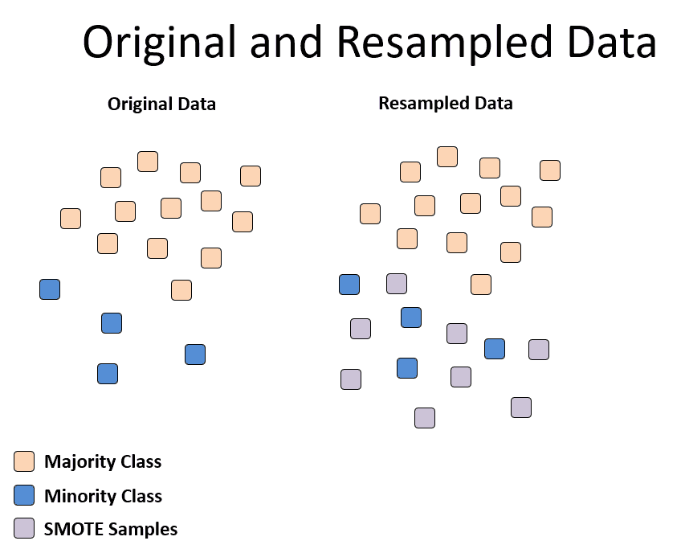
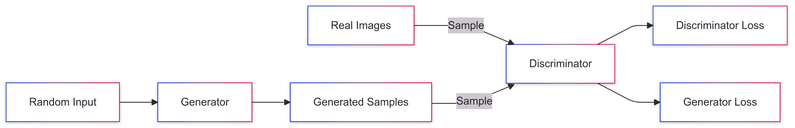
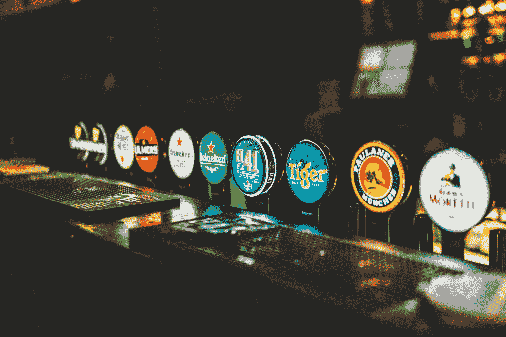
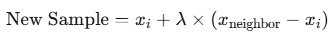

# GANs 和 SMOTE 的数据增强基础

> 原文：[`towardsdatascience.com/overcoming-data-scarcity-imbalance-gans-smote-explained-through-bartending-6a868259b4d9/`](https://towardsdatascience.com/overcoming-data-scarcity-imbalance-gans-smote-explained-through-bartending-6a868259b4d9/)



SMOTE 技术机制

> 如果你不是 Medium 的付费会员，我可以免费提供我的故事：[朋友链接](https://medium.com/@sahn1998/overcoming-data-scarcity-imbalance-gans-smote-explained-through-bartending-6a868259b4d9?sk=310b68e2bdc3beefca4bd0ef46b95136)

**个人而言，我感觉数据就像是数字时代的新石油**。这一点在机器学习的繁荣中尤其明显，数据在其中扮演着如此重要的角色。

然而，根据我的经验，许多人似乎在没有首先掌握基础数学的情况下就直接投身于机器学习。这就是为什么我在文章中特别强调数学概念。然而，正如许多读者所指出的，在学习机器学习的同时学习数学可能更加有效。在实用的机器学习场景中应用数学原理不仅加深了对数学的理解，而且使学习过程更加有趣和有效。

介绍机器学习还有什么比谈论数据——大量的数据——更好的方式呢？（或者正如你将看到的，缺乏数据。）

我曾是一名专注于健康风险预测建模的研究团队的一员。虽然我会跳过我们工作的详细内容，但我们遇到的一个主要挑战——这在许多机器学习项目中都很常见——是处理**数据稀缺和不平衡**

> 我们如何具体处理数据稀缺和数据不平衡的问题？

这正是我将通过解释两种机器学习技术来回答的问题：**生成对抗网络（GANs）**和**合成少数类过采样技术（SMOTE）**。

*“这是一个对刚开始学习机器学习的初学者来说非常基础的话题。”然而，无论你是数据科学的新手还是想刷新对基础技术的理解，我希望这篇文章对你有所帮助！

> *“如果你只对 GANs 和 SMOTE 感兴趣，请跳到第二部分！”*

* * *

## 目录

1.  理解数据稀缺与不平衡

1.  介绍生成对抗网络（GANs）

1.  介绍合成少数类过采样技术（SMOTE）

1.  摘要

* * *


图片由 [Piron Guillaume](https://unsplash.com/@gpiron?utm_content=creditCopyText&utm_medium=referral&utm_source=unsplash) 在 [Unsplash](https://unsplash.com/photos/medical-professionals-working-U4FyCp3-KzY?utm_content=creditCopyText&utm_medium=referral&utm_source=unsplash) 提供

## 理解数据稀缺与不平衡

机器学习，尤其是深度学习，依赖于拥有大量数据集来工作。没有足够的数据，这些模型难以有效地学习模式——尤其是那些罕见的关键模式（我稍后会详细介绍）。

但现实是：收集我们需要的庞大数据集通常**极其**具有挑战性，尤其是在处理缺乏历史数据的较新系统或组件时。

现在，你们中的一些人可能正在想……

> 为什么数据稀缺和不平衡很重要？

很简单——这些挑战对模型预测和预防关键事件的能力有重大影响。在深入探讨（本文的重点）我们可以用来解决这些问题的技术之前，我会用几个例子来说明为什么解决这些问题如此重要！

### **医疗保健示例：淋巴癌**

在医疗保健领域，收集足够的数据本身就很困难，而且可用的数据通常是不平衡的。

> 你能猜到为什么吗？

**例如，考虑淋巴癌。**由于以下几个原因，此类罕见疾病的资料收集有限：

+   **隐私问题：**对敏感患者信息的访问受到限制，限制了数据集的范围。

+   **疾病罕见性：**与更常见的疾病相比，罕见疾病自然产生的数据点较少。

因此，数据集往往以健康病例为主，导致数据不平衡。当数据集不平衡——一个类别主导另一个类别时——模型往往会偏向多数类别。这意味着在这样数据上训练的诊断模型可能会不成比例地预测“健康”，导致漏诊。你可以想象，在医疗保健环境中，这可能会产生严重的后果。

### **工业示例：核电站**

工业部门面临着类似的问题。以核电站为例，设备故障数据对于预测性维护至关重要。这些故障很少见（谢天谢地！）但正是这种罕见性使得积累用于训练模型的大量数据集变得困难。

理解可能表明设备故障的规律对于避免昂贵的停机时间至关重要。然而，由于故障数据的稀缺，收集足够的信息来训练有效的模型需要花费大量时间，有时甚至根本不可能。

例如，Ali Hakami 在《自然》杂志上发表的一项研究分析了生产厂数据，与 Kaggle 数据集**显示健康到故障观察比率为 28,552:1**。这种惊人的不平衡实际上显示了在现实世界的应用中，由于故障数据如此有限，开发可靠的预测模型是多么困难。

### **我们如何应对这些挑战？**

等待更多数据并不总是可行的，这既昂贵又耗时。有道理吧？我们不想等上几年去收集数据，而我们需要的是立即的解决方案。然而，简单地复制现有数据也不会有帮助，因为它不引入新的信息，可能会导致过拟合。

> 相反，如果我们生成*合成数据或称为“数据增强”*会怎样呢。

你可能听说过“数据增强”，对吧？数据增强就是简单地使用现有数据创建新的、人工数据点。通过根据现有数据中的模式创建人工数据点，我们可以解决由稀缺和不平衡造成的差距。

### 进入 GANs 和 SMOTE

生成对抗网络（GANs）和合成少数类过采样技术（SMOTE）是两种数据增强技术，有助于克服这些挑战。它们能够创建新的、真实的数据点，减少对昂贵的数据收集的依赖，并提高模型性能。

+   **GANs**：通过学习原始数据集的分布并创建新的、真实示例来生成合成数据。

+   **SMOTE**：专注于通过生成连接少数类样本的线段上的合成示例来进行过采样。

那么，让我们更深入地了解这些技术！

* * *



生成对抗网络流程图

## 介绍生成对抗网络（GANs）

“生成合成数据”正是**生成对抗网络（GANs）**发挥作用的地方。GANs 因其能够通过生成**与真实数据集非常相似的合成数据**来解决数据稀缺问题而在各个行业引起了广泛关注。

在高层次上，**生成对抗网络（GANs）**是一个机器学习框架，旨在创建与给定数据集非常相似的新合成数据。这种能力在现实世界数据有限、不平衡或难以获取的情况下非常有价值。

GANs 由两个核心组件组成：

1.  **生成器**

1.  **判别器**

这些组件中的每一个都有非常具体的作用。

### 1. 生成器

生成器的角色是产生合成数据。它以随机噪声（一组随机值）作为输入，并生成类似于真实数据的样本。

初始时，生成器产生的是无意义的、随机的输出。然而，通过迭代训练，它改进了其创建合成数据的能力，使其越来越难以与真实世界数据区分开来。

### 2. 判别器

判别器充当一个简单的二进制（0，1）分类器。它被训练来区分训练集中的真实数据和生成器产生的伪造数据。

它的任务是将输入数据正确分类为“真实”或“伪造”。随着训练的进行，判别器在分类任务上变得越来越熟练，提高了其区分两种类型数据的能力。

> 这就是我可能想要给你们举一个例子的时候。



由[George Bakos](https://unsplash.com/@georgebakos?utm_content=creditCopyText&utm_medium=referral&utm_source=unsplash)在[Unsplash](https://unsplash.com/photos/blue-and-white-round-container-83HwuZirc-c?utm_content=creditCopyText&utm_medium=referral&utm_source=unsplash)上的照片

## **A Bar-Themed Explanation of GANs**

我不知道你们，但我喜欢时不时地和朋友们一起去酒吧喝酒。你喜欢在酒吧喝酒吗？如果你不喜欢……那可真不幸，因为我将使用这个设定来类比理解生成对抗网络（GAN）。

**想象一个刚开始学习技巧的新手调酒师**。起初，他们的饮品混合得不好，味道远非你所期望（随机输出）。然而，在经验丰富的调酒师的指导和反馈下，他们逐渐提高了自己的技能。随着时间的推移，他们掌握了技艺，开始制作出与经验丰富的调酒师制作的饮品难以区分的饮品。

> **在这个场景中，新手调酒师就像 GAN 中的生成器。**

他们的任务是创造出可以以假乱真的东西。

但作为一个顾客，你肯定不想为新手调酒师提供的劣质饮品付钱，对吧？你更希望你的钱能用来购买高质量的鸡尾酒。那么，你如何判断调酒师是新手还是专家呢？

> 那就是判别器发挥作用的地方。

把判别器想象成酒吧的忠实顾客——就是你！你的任务是品尝饮品并决定它们是制作精良（真实）还是拙劣的尝试（伪造）。

生成器（新手调酒师）和判别器（你，忠实的顾客）不断相互挑战。随着生成器在制作逼真饮品方面变得更好，判别器必须更加努力地分辨差异。这种嬉戏的来回是 GAN 之所以如此有效的原因。

* * *

### 生成器和判别器的爱恨关系

如同例子中提到的，GAN 的 brilliance 在于它们的对抗性训练过程，这在一对生成器和判别器之间建立了一个动态的“游戏”。

**把它想象成一种嬉戏的竞争：** 生成器就像一个新手调酒师，试图将他的作品当作精心调制的饮品来推销，而判别器则是一位经验丰富的鸡尾酒鉴赏家，决心找出任何瑕疵并揭露冒牌货。

+   **生成器的目标是**产生足够令人信服的合成数据，以欺骗判别器。

+   **判别器的任务是**精确地区分真实数据和伪造数据。

**随着这个游戏的展开**，生成器不断改进其创建真实数据的能力，而判别器在识别真实与虚假方面变得越来越熟练。这个迭代过程一直持续到生成的合成数据几乎无法与真实数据区分开来，在两个对手之间达到了微妙的平衡！

## GANs 在行动

在预测性维护（如发电厂）中，GANs 可以为设备生成合成故障数据，使模型能够在真实故障数据稀缺的情况下学习故障模式。同样，在医疗保健领域，GANs 可以创建模拟罕见病例的合成患者数据，有助于解决数据集不平衡问题。

非常酷，对吧？当我回顾这个概念（在准备这篇文章时），它让我想起了我第一次学习这些技术概念时的有趣之处。

但关于 GANs 的话题就到这里吧。

> 关于其他可能的技术或框架呢？

* * *


SMOTE 技术机制

## 介绍合成少数过度采样技术（SMOTE）

与生成对抗网络（GANs）一样，**SMOTE（合成少数过度采样技术）**也是一种流行的方法，用于通过生成新的合成样本来解决数据集不平衡的问题。

SMOTE 通过一种称为**插值**的过程为少数类创建新的数据点（尽管这个术语可能让很多人感到害怕，但它对你们中的许多人来说可能很熟悉）。插值简单地说就是比较彼此接近的数据点，并根据它们的特征生成新的数据。

好吧，这句话实际上可能定义了 SMOTE 的功能。但我知道这个定义并不令人满意，所以我会给出一个具体的例子，然后是技术解释。


Photo by [Ivan Cortez](https://unsplash.com/@ivancortez14?utm_content=creditCopyText&utm_medium=referral&utm_source=unsplash) on [Unsplash](https://unsplash.com/photos/bartender-mixing-tequila-on-table-2FDstXKqaxI?utm_content=creditCopyText&utm_medium=referral&utm_source=unsplash)

## SMOTE 是如何工作的（以调酒师为例）

**想象你是一名调酒师。** 你注意到顾客几乎都点了一种饮料，比如“健康朗姆酒配一些羽衣甘蓝”（多么不寻常的选择），而只有少数人点了一种稀有特色饮料（我们可以称之为“淋巴癌鸡尾酒”）。你想要创建更多稀有饮料的变体来推广它并平衡菜单。

> 这是你要做的

1.  **选择少数样本**：从一种稀有饮料的配方开始。

1.  **寻找最近邻**：查看类似特色饮料的成分。

1.  **生成合成变体**：混合和匹配配方及其邻居的成分比例，以创建稀有饮料的新独特变体。

1.  **重复**：继续创建变体，直到菜单中既有常见选项也有稀有选项。

**稀有选项现在不再那么稀有了！** 这正是 SMOTE 想要实现的效果。

## SMOTE 是如何工作的（技术层面）

就像你在调酒师例子中看到的，很容易看出 SMOTE 是如何工作的。它被分为四个快速直观的步骤。

### **1. 选择少数类样本**

这相当简单。首先从少数类中随机选择一个数据点。

### 2. **寻找最近邻**

实质上，你想要查看整个数据并识别所选样本的 k 个最近邻（我们称之为特征空间）。通常，k 设置为 5，但可以根据你的数据集和模型需求进行调整！

### **3. 生成合成样本**

随机选择 k 个最近邻中的一个。使用插值，创建一个位于所选样本及其邻居之间的新合成样本。



新样本的方程

你可以将 xᵢ视为原始少数样本，λ为介于 0 和 1 之间的随机数。

### 4. 重复

继续这个过程，直到数据集在多数类和少数类之间达到所需的平衡。

* * *

## 为什么 SMOTE 有效？

如果你坚持到这里，你可能已经理解了为什么 SMOTE 如此有效！简单来说，它生成**新的、有意义的**数据点，而不是简单地复制现有的数据点。

由于数据重复可能导致模型记住模式而不是学习它们，SMOTE 降低了这种风险。通过解决数据不平衡，SMOTE 使模型能够专注于少数类模式，提高它们预测罕见案例的能力。

### 示例：医疗保健

考虑一个关于淋巴癌的数据集，其中健康患者的数据远多于患病患者的数据。使用 SMOTE，我们可以创建合成患者档案，这些档案与淋巴癌的真实世界案例非常相似。这些合成案例填补了数据集中的空白，使模型能够学习与疾病相关的微妙模式，并提高它们对罕见状况的预测准确性。

例如，SMOTE 可能在两个相似的癌症案例之间进行插值：

+   患者 A：年龄 60 岁，肿瘤大小 3.2 厘米

+   患者 B：年龄 62 岁，肿瘤大小 3.5 厘米

SMOTE 可以创建一个新的合成患者：

+   患者 C：年龄 61 岁，肿瘤大小 3.35 厘米

### 示例：核电站

在预测性维护中，核电站的故障很幸运地很少发生。然而，这种罕见性使得在故障模式上训练模型变得困难。SMOTE 通过根据现有故障记录及其最近邻生成合成故障数据来解决这一问题。

例如，如果我们有两个故障事件：

+   事件 A：温度峰值 500°C，振动水平 8.0

+   事件 B：温度峰值 520°C，振动水平 8.5

SMOTE 可能会创建一个合成的失败案例：

+   事件 C：温度峰值 510°C，振动水平 8.25

### SMOTE 的局限性

然而，尽管 SMOTE 非常有用，但它并非没有挑战。我会简要说明这一点，让你知道所有框架和技术都有其独特的局限性。对于 SMOTE 来说，这一点非常明显。

1.  **计算量大**：对于大型数据集，找到 k 个最近邻可能变得耗时，从而减慢了过程。

1.  **类别边界问题**：SMOTE 在生成合成样本时没有考虑类别之间的边界。这有时会导致重叠或不相关的区域出现样本，从而降低模型的有效性。

* * *

对于那些对简单的 Python 实现感兴趣的人，看这里！

```py
from imblearn.over_sampling import SMOTE
from sklearn.model_selection import train_test_split
from sklearn.datasets import make_classification

# Create an imbalanced dataset
X, y = make_classification(n_classes=2, class_sep=2, weights=[0.9, 0.1], 
                           n_informative=3, n_redundant=1, flip_y=0, 
                           n_features=5, n_clusters_per_class=1, 
                           n_samples=1000, random_state=42)

# Apply SMOTE
smote = SMOTE(random_state=42)
X_resampled, y_resampled = smote.fit_resample(X, y)

# Print class distribution before and after SMOTE
from collections import Counter
print("Before SMOTE:", Counter(y))
print("After SMOTE:", Counter(y_resampled))
```

* * *

## 摘要

正如我在文章开头提到的，这是为了给你一个介绍，让你更好地理解如何解决数据稀缺和不平衡问题。

虽然并不完美，但理解何时以及如何有效地使用 GANs 或 SMOTE 可以在构建泛化良好且表现可靠的模型方面产生巨大差异。

所以，这就是你需要的！这是学习如何处理数据的一步。

* * *

## 和我联系！

+   **[领英](https://www.linkedin.com/in/sahn1998/)**, **[网站](https://sunghyun-ahn.com/)**

+   **邮箱**

如果你已经读到这儿，我假设你是一位热衷于 Medium 的读者。如果你是一位数据科学家，或者在这个领域工作，或者想要学习，我很乐意和你聊聊！请随时联系！

> *对于那些对我的图片感到好奇的人：除非另有说明，所有图片均为作者（我自己）所有。*
> 
> [**Sunghyun Ahn – Medium**](https://medium.com/@sahn1998)
