# 成对交叉方差分类

> 原文：[`towardsdatascience.com/pairwise-cross-variance-classification/`](https://towardsdatascience.com/pairwise-cross-variance-classification/)

## 简介

这个项目是关于使用 CV/LLM 模型在不花费时间和金钱进行训练微调或在推理时重新运行模型的情况下，更好地实现图像和文本的零样本分类。它使用了一种新颖的降维技术对嵌入进行操作，并使用锦标赛风格的成对比较来确定类别。这导致在 13 个类别中的 50k 数据集上文本/图像一致率从 61%提升到了 89%。

[`github.com/doc1000/pairwise_classification`](https://github.com/doc1000/pairwise_classification)

## 你将如何使用它

实际应用在于大规模类别搜索，其中推理速度很重要，且模型成本支出是一个关注点。它也有助于发现你在注释过程中的错误——在大数据库中的误分类。

## 结果

比较文本和图像类别一致性的加权 F1 分数从 13 个类别中的约 50k 个项目的 61%提升到了 88%。视觉检查也验证了这些结果。

| F1_score (加权) | **基础模型** | **成对比较** |
| --- | --- | --- |
| **多类别** | 0.613 | 0.889 |
| **二进制** | 0.661 | 0.645 |

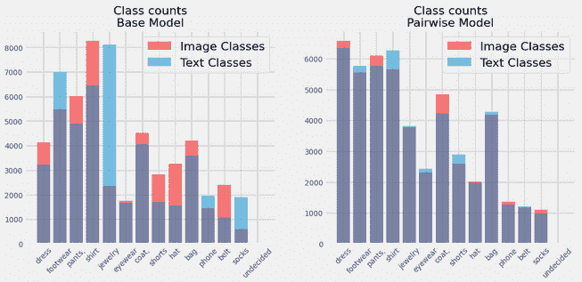

在多类别工作中，模型提高了类别计数凝聚力。

左：基础模型，完整嵌入，基于余弦相似度的 argmax 模型

右：使用交叉比评分的特征子段成对锦标赛模型

图片由作者提供

### 方法：通过平均尺度评分确定的嵌入子维度的余弦相似度成对比较

向量分类的一种直接方法是使用余弦相似度比较图像/文本嵌入与类别嵌入。这相对较快，且开销最小。你还可以在嵌入上运行分类模型（逻辑回归、树、svm），并针对类别进行目标分类，而无需进一步嵌入。

我的做法是在嵌入中减少特征大小，确定两个类别之间哪些特征分布有显著差异，从而以更少的噪声贡献信息。在评分特征时，我使用了一种包含两个分布的方差推导，我称之为交叉方差（下面将进一步说明）。我使用这个方法获取了“服装”类别（一对多）的重要维度，并使用子特征重新分类，这显示出模型功率的一些改进。然而，当成对比较类别时（一对一/头对头），子特征比较显示出更好的结果。对于图像和文本分别，我构建了一个成对比较的全局“锦标赛”风格的对阵，直到为每个项目确定最终的类别。这最终证明是相当高效的。然后，我评分了文本和图像分类之间的协议。

### <mdspan datatext="el1748890603347" class="mdspan-comment">零样本分类分配概述</mdspan>

使用交叉方差，对特定特征选择和成对锦标赛分配进行配对。

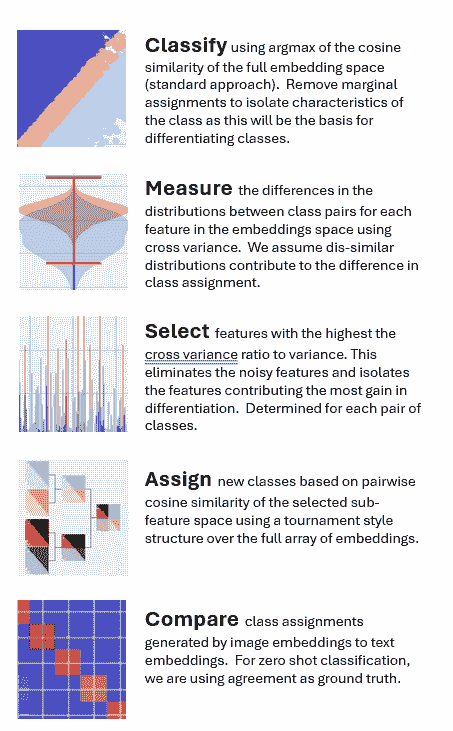

所有图片均为作者所有，除非标题中另有说明

## <mdspan datatext="el1748890701478" class="mdspan-comment">数据概述</mdspan>

我正在使用一个产品图像数据库，该数据库易于获取，并带有预计算的 CLIP 嵌入（感谢 [SQID（以下引用。此数据集在 MIT 许可证下发布](https://github.com/Crossing-Minds/shopping-queries-image-dataset/blob/main/README.md))，[AMZN](https://github.com/amazon-science/esci-data/tree/main/shopping_queries_dataset)（以下引用。此数据集在 Apache 许可证 2.0 下发布）），并针对服装图像进行目标定位，因为这是我第一次看到这种效果（感谢诺德斯特龙的数据科学团队）。数据集从 15 万个物品/图像/描述缩小到约 5 万件服装，使用零样本分类，然后基于目标子数组的增强分类。

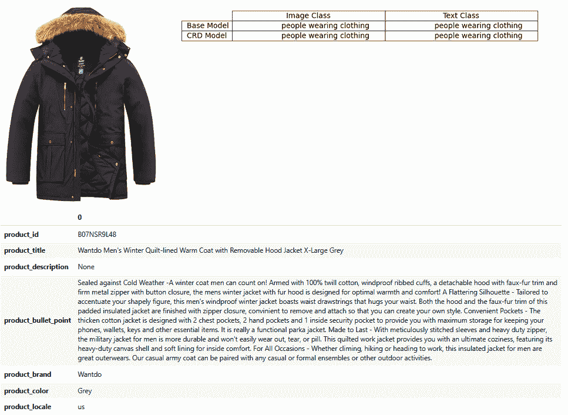

### 测试统计量：交叉方差

这是一个确定两个不同类别的分布在不同特征/维度上差异的方法。它是将每个分布的每个元素放入另一个分布时，综合平均方差的度量。它是方差/标准差数学的扩展，但发生在两个分布之间（可以有不同的尺寸）。我以前没有见过它的使用，尽管它可能以不同的名称列出。

交叉方差：

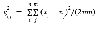

与方差类似，但是对两个分布求和，并对每个值取差，而不是对单分布取平均值。如果您输入相同的分布作为 A 和 B，则它会产生与方差相同的结果。

这简化为：

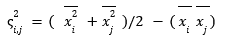

这相当于当分布 i 和 j 相等时，单分布的方差（平方的平均值减去平均值的平方）的另一种定义。使用这个版本比直接广播数组快得多，且更节省内存。我将在另一篇文档中提供证明并详细介绍。交叉偏差（ς）是未定义的平方根。

为了评分特征，我使用一个比率。分子是交叉方差。分母是 i 和 j 的乘积，与皮尔逊相关系数的分母相同。然后我取根（我也可以使用交叉方差，这将更直接地与协方差进行比较，但我发现使用交叉偏差的比率更紧凑且易于解释）。

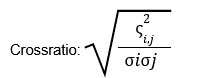

我认为这表示如果你为每个项目交换类别，会增加组合标准差。一个大的数字意味着两个类别的特征分布很可能非常不同。

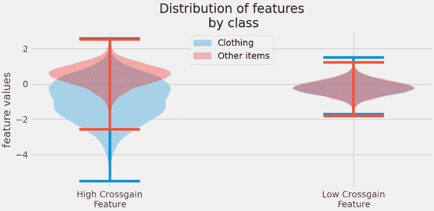

对于具有低交叉增益的嵌入特征，分布差异将很小……如果你将一个项目从一个类别转移到另一个类别，损失的信息非常少。然而，对于与这两个类别相对的具有高交叉增益的特征，特征值的分布差异很大……在这种情况下，均值和方差都有很大差异。高交叉增益特征提供了更多的信息。

图片由作者提供

这是一种替代的均值-尺度差异 Ks_test；贝叶斯 2dist 测试和 Frechet Inception Distance 是替代方案。我喜欢交叉方差的美感和新颖性。我可能会进一步研究其他不同的区分器。我应该指出，对于一个具有整体均值 0 和标准差 sd = 1 的归一化特征，确定分布差异是一项挑战。

## 子维度：用于分类的嵌入空间的降维

当你试图找到一个图像的**特定**特征时，你是否需要整个嵌入？颜色或某物是否为衬衫或裤子是否位于嵌入的狭窄部分？如果我正在寻找衬衫，我并不一定关心它是蓝色还是红色，所以我只看定义“衬衫”的维度，并丢弃定义颜色的维度。

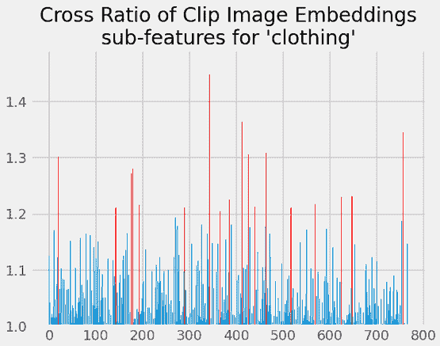

红色高亮维度在确定图像是否包含衣物时显示出重要性。我们在尝试分类时关注这些维度。

图片由作者提供

我正在将一个[n,768]维度的嵌入缩小到更接近 100 维度的实际对特定类别对有意义的维度。为什么？因为余弦相似度度量（cosim）会受到相对不重要的特征噪声的影响。嵌入携带了大量的信息，其中许多在分类问题中你根本不关心。去除噪声，信号会更强：随着“不重要”维度的消除，余弦相似度增加。

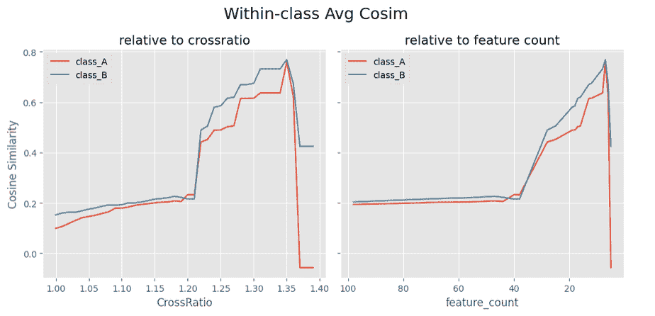

在上述内容中，你可以看到随着最小特征交叉比的增加（对应于右侧特征更少），平均余弦相似度上升，直到因为特征太少而崩溃。我使用了 1.2 的交叉比来平衡增加的拟合度与减少的信息。

图片由作者提供

对于成对比较，首先使用标准余弦相似度将项目分为类别，应用于完整的嵌入。我排除了显示非常低余弦相似度的项目，假设模型对这些项目的技能较低（余弦相似度限制）。我还排除了两个类别之间差异较小的项目（余弦相似度差异）。结果是两个分布，可以从中提取出定义分类之间“真实”差异的重要维度：

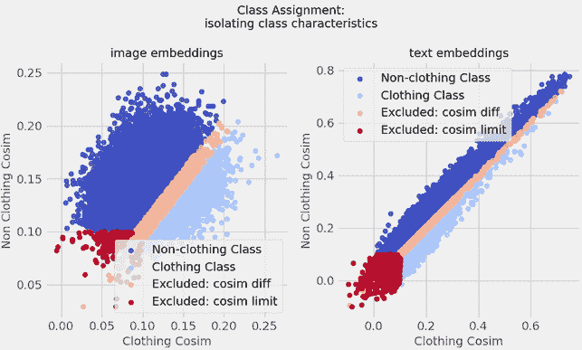

浅蓝色点代表可能包含服装的图像。深蓝色点是非服装。中间的桃色线是不确定性区域，并被排除在下一步之外。同样，深色点也被排除，因为模型对这些点进行分类的信心不足。我们的目标是隔离两个类别，提取区分它们的特征，然后确定图像和文本模型之间是否存在一致性。

图片由作者提供

### 数组成对锦标赛分类

从成对比较中获得全局类别分配需要一些思考。你可以只比较给定分配的类别与其他所有类别。如果初始分配有很好的技能，这应该会很好，但如果多个替代类别更优越，你就会遇到麻烦。一个笛卡尔方法，即比较所有与所有，可以让你达到目标，但会很快变得庞大。我决定采用全局范围的“锦标赛”式成对比较。

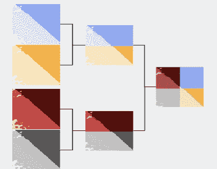

这有 log_2（类别数）轮次，总比较次数最多为 summation_round（当前轮次类别组合数）*n_items，跨越一些指定的特征数。我每轮随机化“队伍”的顺序，以确保比较每次都不相同。它被设计来处理每轮的比较数组，而不是迭代项目。

## 评分

最后，我通过确定文本和图像的分类是否匹配来评估整个过程。只要分布不是严重偏向“默认”类别（它不是），这应该是对过程是否从嵌入中提取真实信息的良好评估。

我查看加权 F1 分数，比较使用图像与文本描述分配的类别。假设一致性越好，分类越可能正确。对于我的包含约 50k 张图像和 13 个类别服装文本描述的数据集，简单全嵌入余弦相似度模型的起始分数从 42%提高到 55%（子特征余弦相似度），到 89%（具有子特征的成对模型）.. 视觉检查也验证了结果。二分类不是主要目标——主要是为了获取数据的一个子集，然后测试多类提升。

|  | **基础模型** | **成对比较** |
| --- | --- | --- |
| **多类别** | 0.613 | 0.889 |
| **二进制** | 0.661 | 0.645 |

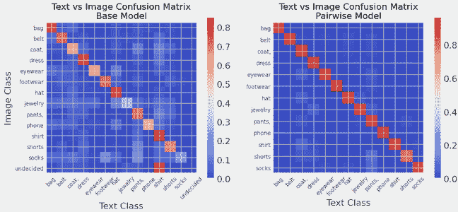

结合混淆矩阵显示了图像和文本之间的更紧密匹配。注意右图中的缩放顶端更高，并且具有分割分配的块更少。

图片由作者提供

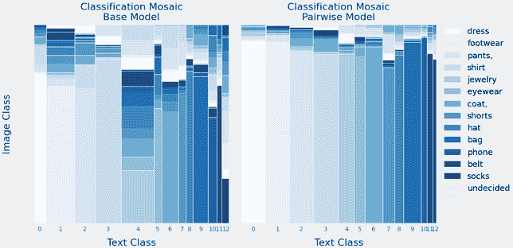

同样，结合混淆矩阵显示了图像和文本之间的更紧密匹配。对于给定的文本类别（底部），在成对模型中与图像类别的协议更大。这也突出了基于列宽的类别大小

图片由作者使用[Nils Flaschel](https://towardsdatascience.com/a-different-way-to-visualize-classification-results-c4d45a0a37bb/)的代码制作

## 最后的想法…

这可能是一个在大型标注数据子集中查找错误或在没有大量额外 GPU 时间进行微调和训练的情况下进行零样本标注的好方法。它引入了一些新颖的评分和途径，但整个过程并不过于复杂或 CPU/GPU/内存密集。

后续将应用它到其他图像/文本数据集以及标注/分类的图像或文本数据集，以确定评分是否得到提升。此外，确定如果以下条件成立，该数据集的零样本分类的增强是否会有显著变化：

1.  使用交叉偏差比以外的其他评分指标

1.  全特征嵌入取代了目标特征

1.  成对锦标赛被另一种方法取代

希望您觉得它有用。

## 引用

@article{reddy2022shopping,title={购物查询数据集：用于改进产品搜索的{ESCI}大规模基准数据集},author={Chandan K. Reddy and Lluís Màrquez and Fran Valero and Nikhil Rao and Hugo Zaragoza and Sambaran Bandyopadhyay and Arnab Biswas and Anlu Xing and Karthik Subbian},year={2022},eprint={2206.06588},archivePrefix={arXiv}}

购物查询图像数据集（SQID）：用于探索产品搜索中多模态学习的图像丰富 ESCI 数据集，M. Al Ghossein, C.W. Chen, J. Tang
