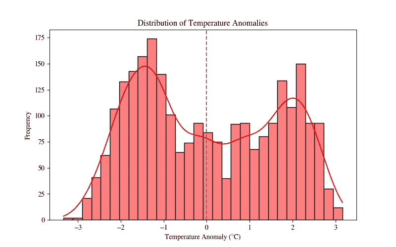
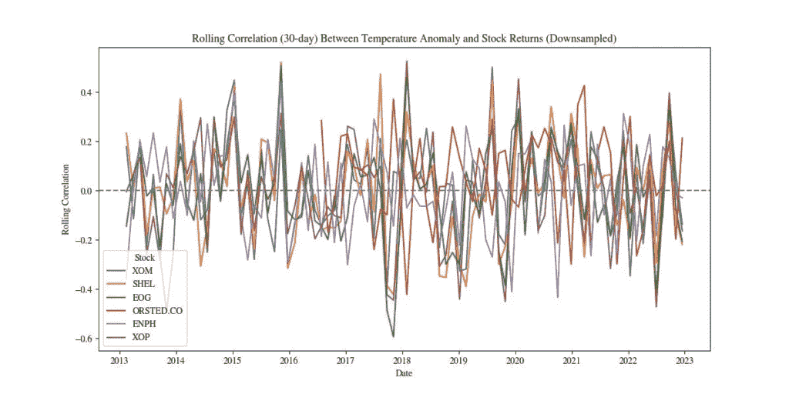
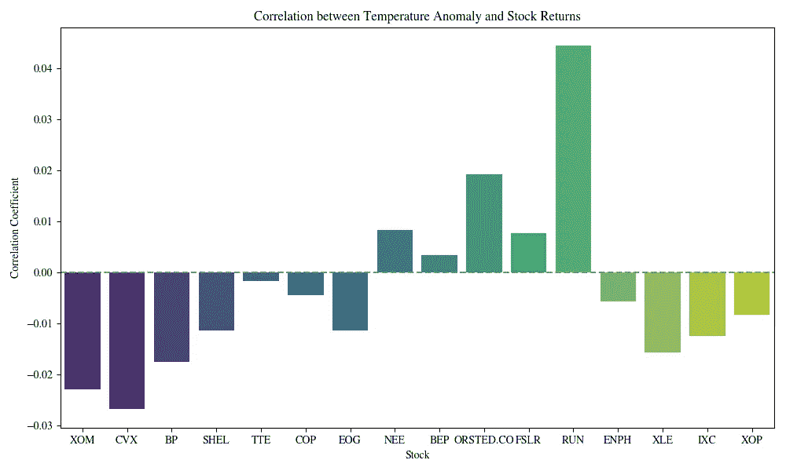
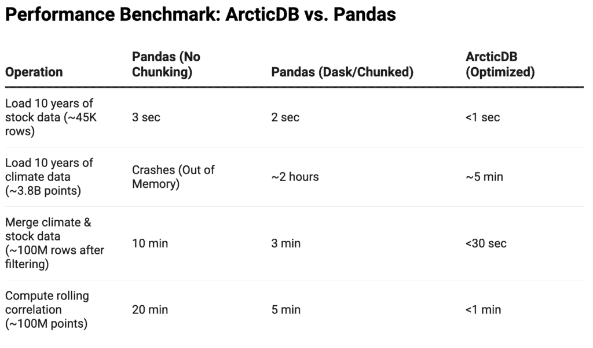

# Pandas 无法处理：ArcticDB 如何驱动大规模数据集

> [原文：https://towardsdatascience.com/pandas-cant-handle-this-how-arcticdb-powers-massive-datasets/](https://towardsdatascience.com/pandas-cant-handle-this-how-arcticdb-powers-massive-datasets/)

Python 已经主导了数据科学，其包 Pandas 已成为数据分析的首选工具。它非常适合表格数据，如果你有大量的 RAM，它支持高达 1GB 的数据文件。在这些大小限制内，它也很好地处理时间序列数据，因为它提供了一些内置支持。

话虽如此，当涉及到更大的数据集时，仅使用 Pandas 可能就不够了。而且，现代数据集正在呈指数级增长，无论是来自金融、气候科学还是其他领域。

这意味着，截至目前，Pandas 对于小型项目或探索性分析来说是一个很好的工具。然而，当你面临更大的任务或想要快速扩展到生产环境时，它就不那么好了。存在一些解决方案——[Dask](https://www.dask.org/)、[Spark](https://spark.apache.org/docs/latest/api/python/index.html)、[Polars](https://pola.rs/)和[分块处理](https://realpython.com/how-to-split-a-python-list-into-chunks/)就是其中一些——但它们带来了额外的复杂性和瓶颈。

我最近遇到了这个问题。我想看看过去 10 年的气象数据与能源公司股价之间是否存在相关性。这里的逻辑是，全球温度与化石燃料和可再生能源公司的股价演变之间可能存在敏感性。如果发现了这样的敏感性，这将是对大型能源公司首席执行官们开始削减自身排放的强烈信号。

我通过[Yahoo! Finance 的 API](https://pypi.org/project/yfinance/)轻松地获得了股价数据。我使用了 16 支股票和 ETF——七家化石燃料公司、六家可再生能源公司和三家能源 ETF——以及 2013 年至 2023 年间的十年每日收盘价。这产生了大约 45,000 个数据点。对于 Pandas 来说，这不过是小菜一碟。

全球气象数据呈现了完全不同的景象。首先，我花费数小时通过[Copernicus API](https://cds.climate.copernicus.eu/how-to-api)下载它。API 本身很棒；问题只是数据实在太多了。我想要 2013 年至 2023 年间的全球每日气温数据。这个问题在于，有 721 个地理纬度点和 1440 个地理经度点的气象站，你将下载并随后处理近**38 亿个数据点**。

这是个庞大的数据量。在我的硬盘上占据了 185GB 的空间。

为了评估这么多数据，我尝试了分块处理，但这超载了我的最先进电脑。逐个步骤迭代这个数据集是可行的，但每次我想要运行简单的分析时，都需要花费半天时间来处理。

好消息是我在金融服务行业人脉很广。我之前听说过[ArcticDB](https://arcticdb.io/)，但至今未曾尝试过。这是一个由[Man Group](https://www.man.com/)开发的数据库，我的几位联系人就在这家对冲基金工作。

因此，我为这个项目尝试了 ArcticDB——并且我没有回头。我没有放弃 Pandas，但对于数十亿规模的数据集，我任何一天都会选择 ArcticDB 而不是 Pandas。

在此澄清两点：首先，尽管我认识 ArcticDB / Man Group 的人，但我并没有正式与他们合作。我是独立完成这个项目的，并选择与您分享结果。其次，ArcticDB 并非完全开源。对于个人用户，在合理范围内是免费的，但对于高级用户和公司有付费层级。我使用了免费版本，它可以帮助你走得很远——实际上远远超出了这个项目的范围。

在此基础上，我现在将向您展示如何设置 ArcticDB 以及其基本用法。然后我会介绍我的项目以及在这个案例中如何使用 ArcticDB。您还将看到一些关于能源股票和全球温度之间相关性的激动人心的结果。接下来，我会进行 ArcticDB 和 Pandas 的性能比较。最后，我会展示何时使用 ArcticDB 更合适，何时可以安全地使用 Pandas 而不用担心瓶颈。

## ArcticDB 新手指南

到目前为止，你可能一直在想为什么我会将数据操作工具 Pandas 与完整的数据库进行比较。事实是，ArcticDB 兼具两者：它方便地存储数据，同时也帮助操作数据。它的一些强大优势包括快速查询、版本控制和更好的内存管理。

### 安装和设置

对于 Linux 和 Windows 用户，获取 ArcticDB 就像获取任何其他 Python 包一样简单：

```py
pip install arcticdb  # or conda install -c conda-forge arcticdb
```

对于 Mac 用户，事情要复杂一些。目前 ArcticDB 不支持苹果芯片。这里有两个解决方案（我使用的是 Mac，经过测试后我选择了第一个）：

1.  在[Docker 容器](https://www.docker.com/resources/what-container/)中运行 ArcticDB。

1.  使用[Rosetta 2](https://www.makeuseof.com/what-is-rosetta-2-mac/)来模拟 x86 环境。

第二种解决方案是可行的，但性能较慢。因此，它消除了使用 ArcticDB 的一些优势。尽管如此，如果你不能或不想使用 Docker，它仍然是一个有效的选择。

要设置 ArcticDB，你需要按照以下方式创建本地实例：

```py
import arcticdb as adb
library = adb.Arctic("lmdb://./arcticdb")  # Local storage
library.create_library("climate_finance")
```

ArcticDB 支持多种存储后端，如 AWS S3、Mongo DB 和 LMDB。这使得它非常容易扩展到生产环境，而无需考虑数据工程。

### 基本用法

如果你熟悉 Pandas 的使用，那么 ArcticDB 对你来说不会很难。以下是读取 Pandas 数据框的方法：

```py
import pandas as pd

df = pd.DataFrame({"Date": ["2024-01-01", "2024-01-02"], "XOM": [100, 102]})
df["Date"] = pd.to_datetime(df["Date"])  # Ensure Date column is in datetime format

climate_finance_lib = library["climate_finance"]
climate_finance_lib.write("energy_stock_prices", df)
```

要从 ArcticDB 检索数据，你可以按照以下方式操作：

```py
df_stocks = climate_finance_lib.read("energy_stock_prices").data
print(df_stocks.head())  # Verify the stored data
```

ArcticDB 最酷的特性之一是它提供了版本支持。如果你经常更新数据，只想检索最新版本，你可以这样做：

```py
latest_data = climate_finance_lib.read("energy_stock_prices", as_of=0).data
```

如果你需要特定版本，你可以这样做：

```py
versioned_data = climate_finance_lib.read("energy_stock_prices", as_of=-3).data
```

一般而言，版本控制的工作方式如下：与 Numpy 类似，索引 0（在上述片段中的 `as_of=` 之后）指的是第一个版本，-1 是最新的，-3 是那之前的两个版本。

### 下一步

一旦你掌握了如何处理你的数据，你就可以像以前一样分析你的数据集。即使在使用 ArcticDB 的同时，分块也可以是一种减少内存使用的有效方法。一旦你扩展到生产环境，它与 AWS S3 和其他存储系统的原生集成将成为你的朋友。

## 能源股票与全球温度

以能源股票及其对全球温度的潜在依赖性为基础进行研究相对容易。首先，我使用 ArcticDB 获取股票回报数据和温度数据。这是获取数据的脚本：

```py
import arcticdb as adb
import pandas as pd

# Set up ArcticDB
library = adb.Arctic("lmdb://./arcticdb")  # Local storage
library.create_library("climate_finance")

# Load stock data
df_stocks = pd.read_csv("energy_stock_prices.csv", index_col=0, parse_dates=True)

# Store in ArcticDB
climate_finance_lib = library["climate_finance"]
climate_finance_lib.write("energy_stock_prices", df_stocks)

# Load climate data and store (assuming NetCDF processing)
import xarray as xr
ds = xr.open_dataset("climate_data.nc")
df_climate = ds.to_dataframe().reset_index()
climate_finance_lib.write("climate_temperature", df_climate)
```

关于数据许可的简要说明：允许将所有这些数据用于商业用途。[Copernicus 许可证](https://www.copernicus.eu/en/access-data/copyright-and-licences)允许使用这些天气数据；[yfinance 许可证](https://github.com/ranaroussi/yfinance/blob/main/LICENSE.txt)允许使用这些股票数据。（后者是一个由社区维护的项目，它利用了雅虎财经数据，但不是雅虎的官方部分。这意味着，如果雅虎在某个时候改变其对 `yfinance` 的立场——目前它容忍这种做法——我必须找到另一种合法获取这些数据的方法。）

上述代码在几行之内完成了围绕数十亿数据点的繁重工作。如果你像我一样，过去一直在与数据工程挑战作斗争，我不会对你觉得有点困惑感到惊讶。

我接着计算了年温度异常值。我是通过首先计算数据集中所有网格点的平均温度来做到这一点的。然后我从每天的实际温度中减去这个平均值，以确定与预期标准的偏差。

这种方法不寻常，因为人们通常会计算 30 年数据中的每日平均温度，以帮助捕捉与历史趋势相比的不寻常温度波动。但由于我只有 10 年的数据在手，我担心这会模糊结果，以至于它们在统计学上会显得可笑；因此采取了这种方法。（我将在适当的时候使用 30 年的数据——以及 ArcticDB 的帮助！）

此外，对于滚动相关性，我使用 30 天移动窗口来计算股票回报和我的特殊温度异常之间的相关性，确保考虑到短期趋势和波动，同时平滑数据中的噪声。

如预期的那样，可以看到有两个峰值——一个代表夏季，一个代表冬季。（如上所述，也可以计算每日异常值，但这通常需要至少 30 年的温度数据——在生产中更好处理。）



2013 年至 2023 年间的全球温度异常。图片由作者提供

2013 年至 2023 年间的全球温度异常。图片由作者提供

我接着计算了各种股票代码与全球平均温度之间的滚动相关性。我是通过计算每个股票代码的每日回报与滚动窗口内相应的每日温度异常之间的皮尔逊相关系数来做到这一点的。这种方法捕捉了关系随时间的变化，揭示了相关性增强或减弱的时期。以下是一些选择性的结果。

总体来看，可以看到相关性经常发生变化。然而，也可以看到，对于特色化石燃料公司（XOM, SHEL, EOG）和能源 ETF（XOP）的相关性峰值更为明显。可再生能源公司（ORSTED.CO, ENPH）与温度也有显著的相关性，但仍然在更严格的限制范围内。



选定股票与全球温度异常的相关性，2013 年至 2023 年。图片由作者提供

选定股票与全球温度异常的相关性，2013 年至 2023 年。图片由作者提供

这张图相当复杂，所以我决定取几个股票与温度的平均相关性。本质上这意味着我使用了每日相关性的时间平均值。结果相当有趣：所有化石燃料股票与全球温度异常呈负相关（从 XOM 到 EOG 以下的所有股票）。

这意味着当异常值增加（即，有更多的极端高温或低温）时，化石燃料股票价格会下降。这种影响是显著的但较微弱，这表明全球平均温度异常可能不是股价变动的主要驱动因素。尽管如此，这是一个有趣的观察。

大多数可再生能源股票（从 NEE 到 ENPH）与温度异常呈正相关。这在某种程度上是可以预料的；如果温度变得极端，投资者可能会更多地考虑可再生能源。

能源 ETF（XLE, IXC, XOP）也与温度异常呈负相关。这并不令人惊讶，因为这些 ETF 通常包含大量化石燃料公司。



选定股票与温度异常的平均相关性，2013–2023 年。图片由作者提供

选定股票与温度异常的平均相关性，2013–2023 年。图片由作者提供

所有这些影响都是显著的但较小的。为了将这一分析提升到下一个层次，我将：

1.  测试选定股票的区域天气影响。例如，德克萨斯州的寒冷天气可能会对化石燃料股票产生不成比例的影响。（幸运的是，使用 ArcticDB 检索这样的数据子集非常容易！）

1.  使用更多的气象变量：除了温度外，我预计风速（因此风暴）和降水（干旱和洪水）将以不同的方式影响化石燃料和可再生能源的储量。

1.  使用 AI 驱动的模型：简单的相关性可以说明很多，但贝叶斯网络、随机森林或深度学习技术可以更好地找到非线性依赖。

当这些见解准备好时，将发布在这个博客上。希望它们能够激励一位或多位大型能源公司的首席执行官重塑他们的可持续性战略！

## ArcticDB 与 Pandas：性能检查

为了这篇文章，我仔细地重新在我的 Pandas 中以及分块版本中运行了我的代码。

我们有四个与 10 年的股票和气候数据相关的操作。下表显示了与基本 Pandas 设置、一些分块以及我能想出的使用 ArcticDB 的最佳方式相比的性能。正如你所见，使用 ArcticDB 的设置至少快五倍，如果不是更多的话。

Pandas 对于 45k 行的小数据集来说工作得很好，但将 38 亿行的数据集加载到基本 Pandas 设置中在我的机器上甚至是不可能的。通过分块加载它也只通过更多的工作方案工作，本质上是一步一步地。另一方面，使用 ArcticDB，这很容易。

在我的设置中，ArcticDB 将整个过程的速度提高了十倍。如果没有采用主要的工作方案，那么即使是非常大的数据集也无法在没有 ArcticDB 的情况下加载！



来源：Ari Joury / Wangari – 全球

## 何时使用 ArcticDB

Pandas 对于相对较小的、探索性的分析来说非常棒。然而，当性能、可扩展性和快速数据检索成为关键任务时，ArcticDB 可以成为一个惊人的盟友。以下是一些值得认真考虑使用 ArcticDB 的情况。

### 当你的数据集太大而无法使用 Pandas

Pandas 将所有内容都加载到 RAM 中。即使拥有优秀的机器，这也意味着超过几 GB 的数据集很可能会崩溃。ArcticDB 也可以处理非常宽的数据集，跨越数百万列。Pandas 在这一点上往往失败。

### 当你处理时间序列数据时

时间序列查询在金融、气候科学或物联网等领域很常见。Pandas 对时间序列数据有一些原生支持，但 ArcticDB 具有更快的时间索引和过滤功能。它还支持版本控制，这对于检索历史快照而不必重新加载整个数据集来说非常棒。即使你使用 Pandas 进行分析，ArcticDB 也能加快数据检索，这可以使你的工作流程更加顺畅。

### 当你需要一个生产就绪的数据库时

一旦扩展到生产环境，Pandas 就不再适用了。你需要一个数据库。与其长时间深入思考使用哪个最佳数据库以及处理大量数据工程挑战，不如使用 ArcticDB，因为它：

+   它可以轻松集成到云存储中，特别是 AWS S3 和 Azure。

+   即使对于大型团队，它也能作为一个集中式数据库运行。相比之下，Pandas 只是一个内存工具。

+   它允许并行读取和写入。

+   它无缝地补充了 NumPy、PyTorch 和 Pandas 等分析库，以进行更复杂的查询。

## 总结：使用酷工具以节省时间

没有 ArcticDB，我的关于气象数据和能源股票的研究将无法进行。至少没有在速度和内存瓶颈方面的重大头痛。

我已经使用并喜爱 Pandas 多年，所以这不是一个可以轻率做出的声明。我仍然认为它非常适合小型项目和探索性数据分析。然而，如果你处理的是大量数据集，或者你想要将你的模型扩展到生产环境，ArcticDB 是你的朋友。

将 ArcticDB 视为 Pandas 的盟友而不是替代品——它弥合了交互式数据探索和生产规模分析之间的差距。对我来说，因此 ArcticDB 远不止是一个数据库。它还是一个高级数据处理工具，并自动化所有数据工程后端，这样你就可以专注于真正令人兴奋的事情。

对我来说，一个令人兴奋的结果是化石燃料和可再生能源股票对温度异常的反应差异。随着这些异常因气候变化而增加，化石燃料股票将受到影响。这不是告诉大型能源公司首席执行官们的事情吗？

为了进一步探讨，我可能将重点放在更本地化的天气上，并超越温度。我还会超越简单的相关性，并使用更高级的技术来揭示数据中的非线性关系。（是的，ArcticDB 可能会在这方面帮助我。）

总体而言，如果你处理的是大型或宽数据集，大量的时间序列数据，需要版本控制你的数据，或者想要快速扩展到生产环境，ArcticDB 是你的朋友。随着我的案例研究进展，我期待更详细地探索这个工具！

*原文发表于[`wangari.substack.com`](https://wangari.substack.com/p/pandas-cant-handle-this-how-arcticdb)*。
