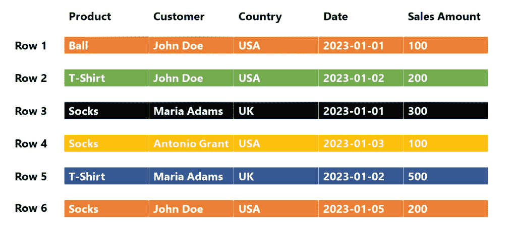
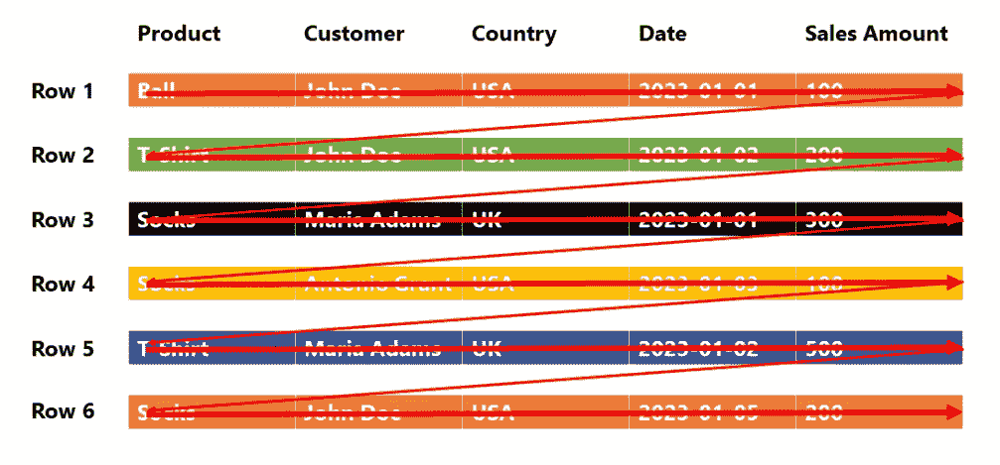
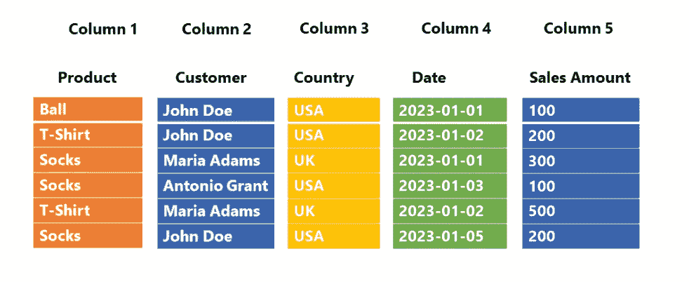
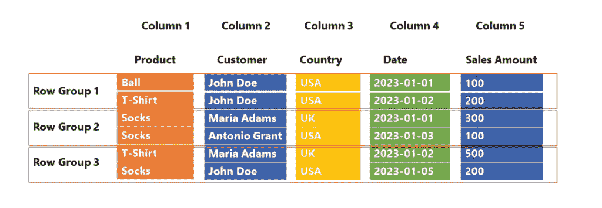
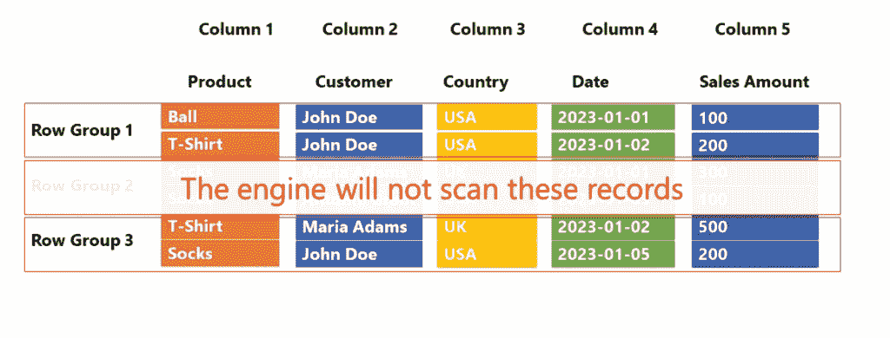
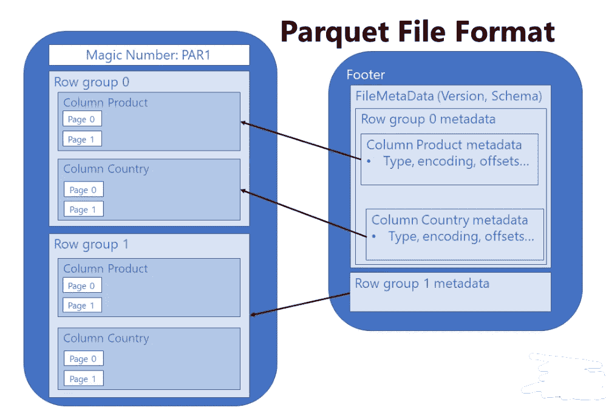
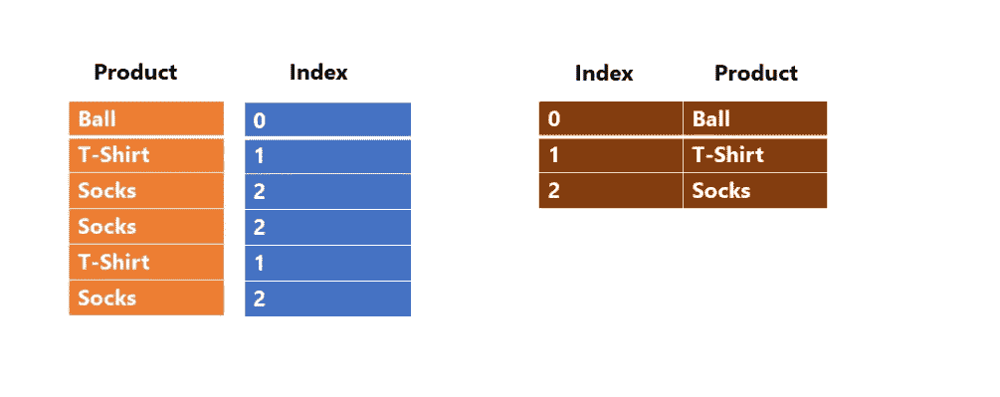

# Parquet 文件格式——你需要知道的一切！

> 原文：[`towardsdatascience.com/parquet-file-format-everything-you-need-to-know/`](https://towardsdatascience.com/parquet-file-format-everything-you-need-to-know/)

<mdspan datatext="el1747162664768" class="mdspan-comment">随着</mdspan>过去几年数据量的指数级增长，最大的挑战之一已成为找到存储各种数据类型的最优方式。与（不那么远的）过去不同，当时关系数据库被认为是唯一的途径，组织现在希望对原始数据进行分析——想想社交媒体情绪分析、音频/视频文件等等——这些通常无法以传统（关系）方式存储，或者以传统方式存储它们将需要大量的努力和时间，这增加了整体的分析时间。

另一个挑战是坚持传统的存储数据结构化的方法，但无需设计复杂且耗时的 ETL 工作负载来将数据移动到企业数据仓库。此外，如果你的组织中有一半的数据专业人员（比如，数据科学家、数据工程师）精通 Python，另一半（数据工程师、数据分析师）精通 SQL，你会坚持让“Pythonists”学习 SQL 吗？或者反过来呢？

或者，你更倾向于一个能够发挥整个数据团队优势的存储选项？好消息是，自 2013 年以来，已经存在这样的东西，它被称为 Apache Parquet！

### 简而言之，Parquet 文件格式

在向您展示 Parquet 文件格式的细节之前，至少有五个主要原因使 Parquet 成为当今存储数据的既定标准：

+   ***数据压缩*** – 通过应用各种编码和压缩算法，Parquet 文件提供了降低内存消耗

+   ***列式存储*** – 这在分析型工作负载中至关重要，其中快速的数据读取操作是关键要求。但，关于这一点，文章后面会详细说明…

+   ***语言无关性*** – 如前所述，开发者可以使用不同的编程语言来操作 Parquet 文件中的数据

+   ***开源格式*** – 意味着你不会被特定的供应商锁定

+   ***支持复杂数据类型***

### 行存储与列存储

我们已经提到，Parquet 是一种基于列的存储格式。然而，要了解使用 Parquet 文件格式的优势，我们首先需要区分基于行和基于列的数据存储方式。

在传统的基于行的存储中，数据以行序列的形式存储。类似于这样：

图片由作者提供

现在，当我们谈论 [OLAP](https://www.ibm.com/cloud/blog/olap-vs-oltp) 场景时，用户可能会提出的一些常见问题是：

+   我们卖了多少个球？

+   有多少美国用户购买了 T 恤？

+   客户 Maria Adams 总共花费了多少钱？

+   我们在 1 月 2 日有多少销售额？

要回答这些问题中的任何一个，引擎必须从第一行扫描到最后一行！所以，要回答问题：有多少美国用户购买了 T 恤，引擎必须执行类似以下操作：

图片由作者提供

实质上，我们只需要从两列中获取信息：产品（T 恤）和国家（美国），但引擎会扫描所有五列！这不是最有效率的解决方案——我想我们都可以同意这一点……

### 列存储

现在我们来考察一下列存储是如何工作的。正如你可能想象的那样，方法完全相反：

图片由作者提供

在这种情况下，每一列都是一个单独的实体——这意味着，每一列在物理上与其他列分离！回到我们之前的业务问题：现在引擎只需扫描查询所需的列（产品和国家），而**跳过扫描**不必要的列。而且，在大多数情况下，这应该会提高分析查询的性能。

好的，这很好，但列存储在 Parquet 之前就已经存在了，它仍然存在于 Parquet 之外。那么，Parquet 格式有什么特别之处呢？

## Parquet 是一种列式格式，它将数据存储在行组中

等等，这还不够复杂吗？别担心，这比听起来容易得多 🙂

让我们回到之前的例子，并描述 Parquet 将如何存储相同的数据块：

图片由作者提供

让我们暂时停下来，解释一下上面的插图，因为这正是 Parquet 文件的结构（一些额外的内容被有意省略了，但我们将很快解释这一点）。列仍然作为单独的单位存储，但 Parquet 引入了额外的结构，称为行组。

为什么这个额外的结构如此重要？

你需要稍等片刻才能得到答案 :)。在 OLAP 场景中，我们主要关注两个概念：***投影（projection）***和***谓词（predicate(s)***）。投影在 SQL 语言中指的是**SELECT**语句——查询需要哪些列。回到我们之前的例子，我们只需要产品和国家列，因此引擎可以跳过扫描其余的列。

谓词（Predicate(s)）在 SQL 语言中指的是**WHERE**子句——哪些行满足查询中定义的准则。在我们的例子中，我们只对 T 恤感兴趣，因此引擎可以完全跳过扫描行组 2，其中产品列的所有值都是袜子！

图片由作者提供

让我们快速停下来，因为我希望你能意识到引擎在处理不同类型存储时所需执行的工作之间的差异：

+   行存储 – 引擎需要扫描所有 5 列和所有 6 行

+   列存储 – 引擎需要扫描 2 列和所有 6 行

+   带有行组的列存储 – 引擎需要扫描 2 列和 4 行

显然，这是一个过于简化的例子，只有 6 行和 5 列，你肯定不会在这三种存储选项之间看到任何性能差异。然而，在现实生活中，当你处理大量数据时，这种差异就变得更加明显。

现在，一个公平的问题可能是：Parquet 是如何“知道”跳过/扫描哪个行组的？

### Parquet 文件包含元数据

这意味着每个 Parquet 文件都包含“关于数据的数据”——例如，在特定行组中某一列的最小值和最大值等信息。此外，每个 Parquet 文件还包含一个尾部，其中包含有关格式版本、模式信息、列元数据等信息。你可以在[这里](https://parquet.apache.org/docs/file-format/metadata/)找到更多关于 Parquet 元数据类型的详细信息。

**重要提示：**为了优化性能并消除不必要的结构（行组和列），引擎首先需要“熟悉”数据，因此它首先读取元数据。这不是一个慢操作，但仍然需要一定的时间。因此，如果你从多个小的 Parquet 文件中查询数据，查询性能可能会下降，因为引擎将不得不从每个文件中读取元数据。所以，将多个较小的文件合并成一个较大的文件（但仍然不要太大 :)）会更好……

我听到了，我听到了：尼古拉，什么是“小”和“大”？不幸的是，这里没有单一的“黄金”数字，但例如，[Microsoft Azure Synapse Analytics 建议单个 Parquet 文件的大小至少应该是几百 MB](https://www.youtube.com/watch?v=RxjMibOx__A)。

### 还有什么其他内容？

下面是 Parquet 文件格式的简化、高级示意图：

图片由作者提供

## 这能比这更好吗？是的，通过数据压缩

好的，我们已经解释了跳过扫描不必要的结构（行组和列）如何有助于提高查询性能。但是，这不仅仅是因为这个原因——记得我一开始告诉你的，Parquet 格式的主要优势之一是减少了文件内存占用吗？这是通过应用各种压缩算法实现的。

我已经在[这里](https://data-mozart.com/inside-vertipaq-compress-for-success/)写过了 Power BI（以及一般 Tabular 模型）中的各种数据压缩类型，所以也许先阅读这篇文章是个好主意。

有两种主要的编码类型使得 Parquet 能够压缩数据并实现惊人的空间节省：

+   *[字典编码](https://parquet.apache.org/docs/file-format/data-pages/encodings/#dictionary-encoding-plain_dictionary--2-and-rle_dictionary--8)* – Parquet 为列中的唯一值创建一个字典，然后使用字典中的索引值替换“实际”值。回到我们的例子，这个过程看起来就像这样：

图片由作者提供

你可能会想：当产品名称相当短时，为什么会有这样的开销，对吧？好吧，但现在想象一下，你存储了产品的详细描述，比如：“长袖 T 恤，领口有图案”。现在想象一下，你有这种产品卖了一百万次……是的，而不是有一百万次重复的值“长袖……”，Parquet 只会存储索引值（整数而不是文本）。

+   *[带位打包的运行长度编码](https://parquet.apache.org/docs/file-format/data-pages/encodings/#a-namerlearun-length-encoding--bit-packing-hybrid-rle--3)* – 当你的数据包含许多重复值时，运行长度编码（RLE）算法可能会带来额外的内存节省。

## 它能比这个更好吗？是的，使用 Delta Lake 文件格式

好吧，现在什么是 Delta Lake 格式？！这不是关于 Parquet 的文章吗？

***所以，用简单的话来说：Delta Lake 其实就是加强版的 Parquet 格式。当我提到“加强版”时，主要是指 Parquet 文件的版本控制。它还存储一个事务日志，以跟踪对 Parquet 文件应用的所有更改。这也被称为 [ACID 兼容事务](https://www.ibm.com/docs/en/cics-ts/5.4?topic=processing-acid-properties-transactions)。

由于它不仅支持 ACID 事务，还支持时间旅行（回滚、审计跟踪等）和 DML（数据操纵语言）语句，例如 INSERT、UPDATE 和 DELETE，如果你认为 Delta Lake 是“数据湖上的数据仓库”（谁说的：Lakehouse😉😉😉），那你就不会错了。探讨 Lakehouse 概念的优势和劣势超出了本文的范围，但如果你对此感兴趣并想深入了解，我建议你阅读 Databricks 的这篇文章 [this article](https://www.databricks.com/glossary/data-lakehouse)。

### 结论

我们在进化！就像我们一样，数据也在进化。因此，需要新的方式来存储新的数据类型。Parquet 文件格式是当前数据环境中最高效的存储选项之一，因为它提供了多种好处——在内存消耗方面，通过利用各种压缩算法，以及在通过允许引擎跳过扫描不必要的数据来实现快速查询处理。

感谢阅读！
