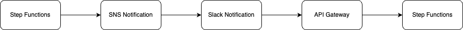
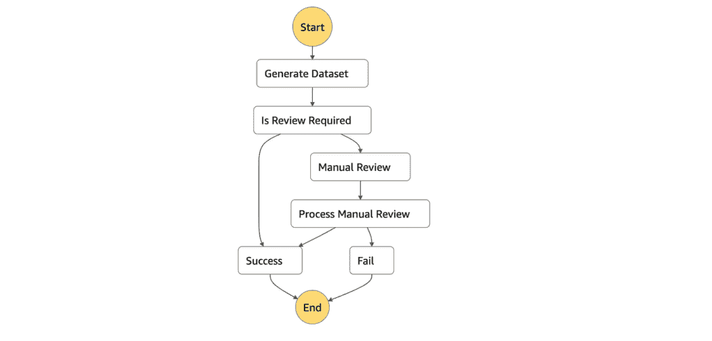
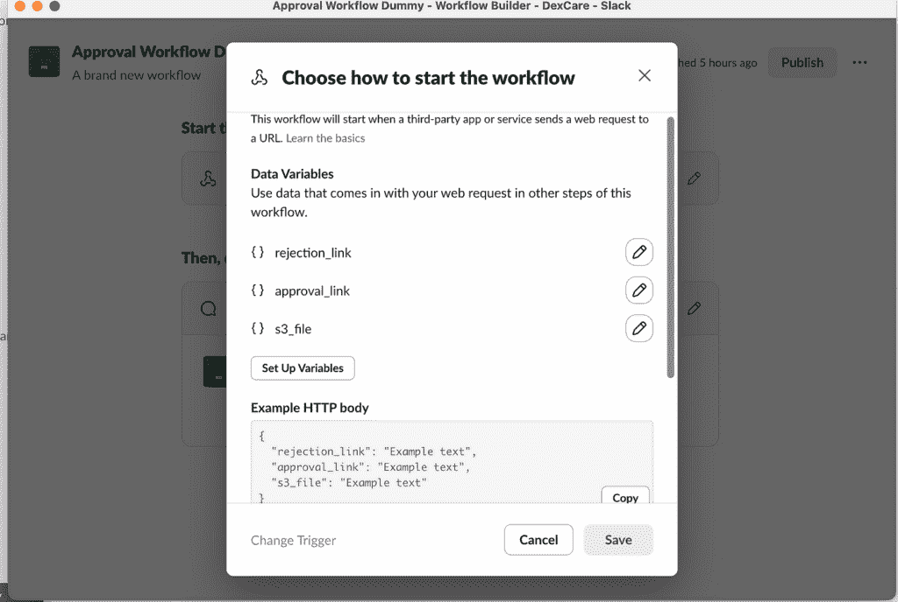
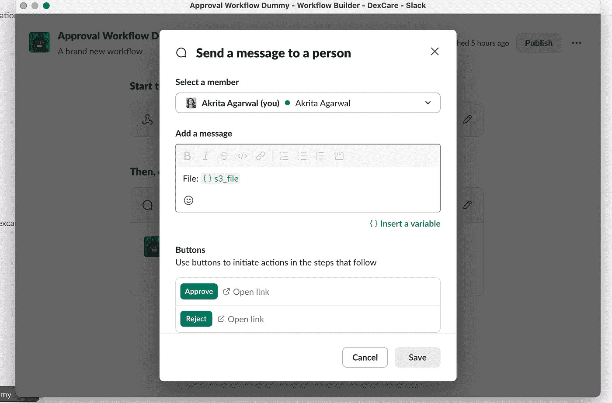
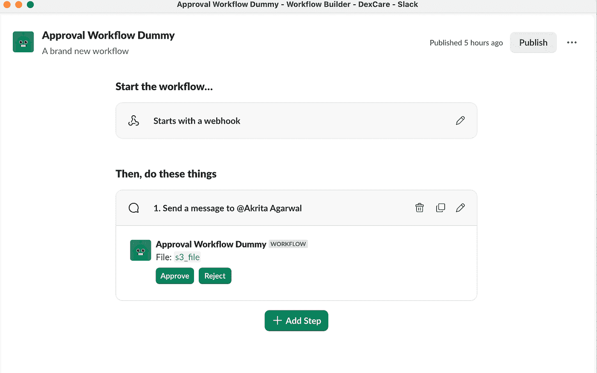

# 使用 AWS Step Functions + Slack 暂停您的机器学习管道以供人工审查

> 原文：[`towardsdatascience.com/pause-your-ml-pipelines-for-human-review-using-aws-step-functions-slack/`](https://towardsdatascience.com/pause-your-ml-pipelines-for-human-review-using-aws-step-functions-slack/)

<mdspan datatext="el1746666014364" class="mdspan-comment">你有没有想过</mdspan>暂停自动工作流程以等待人工决策？

可能在你配置云资源、将机器学习模型推广到生产或向客户的信用卡收费之前需要审批。

在许多**数据科学和机器学习工作流程**中，自动化可以让你走 90%的路——但那关键的最后一步通常需要人类的判断。

尤其是在生产环境中，**模型重新训练**、**异常覆盖**或**大量数据移动**需要仔细的人工审查，以避免昂贵的错误。

在我的情况下，我需要手动审查系统标记**超过 6%的客户数据为异常**的情况——通常是由于客户意外推送造成的。

在我实施正式的工作流程之前，这是以非正式方式处理的：开发者会直接更新生产数据库（！）——这是危险的、容易出错的，且不可扩展的。

为了解决这个问题，我使用**AWS Step Functions**、**Slack**、**Lambda**和**SNS**构建了一个**可扩展的手动审批系统**——这是一个云原生、低成本架构，可以在不启动空闲计算的情况下干净地暂停工作流程以供人工审批。

在这篇文章中，我将向您介绍完整的设计、涉及的 AWS 资源以及如何将其应用于您自己的关键工作流程。

让我们深入了解 👇

## 解决方案

我的应用程序部署在 AWS 生态系统中，因此我们将使用 AWS Step Functions 构建一个状态机，该状态机：

1.  执行业务逻辑

1.  使用带有`WaitForTaskToken`的 Lambda 暂停直到审批

1.  发送 Slack 消息请求审批（可以是电子邮件/）

1.  等待人工点击“批准”或“拒绝”

1.  自动从相同点恢复



Step 函数流程

这里有一个 YouTube 视频展示了演示和实际应用：

我还在这里托管了实时**演示应用**→

👉 [`v0-manual-review-app-fwtjca.vercel.app`](https://kzmnoafk9udhsli0sqwj.lite.vusercontent.net/)

所有代码都托管[这里](https://gist.github.com/akritaag/1bf927c727c9cdfc769e63c604d9a9eb)，并具有正确的 IAM 权限集。

* * *

### 步骤实施

1.  现在，我们将创建一个包含手动审查步骤的 Step Function。以下是步骤函数定义：



步骤函数流程与定义

上述流程生成数据集，将其上传到 AWS S3，如果需要审查，则调用手动审查 Lambda。在手动审查步骤中，我们将使用一个带有`WaitForTaskToken`调用的任务 Lambda，它将暂停执行直到恢复。Lambda 以这种方式读取令牌：

```py
def lambda_handler(event, context):

  config = event["Payload"]["config"]
  task_token = event["Payload"]["taskToken"] # Step Functions auto-generates this

  reviewer = ManualReview(config, task_token)
  reviewer.send_notification()

  return config
```

此 Lambda 发送包含任务令牌的 Slack 消息，以便函数知道要继续哪个执行。

2. 在我们发送 Slack 通知之前，我们需要

1.  设置一个接收 Lambda 审查消息的 SNS 主题

1.  一个订阅了 SNS 主题的 webhook 的 Slack 工作流程，并且已确认订阅

1.  一个具有`approval`和`rejection`端点的 https API 网关。

1.  处理 API 网关请求的 Lambda 函数：[代码](https://gist.github.com/akritaag/1bf927c727c9cdfc769e63c604d9a9eb#file-api_review_processor-py)

我遵循了这里的 youtube 视频进行设置。

3. 一旦上述设置完成，将变量设置到 Slack 工作流程的 webhook 步骤中：



在下一步中使用带有有用说明的变量：



最终的工作流程将看起来像这样：



4. 发送发布到 SNS 主题的 Slack 通知（您也可以使用 slack-sdk），其中包含作业参数。消息将看起来像这样：

```py
def publish_message(self, bucket_name: str, s3_file: str, subject: str = "Manual Review") -> dict:

    presigned_url = S3.generate_presigned_url(bucket_name, s3_file, expiration=86400)  # 1 day expiration

    message = {
        "approval_link": self.approve_link,
        "rejection_link": self.reject_link,
        "s3_file": presigned_url if presigned_url else s3_file
    }

    logging.info(f"Publishing message to <{self.topic_arn}>, with subject: {subject}, message: {message}")

    response = self.client.publish(
        TopicArn=self.topic_arn,
        Message=json.dumps(message),
        Subject=subject
    )

    logging.info(f"Response: {response}")
    return response
```

此 Lambda 发送包含任务令牌的 Slack 消息，以便函数知道要继续哪个执行。

```py
def send_notification(self):

    # As soon as this message is sent out, this callback lambda will go into a wait state,
    # until an explicit call to this Lambda function execution is triggered.

    # If you don't want this function to wait forever (or the default Steps timeout), ensure you setup
    # an explicit timeout on this
    self.sns.publish_message(self.s3_bucket_name, self.s3_key)

def lambda_handler(event, context):

    config = event["Payload"]["config"]
    task_token = event["Payload"]["taskToken"]  # Step Functions auto-generates this

    reviewer = ManualReview(config, task_token)
    reviewer.send_notification()
```

5. 一旦在 Slack 中收到审查通知，用户可以批准或拒绝。步骤函数进入等待状态，直到收到用户响应；然而，任务令牌设置为 24 小时后过期，因此不活动将使步骤函数超时。

根据用户是否批准或拒绝审查请求，设置 rawPath 并可以在此处解析：[代码](https://gist.github.com/akritaag/1bf927c727c9cdfc769e63c604d9a9eb#file-api_review_processor-py)

```py
action = event.get("rawPath", "").strip("/").lower()  
# Extracts 'approve' or 'reject'
```

接收 API 网关 + Lambda 组合：

+   解析 Slack 有效负载

+   提取`taskToken` + 决策

+   使用`StepFunctions.send_task_success()`或`send_task_failure()`

示例：

```py
match action:
    case "approve":
        output_dict["is_manually_approved"] = True
        response_message = "Approval processed successfully."
    case "reject":
        output_dict["is_manually_rejected"] = True
        response_message = "Rejection processed successfully."
    case _:
        return {
            "statusCode": 400,
            "body": json.dumps({"error": "Invalid action. Use '/approve' or '/reject' in URL."})
        }

...

sfn_client.send_task_success(
    taskToken=task_token,
    output=output
)
```

**注意**：配置了`WaitForTaskToken`的 Lambda**必须**等待。如果您不发送令牌，您的流程将停滞不前。

> 奖励：如果您需要电子邮件或短信警报，请使用**SNS**通知更广泛的群体。
> 
> 只需在 Lambda 或步骤函数内部调用`sns.publish()`。

### 测试

一旦手动批准系统连接好，就到了测试的时候了。以下是我的测试方法：

+   在发布 Slack 工作流程后，我在消息转发之前确认了 SNS 订阅。不要跳过此步骤。

+   然后，我使用模拟数据标记事件的假有效负载手动触发了步骤函数。

+   当工作流程达到手动批准步骤时，它会发送带有批准/拒绝按钮的 Slack 消息。

我测试了**所有主要路径**：

+   **批准**：点击批准 — 看到步骤函数恢复并成功完成。

+   **拒绝**：点击拒绝 — 步骤函数干净利落地进入失败状态。

+   **超时**：忽略了 Slack 消息 — 步骤函数等待配置的超时时间，然后优雅地超时，没有挂起。

在幕后，我还验证了以下几点：

+   接收 Slack 响应的 Lambda 函数正确解析了操作负载。

+   没有留下未处理的任务令牌。

+   Step Functions 指标和 Slack 错误日志都很干净。

我强烈推荐测试不仅快乐的路径，还要测试“如果没有人点击？”和“如果 Slack 出现故障？”的情况——及早捕捉这些边缘情况可以让我以后少头疼。

* * *

### 经验教训

+   **始终使用超时**：在`WaitForTaskToken`步骤**以及**整个 Step Function 上设置超时。如果没有响应，工作流程可能会无限期地卡住。

+   **传递必要的上下文**：如果你的 Step Function 在恢复后需要某些文件、路径或配置设置，确保你在 SNS 通知中**编码并发送它们**。

    Step Functions 在从任务令牌恢复时不会自动保留之前的内存上下文。

+   **管理 Slack 噪音**：小心不要在 Slack 频道中用过多的审查请求进行垃圾邮件式轰炸。我建议为开发、UAT 和生产流程创建**单独的频道**，以保持事情整洁。

+   **尽早锁定权限**：确保所有 AWS 资源（Lambda 函数、API 网关、S3 存储桶、SNS 主题）都遵循最小权限原则，拥有**正确且最小的权限**。在我需要超出 AWS 默认设置进行自定义的地方，我编写并发布了内联 IAM 策略作为 JSON。（你可以在[GitHub 仓库](https://medium.com/@akrita/building-a-manual-approval-workflow-in-aws-step-functions-with-slack-sns-and-lambda-ef4189944f14#)中找到示例）。

+   **预先签名并缩短 URL**：如果你在 Slack 消息中发送链接（例如，到 S3 文件），请预先签名 URL 以进行安全访问——**并且**缩短它们以获得更干净的 Slack UI。以下是我使用的快速示例：

```py
shorten_url = requests.get(f"http://tinyurl.com/api-create.php?url={presigned_url}").text
default_links[key] = shorten_url if shorten_url else presigned_url
```

### 总结

添加人工流程逻辑不必意味着使用胶带和 cron 作业。通过**Step Functions + Slack**，你可以构建可审查的、可追踪的，以及**生产安全的审批流程**。

如果这对你有帮助，或者你正在尝试类似的事情，请在评论中留言！让我们构建更好的工作流程。

**注意**：*本文中所有图片均由作者创建*
