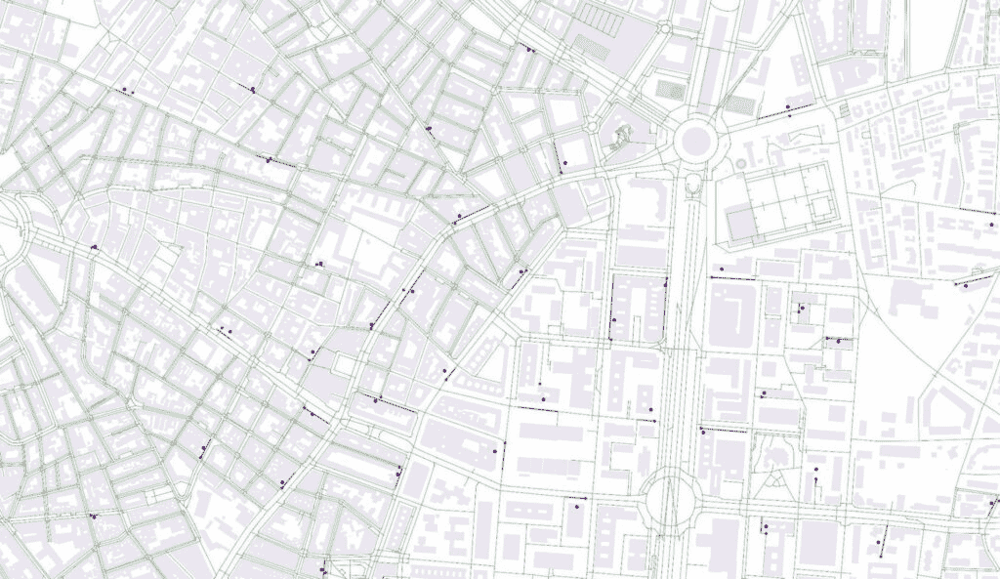
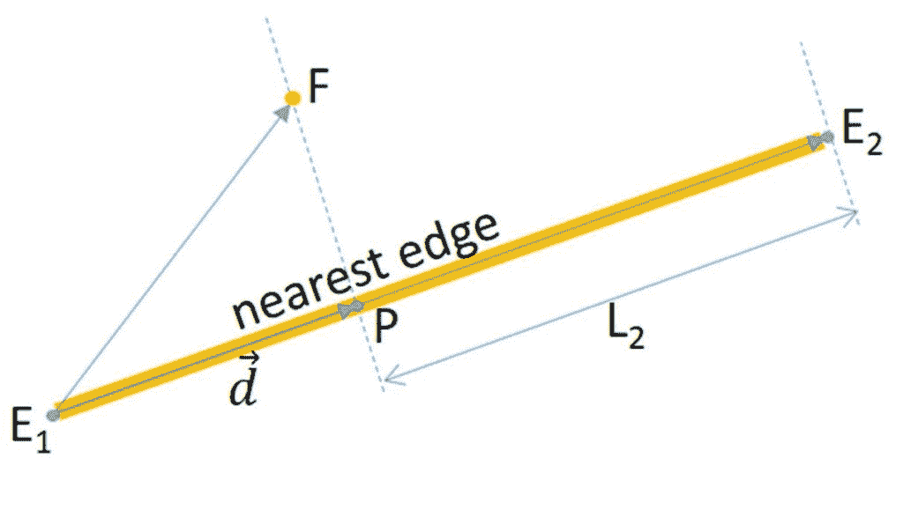
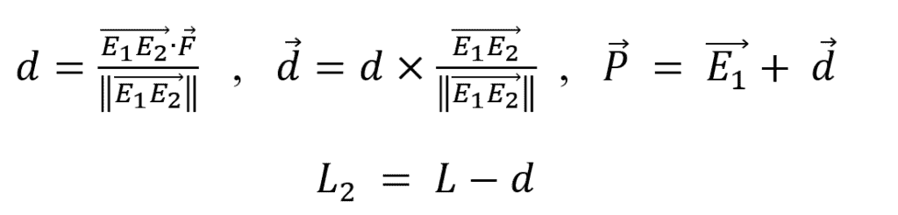
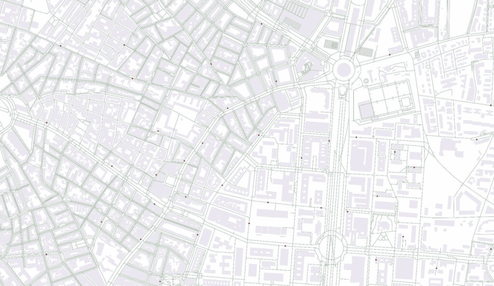
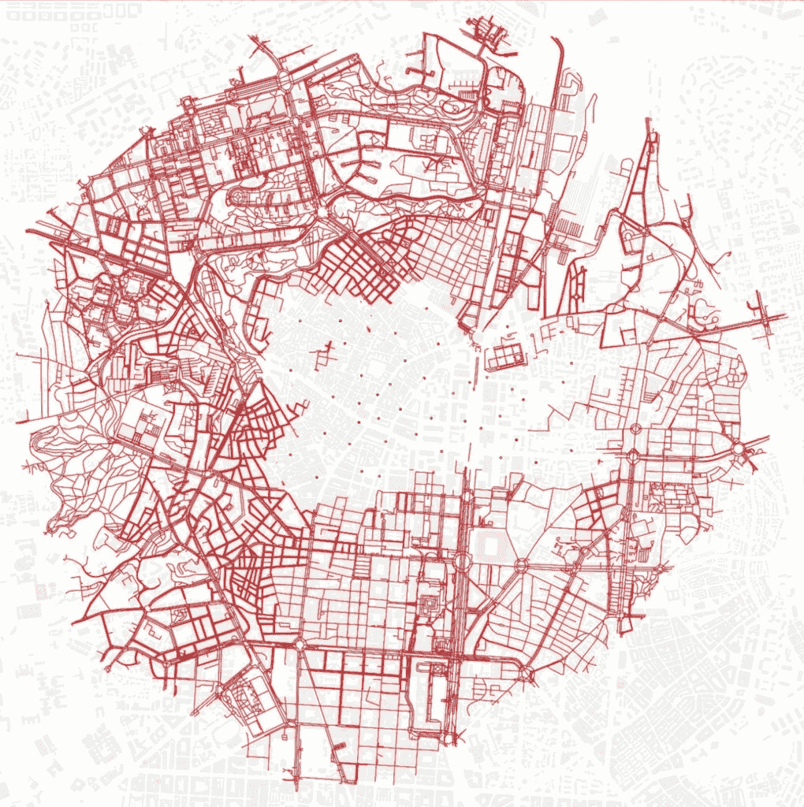
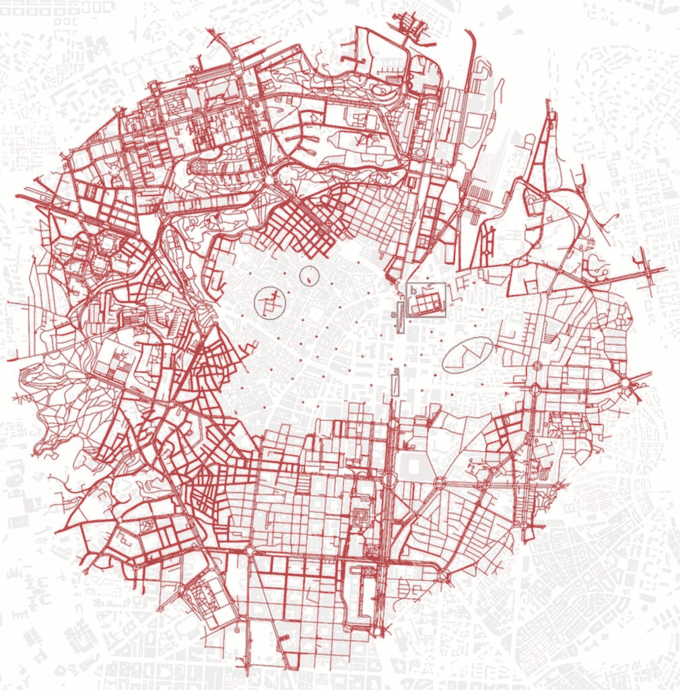

# 西班牙城市药店布局

> 原文：[`towardsdatascience.com/pharmacy-placement-in-urban-spain/`](https://towardsdatascience.com/pharmacy-placement-in-urban-spain/)

## 1.- <mdspan datatext="el1746663950850" class="mdspan-comment">引言</mdspan>和背景。

### 1.1.- 引言

本案例研究展示了地理空间技术在解决西班牙马德里社区药店网络发展中的商业挑战方面的应用。该分析基于一个包括法律、城市规划、工程、行政法和商业考虑因素的项目，但这些方面超出了本分析的范围。在这里，我们专注于高级地理空间技术的应用，如 OSMnx 和 NetworkX，以克服药店网络部署中的地理空间挑战，特别是如何在尊重药店之间最低距离法律限制的情况下，找到城市药店网络中的空白区域，以便安装新的药店。

### 1.2.- 背景

西班牙的药品行业由政府监管，目的是确保在适当的质量和价格条件下提供和分发药品。在这个行业内部，分销受到许多限制，如：药店的所有权、位置和技术经济条件通过国家法律[1]和众多自治社区的法规。本出版物将处理马德里自治区关于位置的限制。

关于在西班牙（特别是马德里自治区）的药店网络投资，寻找合适的药店位置设置成为一个有趣的问题。尽管这种位置搜索可以在正在开发的新城区进行，但最有趣的是在已经巩固的城市土地上。这是因为投资成熟期较短，因为该地区已经居住着人口，而且人口密度通常高于开发区的计划密度。然而，问题是，在这些巩固的城市区域中，已经存在运营中的药店，并且它们之间的最小距离必须依法得到尊重。

西班牙药品行业的法律框架规定了药店之间 250 米的最低距离限制，以便定位药店办公室[2]，[3]。此距离应按照以下考虑因素沿路线测量：

+   应该是一条类似于行人会走的路线。

+   应该连接药店前方的中心，而不是药店入口。

此外，必须确保从公共健康设施的距离超过 150 米，沿步行路线测量。

下面突出了一些问题：

+   在这些法律之前建立的药店不遵循这些规则，结果是有些药店位于距离小于 250 米的地点。尽管如此，从药品业务的角度来看，在感兴趣的区域内仍有城市空间可用于新药店的定位。

+   这些城市空间的存在不足以满足需求，还需要额外的实地调查来分析这些区域是否有可用的房产来容纳药店，并研究城市规划为在这些区域实际建立药店提供的可能性。因此，这是投资过程中的第一步。

在众多出版物[6]–[8]中，已经证明了开源工具如 OSMnx[4]和 NetworkX[5]在解决与城市结构分析、城市交通和流动性相关的复杂问题方面的有效性。**本出版物的目的是提出一种基于 OSMnx 和 NerworkX 的方法，以揭示在考虑法律限制的情况下，城市结构中潜在的开放空间（机会）。**

NetworkX 是一个 Python 库，旨在将图论[9]应用于分析复杂的关系网络。它通过一个复杂的对象框架运行，其中基本元素是*节点*，它们通过*边*相互连接，代表节点之间的关系。这个工具在研究、分析和解决现实世界问题中被广泛使用，包括但不限于地理空间交通网络、城市地理空间网络和社会网络。OSMnx 是一个专门的开源 Python 库，它利用 OpenStreetMap 地理空间数据将全球城市的街道网络矢量化为 NetworkX 图，通过 Python 代码促进其分析。这种方法在[10]中得到例证，其中系统地分析了世界各地的各种城市区域。

在使用这些工具解决地理空间问题时，需要考虑众多变量和替代方案，因此已经审查了大量关于该主题的出版物。由于这些工具的创新性和快速发展的特性，其中一些资料仅可通过在线论坛，如[`stackoverflow.com/`](https://stackoverflow.com/)，或原生网络科学期刊获取。在这些资料中，一个关键问题引发了相当多的讨论，即如何将兴趣点（POIs）连接到 OSMnx 的城市图，正如在[11] – [12]中讨论的那样，以便对这些图进行计算以解决与 POIs 相关的问题。对于本文中讨论的特定案例——即符合法律距离要求的药店办公室（POIs）定位——已经开发了一种新的方法来最适合该案例，借鉴了相关文献和在线资源。该方法将在方法部分进行介绍，并预计可适用于类似案例。

## 2.- 方法

在收集必要的数据：药房的 UTM 坐标和马德里城市的适当 OSMnx 图之后，这个方法的第一阶段包括将药房的 UTM 坐标投影到马德里 OSMnx 网格上作为节点。为此，首先，在“数据放置在网格上”的该方法论阶段，将识别出每个药房最近的 OSMnx 图的边。这是通过导入未简化的 OSMnx 图来完成的。这样，所有马德里城市图的弯曲线都可以通过几条较小的线来近似，这些线适合后续的矢量计算。此外，在这种情况下，有必要将药房办公室的 UTM 坐标投影到 OSMnx 图上，这些办公室通常位于它们的建筑内部。这是在方法论的“矢量计算”阶段完成的。这样，它们立面中点在公共道路上的位置就被近似了。

第三，一旦药房的 UTM 坐标被投影为马德里城市 OSMnx 图的节点，在随后的“网格叠加”阶段，计算距离每个药房节点小于 250 米的网络区域。为此，我们不考虑欧几里得距离，而是根据可步行城市图考虑拓扑距离。因此，获得 n 个网络，每个药房一个。然后，将它们全部叠加。最后，从这个叠加的结果中减去马德里 OSMnx 图。这个减法的结果是一个新的网络，其边距离任何药房都超过 250 米。最后，这个结果被可视化作为最终解决方案，因为这些边构成了从拓扑角度来看可以容纳药房办公室的轴线。

为了说明这篇论文并测试该方法，选择了一个具有非常复杂的城市结构的城市区域，中心位于马德里的*特图安*区，那里的药房也彼此非常接近，因为其中一些药房是在法律框架中包含距离限制之前安装的。

为了简化方法论的初始阐述，已经省略了距离医疗中心的最小法定距离 150 米条件，只考虑药房之间的最小距离作为限制因素。一旦完整地解释了方法论，就会看到这个条件如何容易地在“讨论”部分中引入。

下面将详细解释方法论的每个阶段。

### 2.1.- 数据收集

马德里社区公开了其药房和卫生中心的数据：地址、代码、地理坐标、负责人药师等。这些数据可在网络上找到[13]。本出版物中使用的 csv 文件已从中提取[14]。由于用于计算距离的点应该是建筑立面的中点，而不是药房的入口，因此使用药房设施中心的 UTM 坐标并将其投影到 OSMnx 图上，而不是对药房的地址进行地理编码，是一种更好的近似方法。这样，可以更好地近似药房设施的中心。这在药房有长立面或转角立面的情况下尤为重要，因为场所的地理位置被分配到入口，而不是立面的中间点，这是距离测量规定中提到的点。

对于要考虑的 OSMnx 网络，它将是“步行”类型（`network_type=’walk’`）[15]，这包括马德里所有的公共步行路线。由于部分方法使用矢量计算，因此放弃了 OSMnx 网络的默认简化（因此，`simplify=’False’`），以获得网络节点的全部数据[16]。因此，网络曲线部分可以通过“边”的“节点”之间的直线来近似。与之前的出版物相比，在这种情况下，除了将药房设施的中心投影到 OSMnx 网络之外，还应将中心投影到 OSMnx 网络。根据上述讨论的结论，马德里图将按以下方式导入代码 1：

```py
Madrid_graph = ox.graph_from_place('Madrid, Spain', network_type='walk', 
                             simplify= False )
```

代码 1. Python 3.11.5。

### 2.2.- 网格上的数据放置

如上所述，第一步是识别与每个药房最接近的 OSMnx 图详细版本的边缘。这是通过 OSMnx 距离模块完成的，将每个最近边缘的数据以及距离（作为检查）保存到药房的 DataFrame 对应行中，代码 2。

```py
for index, row in farmacias.iterrows():
    edge = ox.distance.nearest_edges(Madrid_graph, row['lon'], 
                                     row['lat'], return_dist=True)
    node = ox.distance.nearest_nodes(Madrid_graph, row['lon'], 
                                     row['lat'], return_dist=True)
    farmacias.loc[index,'edge_1'] = str(edge[0][0])
    farmacias.loc[index,'edge_2'] = str(edge[0][1])
    farmacias.loc[index,'edge_n'] = str(edge[0][2])
    farmacias.loc[index,'edge_d'] = edge[1]
    farmacias.loc[index,'node'] = str(node[0])
    farmacias.loc[index,'node_d'] = node[1]
```

代码 2. Python 3.11.5。‘lon’和‘lat’分别代表地理坐标经度和纬度。

虽然对后续计算不是必需的，但为了信息和质量控制的目的，也包含了识别最近节点的步骤。

这些在图 1 中所示，用于选择的马德里试点环境。



图 1. 网格上的数据放置。药房的 UTM 坐标，蓝色点。图的最接近节点，红色点。图的最接近边缘，红色线段。使用 OSMnx 自行编制。数据©OpenStreetMap 贡献者，可在开放数据库许可下获得

### 2.3.- 矢量计算

为了将药房投影到马德里图的图形上，考虑到在此情况下，重要的是要确定它们立面中点在公共道路上的位置，即图上。如上所述，在大多数情况下，公共行政部门文件中提供的 UTM 坐标指的是商业设施内部的点。因此，有必要将这些点投影到马德里图上，将它们转换成图的新节点。在这种情况下，通过边将药房链接到图上是不正确的，因为只有公共道路上的步行路线对距离测量感兴趣。因此，相反，应该创建一个新节点，其中每个药房办公室都投影到图上，在上一节确定的最近边上。

投影使用 Python 库 Numpy [17] 通过以下向量计算进行，它提供了每个药房在图上的新 P 节点的坐标，图 2：



图 2\. 向量计算方案。F，药房 UTM 点。P，投影药房节点。E[1] 和 E[2]，边端点。L，是 OSMnx 中边的长度。本节自述。



如果“d”或“L[2]”为负，这可能是由于 OSMnx 中边的长度与使用 UTM 坐标进行的投影之间的微小差异造成的，药房投影的节点将是定义边的极端节点之一，具体取决于两个量中的哪一个为负。如果“d”为负，则药房将投影为“E[1]”；如果“L[2]”为负，则投影为“E[2]”。

因此，创建了一条新边，将这个新节点与最近边的节点连接起来。随后，删除之前确定的最近边，因为它被刚刚创建的边所取代。参见代码 3。

```py
for index, row in farmacias.iterrows():
    # vector calculation
    F = np.array( [row['localizacion_coordenada_x'], row['localizacion_coordenada_y']])
    E1 = np.array([utm.from_latlon(Madrid_graph.nodes[row['edge_1']]['y'], Madrid_graph.nodes[row['edge_1']]['x'], 30,'N')[0],
                   utm.from_latlon(Madrid_graph.nodes[row['edge_1']]['y'], Madrid_graph.nodes[row['edge_1']]['x'], 30,'N')[1]])
    E2 = np.array([utm.from_latlon(Madrid_graph.nodes[row['edge_2']]['y'], Madrid_graph.nodes[row['edge_2']]['x'], 30,'N')[0],
                   utm.from_latlon(Madrid_graph.nodes[row['edge_2']]['y'], Madrid_graph.nodes[row['edge_2']]['x'], 30,'N')[1]])
    d = np.dot(E2-E1,F-E1)/Madrid_graph.edges[(row['edge_1'],row['edge_2'],row['edge_n'] )]['length']
    d_vect = (E2-E1)*d/Madrid_graph.edges[(row['edge_1'],row['edge_2'],row['edge_n'] )]['length']
    F_coord = E1 + d_vect
    L_calculada = np.sqrt(np.dot(E2-E1,E2-E1))
    F_coord_LL = utm.to_latlon(F_coord[0], F_coord[1], 30, 'N')
    L2 = Madrid_graph.edges[(row['edge_1'],row['edge_2'],row['edge_n'] )]['length'] - d
    # edge and node substitution
    if d<0:  
        nx.relabel_nodes(Madrid_graph, {row['edge_1']: row['farmacia_nro_soe']}, copy= False)
        nx.set_node_attributes(Madrid_graph, { row['farmacia_nro_soe'] :{'color':'r', 'size':10 }}  )                            
    elif L2<0:
        nx.relabel_nodes(Madrid_graph, {row['edge_2']: row['farmacia_nro_soe']}, copy=False)
        nx.set_node_attributes(Madrid_graph, { row['farmacia_nro_soe'] :{'color':'r', 'size':10 }}  )     
    else:
        Madrid_graph.add_edge(row['edge_1'],row['farmacia_nro_soe'],0)
        nx.set_edge_attributes(Madrid_graph, { (row['edge_1'], row['farmacia_nro_soe'], 
                                            0):{'length':d, 'osmid' : row['farmacia_nro_soe'], 'color':'r', 'size':4  }})
        Madrid_graph.add_edge(row['farmacia_nro_soe'],row['edge_2'],0)
        nx.set_edge_attributes(Madrid_graph, { (row['farmacia_nro_soe'], row['edge_2'], 
                                            0):{'length':L2 , 'osmid' : row['farmacia_nro_soe'], 'color':'r', 'size':4 }})
        Madrid_graph.remove_edge(row['edge_1'],row['edge_2'],row['edge_n'] )  
        nx.set_node_attributes(Madrid_graph, 
                               { row['farmacia_nro_soe'] :{'x':F_coord_LL[1], 'y':F_coord_LL[0], 'color':'r', 'size':10 }}  ) 
```

代码 3\. . Python 3.11.5\. ‘farmacia_nro_soe’ 代表药房代码。开头（F, E1, E2, d, 等）的变量指的是图 2 中的那些。节点和边的其他属性（‘color’，‘size’）旨在在绘图过程中突出显示。

此计算的结果显示在图 3 中



图 3\. 马德里图上投影的药房作为红色节点。使用 OSMnx 自述。数据 © OpenStreetMap 贡献者，可在开放数据库许可下获得

### 2.4.- 网格叠加。

在这个阶段，我们将为马德里每个药房节点创建 250 米步行距离的图：`nx.generators.ego_graph([...], radius=250, centre=True, distance=’length‘)`。然后，它们被组合成包含所有这些图的大图：`MultiGraph.nx.compose_all()`。然后，从最初使用的基马德里图中减去它们：`MultiGraph.remove_edges_from()`。这个减去后的图包含满足所有点都位于所有其他药房节点 250 米以外的条件的边，因此，可能容纳新药房，代码 4。

```py
for index, row in farmacias.iterrows():
    Grph = nx.generators.ego_graph(Madrid_graph,row['farmacia_nro_soe'] , 
                                   undirected=True, radius=250, 
                                   center=True, distance='length')
    superposicion.append(Grph)
S = nx.compose_all(superposicion)
nx.set_edge_attributes(S, 'r', 'color' )
Madrid_graph.remove_edges_from(list(S.edges)) 
```

代码 4\. . Python 3.11.5\. ‘farmacia_nro_soe’代表药房代码。

## 3.- 结果

图 4 显示了将此程序应用于仅用绿色点表示的位于马德里城市杏仁形区域内的药房集合的结果。所有包含距离给定药房网络小于 250 米的点的边已被移除，因此在插图内部观察到间隙。在移除后仍存在于间隙内的边是那些从拓扑角度来看可以容纳新药房的边。显然，在实际项目中，有必要检查这些“边”的 urban conditions，以及容纳药房的商业房地产的可用性，见下一节。



图 4\. 结果：在现有药房（以蓝色点表示）的星座中，可能容纳新药房的边。位于给定药房星座拓扑距离 250 米之外的图边（以红色段表示）是可能的合适位置。灰色背景：建筑物的阴影。使用 OSMnx 自行编制。数据©OpenStreetMap 贡献者，可在开放数据库许可下获得

## 4.- 讨论和结论

### 4.1.-图选择

由于西班牙的药房只能位于公共通道上，并且药房之间的 250 米距离限制是通过步行路线测量的，因此选择了网络类型“步行”[15]，它包括马德里所有的公共步行路线，作为 OSMnx 马德里图，代码 5。

```py
Madrid_graph = ox.graph_from_place('Madrid, Spain', network_type='walk', 
                             simplify= False )
```

代码 5\. Python 3.11.5

在不同的情况下，不仅公共道路对工作有用，非公共道路也有用，可以使用 Overpass QL 代码通过指定自定义过滤器[18]来选择包括所有这些道路的图——既包括公共道路也包括非公共道路，代码 6：

```py
Madrid_graph = ox.graph_from_place('Madrid, Spain', simplify= False, 
    custom_filter=
    '["area"!~"yes"]'
    '["highway"!~"cycleway|motor|proposed|construction|abandoned|platform|raceway"]'
    '["foot"!~"no"]["service"!~"private"]["access"!~"private"]' )
```

代码 6\. Python 3.11.5

### 4.2.-数据处理。

如引言中所述，由于向量计算的原因，选择了“未简化”的 OSMnx 图用于马德里。然而，这意味着 NetworkX 图中的节点数量相当大，即 465,976 个，与简化后的马德里网络中的 154,311 个相比。这一点，加上像马德里这样的城市的复杂性，使得上述计算过程需要相当长的时间，这取决于所使用的硬件。如果存在硬件限制，有一些值得咨询的有趣出版物，可以加快 Python 引擎的计算速度，例如使用 Numba 库[11]的情况。

### 4.3.- 解的近似性质。

与商业场所相关的城市情况范围很广。例如，有些商业场所的立面不连续。在这种情况下，法律规范要求考虑与每个具体案例最相关的立面部分。即使在这些情况下，解决方案也相当精确。然而，它仍然是一个近似解，可以作为详细现场分析的有用起点。

### 4.4.- 简化。

为了清晰起见，到目前为止，仅考虑了沿步行路线的药店之间 250 米的最低距离限制。如*2.- 方法*节中所示，药店还必须遵守距离卫生中心 150 米的最低距离。在了解了该方法之后，通过添加马德里公共卫生中心（作为马德里自治区网站上的公开 csv 文件[19]提供）可以轻松实现这一点。我们采用与药店相同的方法来创建包含位于每个卫生中心 150 米范围内的点的图；在这种情况下使用`nx.generators.ego_graph([...], radius=150, centre=True, distance='length')`。然后，在“网格叠加”阶段，我们在`MultiGraph.nx.compose_all()`步骤中将此图与药店的图叠加。随后从马德里城市图中减去这个总集。

### 4.5.- 除了与巩固的城市土地相关的应用之外。

尽管这篇出版物讨论了在城市集中土地上定位药店的情况，但 Python 中的 NetworkX 功能同样可以用来研究尚未安装城市服务和设施的发展中城市地区的最佳药店位置。这可以通过中心性度量来实现。使用中心性度量分析城市网络有许多有趣的例子，例如在分析城市自行车网络的情况下[16]。在药店的情况下，NetworkX 的“中介中心性”度量可以是一个有趣的候选指标，有助于确定发展中城市区域中最相互连接的步行路线，这对于药店来说是一个理想的特征，因为它们往往位于大多数行人流动的地方。这是分析哥本哈根自行车道网络改进点的标准[20]。但这与本文所解决的问题不同，应该在另一篇出版物中处理。

### 4.6.- 结果讨论。

如引言中所述，所提供的解决方案在本质上具有拓扑性质。例如，在图 5 中，绿色方框“a”中突出显示的边对应于马德里一个非常宽阔的街道上的道路，“*Paseo de La Castellana*”，有多个不同级别的车道和林荫大道，行人只能通过非常少的斑马线和迂回的路线才能进入。这些‘边’正是出于这个原因被选中的：尽管它们到最近药店的欧几里得距离并不大，但行人实际上需要走的路线要长得多，因为他们只能通过几个斑马线和迂回的路线才能到达。然而，由于城市规划的限制，它们并不适合作为药店的地点。

如上所述，在根据这种方法确定了遵守药店之间距离限制的边之后，有必要进一步从以下方面分析它们：其中商业房地产的可用性以容纳药店，以及城市规划在允许使用和活动方面提供的可能性。一个例子是绿色方框“b”中突出显示的。这是一个属于马德里公共供水公司“*Canal de Isabel II*”的大型城市地块，它也作为城市中的绿地。在这种情况下，尽管它已被选中进行计算，但由于城市规划和所有权问题，它不是一个适合容纳药店的场所。尽管它与周围药店的欧几里得距离很近，但由于它们被围墙包围，需要绕行许多路线才能从周围地点通过步行路线进入，因此计算选择了这些边，因为它们的可进入性很差。

选择的研究区域药店密度很高，这主要是因为许多药店是在药店间距离规定实施之前安装的。此外，由于该地区的城市混乱，步行路线非常曲折。这意味着，尽管城市区域药店密度很高，但计算仍然能够找到可以预先容纳药店的空隙。其中一些用青色椭圆和圆圈标出，见图 5。



图 5. 特殊情况。使用 OSMnx 自行编制。数据© OpenStreetMap 贡献者，可在开放数据库许可下使用

## 5. 数据可用性和免责声明

本研究中使用的数据集可供公众访问，并由西班牙马德里自治区授权任何用途。街道网络数据来源于 OpenStreetMap © OpenStreetMap 贡献者，通过 OSMnx Python 库获取，并可在开放数据库许可（ODbL）下使用：[`opendatacommons.org/licenses/odbl/1.0/`](https://opendatacommons.org/licenses/odbl/1.0/)。地理空间层，如药店位置，由公开可访问的 GeoJSON 和 csv 文件派生，这些文件托管在[`datos.comunidad.madrid/group/salud`](https://datos.comunidad.madrid/group/salud)和[`datos.comunidad.madrid/catalogo/dataset/6f407280-6ab1-43fb-bb48-ab954ec6edae/resource/130c1f6e-b131-44a1-94c9-00c9bb807ca6/download/oficinas_farmacia.csv`](https://datos.comunidad.madrid/catalogo/dataset/6f407280-6ab1-43fb-bb48-ab954ec6edae/resource/130c1f6e-b131-44a1-94c9-00c9bb807ca6/download/oficinas_farmacia.csv)，由西班牙马德里自治区提供，明确允许任何用途，如对应的使用条款和许可信息[`www.comunidad.madrid/servicios/012-atencion-ciudadano/aviso-legal-privacidad`](https://www.comunidad.madrid/servicios/012-atencion-ciudadano/aviso-legal-privacidad)所示。

本文所提出的方法论设计、技术实现（例如，通过 NetworkX 进行网络分析）和空间计算均由作者独立开发。所有分析工作流程、可视化和结论均为原创贡献，不受第三方知识产权限制。为了提高透明度，本文参考文献和数据可用性部分提供了直接的数据来源链接。

**责任声明：**

根据前文“数据可用性”部分所述的公开数据来源，作者在此声明，对于因访问、使用或解释本工作中提供的信息而产生的任何后果、损害或损失，作者不承担任何责任，如此类数据来源的使用条款所述。本文仅用于教育目的，不构成专业或商业建议。用户在使用任何发现之前，应独立验证数据并咨询相关专家。

## 6.- 参考文献

[1]         Jefatura del Estado de España, “Ley 29/2006, de 26 de julio, de garantías y uso racional de los medicamentos y productos sanitarios.,” *BOE*, vol. 178, no. BOE-A-2006-13554, pp. 28122–28165, 2006.

[2]         Jefatura del Estado de España, “Ley 16/1997, de 25 de abril, de Regulación de Servicios de las Oficinas de Farmacia.,” *BOE*, vol. 100, no. BOE-A-1997-9022, pp. 13450–13452, 1997.

[3]         Ministerio de Sanidad y Seguridad Social de España, “ORDEN de 21 de noviembre de 1979 por la que se desarrolla el Real Decreto 909/1978, de 14 de abril, en lo referente al establecimiento, transmisión e integración de Oficinas de Farmacia.,” *BOE*, vol. 302, no. BOE-A-1979-29679, pp. 28975–28977, 1979.

[4]         G. Boeing, “Modeling and Analyzing Urban Networks and Amenities with OSMnx. Working paper.,” *github.com*, 2024\. [Online]. Available: https://geoffboeing.com/publications/osmnx-paper/. [Accessed: 28-Jun-2024].

[5]         A. A. Hagberg, D. A. Schult, and P. J. Swart, “Exploring network structure, dynamics, and function using NetworkX,” in *Proceedings of the 7th Python in Science Conference*, 2008, no. SciPy.

[6]         P. Zhao, Y. Yen, E. Bailey, and M. T. Sohail, “Analysis of urban drivable and walkable street networks of the ASEAN smart cities network,” *ISPRS Int. J. Geo-Information*, vol. 8, no. 10, 2019.

[7]         G. Boeing, “Urban street network analysis in a computational notebook,” *Region*, vol. 6, no. 3, 2019.

[8]         G. Boeing, “Street Network Models and Indicators for Every Urban Area in the World,” in *Geographical Analysis*, 2022, vol. 54, no. 3.

[9]         S. Ghosh, A. Mallick, A. Chowdhury, K. De Sarkar, and J. Mukherjee, “Graph theory applications for advanced geospatial modelling and decision-making,” *Appl. Geomatics*, vol. 16, no. 4, pp. 799–812, 2024.

[10]      G. Boeing, “A multi-scale analysis of 27,000 urban street networks: Every US city, town, urbanized area, and Zillow neighborhood,” *Environ. Plan. B Urban Anal. City Sci.*, vol. 47, no. 4, 2020.

[11]      D. Vityazev, “Connecting Data Points to a Road Graph with Python Efficiently,” *Towards Data Science*, 2022\. [Online]. Available: https://towardsdatascience.com/connecting-datapoints-to-a-road-graph-with-python-efficiently-cb8c6795ad5f.

[12] Y. Chang, “将 POI 连接和插值到道路网络中,” *数据科学方向*, 2019\. [在线]. 可用: https://towardsdatascience.com/connecting-pois-to-a-road-network-358a81447944\. [访问日期: 07-Oct-2024].

[13] 马德里自治区, “马德里自治区开放数据. 透明度门户,” 2024\. [在线]. 可用: https://datos.comunidad.madrid/group/salud. [访问日期: 01-Oct-2024].

[14] 马德里自治区, “药房办公室，csv 文件.,” *马德里自治区开放数据门户. 透明度门户*, 2024\. [在线]. 可用: https://datos.comunidad.madrid/catalogo/dataset/6f407280-6ab1-43fb-bb48-ab954ec6edae/resource/130c1f6e-b131-44a1-94c9-00c9bb807ca6/download/oficinas_farmacia.csv.

[15] G. Boeing, “OSMnx：获取、构建、分析和可视化复杂街道网络的新方法,” *计算机环境与城市系统*, 第 65 卷, 第 126–139 页, 2017.

[16] M. A. Alattar, C. Cottrill, 和 M. Beecroft, “使用 Strava 和 OSMnx 建模自行车路线选择：格拉斯哥市案例研究,” *运输研究跨学科视角*, 第 9 卷, 2021.

[17] C. R. Harris 等人, “NumPy 的数组编程,” *自然*, 第 585 卷, 第 7825 期. 2020.

[18] G. Boeing, “使用字符串格式化将基础设施插入查询,” *github*, 2017\. [在线]. 可用: https://github.com/gboeing/osmnx/blob/v0.5.3/osmnx/core.py#L482-483\. [访问日期: 01-Sep-2024].

[19] 马德里自治区, “卫生中心，csv 文件.,” *马德里自治区开放数据门户. 透明度门户*, 2024\. [在线]. 可用: https://datos.comunidad.madrid/dataset/centros_servicios_establecimientos_sanitarios.

[20] A. Vybornova, T. Cunha, A. Gühnemann, 和 M. Szell, “在自行车网络中自动检测缺失的链接,” *地理分析*, 第 55 卷, 第 2 期, 2023.
