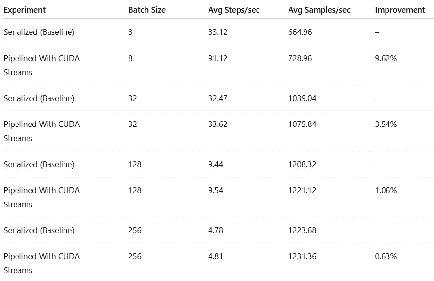
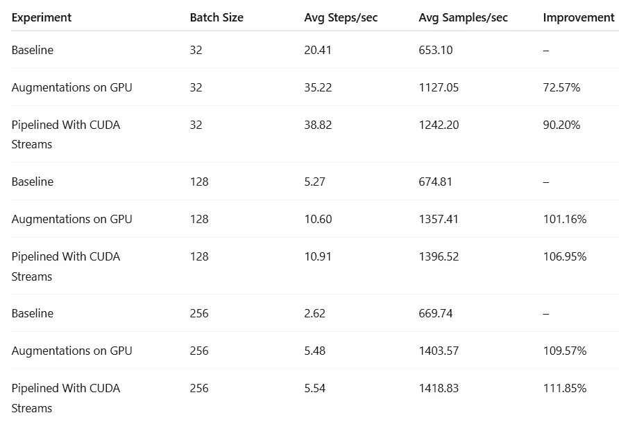

# 使用 CUDA Streams 管道化 AI/ML 训练工作负载

> 原文：[`towardsdatascience.com/pipelining-ai-ml-training-workloads-with-cuda-streams/`](https://towardsdatascience.com/pipelining-ai-ml-training-workloads-with-cuda-streams/)

<mdspan datatext="el1750968827091" class="mdspan-comment">本文是我们关于 PyTorch 中性能分析和优化的系列文章中的第九篇，旨在强调性能分析和优化在机器学习开发中的关键作用。在整个系列中，我们回顾了各种实用的工具和技术，用于分析和提升基于 PyTorch 的 AI/ML 模型的运行时性能。我们的目标有两个：**

1.  为了强调定期评估和优化 AI/ML 工作负载的重要性。

1.  为了展示广泛工具和技术的可访问性，用于分析和优化 AI/ML 运行时性能。你不需要成为 CUDA 专家就能有意义地提高你的模型性能并降低计算成本。

在本文中，我们将探讨使用 CUDA streams，这是 NVIDIA CUDA 编程模型的一个强大功能，它提供了一种复杂的方法来重叠 GPU 操作并并行运行它们。尽管我们通常将我们的 AI/ML 模型训练工作负载与一个单一的、不可分割的（即，“不可破坏的”）计算图 G 运行在 GPU 上相关联，但在某些情况下，图可以被分解为两个不同的子图 G1 和 G2，其中 G=G2G1。在这种情况下，CUDA streams 允许“管道化”计算图，即，编程我们的训练步骤并行运行 G1（在批量输入 n+1 上）和 G2（在 G1 的第 n 个输出上）。这种技术在以下情况下特别有用：

+   当单独运行时，子图并未充分利用 GPU，

+   两个子图的计算成本相似（即，没有一个主导运行时）。

我们将探讨两种常见的场景，其中“管道化”是可行的：

1.  **部分模型训练或微调：**

    冻结预训练模型 *backbone*（例如，特征提取器或编码器）并仅训练模型 *head*（例如，解码器）是常见的做法。由于冻结的 *backbone* 不依赖于 *head* 的梯度，因此两者可以并行执行。

1.  **将数据预处理卸载到 GPU 上：**

    解决输入管道瓶颈（也称为 GPU 饥饿）的常见方法是将数据预处理移动到 GPU 上。虽然将预处理操作添加到模型图中可以提高性能，但通过在模型执行的同时并行运行预处理操作（假设预处理与模型计算相比不是微不足道的）可以获得额外的收益。

为了便于我们的讨论，我们将定义两个玩具训练脚本，并在不同场景下测量训练性能。实验是在一个运行着[PyTorch (2.6) 深度学习 AMI](https://aws.amazon.com/releasenotes/aws-deep-learning-ami-gpu-pytorch-2-6-ubuntu-22-04/)（DLAMI）的[Amazon EC2 g5.2xlarge](https://aws.amazon.com/ec2/instance-types/g5/)实例（包含一个 NVIDIA A10G GPU 和 8 个 vCPU）上运行的。

请注意：我们分享的代码片段仅用于演示目的——请不要依赖它们的正确性或最优性。使用 CUDA 流的影响将根据模型架构和系统配置而变化。我们鼓励您在将 CUDA 流（或我们提到的任何其他工具技术）集成到工作流程之前进行自己的分析和实验。

## 第一部分：流水线化编码器-解码器模型

我们探索的第一个用例涉及一个基于 CNN 的图像分割模型，该模型由一个固定的（预训练的）编码器和可训练的解码器组成。在这种情况下，由于编码器权重被冻结且不受反向传播的影响，编码器可以独立于解码器的训练执行。在本节中，我们评估了使用 CUDA 流流水线化训练过程的影响。

### 玩具图像分割训练实验

我们首先定义了一个简单的基于 CNN 的图像编码器及其相应的解码器。

```py
import torch
import torch.nn as nn

img_size = 256
num_classes = 10

encoder = nn.Sequential(
    # Start with 256x256 image
    nn.Conv2d(3, 16, kernel_size=1),
    nn.ReLU(inplace=True),
    nn.Conv2d(16, 32, kernel_size=2, stride=2),  # 2x downsample
    nn.ReLU(inplace=True),
    nn.Conv2d(32, 64, kernel_size=2, stride=2),  # 4x downsample
    nn.ReLU(inplace=True),
    nn.Conv2d(64, 128, kernel_size=2, stride=2),  # 8x downsample
    nn.ReLU(inplace=True),
    nn.Conv2d(128, 256, kernel_size=2, stride=2),  # 16x downsample
    nn.ReLU(inplace=True),
    nn.Conv2d(256, 512, kernel_size=2, stride=2),  # 32x downsample
    nn.ReLU(inplace=True),
    nn.Conv2d(512, 1024, kernel_size=2, stride=2),  # 64x downsample
    nn.ReLU(inplace=True),
    nn.Conv2d(1024, 2048, kernel_size=2, stride=2),  # 128X downsample
    nn.ReLU(inplace=True),
    nn.Conv2d(2048, 4096, kernel_size=2, stride=2),  # 256X downsample
)

decoder = nn.Sequential(
    # The decoder mirrors the encoder
    nn.ConvTranspose2d(4096, 2048, kernel_size=2, stride=2),  # 2x upsample
    nn.ReLU(inplace=True),
    nn.ConvTranspose2d(2048, 1024, kernel_size=2, stride=2),  # 4x upsample
    nn.ReLU(inplace=True),
    nn.ConvTranspose2d(1024, 512, kernel_size=2, stride=2),  # 8x upsample
    nn.ReLU(inplace=True),
    nn.ConvTranspose2d(512, 256, kernel_size=2, stride=2),  # 16x upsample
    nn.ReLU(inplace=True),
    nn.ConvTranspose2d(256, 128, kernel_size=2, stride=2),  # 32x upsample
    nn.ReLU(inplace=True),
    nn.ConvTranspose2d(128, 64, kernel_size=2, stride=2),  # 64x upsample
    nn.ReLU(inplace=True),
    nn.ConvTranspose2d(64, 32, kernel_size=2, stride=2),  # 128x upsample
    nn.ReLU(inplace=True),
    nn.ConvTranspose2d(32, 16, kernel_size=2, stride=2),  # 256x upsample
    nn.ReLU(inplace=True),
    nn.Conv2d(16, num_classes, kernel_size=3, padding=1),  # Final layer
)
```

接下来，我们构建了一个由随机图像和分割图组成的合成数据集。

```py
from torch.utils.data import DataLoader
from torchvision.datasets.vision import VisionDataset

# A dataset with random images and per-pixel labels
class FakeDataset(VisionDataset):
    def __init__(self):
        super().__init__(root=None)
        self.size = 1000000

    def __getitem__(self, index):
        # create a random image
        img = torch.rand(3, img_size, img_size, dtype=torch.float32)

        # create a random label map
        target = torch.randint(0, num_classes, (img_size, img_size))

        return img, target

    def __len__(self):
        return self.size

train_set = FakeDataset()

train_loader = DataLoader(
    dataset=train_set,
    batch_size=8,
    num_workers=8
)
```

最后，我们定义损失函数、优化器和训练循环。请注意，我们冻结了编码器的权重，只训练解码器。

```py
import time

device = torch.device("cuda")
criterion = torch.nn.CrossEntropyLoss()
optimizer = torch.optim.SGD(decoder.parameters())

# Freeze the encoder weights
encoder.requires_grad_(False)
encoder.eval().to(device)

decoder.train().to(device)

warmup = 10
active_batches = 100
total_iters = warmup + active_batches

for idx, data in enumerate(train_loader):
    inputs = data[0].to(device=device, non_blocking=True).float()
    labels = data[1].to(device=device, non_blocking=True)
    optimizer.zero_grad()
    with torch.no_grad():
        features = encoder(inputs)
    output = decoder(features)
    loss = criterion(output, labels)
    loss.backward()
    optimizer.step()

    if idx == warmup:
        # sync the GPU and start the timer
        torch.cuda.synchronize()
        t0 = time.perf_counter()

    if idx == total_iters:
        break

# wait for the GPU to finnish and then stop the timer
torch.cuda.synchronize()
total_time = time.perf_counter() - t0
print(f'throughput: {active_batches / total_time}')
```

我们的基线训练脚本实现了每秒 83 步的平均吞吐量，平均 GPU 利用率为 85%。

### 使用 CUDA 流流水线化模型执行

在下面显示的修改后的训练循环版本中，我们引入了两个 CUDA 流：一个用于执行编码器，一个用于训练解码器。在每个迭代中，我们同时执行两个操作：

1.  使用来自批次*N*的图像特征和标签来训练解码器。

1.  在输入批次*N+1*上执行编码器以生成其图像特征。

```py
encoder_stream = torch.cuda.Stream()
decoder_stream = torch.cuda.Stream()

# initialize the features to None
features = None

for idx, data in enumerate(train_loader):
    inputs = data[0].to(device, non_blocking=True).float()
    labels_next = data[1].to(device, non_blocking=True)

    if features is not None:
        with torch.cuda.stream(decoder_stream):
            decoder_stream.wait_stream(encoder_stream)

            optimizer.zero_grad()
            output = decoder(features)
            loss = criterion(output, labels)
            loss.backward()
            optimizer.step()

    with torch.cuda.stream(encoder_stream):
        with torch.no_grad():
            features =  encoder(inputs)
        # Record that features will be used in the decoder stream
        features.record_stream(decoder_stream)

    labels = labels_next

    if idx == warmup:
        # sync the GPU and start the timer
        torch.cuda.synchronize()
        t0 = time.perf_counter()
    if idx == total_iters:
        break

# wait for the GPU to finish and then stop the timer
torch.cuda.synchronize()
total_time = time.perf_counter() - t0
print(f'throughput: {active_batches / total_time}')
```

这种修改实现了每秒 91 步的平均吞吐量，代表了 9.6%的速度提升。这是一个显著的改进——特别是考虑到我们的基线已经具有很高的 GPU 利用率（85%）。

### 流水线对工作负载特性的敏感性

使用 CUDA 流进行流水线化的有效性高度依赖于训练工作负载和运行环境的特定情况。如果编码器显著大于解码器（或反之），流水线可能几乎没有好处，甚至可能阻碍性能。相反，当 GPU 利用率不足时，流水线往往能带来更显著的收益。

为了说明这种依赖性，我们使用不同的批次大小重新进行了实验。结果总结如下：



CUDA Streams 对吞吐量的影响（作者）

随着批量大小的增加，流水线的优势逐渐减弱。这可能是由于较大的批量大自然会导致更高的（且更有效）GPU 利用率，从而减少了通过并发执行进行改进的空间。

## 第二部分：将增强操作卸载到 GPU

在本节中，我们将 CUDA 流的用法应用于数据增强的加速。在之前的博客文章中（例如[这里](https://towardsdatascience.com/solving-bottlenecks-on-the-data-input-pipeline-with-pytorch-profiler-and-tensorboard-5dced134dbe9/#7fbd-af822198c08)和[这里](https://chaimrand.medium.com/a-caching-strategy-for-identifying-bottlenecks-on-the-data-input-pipeline-8e52060b402f)），我们从不同的角度研究了数据输入管道瓶颈问题，并回顾了几种诊断和解决这些瓶颈的技术。这些瓶颈的常见原因是 CPU 资源耗尽，CPU 无法满足预处理管道的计算需求。结果是 GPU 资源枯竭——一种昂贵的 GPU 闲置等待数据到达的场景。

一种有效的方法是将大量数据预处理卸载到 GPU 上。我们将演示这项技术，并通过在专用 CUDA 流上执行增强操作来进一步推进，从而实现与模型训练的并发执行。

### 玩具图像分类训练实验

我们首先定义一个简单的基于 CNN 的图像分类模型：

```py
import torch
import torch.nn as nn

import torch
import torch.nn as nn

img_size = 256
num_classes = 10
model = nn.Sequential(
    # Start with 256x256 image
    nn.Conv2d(3, 16, kernel_size=1),
    nn.ReLU(inplace=True),
    nn.Conv2d(16, 32, kernel_size=2, stride=2),  # 2x downsample
    nn.ReLU(inplace=True),
    nn.Conv2d(32, 64, kernel_size=2, stride=2),  # 4x downsample
    nn.ReLU(inplace=True),
    nn.Conv2d(64, 128, kernel_size=2, stride=2),  # 8x downsample
    nn.ReLU(inplace=True),
    nn.Conv2d(128, 256, kernel_size=2, stride=2),  # 16x downsample
    nn.ReLU(inplace=True),
    nn.Conv2d(256, 512, kernel_size=2, stride=2),  # 32x downsample
    nn.ReLU(inplace=True),
    nn.Conv2d(512, 1024, kernel_size=2, stride=2),  # 64x downsample
    nn.ReLU(inplace=True),
    nn.Conv2d(1024, 2048, kernel_size=2, stride=2),  # 128X downsample
    nn.ReLU(inplace=True),
    nn.Conv2d(2048, 4096, kernel_size=2, stride=2),  # 256X
    nn.Flatten(),
    nn.Linear(4096, num_classes)
)
```

接下来，我们创建了一个合成数据集，其中包含一个有意设计以造成严重性能瓶颈的增强管道：

```py
import random
from torch.utils.data import DataLoader
import torchvision.transforms.v2 as T
from torchvision.datasets.vision import VisionDataset
import torchvision.transforms.v2.functional as F
import torchvision.ops as ops

# A dataset with random images and labels
class FakeDataset(VisionDataset):
    def __init__(self, transform = None):
        super().__init__(root=None, transform=transform)
        self.size = 1000000

    def __getitem__(self, index):
        # create a random image
        img = torch.randint(0, 256, (3, img_size, img_size),
                           dtype=torch.uint8)
        # create a random label
        target = torch.randint(0, num_classes, (1, ))

        if self.transform:
            # Apply tranformations
            img = self.transform(img)

        return img, target

    def __len__(self):
        return self.size

augmentations = T.Compose([
    T.ToDtype(torch.float32),
    T.RandomCrop(img_size//2),
    T.Resize(img_size),
    T.RandomRotation(degrees=45.0),
    T.GaussianBlur(kernel_size=7),
    T.Normalize(mean=[0, 0, 0], std=[1, 1, 1])
])

train_set = FakeDataset(transform=augmentations)

train_loader = DataLoader(
    dataset=train_set,
    batch_size=32,
    num_workers=8
)
```

最后，我们定义损失函数、优化器和训练循环：

```py
import time

device = torch.device("cuda")
criterion = torch.nn.CrossEntropyLoss()
optimizer = torch.optim.SGD(model.parameters())

model.train().to(device)

warmup = 10
active_batches = 100
total_iters = warmup + active_batches

for idx, data in enumerate(train_loader):
    inputs = data[0].to(device=device, non_blocking=True)
    labels = data[1].to(device=device, non_blocking=True).squeeze()
    optimizer.zero_grad()
    output = model(inputs)
    loss = criterion(output, labels)
    loss.backward()
    optimizer.step()

    if idx == warmup:
        # sync the GPU and start the timer
        torch.cuda.synchronize()
        t0 = time.perf_counter()

    if idx == total_iters:
        break

# wait for the GPU to finnish and then stop the timer
torch.cuda.synchronize()
total_time = time.perf_counter() - t0
print(f'throughput: {active_batches / total_time}')
```

运行此基线脚本的结果是平均吞吐量为每秒 20.41 步，GPU 利用率仅为 42%。大量的数据增强使 CPU 不堪重负，导致 GPU 资源枯竭。请参阅我们的[前一篇帖子](https://towardsdatascience.com/solving-bottlenecks-on-the-data-input-pipeline-with-pytorch-profiler-and-tensorboard-5dced134dbe9/#7fbd-af822198c08)，了解更多关于检测数据输入管道瓶颈的信息。

### 将数据增强卸载到 GPU

为了解决数据输入管道上的性能瓶颈，我们将增强操作移至 GPU 上。

第一步是定义[自定义数据转换](https://docs.pytorch.org/vision/main/auto_examples/transforms/plot_custom_transforms.html)，该转换对每个批次的样本应用随机旋转和裁剪。这很重要，因为内置的[torchvision](https://docs.pytorch.org/vision/stable/index.html)转换在整个批次中应用相同的增强——丢失了在 CPU 上看到的每个样本的随机性。

我们使用`[roi_align](https://docs.pytorch.org/vision/main/generated/torchvision.ops.roi_align.html)`运算符实现了`*BatchRandomCrop*`转换。

```py
class BatchRandomCrop(T.Transform):
    def __init__(self, output_size):
        super().__init__()
        self.output_size = output_size

    def transform(self, img: torch.Tensor, params: dict):
        batch_size, _, original_height, original_width = img.shape
        device = img.device
        max_top = original_height - self.output_size
        max_left = original_width - self.output_size

        # Generate random top and left coords for each image in the batch
        random_top = torch.randint(0, max_top + 1, (batch_size,),
                                   device=device, dtype=torch.float32)
        random_left = torch.randint(0, max_left + 1, (batch_size,),
                                    device=device, dtype=torch.float32)

        image_indices = torch.arange(batch_size, device=device,
                                     dtype=torch.float32)

        boxes = torch.stack([
            image_indices,
            random_left,
            random_top,
            random_left + self.output_size,
            random_top + self.output_size
        ], dim=1)

        cropped_batch = ops.roi_align(
            img,
            boxes,
            output_size=self.output_size
        )
        return cropped_batch 
```

我们通过遍历批次中的所有图像并对每个图像应用随机旋转来实现*BatchRandomRotate*转换。请注意，这个版本不是向量化的；一个完全向量化的实现将需要更多的努力。

```py
class BatchRandomRotation(T.Transform):
    def __init__(self, degrees):
        super().__init__()
        self .degrees = degrees

    def transform(self, inpt: torch.Tensor, params: dict):
        # split the batch into a list of individual images
        images = list(torch.unbind(inpt, dim=0))

        augmented_images = []
        for img_tensor in images:
            # generate a random angle
            angle = random.uniform(-self.degrees, self.degrees)

            # apply the rotation to the single image
            transformed_img = F.rotate(
                img_tensor,
                angle=angle
            )
            augmented_images.append(transformed_img)

        # stack the transformed images
        return torch.stack(augmented_images, dim=0)
```

我们现在定义*batch_transform*，它模仿上面定义的基于 CPU 的增强流水线：

```py
batch_transform = T.Compose([
    T.ToDtype(torch.float32),
    BatchRandomCrop(img_size//2),
    T.Resize(img_size),
    BatchRandomRotation(degrees=45.0),
    T.GaussianBlur(kernel_size=7),
    T.Normalize(mean=[0, 0, 0], std=[1, 1, 1])
]) 
```

最后，我们重置数据集并更新训练循环以应用新的*batch_transform*：

```py
train_set = FakeDataset(transform=None)

train_loader = DataLoader(
    dataset=train_set,
    batch_size=32,
    num_workers=8
)

for idx, data in enumerate(train_loader):
    inputs = data[0].to(device=device, non_blocking=True)
    labels = data[1].to(device=device, non_blocking=True).squeeze()

    # apply augmentations
    inputs = batch_transform(inputs)

    optimizer.zero_grad()
    output = model(inputs)
    loss = criterion(output, labels)
    loss.backward()
    optimizer.step()

    if idx == warmup:
        torch.cuda.synchronize()
        t0 = time.perf_counter()

    if idx == total_iters:
        break

torch.cuda.synchronize()
total_time = time.perf_counter() - t0
print(f'throughput: {active_batches / total_time}')
```

这个更新的训练脚本将吞吐量提高至每秒 35.22 步——比基线结果快 72.57%。

### 使用 CUDA 流进行流水线增强

接下来，我们使用两个独立的 CUDA 流来流水线增强和训练步骤：一个用于运行数据转换，另一个用于训练模型。在循环的每次迭代中，我们执行两个并发操作：

1.  我们在增强的批次*N*上训练模型。

1.  对批次*N+1*执行基于 GPU 的数据增强

```py
transform_stream = torch.cuda.Stream()
model_stream = torch.cuda.Stream()

# initialize the transformed value to None
transformed = None

for idx, data in enumerate(train_loader):
    inputs = data[0]
    labels_next = data[1].to(device, non_blocking=True).squeeze()

    if transformed is not None:
        with torch.cuda.stream(model_stream):
            model_stream.wait_stream(transform_stream)
            optimizer.zero_grad()
            output = model(transformed)
            loss = criterion(output, labels)
            loss.backward()
            optimizer.step()

    with torch.cuda.stream(transform_stream):
        inputs = inputs.to(device, non_blocking=True)
        transformed = batch_transform(inputs)
        # Record that transformed will be consumed by model_stream
        transformed.record_stream(model_stream)

    labels = labels_next

    if idx == warmup:
        torch.cuda.synchronize()
        t0 = time.perf_counter()
    if idx == total_iters:
        break

torch.cuda.synchronize()
total_time = time.perf_counter() - t0
print(f'throughput: {active_batches / total_time}')
```

这进一步提高了吞吐量至每秒 38.82 步——比串行解决方案提高了 10.2%，比原始基线快 90.20%。

### 流水线对工作负载特性的敏感性

正如我们在第一部分中看到的，使用 CUDA 流进行流水线的收益取决于工作负载的细节。下表展示了不同批量大小的结果：



使用 CUDA 流进行流水线对吞吐量的影响（作者）

随着批量大小的增加，GPU 卸载变得更加有效，显著提升了性能。同时，流水线的收益也在减少。这可能是由于更大的批大小提高了 GPU 的效率，减少了重叠的机会。

## 摘要

当涉及到运行 AI/ML 工作负载时，每一毫秒都很重要。在这篇文章中，我们探讨了使用 CUDA 流对 AI/ML 训练步骤进行流水线处理在两种常见场景中的影响：部分模型训练和将数据增强任务卸载到 GPU 上。在两种情况下，流水线解决方案都优于串行实现——尽管改进的程度因批量大小的不同而显著变化。

如我们在这篇文章中强调的，使用 CUDA 流的预期影响可能会根据 AI/ML 工作负载而大不相同。例如，在 GPU 已经被高效利用的情况下，使用 CUDA 流的开销实际上可能导致运行时性能下降。我们强烈建议在采用这种方法之前在自己的工作负载上测试这项技术。

我们希望您会发现这篇文章中描述的技术很有用。有关更多关于分析优化 AI/ML 工作流程的技巧、窍门和技术，请查看本系列中的其他文章[系列](https://towardsdatascience.com/pytorch-model-performance-analysis-and-optimization-10c3c5822869/)。
