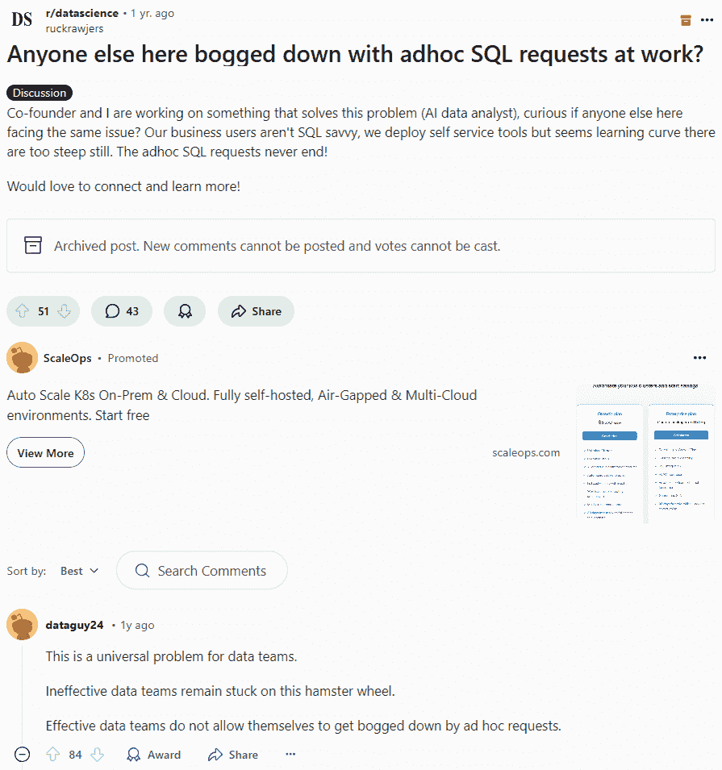
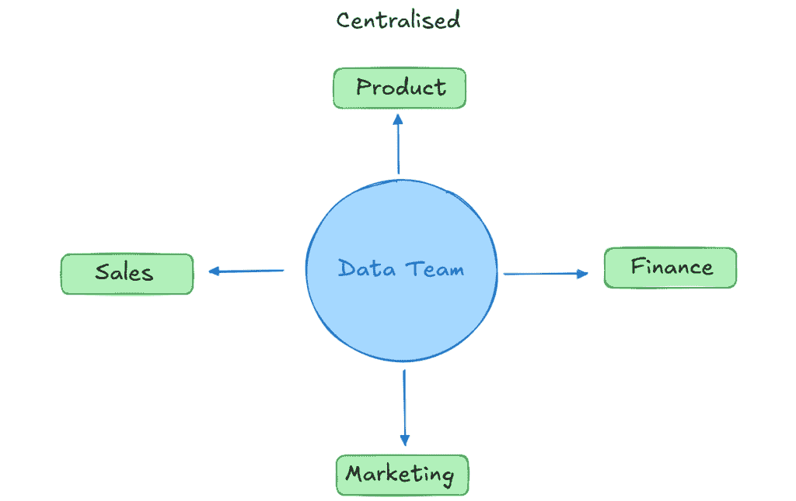
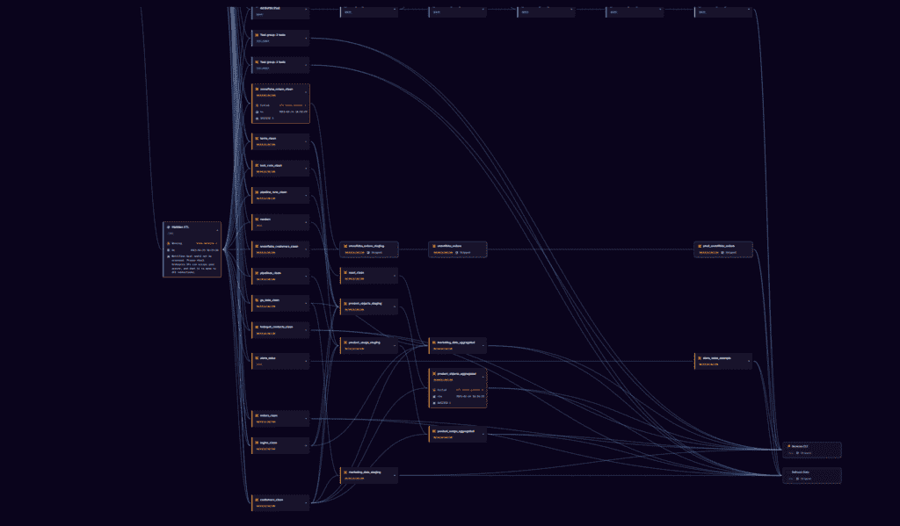
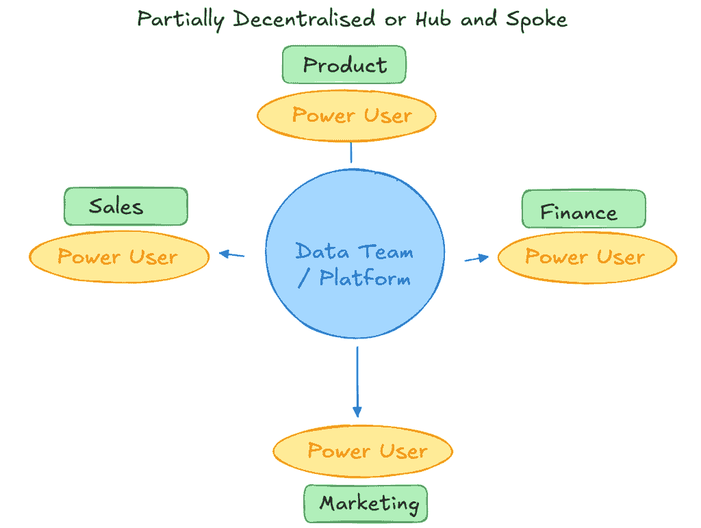
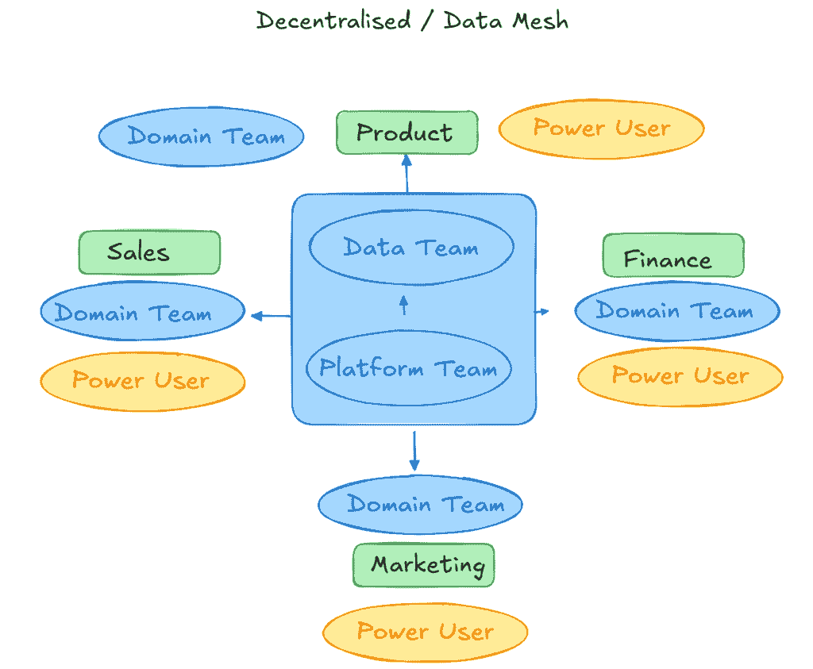

# 平台网格、中心辐射和集中式 | 3 种数据团队类型

> 原文：[`towardsdatascience.com/platform-mesh-hub-and-spoke-and-centralised-3-types-of-data-team/`](https://towardsdatascience.com/platform-mesh-hub-and-spoke-and-centralised-3-types-of-data-team/)

## 引言

在“数据与 AI 的*快速变化的环境*”（!）中，理解数据与 AI 架构的重要性从未如此关键。然而，许多领导者忽视的是数据团队结构的重要性。

虽然阅读这篇文章的许多人可能自认为是数据团队的一员，但大多数人没有意识到这种思维方式可能有多局限。

事实上，不同的团队结构和技能需求显著影响了一个组织实际使用数据和 AI 来驱动有意义结果的能力。为了理解这一点，思考一个类比是有帮助的。

想象一个两人家庭。约翰在家工作，简去办公室。简依赖约翰做很多家务，由于他大部分时间都在家，所以这要容易得多。

简和约翰有了孩子，在孩子长大一些后，约翰需要做双倍的家务！幸运的是，孩子们被训练去做基本的事情；他们可以洗碗、打扫，偶尔在一点强迫下做些吸尘。

随着孩子们的成长，约翰的父母搬了进来。他们年纪很大了，所以约翰照顾他们，但幸运的是，孩子们在这个时候基本上是自给自足的。随着时间的推移，约翰的角色发生了很大的变化！但他始终让这个家庭保持幸福——多亏了约翰和简。

回到数据——约翰有点像数据团队，而其他人则是领域专家。他们依赖约翰，但方式不同。随着时间的推移，这种依赖关系发生了很大变化，如果没有变化，可能会是一场灾难。

在本文的剩余部分，我们将探讨约翰从集中式、通过中心辐射式到平台网格式数据团队的转变之旅。

## 集中式团队

中心团队负责许多您可能熟悉的事情：

+   核心数据平台和架构：用于促进数据和 AI 工作负载的框架和工具。

+   数据和 AI 工程：集中化和清理数据集；为 AI 工作负载结构化非结构化数据

+   BI：构建仪表板以可视化洞察

+   AI 和 ML：在上述清洁数据上训练和部署模型

+   提倡数据的价值并培训人们了解如何使用 BI 工具

这对少数人来说是一项繁重的工作！实际上，一次性完成所有这些几乎是不可能的。最好是保持事情小而可控，专注于几个关键用例，并利用强大的工具尽早取得领先。

你甚至可能需要雇佣一个保姆或家庭助手来帮忙做家务（在这种情况下——顾问）。

但这种模式存在缺陷。很容易陷入[silo trap](https://www.getorchestra.io/blog/the-data-death-cycle-avoiding-the-silo-trap)的陷阱，这是一种中央团队成为数据和人工智能请求巨大瓶颈的场景。数据团队也需要从领域专家那里获取领域知识，以有效地回答请求，这也很耗时且困难。

对于中央团队来说，陷入临时请求的困境往往是不可避免的

一种出路是扩大团队。人越多，产出就越多。然而，还有更好、更现代的方法可以使事情更快地完成。

但只有一个约翰。他能做什么呢？

约翰是中央团队中的一个孤岛。想象一下作者的

## 部分去中心化或中心辐射

部分去中心化的设置对于中等规模的组织或以技术为先的小型组织来说是一个有吸引力的模式，其中[技术技能超出了数据团队的范围](https://eric-arsenaults.medium.com/data-team-architecture-centralized-vs-hub-and-spoke-879e7b436ed6)。

最简单的一种形式是数据团队维护 BI 基础设施，但不维护内容本身。这留给“高级用户”自行处理并构建 BI。

当然，这会遇到各种问题，如 silo 陷阱、[数据发现](https://www.linkedin.com/pulse/data-discovery-what-why-matters-data-semantics/)、治理和[混淆](https://www.route-fifty.com/digital-government/2023/04/analysis-paralysis-when-too-much-data-reduces-decision-making/385570/)。当被要求自助服务的人由于对数据的理解不足而尝试失败时，混淆尤其痛苦。

一种越来越受欢迎的方法是打开堆栈的额外层。有[分析工程师的兴起](https://www.youtube.com/watch?v=Qj1_KgakzqU)，数据分析师越来越多地承担更多责任。这包括使用工具、进行数据建模、构建端到端管道，并向业务部门倡导。

这在实施不当的情况下导致了巨大的问题。你不会让你的五岁儿子无人在场照顾你的长辈和照看房子。

特别是，缺乏基本的数据建模原则和数据仓库引擎会导致模型蔓延和成本螺旋上升。有两个经典例子。

没有良好的数据模型，血缘图可能会变得相当复杂。这个例子相当干净。想象一下作者的

一种情况是当多个人试图定义同一件事时，比如收入。营销、财务和产品都有不同的版本。这导致在季度业务审查时不可避免地出现争论——每个部门都报告不同的数字——分析瘫痪。

另一种是滚动计数。比如说，财务部门想要这个月的收入，但产品部门想知道基于滚动七天的收入情况。“这很简单，”分析师说，“我会创建一些包含这些指标的物化视图”。

任何数据工程师都知道，这种滚动计数操作相当昂贵，特别是如果需要按日或按小时进行粒度划分，因为那时你需要一个日历来“展开”模型。在你意识到之前，就会出现`rolling_30_day_sales`、`rolling_7_day_sales`、`rolling_45_day_sales`等等。这些模型比所需的成本高出一个数量级。

简单地要求最低粒度的需求（每日），实现这一点，并在下游创建视图可以解决这个问题，但需要一些中央资源。

如果数据团队之外的知识是年轻或幼稚的，早期的枢纽和辐射模型必须有一个清晰的职责划分。

在早期枢纽和辐射模型中，像核心数据建模这样的责任位于蓝色圆圈内，而下游任务则分散在责任上。想象一下作者的

随着团队的扩大，像 Apache Airflow 这样的仅代码的遗留框架也会引发一个问题：缺乏可见性。数据团队之外的人试图了解正在发生什么，将依赖于额外的工具来理解端到端发生的情况，因为遗留的用户界面不会从不同来源聚合元数据。

向领域专家展示这些信息是至关重要的。你有多少次被告知“数据看起来不正确”，结果在手动追踪一切之后才发现问题是出在数据生产方？

通过提高可见性，领域专家可以直接与源数据或流程的所有者建立联系，这使得修复可以更快。这消除了数据团队不必要的负载、上下文切换和工单。

## 枢纽和辐射（纯粹）

纯粹的枢纽和辐射模式有点像委托你的青少年子女在明确的轨道内承担具体责任。你不仅仅给他们分配任务，比如倒垃圾和打扫房间，而是要求你想要的结果，比如“干净整洁的房间”，并信任他们去完成。激励措施在这里效果很好。

在纯粹的枢纽和辐射方法中，数据团队管理平台并允许其他人使用它。他们构建构建和部署 AI 和数据管道的框架，并管理访问控制。

如果需要，领域专家可以从头到尾构建东西。这意味着他们可以移动数据，建模，编排管道，并根据自己的需要使用 AI 或仪表板激活它。

通常，中央团队也会做一点这样的工作。当跨领域的模型复杂且重叠时，他们几乎总是应该负责交付核心数据模型。尾巴不应该摇狗。

中央团队只是一个平台，除了他们不是的时候！想象一下作者的

这开始类似于数据产品的心态——虽然财务团队可以负责投资和清理 ERP 数据，但中央团队将拥有重要的数据产品，如客户表或发票表。

这种结构非常强大，因为它非常具有协作性。它通常只有在领域团队具有相当高的技术熟练度时才能有效工作。

这里推荐使用允许代码和无代码一起使用的平台，否则将始终存在对中央团队的硬技术依赖。

这种模式的另一个特点是培训和支援。中央团队或中心将花费一些时间支持和提升辐射团队，以便在约束条件下高效地构建 AI 和数据工作流程。

再次强调，在传统的编排框架中提供可见性是困难的。中央团队将负担着保持元数据存储（如数据目录）更新的任务，这样业务用户才能理解正在发生的事情。

替代方案——提升领域专家的深度 Python 专业知识，学习具有陡峭学习曲线的学习框架，实施起来甚至更难。

## 平台网状/数据产品

在我们的理论家庭旅程的自然终点，我们来到了备受批评的数据网状或平台网状方法。

在这个家庭中，每个人都应该知道自己的责任。孩子们都长大了，可以依赖他们来维持家庭秩序并照顾家庭成员。这里有着紧密的合作，每个人都无缝地一起工作。

听起来很理想主义，不是吗！？

实际上，事情很少这么简单。允许卫星团队使用自己的基础设施和构建他们想要的任何东西，这无疑是失去控制并减慢事情进展的可靠方法。

即使你试图在团队间标准化工具，最佳实践仍会受到影响。

我与无数在大型组织（如零售连锁店或航空公司）中的团队交谈过，避免网状结构并不是一个选项，因为多个业务部门相互依赖。

这些团队使用不同的工具。一些利用 Airflow 实例和多年前顾问构建的遗留框架。其他人则使用最新的技术和完整的、臃肿的现代数据栈。

他们都面临着相同的问题；跨团队的合作、沟通和编排流程。

在这里实施一个用于构建数据和 AI 工作流程的单个综合平台可能会有所帮助。一个[统一控制平面](https://medium.com/@hugolu87/what-actually-is-a-data-control-plane-a587b182ffae)几乎就像编排者的编排者，它汇总不同地点的元数据，并在领域间展示端到端的生命线。

自然地，它形成了一个有效的控制平面，任何人都可以聚集起来调试失败的管道，沟通，并恢复——所有这些都不依赖于中央数据工程团队，否则他们将成为瓶颈。

在软件工程中，对此有明显的类比。通常，代码会产生日志，这些日志由单个工具如 DataDog 汇总。这些平台提供了一个单一的地方来查看所有发生（或未发生）的事情、警报以及事件解决的协作。

## 摘要

组织就像家庭一样。尽管我们都喜欢想象一个庞大、快乐、自给自足的家庭，但往往需要承担一些责任来使事情最初得以顺利进行。

随着组织的成熟，成员们逐渐接近独立，就像约翰的孩子一样。其他人则找到了作为依赖但忠诚的股东的位置，就像约翰的父母一样。

组织也不例外。数据团队正从集中式团队中的执行者成长为以中心和辐射架构中的赋能者。最终，大多数组织将拥有数十人甚至数百人，他们在各自的辐射区域中开创数据与人工智能工作流程。

一旦发生这种情况，小型敏捷组织使用数据和人工智能的方式可能会类似于大型企业中不同团队之间协作和协调的复杂性，这是不可避免的。

理解组织相对于这些模式的位置是至关重要的。试图将数据即产品的心态强加给一个不成熟的公司，或者在大型成熟组织中坚持一个大型的中央团队，将会导致灾难。

祝好运 🍀
