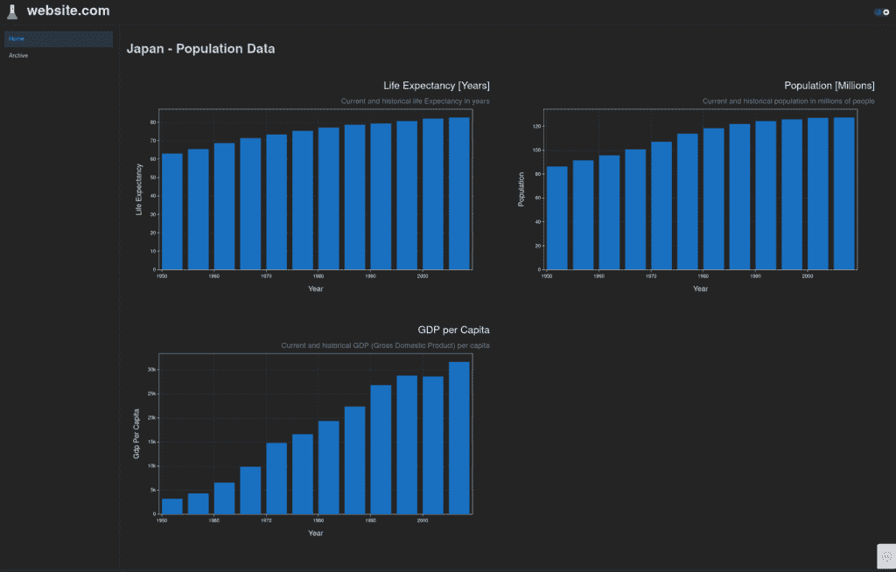
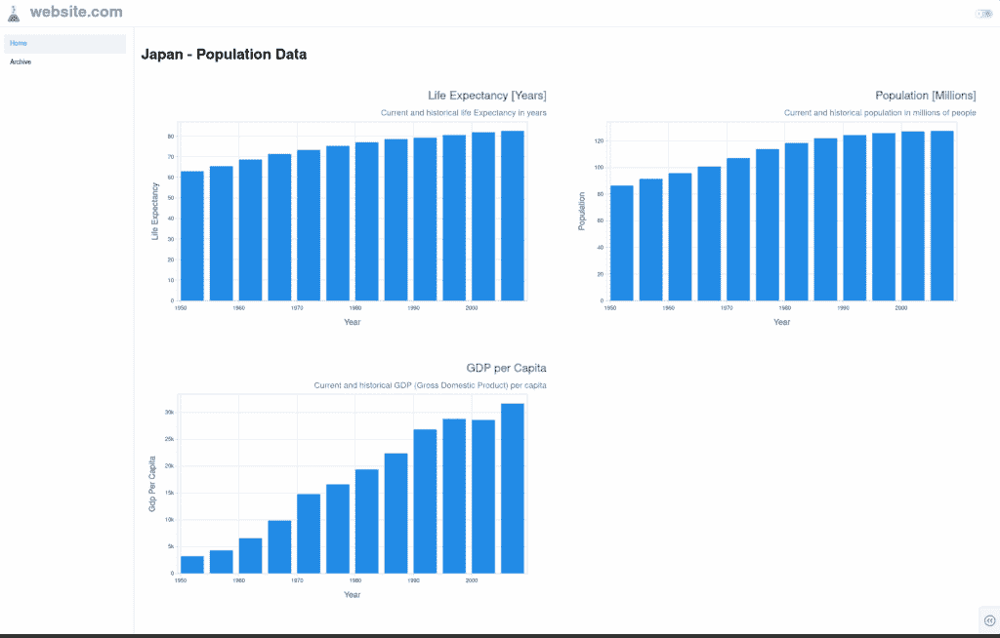
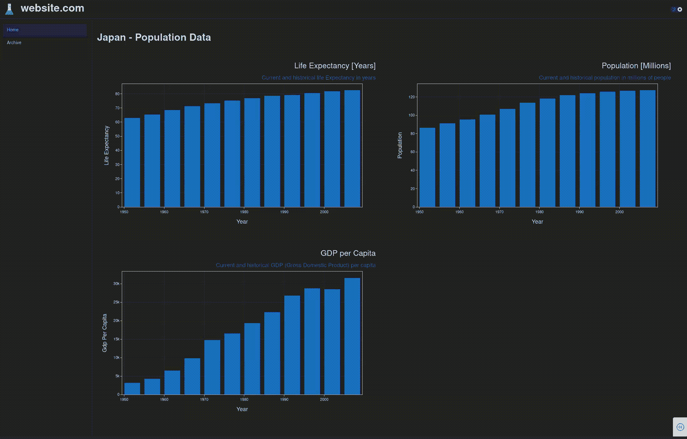
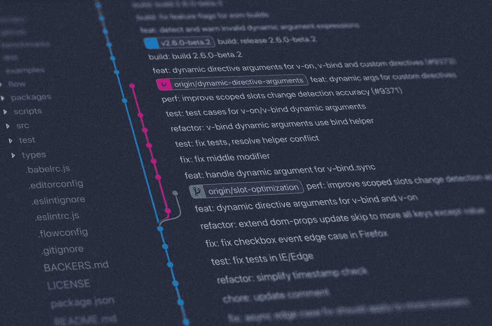
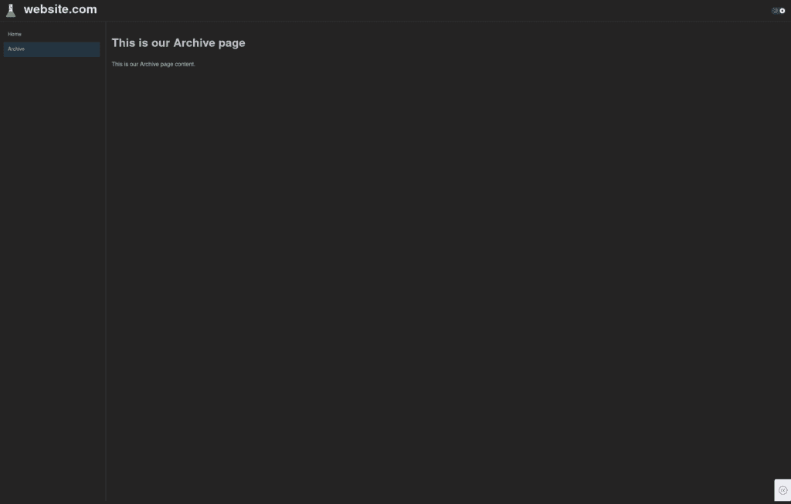

# Plotly Dash — 多页面仪表板的结构化框架

> 原文：[`towardsdatascience.com/plotly-dash-a-structured-framework-for-a-multi-page-dashboard/`](https://towardsdatascience.com/plotly-dash-a-structured-framework-for-a-multi-page-dashboard/)

**[Plotly Dash](https://dash.plotly.com/)是一个<mdspan datatext="el1759450550548" class="mdspan-comment">广泛使用且备受尊重</mdspan>的框架，它允许创建交互式仪表板，便于以易于消化和美观的方式展示各种数据和信息。**

**通常，关于如何创建 Dash 应用程序的示例和指导都包含在一个 Python 文件中的所有代码。虽然这是一种简洁的起始方式，但当所有代码都在一个文件中时，即使是简单的仪表板也可能变得难以管理。**

**本文展示了一个合理且完全功能的多文件项目结构，包含所有启动所需的基本要素。**

**管理和扩展项目，即使项目相当庞大，也应该变得更容易处理。**

***

## 简介

许多用于 Dash 仪表板的在线示例都包含在一个文件中，虽然这对于小型简单的仪表板来说是可以的，但随着项目规模的增加，尤其是扩展到多个页面时，管理起来就变得不可能了。

因此，有必要开始将单个文件拆分，以创建一个逻辑的项目结构，从而使项目管理更加容易。

然而，关于如何以结构化的方式构建多页面应用程序，特别是使用 Dash，指导很少，而且似乎没有标准的“官方”方式来构建 Dash 应用程序。

此外，多页面应用程序的示例通常只展示一个骨架结构，通常不包括任何示例绘图（即它们不是完全功能的）。这导致在实际上运行应用程序并可靠地使用您想要展示的数据时，需要一些猜测。

本文提供了一个完全功能的基础，用户可以立即运行并实验，同时也提供了一个有用的参考点，以便开始开发项目。

***免责声明：我并非以任何方式与 Plotly 有关联。此外，共享的 GitHub 代码库以及本文中的所有功能和示例都可以使用，无需任何付费功能或订阅。***

## 目标

考虑到上述内容，本文主要关注与创建 Dash 仪表板相关的四个项目：

1.  多页面

1.  逻辑项目结构（即不是所有都在一个文件中，而是多文件夹结构）

1.  完全功能，包括数据（API）和绘图（Plotly）

1.  Git 就绪

## 详细功能



显示项目结构特征的精确输出（深色模式）——图片由作者提供——数据来自 [GAPMINDER.ORG](https://www.gapminder.org/)，[CC-BY 许可证](https://www.gapminder.org/free-material/)

### 摘要

除了上一节中详细说明的主要目标之外，还包含以下功能，以提供一个可用、美观且功能齐全的基础：

1.  一个侧边栏，列出可用的页面，并在页面更改时突出显示当前活动页面

1.  一个包含网站名称、标志和深色/浅色主题切换的页眉

1.  移动端响应式布局，带有可折叠的侧边栏

1.  深色/浅色主题切换，包括 Plotly 图表的深色/浅色主题

1.  两种不同的 API 集成，一个是本地 ([Plotly Gapminder](https://plotly.com/python-api-reference/generated/plotly.express.data.html))，另一个是远程，带有 API 密钥的逻辑 ([NinjasAPI](https://api-ninjas.com/))

1.  Git 就绪，包含将 API 密钥从代码中排除的逻辑，以及自动 DEBUG/生产模式 ([python-dotenv](https://github.com/theskumar/python-dotenv))

1.  使用 style.css 的定制样式的一个简单示例

1.  使用 [DASH Mantine 组件](https://www.dash-mantine-components.com/) 进行通用样式设计，提供一致的主题

下面的子部分将更详细地解释框架中包含的一些功能。

如果你在寻找代码，请跳转到文章末尾，在那里你可以找到包含代码和如何开始的详细信息的 GitHub 仓库链接。

### 使用 DASH Mantine 组件进行样式设计



显示项目结构特征的精确输出（浅色模式）——图片由作者提供——数据来自 [GAPMINDER.ORG](https://www.gapminder.org/)，[CC-BY 许可证](https://www.gapminder.org/free-material/)

在没有前端框架的帮助下，可以样式化一个 Dash 仪表板。然而，总的来说，我怀疑优先级将是快速有效地展示数据，因此没有必要使事情比必需的更复杂。

因此，本文中介绍的框架利用 [Dash Mantine 组件](https://www.dash-mantine-components.com/) 进行样式设计，这是一个广泛使用且专为与 Dash 仪表板一起使用而设计的现代样式 API：

> 构建功能丰富、易于访问的 Dash 应用程序比以往任何时候都要快！Dash Mantine 组件包括基于 React Mantine 库的 100 多个可自定义组件，具有一致的样式、主题和全支持浅色和深色模式。
> 
> – [dash-mantine-components.com](https://www.dash-mantine-components.com/)

尤其是本项目结构选择的布局是基于以下官方布局示例：

[带有主题切换组件的 AppShell – GitHub](https://github.com/snehilvj/dmc-docs/blob/main/help_center/appshell/appshell_with_theme_switch.py)

尽管官方布局的整体外观与本文使用的布局非常相似（正如您所期望的…），但官方布局中并没有内置功能，所有代码都在一个 Python 文件中。

### 暗黑/亮白图切换



上一节中详细说明的基本主题已经包含了切换亮暗主题的代码。

然而，一旦添加了不是特定“Mantine”组件（例如 plotly 图表）的组件，那么没有特定集成的这些“其他”组件的主题切换将不会工作。

本文包含的框架包括示例 plotly 图表，以及切换图表到暗黑和亮白主题的相关代码。

暗黑/亮白切换的实现无需重新加载图中显示的数据，因此切换时不会超载任何数据 API。

### 多页面

框架中包含的更复杂的项目之一是它包含多个页面。

实现使用的是通过[Dash Pages](https://dash.plotly.com/urls)实现这一点的最新方法，该方法在 Dash 2.5 中引入。

尽管 Dash Pages 的实现相对简单直接，但当项目结构化为多个文件和文件夹时，情况变得更加复杂，因为可用的示例非常少。

希望这个框架能提供关于一个有效示例应该是什么样的指导。

### Git 和开发就绪



由[Yancy Min](https://unsplash.com/@yancymin?utm_content=creditCopyText&utm_medium=referral&utm_source=unsplash)在[Unsplash](https://unsplash.com/photos/a-close-up-of-a-text-description-on-a-computer-screen-842ofHC6MaI?utm_content=creditCopyText&utm_medium=referral&utm_source=unsplash)上的照片

由于这个框架旨在成为您自己项目的起点，因此假设将进行一些开发，并且持续开发可能需要使用 Git。

下面的子节详细介绍了这个框架的一些特性，这些特性有助于使这个过程更容易。

#### 环境变量

该框架使用[python-dotenv](https://github.com/theskumar/python-dotenv)来处理环境变量（有关实现细节，请参阅文章后面的“基本用法”部分）。

这实际上意味着某些变量可以保留在项目本地，但不在主代码库中。例如：

1.  在生产环境和开发环境之间变化的变量

1.  不应在公共仓库（例如 GitHub）中出现的变量（即不应出现在主代码库中）

这允许 API 密钥保持机密，并通过 GitHub 无缝推送到生产环境（如果您愿意这样做）。

#### Git 忽略

`.gitignore` 文件主要包含阻止虚拟环境和至关重要的 `.env` 文件意外推送到 GitHub。

它还包括一些基于 Python 的通用排除项，可能有所帮助。

### 生产服务器已准备就绪

为了帮助部署 Dash 应用到生产环境，包含了一个 `wsgi.py` 文件，当项目上线时应该很有用。

之前章节中提到的 `.env` 文件也可以用于在生产环境和开发环境之间无缝激活（或停用）`DEBUG` 模式。（有关实现细节，请参阅文章后面的“基本用法”部分）

### API 集成


图片由 [zeeve 平台](https://pixabay.com/users/zeeve-31662367/?utm_source=link-attribution&utm_medium=referral&utm_campaign=image&utm_content=7693848) 提供，来自 [Pixabay](https://pixabay.com//?utm_source=link-attribution&utm_medium=referral&utm_campaign=image&utm_content=7693848)

代码库中集成了两个数据 API。

#### Gapminder（默认）

第一个是包含在 Plotly 库中的 Gapminder API [库](https://plotly.com/python-api-reference/generated/plotly.express.data.html)。

这使得 API 在本地可用且快速，这对于快速开发和测试来说非常好。

#### API Ninjas

还包含了一些示例代码，展示了如何集成外部 API。

在这个特定案例中，包含的外部 API 是 API Ninjas。这应该基本上允许进行更真实的远程 API 测试，如果您需要这样做（即，对不良或丢失的连接或 API 错误进行会计/测试）。

API Ninjas 是一个商业 API，因此在使用量超过一定水平后会有订阅费用。然而，他们的免费层是我找到中最慷慨的之一，这使得它非常适合开发测试。

要使用 API Ninjas API，您需要获取自己的 API 密钥（可以从他们的[网站](https://api-ninjas.com/)获取一个免费的*有限*使用 API 密钥）。然后需要将 API 密钥包含在 `.env` 文件中。最后，将 `utils/consts.py` 中的 `EXTERNAL_API` 标志设置为 `True`。

**免责声明：** *我绝不是 API Ninjas 的关联方，请随意使用您选择的任何外部 API（或根本不使用）！*

### CSS 样式

可以在项目中的 CSS 文件中包含特定的样式。此文件位于 `assets/styles.css`，并包含以下代码：

```py
.main-title {
    color: var(--mantine-color-gray-6);
}

[data-mantine-color-scheme="dark"] .main-title {
    color: var(--mantine-color-gray-3);
}
```

示例中只是将主标题改为灰色，但也考虑了在深色和浅色主题之间切换时的颜色变化。

如果您熟悉 CSS，如果需要，可以从此文件进行广泛的样式更改。

关于如何处理外部资源（如 CSS 或 Javascript）的更多详细信息，请参阅 [Dash 文档](https://dash.plotly.com/external-resources)。

## 重要编码注意事项



框架应用程序的第二页 – 图像由作者提供

Dash 在允许构建仪表板/应用程序的方法方面非常灵活，这使得事情变得简单易用。

然而，在构建这个框架的过程中，变得明显的是，当事情变得更加复杂时，需要遵循一些未成文的规则。

> 它是**必要的**，使用函数而不是将元素分配给变量来生成应用程序元素。

尤其是在处理多页 Dash 应用程序，具有文件和文件夹结构时，使用函数而不是将元素分配给变量来生成应用程序元素是**必要的**。

例如，以这个项目中使用的存档页面定义为例。

这是使用函数定义的存档页面：

```py
import dash
from dash import html

dash.register_page(__name__)

def layout(**kwargs) -> html.Div:
    return html.Div(
        [
            html.H1("This is our Archive page"),
            html.Div("This is our Archive page content."),
        ]
    )
```

…并且这是使用变量定义的同一页：

```py
import dash
from dash import html

dash.register_page(__name__)

layout = html.Div(
        [
            html.H1("This is our Archive page"),
            html.Div("This is our Archive page content."),
        ]
    )
```

理论上它们都是有效的，并且应该都能正常工作，正如[官方文档](https://dash.plotly.com/urls)中所示。

通常情况下，给变量赋值会**有时**有效。然而，在某些情况下，在单独的文件/文件夹之间传递变量可能会失败。而使用函数则总是有效。

不幸的是，我无法回忆起一个具体的例子，但我亲身经历过这种情况，这就是为什么这个框架在代码中需要在文件/文件夹之间传递元素时，会严格使用函数。

不论如何，使用函数可以说是更透明、更负责任的编码方式，从长远来看，这种方式更有意义。

### 变量类型

您可能会注意到，所有函数都包含了变量类型。

由于代码库是用 Python 编写的，这并不是严格必要的。希望这有助于人们在阅读代码库并试图理解不同部分如何组合在一起时提高透明度。

如果您觉得它令人困惑或无助于理解，那么可以随时删除，而不会产生任何不良影响。

例如，将这个：

```py
def get_graph(index: str) -> dmc.Skeleton:
```

变成这样：

```py
def get_graph(index):
```

完全可以。

## 存储库


您可以访问本文讨论的 DASH 项目结构的 GitHub 页面 – 图像由作者提供

一个完全工作的示例 Dash 应用程序，使用本文中涵盖的结构，可在我的 GitHub 存储库中找到：

[Plotly Dash 多页应用程序](https://github.com/thetestspecimen/plotly-dash-multi-page-app)

可以直接克隆和运行此存储库以查看工作原理，或者将其用作您自己项目的起点。

## 基本用法


图片由[Eder Pozo Pérez](https://unsplash.com/@ederpozo?utm_content=creditCopyText&utm_medium=referral&utm_source=unsplash)在[Unsplash](https://unsplash.com/photos/a-rusted-metal-sign-with-writing-on-it-8ana6mu0V_Q?utm_content=creditCopyText&utm_medium=referral&utm_source=unsplash)上提供

要运行存储库中的代码，请按照以下步骤操作。

### 创建你的虚拟环境并安装包

创建你的虚拟环境并激活它。你可以根据自己的选择来做。例如：

```py
cd project-folder 
python -m venv venv 
source venv/bin/activate
```

然后安装所需的包：

```py
pip install --upgrade pip
pip install -r requirements.txt
```

### 创建一个“.env”文件

该项目使用`python-dotenv`通过使用本地文件存储敏感数据来将 API 密钥等数据从项目代码中排除。因此，你不会在存储库中找到此文件。你需要创建自己的文件。

在项目文件夹的根目录下创建一个名为：`.env`的文件。

作为文件中可以包含内容的示例，以下是在本地开发环境中可能使用的内容：

```py
DEBUG = True 
NINJAS_API_KEY = "s0L889BwIkT2ThjHDROVGH==fkluRlLyGgfUUPgh"
```

**注意：** *如果你想要使用特定的 API，你需要从 NinjasAPI 获取一个合法的 API 密钥，但 Gapminder 本地 API 是默认的，因此运行应用程序不需要这样做。除了包括一个可用的 API 密钥以使用 NinjasAPI 之外，你还需要将`utils/consts.py`中的`EXTERNAL_API`标志设置为`True`。*

在实时/开发环境中，你应该将`DEBUG`值更改为`False`。

利用这种方法的优势在于能够使用 Git 在开发和生产环境之间更新代码，而不必每次都更改`.env`文件中的`DEBUG`值。

这是因为`.env`文件不包括在 Git 存储库中，因此它是创建在的机器/服务器上独有的。

### 运行项目

要运行项目，只需在项目目录中执行以下行：

```py
python main.py
```

然后，你会被告知可以打开浏览器以访问项目前端的本地 IP 地址。

## 结论

希望这篇文章和相关的 GitHub 存储库能为你使用 Plotly Dash 创建自己的仪表板或仅仅是了解如何进入下一阶段提供一个良好的起点。

如果你对该代码有任何评论或改进意见，请随时在此文章下评论，或在相关的[GitHub 存储库](https://github.com/thetestspecimen/plotly-dash-multi-page-app)上打开一个 issue / pull request。

## 参考文献

[Plotly DASH](https://dash.plotly.com/)

[DASH Mantine 组件](https://www.dash-mantine-components.com/)

[GAPMINDER.ORG](https://www.gapminder.org/)，[CC-BY 许可证](https://www.gapminder.org/free-material/)
