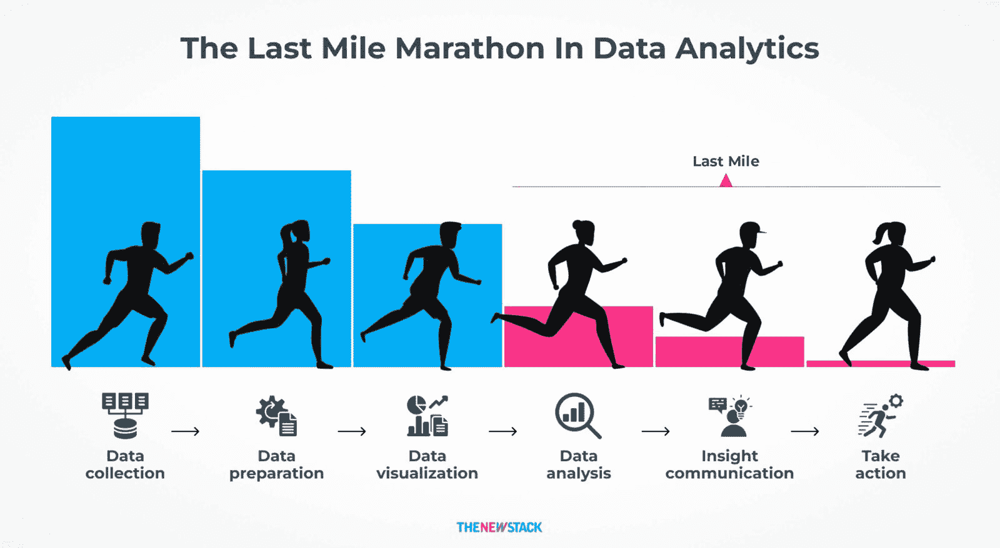

# Plotly 的 AI 工具正在重新定义数据科学工作流程

> 原文：[`towardsdatascience.com/plotlys-ai-tools-are-redefining-data-science-workflows/`](https://towardsdatascience.com/plotlys-ai-tools-are-redefining-data-science-workflows/)

有什么比构建一个强大的数据模型然后却难以将其转化为利益相关者可以使用以实现其期望结果的工具更令人沮丧的吗？数据科学从未缺乏潜力，但也从未缺乏复杂性。你可以在精心挑选的数据集上优化算法，但仍然面临从原型和笔记本到生产应用程序的障碍。这一最后一步，通常被称为“最后一公里”，[影响了 80%的数据科学成果](https://www.predinfer.com/blog/first-middle-last-mile-problems-of-data-science/)，并需要不超负荷数据团队的解决方案。

自 2013 年成立以来，Plotly 一直是 TDS（Towards Data Science）的热门话题，贡献者已经[发布了超过 100 篇关于 Plotly 工具的指南](https://towardsdatascience.com/tag/plotly/)。这种持续的生产力表明数据科学社区非常重视将代码、可视化和交互式仪表板结合起来。

Plotly 的首席产品官 Chris Parmer 一直倡导分析师应该能够“无需与整个 Web 框架搏斗就能快速启动交互式应用程序”的理念。这一愿景现在推动了 Plotly 最新发布的[Dash Enterprise](https://go.plotly.com/elevate-your-analytics?utm_source=Webinar:%20Dash%20Enterprise%205.7&utm_medium=Towards_Data_Science&utm_content=article_aitools)，旨在简化从模型到生产级数据应用程序的飞跃。

Plotly 的最新创新反映了数据科学领域向更易于使用、适用于生产的工具转变的趋势，这些工具帮助团队将洞察转化为可操作的解决方案。

本文将探讨三个关键问题：

+   什么使得数据科学的“最后一公里”如此具有挑战性？

+   什么瓶颈使传统数据工作流程变得缓慢和低效？

+   那么你如何应用 Plotly 的 AI 能力更快地构建、分享和部署[交互式数据应用程序](https://plotly.com/blog/what-is-a-data-app?utm_medium=Towards_Data_Science&utm_content=article_aitools)呢？

## 面对最后一公里问题

数据科学的“最后一公里”可能非常艰难。你可能会花几个月的时间完善模型，但最终发现除了你的分析团队外，没有人完全理解输出。静态笔记本或临时脚本很少提供决策者所需的交互性。

一些团队满足于使用 Jupyter Notebook 或单个脚本进行快速的概念验证，希望快速展示价值。许多团队除非组织投资于昂贵的基础设施，否则永远不会升级。较小的团队可能没有时间或资源将原型转化为影响日常决策的工具。

[*数据科学中的最后一英里问题。改编自 Brent Dykes*](https://www.linkedin.com/feed/update/urn:li:activity:6864264501315874816/?%20commentUrn=urn%3Ali%3Acomment%3A(activity%3A6864264501315874816%2C6%20866097309462224896)

在大型公司中，安全协议、基于角色的访问和持续部署可能会增加更多的复杂性。这些层可能会让您陷入类似于全栈开发的角色，只是为了将您的见解展示给利益相关者。延迟不断累积，尤其是在高级领导者想要测试实时场景但必须等待代码更改以查看新指标时。

团队必须超越孤立的笔记本和手动工作流程，采用自动化、交互式的工具，更快地将见解转化为行动。Plotly 通过[将 AI 嵌入到 Dash 中](https://plotly.com/dash/plotly-ai/?utm_medium=Towards_Data_Science&utm_content=article_aitools)来满足这一需求。

Plotly Dash 是一个开源的 Python 框架，用于构建用于分析的交互式 Web 应用程序。它简化了创建基于 Web 的数据分析和展示界面的过程，而无需广泛的 Web 开发知识。

Plotly Dash Enterprise 扩展并增强了开源框架，以实现创建用于运营决策的复杂生产级应用程序。Plotly Dash Enterprise 提供了企业所需的发展功能和平台及安全能力，例如 AI、应用商店、DevOps、安全集成、缓存等。

Dash Enterprise 的最新版本自动化了重复性任务，为数据可视化和应用程序生成 Python 代码，并加速了 Plotly App Studio 内的开发。这些增强功能让您能够专注于优化模型、提升洞察力，并交付满足业务需求的应用程序。

## Dash Enterprise 内部：AI 聊天、数据探索器等

[Plotly 最新发布的 Dash Enterprise](https://go.plotly.com/elevate-your-analytics?utm_source=Webinar:%20Dash%20Enterprise%205.7&utm_medium=Towards_Data_Science&utm_content=article_aitools)将 AI 置于核心位置。其“Plotly AI”功能包括一个聊天界面，可以将您的普通英语提示，如“使用我们的月度 SQL 数据构建销售预测仪表板”，转换为功能性的 Python 代码。作为高级用户，您可以使用自定义逻辑来优化该代码，如果您不太技术，现在您可以构建以前需要专业帮助的原型。

[Parmer 解释](https://www.youtube.com/watch?v=FqAO3UWsNBw),

> *“通过将高级 AI 直接集成到 Dash 中，我们正在简化整个开发过程。您可以从一个想法或数据集开始，比以往任何时候都更快地看到功能性的 Web 应用程序。”*

Dash Enterprise 还引入了一种数据探索模式，您可以使用它来生成图表、应用过滤器以及更改参数，而无需编写代码。对于更喜欢直接代码工作流程的数据科学家，它提供了对自动生成组件进行细分的灵活性。更新进一步扩展了集成 SQL 编写单元格和更简单的应用程序嵌入，缩短了从概念到生产的距离。

在 Dash Enterprise 的最新版本中，用户体验通过 App Studio 取得了重大进步，App Studio 是一个基于图形用户界面的环境，用于创建和改进 Dash 应用程序。随着大型语言模型（LLM）将您的提示转换为 Python 代码，该代码在界面中完全可见并可编辑。您永远不会被阻止直接修改或扩展生成的代码，这为您提供了调整应用程序每个方面的灵活性。

这种人工智能辅助开发和易于访问的设计的结合意味着数据应用程序不再需要单独的团队或复杂的框架。正如 Parmer 所说：“如果其他人无法探索或理解数据科学家生产的出色模型，那么这还不够。我们的目标是消除障碍，以便人们可以轻松地分享见解。”

## Dash Enterprise 对您的数据项目意味着什么

如果您已经建立了工作流程，您可能会想知道为什么这个 Dash Enterprise 版本很重要。即使是最精确的模型也可能失败，如果决策者无法与结果互动。随着新版本的发布，您可以通过以下方式减少构建数据应用程序的负担并更快地提供见解：

+   通过交互式图表和仪表板构建更丰富的可视化，以更深入的数据故事适应您的数据。您可以看到 [加拿大帝国商业银行（CIBC）的定量解决方案团队](https://plotly.com/user-stories/cibc/?utm_medium=Towards_Data_Science&utm_content=article_aitools)如何使用 Dash Enterprise 帮助分析师和交易台开发满足他们需求的生产级应用程序。

+   使用新的基于图形用户界面的 App Studio 来构建、修改和扩展数据应用程序，而无需编写代码，同时仍然可以访问 Python 以实现完全控制。[Intuit 的实验团队](https://plotly.com/user-stories/intuit/?utm_medium=Towards_Data_Science&utm_content=article_aitools)采取了这种方法，现在有超过 500 名员工使用这些工具，将实验运行时间减少了 70% 以上。

+   通过将 Dash Enterprise 与 Databricks 等工具集成来管理复杂的数据集，自信地维护性能，因为数据扩展。标准普尔全球公司（S&P Global）采用了这种方法，将推出面向客户的数据产品所需的时间从九个月缩短到仅仅两个月。

+   通过内置的安全功能、版本控制和基于角色的访问控制，添加安全性和控制，以保护随着数据增长的数据应用程序。加拿大帝国商业银行（CIBC）依靠这些功能在不同地区的团队中部署应用程序，而不会损害安全性。

如果你在一个 MLOps 团队中，你可能发现将数据转换和用户权限结合起来更简单。在金融、医疗保健和供应链分析中，这些是不可或缺的，因为及时的决定依赖于实时数据。通过减少管理管道所需的手动工作量，你可以花更多的时间完善模型并更快地提供洞察。

使用 Plotly 的开放和可扩展的方法，你不会被锁定在供应商特定的算法中。相反，你可以在 Dash 中直接嵌入任何基于 Python 的机器学习模型或分析工作流程。这种设计在 [Databricks](https://plotly.com/blog/data-ai-summit-plotly-reflections/?utm_medium=Towards_Data_Science&utm_content=article_aitools) 中已被证明是有价值的，该团队使用 Plotly Dash 构建了一个监控基础设施使用和成本的观察性应用程序。

[壳牌和彭博社](https://plotly.com/blog/data-ai-summit-plotly-reflections/?utm_medium=Towards_Data_Science&utm_content=article_aitools) 的团队也采用了 Plotly Dash Enterprise，用于数据治理、高密度可视化、主题投资等多个用例——所有这些都突显了这些功能如何在一个单一用户界面中连接数据、人工智能和商业智能。

## 那么，接下来是什么？

人工智能正在改变数据应用程序的构建方式、数据产品的交付方式以及洞察的共享方式。Plotly 位于应用程序开发、数据故事讲述和企业需求交汇的十字路口。要了解 Plotly 如何应对这一转变，请观看[启动网络研讨会](https://go.plotly.com/elevate-your-analytics?utm_source=Webinar:%20Dash%20Enterprise%205.7&utm_medium=Towards_Data_Science&utm_content=article_aitools)，并关注即将推出的电子书，其中详细介绍了使用人工智能构建更智能数据应用程序的经过验证的策略。

将人工智能嵌入到 Dash 中可以自动化开发过程的部分，使非技术团队更容易构建数据应用程序。然而，技术技能和周密的规划仍然是构建可靠、实用解决方案的关键。数据的世界已经超越了散乱的笔记本和短暂的原型。现在的重点是生产就绪的解决方案，这些解决方案可以指导有意义的决策。随着人工智能的快速发展，**“实验性分析”**与“**运营决策**”之间的差距可能最终缩小——这是许多人都期待的事情。

* * *

*[在此](https://contact.towardsdatascience.com/how-ai-is-shaping-the-future-of-data-app-development) 预注册，以获得由 Plotly 赞助的 Towards Data Science 的第一本电子书：*

**人工智能如何塑造数据应用程序开发的未来**

**从图表到聊天机器人和更多**

* * *

**关于我们的赞助商**

Plotly 是开源图形库和高端分析解决方案的领先提供商。其旗舰产品 Dash Enterprise 允许组织构建可扩展且交互式的数据应用，从而推动有影响力的决策。更多信息请访问 [`www.plotly.com`](http://www.plotly.com?utm_medium=Towards_Data_Science&utm_content=article_aitools).
