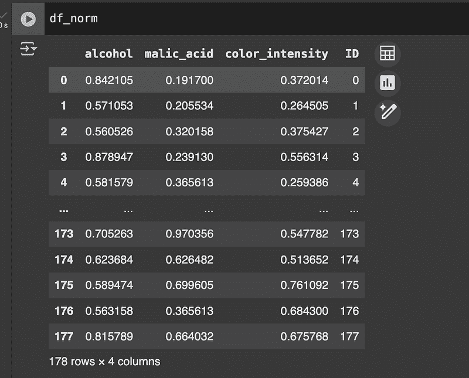
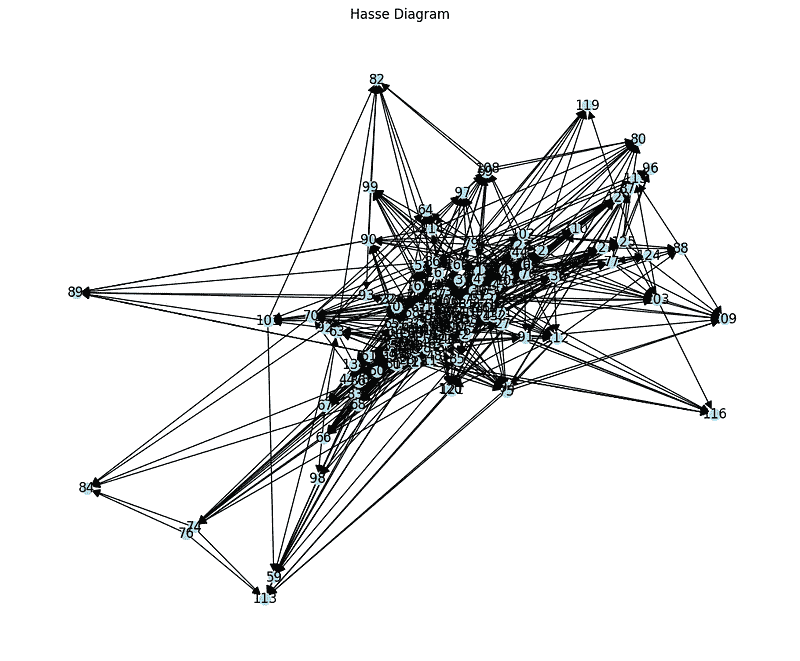
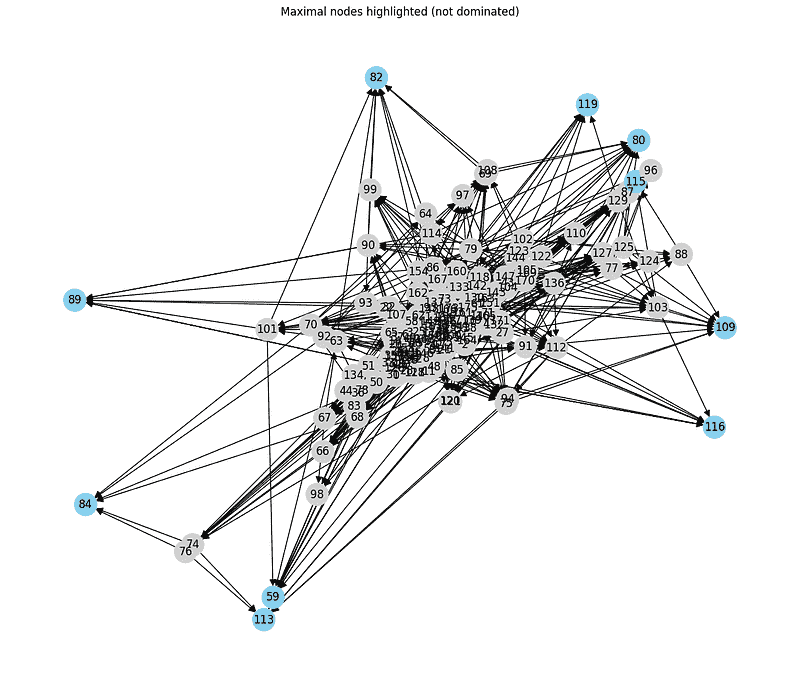

# POSET 在 Python 中的表示对商业有巨大影响

> 原文：[`towardsdatascience.com/poset-representations-in-python-have-huge-impact-on-business/`](https://towardsdatascience.com/poset-representations-in-python-have-huge-impact-on-business/)

<mdspan datatext="el1751926615396" class="mdspan-comment">综合合成指数</mdspan>是广泛使用的工具，用于将多个指标总结成一个单一数值。

它被用于各种领域：从企业绩效评估和城市生活质量，到医疗系统的效率。**目标是提供一个简单、可解释且可比较的衡量标准**。然而，这些指数的表面简单性往往掩盖了**任意决策、信息丢失和结果层次结构的扭曲**。

主要问题之一与权重分配有关：**对某个指标赋予比另一个指标更大的权重意味着主观偏好**。此外，将综合成一个单一数字迫使进行总排序，即使是在多个维度上以不可比方式不同的单元之间，通过单一分数强制线性排序会导致过度简化和可能误导的结论。

鉴于这些局限性，存在替代方法。在这些方法中，POSETs（偏序集）提供了一种更忠实于表示多维数据复杂性的方法。

与将所有信息综合成一个数字不同，POSETs 基于**部分支配关系**：一个单元在所有考虑的维度上更大时，它支配另一个单元。**当这种情况不发生时，两个单元保持不可比**。POSET 方法允许我们表示数据中隐含的层次结构，而不强制进行逻辑上不合理的比较。这使得它在需要方法一致性的透明决策环境中特别有用。这种方法比强制简化更受欢迎。

从理论基础出发，我们将使用一个真实的数据集（葡萄酒质量数据集）构建一个实际示例，并讨论结果解释。我们将看到，在存在冲突维度的情况下，POSETs 代表一个**稳健且可解释的解决方案**，在保留原始信息的同时，不施加任意排序。

## 理论基础

要理解 POSET 方法，必须从集合论和排序的一些基本概念开始。与产生单元之间总排序和强制排序的聚合方法不同，**POSET 基于部分支配关系**，这使我们能够识别元素之间的**不可比性**。

### 什么是偏序集？

一个偏序集（POSET）是一个二元组（P, ≤），其中

+   P 是一个非空集合（可以是地点、公司、人、产品等）

+   ≤是 P 上的二元关系，具有**三个特性**

1.  ***自反性***，每个元素都与自身相关（表示为 ∀ *x* ∈ *P*，*x* ≤ *x*)

1.  ***反对称性***，如果两个元素在两个方向上相互关联，则它们是相同的（表示为 ∀ *x*，*y* ∈ *P*，( *x* ≤ *y* ∧ *y* ≤ *x*) ⇒ *x* = *y)*

1.  ***传递性***，如果一个元素与第二个元素相关联，第二个元素与第三个元素相关联，那么第一个元素也与第三个元素相关联（表示为 ∀ *x*，*y*，*z* ∈ *P*，(*x* ≤ *y* ∧ *y* ≤ *z*) ⇒ *x* ≤ *z*）

在实际意义上，一个元素 *x* 被说成是 *支配* 另一个元素 *y*（因此 *x* ≤ *y*），**如果它在所有相关维度上更大或相等，并且在至少一个维度上严格大于**。

这种结构与 **全序** 相对立，在全序中，每个元素对都是可比较的（对于每个 *x*，*y*，则 *x* ≤ *y* 或 *y* ≤ *x*）。另一方面，偏序 **允许某些对是不可比的**，这是其分析力量之一。

### 部分支配关系

在多指标环境中，通过引入 **向量之间的支配关系** 来构建部分系统。给定两个对象 *a = (a[1], a[2], …, a[n])* 和 *b = (b[1], b[2], …, b[n])*，我们可以说 *a* ≤ *b* (*a 支配 b*) 如果：

+   对于每个 i，a[i] ≤ b[i]（意味着 *a* 在任何维度上都不是最差的元素）

+   并且至少对于某个 j，a[j] ≤ b[j]（意味着 *a* 在至少一个维度上比 *b* 严格更大）

**这种关系构建了一个支配矩阵**，它表示数据集中哪个元素支配了哪个其他元素。如果两个对象不满足相互的支配标准，它们是 **不可比的**。

例如，

+   如果 *A = (7,5,6)* 和 *B = (8,5,7)*，那么 *A* ≤ *B*（因为 B 在每个维度上至少相等，并且在其中两个维度上严格大于）

+   如果 *C = (7,6,8)* 和 *D = (6,7,7)*，那么 *C* 和 *D* 是不可比的，因为每个元素在至少一个维度上大于另一个，但在其他维度上更差。

这种显式的不可比性是 POSET 的一个关键特征：**它们在不强制进行排名的情况下保留原始信息**。在许多实际应用中，例如葡萄酒、城市或医院的品质评估，不可比性不是一个错误，而是对复杂性的忠实反映。

## 如何构建 POSET 索引

在我们的例子中，我们使用包含 1599 红葡萄酒的数据集 winequality-red.csv，每个葡萄酒由 11 个化学物理变量和一个品质评分描述。

您可以在此下载数据集：

[**葡萄酒质量数据集**](https://www.kaggle.com/datasets/yasserh/wine-quality-dataset)

[*葡萄酒质量预测 – 分类预测* www.kaggle.com](https://www.kaggle.com/datasets/yasserh/wine-quality-dataset)

该数据集的 [许可证是 CC0 1.0 通用](https://creativecommons.org/publicdomain/zero/1.0/)，这意味着可以无需任何特定许可下载和使用。

输入变量包括：

1.  固定酸度

1.  挥发性酸度

1.  柠檬酸

1.  残糖

1.  氯化物

1.  自由二氧化硫

1.  总二氧化硫

1.  密度

1.  pH

1.  硫酸盐

1.  酒精

输出变量是*质量*（介于 0 到 10 之间的分数）。

我们可以（并将）排除分析中的变量：目标是构建一组与“质量”概念一致且具有共享方向性的指标（值越高=越好，反之亦然）。例如，高挥发酸值是负面的，而高酒精值通常与优质相关。

一个合理的选择可能包括：

+   酒精（正面）

+   挥发性酸（负面）

+   硫酸盐（正面）

+   残糖（在一定点之前为正，之后为中性）

+   柠檬酸（正面）

对于 POSET，**标准化语义方向非常重要**：如果一个变量有负面影响，必须在评估支配关系之前进行转换（例如，-Volatile_acidity）。

### 构建支配矩阵

要构建观察值（葡萄酒）之间的部分支配关系，请按以下步骤操作：

+   从数据集中抽取 N 个样本观察值（例如，为了可读性，20 种葡萄酒）。

+   每种葡萄酒由一个*m*个指标的向量表示

+   如果 A 大于或等于 B，并且至少有一个元素是严格大于的，则观察 A 支配 B。

### Python 中的实际示例

葡萄酒数据集也存在于 Sklearn 中。我们使用 Pandas 来管理数据集，Numpy 进行数值运算，Networkx 构建和查看 Hasse 图。

```py
import pandas as pd
import numpy as np
import matplotlib.pyplot as plt
import networkx as nx
from sklearn.datasets import load_wine
from sklearn.preprocessing import MinMaxScaler

# load in the dataset
data = load_wine()
df = pd.DataFrame(data.data, columns=data.feature_names)
df['target'] = data.target

# let's select an arbitrary number of quantitative features
features = ['alcohol', 'malic_acid', 'color_intensity']
df_subset = df[features].copy()

# min max scaling for comparison purposes
scaler = MinMaxScaler()
df_norm = pd.DataFrame(scaler.fit_transform(df_subset), columns=features)

df_norm['ID'] = df_norm.index
```

数据集的每一行代表一种葡萄酒，由 3 个数值特征描述。比如说：

+   如果葡萄酒 A 在所有尺寸上都有大于或等于的值，并且在至少一个尺寸上严格大于，则葡萄酒 A 支配葡萄酒 B。

这只是一个部分系统：你并不总是可以说一款酒比另一款“更好”，因为可能一款酒酒精含量更高但颜色强度更低。



我们构建支配矩阵 D，其中 d[i][j] = 1 如果元素 i 支配 j。

```py
def is_dominant(a, b):
   """Returns True if a dominates b"""
   return np.all(a >= b) and np.any(a > b)

# dominance matrix
n = len(df_norm)
D = np.zeros((n, n), dtype=int)

for i in range(n):
   for j in range(n):
       if i != j:
           if is_dominant(df_norm.loc[i, features].values, df_norm.loc[j, features].values):
               D[i, j] = 1

# let's create a pandas dataframe
dominance_df = pd.DataFrame(D, index=df_norm['ID'], columns=df_norm['ID'])
print(dominance_df.iloc[:10, :10])

>>>
ID  0  1  2  3  4  5  6  7  8  9
ID                             
0   0  0  0  0  0  0  0  0  0  0
1   0  0  0  0  0  0  0  0  0  0
2   0  0  0  0  0  0  0  0  0  0
3   1  1  0  0  0  1  0  0  0  1
4   0  0  0  0  0  0  0  0  0  0
5   0  0  0  0  0  0  0  0  0  0
6   0  1  0  0  0  0  0  0  0  0
7   0  1  0  0  0  0  0  0  0  0
8   0  0  0  0  0  0  0  0  0  0
9   0  0  0  0  0  0  0  0  0  0 
```

对于每一对 i，j，矩阵返回

+   1 如果 i 支配 j

+   否则 0

例如，在第 3 行，你会在列 0、1、5、9 中找到值 1。这意味着：元素 3 支配元素 0、1、5、9。

### 构建 Hasse 图

我们用有向图表示支配关系。我们将关系传递性地简化以获得 Hasse 图，该图只显示直接支配关系。

```py
def transitive_reduction(D):
   G = nx.DiGraph()
   for i in range(len(D)):
       for j in range(len(D)):
           if D[i, j]:
               G.add_edge(i, j)

   G_reduced = nx.transitive_reduction(G)
   return G_reduced

# build the network with networkx
G = transitive_reduction(D)

# Visalization
plt.figure(figsize=(12, 10))
pos = nx.spring_layout(G, seed=42)
nx.draw(G, pos, with_labels=True, node_size=100, node_color='lightblue', arrowsize=15)
plt.title("Hasse Diagram")
plt.show() 
```



#### 不可比性分析

让我们看看有多少元素是彼此不可比较的。如果 i 和 j 都不支配对方，则两个单位 i 和 j 是不可比较的。

```py
incomparable_pairs = []
for i in range(n):
   for j in range(i + 1, n):
       if D[i, j] == 0 and D[j, i] == 0:
           incomparable_pairs.append((i, j))

print(f"Number of incomparable couples: {len(incomparable_pairs)}")
print("Examples:")
print(incomparable_pairs[:10])

>>>
Number of incomparable couples: 8920
Examples:
[(0, 1), (0, 2), (0, 4), (0, 5), (0, 6), (0, 7), (0, 8), (0, 9), (0, 10), (0, 12)] 
```

#### 与传统合成排序的比较

如果我们使用一个综合指数，我们会得到一个强制性的总排序。以每款葡萄酒的标准化平均值为例：

```py
# Synthetic index calculation (average of the 3 variables)
df_norm['aggregated_index'] = df_norm[features].mean(axis=1)

# Total ordering
df_ordered = df_norm.sort_values(by='aggregated_index', ascending=False)
print("Top 5 wines according to aggregate index:")
print(df_ordered[['aggregated_index'] + features].head(5))

>>>
Top 5 wines according to aggregate index:
aggregated_index   alcohol  malic_acid  color_intensity
173          0.741133  0.705263    0.970356         0.547782
177          0.718530  0.815789    0.664032         0.675768
156          0.689005  0.739474    0.667984         0.659556
158          0.685608  0.871053    0.185771         1.000000
175          0.683390  0.589474    0.699605         0.761092 
```

这个例子展示了 POSET 和合成排序在概念和实践上的区别。使用综合指数，每个单位都被强制排序；**在 POSET 中，逻辑支配关系得到保持**，没有引入任意性或信息损失。使用有向图也允许清晰地可视化单位之间的部分层次和不可比较性。

## 结果可解释性

POSET 方法最有趣的方面之一是**并非所有单位都是可比较的**。与每个元素都有唯一位置的完全排序不同，部分排序保留了数据的结构信息：**一些元素支配，一些被支配，许多是不可比较的**。这在可解释性和决策方面有重要影响。

在葡萄酒示例的背景下，没有完整排序的存在意味着某些葡萄酒在某些维度上更好，而在其他维度上更差。例如，一种酒可能酒精含量高但颜色强度低，而另一种酒则相反。在这些情况下，**没有明确的支配关系，这两款酒是不可比较的**。

从决策的角度来看，这些信息是有价值的：强制进行总排名会掩盖这些权衡，可能导致次优选择。

让我们在代码中检查有多少节点是**最大的**，即不被任何其他节点支配，以及有多少节点是**最小的**，即不支配任何其他节点：

```py
# Extract maximal nodes (no successors in the graph)
maximal_nodes = [node for node in G.nodes if G.out_degree(node) == 0]
# Extract minimal nodes (no predecessors)
minimal_nodes = [node for node in G.nodes if G.in_degree(node) == 0]

print(f"Number of maximal (non-dominated) wines: {len(maximal_nodes)}")
print(f"Number of minimal (all-dominated or incomparable) wines: {len(minimal_nodes)}")

>>>
Number of maximal (non-dominated) wines: 10
Number of minimal (all-dominated or incomparable) wines: 22 
```

高数量的最大节点**表明存在许多没有明确层次的有效替代方案**。这反映了多标准系统的现实情况，其中并不总是存在一个普遍有效的“最佳选择”。

### 无法比较的酒类集群

我们可以识别出一些无法相互比较的酒类集群。这些是子图，其中节点之间没有任何支配关系。我们使用 networkx 来识别相关无向图中的连通组件：

我们可以识别出一些无法相互比较的酒类集群。这些是子图，其中节点之间没有任何支配关系。我们使用 networkx 来识别相关无向图中的连通组件：

```py
# Let's convert the directed graph into an undirected one
G_undirected = G.to_undirected()

# Find clusters of non-comparable nodes (connected components)
components = list(nx.connected_components(G_undirected))

# We filter only clusters with at least 3 elements
clusters = [c for c in components if len(c) >= 3]

print(f"Number of non-comparable wine clusters (≥3 units): {len(clusters)}")
print("Cluster example (up to 3)):")
for c in clusters[:3]:
   print(sorted(c))

>>>

Number of non-comparable wine clusters (≥3 units): 1
Cluster example (up to 3)):
[0, 1, 2, 3, 4, 5, 6, 7, 8, 9, 10, ...]
```

这些组代表多维空间中的区域，其中单位在**支配方面是等效的**：没有客观的方法可以说一种酒比另一种酒“更好”，除非我们引入外部标准。

### 专注于最大节点的 Hasse 图

为了更好地可视化排序的结构，我们可以在 Hasse 图中突出显示最大节点（最优选择）：

```py
node_colors = ['skyblue' if node in maximal_nodes else 'lightgrey' for node in G.nodes]

plt.figure(figsize=(12, 10))
pos = nx.spring_layout(G, seed=42)
nx.draw(G, pos, with_labels=True, node_size=600, node_color=node_colors, arrowsize=15)
plt.title("Maximal nodes highlighted (not dominated)")
plt.show() 
```



在实际场景中，这些最大节点对应于**非支配解**，即从帕累托效率角度来看的最佳选项。决策者可以根据个人偏好、外部约束或其他定性标准从中选择一个。

### 无法消除的权衡

让我们用一个具体的例子来说明当两种酒不可比较时会发生什么：

```py
id1, id2 = incomparable_pairs[0]
print(f"Comparison between wine {id1} and {id2}:")

v1 = df_norm.loc[id1, features]
v2 = df_norm.loc[id2, features]

comparison_df = pd.DataFrame({'Wine A': v1, 'Wine B': v2})
comparison_df['Dominance'] = ['A > B' if a > b else ('A < B' if a < b else '=') for a, b in zip(v1, v2)]

print(comparison_df)

>>>
Comparison between wine 0 and 1:
                  Wine A    Wine B Dominance
alcohol          0.842105  0.571053     A > B
malic_acid       0.191700  0.205534     A < B
color_intensity  0.372014  0.264505     A > B 
```

这种输出清楚地表明**两种酒在所有维度上都不占优势**。如果我们使用综合指数（如平均值），其中之一将被人为地宣布为“更好”，从而抹去关于维度之间冲突的信息。

### 图表解释

重要的是要知道 POSET 是一个描述性工具，而不是规范性工具。**它不提出自动决策**，而是明确地说明了替代方案之间关系的结构。不可比较的案例不是限制，而是系统的特征：它们代表合法的不确定性、标准的多样性和解决方案的多样性。

在决策领域（政策、多目标选择、比较评估）中，这种解释促进了选择的透明度和责任感，避免了简化和任意的排名。

### POSET 的优缺点

POSET 方法相对于传统综合指数有许多重要优势，但它并非没有局限性。了解这些对于决定在多维分析项目中何时采用部分排序至关重要。

#### 优点

+   **透明度**：POSET 不需要主观权重或任意聚合。支配关系完全由数据决定。

+   **逻辑一致性**：只有当在所有维度上具有优越性时，才定义支配关系。这避免了在不同方面表现出色的元素之间的强制比较。

+   **鲁棒性**：只要保持变量的相对排序，结论对数据规模或转换的敏感性较低。

+   **识别非支配解**：图中的最大节点代表帕累托最优选择，在多目标决策环境中很有用。

+   **明确不可比较性**：部分排序使权衡变得明显，并促进对替代方案的更现实评估。

#### 缺点

+   **无单一排名**：在某些情况下（例如，比赛、排名），需要总排序。POSET 不会自动提供获胜者。

+   **计算复杂性**：对于非常大的数据集，支配矩阵的构建和传递约简可能会变得昂贵。

+   **沟通挑战**：对于非专家用户来说，解释一个 Hasse 图可能不如数值排名那么直接。

+   **依赖初步选择**：变量的选择影响排序的结构。不平衡的选择可能会掩盖或夸大不可比较性。

## 结论

POSET 方法为多维数据分析提供了一个强大的替代视角，避免了由综合指数强加的简化。POSETs 不是通过强制总排序，而是保留信息复杂性，显示出明显的支配和不比较的案例。

这种方法在以下情况下特别有用：

+   指标描述了不同且可能冲突的方面（例如，效率与公平性）；

+   你想从帕累托视角探索非支配解；

+   你需要确保决策过程中的透明度。

然而，这并不总是最佳选择。在需要唯一排名或自动化决策的情境中，可能不太实用。

应将 POSETs 的使用视为探索阶段或补充工具，用于识别模糊性、不可比较的集群和等效替代方案。
