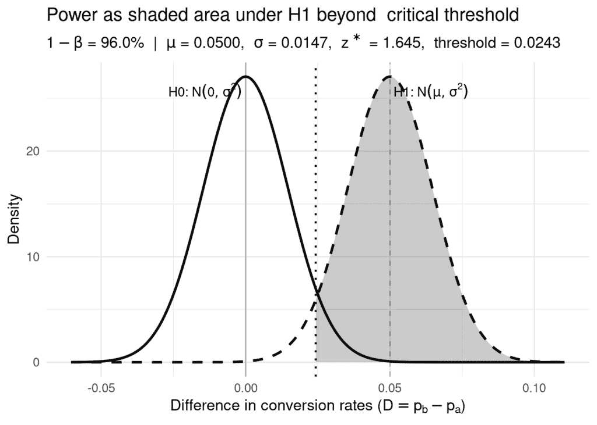
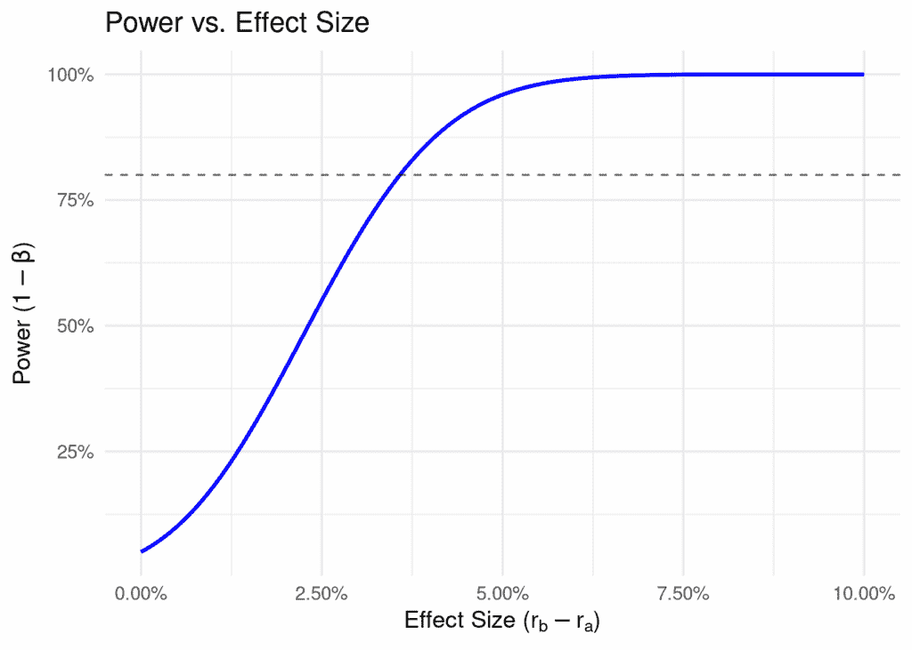
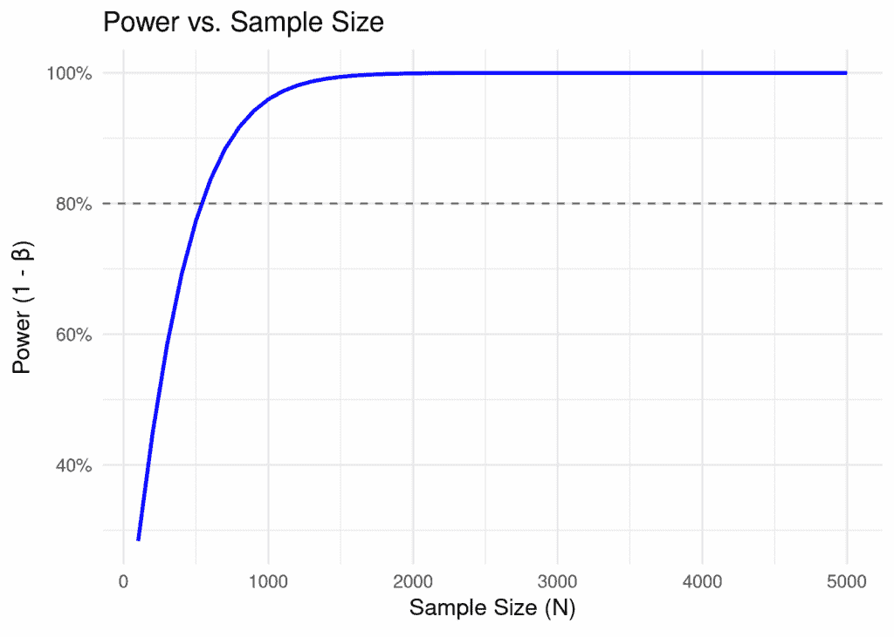
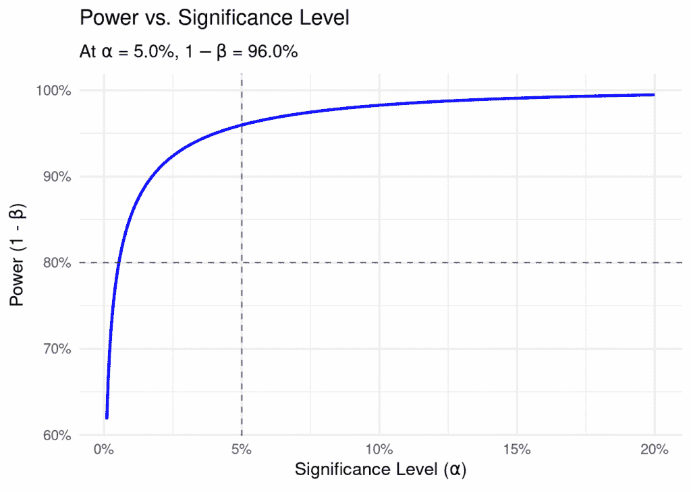

# 市场营销中的功效分析：实战入门

> 原文：[`towardsdatascience.com/power-analysis-in-marketing/`](https://towardsdatascience.com/power-analysis-in-marketing/)

## <mdspan datatext="el1762568891909" class="mdspan-comment">简介</mdspan>

<details class="wp-block-details is-layout-flow wp-block-details-is-layout-flow"><summary>显示代码</summary>

```py
library(tibble)
library(ggplot2)
library(dplyr)
library(tidyr)
library(latex2exp)
library(scales)
library(knitr)
```</details>

在过去几年从事市场营销测量工作的过程中，我注意到**功效分析**是测试和测量领域中最不为人所理解的课题之一。有时它被误解，有时根本未得到应用，尽管它在测试设计中的基础性作用。本文以及随后的系列文章都是我试图缓解这一问题的尝试。

在本节中，我将涵盖：

+   什么是统计功效？

+   我们如何计算它？

+   什么可以影响功效？

功效分析是一个统计学课题，因此，将会有数学和统计学（疯狂吧？）但我会尽可能地将这些技术细节与实际问题或基本直觉联系起来。

不再拖延，让我们开始吧。

## 测试中的错误类型：第一类错误与第二类错误

在测试中，有两种类型的错误：

+   **第一类错误**：

    +   技术定义：当零假设为真时，我们错误地拒绝了零假设

    +   通俗定义：我们说有效果，而实际上并没有

    +   例子：对新的创意进行 A/B 测试，并得出结论说它比旧的设计表现更好，而实际上，两种设计表现相同

+   **第二类错误**：

    +   技术定义：当零假设为假时，我们未能拒绝零假设

    +   通俗定义：我们说没有效果，而实际上确实有

    +   例子：对新的创意进行 A/B 测试，并得出结论说它与新设计表现相同，而实际上，新设计表现更好

## 什么是统计功效？

大多数人都熟悉第一类错误。这是我们通过设置显著性水平来控制的错误。功效与第二类错误相关。更具体地说，功效是在零假设为假时正确拒绝零假设的概率。它是第二类错误的补数（即，1 – 第二类错误）。换句话说，功效是在存在真实效果时检测到真实效果的几率。这很重要，原因如下：

+   功效不足的测试可能会错过真实的效果，导致错失改进的机会

+   功效不足的测试可能导致对结果的错误信心，因为我们可能会得出没有效果的结论，而实际上确实存在效果

+   ...以及最简单地说，功效不足的测试浪费金钱和资源

## α和β的作用

如果两者都很重要，为什么 II 型错误和功效会被误解和忽视，而 I 型错误总是被考虑？这是因为我们可以轻松地选择我们的 I 型错误率。事实上，当我们为我们的测试设置显著性水平α（通常α = 0.05）时，我们就是这样做的。我们声明我们能够接受一定比例的 I 型错误。在测试设置期间，我们做出声明，“我们能够接受 X %的假阳性率”，然后设置α = X%。在测试之后，如果我们的 p 值低于α，我们拒绝零假设（即，“结果是有意义的”），如果 p 值高于α，我们未能拒绝零假设（即，“结果不是有意义的”）。

确定 II 型错误，β（通常β = 0.20），以及功效，并不那么简单。这需要我们做出假设并进行分析，称为“功效分析”。为了理解这个过程，最好是首先走一遍测试过程，然后再回溯以弄清楚如何计算和影响功效。让我们用一个简单的 A/B 创意测试作为例子。

| **概念** | **符号** | **典型值** | **技术定义** | **通俗定义** |
| --- | --- | --- | --- | --- |
| I 型错误 | α | 0.05 (5%) | 在零假设实际上为真时拒绝零假设的概率 | 声称存在效果，而实际上没有差异 |
| II 型错误 | β | 0.20 (20%) | 在零假设实际上为假时未能拒绝零假设的概率 | 声称没有效果，而实际上存在效果 |
| 功效 | 1 − β | 0.80 (80%) | 在备择假设为真时正确拒绝零假设的概率 | 如果存在真实效应，我们检测到真实效应的机会 |

快速参考：错误类型和功效

## 计算功效：一步一步来

在我们开始之前的一些注意事项：

+   我做了一些假设和近似来简化示例。如果你能找到它们，那很好。如果你找不到，也不要担心。目标是理解概念和过程，而不是细节。

+   我将 z 分数空间中的决策阈值称为临界值。临界值通常指的是原始空间中的阈值（例如，转化率），但我会交替使用，这样我就不需要引入新术语。

+   文章中穿插着与文本和概念相关的代码片段。如果你自己复制代码，你可以调整参数以查看事物如何变化。一些代码片段被隐藏起来，以保持文章的可读性。点击“显示代码”以查看代码。

    +   尝试这个：在测试设置中编辑样本大小，使测试统计量刚好低于临界值，然后运行功效分析。结果是你预期的吗？

## 测试设置和测试统计量

如上所述，最好是先走一遍测试过程，然后再回溯以确定如何计算功效。让我们就这样做。

```py
# Set parameters for the A/B test
N_a <- 1000  # Sample size for creative A
N_b <- 1000  # Sample size for creative B
alpha <- 0.05  # Significance level
# Function to compute the critical z-value for a one-tailed test
critical_z <- function(alpha, two_sided = FALSE) {
  if (two_sided) qnorm(1 - alpha/2) else qnorm(1 - alpha)
}
```

如上所述，最好首先走一遍测试过程，然后回溯以确定如何计算功效。让我们就这样做。

我们的测试设置：

+   **零假设**：A 的转化率等于 B 的转化率。

+   **备择假设**：B 的转化率高于 A 的转化率。

+   **样本大小**：

+   N[a] = 1,000 — 接收 Creative A 的人数

+   N[b] = 1,000 — 接收 Creative B 的人数

+   **显著性水平**：α = 0.05

+   **临界值**：临界值是对应于显著性水平 α 的 z 分数。我们称之为 Z[1−α]。对于 α = 0.05 的一尾检验，这大约是 1.64。

+   **测试类型**：双比例 z-检验

```py
x_a <- 100  # Number of conversions for creative A
x_b <- 150  # Number of conversions for creative B
p_a <- x_a / N_a  # Conversion rate for creative A
p_b <- x_b / N_b  # Conversion rate for creative B
```

我们的结果：

+   x[a] = 100 — Creative A 的转化数量

+   x[b] = 150 — Creative B 的转化数量

+   p[a] = x[a] / N[a] = 0.10 — Creative A 的转化率

+   p[b] = x[b] / N[b] = 0.15 — Creative B 的转化率

在零假设下，转化率差异遵循一个近似正态分布，具有：

+   均值：μ = 0（转化率没有差异）

+   标准差：

    σ = √ p[a/N[a] + pb/N[b] ] ≈ 0.01

```py
z_score <- function(p_a, p_b, N_a, N_b) {
  (p_b - p_a) / sqrt((p_a * (1 - p_a) / N_a) + (p_b * (1 - p_b) / N_b))
}
```

从这些值中，我们可以计算出测试统计量：

\[

z = \frac{p_b – p_a}

{\sqrt{\frac{p_a (1 – p_a)}{N_a} + \frac{p_b (1 – p_b)}{N_b}}}

≈ 3.39

\]

如果我们的测试统计量 z 大于临界值，我们拒绝零假设，并得出结论：Creative B 的表现优于 Creative A。如果 z 小于或等于临界值，我们未能拒绝零假设，并得出结论：两个创意之间没有显著差异。

换句话说，如果我们的结果在 A 和 B 的转化率真正相同的情况下不太可能观察到，我们拒绝零假设，并声明 Creative B 的表现优于 Creative A。否则，我们未能拒绝零假设，并声明两个创意之间没有显著差异。

根据我们的测试结果，我们拒绝零假设，并得出结论：Creative B 的表现优于 Creative A。

```py
z <- z_score(p_a, p_b, N_a, N_b)
critical_value <- critical_z(alpha)
if (z > critical_value) {
  result <- "Reject null hypothesis: Creative B performs better than Creative A"
} else {
  result <- "Fail to reject null hypothesis: No significant difference between creatives"
}
result
#> [1] "Reject null hypothesis: Creative B performs better than Creative A"
```

## 功效背后的直觉

现在我们已经走过了测试过程，功效在哪里发挥作用呢？在上面的过程中，我们记录了样本转化率，p[a] 和 p[b]，然后计算了测试统计量 z。然而，如果我们重复进行测试多次，我们会得到不同的样本转化率和不同的测试统计量，所有这些都会围绕创意的真实转化率中心。

假设 Creative B 的真实转化率高于 Creative A。由于自然变异，一些这些测试仍然会未能拒绝零假设。功效是这些测试中拒绝零假设的百分比。这是所有功效分析背后的基本机制，并暗示了缺失的成分：真实的转化率——更普遍地说，真实效应量。

直观地说，如果真实效应量更高，我们的测量效应通常会更高，我们更频繁地拒绝零假设，从而增加功效。

## 选择真实效应量

如果我们需要真实转化率来计算功效，我们如何获得它们？如果我们已经有了它们，我们就不需要执行测试。因此，我们需要做出一个假设。广泛地说，有两种方法：

+   **选择有意义效应量：** 在这种方法中，我们将真实效应量（或真实转化率差异）分配到一个*有意义*的水平。如果创意 B 仅使转化率提高了 0.01%，我们实际上会关心并采取行动吗？可能不会。那么我们为什么要关心能够检测到这么小的效应呢？另一方面，如果创意 B 使转化率提高了 50%，我们当然会关心。在实践中，*有意义*的效应量可能介于这两个点之间。

    +   *注意：* 这通常被称为*最小可检测效应*。然而，研究的最小可检测效应和我们关心的最小可检测效应（例如，我们可能只关心 5%或更大的效应，但研究设计为检测 1%或更大的效应）可能不同。因此，我更喜欢在提到这种策略时使用*有意义效应*这个术语。

+   **使用先前研究：** 如果我们有来自先前研究或模型的关于此创意或类似创意效率的数据，我们可以使用这些值来分配真实效应量。

上述两种方法都是有效的。

如果你只关心看到*有意义*的效果，而不介意错过检测较小效果，请选择第一个选项。如果你必须看到“统计显著性”，请选择第二个选项，并谨慎使用你使用的值（更多内容将在另一篇文章中介绍）。

> **技术说明**
> 
> 因为我们没有真实的转化率，我们在技术上为备择假设分配一个特定的预期分布，然后基于此计算功效。以下段落中的*真实平均值*在技术上是在备择假设下的*预期平均值*。我将使用“真实”一词来保持语言简单和简洁。

## 计算和可视化功效

现在我们有了缺失的成分，*真实*转化率，我们可以计算功效。与测量的 p[a]和 p[b]不同，我们现在有真实的转化率 r[a]和 r[b]。

我们测量功效如下：

\[

1 – β = 1 – P(z < Z_{1-\alpha} \;|\; N_a, N_b, r_a, r_b)

\]

这一开始可能有些令人困惑，所以让我们来分解一下。

我们指出，功效（1 − β）是通过从 1 中减去 II 型错误率来计算的。II 型错误率是在给定我们的样本量和真实转化率 r[a]和 r[b]的情况下，测试结果导致 z 分数低于我们的显著性阈值的可能性。我们如何计算最后一部分？

在双比例 z 分数测试中，我们知道：

+   平均值：μ = r[b] − r[a]

+   标准差：σ = √ r[a/N[a] + rb/N[b] ]

现在我们需要计算：

\[

P(X > Z_{1-\alpha}), \quad X \sim N!\left(\frac{\mu}{\sigma},\,1\right)

\]

这是位于 Z[1−α]右侧的上述分布下的面积，相当于计算：

\[

P!\left(X > \frac{\mu}{\sigma} – Z_{1-\alpha}\right), \quad X \sim N(0,1)

\]

如果我们有一本包含 z 分数表的教科书，我们可以简单地查找与

(μ / σ − Z[1−α])，这将给出功效。

让我们直观地展示这一点：

<details class="wp-block-details is-layout-flow wp-block-details-is-layout-flow"><summary>显示代码</summary>

```py
r_a <- p_a  # true baseline conversion rate; we are reusing the measured value
r_b <- p_b   # true treatment conversion rate; we are reusing the measure value
alpha <- 0.05
two_sided <- FALSE   # set TRUE for two-sided test

mu_diff <- function(r_a, r_b) r_b - r_a
sigma_diff <- function(r_a, r_b, N_a, N_b) {
  sqrt(r_a*(1 - r_a)/N_a + r_b*(1 - r_b)/N_b)
}

power_value <- function(r_a, r_b, N_a, N_b, alpha, two_sided = FALSE) {
  mu <- mu_diff(r_a, r_b)
  sd1 <- sigma_diff(r_a, r_b, N_a, N_b)
  zc <- critical_z(alpha, two_sided)
  thr <- zc * sigma_diff(r_a, r_b, N_a, N_b)  

  if (!two_sided) {
    1 - pnorm(thr, mean = mu, sd = sd1)
  } else {
    pnorm(-thr, mean = mu, sd = sd1) + (1 - pnorm(thr, mean = mu, sd = sd1))
  }
}

# Build plot data
mu <- mu_diff(r_a, r_b)
sd1 <- sigma_diff(r_a, r_b, N_a, N_b)
zc <- critical_z(alpha, two_sided)
thr <- zc * sigma_diff(r_a, r_b, N_a, N_b)  

# x-range covering both curves and thresholds
x_min <- min(-4*sd1, mu - 4*sd1, -thr) - 0.1*sd1
x_max <- max( 4*sd1, mu + 4*sd1,  thr) + 0.1*sd1
xx <- seq(x_min, x_max, length.out = 2000)

df <- tibble(
  x = xx,
  H0 = dnorm(xx, mean = 0,  sd = sd1),   # distribution used by test threshold
  H1 = dnorm(xx, mean = mu, sd = sd1)    # true (alternative) distribution
)

# Regions to shade for power
if (!two_sided) {
  shade <- df %>% filter(x >= thr)
} else {
  shade <- bind_rows(
    df %>% filter(x >=  thr),
    df %>% filter(x <= -thr)
  )
}

# Numeric power for subtitle
pow <- power_value(r_a, r_b, N_a, N_b, alpha, two_sided)

# Plot
ggplot(df, aes(x = x)) +
  # H1 shaded power region
  geom_area(
    data = shade, aes(y = H1), alpha = 0.25
  ) +
  # Curves
  geom_line(aes(y = H0), linewidth = 1) +
  geom_line(aes(y = H1), linewidth = 1, linetype = "dashed") +
  # Critical line(s)
  geom_vline(xintercept = thr,  linetype = "dotted", linewidth = 0.8) +
  { if (two_sided) geom_vline(xintercept = -thr, linetype = "dotted", linewidth = 0.8) } +
  # Mean markers
  geom_vline(xintercept = 0,  alpha = 0.3) +
  geom_vline(xintercept = mu, alpha = 0.3, linetype = "dashed") +
  # Labels
  labs(
    title = "Power as shaded area under H1 beyond  critical threshold",
    subtitle = TeX(sprintf(r"($1 - \beta$ = %.1f%%  |  $\mu$ = %.4f,  $\sigma$ = %.4f,  $z^*$ = %.3f,  threshold = %.4f)",
                       100*pow, mu, sd1, zc, thr)),
    x = TeX(r"(Difference in conversion rates ($D = p_b - p_a$))"),
    y = "Density"
  ) +
  annotate("text", x = mu, y = max(df$H1)*0.95, label = TeX(r"(H1: $N(\mu, \sigma²)$)"), hjust = -0.05) +
  annotate("text", x = 0,  y = max(df$H0)*0.95, label = TeX(r"(H0: $N(0, \sigma²)$)"),  hjust = 1.05) +
  theme_minimal(base_size = 13)
```</details> 

在上面的图表中，功效是位于备择分布（H1）（我们假设备择分布是根据我们的真实转换率分布的）超过临界阈值的面积（即我们拒绝零假设的面积）。根据我们设置的参数，功效是 0.96。这意味着如果我们多次重复这个测试，使用相同的参数，我们预计大约 96%的时间会拒绝零假设。

## 功效曲线

现在我们有了关于功效的直觉和数学知识，我们可以探索功效如何根据不同的参数而变化。此类分析生成的图表称为*功效曲线*。

> **注意**
> 
> 在整个图表中，你会注意到 80%的功效被突出显示。这是测试中功效的常见目标，因为它平衡了二类错误的概率和增加样本量或调整其他参数的成本。你会在许多软件包中看到这个值被突出显示，这是其结果。

### 与效应量的关系

之前，我提到效应量越大，功效越高。直观上，这是有道理的。我们实际上是在将上图中的右半部分曲线进一步向右移动，因此超过临界阈值的面积增加。让我们来验证这个理论。

<details class="wp-block-details is-layout-flow wp-block-details-is-layout-flow"><summary>显示代码</summary>

```py
# Function to compute power for varying effect sizes
power_curve <- function(effect_sizes, N_a, N_b, alpha, two_sided = FALSE) {
  sapply(effect_sizes, function(e) {
    r_a <- p_a
    r_b <- p_a + e  # Adjust r_b based on effect size
    power_value(r_a, r_b, N_a, N_b, alpha, two_sided)
  })
}
# Generate effect sizes
effect_sizes <- seq(0, 0.1, length.out = 100)  # Effect sizes from 0 to 10%
# Compute power for each effect size
power_values <- power_curve(effect_sizes, N_a, N_b, alpha)
# Create a data frame for plotting
power_df <- tibble(
  effect_size = effect_sizes,
  power = power_values
)
# Plot the power curve
ggplot(power_df, aes(x = effect_size, y = power)) +
  geom_line(color = "blue", size = 1) +
  geom_hline(yintercept = 0.80, linetype = "dashed", alpha = 0.6) +  # target power guide
  labs(
    title = "Power vs. Effect Size",
    x = TeX(r"(Effect Size ($r_b - r_a$))"),
    y = TeX(r'(Power ($1 - \beta $))')
  ) +
  scale_x_continuous(labels = scales::percent_format(accuracy = 0.01)) +
  scale_y_continuous(labels = scales::percent_format(accuracy = 1), limits = c(NA,1)) +
  theme_minimal(base_size = 13)
```</details> 

理论证实：随着效应量的增加，功效增加。当效应量增加且我们的决策阈值向下移动到正态分布的长尾时，功效接近 100%。

### 与样本量的关系

不幸的是，我们无法控制效应量。它要么是你希望检测的有意义效应量，要么是基于先前的研究。它就是它本身。我们可以控制的是样本量。样本量越大，分布的标准差越小，曲线下超过临界阈值的面积越大（想象一下挤压两侧以压缩图中早先的钟形曲线）。换句话说，更大的样本量应该导致更高的功效。让我们也来验证这个理论。

<details class="wp-block-details is-layout-flow wp-block-details-is-layout-flow"><summary>显示代码</summary>

```py
power_sample_size <- function(N_a, N_b, r_a, r_b, alpha, two_sided = FALSE) {
  power_value(r_a, r_b, N_a, N_b, alpha, two_sided)
}
# Generate sample sizes
sample_sizes <- seq(100, 5000, by = 100)  # Sample sizes from 100 to 5000
# Compute power for each sample size
power_values_sample <- sapply(sample_sizes, function(N) {
  power_sample_size(N, N, r_a, r_b, alpha)
})
# Create a data frame for plotting
power_sample_df <- tibble(
  sample_size = sample_sizes,
  power = power_values_sample
)
# Plot the power curve for varying sample sizes
ggplot(power_sample_df, aes(x = sample_size, y = power)) +
  geom_line(color = "blue", size = 1) +
  geom_hline(yintercept = 0.80, linetype = "dashed", alpha = 0.6) +  # target power guide
  labs(
    title = "Power vs. Sample Size",
    x = TeX(r"(Sample Size ($N$))"),
    y = TeX(r"(Power (1 - $\beta$))")
  ) +
  scale_y_continuous(labels = scales::percent_format(accuracy = 1), limits = c(NA,1)) +
  theme_minimal(base_size = 13)
```</details> 

我们再次看到了预期的关系：随着样本量的增加，功率增加。

> **注意**
> 
> 在这个特定的设置中，我们可以通过增加样本量来增加功率。更普遍地说，这是*精度*的增加。在其他测试设置中，可以通过其他方式增加精度——从而增加功率。例如，在 Geo 测试中，我们可以通过选择可预测的市场或通过包含外生特征（更多内容将在未来的文章中介绍）来增加精度。

### 与显著性水平的关系

显著性水平α会影响功率吗？直观上，如果我们更愿意接受第一类错误，我们更有可能拒绝零假设，因此（1 − β）应该更高。让我们测试这个理论。

<details class="wp-block-details is-layout-flow wp-block-details-is-layout-flow"><summary>显示代码</summary>

```py
power_of_alpha <- function(alpha_vec, r_a, r_b, N_a, N_b, two_sided = FALSE) {
  sapply(alpha_vec, function(a)
    power_value(r_a, r_b, N_a, N_b, a, two_sided)
  )
}

alpha_grid <- seq(0.001, 0.20, length.out = 400)
power_grid <- power_of_alpha(alpha_grid, r_a, r_b, N_a, N_b, two_sided)

# Current point
power_now <- power_value(r_a, r_b, N_a, N_b, alpha, two_sided)

df_alpha_power <- tibble(alpha = alpha_grid, power = power_grid)

ggplot(df_alpha_power, aes(x = alpha, y = power)) +
  geom_line(color = "blue", size = 1) +
  geom_hline(yintercept = 0.80, linetype = "dashed", alpha = 0.6) +  # target power guide
  geom_vline(xintercept = alpha, linetype = "dashed", alpha = 0.6) + # your alpha
  scale_x_continuous(labels = scales::percent_format(accuracy = 1)) +
  scale_y_continuous(labels = scales::percent_format(accuracy = 1), limits = c(NA,1)) +
  labs(
    title = TeX(r"(Power vs. Significance Level)"),
    subtitle = TeX(sprintf(r"(At $\alpha$ = %.1f%%, $1 - \beta$ = %.1f%%)",
                       100*alpha, 100*power_now)),
    x = TeX(r"(Significance Level ($\alpha$))"),
    y = TeX(r"(Power (1 - $\beta$))")
  ) +
  theme_minimal(base_size = 13)
```</details> 

再次，结果与我们的直觉相符。统计学中没有免费的午餐。在其他条件相同的情况下，如果我们想降低我们的第二类错误率（β），我们必须愿意接受更高的第一类错误率（α）。

## 功效分析

那么，功效分析是什么？功效分析是在给定测试参数的情况下计算功率的过程。在功效分析中，我们固定我们无法控制的参数，然后优化我们可以控制的参数以达到所需的功率水平。例如，我们可以固定真实效应大小，然后计算达到所需功率水平所需的样本量。功率曲线通常用于辅助这一决策过程。在系列的后期，我将通过一个真实世界的示例详细讲解功效分析。

## 来源

[1] R. Larsen and M. Marx, An Introduction to Mathematical Statistics and Its Applications

## 系列中的下一个是什么？

我还没有完全决定，但我肯定想涵盖以下主题：

+   Geo 测试中的功效分析

+   在各种情境下设置真实效应大小的详细指南

+   真实世界的端到端示例

很高兴听到想法。请随时联系。以下是我的联系方式：

+   邮箱：[[email protected]](/cdn-cgi/l/email-protection#95e6f4e7e7fcfbf2e1fafbd5f8f4e7fef0e1f7e7fcf1f2f0bbf6faf8)

+   领英：[Sam Arrington](https://www.linkedin.com/in/sam-arrington-21987913b/)
