# 实际特征向量

> 原文：[`towardsdatascience.com/practical-eigenvectors/`](https://towardsdatascience.com/practical-eigenvectors/)

## <mdspan datatext="el1746144193876" class="mdspan-comment">动机</mdspan>

特征向量是线性代数中的一个核心概念，具有广泛的应用。然而，它们可能不太直观，也可能令人畏惧，线性代数用非常严格和通用的术语定义了这些概念，跨越了数百页。此外，关于它们是什么以及它们在各种应用中的使用信息散布在不同的地方。

本文通过简单的可视化和令人兴奋的应用，使特征向量更加友好。

#### 范围

我们假设读者熟悉基本的矩阵加法和乘法运算。我们只讨论实数域上的有限维向量空间^([[1]](https://linear.axler.net/))。

## 向量和基

在 N 维空间中，**一个向量**\(v\)是一组 N 个标量：\[v=\begin{bmatrix}x_1 \\ x_2 \\ \vdots \\ x_N\end{bmatrix}\]

**标准基**（S）是一组特殊的 N 个向量\(s_1, s_2, \dots, s_N\)，其中\(s_k\)在 k^(th)位置上有 1，其他位置为 0。

默认情况下，每个向量都是相对于标准基定义的。换句话说，上面\(v\)的含义是\(v = x_1 \cdot s_1 + x_2 \cdot s_2 + \dots + x_N \cdot s_N\)。为了使基明确，我们用下标表示它：\(v=v_S\)。

几何上，一个向量是从 N 维空间的固定原点出发的箭头，其终点由其分量所确定的点。

下面的图像在二维空间中描绘了标准基\(s_1 = \begin{bmatrix} 1 \\ 0 \end{bmatrix}\)，\(s_2 = \begin{bmatrix} 0 \\ 1 \end{bmatrix}\)和另外两个向量\(v_S = \begin{bmatrix} 3 \\ -1 \end{bmatrix}\)，\(w_S = \begin{bmatrix} 1 \\ 1 \end{bmatrix}\)：

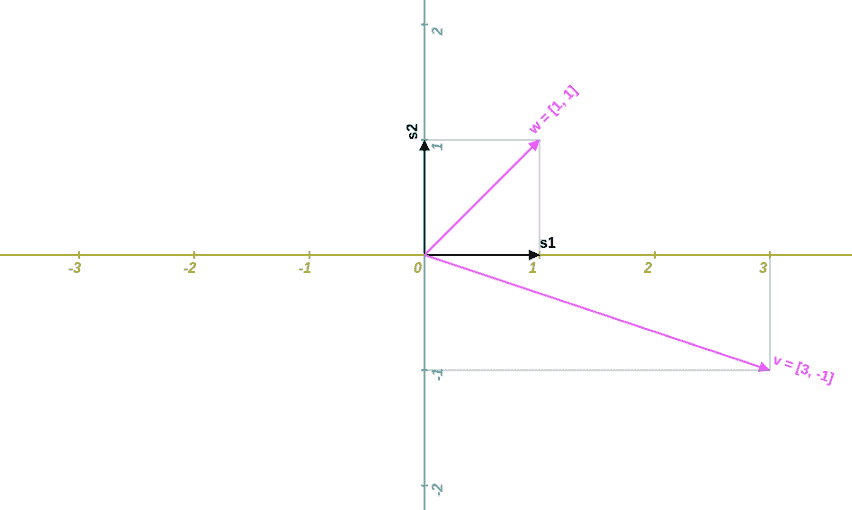

*图片由作者提供*

一组向量是**线性无关**的，如果其中没有一个可以写成其他向量的加权求和。向量\(\begin{bmatrix} 3 \\ -1 \end{bmatrix}\)和\(\begin{bmatrix} 1 \\ 1 \end{bmatrix}\)是线性无关的，但\(v = \begin{bmatrix} 1 \\ 1 \end{bmatrix}\)和\(u = \begin{bmatrix} 2 \\ 2 \end{bmatrix}\)不是，因为\(u = 2 \cdot v\)。

在 N 维空间中，**基**是任何由 N 个线性无关的向量组成的集合。标准基不是唯一的基。给定一个基，空间中的每个向量都可以唯一地表示为这些基向量的加权求和。

因此，同一个向量可以用不同的基来定义。在每种情况下，其每个分量的值和意义可能都会改变，但向量本身保持不变。在上面的例子中，我们选择了标准基，并分别用\(s_1\)和\(s_2\)定义了向量\(v\)和\(w\)。现在让我们选择以向量\(v\)和\(w\)为基，并以此新基来表示\(s_1\)和\(s_2\)。

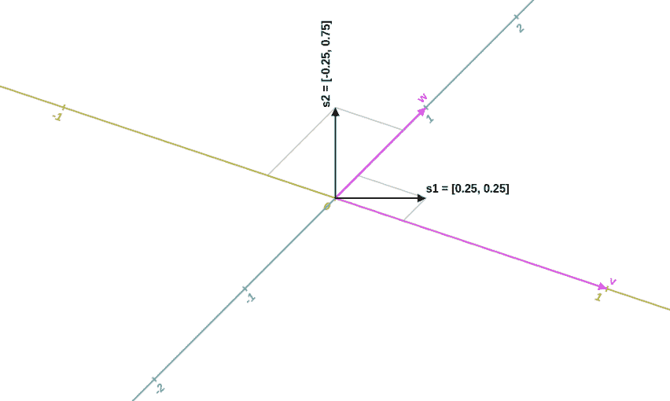

*图片由作者提供*

#### 如何改变向量的基

假设\(v_S\)是相对于标准基定义的，我们希望将其重新定义为相对于另一个基 B (\(b_1, b_2, \dots, b_N\)) 的\(v_B\)。

首先，定义一个 N×N 的矩阵\(B\)，使得其第 j 列是\(b_{jS}\)。

然后 \(v_B = B^{-1} \cdot v_S\) 和 \(v_S = B \cdot v_B\)。

## 算子

算子是一个 N×N 的矩阵\(O_S\)，描述了它如何将一个向量 (\(v_S\)) 映射到另一个向量 (\(u_S\))：\(u_S=O_S \cdot v_S\)。

将向量视为“数据”，将算子视为数据的“变换^([[3]](https://en.wikipedia.org/wiki/Transformation_matrix))”。

在 2D 空间中，我们找到了一些熟悉的算子类别。

#### 缩放算子

\(O_1 = \begin{bmatrix} k_x & 0 \\ 0 & k_y \end{bmatrix}\)，例如 \(O_1 = \begin{bmatrix} 1.5 & 0 \\ 0 & 2 \end{bmatrix}\)。

下面，左图显示了原始的 2D 空间，中间显示了经过算子\(O_1\)变换后的空间，右图显示了点移动的缩放梯度。

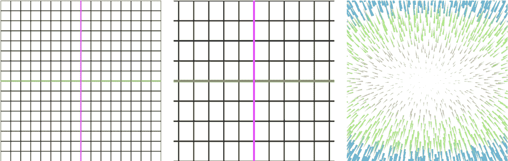

*图片由作者提供*

#### 剪切算子

\(O_2 = \begin{bmatrix} 1 & s_x \\ s_y & 1 \end{bmatrix}\)，例如 \(O_2 = \begin{bmatrix} 1 & 0.25 \\ 0.5 & 1 \end{bmatrix}\)。

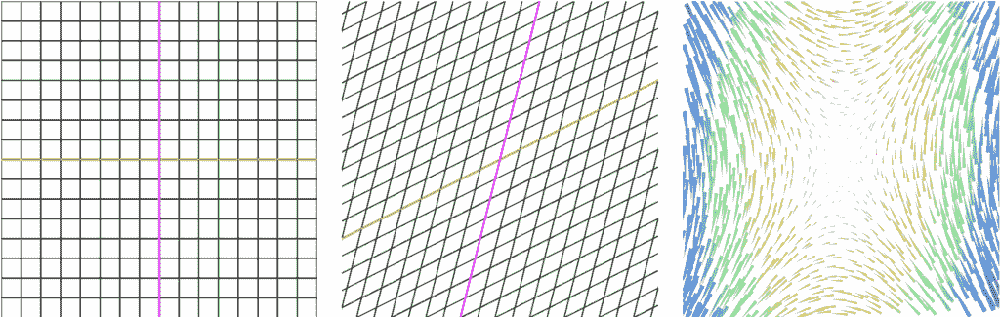

*图片由作者提供*

#### 旋转算子

\(O_3 = \begin{bmatrix} cos \phi & -sin \phi \\ sin \phi & cos \phi \end{bmatrix}\) 将向量逆时针旋转\(\phi\)。

例如 \(O_3 = \begin{bmatrix} 0.866 & -0.5 \\ 0.5 & 0.866 \end{bmatrix}\) 旋转\(30^{\circ}\)。

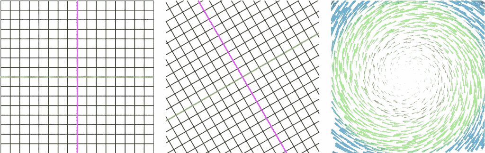

*图片由作者提供*

#### 复合算子

如果算子\(O\)是两个算子\(O_1\)和\(O_2\)的组合，首先用\(O_1\)变换向量，然后使用\(O_2\)，那么\(O = O_2 \cdot O_1\)。

例如，组合上述算子（先旋转，然后剪切，然后缩放）：\(O_4 = O_1 \cdot O_2 \cdot O_3 = \begin{bmatrix} 1.5 & 0 \\ 0 & 2\end{bmatrix} \cdot \begin{bmatrix} 1 & 0.25 \\ 0.5 & 1 \end{bmatrix} \cdot \begin{bmatrix} 0.866 & -0.5 \\ 0.5 & 0.866 \end{bmatrix} \)，因此 \(O_4 = \begin{bmatrix} 1.4865 & -0.42525 \\ 1.866 & 1.232 \end{bmatrix} \)。

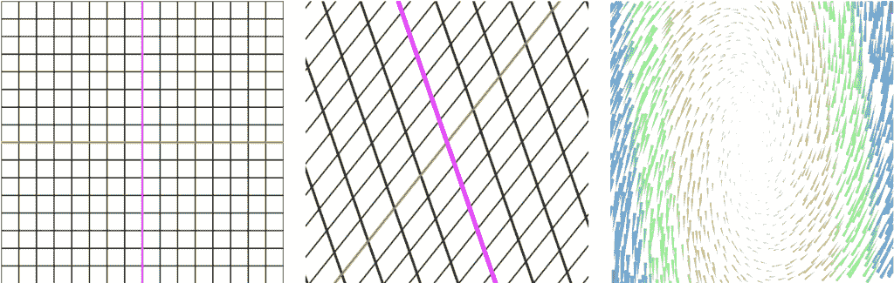

*图片由作者提供*

#### 没有平移？

可能令人惊讶的是，平移不是一个算子（不是一个线性变换）。可以通过向空间添加一个临时维度来实现它。

*示例:* 在 2D 中，要将向量 \(v = \begin{bmatrix} v_x \\ v_y \end{bmatrix} \) 水平移动 \(t_x\) 并垂直移动 \(t_y\) 到 \(u = \begin{bmatrix} v_x + t_x \\ v_y + t_y \end{bmatrix}\)，首先给它添加一个第三维，其值为 1：\(v = \begin{bmatrix} v_x \\ v_y \\ 1 \end{bmatrix} \)。现在我们可以使用这个额外的分量与算子如 \(O=\begin{bmatrix} 1 & 0 & t_x \\ 0 & 1 & t_y \\ 0 & 0 & 1 \\ \end{bmatrix}\) 一起使用。然后 \(u = O \cdot v = \begin{bmatrix} v_x + t_x \\ v_y + t_y \\ 1 \end{bmatrix} \)。最后，删除临时维度。

*注意:* 在齐次坐标中，仿射变换的工作方式类似 – [这里](https://en.wikipedia.org/wiki/Transformation_matrix#Affine_transformations)。

*注意:* SVG 以这种方式实现 2D 平移 – [这里](https://developer.mozilla.org/en-US/docs/Web/SVG/Reference/Attribute/transform#matrix)。

#### 如何改变算子的基

如果向量的定义相对于不同的基发生变化，那么算子也会发生变化。

假设 \(O_S\) 是相对于标准基定义的，我们想要将其重新定义为相对于另一个基 B (\(b_1, b_2, \dots, b_N\)) 的 \(O_B\)。

再次定义 N×N 矩阵 \(B\)，使得它的第 j 列是 \(b_{jS}\)。

那么 \(O_B = B^{-1} \cdot O_S \cdot B \) 和 \(O_S = B \cdot O_B \cdot B^{-1} \)。

## 特征值和特征向量

给定算子 \(O\)，一个 **特征向量**^([[2]](https://en.wikipedia.org/wiki/Eigenvalues_and_eigenvectors)) 是任何非零向量，当它被 \(O\) 变换时，仍然保持在同一轴上（即，保持或反转方向）。特征向量的长度可能会改变。特征向量表征变换（而不是数据）。

因此，如果存在一个向量 \(e \neq 0\) 和一个标量 \(\lambda \) 使得 \(O \cdot e = \lambda \cdot e\)，那么 \(e\) 是一个 **特征向量**，\(\lambda \) 是它的 **特征值**。

如果 \(e\) 是一个特征向量，那么它的任何倍数也是特征向量（但它们不是独立的）。因此，我们通常对特征向量的轴感兴趣，而不是特定的特征向量本身。

算子可能有最多 N 个独立的特征向量。任何 N 个独立的特征向量列表是基（**特征基**）。

重复应用算子到任何非零向量 \(v \neq 0 \) 最终会收敛到具有最大绝对特征值的特征向量（除非 \(v\) 已经是特征向量）。这在下面的梯度图像中直观地表示出来，一旦我们发现了算子的对角形式（在应用 #1 中），这将会更加明显。一些算子收敛得较慢，但具有稀疏矩阵的算子收敛得较快。

#### 2D 中的示例

\(O=\begin{bmatrix} 1 & 2 \\ 2 & 1 \end{bmatrix}\) 有两个特征向量轴 \(e_1=\begin{bmatrix} t \\ t \end{bmatrix} \), \(e_2=\begin{bmatrix} t \\ -t \end{bmatrix}, \forall t \neq 0 \) 分别对应 \(\lambda_1=3\), \(\lambda_2=-1\)。

下面的图像展示了这种变换以及右图中以红色线条显示的两个特征向量轴。

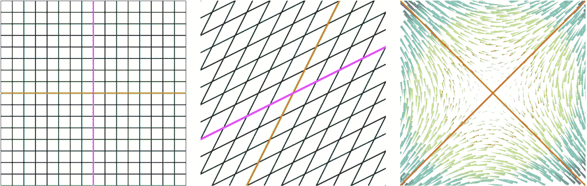

*图片由作者提供*

\(O=\begin{bmatrix} 1 & 0.5 \\ 0 & 1 \end{bmatrix}\) 有单个特征向量轴 \(e=\begin{bmatrix} t \\ 0 \end{bmatrix}, \forall t \neq 0 \)，\(\lambda=1\)。

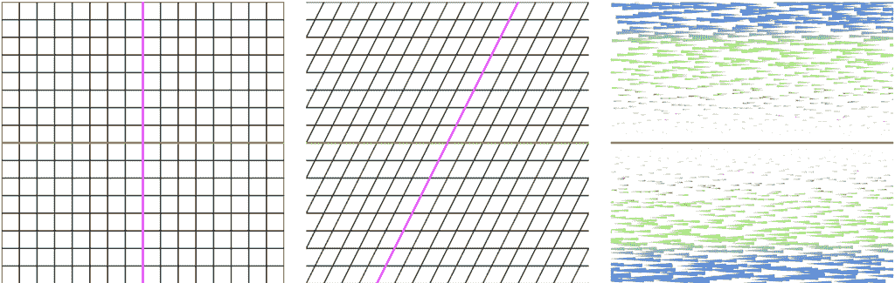

*图片由作者提供*

\(O=\begin{bmatrix} 0.866 & -0.5 \\ 0.5 & 0.866 \end{bmatrix}\) 没有特征向量。

*注意:* 在 2D 中旋转没有特征向量（在 3D 中有一个特征向量轴）。


*图片由作者提供*

\(O=\begin{bmatrix} 2 & 0 \\ 0 & 2 \end{bmatrix}\) 有所有非零向量作为特征向量，\(\lambda=2\)。

*注意:* 对于恒等或均匀缩放算子（其中 \(k_x = k_y\)），所有向量都是特征向量。尽管所有轴都是特征向量轴，但你只能选择 2 个（在 N 维空间中为 N）使得它们是独立的。

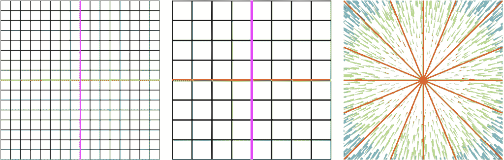

*图片由作者提供*

#### 确定特征值

回想一下，特征值是方程 \(O \cdot e = \lambda \cdot e\) 中的标量 \(\lambda\)。

因此，我们要找到一个 \(\lambda\)，使得 \((O-\lambda \cdot I) \cdot e=0, e \neq 0\)。

因此，找到一个 \(\lambda\)，使得 \(det(O-\lambda \cdot I)=0\)。

在 2D 中，如果 \(O=\begin{bmatrix} a & b \\ c & d \end{bmatrix} \) 则 \(\lambda_{1,2}=\frac{a+d \pm \sqrt{(a+d)² – 4 (a d – b c)} }{2} \)：

1.  如果在ℝ中 \(\sqrt{\cdot}\) 项未定义，则算子没有特征值（也没有特征向量）。

    *注意:* 如果我们的空间在ℂ（复数）上，那么它总是有定义的，在这种情况下，即使是旋转也会有特征值

1.  如果 \(\lambda_1 \neq \lambda_2\)，则算子恰好有两个特征向量轴

1.  如果 \(\lambda_1 = \lambda_2\)，则算子要么有一个单独的特征向量轴，要么所有轴都是

#### 确定特征向量

首先确定特征值。然后对于每个特征值 \(\lambda_k\)，在方程组 \((O-\lambda_k \cdot I) \cdot e_k=0, e_k \neq 0\) 中求解 \(e_k\)。回想一下 \(det(O-\lambda \cdot I)=0\) 因此这些方程不是独立的。因此，预期会找到非唯一解，但至少有一个变量是自由解的类。

在 2D 中，如果 \(O=\begin{bmatrix} a=1 & b=2 \\ c=2 & d=1 \end{bmatrix} \) 则 \(\lambda_1=3\) 和 \(\lambda_2=-1\)。

从 \((O-\lambda_1 \cdot I) \cdot e_1=0\) 我们得到 \(\begin{bmatrix} 1-3 & 2 \\ 2 & 1-3 \end{bmatrix} \cdot e_1=0\)。

然后 \(-2 \cdot e_{1x} + 2 \cdot e_{1y} = 0\) 则 \(e_{1x}=e_{1y}=t\) 所以 \(e_1=\begin{bmatrix} t \\ t \end{bmatrix}, \forall t \neq 0 \)。

类似地，从 \((O-\lambda_2 \cdot I) \cdot e_2=0\) 我们得到 \(e_2=\begin{bmatrix} t \\ -t \end{bmatrix}, \forall t \neq 0 \)。

#### 一些性质

1.  一个方阵 \(A\) 和它的转置 \(A^T\) 有相同的特征值^([[18]](https://math.stackexchange.com/questions/123923/a-matrix-and-its-transpose-have-the-same-set-of-eigenvalues-other-version-a-a))。

1.  一个随机矩阵^([[4]](https://en.wikipedia.org/wiki/Stochastic_matrix)) 只有正值，并且每一行的和为 1。随机矩阵总是有 \(\lambda=1\) 作为特征值，这也是它的最大特征值^([[17]](https://math.stackexchange.com/questions/40320/proof-that-the-largest-eigenvalue-of-a-stochastic-matrix-is-1))。

1.  对称矩阵的所有独立特征向量彼此正交^([[20]](https://math.stackexchange.com/questions/419941/orthogonality-of-eigenvectors-of-laplacian))。换句话说，一个向量的投影到另一个向量上是 \(0=\sum_{k}{e_{ik} \cdot e_{jk}}\)。

## 应用

可能看起来特征向量被如此严格地指定，以至于它们不会很有意义。它们确实很有意义！让我们看看一些令人兴奋的应用。

#### 1. 矩阵对角化和指数运算

给定矩阵 \(A\)，\(A^k (k \in ℕ, k \gg 1)\) 是什么？

为了解决这个问题，考虑 \(A\) 作为相对于标准基的算子 \(O_S\) 的定义。选择一个特征基 \(E\) 并将 \(O_S\) 重新定义为 \(O_E\)（相对于特征基）。相对于 \(E\)，\(O_E\) 看起来像一个简单的缩放算子。换句话说，**\(O_E\) 是一个对角矩阵，其对角线是特征值。**

因此 \(A=O_S=E \cdot O_E \cdot E^{-1} \) 其中 \(E=\begin{bmatrix} \overrightarrow{e_1} & | & \overrightarrow{e_2} & | & \dots & | & \overrightarrow{e_N} \end{bmatrix}\)（特征向量作为列）和 \(O_E=\begin{bmatrix} \lambda_1 & 0 & \dots & 0 \\ 0 & \lambda_2 & \dots & 0 \\ \vdots & \vdots & \ddots & \vdots \\ 0 & 0 & \dots & \lambda_N \end{bmatrix} \)（特征值作为对角线）。

因为 \(A^k\) 表示应用变换 k 次，所以 \(A^k=E \cdot O_E^k \cdot E^{-1} \)。最后，因为 \(O_E\) 是一个对角矩阵，它的 k 次幂是平凡的：\(O_E^k=\begin{bmatrix} \lambda_1^k & 0 & \dots & 0 \\ 0 & \lambda_2^k & \dots & 0 \\ \vdots & \vdots & \ddots & \vdots \\ 0 & 0 & \dots & \lambda_N^k \end{bmatrix} \)。

一旦我们确定了矩阵 \(O_E\)、\(E\) 和 \(E^{-1}\)，计算 \(A^k\) 就是 \(O(N³)\) 次操作（从原始方法的 \(O(k \cdot N³) \) 降低）。这使得计算矩阵的大（有时是无限）次幂成为可能。

***问题：**让 \(A=\begin{bmatrix} -2 & 1 \\ -4 & 3 \end{bmatrix} \)，\(A^{1000}\) 是什么？**

首先，确定特征值为 \(\lambda_1=-1\) 和 \(\lambda_2=2\)。

接下来，找到特征基为 \(e_1=\begin{bmatrix} 1 \\ 1 \end{bmatrix} \) 和 \(e_2=\begin{bmatrix} 1 \\ 4 \end{bmatrix} \)。

因此 \(E=\begin{bmatrix} 1 & 1 \\ 1 & 4 \end{bmatrix} \) 和 \(E^{-1}=\begin{bmatrix} 4 & -1 \\ -1 & 1 \end{bmatrix} \cdot \frac{1}{3} \) 和 \(O_E=\begin{bmatrix} -1 & 0 \\ 0 & 2 \end{bmatrix} \)。

然后 \(A^n=E \cdot O_E^n \cdot E^{-1}=\begin{bmatrix} 1 & 1 \\ 1 & 4 \end{bmatrix} \cdot \begin{bmatrix} (-1)^n & 0 \\ 0 & 2^n \end{bmatrix} \cdot \begin{bmatrix} 4 & -1 \\ -1 & 1 \end{bmatrix} \cdot \frac{1}{3} \)。

然后 \(A^n=\begin{bmatrix} 4 \cdot (-1)^n-2^n & (-1)^{n+1}+2^{1000} \\ 4 \cdot (-1)^n-2^{n+2} & (-1)^{n+1}+2^{1002} \end{bmatrix} \cdot \frac{1}{3} \).

最后 \(A^{1000}=\begin{bmatrix} 4-2^{1000} & 2^{1000}-1 \\ 4-2^{1002} & 2^{1002}-1 \end{bmatrix} \cdot \frac{1}{3} \).

#### 2\. 递归级数

***问题：* n^(th) 斐波那契项的直接公式是什么？**

因为每个 \(f_k\) 都是前两个数的和，我们需要一个具有两个存储单元的系统——一个二维空间。

设 \(v_{kS}=\begin{bmatrix} f_{k-1} \\ f_k \end{bmatrix} \) 和 \(v_{1S}=\begin{bmatrix} f_0 \\ f_1 \end{bmatrix}=\begin{bmatrix} 0 \\ 1 \end{bmatrix} \). 看一下前几个向量：

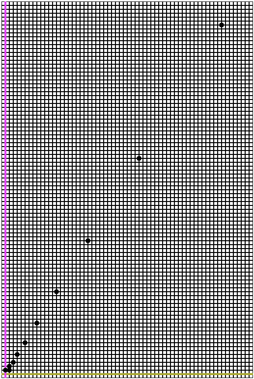

*图片由作者提供*

设算子 \(O_S=\begin{bmatrix} 0 & 1 \\ 1 & 1 \end{bmatrix}\) 以便 \(v_{k+1} = O_S \cdot v_k = \begin{bmatrix} 0 & 1 \\ 1 & 1 \end{bmatrix}\ \cdot \begin{bmatrix} f_{k-1} \\ f_k \end{bmatrix} = \begin{bmatrix} f_k \\ f_{k+1} \end{bmatrix}\).

因此 \(v_{nS}=O_S^{n-1} \cdot v_{1S}\).

接下来，找出 \(\lambda_1=\frac{1+\sqrt{5}}{2}\), \(\lambda_2=\frac{1-\sqrt{5}}{2}\), 以及 \(e_1=\begin{bmatrix} 1 \\ \lambda_1 \end{bmatrix} \), \(e_2=\begin{bmatrix} 1 \\ \lambda_2 \end{bmatrix} \).

因此 \(O_E=\begin{bmatrix} \lambda_1 & 0 \\ 0 & \lambda_2 \end{bmatrix}\), \(E=\begin{bmatrix} 1 & 1 \\ \lambda_1 & \lambda_2 \end{bmatrix}\), \(E^{-1}=\begin{bmatrix} -\lambda_2 & 1 \\ \lambda_1 & -1 \end{bmatrix} \cdot \frac{1}{\sqrt{5}} \).

因此 \(v_{nS}=O_S^{n-1} \cdot v_{1S} = E \cdot O_E^{n-1} \cdot E^{-1} \cdot v_{1S}\).

\(v_{nS}=\begin{bmatrix} \lambda_1^{n-1}-\lambda_2^{n-1} \\ \lambda_1^n – \lambda_2^n \end{bmatrix} \cdot \frac{1}{\sqrt{5}} = \begin{bmatrix} f_{n-1} \\ f_n \end{bmatrix}\).

最后，\(f_n=\frac{1}{\sqrt{5}}\cdot(\frac{1+\sqrt{5}}{2})^n – \frac{1}{\sqrt{5}}\cdot(\frac{1-\sqrt{5}}{2})^n\).

***问题：* 几何级数的公式是什么？**

设几何级数为 \(g_n=c + c \cdot t¹ + c \cdot t² + \dots + c \cdot t^n \).

以递归方式重写它：\(g_{n+1}=g_n + t \cdot a^n \)，其中 \(a_n=c \cdot t^n\)。我们再次需要一个具有两个存储单元的系统。

设 \(v_{kS}=\begin{bmatrix} a_k \\ g_k \end{bmatrix} \) 和 \(v_{0S}=\begin{bmatrix} c \\ c \end{bmatrix} \).

设算子 \(O_S=\begin{bmatrix} t & 0 \\ t & 1 \end{bmatrix}\) 以便 \(v_{k+1} = O_S \cdot v_k = \begin{bmatrix} t & 0 \\ t & 1 \end{bmatrix}\ \cdot \begin{bmatrix} a_k \\ g_k \end{bmatrix} = \begin{bmatrix} t \cdot a_k \\ t \cdot a_k + g_k \end{bmatrix} = \begin{bmatrix} a_{k+1} \\ g_{k+1} \end{bmatrix}\).

接下来，找出 \(\lambda_1=1\), \(\lambda_2=t\), 以及 \(e_1=\begin{bmatrix} 0 \\ 1 \end{bmatrix} \), \(e_2=\begin{bmatrix} \frac{t-1}{t} \\ 1 \end{bmatrix} \).

因此 \(O_E=\begin{bmatrix} 1 & 0 \\ 0 & t \end{bmatrix}\), \(E=\begin{bmatrix} 0 & \frac{t-1}{t} \\ 1 & 1 \end{bmatrix}\), \(E^{-1}=\begin{bmatrix} \frac{t}{1-t} & 1 \\ -\frac{t}{1-t} & 0 \end{bmatrix} \).

所以 \(v_{nS}=O_S^n \cdot v_{0S} = E \cdot O_E^n \cdot E^{-1} \cdot v_{0S}\)。

\(v_{nS}= c \cdot \begin{bmatrix} t^n \\ \frac{1-t^{n+1}}{1-t} \end{bmatrix} = \begin{bmatrix} a_n \\ g_n \end{bmatrix}\)。

最后，\(g_n=c \cdot \frac{1-t^{n+1}}{1-t}, \forall t > 1\).

#### 3\. 马尔可夫链

马尔可夫链是一个加权有向图，对于每个节点，所有出边的和为 1。允许自环，每个节点可以持有值。

*一种解释*是每个节点代表某种状态（具有某种初始概率），并且在每个迭代中，下一个状态是相邻节点之一，其概率等于边的权重。

*另一种解释*是每个节点开始时具有一定数量的能量，并且在每个迭代中，它按边的权重比例将其传递给每个相邻节点。

无论哪种方式，节点上的信息组成了一块数据（一个向量），边组成了一个转换（一个算子）。N 个节点意味着一个 N 维空间。

定义每次迭代的转换算子 \(O_S\) 是一个列随机矩阵——因此它的值在 0 和 1 之间，并且每一列的总和为 1。具体来说，它的第 k 列是与节点 k 的出边相关联的概率向量。

随机矩阵总是有 \(\lambda_1=1\) 作为它们最大的特征值。相应的特征向量 \(e_1\)（满足 \(A \cdot e_1 = e_1 \) 和 \(sum(e_1)=1\)) 代表系统的稳态：随机游走者在 \(\infty\) 步后结束在每个节点上的概率（或者每个节点在 \(\infty\) 次迭代后的能量）。唯一的例外是当初始系统状态已经是特征向量时，在这种情况下，系统将锁定在该状态。

***问题：找到简单马尔可夫链的稳态***

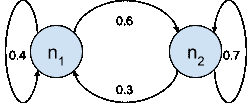

*图片由作者提供*

对于这个马尔可夫链，邻接矩阵是 \(A=\begin{bmatrix} 0.4 & 0.3 \\ 0.6 & 0.7 \end{bmatrix} \)。

\(\lambda_1=1\)（随机矩阵）和 \(e_1=\begin{bmatrix} t \\ 2t \end{bmatrix}\)。但强制 \(sum(e_1)=1\) 意味着 \(e_1=\begin{bmatrix} \frac{1}{3} \\ \frac{2}{3} \end{bmatrix}\)。验证 \(A \cdot e_1 = e_1 \) 如预期。

最后，经过 \(\infty\) 次迭代后，随机游走者以 ⅓ 的概率在 n[1] 中，以 ⅔ 的概率在 n[2] 中。或者，n[1] 中的能量是全球能量的 ⅓，n[2] 中的能量是 ⅔。

***问题：计算所有网页的 Google Page-Rank***

每个网页排名（重要性）的计算部分是确定其他页面如何链接到它以及它们自己的重要性。

因此，创建了一个巨大的马尔可夫链，其中每个节点都是一个网页，每条边代表源节点链接到目标节点。对于每个节点，出边上的权重都相等：\(weight=\frac{1}{degree(source node)}\).

*注意:* 使用额外的技巧来确保没有节点成为死胡同^([[5]](https://pi.math.cornell.edu/~mec/Winter2009/RalucaRemus/Lecture3/lecture3.html))（没有能量汇）。

然后，特征向量 \(e_1\)（图的稳态）是每个节点的页面排名。

*注意:* 由于这个系统的规模巨大，出于实际考虑，\(e_1\) 不是直接计算的。相反，它通过在初始向量上应用变换算子多次来近似。鉴于算子矩阵是稀疏的，它将迅速收敛到 \(e_1\)。

#### 4. 图的谱聚类

给定一个连通的无向图（或网络），找到 K 个聚类（或社区），使得每个聚类中的节点比聚类外的节点更相互连接。

*注意:* 聚类的质量很难衡量，问题陈述比严谨性更直观。为此，已经提出了许多度量方法，其中模块度^([[7]](https://en.wikipedia.org/wiki/Modularity_(networks)))（由 Newman 提出）被定义为“*给定组内边的比例减去随机分布边的期望比例*”是最受欢迎的。

首先，定义以下矩阵：

1.  \(A\) 是邻接矩阵

1.  \(D\) 是一个对角矩阵，使得 \(D_{ii}=degree(node_i)=\sum_j A_{ij}\)

1.  \(L=D-A\) 被称为**拉普拉斯矩阵**^([[14]](https://www.youtube.com/watch?v=cxTmmasBiC8))。

*直觉:* L 类似于一个微分算子，因此具有大特征值的特征向量对应于“高振动”的切割（最大切割）。但一个好的聚类类似于最小切割，因此在这种情况下，我们感兴趣的是具有最小特征值的特征向量^([[22]](http://blog.shriphani.com/2015/04/06/the-smallest-eigenvalues-of-a-graph-laplacian/))。

让我们约定 \(\lambda_1\) 到 \(\lambda_N\) 是按升序排列的——实际上 \(\lambda_1=0\) 是最小的^([[19]](https://en.wikipedia.org/wiki/Laplacian_matrix#Properties))。

*注意:* 如果图是不连通的，0 将作为特征值出现多次。实际上，如果图中有 C 个连通分量，0 将作为特征值出现 C 次。然而，在本节中，我们假设图是连通的（因为那才是有趣的部分），所以 0 的重数为 1。

注意到 L 是对称的，并且每一行（和每一列）的和为 0：\(\sum_j L_{ij}=0, \forall i\). 因此 L 有 \(\lambda_1=0\) 和 \(e_1=\begin{bmatrix} 1 \\ 1 \\ \vdots \\ 1 \end{bmatrix} \)。

*证明:* \((L-0 \cdot I) \cdot e_1 = L \cdot e_1 = 0 = 0 \cdot e_1\)。

此外，由于 L 是对称的，其特征基的所有特征向量彼此正交：\(\sum_k {e_{ik} \cdot e_{jk}} = 0\). 因此，如果我们选择 \(j=1\) 在前面的方程中，我们发现每个特征向量（除了 \(e_1\)）的和为 0：\(\sum_k{e_{ik}}=0, \forall i \ge 2\).

最后，如果我们想找到：

+   \(K=2\) 个聚类，只需查看 \(e_2\) 将节点分组为：

    +   与\(e_2\)的正分量相对应的，以及

    +   与\(e_2\)的负分量相对应的

+   如果有\(K \ge 3\)个簇，那么对于每个节点定义\(v_i=\begin{bmatrix} e_{2i} \\ e_{2i} \\ \vdots \\ e_{Ki} \end{bmatrix} \)为\(s_i\)在每个特征向量\(e_2\)到\(e_K\)上的投影。最后，使用 K-means 算法在新的\(v_i\)向量上对节点进行聚类。

***问题：*在 Zachary 的空手道俱乐部网络中找到 2 个社区**

Zachary 的空手道俱乐部^([[8]](https://en.wikipedia.org/wiki/Zachary%27s_karate_club))网络是他从 1970 年到 1972 年研究的空手道俱乐部中 34 名成员之间 78 个社会联系（俱乐部外互动的成员）的著名网络。

后来，由于领导层意见分歧，34 名成员分成了两派：一半的成员围绕老教练组成了一个新的俱乐部，而其他人找到了新的教练或放弃了空手道。

基于收集到的数据，Zachary 正确地将俱乐部除一名成员（#9）之外的所有成员分配到了他们实际加入的组别。

在下面的 Python 代码中，变量“a”是 34x34 的邻接矩阵。它运行一个类似于上面的算法，但作为一行代码：

```py
labels = sklearn.cluster.SpectralClustering(n_clusters=2).fit(a).labels_
```

结果分区正确地匹配了 Zachary 原始论文中描述的现实世界分割，除了一个节点（相同的#9）在原始论文^([[9]](https://www.journals.uchicago.edu/doi/10.1086/jar.33.4.3629752))中被描述为对任何一组都缺乏亲和力。

*注意：*网络聚类问题是 NP 完全的，尽管“谱聚类”已知表现良好，但它不保证绝对最优结果。

#### 5. 使用 PCA 进行降维

如果数据集中的样本是 N 维向量，我们希望将它们减少到 K 维向量，同时保留大部分信息。这有几个原因：

1.  压缩数据

1.  可视化（在 2D 或 3D 中）无法以其他方式可视化的数据

1.  提高模型效率——更快地训练并使用更少的资源

1.  减少过拟合——去除冗余以减少学习“噪声”中的数据

存在许多降维算法^([[13]](https://encord.com/blog/dimentionality-reduction-techniques-machine-learning/))，包括 PCA、LDA、T-SNE、UMAP 和自动编码器。然而，在本节中，我们将仅关注 PCA。

PCA^([[12]](https://en.wikipedia.org/wiki/Principal_component_analysis))代表主成分分析，我们很快就会看到特征向量是主成分^([[15]](https://www.youtube.com/watch?v=fKivxsVlycs))。

首先，通过以下方式对数据集进行归一化，使其以 0 为中心，标准差为 1：

1.  从每个向量中减去数据集的平均向量

1.  然后对于数据集中的每个维度，除以其标准差

接下来，计算数据集 N 维的 N×N 协方差矩阵 \(V\) 并找到其特征向量。如果特征值按 *降序* 排列，则选择 \(\lambda_1\) 到 \(\lambda_K\) 和 \(e_1\) 到 \(e_K\)（使得它们是单位长度）。

*解释：* \(e_1\) 到 \(e_K\) 是 K 个主成分，或者说数据集在这些轴上具有最高的方差。\(e_i\) 轴上的方差是 \(\lambda_i\)。直观地说，矩阵 \(V\) 定义了白化算子的逆算子，使得 \(V^{-1}\) 将我们的数据集转换为白噪声^([[10]](https://en.wikipedia.org/wiki/Whitening_transformation))（方差为 1 且协方差矩阵为单位矩阵的不相关数据）。

现在定义一个 K×N 矩阵 \(E\)，使得其第 i 行是 \(e_i\)。因此，它的转置是 \(E^T=\begin{bmatrix} \overrightarrow{e_1} & | & \overrightarrow{e_2} & | & \dots & | & \overrightarrow{e_N} \end{bmatrix}\)。

最后，为了将任何样本 \(d_N\) 从 N 维压缩到 K 维，只需计算 \(d_K=E \cdot d_N\).

***问题：**压缩一个人脸照片数据集**

**特征脸**是将一个人脸图像的 N 像素转换为 K 个数（其中 \(K \ll N\)）的一种方法。它计算数据集的前 K 个主成分（K 个 **特征脸**），然后以这些 K 个特征向量为依据表达原始图像。这种方法通常用于人脸识别问题。在这个例子中，我们用它来压缩一个人脸数据集。

对于这个实验，我使用了 Python（代码 [在此](https://github.com/dumitrac/TDS/blob/main/a1_eigenvectors/eigenface.py)）和“最大的性别/人脸识别”数据集^([[21]](https://www.kaggle.com/datasets/maciejgronczynski/biggest-genderface-recognition-dataset))（许可 CC0），该数据集包含超过 10,000 张 250 x 250 = 62500 个彩色像素的图片。我将它们转换为灰度图（因此每个像素是一个数字，而不是三个），因为计算如此大矩阵的特征向量可能很慢。

每张图片都变成了一个 N=62500 维的 PyTorch 张量。归一化（减去平均值并除以标准差）并使用 [SciPy eigh](https://docs.scipy.org/doc/scipy/reference/generated/scipy.linalg.eigh.html) 函数找到最大的 K=1500 个特征向量（使用 [eigh](https://docs.scipy.org/doc/scipy/reference/generated/scipy.linalg.eigh.html) 而不是 [eig](https://docs.scipy.org/doc/scipy/reference/generated/scipy.linalg.eig.html)，因为协方差矩阵是对称的）。现在我们有了矩阵 \(E\)。

为了演示，我选取了三张图片，并将每张图片转换为与上面相同的 N 维 \(v_N\)。然后压缩的人脸是 \(v_K=E \cdot v_N\)，现在 \(v_N \approx v_K \cdot E\)。最后，将其反归一化以可视化。下一张拼贴显示了 3 张原始照片（顶部）及其重建（底部）：


*图片由作者提供*

下一个图像显示了前 25 个主成分面：

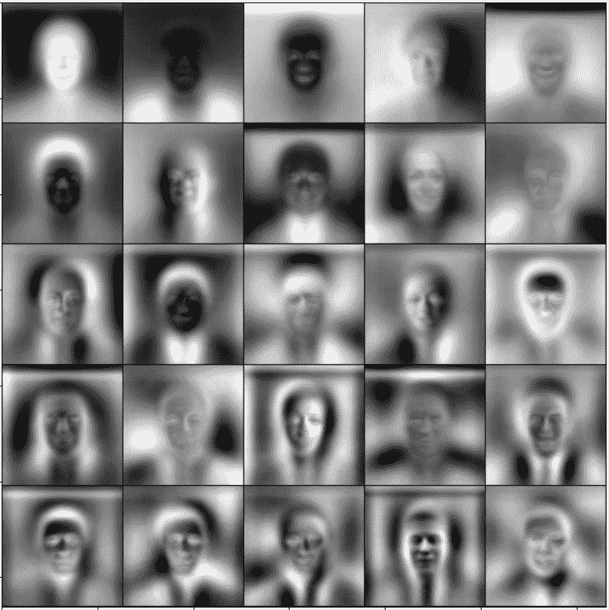

*图像由作者提供*

最后，下一个图像显示了平均人脸（左侧），标准差人脸（中间）以及它们的比率（比率）：

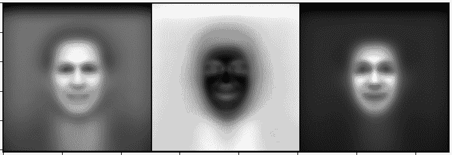

*图像由作者提供*

***问题：在 2D 中可视化高维数据**

我们无法可视化 4+维空间，但我们可以可视化 2D 和 3D 空间。当我们想要更好地理解数据、调试一个不太起作用的分类器或理解数据是否自然形成清晰的组时，这很有用。

为了演示这一点，我使用了 IRIS 数据集^([[23]](https://doi.org/10.24432/C56C76))（许可证 CC BY 4.0）并将每个样本（原本是 4D）投影到前两个主成分向量上。

然后将结果绘制在以鸢尾花物种着色的 2D 平面上。Python 代码[在这里](https://github.com/dumitrac/TDS/blob/main/a1_eigenvectors/pca.py)。

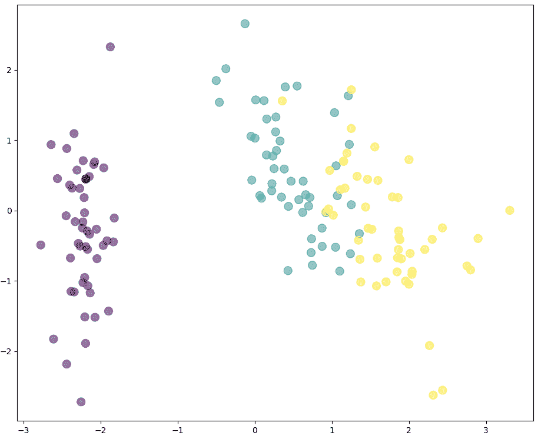

*图像由作者提供*

结果很有希望，因为三种鸢尾花物种沿着主导的两个主成分向量很好地分离。这两个主成分向量在鸢尾花物种分类器中将是有效的。

## 感谢

感谢您阅读至此！

我希望这篇文章使特征向量变得直观，并提供了它们广泛应用的激动人心的概述。

## 参考文献

本文的主要灵感来源于 Sheldon Axler 的著作《线性代数这样做是正确的》^([[1]](https://linear.axler.net/))。

1.  Sheldon Axler，[线性代数这样做是正确的（2024）](https://linear.axler.net/)，斯普林格

1.  [特征值和特征向量](https://en.wikipedia.org/wiki/Eigenvalues_and_eigenvectors)，维基百科

1.  [变换矩阵](https://en.wikipedia.org/wiki/Transformation_matrix)，维基百科

1.  [随机矩阵](https://en.wikipedia.org/wiki/Stochastic_matrix)，维基百科

1.  [PageRank 算法 – 谷歌搜索的数学（2009）](https://pi.math.cornell.edu/~mec/Winter2009/RalucaRemus/Lecture3/lecture3.html), 康奈尔

1.  [Perron-Frobenius 定理](https://en.wikipedia.org/wiki/Perron%E2%80%93Frobenius_theorem)，维基百科

1.  [网络模块性](https://en.wikipedia.org/wiki/Modularity_(networks))，维基百科

1.  [Zachary 的空手道俱乐部](https://en.wikipedia.org/wiki/Zachary%27s_karate_club), 维基百科

1.  Wayne W. Zachary，[小型群体冲突与分裂的信息流模型（1977）](https://www.journals.uchicago.edu/doi/10.1086/jar.33.4.3629752)，人类学研究杂志：第 33 卷，第 4 期

1.  [白化变换](https://en.wikipedia.org/wiki/Whitening_transformation)，维基百科

1.  [协方差矩阵](https://en.wikipedia.org/wiki/Covariance_matrix)，维基百科

1.  [主成分分析](https://en.wikipedia.org/wiki/Principal_component_analysis)，维基百科

1.  Stephen Oladele，[机器学习前 12 种降维技术（2024）](https://encord.com/blog/dimentionality-reduction-techniques-machine-learning/)

1.  MIT 开放课程，[在图中寻找聚类（2019）](https://www.youtube.com/watch?v=cxTmmasBiC8), YouTube

1.  Victor Lavrenko, [PCA 4：主成分 = 特征向量（2014）](https://www.youtube.com/watch?v=fKivxsVlycs), YouTube

1.  3Blue1Brown, [特征向量和特征值 | 线性代数精髓第十四章（2016）](https://www.youtube.com/watch?v=PFDu9oVAE-g), YouTube

1.  [证明随机矩阵的最大特征值为 1（2011）](https://math.stackexchange.com/questions/40320/proof-that-the-largest-eigenvalue-of-a-stochastic-matrix-is-1), 数学栈交换

1.  [一个矩阵及其转置具有相同的特征值集合/其他版本（2012）](https://math.stackexchange.com/questions/123923/a-matrix-and-its-transpose-have-the-same-set-of-eigenvalues-other-version-a-a), 数学栈交换

1.  [拉普拉斯矩阵](https://en.wikipedia.org/wiki/Laplacian_matrix#Properties), 维基百科

1.  [拉普拉斯矩阵特征向量的正交性（2013）](https://math.stackexchange.com/questions/419941/orthogonality-of-eigenvectors-of-laplacian), 数学栈交换

1.  [最大的性别/人脸识别数据集（2021）](https://www.kaggle.com/datasets/maciejgronczynski/biggest-genderface-recognition-dataset), Kaggle

1.  Shriphani Palakodety, [图拉普拉斯矩阵的最小特征值（2015）](http://blog.shriphani.com/2015/04/06/the-smallest-eigenvalues-of-a-graph-laplacian/)

1.  R. A. Fisher, [鸢尾花数据集（2021）](https://doi.org/10.24432/C56C76), UCI 机器学习库
