# 实用 SQL 谜题，让你的技能更上一层楼

> 原文：[`towardsdatascience.com/practical-sql-puzzles-that-will-level-up-your-skill/`](https://towardsdatascience.com/practical-sql-puzzles-that-will-level-up-your-skill/)

有些 SQL 模式，一旦你知道它们，你开始到处都能看到。我今天要展示的谜题的解决方案实际上是非常简单的 SQL 查询，但理解它们背后的概念无疑会解锁你在日常编写查询时的新解决方案。

这些挑战都是基于现实世界场景的，因为在过去的几个月里，我特意记下了每一个我必须构建的类似谜题的查询。我也鼓励你们亲自尝试它们，这样你们可以先挑战自己，这将会提高你们的学习能力！

生成数据集的所有查询将以 PostgreSQL 和 DuckDB 兼容的语法提供，这样你可以轻松地复制并玩弄它们。最后，我还会提供一个链接到 GitHub 仓库，其中包含所有代码，以及我留给你的额外挑战的答案！

我将这些谜题按照难度递增的顺序组织，所以，如果你觉得第一个太简单，至少看看最后一个，它使用的技术我相信你之前从未见过。

好的，让我们开始吧。

# 分析门票移动

我喜欢这个谜题，因为它最终的查询既简短又简单，尽管它处理了许多边缘情况。这个挑战的数据显示了门票在看板阶段之间的移动，目标是找出平均来说，门票在“进行中”阶段停留了多长时间。

数据包含门票 ID、创建门票的日期、移动日期以及“从”和“到”阶段。

你需要知道的一些事情（边缘情况）：

+   门票可以回退，这意味着门票可以回到“进行中”阶段。

+   你不应该包括仍然卡在“进行中”阶段的门票，因为无法知道它们将停留多久。

+   门票并不总是创建在“新建”阶段。

```py
CREATE TABLE ticket_moves (
    ticket_id INT NOT NULL,
    create_date DATE NOT NULL,
    move_date DATE NOT NULL,
    from_stage TEXT NOT NULL,
    to_stage TEXT NOT NULL
); 
```

```py
INSERT INTO ticket_moves (ticket_id, create_date, move_date, from_stage, to_stage)
    VALUES
        -- Ticket 1: Created in "New", then moves to Doing, Review, Done.
        (1, '2024-09-01', '2024-09-03', 'New', 'Doing'),
        (1, '2024-09-01', '2024-09-07', 'Doing', 'Review'),
        (1, '2024-09-01', '2024-09-10', 'Review', 'Done'),
        -- Ticket 2: Created in "New", then moves: New → Doing → Review → Doing again → Review.
        (2, '2024-09-05', '2024-09-08', 'New', 'Doing'),
        (2, '2024-09-05', '2024-09-12', 'Doing', 'Review'),
        (2, '2024-09-05', '2024-09-15', 'Review', 'Doing'),
        (2, '2024-09-05', '2024-09-20', 'Doing', 'Review'),
        -- Ticket 3: Created in "New", then moves to Doing. (Edge case: no subsequent move from Doing.)
        (3, '2024-09-10', '2024-09-16', 'New', 'Doing'),
        -- Ticket 4: Created already in "Doing", then moves to Review.
        (4, '2024-09-15', '2024-09-22', 'Doing', 'Review');
```

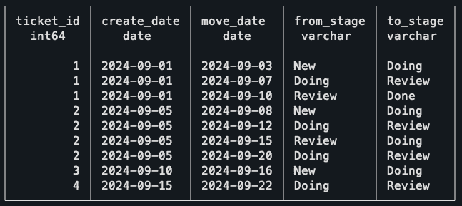

数据概要：

+   **门票 1**：创建于“新建”阶段，正常移动到“进行中”阶段，然后是“审查”阶段，最后是“完成”阶段。

+   **门票 2**：创建于“新建”阶段，然后移动：新建 → 进行中 → 审查 → 进行中再次 → 审查。

+   **门票 3**：创建于“新建”阶段，移动到“进行中”阶段，但仍然卡在那里。

+   **门票 4**：创建于“进行中”阶段，之后移动到“审查”阶段。

可能停下来稍微思考一下如何处理这个问题是个好主意。你能找出一个门票在单个阶段停留了多长时间吗？

老实说，一开始这听起来很吓人，看起来处理所有边缘情况将是一场噩梦。让我给你展示这个问题的完整解决方案，然后我会解释之后发生的事情。

```py
WITH stage_intervals AS (
    SELECT
        ticket_id,
        from_stage,
        move_date 
        - COALESCE(
            LAG(move_date) OVER (
                PARTITION BY ticket_id 
                ORDER BY move_date
            ), 
            create_date
        ) AS days_in_stage
    FROM
        ticket_moves
)
SELECT
    SUM(days_in_stage) / COUNT(DISTINCT ticket_id) as avg_days_in_doing
FROM
    stage_intervals
WHERE
    from_stage = 'Doing'; 
```

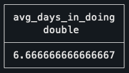

第一个 CTE 使用 LAG 函数来找到票的上一移动，这将是在该阶段进入票的时间。计算持续时间就像从移动日期减去上一日期一样简单。

你应该注意在上一移动日期中使用 COALESCE。这样做是，如果一个票没有上一移动，那么它将使用票的创建日期。这解决了票直接创建到 Doing 阶段的情况，因为它仍然会正确地计算出离开该阶段所需的时间。

这是第一个 CTE 的结果，显示了每个阶段花费的时间。注意 Ticket 2 有两个条目，因为它在两个不同的场合访问了 Doing 阶段。

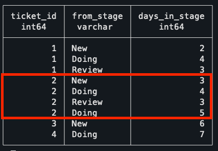

完成这些后，就只需要计算平均数，即总花费天数的 SUM 除以曾经离开该阶段的独特票数。用这种方式做，而不是简单地使用 AVG，确保 Ticket 2 的两行被正确地作为单一票计算。

还不错，对吧？

# 寻找合同序列

第二个挑战的目标是**找到每个员工的最新合同序列**。如果两个合同之间有超过一天的间隔，则发生序列中断。

在这个数据集中，没有合同重叠，这意味着同一员工的合同要么有间隔，要么在新的一个开始前一天结束。

```py
CREATE TABLE contracts (
    contract_id integer PRIMARY KEY,
    employee_id integer NOT NULL,
    start_date date NOT NULL,
    end_date date NOT NULL
);

INSERT INTO contracts (contract_id, employee_id, start_date, end_date)
VALUES 
    -- Employee 1: Two continuous contracts
    (1, 1, '2024-01-01', '2024-03-31'),
    (2, 1, '2024-04-01', '2024-06-30'),
    -- Employee 2: One contract, then a gap of three days, then two contracts
    (3, 2, '2024-01-01', '2024-02-15'),
    (4, 2, '2024-02-19', '2024-04-30'),
    (5, 2, '2024-05-01', '2024-07-31'),
    -- Employee 3: One contract
    (6, 3, '2024-03-01', '2024-08-31');
```

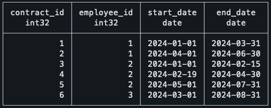

作为数据的总结：

+   **Employee 1:** 有两个连续的合同。

+   **Employee 2:** 一个合同，然后三天中断，然后两个合同。

+   **Employee 3:** 一个合同。

根据给定的数据集，预期的结果是除了 Employee 2 的第一份合同之外的所有合同都应该被包括，因为这是唯一一个有间隔的合同。

在解释解决方案背后的逻辑之前，我想让你先思考一下，可以使用哪种操作来连接属于同一序列的合同。请只关注数据的第二行，如果这个合同是中断的，你需要知道哪些信息？

希望这很清楚，这又是窗口函数的完美情况。它们对于解决这类问题非常有用，理解何时使用它们对于找到干净的解决方案有很大帮助。

那么，首先要做的事情是使用 LAG 函数获取同一员工的上一份合同的结束日期。这样做，比较两个日期并检查是否是序列中断就变得简单了。

```py
WITH ordered_contracts AS (
    SELECT
        *,
        LAG(end_date) OVER (PARTITION BY employee_id ORDER BY start_date) AS previous_end_date
    FROM
        contracts
),
gapped_contracts AS (
    SELECT
        *,
        -- Deals with the case of the first contract, which won't have
        -- a previous end date. In this case, it's still the start of a new
        -- sequence.
        CASE WHEN previous_end_date IS NULL
            OR previous_end_date < start_date - INTERVAL '1 day' THEN
            1
        ELSE
            0
        END AS is_new_sequence
    FROM
        ordered_contracts
)
SELECT * FROM gapped_contracts ORDER BY employee_id ASC; 
```

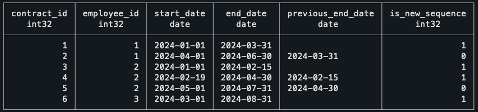

继续查询的一个直观方法是给每个员工的序列编号。例如，没有间隔的员工将始终处于他的第一个序列，但一个在合同中中断了 5 次的员工将处于他的第 5 个序列。有趣的是，这是通过另一个窗口函数完成的。

```py
--
-- Previous CTEs
--
sequences AS (
    SELECT
        *,
        SUM(is_new_sequence) OVER (PARTITION BY employee_id ORDER BY start_date) AS sequence_id
FROM
    gapped_contracts
)
SELECT * FROM sequences ORDER BY employee_id ASC;
```

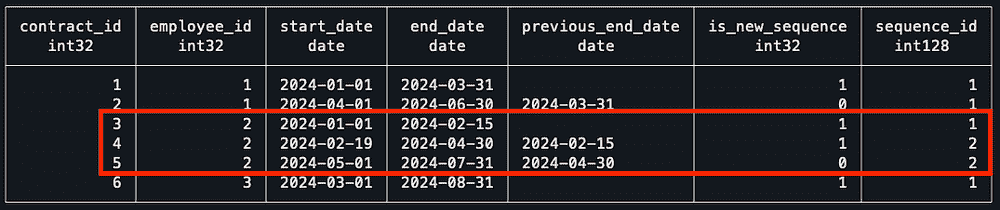

注意到对于 Employee 2 来说，他在第一个间隔值之后开始他的序列#2。为了完成这个查询，我按员工分组数据，获取他们最近序列的值，然后与序列进行内连接，以保留最新的一个。

```py
--
-- Previous CTEs
--
max_sequence AS (
    SELECT
        employee_id,
        MAX(sequence_id) AS max_sequence_id
FROM
    sequences
GROUP BY
    employee_id
),
latest_contract_sequence AS (
    SELECT
        c.contract_id,
        c.employee_id,
        c.start_date,
        c.end_date
    FROM
        sequences c
        JOIN max_sequence m ON c.sequence_id = m.max_sequence_id
            AND c.employee_id = m.employee_id
        ORDER BY
            c.employee_id,
            c.start_date
)
SELECT
    *
FROM
    latest_contract_sequence;
```

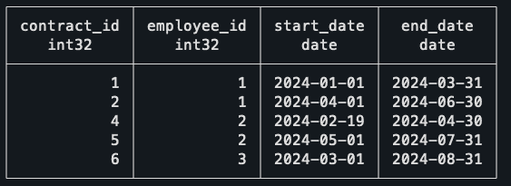

如预期的那样，我们的最终结果基本上就是我们的起始查询，只是缺少了 Employee 2 的第一个合同！

# 跟踪并发事件

最后，最后一个谜题——我很高兴你做到了这一步。

对我来说，这是最令人震惊的，因为我第一次遇到这个问题时，想到了一个完全不同的解决方案，在 SQL 中实现起来会很混乱。

对于这个谜题，我已经改变了上下文，从我为我的工作必须处理的情况，因为我认为这将更容易解释。

想象一下，你是一家活动场所的数据分析师，你正在分析即将举行的活动安排。你想要找到一天中同时进行最多会议的时间。

这是你需要了解的关于日程安排的信息：

+   会议室以 30 分钟为增量预订，例如从 9 点到 10 点 30 分。

+   数据是干净的，没有会议室的过度预订。

+   单个会议室可能会有连续的会议。

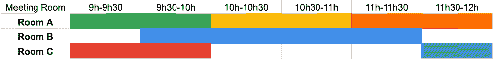

会议日程可视化（这是实际数据）。

```py
CREATE TABLE meetings (
    room TEXT NOT NULL,
    start_time TIMESTAMP NOT NULL,
    end_time TIMESTAMP NOT NULL
);

INSERT INTO meetings (room, start_time, end_time) VALUES
    -- Room A meetings
    ('Room A', '2024-10-01 09:00', '2024-10-01 10:00'),
    ('Room A', '2024-10-01 10:00', '2024-10-01 11:00'),
    ('Room A', '2024-10-01 11:00', '2024-10-01 12:00'),
    -- Room B meetings
    ('Room B', '2024-10-01 09:30', '2024-10-01 11:30'),
    -- Room C meetings
    ('Room C', '2024-10-01 09:00', '2024-10-01 10:00'),
    ('Room C', '2024-10-01 11:30', '2024-10-01 12:00');
```

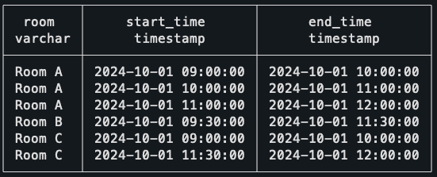

解决这个问题的方法是使用所谓的扫描线算法，也称为基于事件的解决方案。这个后缀实际上有助于理解将要做什么，因为想法是，我们不是处理区间，这是我们原始数据中有的，而是处理事件。

要做到这一点，我们需要将每一行数据转换为两个单独的事件。第一个事件将是会议的开始，第二个事件将是会议的结束。

```py
WITH events AS (
  -- Create an event for the start of each meeting (+1)
  SELECT 
    start_time AS event_time, 
    1 AS delta
  FROM meetings
  UNION ALL
  -- Create an event for the end of each meeting (-1)
  SELECT 
   -- Small trick to work with the back-to-back meetings (explained later)
    end_time - interval '1 minute' as end_time,
    -1 AS delta
  FROM meetings
)
SELECT * FROM events;
```

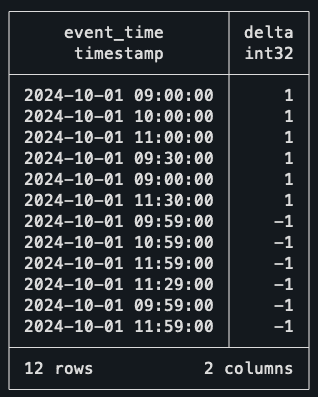

仔细理解这里发生的事情。为了从单行数据中创建两个事件，我们只是简单地对自己进行数据集的并集；前半部分使用开始时间作为时间戳，后半部分使用结束时间。

你可能已经注意到了创建的增量列，并看到了它的用途。当一个事件开始时，我们将其计为+1，当它结束时，我们将其计为-1。你可能甚至已经在想另一个窗口函数来解决这个问题，而且你实际上是对的！

在那之前，让我先解释一下我在结束日期中使用的技巧。由于我不想连续的会议被计为两个同时进行的会议，我在每个结束日期上减去了一分钟。这样，如果一个会议在 10 点 30 分结束，另一个会议在 10 点 30 分开始，就不会假设有两个会议在 10 点 30 分同时进行。

好吧，回到查询，还有另一个窗口函数。不过，这次选择的功能是滚动求和。

```py
--
-- Previous CTEs
--
ordered_events AS (
  SELECT
    event_time,
    delta,
    SUM(delta) OVER (ORDER BY event_time, delta DESC) AS concurrent_meetings
  FROM events
)
SELECT * FROM ordered_events ORDER BY event_time DESC;
```

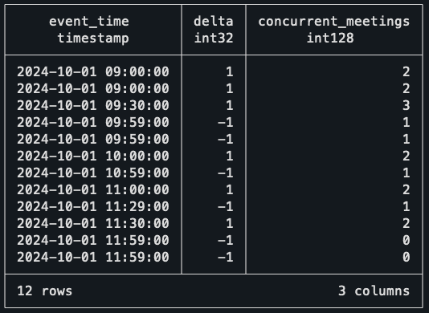

Delta 列的滚动总和实际上是在遍历每条记录，找出当时有多少事件是活跃的。例如，在上午 9 点整，它看到两个事件开始，因此将并发会议的数量标记为两个！

当第三场会议开始时，计数器上升到三。但当它达到 9h59（上午 10 点）时，然后有两场会议结束，将计数器恢复到一。有了这些数据，唯一缺少的是找到并发会议数量最高的时刻。

```py
--
-- Previous CTEs
--
max_events AS (
  -- Find the maximum concurrent meetings value
  SELECT 
    event_time, 
    concurrent_meetings,
    RANK() OVER (ORDER BY concurrent_meetings DESC) AS rnk
  FROM ordered_events
)
SELECT event_time, concurrent_meetings
FROM max_events
WHERE rnk = 1; 
```

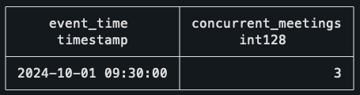

就这样！9h30–10h 的时间段是并发会议数量最多的时间段，这与上面的排程可视化相符！

我认为这个解决方案看起来非常简单，并且适用于许多情况。现在每次你处理区间时，都应该考虑如果从事件的角度思考，查询是否会更简单。

但在你继续之前，为了真正掌握这个概念，我想给你留下一个奖励挑战，这同样是 Sweep Line 算法的常见应用。我希望你尝试一下！

## 奖励挑战

这个问题的上下文仍然和上一个谜题一样，但现在，目标不是试图找到最多并发会议的时期，而是要找到不良的排程。看起来会议室有重叠，需要列出以便尽快修复。

你如何知道同一个会议室是否同时预订了两个或更多会议？以下是一些解决这个问题的技巧：

+   这仍然是同一个算法。

+   这意味着你仍然会做 UNION，但它看起来会有所不同。

+   你应该从每个会议室的角度来思考。

你可以用这些数据来挑战：

```py
CREATE TABLE meetings_overlap (
    room TEXT NOT NULL,
    start_time TIMESTAMP NOT NULL,
    end_time TIMESTAMP NOT NULL
);

INSERT INTO meetings_overlap (room, start_time, end_time) VALUES
    -- Room A meetings
    ('Room A', '2024-10-01 09:00', '2024-10-01 10:00'),
    ('Room A', '2024-10-01 10:00', '2024-10-01 11:00'),
    ('Room A', '2024-10-01 11:00', '2024-10-01 12:00'),
    -- Room B meetings
    ('Room B', '2024-10-01 09:30', '2024-10-01 11:30'),
    -- Room C meetings
    ('Room C', '2024-10-01 09:00', '2024-10-01 10:00'),
    -- Overlaps with previous meeting.
    ('Room C', '2024-10-01 09:30', '2024-10-01 12:00');
```

如果你对这个谜题的解决方案以及其余的查询感兴趣，请查看这个[GitHub 仓库](https://github.com/mtrentz/sql-puzzles-1)。

# 结论

从这篇博客文章的第一个收获是窗口函数非常强大。自从我更习惯于使用它们以来，我感觉我的查询变得简单得多，也更容易阅读，我希望这也会发生在你身上。

如果你想要了解更多关于它们的信息，你可能会喜欢阅读我写的[这篇其他博客文章](https://towardsdatascience.com/understand-sql-window-functions-once-and-for-all-4447824c1cb4/)，我在那里介绍了如何理解和有效地使用它们。

第二个收获是，这些在挑战中使用的模式确实在许多其他地方发生。你可能需要找到订阅序列、客户保留，或者你可能需要找到任务的重叠。有许多情况下，你需要以与谜题中类似的方式使用窗口函数。

我希望您记住的第三点是关于除了处理区间之外使用事件这一解决方案。我回顾了一些很久以前解决的问题，当时我本可以用这个模式来简化我的生活，但遗憾的是，我当时并不知道这个方法。

* * *

我真心希望您喜欢这篇帖子，并且亲自尝试了解这些谜题。我相信，如果您已经读到这儿，那么您要么是学到了关于 SQL 的新知识，要么是加深了对窗口函数的理解！

非常感谢您阅读。如果您有任何问题或者只是想和我联系，请毫不犹豫地通过[mtrentz.com](https://mtrentz.com)联系我。

*除非另有说明，所有图片均为作者所有。*
