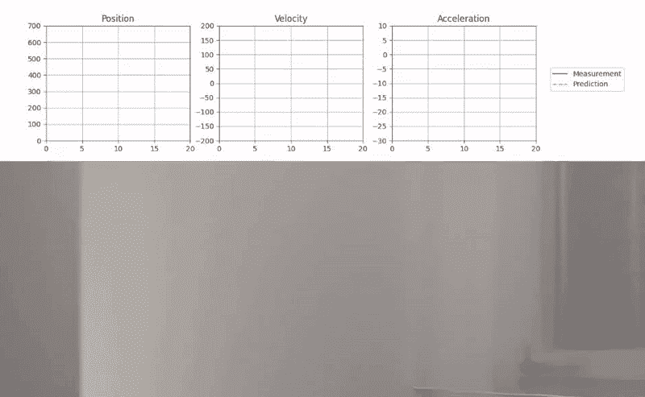
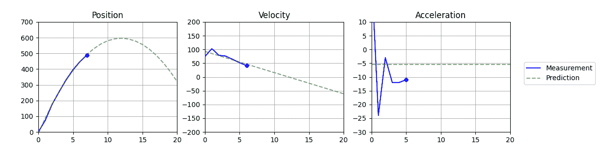
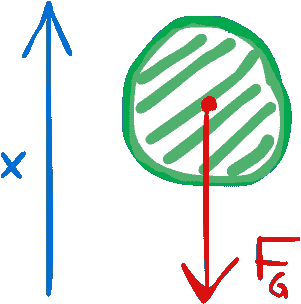
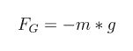
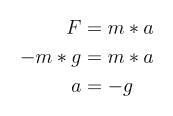
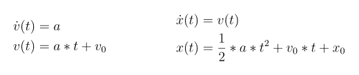
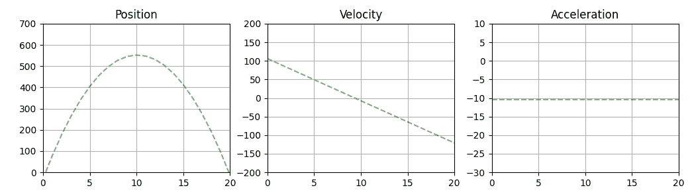
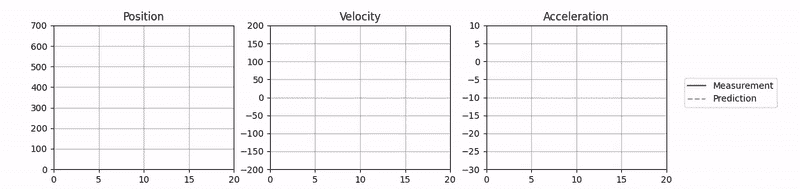

# 预测球轨迹

> 原文：[`towardsdatascience.com/predicting-a-ball-trajectory-4dbd9a1693ad/`](https://towardsdatascience.com/predicting-a-ball-trajectory-4dbd9a1693ad/)



球跟踪和轨迹预测

在一个之前的项目中，我使用实时位置、速度和加速度图可视化了抛向空中球的 **轨迹**。在此基础上，我想基于简单的物理模型计算和可视化 **轨迹预测**。在这篇文章中，我将解释我是如何将模型拟合到球的测量状态并可视化预测轨迹的。



预测图中的位置、速度和加速度

## 物理模型

让我们从球的物理模型开始。为了简单起见，我只考虑球的 **垂直运动**，将问题简化为一维问题。此外，我只模拟球离开我的手后的运动，忽略任何空气阻力。这仅仅留下一个作用于球上的单一恒定力：**重力**。



作用在球上的重力

力是通过球的质量和重力加速度 ***g*** 计算得出的，其值大约为 **9.8m/s²**，这取决于位置和海拔。球的海拔变化非常小，因此 ***g*** 的变化可以忽略不计，我们可以假设它保持恒定。请注意，我定义的位置轴向上，与重力矢量相反，导致力的符号为负。



根据牛顿第二定律，我们可以推导出球的加速度等于重力加速度，因为在计算过程中质量被抵消了。



由于加速度是速度的时间导数，而速度本身是位置的时间导数，我们可以通过积分推导出运动方程。假设加速度是恒定的，我们得到以下关于速度和位置的方程：



总结来说，我们的物理模型导致恒定加速度、线性速度和二次位置。或者用其他的话说，所有三个函数都是不同次数的 **多项式**：

+   加速度是恒定的，一个零次多项式

+   速度是线性的，一个一次多项式

+   位置是二次的，一个二次多项式

我们将在下一章中使用这些信息来找到函数参数的最佳拟合。

## 多项式拟合

接下来是编码部分，我们将这些内容转换为 Python 代码。我们的起点是[之前项目的代码](https://github.com/trflorian/ball-tracking-live-plot)，其中包含三个**numpy**数组，包含我们提取的位置以及速度和加速度值的近似：

```py
pos = np.array([tracked_pos[0][1] - pos[1] for pos in tracked_pos])
vel = np.diff(pos)
acc = np.diff(vel)
```

为了拟合我们的多项式，我们可以使用 numpy 函数**[polyfit](https://numpy.org/doc/stable/reference/generated/numpy.polyfit.html)**。该函数接受两个数组和多项式的次数。第一个输入数组是时间轴，第二个数组是每个时间戳的值。在我们的情况下，我们可以定义时间步长如下：

```py
t_pos = np.arange(len(pos))
t_vel = np.arange(len(vel))
t_acc = np.arange(len(acc))
```

> **注意：**由于我们使用基于数组差异的近似来估计速度和加速度，它们的长度都不同，我们需要为每个函数分别定义时间轴。

现在我们可以将时间轴和数组传递给**polyfit**函数，并使用相应的多项式次数。

```py
poly_pos = np.polyfit(t_pos, pos, deg=2)
poly_vel = np.polyfit(t_vel, vel, deg=1)
poly_acc = np.polyfit(t_acc, acc, deg=0)
```

结果数组将包含相应次数多项式的参数，最高次系数排在最前面。

## 可视化预测

为了显示拟合的多项式函数，我们需要在每个时间步长评估并绘制多项式。我总是想显示视频序列全时间段的多项式预测以及未来几帧。

```py
t_pred = np.arange(num_frames + 5)
```

现在我们可以使用**[polyval](https://numpy.org/doc/stable/reference/generated/numpy.polyval.html)**函数在每个时间步长评估多项式。

```py
polyval_pos = np.polyval(poly_pos, t_pred)
polyval_vel = np.polyval(poly_vel, t_pred)
polyval_acc = np.polyval(poly_acc, t_pred)
```

视频结束后，你可以简单地使用**matplotlib**显示这些多项式函数的静态图表。这将显示最终预测，以及基于视频所有数据点的最佳拟合。

```py
fig, axs = plt.subplots(nrows=1, ncols=3, figsize=(12, 3), dpi=100)

axs[0].set_title("Position")
axs[0].set_ylim(0, 700)
axs[1].set_title("Velocity")
axs[1].set_ylim(-200, 200)
axs[2].set_title("Acceleration")
axs[2].set_ylim(-30, 10)

for ax in axs:
    ax.set_xlim(0, num_frames)
    ax.grid(True)

axs[0].plot(t_pred, polyval_pos, c="g", linestyle="--", alpha=0.5)
axs[1].plot(t_pred, polyval_vel, c="g", linestyle="--", alpha=0.5)
axs[2].plot(t_pred, polyval_acc, c="g", linestyle="--", alpha=0.5)

plt.show() 
```

对于图表的一些样式，我使用了半透明的绿色虚线。



多项式拟合图表

## 动画预测

与上一篇文章类似，我们也可以在视频运行时实时显示预测。为了尽可能高效，我将继续使用**[blit](https://matplotlib.org/stable/users/explain/animations/blitting.html)**技术，以避免在每一帧重新绘制整个图表。

要使用这项技术，我们首先必须在视频循环之前在图中创建线条对象的引用，并使用空数组。我添加了一个标签给这些线条，以便稍后创建**图例**。

```py
pl_pos_pred = axs[0].plot(
    [], [], c="g", linestyle="--", label="Prediction", alpha=0.5
)[0]
pl_vel_pred = axs[1].plot(
    [], [], c="g", linestyle="--", label="Prediction", alpha=0.5
)[0]
pl_acc_pred = axs[2].plot(
    [], [], c="g", linestyle="--", label="Prediction", alpha=0.5
)[0]
```

我还添加了标签到测量数据的图表中：

```py
pl_pos = axs[0].plot([], [], c="b", label="Measurement")[0]
pl_vel = axs[1].plot([], [], c="b", label="Measurement")[0]
pl_acc = axs[2].plot([], [], c="b", label="Measurement")[0]
```

> **注意：**绘图函数返回一个**线条列表**。由于我们为每个子图绘图函数调用只创建一条线，因此我们需要引用这个列表中的第一个元素，这就是为什么在末尾有数组索引[0]。

现在我们可以像在初始帖子中更新跟踪图表一样，在循环中更新线形图，而不是在循环结束时绘制预测。

```py
# Update Tracking Plots
pl_pos.set_data(t_pos, pos)
pl_vel.set_data(t_vel, vel)
pl_acc.set_data(t_acc, acc)

# Update Prediction Plots
pl_pos_pred.set_data(t_pred, polyval_pos)
pl_vel_pred.set_data(t_pred, polyval_vel)
pl_acc_pred.set_data(t_pred, polyval_acc)
```

现在我们更新预测的每一步都需要小心，因为我们不能在没有数据点之前尝试预测，因为这将在**polyfit**函数中引发异常。为了防止这种情况，我们可以简单地检查所有跟踪变量是否包含值。

```py
if len(pos) > 0 and len(vel) > 0 and len(acc) > 0:
    poly_pos = np.polyfit(t_pos, pos, deg=2)
    poly_vel = np.polyfit(t_vel, vel, deg=1)
    poly_acc = np.polyfit(t_acc, acc, deg=0)

    ...
```

接下来，我们需要为每个绘图轴重新绘制这些线条，通过恢复背景并调用每个线条的 draw_artist 函数。

```py
# Position
fig.canvas.restore_region(bg_axs[0])
axs[0].draw_artist(pl_pos)
axs[0].draw_artist(pl_pos_pred)
fig.canvas.blit(axs[0].bbox)

# Velocity
fig.canvas.restore_region(bg_axs[1])
axs[1].draw_artist(pl_vel)
axs[1].draw_artist(pl_vel_pred)
fig.canvas.blit(axs[1].bbox)

# Acceleration
fig.canvas.restore_region(bg_axs[2])
axs[2].draw_artist(pl_acc)
axs[2].draw_artist(pl_acc_pred)
fig.canvas.blit(axs[2].bbox)
```

为了画龙点睛，我在图象的右侧添加了图例。为了确保它合适，我们可以稍微将子图向左调整。

```py
# make space for the legend
fig.subplots_adjust(left=0.05, bottom=0.1, right=0.85, top=0.85)

# show legend in the right center of the figure
handles, labels = ax.get_legend_handles_labels()
fig.legend(handles, labels, loc="right")
```

现在看看，这是优化后的动画轨迹图。查看[完整源代码](https://github.com/trflorian/ball-tracking-live-plot)以获取更多细节，例如球当前状态的标记。



最终的动画轨迹图

## 结论

在这个项目中，你学习了如何使用简单的物理模型和多项式拟合来预测运动中的球的轨迹。我们使用了**blitting**来实时可视化轨迹图，并将预测叠加在球的测量状态之上。

如果你想详细了解我是如何创建动画图并从视频中提取位置、速度和加速度的，请查看我的第一篇文章：

> [**Python 中的动态可视化**](https://towardsdatascience.com/animated-plotting-in-python-with-opencv-and-matplotlib-d640462c41f4)

完整的源代码可在我的 GitHub 上找到。如果你有任何问题，请不要犹豫，我总是乐于帮助。保重！

> [**GitHub – trflorian/ball-tracking-live-plot: 使用 OpenCV 和绘图跟踪球…**](https://github.com/trflorian/ball-tracking-live-plot)

* * *

*本帖中的所有可视化都是由作者创建的。*
