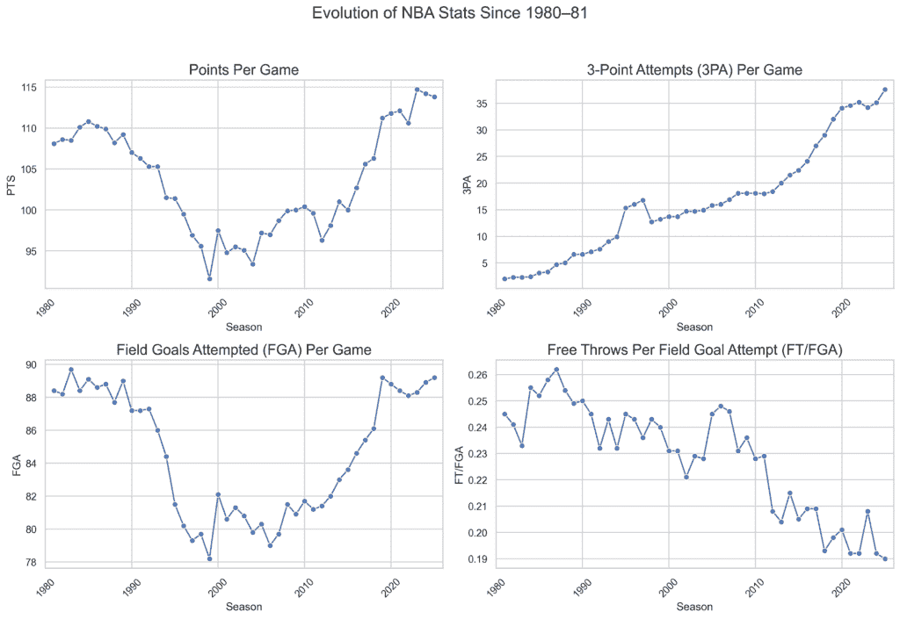
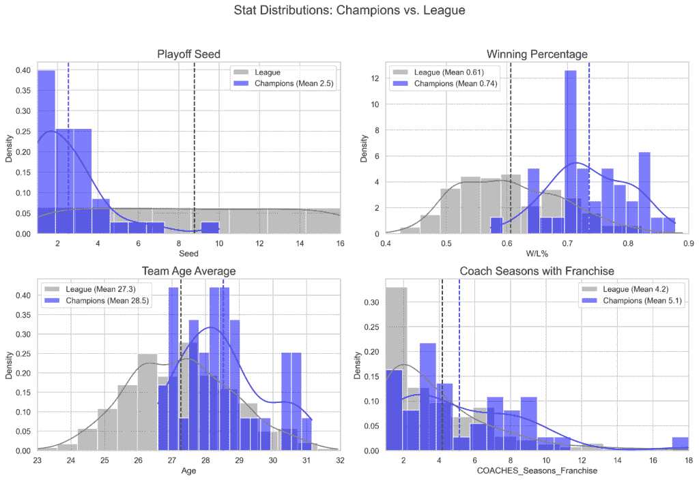
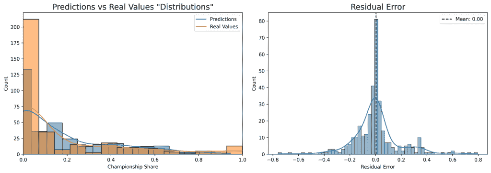
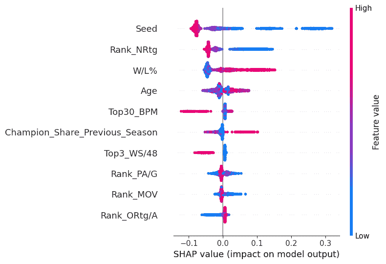
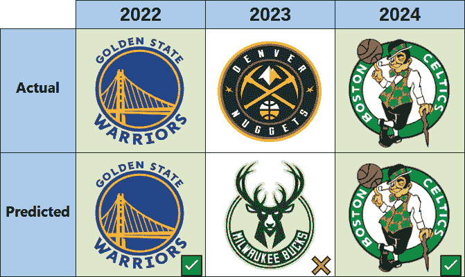
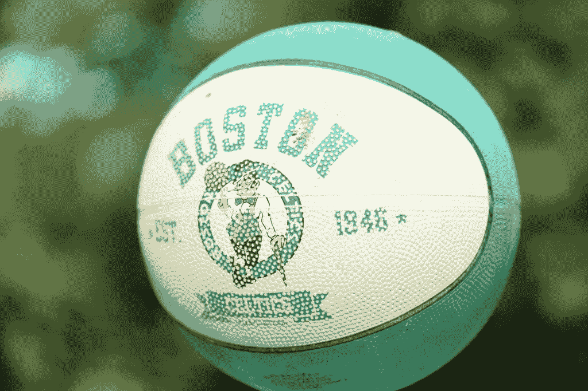
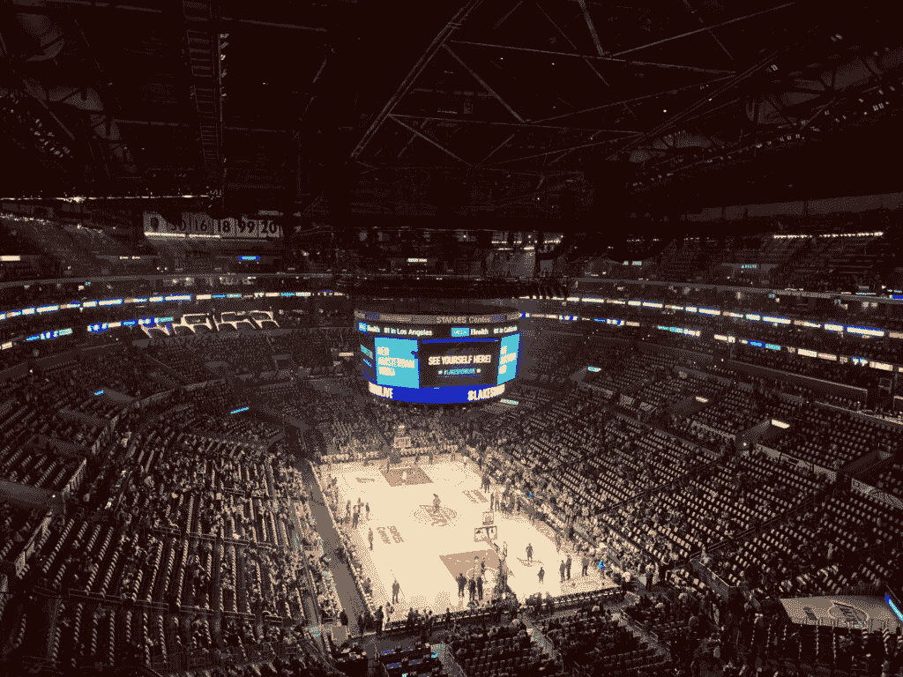

# 使用机器学习预测 NBA 冠军

> 原文：[`towardsdatascience.com/predicting-nba-champion-machine-learning/`](https://towardsdatascience.com/predicting-nba-champion-machine-learning/)

每个 NBA 赛季，30 支球队争夺只有一支球队能实现的成就：**冠军的传承**。从实力排名到交易截止日期的混乱和伤病，球迷和分析师们无休止地猜测谁将举起拉里·奥布莱恩奖杯。

但如果我们能够超越热门观点和预测，**在常规赛结束时，利用数据和机器学习来预测 NBA 冠军**呢？

在这篇文章中，我将详细介绍这个过程——从收集和准备数据，到训练和评估模型，最后使用它来预测即将到来的 2024-25 赛季的季后赛。在这个过程中，我将突出分析中出现的最令人惊讶的见解。

所有代码和数据都可在[**GitHub**](https://github.com/GabrielPastorello/NBAChampionPrediction)上找到。

* * *

## 理解问题

在开始模型训练之前，任何机器学习项目中最重要的步骤是理解问题：

**我们试图回答什么问题，以及哪些数据（和模型）可以帮助我们找到答案？**

在这种情况下，问题很简单：**谁将成为 NBA 冠军？**

一个自然的初步想法是将这个问题框架为一个**分类问题**：每个赛季的每支球队都被标记为“冠军”或“非冠军”。

但有一个问题。每年只有**一个冠军**（显然）。

因此，如果我们从过去 40 个赛季中提取数据，我们将有 40 个正面例子……以及数百个负面例子。这种正面样本的缺乏使得模型学习有意义的模式变得极其困难，特别是考虑到赢得 NBA 冠军是如此罕见的事件，我们根本就没有足够的历史数据——我们不是在处理 20,000 个赛季。这种稀缺性使得任何分类模型真正理解区分冠军和其他球队的因素变得极其困难。

我们需要一种更智能的方式来构建问题。

为了帮助模型理解什么造就了冠军，同时教它什么造就了几乎成为冠军的东西——以及这和第一轮就被淘汰的球队有何不同。换句话说，我们希望模型学习季后赛中的**成功程度**，而不仅仅是简单的胜负结果。

这引导我提出了**冠军份额**的概念——一支球队在季后赛中赢得的胜利占总冠军所需胜利的比例。

从 2003 年开始，需要**16 场胜利**才能成为 NBA 冠军。然而，在 1984 年至 2002 年之间，第一轮是五局三胜制，因此在那段时间里，总共需要的胜利数是**15 场**。

在第一轮就输掉的球队可能有 0 或 1 场胜利（冠军份额=1/16），而进入决赛但输掉的球队可能有 14 场胜利（冠军份额=14/16）。冠军拥有完整的份额 1.0。

> [@勇士队](https://twitter.com/warriors?ref_src=twsrc%5Etfw)赢得了 NBA 冠军 🏆
> 
> 最后看看由 Google Pixel 呈现的 2021-22 赛季[#NBAPlayoffs](https://twitter.com/hashtag/NBAPlayoffs?src=hash&ref_src=twsrc%5Etfw)的赛程。[图片推文](https://t.co/IHU72Kr8AN)
> 
> — NBA (@NBA) [2022 年 6 月 17 日](https://twitter.com/NBA/status/1537668694784065538?ref_src=twsrc%5Etfw)

2021 年季后赛的季后赛赛程示例

这将任务重新定义为**回归问题**，其中模型预测一个介于 0 和 1 之间的连续值——代表每个球队接近赢得一切的程度。

在这种设置中，预测值最高的球队是我们模型选择的 NBA 冠军。

这与我之前文章中的**MVP 预测**类似的方法。

> [使用机器学习预测 NBA 最有价值球员](https://towardsdatascience.com/predicting-the-nba-mvp-with-machine-learning-c3e5b755f42e/)

## 数据

篮球——尤其是 NBA——是数据科学中最激动人心的运动之一，这得益于大量免费可用的统计数据。对于这个项目，我使用我的 Python 包[**BRScraper**](https://github.com/GabrielPastorello/BRScraper)从[**Basketball Reference**](https://www.basketball-reference.com/)收集数据，该包允许轻松访问球员和球队数据。所有数据收集均符合网站指南和速率限制。

使用的数据包括**团队层面的统计数据**、**常规赛最终排名**（例如，胜率、种子排名），以及每个球队的**球员层面统计数据**（限于至少出场 30 场的球员）和**历史季后赛表现指标**。

然而，在处理**原始、绝对值**时，必须谨慎。例如，2023-24 赛季的**每场比赛平均得分（PPG）**为**114.2**，而 2000-01 赛季为**94.8**——增长了近**20%**。

这是因为一系列因素，但事实是，游戏在近年来发生了显著变化，由此产生的指标也是如此。

一些 NBA 每场统计数据的变化（图片由作者提供）

为了应对这种变化，这里的方法避免直接使用绝对统计数据，而是选择使用**标准化、相对指标**。例如：

+   而不是使用球队的 PPG，你可以使用他们在那个赛季的**排名**。

+   而不是计算平均得分 20+的球员数量，你可以考虑得分榜前 10 的球员数量，等等。

这使得模型能够捕捉到每个时代的**相对主导地位**，使得跨世纪的比较更有意义，从而允许包含更早的季节以丰富数据集。

用于训练和测试模型的数据来自 1984 至 2024 赛季，总计**40 个赛季**，共有 70 个变量。

在深入探讨模型本身之前，当我们将冠军球队与所有季后赛球队整体进行比较时，从探索性分析中出现了一些有趣的模式：

球队对比：冠军球队与季后赛其他球队（图片由作者提供）

冠军球队往往来自种子排名靠前且胜率较高的球队，这并不令人意外。在这个时期赢得全部比赛的战绩最差的球队是**1994-95 休斯顿火箭队**，由哈基姆·奥拉朱旺领导，常规赛战绩为 47 胜 35 负（.573），并以**第 10 支整体最佳球队**（西部第 6）的身份进入季后赛。

另一个值得注意的趋势是，冠军球队的平均年龄略高，这表明一旦季后赛开始，经验就扮演着至关重要的角色。数据库中最年轻的冠军球队平均年龄为 26.6 岁，是**1990-91 芝加哥公牛队**，而最老的是**1997-98 芝加哥公牛队**，平均年龄为 31.2 岁——这是迈克尔·乔丹王朝的第一个和最后一个冠军。

同样，那些教练在球队任职时间较长的球队在季后赛中也往往能取得更多成功。

## 建模

使用的模型是**[LightGBM](https://lightgbm.readthedocs.io/en/stable/)**，这是一种基于树的算法，被广泛认为是表格数据中最有效的几种方法之一，与 XGBoost 等其他算法并列。为此特定问题进行了一次网格搜索，以确定最佳超参数。

模型性能是通过均方根误差（**RMSE**）和确定系数（**R²**）来评估的。

你可以在我的[**之前的 MVP 文章**](https://towardsdatascience.com/predicting-the-nba-mvp-with-machine-learning-c3e5b755f42e/)中找到每个指标的公式和解释。

用于训练和测试的季节是随机选择的，但有一个约束条件，即**保留最后三个赛季作为测试集**，以便更好地评估模型在更近数据上的性能。重要的是，数据集中包括了所有球队——而不仅仅是那些有资格进入季后赛的球队——这样模型就可以在没有依赖季后赛资格的先验知识的情况下学习模式。

## 结果

在这里，我们可以看到预测值和实际值“分布”之间的比较。虽然从技术上讲这是一个直方图——因为我们处理的是一个回归问题——但它仍然作为一个视觉分布来工作，因为目标值范围在 0 到 1 之间。此外，我们还显示了每个预测的残差误差分布。

（图片由作者提供）

如我们所见，预测值和实际值遵循相似的规律，都集中在零附近——因为大多数球队都没有取得高水平的季后赛成功。这一点还得到了残差误差分布的支持，其中心在零附近，类似于正态分布。这表明模型能够捕捉并再现数据中存在的潜在模式。

在性能指标方面，最佳模型在测试数据集上实现了 0.184 的 RMSE 和 0.537 的 R²得分。

一种有效的方法是通过[**SHAP 值**](https://shap.readthedocs.io/en/latest/index.html)来可视化影响模型预测的关键变量，这是一种提供每个特征如何影响模型预测的合理解释的技术。

再次，关于 SHAP 及其图表的解释可以更深入地了解，请参阅[**使用机器学习预测 NBA 最有价值球员**](https://towardsdatascience.com/predicting-the-nba-mvp-with-machine-learning-c3e5b755f42e/)。

SHAP 图表（作者：本人）

从 SHAP 图表中，我们可以得出几个重要的见解：

+   **种子**和**胜负率**是前三名最具影响力的特征，突出了常规赛球队表现的重要性。

+   团队层面的统计数据，如**净胜分 (NRtg**)、**对手每场比赛得分 (PA/G**)、**胜利差 (MOV**)和**调整进攻效率 (ORtg/A**)，在塑造季后赛成功方面也起着重要作用。

+   在球员层面，高级指标尤为突出：**Box Plus/Minus (BPM**) 排名前 30 的球员数量和**每 48 分钟胜分 (WS/48**) 排名前三的球员是其中最具影响力的。

有趣的是，该模型还捕捉到了更广泛的趋势——平均年龄较高的球队往往在季后赛中表现更好，而前一个赛季的出色表现通常与未来的成功相关。这两种模式再次表明，**经验**在追求冠军的过程中是一种宝贵的资产。

让我们现在更深入地看看该模型在**预测过去三个 NBA 冠军**方面的表现：

过去三年的预测（作者：本人）

该模型正确预测了**过去三个 NBA 冠军中的两个**。唯一的失误是在 2023 年，当时它倾向于**密尔沃基雄鹿队**。那个赛季，密尔沃基常规赛战绩最佳，为 58 胜 24 负（.707），但 Giannis Antetokounmpo 的**伤病**影响了他们的季后赛征程。雄鹿队在首轮以 4-1 被迈阿密热火队淘汰，后者晋级决赛——这对两年前刚刚夺冠的密尔沃基来说是一个令人惊讶和失望的季后赛结局。

### 2025 年季后赛预测

对于即将到来的 2025 年季后赛，该模型预测**波士顿凯尔特人队**将卫冕，而**OKC**和**克利夫兰**紧随其后。

他们的常规赛表现强劲（61 胜 21 负，东部第二种子）并且他们是卫冕冠军，我倾向于同意这一点。他们结合了**当前表现**和**最近的季后赛成功**。

然而，正如我们所知，在体育中任何事情都可能发生——我们只有在六月底才能得到真正的答案。

（照片由 [Richard Burlton](https://unsplash.com/@richardworks) 在 [Unsplash](https://unsplash.com) 提供）

## 结论

这个项目展示了机器学习如何应用于复杂、动态的环境，如体育。使用涵盖四十年篮球历史的数据库，该模型能够揭示推动季后赛成功的关键模式。除了预测之外，像 SHAP 这样的工具使我们能够解释模型的决策，并更好地理解有助于季后赛成功的因素。

在这个问题中最大的挑战之一是考虑到**伤病**。它们可以完全改变季后赛的格局——尤其是在季后赛或常规赛后期影响明星球员时。理想情况下，我们可以结合伤病历史和可用性数据来更好地考虑这一点。不幸的是，关于这个问题的持续和结构化开放数据——特别是对于建模所需的粒度——很难找到。因此，这仍然是模型的一个盲点：它假设所有球队都处于满员状态，这通常并非事实。

虽然没有模型能够完美预测体育中的混乱和不可预测性，但这项分析表明，数据驱动的方法可以接近这一点。随着 2025 年季后赛的展开，将非常有趣地看到预测如何保持稳定——以及比赛还隐藏着哪些惊喜。

（照片由 [Tim Hart](https://unsplash.com/@timhart0421) 在 [Unsplash](https://unsplash.com) 提供）

* * *

我始终在我的频道上可用（[**LinkedIn**](https://www.linkedin.com/in/gabriel-speranza-pastorello/) 和 [**GitHub**](https://github.com/GabrielPastorello/)）。

感谢您的关注！👏

**加布里埃尔·斯佩兰扎·帕斯托雷洛**
